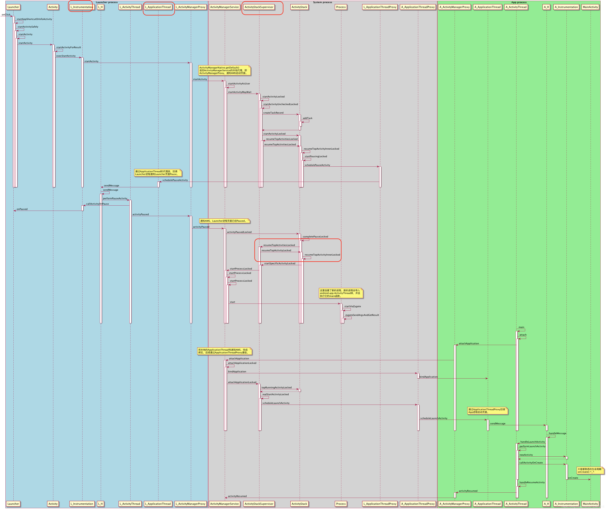
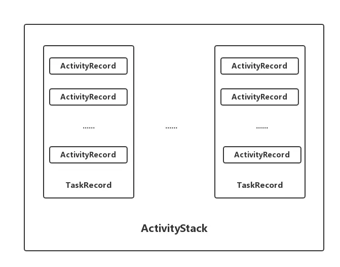
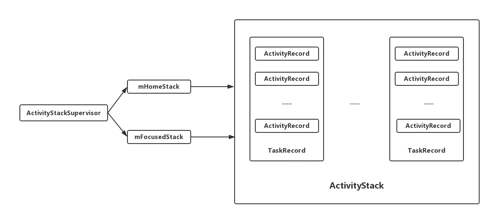
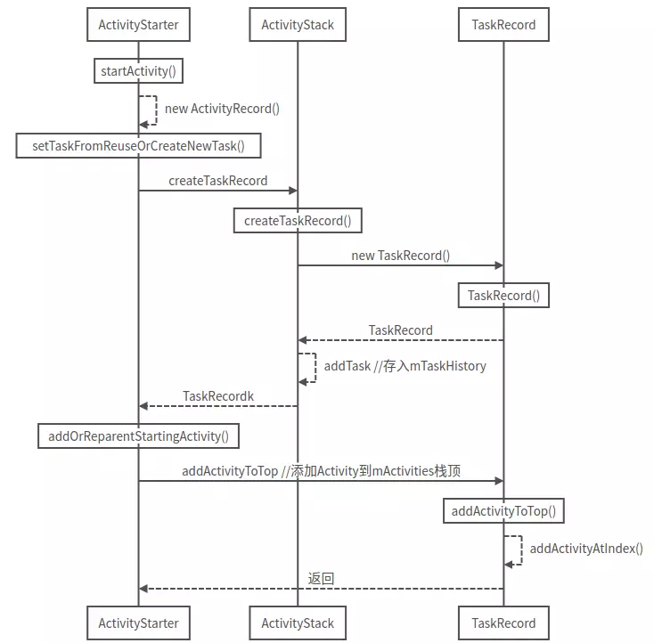
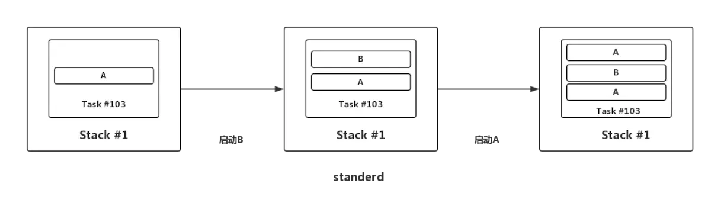
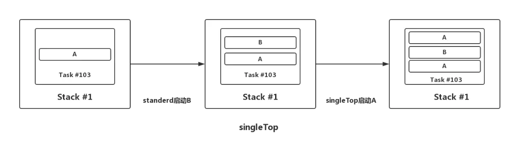
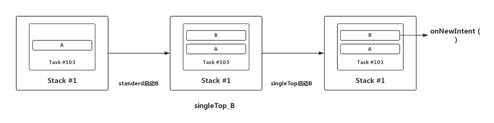
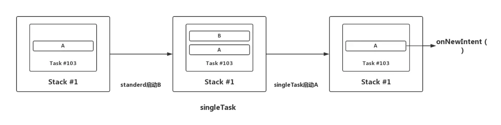
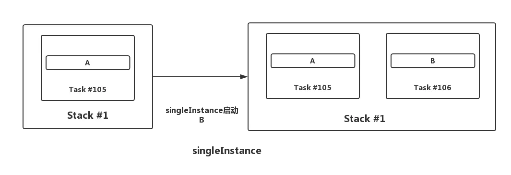

# Activity启动流程分析

## 涉及到的类的说明

- ActivityStack：Activity在AMS的栈管理，用来记录已经启动的Activity的先后关系，状态信息等。通过ActivityStack决定是否需要启动新的进程。

- ActivityThread：ActivityThread 运行在UI线程（主线程），App的真正入口。

- ApplicationThread：用来实现AMS和ActivityThread之间的交互。

- ApplicationThreadProxy：ApplicationThread 在服务端的代理。AMS就是通过该代理与ActivityThread进行通信的。

- IActivityManager：继承与IInterface接口，抽象出跨进程通信需要实现的功能

- AMN：运行在server端（SystemServer进程）。实现了Binder类，具体功能由子类AMS实现。

- AMS：AMN的子类，负责管理四大组件和进程，包括生命周期和状态切换。AMS因为要和ui交互，所以极其复杂，涉及window。

- AMP：AMS的client端代理（app进程）。了解Binder知识可以比较容易理解server端的stub和client端的proxy。AMP和AMS通过Binder通信。

- Instrumentation：仪表盘，负责调用Activity和Application生命周期。测试用到这个类比较多。

- ActivityStackSupervisor负责所有Activity栈的管理。

  内部管理了mHomeStack、mFocusedStack和mLastFocusedStack三个Activity栈。其中，mHomeStack管理的是Launcher相关的Activity栈；mFocusedStack管理的是当前显示在前台Activity的Activity栈；mLastFocusedStack管理的是上一次显示在前台Activity的Activity栈。

## 流程图一


## 流程图二
 


## 参考函数流程

Activity启动流程（从Launcher开始）：

第一阶段： Launcher通知AMS要启动新的Activity（在Launcher所在的进程执行）

- Launcher.startActivitySafely //首先Launcher发起启动Activity的请求

- Activity.startActivity

- Activity.startActivityForResult

- Instrumentation.execStartActivity //交由Instrumentation代为发起请求

- ActivityManager.getService().startActivity //通过IActivityManagerSingleton.get()得到一个AMP代理对象

- ActivityManagerProxy.startActivity //通过AMP代理通知AMS启动activity

第二阶段：AMS先校验一下Activity的正确性，如果正确的话，会暂存一下Activity的信息。然后，AMS会通知Launcher程序pause Activity（在AMS所在进程执行）

- ActivityManagerService.startActivity

- ActivityManagerService.startActivityAsUser

- ActivityStackSupervisor.startActivityMayWait

- ActivityStackSupervisor.startActivityLocked ：检查有没有在AndroidManifest中注册

- ActivityStackSupervisor.startActivityUncheckedLocked

- ActivityStack.startActivityLocked ：判断是否需要创建一个新的任务来启动Activity。

- ActivityStack.resumeTopActivityLocked ：获取栈顶的activity，并通知Launcher应该pause掉这个Activity以便启动新的activity。

- ActivityStack.startPausingLocked

- ApplicationThreadProxy.schedulePauseActivity

第三阶段： pause Launcher的Activity，并通知AMS已经paused（在Launcher所在进程执行）

- ApplicationThread.schedulePauseActivity

- ActivityThread.queueOrSendMessage

- H.handleMessage

- ActivityThread.handlePauseActivity

- ActivityManagerProxy.activityPaused

第四阶段：检查activity所在进程是否存在，如果存在，就直接通知这个进程，在该进程中启动Activity；不存在的话，会调用Process.start创建一个新进程（执行在AMS进程）

- ActivityManagerService.activityPaused

- ActivityStack.activityPaused

- ActivityStack.completePauseLocked

- ActivityStack.resumeTopActivityLocked

- ActivityStack.startSpecificActivityLocked

- ActivityManagerService.startProcessLocked

- Process.start //在这里创建了新进程，新的进程会导入ActivityThread类，并执行它的main函数

第五阶段： 创建ActivityThread实例，执行一些初始化操作，并绑定Application。如果Application不存在，会调用LoadedApk.makeApplication创建一个新的Application对象。之后进入Loop循环。（执行在新创建的app进程）

- ActivityThread.main

- ActivityThread.attach(false) //声明不是系统进程

- ActivityManagerProxy.attachApplication

第六阶段：处理新的应用进程发出的创建进程完成的通信请求，并通知新应用程序进程启动目标Activity组件（执行在AMS进程）

- ActivityManagerService.attachApplication //AMS绑定本地ApplicationThread对象，后续通过ApplicationThreadProxy来通信。

- ActivityManagerService.attachApplicationLocked

- ActivityStack.realStartActivityLocked //真正要启动Activity了！

- ApplicationThreadProxy.scheduleLaunchActivity //AMS通过ATP通知app进程启动Activity

第七阶段： 加载MainActivity类，调用onCreate声明周期方法（执行在新启动的app进程）

- ApplicationThread.scheduleLaunchActivity //ApplicationThread发消息给AT

- ActivityThread.queueOrSendMessage

- H.handleMessage //AT的Handler来处理接收到的LAUNCH_ACTIVITY的消息

- ActivityThread.handleLaunchActivity

- ActivityThread.performLaunchActivity

- Instrumentation.newActivity //调用Instrumentation类来新建一个Activity对象

- Instrumentation.callActivityOnCreate

- MainActivity.onCreate

- ActivityThread.handleResumeActivity

- AMP.activityResumed

- AMS.activityResumed(AMS进程)


# ActivityRecord、TaskRecord、ActivityStack的关系

原作者 -- [传送门](https://www.jianshu.com/p/94816e52cd77)


开局一张图

  

## 代码分析

### ActivityRecord

源码中的注释介绍：An entry in the history stack, representing an activity.
翻译：历史栈中的一个条目，代表一个activity。

文件位置：`frameworks/base/services/core/java/com/android/server/am/ActivityRecord.java`

```java
    final class ActivityRecord extends ConfigurationContainer implements AppWindowContainerListener {

        final ActivityManagerService service; // owner
        final IApplicationToken.Stub appToken; // window manager token
        AppWindowContainerController mWindowContainerController;
        final ActivityInfo info; // all about me
        final ApplicationInfo appInfo; // information about activity's app
        
        //省略其他成员变量………………
        
        //ActivityRecord所在的TaskRecord
        private TaskRecord task;        // the task this is in.
        
        //构造方法，需要传递大量信息
        ActivityRecord(ActivityManagerService _service, ProcessRecord _caller, int _launchedFromPid, int _launchedFromUid, String _launchedFromPackage, Intent _intent, String _resolvedType, ActivityInfo aInfo, Configuration _configuration, com.android.server.am.ActivityRecord _resultTo, String _resultWho, int _reqCode, boolean _componentSpecified, boolean _rootVoiceInteraction, ActivityStackSupervisor supervisor, ActivityOptions options, com.android.server.am.ActivityRecord sourceRecord) {
        
        }
    }
```

- 实际上，`ActivityRecord`中存在着大量的成员变量，包含了一个`Activity`的所有信息。
-  `ActivityRecord`中的成员变量`task`表示其所在的`TaskRecord`，由此可以看出：`ActivityRecord`与`TaskRecord`建立了联系。

`startActivity()`时会创建一个`ActivityRecord`：

```java
    frameworks/base/services/core/java/com/android/server/am/ActivityStarter.java

    class ActivityStarter {
        private int startActivity(IApplicationThread caller, Intent intent, Intent ephemeralIntent, String resolvedType, ActivityInfo aInfo, ResolveInfo rInfo, IVoiceInteractionSession voiceSession, IVoiceInteractor voiceInteractor, IBinder resultTo, String resultWho, int requestCode, int callingPid, int callingUid, String callingPackage, int realCallingPid, int realCallingUid, int startFlags, ActivityOptions options, boolean ignoreTargetSecurity, boolean componentSpecified, com.android.server.am.ActivityRecord[] outActivity, TaskRecord inTask) {
            //其他代码略………………
            ActivityRecord r = new ActivityRecord(mService, callerApp, callingPid, callingUid, callingPackage, intent, resolvedType, aInfo, mService.getGlobalConfiguration(), resultRecord, resultWho, requestCode, componentSpecified, voiceSession != null, mSupervisor, options, sourceRecord);
            //其他代码略………………
        }
    }
```

### TaskRecord

`TaskRecord`，内部维护一个`ArrayList`用来保存`ActivityRecord`。

文件位置：`frameworks/base/services/core/java/com/android/server/am/TaskRecord.java`

```java
    final class TaskRecord extends ConfigurationContainer implements TaskWindowContainerListener {
        final int taskId;       //任务ID
        final ArrayList<ActivityRecord> mActivities;   //使用一个ArrayList来保存所有的ActivityRecord
        private ActivityStack mStack;   //TaskRecord所在的ActivityStack
        
        //构造方法
        TaskRecord(ActivityManagerService service, int _taskId, ActivityInfo info, Intent _intent, IVoiceInteractionSession _voiceSession, IVoiceInteractor _voiceInteractor, int type) {
            
        }
        
        //添加Activity到顶部
        void addActivityToTop(com.android.server.am.ActivityRecord r) {
            addActivityAtIndex(mActivities.size(), r);
        }
        
        //添加Activity到指定的索引位置
        void addActivityAtIndex(int index, ActivityRecord r) {
            //...

            r.setTask(this);//为ActivityRecord设置TaskRecord，就是这里建立的联系

            //...
            
            index = Math.min(size, index);
            mActivities.add(index, r);//添加到mActivities
            
            //...
        }

        //其他代码略
    }
```

- 可以看到`TaskRecord`中使用了一个ArrayList来保存所有的`ActivityRecord`。
- 同样，`TaskRecord`中的`mStack`表示其所在的`ActivityStack`。

`startActivity()`时也会创建一个`TaskRecord`：

文件位置：`frameworks/base/services/core/java/com/android/server/am/ActivityStarter.java`

```java
    class ActivityStarter {

        private int setTaskFromReuseOrCreateNewTask(TaskRecord taskToAffiliate, int preferredLaunchStackId, ActivityStack topStack) {
            mTargetStack = computeStackFocus(mStartActivity, true, mLaunchBounds, mLaunchFlags, mOptions);

            if (mReuseTask == null) {
                //创建一个createTaskRecord，实际上是调用ActivityStack里面的createTaskRecord（）方法，ActivityStack下面会讲到
                final TaskRecord task = mTargetStack.createTaskRecord(mSupervisor.getNextTaskIdForUserLocked(mStartActivity.userId), mNewTaskInfo != null ? mNewTaskInfo : mStartActivity.info, mNewTaskIntent != null ? mNewTaskIntent : mIntent, mVoiceSession, mVoiceInteractor, !mLaunchTaskBehind /* toTop */, mStartActivity.mActivityType);

                //其他代码略
            }
        }
    }
```

### ActivityStack

`ActivityStack`,内部维护了一个`ArrayList`，用来管理`TaskRecord`。

文件位置：`frameworks/base/services/core/java/com/android/server/am/ActivityStack.java`

```java
    class ActivityStack<T extends StackWindowController> extends ConfigurationContainer implements StackWindowListener {

        private final ArrayList<TaskRecord> mTaskHistory = new ArrayList<>();//使用一个ArrayList来保存TaskRecord

        final int mStackId;

        protected final ActivityStackSupervisor mStackSupervisor;//持有一个ActivityStackSupervisor，所有的运行中的ActivityStacks都通过它来进行管理
        
        //构造方法
        ActivityStack(ActivityStackSupervisor.ActivityDisplay display, int stackId, ActivityStackSupervisor supervisor, RecentTasks recentTasks, boolean onTop) {

        }
        
        TaskRecord createTaskRecord(int taskId, ActivityInfo info, Intent intent, IVoiceInteractionSession voiceSession, IVoiceInteractor voiceInteractor, boolean toTop, int type) {
            //创建一个task
            TaskRecord task = new TaskRecord(mService, taskId, info, intent, voiceSession, voiceInteractor, type);
            
            //将task添加到ActivityStack中去
            addTask(task, toTop, "createTaskRecord");

            //其他代码略

            return task;
        }
        
        //添加Task
        void addTask(final TaskRecord task, final boolean toTop, String reason) {

            addTask(task, toTop ? MAX_VALUE : 0, true /* schedulePictureInPictureModeChange */, reason);

            //其他代码略
        }

        //添加Task到指定位置
        void addTask(final TaskRecord task, int position, boolean schedulePictureInPictureModeChange, String reason) {
            mTaskHistory.remove(task);//若存在，先移除
            
            //...
            
            mTaskHistory.add(position, task);//添加task到mTaskHistory
            task.setStack(this);//为TaskRecord设置ActivityStack

            //...
        }
        
        //其他代码略
    }
```

- 可以看到`ActivityStack`使用了一个`ArrayList`来保存`TaskRecord`。
- 另外，`ActivityStack`中还持有`ActivityStackSupervisor`对象，这个是用来管理`ActivityStacks`的。

`ActivityStack`是由`ActivityStackSupervisor`来创建的，实际`ActivityStackSupervisor`就是用来管理`ActivityStack`的，继续看下面的`ActivityStackSupervisor`分析。

### ActivityStackSupervisor

`ActivityStackSupervisor`，顾名思义，就是用来管理`ActivityStack`的。

文件位置：`frameworks/base/services/core/java/com/android/server/am/ActivityStackSupervisor.java`

```java
    public class ActivityStackSupervisor extends ConfigurationContainer implements DisplayListener {

        ActivityStack mHomeStack;//管理的是Launcher相关的任务

        ActivityStack mFocusedStack;//管理非Launcher相关的任务
        
        //创建ActivityStack
        ActivityStack createStack(int stackId, ActivityStackSupervisor.ActivityDisplay display, boolean onTop) {
            switch (stackId) {
                case PINNED_STACK_ID:
                    //PinnedActivityStack是ActivityStack的子类
                    return new PinnedActivityStack(display, stackId, this, mRecentTasks, onTop);
                default:
                    //创建一个ActivityStack
                    return new ActivityStack(display, stackId, this, mRecentTasks, onTop);
            }
        }

    }
```

-  `ActivityStackSupervisor`内部有两个不同的`ActivityStack`对象：`mHomeStack`、`mFocusedStack`，用来管理不同的任务。
-  `ActivityStackSupervisor`内部包含了创建`ActivityStack`对象的方法。

AMS初始化时会创建一个`ActivityStackSupervisor`对象。

### 总览图

  


## 启动流程图

  


简单总结：
 1.`startActivity`时首先会创建一个`ActivityRecord`。
 2.如果有需要，会创建一个`TaskRecord`，并把这个`TaskRecord`加入到`ActivityStack`中。
 3.将`ActivityRecord`添加到`TaskRecord`的栈顶。


# 启动模式

相信看完上面的介绍，现在再来看启动模式那是so easy了。

## 1、 standerd

> 默认模式，每次启动Activity都会创建一个新的Activity实例。

比如：现在有个A Activity,我们在A上面启动B，再然后在B上面启动A，其过程如图所示：



## 2、 singleTop

> 如果要启动的Activity已经在栈顶，则不会重新创建Activity，只会调用该该Activity的`onNewIntent()`方法。
>  如果要启动的Activity不在栈顶，则会重新创建该Activity的实例。

比如：现在有个A Activity,我们在A以`standerd`模式上面启动B，然后在B上面以`singleTop`模式启动A，其过程如图所示，这里会新创建一个A实例：




如果在B上面以`singleTop`模式启动B的话，则不会重新创建B，只会调用`onNewIntent()`方法，其过程如图所示：
 




## 3、 singleTask

> 如果要启动的Activity已经存在于它想要归属的栈中，那么不会创建该Activity实例，将栈中位于该Activity上的所有的Activity出栈，同时该Activity的`onNewIntent()`方法会被调用。
>  如果要启动的Activity不存在于它想要归属的栈中，并且该栈存在，则会创建该Activity的实例。
>  如果要启动的Activity想要归属的栈不存在，则首先要创建一个新栈，然后创建该Activity实例并压入到新栈中。

比如：现在有个A Activity，我们在A以`standerd`模式上面启动B，然后在B上面以`singleTask`模式启动A，其过程如图所示：




## 4、 singleInstance

> 基本和`singleTask`一样，不同的是启动Activity时，首先要创建在一个新栈，然后创建该Activity实例并压入新栈中，新栈中只会存在这一个Activity实例。

比如：现在有个A Activity,我们在A以`singleInstance`模式上面启动B，其过程如图所示：




