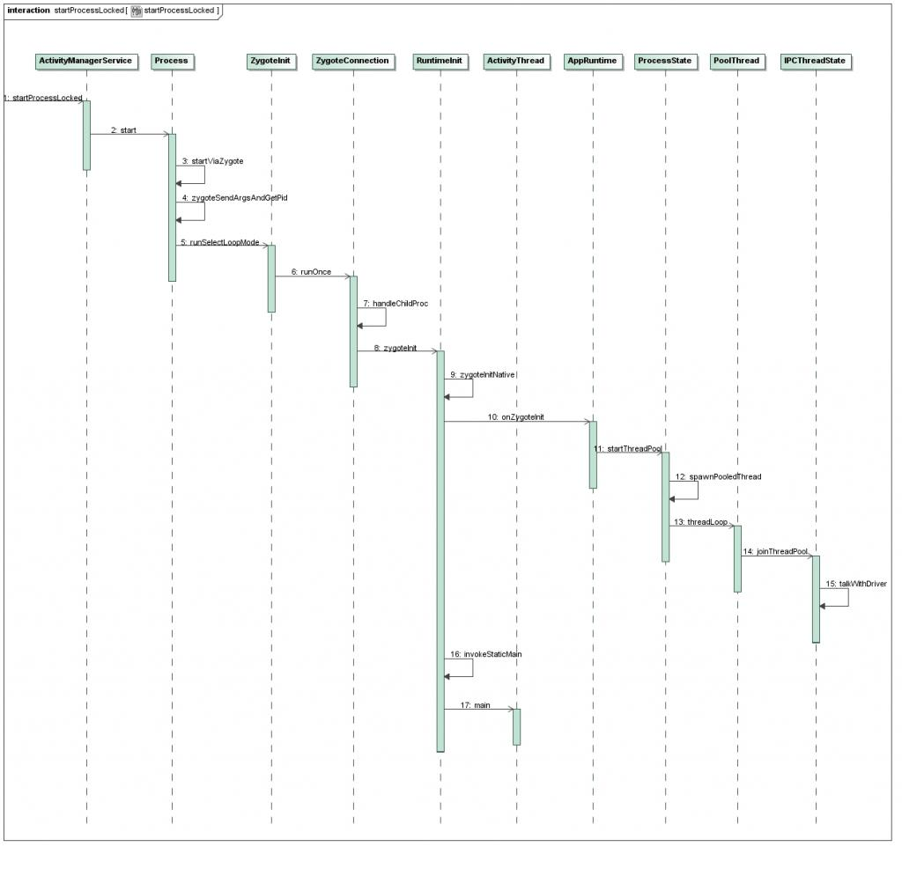
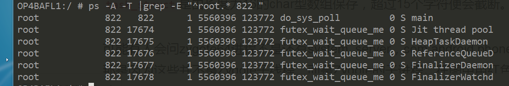
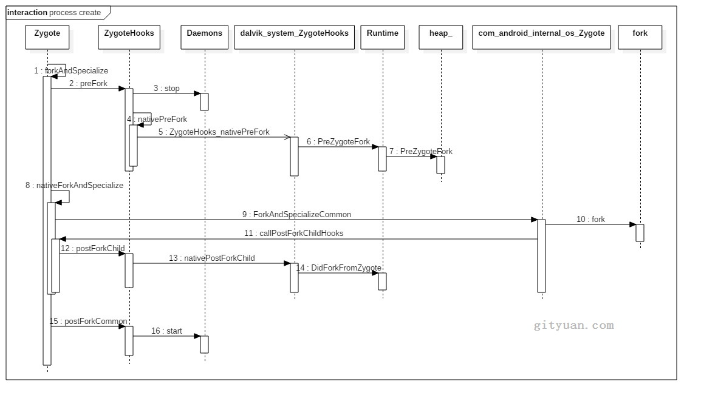

# 进程创建流程

## 涉及到的源码及目录

```
/frameworks/base/core/java/com/android/internal/os/
	- ZygoteInit.java
	- ZygoteServer.java
	- ZygoteConnection.java
	- RuntimeInit.java
	- Zygote.java

/frameworks/base/core/java/android/os/Process.java
/frameworks/base/core/java/android/os/ZygoteProcess.java
/frameworks/base/core/jni/com_android_internal_os_Zygote.cpp
/frameworks/base/core/jni/AndroidRuntime.cpp
/frameworks/base/cmds/app_process/App_main.cpp （内含AppRuntime类）

/bionic/libc/bionic/fork.cpp
/bionic/libc/bionic/pthread_atfork.cpp

/libcore/dalvik/src/main/java/dalvik/system/ZygoteHooks.java
/libcore/libart/src/main/java/java/lang/Daemons.java
/art/runtime/native/dalvik_system_ZygoteHooks.cc
/art/runtime/Runtime.cc
/art/runtime/Thread.cc
/art/runtime/signal_catcher.cc
```

## 进程创建图


图解：

1. **App发起进程**：当从桌面启动应用，则发起进程便是Launcher所在进程；当从某App内启动远程进程，则发送进程便是该App所在进程。发起进程先通过binder发送消息给system_server进程；
2. **system_server进程**：调用Process.start()方法，通过socket向zygote进程发送创建新进程的请求；
3. **zygote进程**：在执行`ZygoteInit.main()`后便进入`runSelectLoop()`循环体内，当有客户端连接时便会执行ZygoteConnection.runOnce()方法，再经过层层调用后fork出新的应用进程；
4. **新进程**：执行handleChildProc方法，最后调用ActivityThread.main()方法。


## 流程时序图




## system_server发起请求

### 1. Process.start

```java
/**
 * Start a new process.
 * 
 * <p>If processes are enabled, a new process is created and the
 * static main() function of a <var>processClass</var> is executed there.
 * The process will continue running after this function returns.
 * 
 * <p>If processes are not enabled, a new thread in the caller's
 * process is created and main() of <var>processClass</var> called there.
 * 
 * <p>The niceName parameter, if not an empty string, is a custom name to
 * give to the process instead of using processClass.  This allows you to
 * make easily identifyable processes even if you are using the same base
 * <var>processClass</var> to start them.
 * 
 * When invokeWith is not null, the process will be started as a fresh app
 * and not a zygote fork. Note that this is only allowed for uid 0 or when
 * runtimeFlags contains DEBUG_ENABLE_DEBUGGER.
 *
 * @param processClass The class to use as the process's main entry
 *                     point.
 * @param niceName A more readable name to use for the process.
 * @param uid The user-id under which the process will run.
 * @param gid The group-id under which the process will run.
 * @param gids Additional group-ids associated with the process.
 * @param runtimeFlags Additional flags for the runtime.
 * @param targetSdkVersion The target SDK version for the app.
 * @param seInfo null-ok SELinux information for the new process.
 * @param abi non-null the ABI this app should be started with.
 * @param instructionSet null-ok the instruction set to use.
 * @param appDataDir null-ok the data directory of the app.
 * @param invokeWith null-ok the command to invoke with.
 * @param packageName null-ok the name of the package this process belongs to.
 * @param zygotePolicyFlags Flags used to determine how to launch the application
 * @param isTopApp whether the process starts for high priority application.
 * @param disabledCompatChanges null-ok list of disabled compat changes for the process being
 *                             started.
 * @param pkgDataInfoMap Map from related package names to private data directory
 *                       volume UUID and inode number.
 * @param whitelistedDataInfoMap Map from whitelisted package names to private data directory
 *                       volume UUID and inode number.
 * @param bindMountAppsData whether zygote needs to mount CE and DE data.
 * @param bindMountAppStorageDirs whether zygote needs to mount Android/obb and Android/data.
 * @param zygoteArgs Additional arguments to supply to the zygote process.
 * @return An object that describes the result of the attempt to start the process.
 * @throws RuntimeException on fatal start failure
 *
 * {@hide}
 */
public static ProcessStartResult start(@NonNull final String processClass,
                                       @Nullable final String niceName,
                                       int uid, int gid, @Nullable int[] gids,
                                       int runtimeFlags,
                                       int mountExternal,
                                       int targetSdkVersion,
                                       @Nullable String seInfo,
                                       @NonNull String abi,
                                       @Nullable String instructionSet,
                                       @Nullable String appDataDir,
                                       @Nullable String invokeWith,
                                       @Nullable String packageName,
                                       int zygotePolicyFlags,
                                       boolean isTopApp,
                                       @Nullable long[] disabledCompatChanges,
                                       @Nullable Map<String, Pair<String, Long>>
                                       pkgDataInfoMap,
                                       @Nullable Map<String, Pair<String, Long>>
                                       whitelistedDataInfoMap,
                                       boolean bindMountAppsData,
                                       boolean bindMountAppStorageDirs,
                                       @Nullable String[] zygoteArgs) {
    return ZYGOTE_PROCESS.start(processClass, niceName, uid, gid, gids,
                                runtimeFlags, mountExternal, targetSdkVersion, seInfo,
                                abi, instructionSet, appDataDir, invokeWith, packageName,
                                zygotePolicyFlags, isTopApp, disabledCompatChanges,
                                pkgDataInfoMap, whitelistedDataInfoMap, bindMountAppsData,
                                bindMountAppStorageDirs, zygoteArgs);
}
public static final ZygoteProcess ZYGOTE_PROCESS = new ZygoteProcess();
```

### 2. ZygoteProcess.start

```java
public final Process.ProcessStartResult start(@NonNull final String processClass,
                                              final String niceName,
                                              int uid, int gid, @Nullable int[] gids,
                                              int runtimeFlags, int mountExternal,
                                              int targetSdkVersion,
                                              @Nullable String seInfo,
                                              @NonNull String abi,
                                              @Nullable String instructionSet,
                                              @Nullable String appDataDir,
                                              @Nullable String invokeWith,
                                              @Nullable String packageName,
                                              int zygotePolicyFlags,
                                              boolean isTopApp,
                                              @Nullable long[] disabledCompatChanges,
                                              @Nullable Map<String, Pair<String, Long>>
                                              pkgDataInfoMap,
                                              @Nullable Map<String, Pair<String, Long>>
                                              whitelistedDataInfoMap,
                                              boolean bindMountAppsData,
                                              boolean bindMountAppStorageDirs,
                                              @Nullable String[] zygoteArgs) {
    try {
        return startViaZygote(processClass, niceName, uid, gid, gids,
                              runtimeFlags, mountExternal, targetSdkVersion, seInfo,
                              abi, instructionSet, appDataDir, invokeWith, /*startChildZygote=*/ false,
                              packageName, zygotePolicyFlags, isTopApp, disabledCompatChanges,
                              pkgDataInfoMap, whitelistedDataInfoMap, bindMountAppsData,
                              bindMountAppStorageDirs, zygoteArgs);
    } catch (ZygoteStartFailedEx ex) {
        Log.e(LOG_TAG,
              "Starting VM process through Zygote failed");
        throw new RuntimeException(
            "Starting VM process through Zygote failed", ex);
    }
}

private Process.ProcessStartResult startViaZygote(@NonNull final String processClass,
                                                  @Nullable final String niceName,
                                                  final int uid, final int gid,
                                                  @Nullable final int[] gids,
                                                  int runtimeFlags, int mountExternal,
                                                  int targetSdkVersion,
                                                  @Nullable String seInfo,
                                                  @NonNull String abi,
                                                  @Nullable String instructionSet,
                                                  @Nullable String appDataDir,
                                                  @Nullable String invokeWith,
                                                  boolean startChildZygote,
                                                  @Nullable String packageName,
                                                  int zygotePolicyFlags,
                                                  boolean isTopApp,
                                                  @Nullable long[] disabledCompatChanges,
                                                  @Nullable Map<String, Pair<String, Long>>
                                                  pkgDataInfoMap,
                                                  @Nullable Map<String, Pair<String, Long>>
                                                  whitelistedDataInfoMap,
                                                  boolean bindMountAppsData,
                                                  boolean bindMountAppStorageDirs,
                                                  @Nullable String[] extraArgs)
    throws ZygoteStartFailedEx {
    ArrayList<String> argsForZygote = new ArrayList<>();

    // --runtime-args, --setuid=, --setgid=,
    // and --setgroups= must go first
    argsForZygote.add("--runtime-args");
    argsForZygote.add("--setuid=" + uid);
    argsForZygote.add("--setgid=" + gid);
    argsForZygote.add("--runtime-flags=" + runtimeFlags);
    synchronized(mLock) {
        // The USAP pool can not be used if the application will not use the systems graphics
        // driver.  If that driver is requested use the Zygote application start path.
        return zygoteSendArgsAndGetResult(openZygoteSocketIfNeeded(abi),
                                          zygotePolicyFlags,
                                          argsForZygote);
    }
}
```

该过程主要工作是生成`argsForZygote`数组，该数组保存了进程的uid、gid、groups、target-sdk、nice-name等一系列的参数

### 3. ZygoteProcess.zygoteSendArgsAndGetResult

```java
/**
 * Sends an argument list to the zygote process, which starts a new child
 * and returns the child's pid. Please note: the present implementation
 * replaces newlines in the argument list with spaces.
 *
 * @throws ZygoteStartFailedEx if process start failed for any reason
 */
@GuardedBy("mLock")
private Process.ProcessStartResult zygoteSendArgsAndGetResult(
    ZygoteState zygoteState, int zygotePolicyFlags, @NonNull ArrayList<String> args)
    throws ZygoteStartFailedEx {
    return attemptZygoteSendArgsAndGetResult(zygoteState, msgStr);
}

private Process.ProcessStartResult attemptZygoteSendArgsAndGetResult(
    ZygoteState zygoteState, String msgStr) throws ZygoteStartFailedEx {
    try {
        final BufferedWriter zygoteWriter = zygoteState.mZygoteOutputWriter;
        final DataInputStream zygoteInputStream = zygoteState.mZygoteInputStream;

        zygoteWriter.write(msgStr);
        zygoteWriter.flush();

        // Always read the entire result from the input stream to avoid leaving
        // bytes in the stream for future process starts to accidentally stumble
        // upon.
        Process.ProcessStartResult result = new Process.ProcessStartResult();
        result.pid = zygoteInputStream.readInt();
        result.usingWrapper = zygoteInputStream.readBoolean();

        if (result.pid < 0) {
            throw new ZygoteStartFailedEx("fork() failed");
        }

        return result;
    } catch (IOException ex) {
        zygoteState.close();
        Log.e(LOG_TAG, "IO Exception while communicating with Zygote - "
              + ex.toString());
        throw new ZygoteStartFailedEx(ex);
    }
}

```

这个方法的主要功能是通过socket通道向Zygote进程发送一个参数列表，然后进入阻塞等待状态，直到远端的socket服务端发送回来新创建的进程pid才返回。

第一个参数ZygoteState参见【[2. ZygoteProcess.start](#2. ZygoteProcess.start())】，它是根据abi生成，简要来说就是从zygote孵化还是从zygote64孵化

#### 3.1. ZygoteProcess.openZygoteSocketIfNeeded

```java
/**
 * Tries to open a session socket to a Zygote process with a compatible ABI if one is not
 * already open. If a compatible session socket is already open that session socket is returned.
 * This function may block and may have to try connecting to multiple Zygotes to find the
 * appropriate one.  Requires that mLock be held.
 */
private ZygoteState openZygoteSocketIfNeeded(String abi) throws ZygoteStartFailedEx {
    try {
        attemptConnectionToPrimaryZygote();

        if (primaryZygoteState.matches(abi)) {
            return primaryZygoteState;
        }

        if (mZygoteSecondarySocketAddress != null) {
            // The primary zygote didn't match. Try the secondary.
            attemptConnectionToSecondaryZygote();

            if (secondaryZygoteState.matches(abi)) {
                return secondaryZygoteState;
            }
        }
    } catch (IOException ioe) {
        throw new ZygoteStartFailedEx("Error connecting to zygote", ioe);
    }
}
/**
 * Creates a ZygoteState for the primary zygote if it doesn't exist or has been disconnected.
 */
private void attemptConnectionToPrimaryZygote() throws IOException {
    if (primaryZygoteState == null || primaryZygoteState.isClosed()) {
        primaryZygoteState =
            ZygoteState.connect(mZygoteSocketAddress, mUsapPoolSocketAddress);

        maybeSetApiBlacklistExemptions(primaryZygoteState, false);
        maybeSetHiddenApiAccessLogSamleRate(primaryZygoteState);
    }
}
```

既然system_server进程的zygoteSendArgsAndGetResult()方法通过socket向Zygote进程发送消息，这是便会唤醒Zygote进程，来响应socket客户端的请求（即system_server端），接下来的操作便是在Zygote来创建进程。


## Zygote创建进程

Zygote进程是由由init进程而创建的，进程启动之后调用ZygoteInit.main()方法，经过创建socket管道，预加载资源后，便进程runSelectLoop()方法。

### 4. ZygoteInit.main

```java
/**
 * This is the entry point for a Zygote process.  It creates the Zygote server, loads resources,
 * and handles other tasks related to preparing the process for forking into applications.
 *
 * This process is started with a nice value of -20 (highest priority).  All paths that flow
 * into new processes are required to either set the priority to the default value or terminate
 * before executing any non-system code.  The native side of this occurs in SpecializeCommon,
 * while the Java Language priority is changed in ZygoteInit.handleSystemServerProcess,
 * ZygoteConnection.handleChildProc, and Zygote.usapMain.
 *
 * @param argv  Command line arguments used to specify the Zygote's configuration.
 */
public static void main(String argv[]) {
    Runnable caller;
    try {
        Zygote.initNativeState(isPrimaryZygote);

        ZygoteHooks.stopZygoteNoThreadCreation();

        zygoteServer = new ZygoteServer(isPrimaryZygote);

        if (startSystemServer) {
            Runnable r = forkSystemServer(abiList, zygoteSocketName, zygoteServer);

            // {@code r == null} in the parent (zygote) process, and {@code r != null} in the
            // child (system_server) process.
            if (r != null) {
                r.run();
                return;
            }
        }

        Log.i(TAG, "Accepting command socket connections");

        // The select loop returns early in the child process after a fork and
        // loops forever in the zygote.
        caller = zygoteServer.runSelectLoop(abiList);
    } catch (Throwable ex) {
        Log.e(TAG, "System zygote died with exception", ex);
        throw ex;
    } finally {
        if (zygoteServer != null) {
            zygoteServer.closeServerSocket();
        }
    }

    // We're in the child process and have exited the select loop. Proceed to execute the
    // command.
    if (caller != null) {
        caller.run();
    }
}
```

caller不为空时，此时是在子进程执行，子进程的初始化等都将在里面执行

### 5. ZygoteServer.runSelectLoop

```java
/**
 * Runs the zygote process's select loop. Accepts new connections as
 * they happen, and reads commands from connections one spawn-request's
 * worth at a time.
 */
Runnable runSelectLoop(String abiList) {
    ArrayList<FileDescriptor> socketFDs = new ArrayList<>();
    ArrayList<ZygoteConnection> peers = new ArrayList<>();

    socketFDs.add(mZygoteSocket.getFileDescriptor());
    peers.add(null);

    while (true) {
        StructPollfd[] pollFDs;
        pollFDs = new StructPollfd[socketFDs.size()];
        try {
            pollReturnValue = Os.poll(pollFDs, pollTimeoutMs);
        } catch (ErrnoException ex) {
            throw new RuntimeException("poll failed", ex);
        }
        if (pollIndex == 0) {
            // Zygote server socket

            ZygoteConnection newPeer = acceptCommandPeer(abiList);
            peers.add(newPeer);
            socketFDs.add(newPeer.getFileDescriptor());
        } else if (pollIndex < usapPoolEventFDIndex) {
            // Session socket accepted from the Zygote server socket
            try {
                ZygoteConnection connection = peers.get(pollIndex);
                final Runnable command = connection.processOneCommand(this);
            } catch (Exception e) {
            } finally {
                // Reset the child flag, in the event that the child process is a child-
                // zygote. The flag will not be consulted this loop pass after the
                // Runnable is returned.
                mIsForkChild = false;
            }
        }
    }
}
```

该方法主要功能：

- 客户端通过openZygoteSocketIfNeeded()来跟zygote进程建立连接。zygote进程收到客户端连接请求后执行accept()；然后再创建ZygoteConnection对象,并添加到fds数组列表；
- 建立连接之后，可以跟客户端通信，进入runOnce()方法来接收客户端数据，并执行进程创建工作。

#### 5.1. ZygoteServer.acceptCommandPeer

```java
/**
 * Waits for and accepts a single command connection. Throws
 * RuntimeException on failure.
 */
private ZygoteConnection acceptCommandPeer(String abiList) {
    try {
        return createNewConnection(mZygoteSocket.accept(), abiList);
    } catch (IOException ex) {
        throw new RuntimeException(
            "IOException during accept()", ex);
    }
}

protected ZygoteConnection createNewConnection(LocalSocket socket, String abiList)
    throws IOException {
    return new ZygoteConnection(socket, abiList);
}
```

接收客户端发送过来的connect()操作，Zygote作为服务端执行accept()操作。 再后面客户端调用write()写数据，Zygote进程调用read()读数据。

没有连接请求时会进入休眠状态，当有创建新进程的连接请求时，唤醒Zygote进程，创建Socket通道ZygoteConnection，然后执行ZygoteConnection的processOneCommand()方法。

### 6. ZygoteConnection.processOneCommand

```java
/**
 * Reads one start command from the command socket. If successful, a child is forked and a
 * {@code Runnable} that calls the childs main method (or equivalent) is returned in the child
 * process. {@code null} is always returned in the parent process (the zygote).
 *
 * If the client closes the socket, an {@code EOF} condition is set, which callers can test
 * for by calling {@code ZygoteConnection.isClosedByPeer}.
 */
Runnable processOneCommand(ZygoteServer zygoteServer) {
    String[] args;

    try {
        args = Zygote.readArgumentList(mSocketReader);
    } catch (IOException ex) {
        throw new IllegalStateException("IOException on command socket", ex);
    }

    int pid;
    FileDescriptor childPipeFd = null;
    FileDescriptor serverPipeFd = null;

    ZygoteArguments parsedArgs = new ZygoteArguments(args);
    /*
         * In order to avoid leaking descriptors to the Zygote child,
         * the native code must close the two Zygote socket descriptors
         * in the child process before it switches from Zygote-root to
         * the UID and privileges of the application being launched.
         *
         * In order to avoid "bad file descriptor" errors when the
         * two LocalSocket objects are closed, the Posix file
         * descriptors are released via a dup2() call which closes
         * the socket and substitutes an open descriptor to /dev/null.
         */

    int [] fdsToClose = { -1, -1 };

    FileDescriptor fd = mSocket.getFileDescriptor();

    if (fd != null) {
        fdsToClose[0] = fd.getInt$();
    }

    fd = zygoteServer.getZygoteSocketFileDescriptor();

    if (fd != null) {
        fdsToClose[1] = fd.getInt$();
    }

    pid = Zygote.forkAndSpecialize(parsedArgs.mUid, parsedArgs.mGid, parsedArgs.mGids,
                                   parsedArgs.mRuntimeFlags, rlimits, parsedArgs.mMountExternal, parsedArgs.mSeInfo,
                                   parsedArgs.mNiceName, fdsToClose, fdsToIgnore, parsedArgs.mStartChildZygote,
                                   parsedArgs.mInstructionSet, parsedArgs.mAppDataDir, parsedArgs.mIsTopApp,
                                   parsedArgs.mPkgDataInfoList, parsedArgs.mWhitelistedDataInfoList,
                                   parsedArgs.mBindMountAppDataDirs, parsedArgs.mBindMountAppStorageDirs);

    try {
        if (pid == 0) {
            // in child
            zygoteServer.setForkChild();

            zygoteServer.closeServerSocket();
            IoUtils.closeQuietly(serverPipeFd);
            serverPipeFd = null;

            return handleChildProc(parsedArgs, childPipeFd, parsedArgs.mStartChildZygote);
        } else {
            // In the parent. A pid < 0 indicates a failure and will be handled in
            // handleParentProc.
            IoUtils.closeQuietly(childPipeFd);
            childPipeFd = null;
            handleParentProc(pid, serverPipeFd);
            return null;
        }
    } finally {
        IoUtils.closeQuietly(childPipeFd);
        IoUtils.closeQuietly(serverPipeFd);
    }
}
```

### 7. Zygote.forkAndSpecialize

```java
static int forkAndSpecialize(int uid, int gid, int[] gids, int runtimeFlags,
                             int[][] rlimits, int mountExternal, String seInfo, String niceName, int[] fdsToClose,
                             int[] fdsToIgnore, boolean startChildZygote, String instructionSet, String appDataDir,
                             boolean isTopApp, String[] pkgDataInfoList, String[] whitelistedDataInfoList,
                             boolean bindMountAppDataDirs, boolean bindMountAppStorageDirs) {
    ZygoteHooks.preFork();

    int pid = nativeForkAndSpecialize(
        uid, gid, gids, runtimeFlags, rlimits, mountExternal, seInfo, niceName, fdsToClose,
        fdsToIgnore, startChildZygote, instructionSet, appDataDir, isTopApp,
        pkgDataInfoList, whitelistedDataInfoList, bindMountAppDataDirs,
        bindMountAppStorageDirs);
    // Set the Java Language thread priority to the default value for new apps.
    Thread.currentThread().setPriority(Thread.NORM_PRIORITY);

    ZygoteHooks.postForkCommon();
    return pid;
}
```

#### 7.1. Zygote进程

Zygote进程，如下图所示：



图中的第4列是进程的[VSIZE（virtual size）](http://gityuan.com/2015/10/11/ps-command/)，代表的是进程虚拟地址空间大小。线程与进程的最为本质的区别便是是否共享内存空间，图中VSIZE和Zygote进程相同的才是Zygote的子线程，否则就是Zygote的子进程。

### 8. ZygoteHooks.preFork

```java
public static void preFork() {
    Daemons.stop();  //停止4个Daemon子线程【见小节8.1】
    token = nativePreFork();  //完成gc堆的初始化工作【见小节8.3】
    waitUntilAllThreadsStopped();  //等待所有子线程结束【见小节8.2】
}
```

#### 8.1. Daemons.stop

```java
private static final Daemon[] DAEMONS = new Daemon[] {
    HeapTaskDaemon.INSTANCE,  //Java堆整理线程
    ReferenceQueueDaemon.INSTANCE,  //引用队列线程
    FinalizerDaemon.INSTANCE,  //析构线程
    FinalizerWatchdogDaemon.INSTANCE,  //析构监控线程
};
public static void stop() {
    for (Daemon daemon : DAEMONS) {
        daemon.stop();
    }
}
```

此处守护线程Stop方式是先调用目标线程interrrupt()方法，然后再调用目标线程join()方法，等待线程执行完成。

> 题外话：
>
> 为什么执着的在fork子进程前要关闭子线程呢？
>
> 在Linux中，fork的时候只复制当前线程到子进程，手册中有如下描述：
>
> The child process is created with a single thread--the one that called fork(). The entire virtual address space of the parent is replicated in the child, including the states of mutexes, condition variables, and other pthreads objects; the use of pthread_atfork(3) may be helpful for dealing with problems that this can cause.
>
> 换言之，互斥锁在多线程fork时，会产生问题。
>
> 从操作系统的角度上看，对于每一个锁都有它的持有者，即对它进行lock操作的线程。假设在fork之前，一个线程对某个锁进行的lock操作，即持有了该锁，然后另外一个线程调用了fork创建子进程。可是在子进程中持有那个锁的线程却"消失"了，从子进程的角度来看，这个锁被“永久”的上锁了，因为它的持有者“蒸发”了。
>
> 为了安全性考虑，规避持锁问题，选择单线程fork是比较合理的。

#### 8.2. ZygoteHooks.nativePreFork

nativePreFork通过JNI调用如下方法：dalvik_system_ZygoteHooks.cc

```c++
static jlong ZygoteHooks_nativePreFork(JNIEnv* env, jclass) {
  Runtime* runtime = Runtime::Current();
  CHECK(runtime->IsZygote()) << "runtime instance not started with -Xzygote";

  runtime->PreZygoteFork();

  // Grab thread before fork potentially makes Thread::pthread_key_self_ unusable.
  // 将线程转换为long型并保存到token，该过程是非安全的
  return reinterpret_cast<jlong>(ThreadForEnv(env));
}
```

```c++
void Runtime::PreZygoteFork() {
  if (GetJit() != nullptr) {
    GetJit()->PreZygoteFork(); //关闭jit线程
  }
  heap_->PreZygoteFork();
  PreZygoteForkNativeBridge();
}
```

preFork()的主要功能便是停止Zygote的4个Daemon子线程的运行，等待并确保Zygote是单线程（用于提升fork效率），并等待这些线程的停止，初始化gc堆的工作, 并将线程转换为long型并保存到token。

#### 8.3. ZygoteHooks.waitUntilAllThreadsStopped

```java
/**
 * We must not fork until we're single-threaded again. Wait until /proc shows we're
 * down to just one thread.
 */
private static void waitUntilAllThreadsStopped() {
    File tasks = new File("/proc/self/task");
    // All Java daemons are stopped already. We're just waiting for their OS counterparts to
    // finish as well. This shouldn't take much time so spinning is ok here.
    while (tasks.list().length > 1) {
        Thread.yield();
    }
}
```

### 9. Zygote.nativeForkAndSpecialize

nativeForkAndSpecialize通过JNI调用如下方法：com_android_internal_os_Zygote.cpp

```c++
static jint com_android_internal_os_Zygote_nativeForkAndSpecialize(
        JNIEnv* env, jclass, jint uid, jint gid, jintArray gids,
        jint runtime_flags, jobjectArray rlimits,
        jint mount_external, jstring se_info, jstring nice_name,
        jintArray managed_fds_to_close, jintArray managed_fds_to_ignore, jboolean is_child_zygote,
        jstring instruction_set, jstring app_data_dir, jboolean is_top_app,
        jobjectArray pkg_data_info_list, jobjectArray whitelisted_data_info_list,
        jboolean mount_data_dirs, jboolean mount_storage_dirs) {
    // 生成子进程的capabilities
    jlong capabilities = CalculateCapabilities(env, uid, gid, gids, is_child_zygote);
    // ………………
    pid_t pid = ForkCommon(env, false, fds_to_close, fds_to_ignore, true);
    if (pid == 0) {
      SpecializeCommon(env, uid, gid, gids, runtime_flags, rlimits,
                       capabilities, capabilities,
                       mount_external, se_info, nice_name, false,
                       is_child_zygote == JNI_TRUE, instruction_set, app_data_dir,
                       is_top_app == JNI_TRUE, pkg_data_info_list,
                       whitelisted_data_info_list,
                       mount_data_dirs == JNI_TRUE,
                       mount_storage_dirs == JNI_TRUE);
    }
    return pid;
}
```

### 10. com_android_internal_os_Zygote.ForkCommon

```c++
// Utility routine to fork a process from the zygote.
static pid_t ForkCommon(JNIEnv* env, bool is_system_server,
                        const std::vector<int>& fds_to_close,
                        const std::vector<int>& fds_to_ignore,
                        bool is_priority_fork) {
  /* 
  	设置子进程的signal信号处理函数
    ？会多次设置？
    SetSignalHandlers函数头有注释，解释了原因：
    1 zygote需要fork别的进程所以不能提前设置，仅给system_server和接下来的app设置
    2 重复设置的伤害很低
  */
  SetSignalHandlers();

  // Curry a failure function.
  auto fail_fn = std::bind(ZygoteFailure, env, is_system_server ? "system_server" : "zygote",
                           nullptr, _1);

  // Temporarily block SIGCHLD during forks. The SIGCHLD handler might
  // log, which would result in the logging FDs we close being reopened.
  // This would cause failures because the FDs are not whitelisted.
  //
  // Note that the zygote process is single threaded at this point.
  BlockSignal(SIGCHLD, fail_fn);

  // Close any logging related FDs before we start evaluating the list of
  // file descriptors.
  __android_log_close();
  AStatsSocket_close();

  // If this is the first fork for this zygote, create the open FD table.  If
  // it isn't, we just need to check whether the list of open files has changed
  // (and it shouldn't in the normal case).
  if (gOpenFdTable == nullptr) {
    gOpenFdTable = FileDescriptorTable::Create(fds_to_ignore, fail_fn);
  } else {
    gOpenFdTable->Restat(fds_to_ignore, fail_fn);
  }

  android_fdsan_error_level fdsan_error_level = android_fdsan_get_error_level();

  // Purge unused native memory in an attempt to reduce the amount of false
  // sharing with the child process.  By reducing the size of the libc_malloc
  // region shared with the child process we reduce the number of pages that
  // transition to the private-dirty state when malloc adjusts the meta-data
  // on each of the pages it is managing after the fork.
  mallopt(M_PURGE, 0);

  pid_t pid = fork();

  if (pid == 0) {
    if (is_priority_fork) {
      setpriority(PRIO_PROCESS, 0, PROCESS_PRIORITY_MAX);
    } else {
      setpriority(PRIO_PROCESS, 0, PROCESS_PRIORITY_MIN);
    }

    // The child process.
    PreApplicationInit();

    // Clean up any descriptors which must be closed immediately
    DetachDescriptors(env, fds_to_close, fail_fn);

    // Invalidate the entries in the USAP table.
    ClearUsapTable();

    // Re-open all remaining open file descriptors so that they aren't shared
    // with the zygote across a fork.
    gOpenFdTable->ReopenOrDetach(fail_fn);

    // Turn fdsan back on.
    android_fdsan_set_error_level(fdsan_error_level);

    // Reset the fd to the unsolicited zygote socket
    gSystemServerSocketFd = -1;
  } else {
    ALOGD("Forked child process %d", pid);
  }

  // We blocked SIGCHLD prior to a fork, we unblock it here.
  UnblockSignal(SIGCHLD, fail_fn);

  return pid;
}
```

#### 10.1. com_android_internal_os_Zygote.SetSignalHandlers

```c++
// Configures the SIGCHLD/SIGHUP handlers for the zygote process. This is
// configured very late, because earlier in the runtime we may fork() and
// exec() other processes, and we want to waitpid() for those rather than
// have them be harvested immediately.
//
// Ignore SIGHUP because all processes forked by the zygote are in the same
// process group as the zygote and we don't want to be notified if we become
// an orphaned group and have one or more stopped processes. This is not a
// theoretical concern :
// - we can become an orphaned group if one of our direct descendants forks
//   and is subsequently killed before its children.
// - crash_dump routinely STOPs the process it's tracing.
//
// See issues b/71965619 and b/25567761 for further details.
//
// This ends up being called repeatedly before each fork(), but there's
// no real harm in that.
static void SetSignalHandlers() {
    struct sigaction sig_chld = {.sa_flags = SA_SIGINFO, .sa_sigaction = SigChldHandler};

    if (sigaction(SIGCHLD, &sig_chld, nullptr) < 0) {
        ALOGW("Error setting SIGCHLD handler: %s", strerror(errno));
    }

  struct sigaction sig_hup = {};
  sig_hup.sa_handler = SIG_IGN;
  if (sigaction(SIGHUP, &sig_hup, nullptr) < 0) {
    ALOGW("Error setting SIGHUP handler: %s", strerror(errno));
  }
}

// This signal handler is for zygote mode, since the zygote must reap its children
static void SigChldHandler(int /*signal_number*/, siginfo_t* info, void* /*ucontext*/) {
    pid_t pid;
    int status;
    int64_t usaps_removed = 0;

    // It's necessary to save and restore the errno during this function.
    // Since errno is stored per thread, changing it here modifies the errno
    // on the thread on which this signal handler executes. If a signal occurs
    // between a call and an errno check, it's possible to get the errno set
    // here.
    // See b/23572286 for extra information.
    int saved_errno = errno;

    while ((pid = waitpid(-1, &status, WNOHANG)) > 0) {
        // Notify system_server that we received a SIGCHLD
        sendSigChildStatus(pid, info->si_uid, status);
        // Log process-death status that we care about.
        if (WIFEXITED(status)) {
            async_safe_format_log(ANDROID_LOG_INFO, LOG_TAG, "Process %d exited cleanly (%d)", pid,
                                  WEXITSTATUS(status));
        } else if (WIFSIGNALED(status)) {
            async_safe_format_log(ANDROID_LOG_INFO, LOG_TAG,
                                  "Process %d exited due to signal %d (%s)%s", pid,
                                  WTERMSIG(status), strsignal(WTERMSIG(status)),
                                  WCOREDUMP(status) ? "; core dumped" : "");
        }

        // If the just-crashed process is the system_server, bring down zygote
        // so that it is restarted by init and system server will be restarted
        // from there.
        // system_server死亡时，zygote会自杀
        if (pid == gSystemServerPid) {
            async_safe_format_log(ANDROID_LOG_ERROR, LOG_TAG,
                                  "Exit zygote because system server (pid %d) has terminated", pid);
            kill(getpid(), SIGKILL);
        }
    }

    // Note that we shouldn't consider ECHILD an error because
    // the secondary zygote might have no children left to wait for.
    if (pid < 0 && errno != ECHILD) {
        async_safe_format_log(ANDROID_LOG_WARN, LOG_TAG, "Zygote SIGCHLD error in waitpid: %s",
                              strerror(errno));
    }

    errno = saved_errno;
}
```

子进程退出时，父进程会收到signal，有两种处理方法：

1 捕获SIGCHLD信号，则调用wait或者waitpid

2 直接忽略该信号，signal(SIGCHLD, SIG_IGN)

#### 10.2. fork()

fork()采用copy on write技术，这是linux创建进程的标准方法，调用一次，返回两次，返回值有3种类型。

- 父进程中，fork返回新创建的子进程的pid;
- 子进程中，fork返回0；
- 当出现错误时，fork返回负数。（当进程数超过上限或者系统内存不足时会出错）

fork()的主要工作是寻找空闲的进程号pid，然后从父进程拷贝进程信息，例如数据段和代码段，fork()后子进程要执行的代码等。 Zygote进程是所有Android进程的母体，包括system_server和各个App进程。zygote利用fork()方法生成新进程，对于新进程A复用Zygote进程本身的资源，再加上新进程A相关的资源，构成新的应用进程A。


copy-on-write过程：当父子进程任一方修改内存数据时（这是on-write时机），才发生缺页中断，从而分配新的物理内存（这是copy操作）。

copy-on-write原理：写时拷贝是指子进程与父进程的页表都所指向同一个块物理内存，fork过程只拷贝父进程的页表，并标记这些页表是只读的。父子进程共用同一份物理内存，如果父子进程任一方想要修改这块物理内存，那么会触发缺页异常(page fault)，Linux收到该中断便会创建新的物理内存，并将两个物理内存标记设置为可写状态，从而父子进程都有各自独立的物理内存。

### 11. com_android_internal_os_Zygote.SpecializeCommon

```c++
// Utility routine to specialize a zygote child process.
static void SpecializeCommon(JNIEnv* env, uid_t uid, gid_t gid, jintArray gids,
                             jint runtime_flags, jobjectArray rlimits,
                             jlong permitted_capabilities, jlong effective_capabilities,
                             jint mount_external, jstring managed_se_info,
                             jstring managed_nice_name, bool is_system_server,
                             bool is_child_zygote, jstring managed_instruction_set,
                             jstring managed_app_data_dir, bool is_top_app,
                             jobjectArray pkg_data_info_list,
                             jobjectArray whitelisted_data_info_list,
                             bool mount_data_dirs, bool mount_storage_dirs) {
  // external storage
  MountEmulatedStorage(uid, mount_external, need_pre_initialize_native_bridge, fail_fn);
  // System services, isolated process, webview/app zygote, old target sdk app, should
  // give a null in same_uid_pkgs and private_volumes so they don't need app data isolation.
  // Isolated process / webview / app zygote should be gated by SELinux and file permission
  // so they can't even traverse CE / DE directories.
  if (mount_data_dirs) {
    isolateAppData(env, pkg_data_info_list, whitelisted_data_info_list,
            uid, process_name, managed_nice_name, fail_fn);
    isolateJitProfile(env, pkg_data_info_list, uid, process_name, managed_nice_name, fail_fn);
  }

  // MOUNT_EXTERNAL_INSTALLER, MOUNT_EXTERNAL_PASS_THROUGH, MOUNT_EXTERNAL_ANDROID_WRITABLE apps
  // will have mount_storage_dirs == false here (set by ProcessList.needsStorageDataIsolation()),
  // and hence they won't bind mount storage dirs.
  /* internal storage */
  if (mount_external != MOUNT_EXTERNAL_OPLUS_ANDROID_WRITABLE && mount_storage_dirs) {
    BindMountStorageDirs(env, pkg_data_info_list, uid, process_name, managed_nice_name, fail_fn);
  }
    
  // If this zygote isn't root, it won't be able to create a process group,
  // since the directory is owned by root.
  if (!is_system_server && getuid() == 0) {
    const int rc = createProcessGroup(uid, getpid());
    …………
  }

  SetGids(env, gids, is_child_zygote, fail_fn);
  SetRLimits(env, rlimits, fail_fn);

  if (setresgid(gid, gid, gid) == -1) {
    fail_fn(CREATE_ERROR("setresgid(%d) failed: %s", gid, strerror(errno)));
  }
    
  // Must be called before losing the permission to set scheduler policy.
  SetSchedulerPolicy(fail_fn, is_top_app);

  if (setresuid(uid, uid, uid) == -1) {
    fail_fn(CREATE_ERROR("setresuid(%d) failed: %s", uid, strerror(errno)));
  }

  // Set process properties to enable debugging if required.
  if ((runtime_flags & RuntimeFlags::DEBUG_ENABLE_JDWP) != 0) {
    EnableDebugger();
  }

  SetCapabilities(permitted_capabilities, effective_capabilities, permitted_capabilities, fail_fn);    
    
  if (selinux_android_setcontext(uid, is_system_server, se_info_ptr, nice_name_ptr) == -1) {
    fail_fn(CREATE_ERROR("selinux_android_setcontext(%d, %d, \"%s\", \"%s\") failed",
                         uid, is_system_server, se_info_ptr, nice_name_ptr));
  }
   
  // Unset the SIGCHLD handler, but keep ignoring SIGHUP (rationale in SetSignalHandlers).
  UnsetChldSignalHandler();
    
  if (is_system_server) {
    env->CallStaticVoidMethod(gZygoteClass, gCallPostForkSystemServerHooks, runtime_flags);

    // TODO(oth): Remove hardcoded label here (b/117874058).
    static const char* kSystemServerLabel = "u:r:system_server:s0";
    if (selinux_android_setcon(kSystemServerLabel) != 0) {
      fail_fn(CREATE_ERROR("selinux_android_setcon(%s)", kSystemServerLabel));
    }
  }    
    
  env->CallStaticVoidMethod(gZygoteClass, gCallPostForkChildHooks, runtime_flags,
                            is_system_server, is_child_zygote, managed_instruction_set);

  // Reset the process priority to the default value.
  setpriority(PRIO_PROCESS, 0, PROCESS_PRIORITY_DEFAULT);
}    
```

在进行了一大堆的设置之后，比较重要的例如，mount存储系统、设置gid、开启调试、重置capabilities、设置selinux、重置ChldSignal处理函数等等

接下来回到Java世界，调用gCallPostForkChildHooks，它的初始化如下：

```c++
static const char kZygoteClassName[] = "com/android/internal/os/Zygote";
int register_com_android_internal_os_Zygote(JNIEnv* env) {
  gZygoteClass = MakeGlobalRefOrDie(env, FindClassOrDie(env, kZygoteClassName));
  gCallPostForkSystemServerHooks = GetStaticMethodIDOrDie(env, gZygoteClass,
                                                          "callPostForkSystemServerHooks",
                                                          "(I)V");
  gCallPostForkChildHooks = GetStaticMethodIDOrDie(env, gZygoteClass, "callPostForkChildHooks",
                                                   "(IZZLjava/lang/String;)V");

  return RegisterMethodsOrDie(env, "com/android/internal/os/Zygote", gMethods, NELEM(gMethods));
}
```

回调Zygote.callPostForkChildHooks(int runtime_flags, boolean is_system_server, boolean is_child_zygote, String managed_instruction_set)

#### 11.1. Zygote.callPostForkChildHooks

```java
private static void callPostForkChildHooks(int runtimeFlags, boolean isSystemServer,
                                           boolean isZygote, String instructionSet) {
    ZygoteHooks.postForkChild(runtimeFlags, isSystemServer, isZygote, instructionSet);
}
```

```java
public static void postForkChild(int runtimeFlags, boolean isSystemServer, boolean isZygote,
                                 String instructionSet) {
    nativePostForkChild(token, runtimeFlags, isSystemServer, isZygote, instructionSet);

    Math.setRandomSeedInternal(System.currentTimeMillis());
}
```

设置了新进程Random随机数种子为当前系统时间，也就是在进程创建的那一刻就决定了未来随机数的情况，也就是伪随机。

#### 11.2. ZygoteHooks.nativePostForkChild

nativePostForkChild通过JNI最终调用调用如下方法：dalvik_system_ZygoteHooks.cc

```c++
static void ZygoteHooks_nativePostForkChild(JNIEnv* env,
                                            jclass,
                                            jlong token,
                                            jint runtime_flags,
                                            jboolean is_system_server,
                                            jboolean is_zygote,
                                            jstring instruction_set) {
  // 此处token是由[小节8.3]创建的，记录着当前线程
  Thread* thread = reinterpret_cast<Thread*>(token);
  // Our system thread ID, etc, has changed so reset Thread state.
  thread->InitAfterFork();
    
  …………
      
  bool do_hidden_api_checks = api_enforcement_policy != hiddenapi::EnforcementPolicy::kDisabled;
  DCHECK(!(is_system_server && do_hidden_api_checks))
      << "SystemServer should be forked with EnforcementPolicy::kDisable";
  DCHECK(!(is_zygote && do_hidden_api_checks))
      << "Child zygote processes should be forked with EnforcementPolicy::kDisable";
  runtime->SetHiddenApiEnforcementPolicy(api_enforcement_policy);
  runtime->SetDedupeHiddenApiWarnings(true);
  if (instruction_set != nullptr && !is_system_server) {
    ScopedUtfChars isa_string(env, instruction_set);
    InstructionSet isa = GetInstructionSetFromString(isa_string.c_str());
    Runtime::NativeBridgeAction action = Runtime::NativeBridgeAction::kUnload;
    if (isa != InstructionSet::kNone && isa != kRuntimeISA) {
      action = Runtime::NativeBridgeAction::kInitialize;
    }
    runtime->InitNonZygoteOrPostFork(env, is_system_server, is_zygote, action, isa_string.c_str());
  } else {
    runtime->InitNonZygoteOrPostFork(
        env,
        is_system_server,
        is_zygote,
        Runtime::NativeBridgeAction::kUnload,
        /*isa=*/ nullptr,
        profile_system_server);
  }
}
```

#### 11.3. Runtime.InitNonZygoteOrPostFork

```c++
void Runtime::InitNonZygoteOrPostFork(
    JNIEnv* env,
    bool is_system_server,
    // This is true when we are initializing a child-zygote. It requires
    // native bridge initialization to be able to run guest native code in
    // doPreload().
    bool is_child_zygote,
    NativeBridgeAction action,
    const char* isa,
    bool profile_system_server) {
  if (is_native_bridge_loaded_) {
    switch (action) {
      case NativeBridgeAction::kUnload:
        UnloadNativeBridge();  //卸载用于跨平台的桥连库
        is_native_bridge_loaded_ = false;
        break;
      case NativeBridgeAction::kInitialize:
        InitializeNativeBridge(env, isa);  //初始化用于跨平台的桥连库
        break;
    }
  }

  if (is_child_zygote) {
    // If creating a child-zygote we only initialize native bridge. The rest of
    // runtime post-fork logic would spin up threads for Binder and JDWP.
    // Instead, the Java side of the child process will call a static main in a
    // class specified by the parent.
    return;
  }

  //创建Java堆处理的线程池
  heap_->CreateThreadPool();
  // Reset the gc performance data at zygote fork so that the GCs
  // before fork aren't attributed to an app.
  //重置gc性能数据，以保证进程在创建之前的GCs不会计算到当前app上。
  heap_->ResetGcPerformanceInfo();

  //设置信号处理函数
  StartSignalCatcher();
  // Start the JDWP thread. If the command-line debugger flags specified "suspend=y",
  // this will pause the runtime (in the internal debugger implementation), so we probably want
  // this to come last.
  //启动JDWP线程，当命令debuger的flags指定"suspend=y"时，则暂停runtime
  GetRuntimeCallbacks()->StartDebugger();
}    
```

### 12. ZygoteHooks.postForkCommon

```java
public static void postForkCommon() {
    // Notify the runtime before creating new threads.
    nativePostZygoteFork(); //重新启动jit线程
    Daemons.startPostZygoteFork();
}
```

Daemons

```java
public static void startPostZygoteFork() {
    postZygoteFork = true;
    for (Daemon daemon : DAEMONS) {
        daemon.startPostZygoteFork();
    }
}
```

重启Zygote的4个Daemon线程

### 13. forkAndSpecialize小结

该方法主要功能：

- preFork： 停止Zygote的4个Daemon子线程的运行，初始化gc堆；
- nativeForkAndSpecialize：调用`fork()`创建新进程，设置新进程的主线程id，重置gc性能数据，设置信号处理函数等功能。
- postForkCommon：启动4个Deamon子线程。

调用关系链：

```
Zygote.forkAndSpecialize
    ZygoteHooks.preFork
        Daemons.stop
        ZygoteHooks.nativePreFork
            dalvik_system_ZygoteHooks.ZygoteHooks_nativePreFork
                Runtime::PreZygoteFork
                	jit->PreZygoteFork()
                    heap_->PreZygoteFork()
        ZygoteHooks.waitUntilAllThreadsStopped
    Zygote.nativeForkAndSpecialize
        com_android_internal_os_Zygote.ForkAndSpecializeCommon
            com_android_internal_os_Zygote.SetSignalHandlers
            fork()
            Zygote.callPostForkChildHooks
                ZygoteHooks.postForkChild
                    dalvik_system_ZygoteHooks.nativePostForkChild
                        Runtime::InitNonZygoteOrPostFork
    ZygoteHooks.postForkCommon
        dalvik_system_ZygoteHooks.nativePostZygoteFork
            Runtime::PostZygoteFork
                jit->PostZygoteFork()
        Daemons.start
```

gityuan大神画的时序图（旧Android大版本，有部分函数名已经修改）：



zygote进程执行完`forkAndSpecialize()`后，新创建的App进程便进入`handleChildProc()`方法，下面的操作运行在App进程。


## 新进程运行（app进程）

在ZygoteConnection.processOneCommand()过程中调用forkAndSpecialize()创建完新进程后，返回值pid=0(即运行在子进程)继续开始执行handleChildProc()方法。

### 14. ZygoteConnection.handleChildProc

```java
/**
 * Handles post-fork setup of child proc, closing sockets as appropriate,
 * reopen stdio as appropriate, and ultimately throwing MethodAndArgsCaller
 * if successful or returning if failed.
 *
 * @param parsedArgs non-null; zygote args
 * @param pipeFd null-ok; pipe for communication back to Zygote.
 * @param isZygote whether this new child process is itself a new Zygote.
 */
private Runnable handleChildProc(ZygoteArguments parsedArgs,
                                 FileDescriptor pipeFd, boolean isZygote) {
    /*
     * By the time we get here, the native code has closed the two actual Zygote
     * socket connections, and substituted /dev/null in their place.  The LocalSocket
     * objects still need to be closed properly.
     */
    closeSocket();

    Zygote.setAppProcessName(parsedArgs, TAG);

    // End of the postFork event.
    Trace.traceEnd(Trace.TRACE_TAG_ACTIVITY_MANAGER);
    if (parsedArgs.mInvokeWith != null) {
        WrapperInit.execApplication(parsedArgs.mInvokeWith,
                                    parsedArgs.mNiceName, parsedArgs.mTargetSdkVersion,
                                    VMRuntime.getCurrentInstructionSet(),
                                    pipeFd, parsedArgs.mRemainingArgs);

        // Should not get here.
        throw new IllegalStateException("WrapperInit.execApplication unexpectedly returned");
    } else {
        if (!isZygote) {
            return ZygoteInit.zygoteInit(parsedArgs.mTargetSdkVersion,
                                         parsedArgs.mDisabledCompatChanges,
                                         parsedArgs.mRemainingArgs, null /* classLoader */);
        } else {
            return ZygoteInit.childZygoteInit(parsedArgs.mTargetSdkVersion,
                                              parsedArgs.mRemainingArgs, null /* classLoader */);
        }
    }
}
```

### 15. ZygoteInit.zygoteInit

```java
public static final Runnable zygoteInit(int targetSdkVersion, long[] disabledCompatChanges,
                                        String[] argv, ClassLoader classLoader) {
    RuntimeInit.redirectLogStreams();  //重定向log输出

    RuntimeInit.commonInit();  // 通用的一些初始化
    ZygoteInit.nativeZygoteInit();  // zygote初始化
    return RuntimeInit.applicationInit(targetSdkVersion, disabledCompatChanges, argv, classLoader);  // 应用初始化
}
```

### 16. RuntimeInit.commonInit

```java
protected static final void commonInit() {
    // 设置默认的UncaughtExceptionHandler
    LoggingHandler loggingHandler = new LoggingHandler();
    RuntimeHooks.setUncaughtExceptionPreHandler(loggingHandler);
    Thread.setDefaultUncaughtExceptionHandler(new KillApplicationHandler(loggingHandler));

    // 设置时区
    RuntimeHooks.setTimeZoneIdSupplier(() -> SystemProperties.get("persist.sys.timezone"));

    // 重置log配置
    LogManager.getLogManager().reset();
    new AndroidConfig();

    // 设置默认的HTTP User-agent格式,用于 HttpURLConnection
    String userAgent = getDefaultUserAgent();
    System.setProperty("http.agent", userAgent);

    // 设置socket的tag，用于网络流量统计
    NetworkManagementSocketTagger.install();
}
```

### 17. ZygoteInit.nativeZygoteInit

nativeZygoteInit()所对应的jni方法如下：AndroidRuntime.cpp

```c++
static AndroidRuntime* gCurRuntime = NULL;
static void com_android_internal_os_ZygoteInit_nativeZygoteInit(JNIEnv* env, jobject clazz)
{
    gCurRuntime->onZygoteInit();
}
```

#### 17.1. AndroidRuntime.onZygoteInit

AndroidRuntime.h中可以看到onZygoteInit是一个virtual函数，子类是可以重载的

```c++
/**
 * This gets called after the JavaVM has initialized after a Zygote
 * fork. Override it to initialize threads, etc. Upon return, the
 * correct static main will be invoked.
 */
virtual void onZygoteInit() { }
```

app_main.cpp中AppRuntime是AndroidRuntime的子类

```c++
class AppRuntime : public AndroidRuntime
{
    virtual void onZygoteInit()
    {
        sp<ProcessState> proc = ProcessState::self();
        ALOGV("App process: starting thread pool.\n");
        proc->startThreadPool();
    }
}
```

ProcessState::self():主要工作是调用open()打开/dev/binder驱动设备，再利用mmap()映射内核的地址空间，将Binder驱动的fd赋值ProcessState对象中的变量mDriverFD，用于交互操作。

startThreadPool()是创建一个新的binder线程，不断进行talkWithDriver()。

### 18. RuntimeInit.applicationInit

```java
protected static Runnable applicationInit(int targetSdkVersion, long[] disabledCompatChanges,
                                          String[] argv, ClassLoader classLoader) {
    // If the application calls System.exit(), terminate the process
    // immediately without running any shutdown hooks.  It is not possible to
    // shutdown an Android application gracefully.  Among other things, the
    // Android runtime shutdown hooks close the Binder driver, which can cause
    // leftover running threads to crash before the process actually exits.
    nativeSetExitWithoutCleanup(true);

    VMRuntime.getRuntime().setTargetSdkVersion(targetSdkVersion);
    VMRuntime.getRuntime().setDisabledCompatChanges(disabledCompatChanges);

    final Arguments args = new Arguments(argv);

    // Remaining arguments are passed to the start class's static main
    return findStaticMain(args.startClass, args.startArgs, classLoader);
}
```

args.startClass=="android.app.ActivityThread"

### 19. RuntimeInit.findStaticMain

```java
protected static Runnable findStaticMain(String className, String[] argv,
                                         ClassLoader classLoader) {
    m = cl.getMethod("main", new Class[] { String[].class });
    return new MethodAndArgsCaller(m, argv);
}

static class MethodAndArgsCaller implements Runnable {
    /** method to call */
    private final Method mMethod;

    /** argument array */
    private final String[] mArgs;

    public MethodAndArgsCaller(Method method, String[] args) {
        mMethod = method;
        mArgs = args;
    }

    public void run() {
        mMethod.invoke(null, new Object[] { mArgs });
    }
}
```

MethodAndArgsCaller对象经过层层return，在回到ZygoteInit.main()之后，同步执行run方法

与之前的版本一样，这样能清空栈帧，提高栈帧利用率！！！

### 20. ActivityThread.main

久违了，终于回到熟悉的代码 :)

```java
public static void main(String[] args) {
    Looper.prepareMainLooper();
    ActivityThread thread = new ActivityThread();
    thread.attach(false, startSeq);
    Looper.loop();

    throw new RuntimeException("Main thread loop unexpectedly exited");
}
```


## 整体流程的总结

> 直接复制gityuan大神的总结啦！

Process.start()方法是阻塞操作，等待直到进程创建完成并返回相应的新进程pid，才完成该方法。

当App第一次启动时或者启动远程Service，即AndroidManifest.xml文件中定义了process:remote属性时，都需要创建进程。比如当用户点击桌面的某个App图标，桌面本身是一个app（即Launcher App），那么Launcher所在进程便是这次创建新进程的发起进程，该通过binder发送消息给system_server进程，该进程承载着整个java framework的核心服务。system_server进程从Process.start开始，执行创建进程，流程图（以进程的视角）如下：


上图中，`system_server`进程通过socket IPC通道向`zygote`进程通信，`zygote`在fork出新进程后由于fork**调用一次，返回两次**，即在zygote进程中调用一次，在zygote进程和子进程中各返回一次，从而能进入子进程来执行代码。该调用流程图的过程：

1. **system_server进程**（`即流程1~3`）：通过Process.start()方法发起创建新进程请求，会先收集各种新进程uid、gid、nice-name等相关的参数，然后通过socket通道发送给zygote进程；
2. zygote进程（`即流程4~12`）：接收到system_server进程发送过来的参数后封装成Arguments对象，图中绿色框[forkAndSpecialize()](#7. Zygote.forkAndSpecialize)方法是进程创建过程中最为核心的一个环节，其具体工作是依次执行下面的3个方法：
   - [preFork()](#8. ZygoteHooks.preFork)：先停止Zygote的4个Daemon子线程（java堆内存整理线程、对线下引用队列线程、析构线程以及监控线程）的运行以及初始化gc堆；
   - [nativeForkAndSpecialize()](#9. Zygote.nativeForkAndSpecialize)：调用linux的fork()出新进程，创建Java堆处理的线程池，重置gc性能数据，设置进程的信号处理函数，启动JDWP线程；
   - [postForkCommon()](#12. ZygoteHooks.postForkCommon)：在启动之前被暂停的4个Daemon子线程。
3. **新进程**（`即流程14~20`）：进入handleChildProc()方法，设置进程名，打开binder驱动，启动新的binder线程；然后设置art虚拟机参数，再反射调用目标类的main()方法，即Activity.main()方法。

再之后的流程，如果是startActivity则将要进入Activity的onCreate/onStart/onResume等生命周期；如果是startService则将要进入Service的onCreate等生命周期。

system_server进程等待zygote返回进程创建完成(ZygoteConnection.handleParentProc), 一旦Zygote.forkAndSpecialize()方法执行完成, 那么分道扬镳, zygote告知system_server进程进程已创建, 而子进程继续执行后续的handleChildProc操作.

Tips: RuntimeInit.java的方法nativeZygoteInit()会调用到onZygoteInit()，这个过程中有startThreadPool()创建Binder线程池。也就是说每个进程无论是否包含任何activity等组件，一定至少会包含一个Binder线程。


# References

- [袁辉辉blog - 理解Android进程创建流程](http://gityuan.com/2016/03/26/app-process-create/)
- [Android Q引入的USAP启动机制](https://www.jianshu.com/p/66ef28e3c2b8)
- [Linux: 关于 SIGCHLD 的更多细节](https://cloud.tencent.com/developer/article/1356655)