这篇文档分为三部分

1. 第一部分简单介绍了内存 debug 需要获取的数据，其中一些数据是需要 root 权限的，需要注意
2. 第二部分则是针对开发人员的一个内存分析步骤指引，分析具体问题的可以直接看第二部分
3. 第三部分是一些案例和工具

在分析过程中如果有任何问题，可以 TT 联系 ： 高建武（W9005995）

# 1.运行时内存数据分析

## 1.1 需要获取的数据

1. adb shell dumpsys meminfo
2. adb shell dumpsys meminfo <pid_of_app>
3. adb shell showmap <pid_of_app>
4. adb shell dumpsys gfxinfo <pid_of_app>
5. adb pull proc/<pid_of_app>/smaps
6. adb shell cat /d/kgsl/proc/<pid_of_app>/mem > kgsl.txt 
7. hprof 文件

## 1.2 数据说明

由于应用运行时候的内存受多个因素的影响，比如不同手机平台、手机物理内存大小、内存参数配置、内存监控模块、Zram、常驻进程个数、当前运行进程个数等。所以排查应用运行时内存占用需要多个数据一起进行排查


下面针对 1.1 中获取的每一项数据进行简单的介绍

### dumpsys meminfo

> ```
> adb shell dumpsys meminfo
> ```

dumpsys meminfo 拿到的是整个手机的内存使用情况，以 PSS 大小排序，总共分为五个部分


1. 按照 PSS 大小的一个整体的排序，不区分 Native 或者 Java
   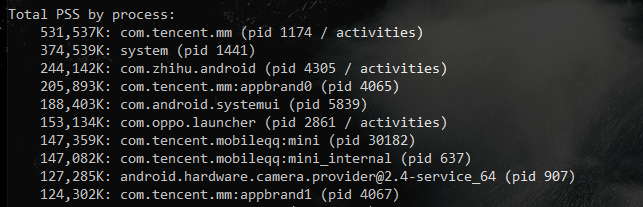

2. 按照 OOM adjustment 的一个排序，其中包括

3. 1. Native
   2. System
   3. Persistent
   4. Foreground
   5. Visible
   6. Perceptible
   7. A Service
   8. Previous
   9. B Service
   10. Cached

4. 按照类别进行的排序
   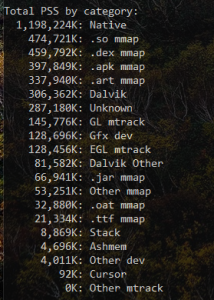

5. 系统内存综述, 可以看到总内存大小，剩余内存大小， Zram 的使用情况等
   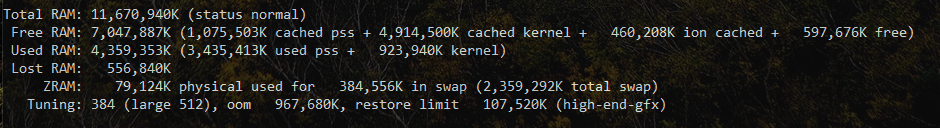

### dumpsys meminfo <pid_of_app>

> ```
> adb shell dumpsys meminfo <pid_of_app>
> ```

如果在执行 dumpsys meminfo 的时候，后面加上某个进程的 pid 或者包名，则可以查看这个进程的详细的内存占用，这里也包含下面几部分

1. 内存占用详细数据，从这里我们可以进行对比，看具体是哪部分的内存数据变大
   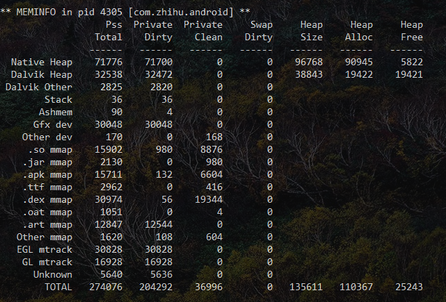
2. 内存占用按照类型的一个汇总，其实是把上面的数据进行分类后的一个列表
   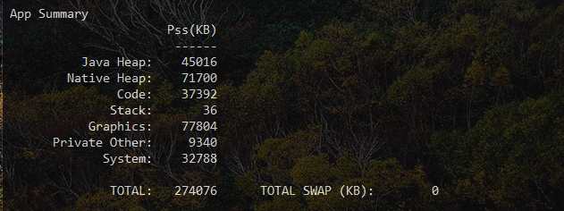
3. 按照对象个数的汇总，这里可以查看是否有异常的对象个数，比如 Activity、ViewRootImpl、View 这几项，如果有内存泄漏都可以在这里看到
   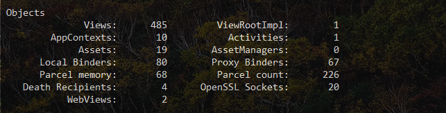
4. SQL
   
5. Database 信息
   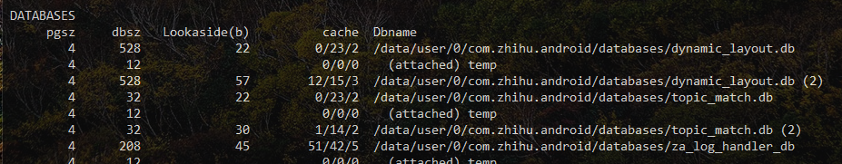

### showmap <pid_of_app>

> ```
> adb shell showmap <pid_of_app>
> ```

**这个命令需要有 root 权限**


showmap 的数据其实也是解析的 smaps 的数据，会展示当前进程的文件的内存占用，这里可以看到进程中每个打开的文件所占用的内存，包括 VSS，RSS，PSS等，我们一般重点关注 PSS 这一项

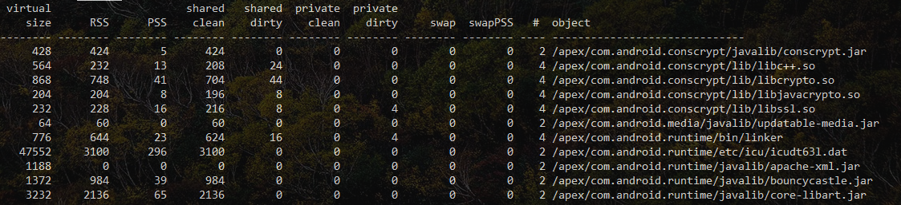

### proc/<pid_of_app>/smaps

> ```
> adb pull proc/<pid_of_app>/smaps
> ```

**这个命令需要有 root 权限**


smaps 记录了这个进程内存映射的原始信息，showmap 就是解析了 smaps 的信息，不过 smap 直接看的话并不是很友好，后面我们会介绍一个脚本，让 smaps 和 meminfo 那个结果结合起来看

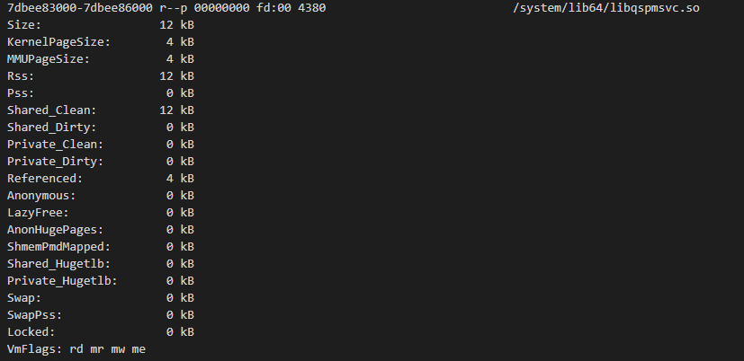

### dumpsys gfxinfo <pid_of_app>

> ```
> adb shell dumpsys gfxinfo <pid_of_app>
> ```

gfxinfo 中可以查看 hwui 所占用的内存，对应 meminfo 里面的 gl、egl 部分，其结果包含下面几部分

1. 渲染信息，由于这里用到了 frameinfo 里面记录的帧信息，所以这里可以看到每一帧的渲染信息，不过跟内存没有关系，我们就一带而过
   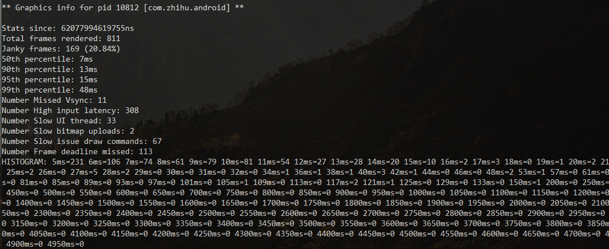
2. hwui 所使用的内存信息，这部分包括了 hwui 所使用的 cache，也包括 GPU 使用的一些内存，如果 meminfo 中 gl、egl 所占用的内存变大了，则需要对比这两项
   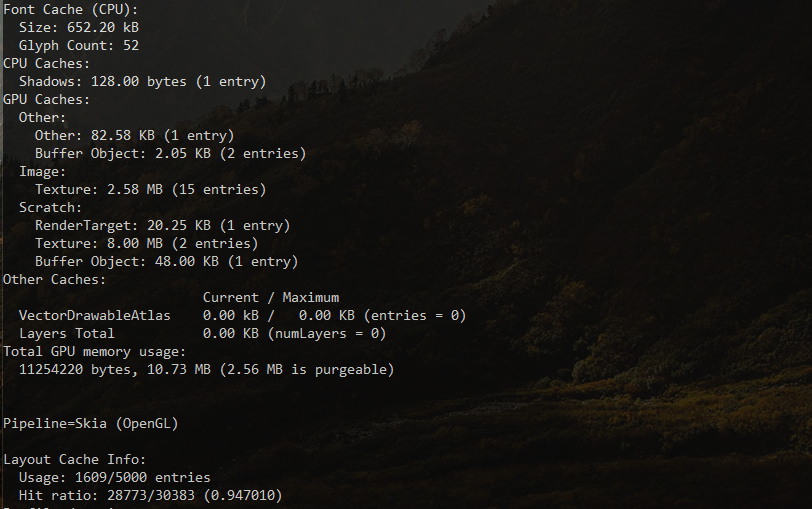

其中 Scratch 部分跟应用的关系比较大，应用使用

### Graphics - kgsl

> ```
> adb pull /d/kgsl/proc/<pid_of_app>/mem
> ```

这里主要是 Display 所使用的内存，在 Display 内存变大的情况下，这里的数据有时候也需要拿来做对比

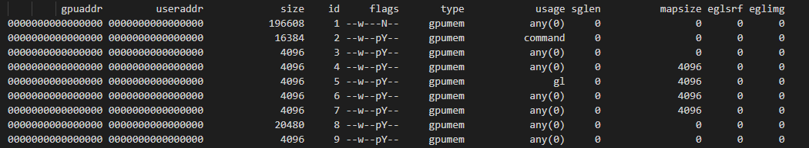

### hprof 文件

hprof 文件可以在代码中进行 dump，也可以用 Android Studio进行 dump ， 也可以使用其他第三方工具进行 dump

hprof 文件用于查看 Java 内存相关的情况，可以用 MAT 打开。由于 Android 中，Native 内存很多也是 Java 内存申请引起的，hprof 文件通过查看对象的个数，也可以分析一些 Native 内存的信息，比如 Bitmap 、线程创建等

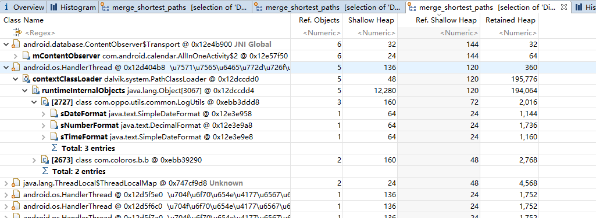

# 2.应用运行时内存分析步骤

## 2.1 获取进程 meminfo 和 samps

根据解析后的信息，分析是哪一部分的增大比较多，推荐使用附件中的 smaps-analysis 工具，将 smaps 和 meminfo 进行整合，整合之后的视图如下，可以很方便查看

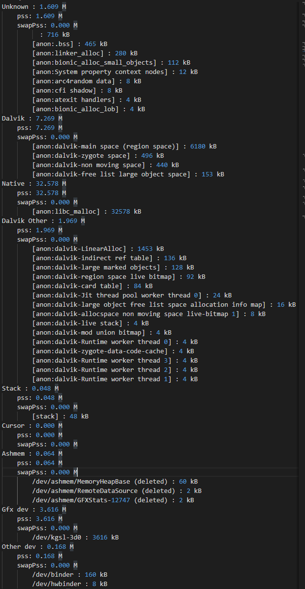

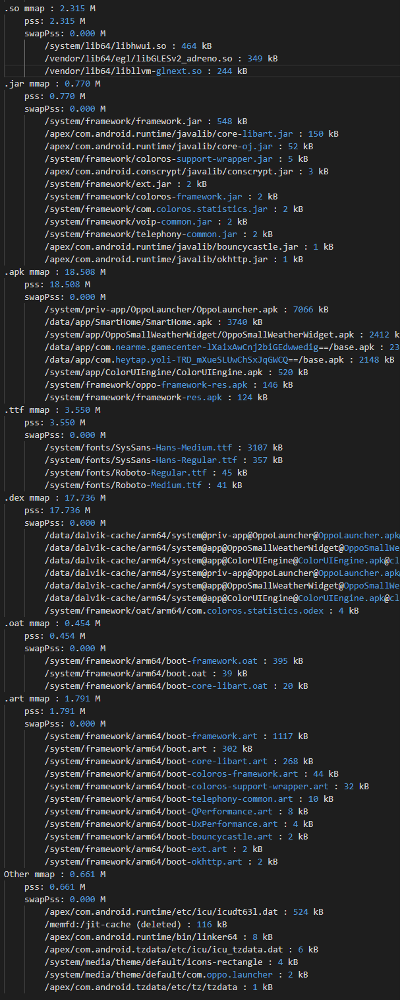


然后根据对比结果，分析是哪一部分的问题，下面是对应的导航

1. **如果是 Dalvik 部分内存变大，需要去查看 hprof 文件**

2. **如果是 Native 部分内存变大，需要去根据 Native Debug 的文档，配合 hprof 文件进行分析，大部分 App 的 Native 内存变大都是 Java 层的调用导致的**

3. **如果是 GL mtrack / EGL mtrack**

4. 1. **需要查看 gfxinfo 的结果**
   2. **需要对比两台机器的分辨率、App 的 SurfaceView 、TextureView、Webview 等使用情况**
   3. **需要查看 App 硬件加速的使用情况**

5. **如果是 so / jar / apk / ttf 变大，查看上述视图中 so / jar / apk / ttf 的个数，对比查看是哪部分变大，或者是因为多了哪个 so / jar / apk / ttf 导致的**

6. **如果是 dex/oat/art 变大，则需要对比两个 app 的运行状态、应用版本号是否一致，由于这部分与 Android 运行时的关系比较大， 需要使用 user 版本进行测试**

7. **如果是 gfx dev，/dev/kgsl-3d0 (一般情况下这个内存跟 app 的关系不大)**

## 2.2 Dalvik 内存部分

Dalvik 内存部分主要是使用 MAT 进行分析，具体使用可以查看下面几篇文档

1. https://www.androidperformance.com/2015/04/11/AndroidMemory-Usage-Of-MAT/
2. https://www.androidperformance.com/2015/04/11/AndroidMemory-Usage-Of-MAT-Pro/
3. https://www.androidperformance.com/2015/04/11/AndroidMemory-Open-Bitmap-Object-In-MAT/

其中几个点：

1. 可以对比某个对象的个数来查看是否有内存泄漏问题
2. 可以按照包名进行归类，查看自己的包里面的对象是否异常
3. 可疑对象查看 GC Root

## 2.3 Native 内存部分

native 部分一般是下面几个函数申请的内存

1. malloc
2. free
3. calloc
4. realloc
5. posix_memalign
6. memalign
7. aligned_alloc
8. malloc_usable_size

可以使用官方的文档和工具进行 debug

1. https://cs.android.com/android/platform/superproject/+/master:development/scripts/native_heapdump_viewer.py?q=native_heapdump_viewer.py
2. https://cs.android.com/android/platform/superproject/+/master:bionic/libc/malloc_debug/README.md?q=native_heapdump_viewer.py


### 测试步骤

> ```
> adb shell setprop wrap.com.coloros.calendar '"LIBC_DEBUG_MALLOC_OPTIONS=backtrace\ leak_track\ fill logwrapper"'
> adb shell am force-stop com.coloros.calendar
> 
> 
> // 进行操作，比如启动日历，然后退出
> 
> 
> adb shell am dumpheap -n <pid_of_app> /data/local/tmp/heap.txt 
> adb pull /data/local/tmp/heap.txt
> 
> 
> // 需要拿到对应的 symbols
> python native_heapdump_viewer.py --symbols ../out/target/product/qssi/symbols heap.txt --html > heap.ht
> ```

## 2.4 Graphics 内存部分

Graphics 内存部分包括 Gfx dev 、EGL mtrack、GL mtrack 三部分，部分机型没有统计这部分内存，或者只统计了几项，在对比的时候如果发现两个机型统计的项不一样，那么需要减去没有统计的部分，这三项的使用说明如下

1. gfx dev：/d/proc/<pid>/smaps 文件里 tag 为 “/dev/kgsl-3d0” 的内存空间总和，其与应用所申请的 OpenGL 资源（如纹理）大小有直接联系，所申请的资源越多越大，该项统计就会越大
2. gl mtrack：/d/kgsl/proc/<pid>/mem 文件里统计的类型为 gpumem 的条目，其含义是GPU 驱动分配给应用的显存资源与应用实际所申请的显存资源大小之间的差值。OpenGL 资源实际所占用的显存空间则与gfx dev项有关。驱动会多分配多少显存给应用这个不得而知，但毫无疑问，应用申请的 OpenGL 资源越多，该项统计也会越大
3. egl mtrack：各平台含义一致，Graphicbuffer 占用的显存空间。window、surfaceview、textureview、hardware bitmap (android O)，或其它直接使用 graphicbuffer 的方式都统计在这项里

从上面可以看到 ，**如果是 GL mtrack / EGL mtrack**

1. **需要查看 gfxinfo 的结果**
2. **需要对比两台机器的分辨率、App 的 SurfaceView 、TextureView、Webview 等使用情况**
3. **需要查看 App 硬件加速的使用情况**

**另外，Hardware Layer 对动画性能有帮助，但是其也会占用额外的内存，需要在使用的时候注意，动画做完后要及时置为 None（详细可以可以查看这里：**http://doc.myoas.com/pages/viewpage.action?pageId=220482879**）**

## 2.5 so / jar / apk / ttf 部分

这部分都是进程加载的文件部分，有些是与系统共享的，有些是与其他进程共享的，有些是这个进程单独加载的，关于这部分内存的使用，解析后的 meminfo 中都有比较详细的内存情况，配合 showmap 的信息，可以知道这个文件被共享的情况


如果这部分变大，可能的原因有：

1. 手机的运行进程不一样，有些文件被共享的时候，总进程少的手机，每个进程所 share 的 pss 就会变大
2. 不同版本的 apk 加载了不同的 so、 jar 、apk 、 ttf 等
3. 不同的操作场景 apk 加载了不同的 so、 jar 、apk 、 ttf 等
4. 不同版本的系统缓存策略不一致，比如我们发现有的机型某个接口会缓存一部分进程信息，导致使用了这个接口的应用 apk 统计部分变大(详细情况可以看这个案例：http://doc.myoas.com/pages/viewpage.action?pageId=220482768)

## 2.6 dex / oat / art 部分

这部分是 Android 虚拟机所产生和使用的文件，这部分内存与应用的运行情况有关系，所以如果这部分有问题，那么除了需要对比每一项的大小，如果是自己 app 的 dex / oat / art 变大，由于Art 虚拟机中 JIT 机制的存在 (https://source.android.google.cn/devices/tech/dalvik/jit-compiler) ，运行过程中 dex / oat / art 文件的大小会发生变化


这部分的加载规则如下：

1. 如果生成了的话，就加载 /data/dalvik-cache/arm64/system@priv-app@OppoLauncher@OppoLauncher.apk@classes.dex
2. 如果没有，就加载     /system/priv-app/OppoLauncher/oat/arm64/OppoLauncher.odex


所以测试这边进行对比测试的话，建议执行下面的命令进行全编译，或者直接重新安装

> adb shell cmd package compile -m speed -f com.oppo.launcher 
>
> adb shell am force-stop com.oppo.launcher 

以知乎为例，在执行 compile -m speed（全编译） 之前，其 dex mmap 情况如下：

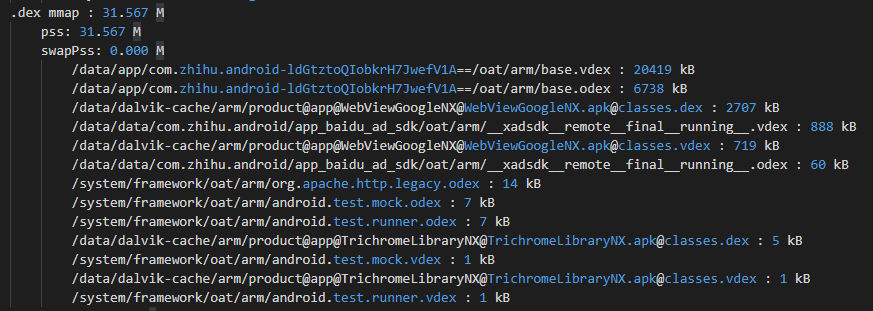

在执行

> ```
> adb shell cmd package compile -m speed -f com.zhihu.android 
> adb shell am force-stop com.zhihu.android
> ```

之后，启动应用，其 dex mmap 情况如下

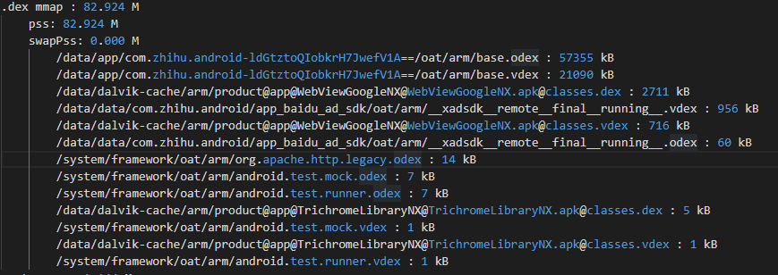

可以看到增大的主要是 odex 和 vdex 的文件大小

这些文件文件加载的时机

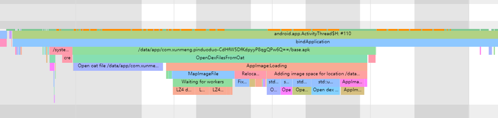

# 内存分析案例

1. 日历 Native 内存泄漏分析 ： http://doc.myoas.com/pages/viewpage.action?pageId=224130262
2. Launcher 内存优化分析 ：http://doc.myoas.com/pages/viewpage.action?pageId=220482768

欢迎大家补充

# 附件和工具

## smaps_parse 工具

使用方法：

> ```
> python /smap/smaps_parser.py -f <path_of_smaps>
> ```

[smaps_parser.py](files/内存占用分析/smaps_parser.py)

## MAT

1. 下载链接 ：https://www.eclipse.org/mat/

2. 使用文档

3. 1. https://www.androidperformance.com/2015/04/11/AndroidMemory-Usage-Of-MAT/
   2. https://www.androidperformance.com/2015/04/11/AndroidMemory-Usage-Of-MAT-Pro/
   3. https://www.androidperformance.com/2015/04/11/AndroidMemory-Open-Bitmap-Object-In-MAT/

## Native Debug

1. 工具 ：https://cs.android.com/android/platform/superproject/+/master:development/scripts/native_heapdump_viewer.py?q=native_heapdump_viewer.py
2. 使用文档 ：https://cs.android.com/android/platform/superproject/+/master:bionic/libc/malloc_debug/README.md?q=native_heapdump_viewer.py

## Android Studio Memory Profiler

1. 文档 ：https://developer.android.google.cn/studio/profile/memory-profiler.html

## 