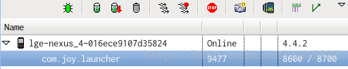
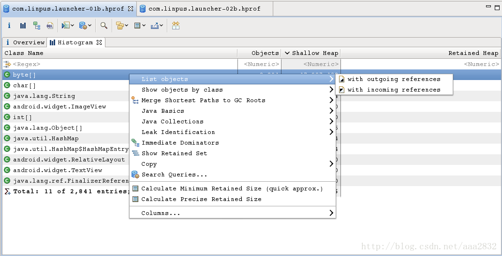
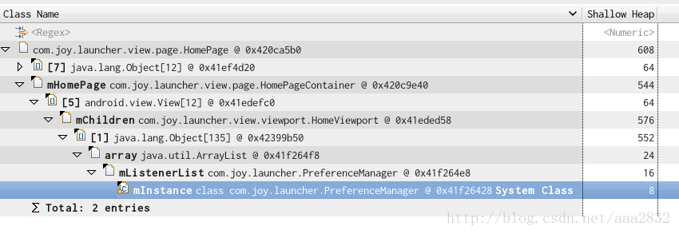

# MAT使用指南

##  内存泄漏的排查方法 

Dalvik Debug Monitor Server (DDMS) 是 ADT插件的一部分，其中有两项功能可用于内存检查 :

·  heap 查看堆的分配情况

·  allocation tracker跟踪内存分配情况

DDMS 这两项功能有助于找到内存泄漏的操作行为。

Eclipse Memory Analysis Tools (MAT) 是一个分析 Java堆数据的专业工具，用它可以定位内存泄漏的原因。

工具地址 : https://www.eclipse.org/mat/

### 1、观察 Heap

运行程序，然后进入 DDMS管理界面，如下：

 

PS : 点击工具栏上的 来更新统计信息

点击右侧的 Cause GC 按钮或工具栏上的 即可查看当前的堆情况，如下： 


主要关注两项数据：

- Heap Size 堆的大小，当资源增加，当前堆的空余空间不够时，系统会增加堆的大小，若超过上限 (例如 64M，视平台和具体机型而定)则会被杀掉

- Allocated 堆中已分配的大小，这是应用程序实际占用的内存大小，资源回收后，此项数据会变小

查看操作前后的堆数据，看是否有内存泄漏 
对单一操作(比如添加页，删除页)进行反复操作，如果堆的大小一直增加，则有内存泄漏的隐患。


### 2、利用MAT分析内存堆

DDMS 可以将当前的内存 Dump成一个 hprof格式的文件，MAT 读取这个文件后会给出方便阅读的信息，配合它的查找，对比功能，就可以定位内存泄漏的原因。

·    获取 hprof文件 
点击工具栏上的 按钮，将内存信息保存成文件。 **如果是用 MAT Eclipse 插件获取的 Dump文件，则不需要经过转换，Adt会自动进行转换然后打开。**

·    转换 hprof文件 
DDMS Dump 出的文件要经过转换才能被 MAT识别，Android SDK提供了这个工具 hprof-conv (位于 sdk/tools下)

·  *./hprof-conv xxx-a.hprof xxx-b.hprof*

·    用 MAT打开转换后的 hprof文件 


### 3、Histogram 查询

用的最多的功能是 **Histogram**,点击 Actions下的 Histogram项将得到 Histogram结果：



它按类名将所有的实例对象列出来，可以点击表头进行排序,在表的第一行可以输入正则表达式来匹配结果 :


在某一项上右键打开菜单选择 list objects ->with incoming refs 将列出该类的实例：


它展示了对象间的引用关系，比如展开后的第一个子项表示这个 HomePage(0x420ca5b0)被 HomePageContainer(0x420c9e40)中的 mHomePage属性所引用.

快速找出某个实例没被释放的原因，可以右健 Path to GC Roots-->exclue all phantom/weak/soft etc. reference :


得到的结果是：



从表中可以看出 PreferenceManager -> … ->HomePage这条线路就引用着这个 HomePage实例。用这个方法可以快速找到某个对象的 **GC Root**,一个存在 GC Root的对象是不会被 GC回收掉的.


### 4、Histogram 对比

为查找内存泄漏，通常需要两个 Dump结果作对比，打开 Navigator History面板，将两个表的 Histogram结果都添加到 Compare Basket中去 :


添加好后，打开 Compare Basket面板，得到结果：


点击右上角的 **!** 按钮，将得到比对结果：


注意，上面这个对比结果不利于查找差异，可以调整对比选项：


再把对比的结果排序，就可得到直观的对比结果：


也可以对比两个对象集合，方法与此类似，都是将两个 Dump结果中的对象集合添加到Compare Basket中去对比。找出差异后用 Histogram查询的方法找出 GC Root，定位到具体的某个对象上。


### 5、例子

举例一个典型的分析内存泄漏的过程：

1. 使用 Heap查看当前堆大小为 23.00M

2. 添加一个页后堆大小变为 23.40M

3. 将添加的一个页删除，堆大小为 23.40M

4. 多次操作，结果仍相似，说明添加/删除页存在内存泄漏 (也应注意排除其它因素的影响)

5. Dump 出操作前后的 hprof 文件 (1.hprof,2.hprof)，用 mat打开,并得到 histgram结果

6. 使用 HomePage字段过滤 histgram结果，并列出该类的对象实例列表，看到两个表中的对象集合大小不同，操作后比操作前多出一个 HomePage，说明确实存在泄漏

7. 将两个列表进行对比，找出多出的一个对象，用查找 GC Root的方法找出是谁串起了这条引用线路，定位结束

PS :

- 很多时候堆增大是 Bitmap引起的，Bitmap在 Histogram中的类型是 byte [],对比两个 Histogram中的 byte[] 对象就可以找出哪些 Bitmap有差异

- 多使用排序功能，对找出差异很有用


## MAT报错:Unknown HPROF Version (JAVA PROFILE 1.0.3) (java.io.IOException)解决办法

打开 MAT 工具，File-->Open Heap Dump... 选择你刚刚保存的 hprof 文件打开

此时，会弹出一个错误，如下图所示：


我开始还以为是 MAT 与[Java](http://lib.csdn.net/base/java)的版本不匹配，其实是 [Android](http://lib.csdn.net/base/android) 刚刚生成的 .hprof 文件在这里需要进行转换一下格式。 

打开命令行窗口，在[android](http://lib.csdn.net/base/android) SDK目录，执行以下命令：

```sh
hprof-conv  1.hprof  2.hprof
```

然后再次打开MAT程序，打开2.hprof文件，就可以看到正确的分析界面啦！


# References

- DDMS 官方教程 http://developer.android.com/tools/debugging/ddms.html

- MAT 下载 http://www.eclipse.org/mat/downloads.php

- MAT 使用 http://android-developers.blogspot.tw/2011/03/memory-analysis-for-android.html

