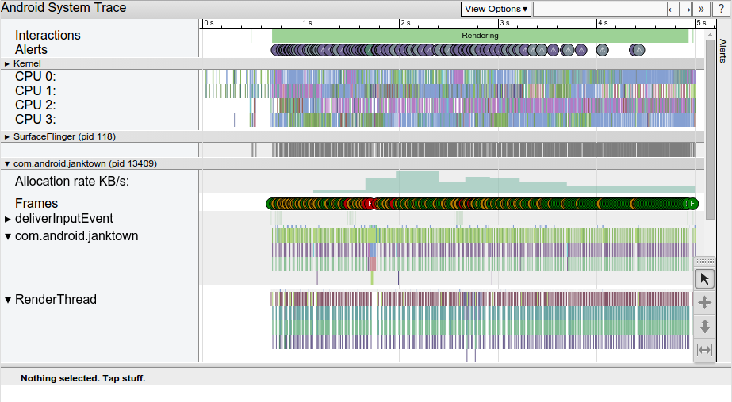

[TOC]

# 官方文档

## Overview of Systrace

Systrace是一个平台提供的工具，可以在很短的时间内记录设备活动（唐炜注：时间太长导致文件很大，可能无法聚焦分析具体问题）。Systrace生成一个报告，该报告结合了Android内核中的数据，例如CPU调度程序、磁盘活动和应用程序线程。该报告可帮助您确定如何最好地改善您的应用或游戏的性能。

下图是一个例子：



**图1、**Systrace HTML报告示例，显示某个应用程序的5秒交互

此报告提供了Android设备在给定时间段内的系统进程的总体情况。 该报告还检查捕获的跟踪信息，以突出显示它所观察到的问题，例如UI jank或高功耗。

> ☆ **Note:**
>
> Systrace工具不会收集有关应用程序进程中代码执行的信息。 有关应用程序正在执行的方法以及它使用的CPU资源的更多详细信息，请使用Android Studio中的CPU分析器。 您还可以使用CPU Profiler生成跟踪日志并导入和检查它们。

### Systrace guides

要了解有关Systrace工具的更多信息，请参阅以下指南：

- [**Command-line reference**](#Capture a system trace on the command line)

  定义可以传递到Systrace命令行界面的不同选项和标志。

- [**System Tracing system app**](#Capture a system trace on a device)

  说明如何在运行Android 9（API级别28）或更高版本的任何设备上直接捕获system trace。

- [**Navigate a Systrace report**](https://developer.android.google.cn/studio/profile/systrace/navigate-report)

  列出典型报告的元素，显示用于浏览报告的键盘快捷键，并描述如何识别性能问题的类型。

- [**Define custom events**](https://developer.android.google.cn/studio/profile/systrace/custom-events)

  讲述如何将自定义标签应用于代码的特定部分，从而在Systrace中实现更简单的根本原因分析。

- [**Improve your game's performance**](https://developer.android.google.cn/games/optimize)

  讲述如何使用Systrace工具改进游戏中的特定性能区域，包括帧速率一致性，功耗和渲染平滑度。


## Capture a system trace on the command line

systrace命令调用Systrace工具，该工具允许您以system级别去收集和检查所有在设备上运行的进程的耗时信息。

本文档介绍了如何从命令行生成Systrace报告。 在运行Android 9（API级别28）或更高版本的设备上，您还可以使用[System Tracing system app](#Capture a system trace on a device)生成Systrace报告。

要运行systrace，请完成以下步骤：

1. 从Android Studio下载并安装最新的Android SDK工具。
2. 安装Python并将其包含在执行路径中。
3. 使用USB调试连接将运行Android 4.3（API级别18）或更高版本的设备连接到开发系统。

systrace命令在Android SDK Tools包中提供，位于android-sdk/platform-tools/systrace/中。

### Syntax

要为app生成HTML报告，您需要使用以下语法从命令行运行systrace：

```bash
python systrace.py [options] [categories]
```

例如，以下命令调用systrace来记录设备活动并生成名为mynewtrace.html的HTML报告。 对于大多数设备，此category列表是合理的默认列表。

```bash
$ python systrace.py -o mynewtrace.html sched freq idle am wm gfx view binder_driver hal dalvik camera input res
```

> ☆ **Tip:**
>
> 如果要在跟踪输出中查看任务的名称，则必须在命令参数中包含sched类别。

要查看已连接设备支持的类别列表，请运行以下命令：

```bash
$ python systrace.py --list-categories
```

如果未指定任何类别或选项，systrace将生成包含所有可用类别的报告，并使用默认设置。可用的类别取决于您使用的已连接设备。

#### Global options

| Global options           | Description                     |
| ------------------------ | ------------------------------- |
| `-h | --help`            | 显示帮助信息。                  |
| `-l | --list-categories` | 列出所连接设备可用的trace类别。 |

#### Commands and command options

| Commands and options                      | Description                                                  |
| ----------------------------------------- | ------------------------------------------------------------ |
| `-o file`                                 | 将HTML跟踪报告写入指定的文件。如果不指定此选项，`systrace`会将报表保存到与`systrace.py`相同的目录中，并将其命名为`trace.html`。 |
| `-t N | --time=N`                         | 跟踪设备活动N秒。 如果未指定此选项，则`systrace`会提示您通过从命令行按Enter键来结束跟踪。 |
| `-b N | --buf-size=N`                     | 使用N kb的跟踪缓冲区大小。 此选项允许您限制跟踪期间收集的数据的总大小。 |
| `-k functions| --ktrace=functions`        | 跟踪以逗号分隔的列表中指定的特定内核函数的活动。             |
| `-a app-name| --app=app-name`             | 启用对应用的跟踪，指定为逗号分隔的[进程名称](https://developer.android.google.cn/guide/topics/manifest/application-element.html#proc)列表。 应用程序必须包含来自`Trace`类的跟踪检测调用。 每当您分析应用程序时，您应该指定此选项，许多库（例如`RecyclerView`）包括跟踪检测调用，这些调用在您启用应用程序级跟踪时提供有用的信息。 有关详细信息，请转到有关如何[检测应用程序代码](https://developer.android.google.cn/studio/profile/systrace/command-line#app-trace)的部分。 |
| `--from-file=file-path`                   | 从文件创建交互式HTML报告，例如包含原始跟踪数据的TXT文件，而不是运行实时跟踪。 |
| `-e device-serial|--serial=device-serial` | 在特定连接设备上进行跟踪，由[设备序列号](https://developer.android.google.cn/studio/command-line/adb.html#devicestatus)标识。 |
| `categories`                              | 包括您指定的系统进程的跟踪信息，例如用于呈现图形的系统进程的“gfx”。 您可以使用`-l`命令运行`systrace`以查看连接设备可用的服务列表。 |


## Capture a system trace on a device

运行Android 9（API级别28）或更高版本的设备包括称为`System Tracing`的system应用程序。 此应用程序类似于systrace命令行实用程序，但该应用程序允许您直接从测试设备本身记录跟踪，而无需插入设备并通过ADB连接到它。 然后，您可以使用该应用程序与开发团队共享这些trace的结果。

在解决应用程序中与性能相关的错误时记录跟踪特别有用，例如启动缓慢、转换速度慢或UI jank。

### Record a system trace

`System Tracing`应用程序允许您使用快速设置或应用程序本身内的菜单记录系统跟踪。 以下部分介绍如何使用这些界面完成录制过程。

> ☆ **Note:**
>
> 作为开发工作流程的一部分，您可以提交设备上的错误报告。 在完成System Tracing记录后，提交此类错误报告非常重要。 这样，错误报告进程本身不包含在记录的trace中。

#### Record using Quick Settings tile

快速设置通常是完成设备上System Tracing过程的更方便的方法。

##### Set up tile

如果您是第一次在测试设备上使用System Tracing，或者如果在设备的“快速设置”面板中没有看到`System Tracing`（图1），请完成以下设置步骤：

1. 启用开发人员选项（如果尚未启用）。

2. 打开“开发者选项”设置屏幕。

3. 在“调试”部分中，选择“System Tracing”。 系统跟踪应用程序将打开，显示应用程序菜单。

4. 从应用程序菜单中，启用“Show Quick Settings tile”，如图2所示。系统将“System Tracing”添加到“快速设置”面板，如图1所示：

   

   **图1、**“快速设置”面板中的“System Tracing”


**图2、**System Tracing应用程序中的“显示快速设置”开关

> ☆ **Note:**
>
> 默认情况下，系统会将“System Tracing”添加为“快速设置”面板中的第一个选项。 如果您希望图块显示在其他位置，请使用面板的编辑模式移动图块。

##### Complete a system trace recording

要使用“快速设置”面板录制system trace，请完成以下步骤：

1. 点击System Tracing，其标记为“记录跟踪”。 选项变为启用状态，并且会出现持久通知，通知您系统正在录制trace，如图3所示：

   

   **图3、**启动设备上system trace后出现的持久通知

2. 在您的应用中执行您希望系统检查的操作。

   > ☆ **Note:**
   >
   > 您可以通过让System Tracing在后台运行来记录难以重现的错误，然后在错误发生后立即停止System Tracing。 System Tracing将设备的活动保存到滚动缓冲区，滚动缓冲区可容纳10-30秒的事件。

3. 完成这些操作后，通过点击“快速设置”面板中的“System Tracing”或通知中的“System Tracing”来停止trace。

   系统显示包含消息“Saving trace”的新通知。 保存完成后，系统会解除通知并显示第三个通知，确认您的trace已保存并且您已准备好共享system trace，如图4所示：

   

   **图4、**系统完成保存trace后出现的持久通知

#### Record using app menu

应用程序菜单允许您配置与System Tracing相关的多个高级设置，并提供用于启动和停止system trace的开关。

要使用“System Tracing”应用程序菜单录制system trace，请完成以下步骤：

1. 启用开发人员选项（如果尚未启用）。

2. 打开“开发者选项”设置屏幕。 在“调试”部分中，选择“System Tracing”。 System Tracing应用程序将打开。

   或者，如果您已设置快速设置中的System Tracing选项，则可以长按选项以进入System Tracing应用。

3. （可选）选择要跟踪的系统和传感器调用的类别，然后选择缓冲区大小（以KB为单位）。 选择与您正在测试的用例相对应的类别，例如用于测试蓝牙操作的音频类别。

   > ☆ **Note:**
   >
   > 这些类别用作应用级设置，因此系统在使用“快速设置”选项时也会使用这些类别。 此外，这些设置会在设备重新启动后持续存在。

4. 启用记录跟踪开关，如图5中显示。选项已启用，并且会出现持久通知，通知您系统正在录制system trace（图3）。

   

   **图5、**System Tracing应用程序中的记录跟踪开关

5. 在您的应用中执行您希望系统检查的操作。

   > ☆ **Note:**
   >
   > 您可以通过让System Tracing在后台运行来记录难以重现的错误，然后在错误发生后立即停止System Tracing。 System Tracing将设备的活动保存到滚动缓冲区，滚动缓冲区可容纳10-30秒的事件。

6. 完成这些操作后，通过禁用“记录跟踪”开关来停止trace。

   系统显示包含消息“Saving trace”的新通知。 保存完成后，系统会解除通知并显示第三个通知，确认您的trace已保存并且您已准备好共享system trace，如图4所示。

### Share a system trace

System Tracing应用程序可帮助您共享system trace结果，作为多个不同工作流程的一部分。

#### Share as a message

System Tracing允许您与设备上的其他应用共享您收集的trace。 这样，您可以通过电子邮件或错误跟踪应用程序将跟踪发送给开发团队，而无需将设备连接到开发计算机。

录制System Trace后，点击设备上显示的通知（参见图4）。 出现系统的intent picker，允许您使用您选择的消息传递应用程序共享您的trace。

#### Download report using ADB

如果需要，还可以使用ADB从设备中提取system trace。 将记录跟踪的设备连接到开发计算机，然后在终端窗口中运行以下命令：

```bash
cd /path-to-traces-on-my-dev-machine && adb pull /data/local/traces/ .
```

### Create an HTML report

通过消息或通过ADB共享跟踪时，报告本身位于.ctrace文件中。 使用此文件，您可以生成跟踪的HTML报告。 为此，请在终端窗口中运行以下命令：

```bash
cd /path-to-traces-on-my-dev-machine && systrace --from-file trace-file-name.ctrace
```

如果您还没有systrace命令行程序，可以从GitHub上的[Catapult](https://github.com/catapult-project/catapult/tree/master/systrace)项目下载，也可以直接从[Android开源项目](https://android.googlesource.com/platform/external/chromium-trace/+/master/catapult/systrace/systrace/)下载。


## Navigate a Systrace report

本指南介绍了如何浏览和解释Systrace报告。

### Elements of a typical report

Systrace生成包含一系列部分的输出HTML文件。 该报告列出了每个进程的线程。 如果给定线程呈现UI帧，则报告还指示沿时间线的呈现帧。 当您在报告中从左向右移动时，时间会向前传递。

报告从上到下包含以下部分。

#### User interactions

第一部分包含表示应用或游戏中特定用户交互的条形图，例如点击设备屏幕。 这些相互作用充当有用的时间标记。

#### CPU activity

下一节显示了表示每个CPU中的线程活动的条形图。 条形图显示所有应用程序（包括您的应用程序或游戏）的CPU活动。

CPU活动部分是可扩展的，允许您查看每个CPU的时钟频率。 图1显示了折叠的CPU活动部分的示例，图2显示了显示时钟频率的扩展版本：


**图1、**Systrace报告中的CPU活动示例（折叠视图）


**图2、**示例CPU活动（展开视图），显示Systrace报告中的CPU时钟频率

#### System events

本节中的直方图显示特定的系统级事件，例如纹理计数和特定对象的总大小。

值得仔细检查的直方图是标记为SurfaceView的直方图。 计数表示已传递到显示管道并等待在设备屏幕上显示的组合帧缓冲区的数量。 由于大多数设备都是双缓冲或三缓冲，因此该计数几乎总是0,1或2。

描述Surface Flinger过程的其他直方图，包括VSync事件和UI线程交换工作，如图3所示：


**图3、**Systrace报告中的Surface Flinger示例图

#### Display frames

这一部分，通常是报告中最高的部分，描绘了一条彩色线条，后面是成堆的条形图。 这些形状表示已创建的特定线程的状态和帧堆栈。 堆栈的每个级别代表对beginSection()的调用，或者您为应用或游戏定义的自定义跟踪事件的开始。

> ☆ **Note:**
>
> UI线程或应用程序或游戏通常运行的主线程始终显示为第一个线程。

每堆条形图上方的多色线表示特定线程随时间变化的状态集。 该行的每个部分可以包含以下颜色之一：

- **Green: Running**

  线程正在完成与进程相关的工作或正在响应中断。

- **Blue: Runnable**

  线程可以运行但当前没有调度。

- **White: Sleeping**

  线程没有工作要做，可能是因为线程在互斥锁上被阻塞。

- **Orange: Uninterruptable sleep**

  线程在I / O上被阻塞或等待磁盘操作完成。

- **Purple: Interruptable sleep**

  线程在另一个内核操作（通常是内存管理）上被阻塞。

> ☆ **Note:**
>
> 在Systrace报告中，您可以单击该行以确定在给定时间哪个CPU控制了该线程。

### Keyboard shortcuts

下表列出了查看Systrace报告时可用的键盘快捷键：

| Key             | Description                                                  |                                                              |
| --------------- | ------------------------------------------------------------ | ------------------------------------------------------------ |
| **W**           | 放大跟踪时间轴。                                             |                                                              |
| **A**           | 在跟踪时间线上左移。                                         |                                                              |
| **S**           | 缩小跟踪时间线。                                             |                                                              |
| **D**           | 在跟踪时间轴上向右平移。                                     |                                                              |
| **E**           | 将跟踪时间轴置于当前鼠标位置的中心。                         |                                                              |
| **M**           | 框架当前选择。                                               |                                                              |
| **1**           | 将当前活动的选择模型更改为“选择”模式。 对应于鼠标选择器工具栏中显示的第一个按钮（请参见右侧图像）。将当前活动的选择模型更改为“选择”模式。 对应于鼠标选择器工具栏中显示的第一个按钮（请参见右侧图像）。 |  |
| **2**           | 将当前活动的选择模型更改为“平移”模式。 对应于鼠标选择器工具栏中显示的第二个按钮（请参见右侧图像）。 |  |
| **3**           | 将当前活动的选择模型更改为“缩放”模式。 对应于鼠标选择器工具栏中显示的第3个按钮（请参见右侧图像）。 |  |
| **4**           | 将当前活动的选择模型更改为“计时”模式。 对应于鼠标选择器工具栏中显示的第4个按钮（请参见右侧图像）。 |  |
| **G**           | 在当前所选任务的开头显示网格。                               |                                                              |
| **Shift + G**   | 在当前所选任务的末尾显示网格。                               |                                                              |
| **Left Arrow**  | 在当前选定的时间轴上选择上一个事件。                         |                                                              |
| **Right Arrow** | 选择当前所选时间轴上的下一个事件。                           |                                                              |

### Investigate performance problems

与Systrace报告交互时，您可以在记录期间检查设备CPU使用情况。 有关导航HTML报告的帮助，请参阅键盘快捷键部分，或单击？ 报告右上角的按钮。

以下部分介绍了如何检查报告中的信息以查找和修复性能问题。

#### Identify performance concerns

在Systrace报告中导航时，您可以通过执行以下一项或多项操作来更轻松地识别性能问题：

- 通过在时间间隔周围绘制矩形来选择感兴趣的时间间隔。
- 使用标尺工具标记或突出显示问题区域。
- 单击“查看选项”>“突出显示VSync”，显示每个显示刷新操作。

#### Inspect UI frames and alerts

> ☆ **Note:**
>
> 本节中的内容仅与托管代码相关，因为Systrace会查看系统基于Java的编排器以提供框架信息。 有关本机代码（特别是游戏）的特定指导，请参阅有关帧速率一致性的讨论。

如图4所示，Systrace报告列出了呈现UI帧的每个进程，并指示沿时间轴的每个渲染帧。 在绿色框架圆圈表示在每秒保持60帧所需的16.6毫秒内渲染的帧。 渲染时间超过16.6毫秒的帧用黄色或红色框架圆圈表示。


**图4、**放大长时间运行帧后的Systrace显示

> ☆ **Note:**
>
> 在运行Android 5.0（API级别21）或更高版本的设备上，渲染帧的工作在UI线程和渲染线程之间分配。 在以前的版本中，创建框架的所有工作都在UI线程上完成。

单击框架圆圈会突出显示它，并提供有关系统完成该框架所做工作的其他信息，包括警报。 该报告还向您显示了在渲染该帧时系统正在执行的方法。 您可以调查这些方法以确定UI jank的潜在原因。


**图5、**选择有问题的框架时，跟踪报告下方会出现一个警报，用于识别问题

选择慢速框架后，您可能会在报告的底部窗格中看到警报。 图5中显示的警告调出框架的主要问题是在ListView回收和重新绑定中花费了太多时间。 跟踪中的相关事件的链接可以解释有关系统在此期间正在执行的操作的更多信息。

要查看工具在跟踪中发现的每个警报，以及设备触发每个警报的次数，请单击窗口最右侧的“警报”选项卡，如图6所示。“警报”面板可帮助您查看 跟踪中出现哪些问题以及它们对jank的贡献频率。 您可以将此面板视为要修复的错误列表。 通常，一个区域的小改变或改进可以删除整组警报。


**图6、**单击Alert按钮显示alert选项卡

如果您在UI线程上看到太多工作，请使用以下方法之一来帮助确定哪些方法占用了过多的CPU时间：

- 如果您知道哪些方法可能导致瓶颈，请在这些方法中添加跟踪标记。 有关详细信息，请参阅有关[如何在代码中定义自定义事件](#Define custom events for Systrace)的指南。
- 如果您不确定UI瓶颈的来源，请使用Android Studio中提供的CPU Profiler。 您可以生成跟踪日志，然后使用CPU Profiler导入和检查它们。


## Define custom events for Systrace

Systrace仅在系统级别向您显示有关进程的信息，因此有时很难知道您的应用程序或游戏的哪些方法在给定时间相对于系统事件执行。

Android平台提供了一个跟踪API，您可以使用它来标记特定的代码段。 如果捕获应用程序“调试”版本的新系统跟踪并包含-a选项，如下面的代码段所示，这些自定义事件将显示在Systrace报告中：

```bash
python systrace.py -a com.example.myapp -b 16384 \
  -o my_systrace_report.html sched freq idle am wm gfx view binder_driver hal \
  dalvik camera input res
```

> ☆ **Note:**
>
> 此方法与使用Debug类不同，后者可帮助您通过生成.trace文件来检查详细的应用程序CPU使用情况。

本指南介绍如何在托管代码和本机代码中定义自定义事件。

### Managed code

在Android 4.3（API级别18）及更高版本中，您可以使用代码中的Trace类来定义随后出现在Systrace报告中的自定义事件，如以下代码段所示。

> ☆ **Note:**
>
> 当你多次调用beginSection()时，调用endSection()只会结束最近调用的beginSection()方法。 因此，对于嵌套调用 ( 例如以下代码段中的调用 ) ，请确保通过调用endSection()正确匹配对beginSection()的每个调用。
>
> 另外，你不能在一个线程上调用beginSection()并从另一个线程结束它; 你必须在同一个线程上调用这两个方法。

```java
public class MyAdapter extends RecyclerView.Adapter<MyViewHolder> {
    @Override
    public MyViewHolder onCreateViewHolder(ViewGroup parent, int viewType) {
        Trace.beginSection("MyAdapter.onCreateViewHolder");
        MyViewHolder myViewHolder;
        try {
            myViewHolder = MyViewHolder.newInstance(parent);
        } finally {
            // In try and catch statements, always call "endSection()" in a
            // "finally" block. That way, the method is invoked even when an
            // exception occurs.
            Trace.endSection();
        }
        return myViewHolder;
    }
    @Override
    public void onBindViewHolder(MyViewHolder holder, int position) {
        Trace.beginSection("MyAdapter.onBindViewHolder");
        try {
            try {
                Trace.beginSection("MyAdapter.queryDatabase");
                RowItem rowItem = queryDatabase(position);
				dataset.add(rowItem);
            } finally {
                Trace.endSection();
            }            
            holder.bind(dataset.get(position));
        } finally {
            Trace.endSection();        
        }
    }
}
```

### Native code

Android 6.0（API级别23）及更高版本支持本机跟踪API trace.h，用于将跟踪事件写入系统缓冲区，然后可以使用Systrace进行分析。 此API的常见用例包括观察特定代码块执行的时间以及将代码块与不良系统行为相关联的时间。

要定义应用或游戏中本机代码中发生的自定义事件，请完成以下步骤：

1. 定义用于捕获游戏中自定义事件的ATrace函数的函数指针，如以下代码段所示：

   ```c++
   #include <android/trace.h>
   #include <dlfcn.h>
   void *(*ATrace_beginSection) (const char* sectionName);
   void *(*ATrace_endSection) (void);
   typedef void *(*fp_ATrace_beginSection) (const char* sectionName);
   typedef void *(*fp_ATrace_endSection) (void);
   ```

2. 在运行时加载ATrace符号，如以下代码段所示。 通常，您在对象构造函数中执行此过程。

   ```c++
   // Retrieve a handle to libandroid.
   void *lib = dlopen("libandroid.so", RTLD_NOW || RTLD_LOCAL);
   
   // Access the native tracing functions.
   if (lib != NULL) {
       // Use dlsym() to prevent crashes on devices running Android 5.1
       // (API level 22) or lower.
       ATrace_beginSection = reinterpret_cast<fp_ATrace_beginSection>(dlsym(lib, "ATrace_beginSection"));
       ATrace_endSEction = reinterpret_cast<fp_ATrace_endSection>(dlsym(lib, "ATrace_endSection"));
   }
   ```

   > ！**Caution:**
   >
   > 出于安全原因，仅在应用程序或游戏的调试版本中包含对dlopen()的调用。

   >☆ **Note:**
   >
   >为了进一步提供对Android 4.3（API级别18）的跟踪支持，您可以使用JNI围绕前面代码段中显示的代码调用托管代码中的方法。
   
3. 分别在自定义事件的开头和结尾调用ATrace_beginSection()和ATrace_endSection()：

   ```c++
   #include <android/trace.h>
   char *customEventName = new char[32];
   sprintf(customEventName, "User tapped %s button", buttonName);
   ATrace_beginSection(customEventName);
   // Your app or game's response to the button being pressed.
   ATrace_endSection();
   ```

   > ☆ **Note:**
   >
   > 当你多次调用beginSection()时，调用endSection()只会结束最近调用的beginSection()方法。 因此，对于嵌套调用 ( 例如以下代码段中的调用 ) ，请确保通过调用endSection()正确匹配对beginSection()的每个调用。
   >
   > 另外，你不能在一个线程上调用beginSection()并从另一个线程结束它; 你必须在同一个线程上调用这两个方法。

#### Convenience tips

以下提示是可选的，但可以更轻松地分析您的本机代码。

##### Trace an entire function

在检测调用堆栈或函数计时时，您可能会发现跟踪整个函数很有用。 您可以使用ATRACE_CALL()宏来更轻松地设置此类跟踪。 此外，这样的宏允许您跳过创建try和catch块，以用于跟踪函数可能抛出异常或提前调用返回的情况。

要创建用于跟踪整个函数的宏，请完成以下步骤：

1. 定义宏：

   ```c++
   #define ATRACE_NAME(name) ScopedTrace ___tracer(name)
   // ATRACE_CALL is an ATRACE_NAME that uses the current function name.
   #define ATRACE_CALL() ATRACE_NAME(__FUNCTION__)
   class ScopedTrace {
       public:
       inline ScopedTrace(const char *name) {
           ATrace_beginSection(name);
       }
       inline ~ScopedTrace() {
           ATrace_endSection();    
       }
   };
   ```

2. 在要跟踪的函数中调用宏：

   ```c++
   void myExpensiveFunction() {
       ATRACE_CALL();
       // Code that you want to trace.
   }
   ```

##### Name your threads

您可以为发生事件的每个线程指定一个名称，如以下代码段所示。 此步骤可以更轻松地识别属于游戏中特定操作的线程。

```c++
#include <pthread.h>

static void *render_scene(void *parm) {
    // Code for preparing your app or game's visual components.
}

static void *load_main_menu(void *parm) {
    // Code that executes your app or game's main logic.
}

void init_threads() {
    pthread_t render_thread, main_thread;

    pthread_create(&render_thread, NULL, render_scene, NULL);
    pthread_create(&main_thread, NULL, load_main_menu, NULL);

    pthread_setname_np(render_thread, "MyRenderer");
    pthread_setname_np(main_thread, "MyMainMenu");
}
```


# References

- [官方文档](https://developer.android.google.cn/studio/profile/systrace)