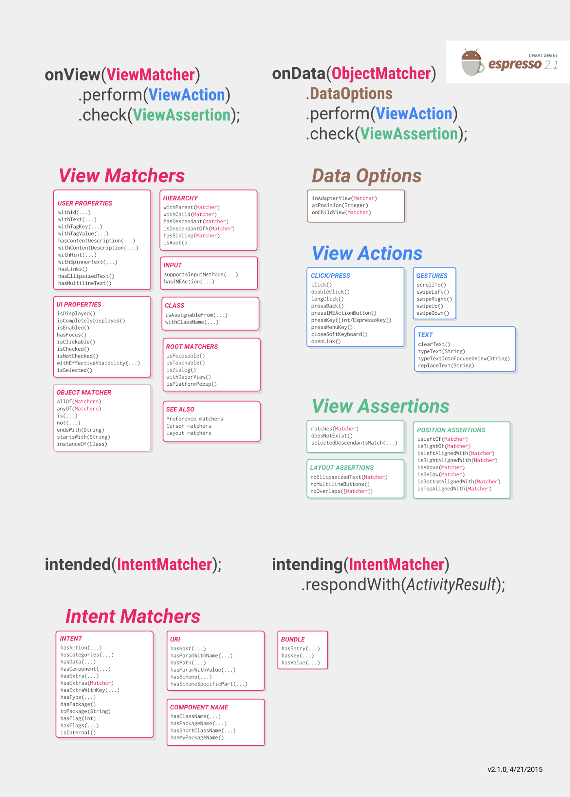
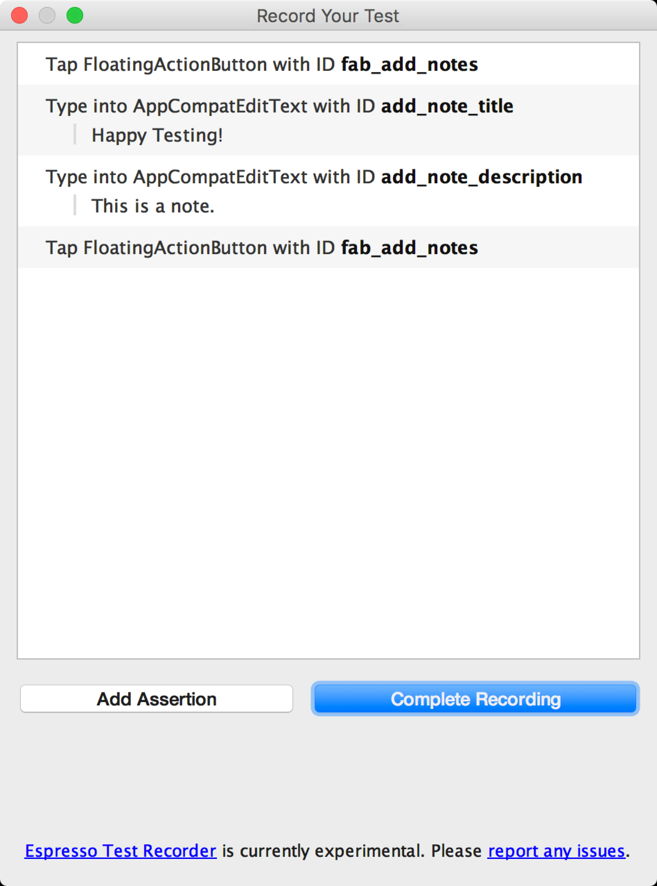

# Android Instrumented Test

## 1 Set up your testing environment
You MUST store the source files for instrumented tests at `module-name/src/androidTest/java/`

**AndroidX** Test includes **JUnit4** test runner([AndroidJUnitRunner](https://developer.android.com/reference/androidx/test/runner/AndroidJUnitRunner)) and APIs for functional UI tests ([Espresso](https://developer.android.com/training/testing/espresso) and [UI Automator](https://developer.android.com/training/testing/ui-automator)).

To simplify your test development, you should also include the [Hamcrest](https://github.com/hamcrest) library, which
lets you create more flexible assertions using the Hamcrest matcher APIs.

In your app's top-level **`build.gradle`** file, you need to specify these libraries as dependencies:

```groovy
dependencies {
    androidTestImplementation 'androidx.test:runner:1.1.0'
    androidTestImplementation 'androidx.test:rules:1.1.0'
    // Optional -- Hamcrest library
    androidTestImplementation 'org.hamcrest:hamcrest-library:1.3'
    // Optional -- UItesting with Espresso
    androidTestImplementation 'androidx.test.espresso:espresso-core:3.1.0'
    // Optional -- UItesting with UI Automator
    androidTestImplementation 'androidx.test.uiautomator:uiautomator:2.2.0'
}
```

To use JUnit 4 test classes, make sure to specify [**AndroidJUnitRunner**](https://developer.android.com/reference/androidx/test/runner/AndroidJUnitRunner) as the default
test instrumentation runner in your project by including the following setting
in your app's module-level **`build.gradle`** file:

```groovy
android {
    defaultConfig {
        testInstrumentationRunner "androidx.test.runner.AndroidJUnitRunner"
    }
}
```


## 2 Resolving conflicts between main and test APK
When instrumentation tests are run, both the main APK and test APK share the same classpath. Gradle build will fail if the main APK and the test APK use the same library (e.g. Guava) but in different versions. If gradle didn't catch that, your app could behave differently during tests and during normal run (including crashing in one of the cases).

To make the build succeed, just make sure both APKs use the same version. If the error is about an indirect dependency (a library you didn't mention in your build.gradle), just add a dependency for the newer version to the configuration ("compile" or "androidTestCompile") that needs it. You can also use [Gradle's resolution strategy mechanism](https://docs.gradle.org/current/dsl/org.gradle.api.artifacts.ResolutionStrategy.html). You can inspect the dependency tree by running `./gradlew :app:dependencies` and ./gradlew :app:androidDependencies.

## 3 Create an instrumented unit test class
To create a test suite for your unit tests, import the JUnit `RunWith` and `Suite` classes. In your test suite, add the `@RunWith(Suite.class)` and the `@Suite.SuitClasses()` annotations. In the `@Suite.SuiteClasses()` annotation, list the individual test classes or test suites as arguments.

## 4 Run instrumented unit tests

To run your instrumented tests, follow these steps:

1. Be sure your project is synchronized with Gradle by clicking **Sync Project**  in the toolbar.
2. Run your test in one of the following ways:
   ·      To run a single test, open the **Project** window, and then right-click a test and click **Run** .
   ·      To test all methods in a class, right-click a class or method in the test file and click **Run** .
   ·      To run all tests in a directory, right-click on the directory and select **Run tests** .

The [Android Plugin for Gradle](https://developer.android.com/tools/building/plugin-for-gradle.html) compiles the instrumented test code located in the default directory (```src/androidTest/java/```), builds a test APK and production APK, installs both APKs on the connected device or emulator, and runs the tests. Android Studio then displays the results of the instrumented test execution in the *Run* window.


# Espresso

## Overview

### Synchronization capabilities
Each time your test invokes [`onView()`](https://developer.android.com/reference/android/support/test/espresso/Espresso.html#onView(org.hamcrest.Matcher%3Candroid.view.View%3E)), Espresso waits to perform the corresponding UI action or assertion until the following synchronization conditions are met:

- The message queue is empty.
- There are no instances of `AsyncTask` currently executing a task.
- All developer-defined [idling resources](https://developer.android.com/training/testing/espresso/idling-resource.html) are idle.

By performing these checks, Espresso substantially increases the likelihood that only one UI action or assertion can occur at any given time. This capability gives you more reliable and dependable test results.

### Packages
- `espresso-core` - Contains core and basic `View` matchers, actions, and assertions. See [Basics](https://developer.android.com/training/testing/espresso/basics.html) and [Recipes](https://developer.android.com/training/testing/espresso/recipes.html).
- [`espresso-web`](https://developer.android.com/training/testing/espresso/web.html) - Contains resources for `WebView` support.
- [`espresso-idling-resource`](https://developer.android.com/training/testing/espresso/idling-resource.html) - Espresso's mechanism for synchronization with background jobs.
- `espresso-contrib` - External contributions that contain `DatePicker`,`RecyclerView` and `Drawer` actions, accessibility checks, and`CountingIdlingResource`.
- [`espresso-intents`](https://developer.android.com/training/testing/espresso/intents.html) - Extension to validate and stub intents for hermetic testing.
- `espresso-remote` - Location of Espresso's [multi-process](https://developer.android.com/training/testing/espresso/multiprocess) functionality.

You can learn more about the latest versions by reading the [release notes](https://developer.android.com/topic/libraries/testing-support-library/release-notes.html).

## setup instructions

### Set up your test environment

To avoid flakiness, we highly recommend that you turn off system animations on the virtual or physical devices used for testing. On your device, under **Settings > Developer options**, disable the following 3 settings:

- Window animation scale
- Transition animation scale
- Animator duration scale

### Example Gradle build file

```
apply plugin: 'com.android.application'

android {
    compileSdkVersion 28

    defaultConfig {
        applicationId "com.my.awesome.app"
        minSdkVersion 15
        targetSdkVersion 28
        versionCode 1
        versionName "1.0"

        testInstrumentationRunner "androidx.test.runner.AndroidJUnitRunner"
    }
}

dependencies {
    androidTestImplementation 'androidx.test:runner:1.1.0'
    androidTestImplementation 'androidx.test.espresso:espresso-core:3.1.0'
}
```

### Run tests

You can run your tests in Android Studio or from the command line.

#### In Android Studio

To create a test configuration in Android Studio, complete the following steps:

1. Open **Run > Edit Configurations**.
2. Add a new Android Tests configuration.
3. Choose a module.
4. Add a specific instrumentation runner: `androidx.test.runner.AndroidJUnitRunner`
5. Run the newly created configuration.

#### From the command line

Execute the following Gradle command:

```shell
./gradlew connectedAndroidTest
```

## Basic

### API components

The main components of Espresso include the following:

- **Espresso** – Entry point to interactions with views (via `onView()` and `onData()`). Also exposes APIs that are not necessarily tied to any view, such as `pressBack()`.
- **ViewMatchers** – A collection of objects that implement the `Matcher<? super View>` interface. You can pass one or more of these to the `onView()` method to locate a view within the current view hierarchy.
- **ViewActions** – A collection of `ViewAction` objects that can be passed to the `ViewInteraction.perform()` method, such as `click()`.
- **ViewAssertions** – A collection of `ViewAssertion` objects that can be passed the `ViewInteraction.check()` method. Most of the time, you will use the matches assertion, which uses a View matcher to assert the state of the currently selected view.

Example:

```java
// withId(R.id.my_view) is a ViewMatcher
// click() is a ViewAction
// matches(isDisplayed()) is a ViewAssertion
onView(withId(R.id.my_view))
    .perform(click())
    .check(matches(isDisplayed()));
```

### Find a view

 If you are not familiar with **hamcrest** matchers, we suggest you start with a quick look at [this presentation](https://www.slideshare.net/shaiyallin/hamcrest-matchers).

Sometimes, `R.id` values are shared between multiple views. When this happens an attempt to use a particular `R.id` gives you an exception, such as`AmbiguousViewMatcherException`. The exception message provides you with a text representation of the current view hierarchy, which you can search for and find the views that match the non-unique `R.id`:

```
java.lang.RuntimeException:
androidx.test.espresso.AmbiguousViewMatcherException
This matcher matches multiple views in the hierarchy: (withId: is <123456789>)

...

+----->SomeView{id=123456789, res-name=plus_one_standard_ann_button,
visibility=VISIBLE, width=523, height=48, has-focus=false, has-focusable=true,
window-focus=true, is-focused=false, is-focusable=false, enabled=true,
selected=false, is-layout-requested=false, text=,
root-is-layout-requested=false, x=0.0, y=625.0, child-count=1}
****MATCHES****
|
+------>OtherView{id=123456789, res-name=plus_one_standard_ann_button,
visibility=VISIBLE, width=523, height=48, has-focus=false, has-focusable=true,
window-focus=true, is-focused=false, is-focusable=true, enabled=true,
selected=false, is-layout-requested=false, text=Hello!,
root-is-layout-requested=false, x=0.0, y=0.0, child-count=1}
****MATCHES****
```

Looking through the various attributes of the views, you may find uniquely identifiable properties. In the example above, one of the views has the text `"Hello!"`. You can use this to narrow down your search by using combination matchers:

```java
onView(allOf(withId(R.id.my_view), withText("Hello!")))
```

You can also choose not to reverse any of the matchers:

```java
onView(allOf(withId(R.id.my_view), not(withText("Unwanted"))))
```

See [`ViewMatchers`](https://developer.android.com/reference/androidx/test/espresso/matcher/ViewMatchers.html) for the view matchers provided by Espresso.

#### Considerations

- In a well-behaved application, all views that a user can interact with should either contain descriptive text or have a content description. See [Making apps more accessible](https://developer.android.com/guide/topics/ui/accessibility/apps.html) for more details. If you are not able to narrow down a search using `withText()` or `withContentDescription()`, consider treating it as an accessibility bug.
- Use the least descriptive matcher that finds the one view you’re looking for. Do not over-specify as this will force the framework to do more work than is necessary. For example, if a view is uniquely identifiable by its text, you need not specify that the view is also assignable from `TextView`. For a lot of views the `R.id` of the view should be sufficient.
- If the target view is inside an `AdapterView`—such as `ListView`, `GridView`, or `Spinner`—the `onView()` method might not work. In these cases, you should use `onData()` instead.


### Perform an action on a view

When you have found a suitable matcher for the target view, it is possible to perform instances of `ViewAction` on it using the perform method.

For example, to click on the view:

```java
onView(...).perform(click());
```

You can execute more than one action with one perform call:

```java
onView(...).perform(typeText("Hello"), click());
```

If the view you are working with is located inside a `ScrollView` (vertical or horizontal), consider preceding actions that require the view to be displayed—such as `click()` and `typeText()`—with `scrollTo()`. This ensures that the view is displayed before proceeding to the other action:

```java
onView(...).perform(scrollTo(), click());
```

**Note:** The `scrollTo()` method will have no effect if the view is already displayed so you can safely use it in cases when the view is displayed due to larger screen size, such as when your tests run on both smaller and larger screen resolutions.

See [`ViewActions`](https://developer.android.com/reference/androidx/test/espresso/action/ViewActions) for the view actions provided by Espresso.

### Check view assertions

Assertions can be applied to the currently selected view with the `check()` method. The most used assertion is the `matches()` assertion. It uses a `ViewMatcher` object to assert the state of the currently selected view.

For example, to check that a view has the text `"Hello!"`:

```java
onView(...).check(matches(withText("Hello!")));
```

**Note:** Do not put "assertions" into the `onView()` argument. Instead, clearly specify what you are checking inside the check block.

If you want to assert that `"Hello!"` is content of the view, the following is considered bad practice:

```java
// Don't use assertions like withText inside onView.
onView(allOf(withId(...), withText("Hello!"))).check(matches(isDisplayed()));
```

On the other hand, if you want to assert that a view with the text `"Hello!"` is visible—for example after a change of the views visibility flag—the code is fine.

**Note:** Be sure to pay attention to the difference between asserting that a view is not displayed and asserting that a view is not present in the view hierarchy.


### Check data loading in adapter views

`AdapterView` is a special type of widget that loads its data dynamically from an Adapter. The most common example of an `AdapterView` is `ListView`. As opposed to static widgets like `LinearLayout`, only a subset of the `AdapterView` children may be loaded into the current view hierarchy. A simple `onView()` search would not find views that are not currently loaded.

Espresso handles this by providing a separate `onData()` entry point which is able to first load the adapter item in question, bringing it into focus prior to operating on it or any of its children.

**Note:** You may choose to bypass the `onData()` loading action for items in adapter views that are initially displayed on screen because they are already loaded. However, it is safer to always use `onData()`.

**Warning:** Custom implementations of `AdapterView` can have problems with the `onData()`method if they break inheritance contracts, particularly the `getItem()` API. In such cases, the best course of action is to refactor your application code. If you cannot do so, you can implement a matching custom `AdapterViewProtocol`. For more information, take a look at the default [`AdapterViewProtocols`](https://developer.android.com/reference/androidx/test/espresso/action/AdapterViewProtocols) class provided by Espresso.

### Debugging

Espresso provides useful debugging information when a test fails:

#### Logging

Espresso logs all view actions to logcat. For example:

```
ViewInteraction: Performing 'single click' action on view with text: Espresso
```

Espresso prints the view hierarchy in the exception message when `onView()` fails.

- If `onView()` does not find the target view, a **`NoMatchingViewException`** is thrown. You can examine the view hierarchy in the exception string to analyze why the matcher did not match any views.

- If `onView()` finds multiple views that match the given matcher, an **`AmbiguousViewMatcherException`** is thrown. The view hierarchy is printed and all views that were matched are marked with the `MATCHES` label

Espresso warns users about presence of `AdapterView` widgets. When an `onView()`operation throws a **`NoMatchingViewException`** and `AdapterView` widgets are present in the view hierarchy, the most common solution is to use `onData()`.

## Recipes

### Match a view next to another view

You can use the **`hasSibling()`** matcher to narrow down your selection:

```java
onView(allOf(withText("7"), hasSibling(withText("item: 0"))))
    .perform(click());
```

**`hasSibling()`** method is implemented as below:

```java
public boolean matchesSafely(View view) {
    ViewParent parent = view.getParent();
    if (!(parent instanceof ViewGroup)) {
    	return false;
    }
    ViewGroup parentGroup = (ViewGroup) parent;
    for (int i = 0; i < parentGroup.getChildCount(); i++) {
        if (siblingMatcher.matches(parentGroup.getChildAt(i))) {
        	return true;
        }
    }
    return false;
}
```

### Match a view that is inside an action bar

```java
// Open the options menu OR open the overflow menu, depending on whether
// the device has a hardware or software overflow menu button.
Espresso.openActionBarOverflowOrOptionsMenu(
        ApplicationProvider.getApplicationContext());

// Open the overflow menu from contextual action mode.
openContextualActionModeOverflowMenu();
```

To see the full code for these samples, view the [`ActionBarTest.java`](https://github.com/android/android-test/blob/7e834ce37faf52f2a65a73b0a6d83ab148707cbb/testapps/ui_testapp/javatests/androidx/test/ui/app/ActionBarTest.java) sample on GitHub.

### Assert that a view is not displayed

```java
import static androidx.test.espresso.Espresso.onView;
import static androidx.test.espresso.assertion.ViewAssertions.matches;
import static androidx.test.espresso.matcher.ViewMatchers.isDisplayed;
import static androidx.test.espresso.matcher.ViewMatchers.withId;
import static org.hamcrest.Matchers.not;

onView(withId(R.id.bottom_left)).check(matches(not(isDisplayed())));
```

The above approach works if the view is still part of the hierarchy. If it is not, you will get a `NoMatchingViewException` and you need to use `ViewAssertions.doesNotExist()`.

### Assert that a view is not present

```java
import static androidx.test.espresso.Espresso.onView;
import static androidx.test.espresso.assertion.ViewAssertions.doesNotExist;
import static androidx.test.espresso.matcher.ViewMatchers.withId;

onView(withId(R.id.bottom_left)).check(doesNotExist());
```

### Assert that a data item is not in an adapter

To prove a particular data item is not within an `AdapterView` you have to do things a little differently. We have to find the `AdapterView` we’re interested in and interrogate the data its holding. We don’t need to use `onData()`. Instead, we use `onView()` to find the `AdapterView` and then use another matcher to work on the data inside the view.

First the matcher:

```java
private static Matcher<View> withAdaptedData(final Matcher<Object> dataMatcher) {
    return new TypeSafeMatcher<View>() {

        @Override
        public void describeTo(Description description) {
            description.appendText("with class name: ");
            dataMatcher.describeTo(description);
        }

        @Override
        public boolean matchesSafely(View view) {
            if (!(view instanceof AdapterView)) {
                return false;
            }

            @SuppressWarnings("rawtypes")
            Adapter adapter = ((AdapterView) view).getAdapter();
            for (int i = 0; i < adapter.getCount(); i++) {
                if (dataMatcher.matches(adapter.getItem(i))) {
                    return true;
                }
            }

            return false;
        }
    };
}
```

Then the all we need is `onView()` to find the `AdapterView`:

```java
@SuppressWarnings("unchecked")
public void testDataItemNotInAdapter() {
    onView(withId(R.id.list))
          .check(matches(not(withAdaptedData(withItemContent("item: 168")))));
    }
}
```

And we have an assertion that will fail if an item that is equal to "item: 168" exists in an adapter view with the ID list.

For the full sample, look at the `testDataItemNotInAdapter()` method within the[`AdapterViewTest.java`](https://github.com/android/android-test/blob/7e834ce37faf52f2a65a73b0a6d83ab148707cbb/testapps/ui_testapp/javatests/androidx/test/ui/app/AdapterViewTest.java) class on GitHub.

### Use a custom failure handler

Replacing the default `FailureHandler` in Espresso with a custom one allows for additional or different error handling, such as taking a screenshot or passing along extra debug information.

The `CustomFailureHandlerTest` example demonstrates how to implement a custom failure handler:

```java
private static class CustomFailureHandler implements FailureHandler {
    private final FailureHandler delegate;

    public CustomFailureHandler(Context targetContext) {
        delegate = new DefaultFailureHandler(targetContext);
    }

    @Override
    public void handle(Throwable error, Matcher<View> viewMatcher) {
        try {
            delegate.handle(error, viewMatcher);
        } catch (NoMatchingViewException e) {
            throw new MySpecialException(e);
        }
    }
}
```

This failure handler throws a `MySpecialException` instead of a`NoMatchingViewException` and delegates all other failures to the`DefaultFailureHandler`. The `CustomFailureHandler` can be registered with Espresso in the `setUp()` method of the test:

```java
@Override
public void setUp() throws Exception {
    super.setUp();
    getActivity();
    setFailureHandler(new CustomFailureHandler(
            ApplicationProvider.getApplicationContext()));
}
```

For more information, see the [`FailureHandler`](https://developer.android.com/reference/androidx/test/espresso/FailureHandler) interface and [`Espresso.setFailureHandler()`](https://developer.android.com/reference/androidx/test/espresso/Espresso#setFailureHandler(androidx.test.espresso.FailureHandler)).

## Multiprocess Espresso

When using Multiprocess Espresso, keep the following versioning and scope considerations in mind:

- Your app must target Android 8.0 (API level 26) or higher.
- The tool can only test app components that you include in processes within your app's package. It cannot test external processes.

### Use the tool

To test a process within your app using Multiprocess Espresso, add a reference to the **espresso-remote** artifact in your app's `build.gradle` file:

app/build.gradle

```groovy
dependencies {
    ...
    androidTestImplementation 'androidx.test.espresso:espresso-remote:3.1.0'
}
```

You also need to add the following to your app's `androidTest` manifest:

- An `<instrumentation>` element that defines the process.
- A `<meta-data>` element indicating that you want to use Multiprocess Espresso.

The following code snippet shows how to add these elements:

src/androidTest/AndroidManifest.xml

```xml
<manifest ... package="androidx.test.mytestapp.tests">
  <uses-sdk android:targetSdkVersion="27" android:minSdkVersion="14" />
  <instrumentation
    android:name="androidx.test.runner.AndroidJUnitRunner"
    android:targetPackage="androidx.test.mytestapp"
    android:targetProcesses="*">
    <meta-data
      android:name="remoteMethod"
      android:value="androidx.test.espresso.remote.EspressoRemote#remoteInit" />
  </instrumentation>
</manifest>
```

The previous snippet indicates to the Android framework that you want it to test every process in your app's package. If you want to test only a subset of your app's processes, you can specify a comma-separated list within the `targetProcesses` element instead:

```xml
<instrumentation
    ...
    android:targetProcesses=
            "androidx.test.mytestapp:myFirstAppProcessToTest,
             androidx.test.mytestapp:mySecondAppProcessToTest" ... />
```

**Note:** Multiprocess Espresso ignores the value of `targetProcesses` if you set it to your app package's main process.

### Understand the tool's architecture

When you test your app and launch its default process, you might perform a UI interaction, such as a button press, that starts an activity in a secondary process. The system then completes the following steps to enable cross-process testing using Espresso:

1. The Android Framework creates and starts a new process to follow your app's navigational structure. Each `Instrumentation` process includes a new instance of[`AndroidJUnitRunner`](https://developer.android.com/reference/androidx/test/runner/AndroidJUnitRunner.html). At this stage, the 2 instrumentation processes cannot communicate with each other.
2. Each [`AndroidJUnitRunner`](https://developer.android.com/reference/androidx/test/runner/AndroidJUnitRunner.html) instance registers Espresso as its testing framework.
3. The 2 instances of [`AndroidJUnitRunner`](https://developer.android.com/reference/androidx/test/runner/AndroidJUnitRunner.html) perform a handshake to establish a connection between each other. At the same time, each [`AndroidJUnitRunner`](https://developer.android.com/reference/androidx/test/runner/AndroidJUnitRunner.html)instance connects all registered clients like Espresso with their respective counterparts in other processes so that these clients can form a direct communication channel between themselves.
4. Each [`AndroidJUnitRunner`](https://developer.android.com/reference/androidx/test/runner/AndroidJUnitRunner.html) instance continues to look for newly-added instrumentation instances and testing framework clients, establishing additional communication channels as needed.

Figure 1 illustrates the result of this process:

**Figure 1.** Establishing communication between multiple instrumentation processes using Multiprocess Espresso

The [Test-Driven Development on Android with the Android Testing Support Library](https://www.youtube.com/watch?v=pK7W5npkhho&start=2201) session video from Google I/O 2017, beginning at 36:41, also explains this process.

## Espresso lists

Espresso offers mechanisms to scroll to or act on a particular item for two types of lists: **adapter views** and **recycler views**.

When dealing with lists, especially those created with a **`RecyclerView`** or an **`AdapterView`** object, the view that you’re interested in might not even be on the screen because only a small number of children are displayed and are recycled as you scroll. The **`scrollTo()`** method can’t be used in this case because it requires an existing view.

### Interact with adapter view list items

Espresso will do all the work of finding the row in the `Adapter` object and making the item visible in the viewport.

### Match data using a custom view matcher

The activity below contains a `ListView`, which is backed by a `SimpleAdapter` that holds data for each row in a `Map<String, Object>` object.


The code for a click on the row with "item: 50" looks like this:

```java
onData(allOf(is(instanceOf(Map.class)), hasEntry(equalTo("STR"), is("item: 50"))))
    .perform(click());
```

For the full code of this test, take a look at the `testClickOnItem50()` method within the[`AdapterViewTest`](https://github.com/android/android-test/blob/7e834ce37faf52f2a65a73b0a6d83ab148707cbb/testapps/ui_testapp/javatests/androidx/test/ui/app/AdapterViewTest.java) class and [this custom `LongListMatchers`](https://github.com/android/android-test/blob/461ca02299807020c0b317b1805eb709d3c25147/testapps/ui_testapp/javatests/androidx/test/ui/app/LongListMatchers.java) matcher on GitHub.

### Match a specific child view

The sample above issues a click in the middle of the entire row of a `ListView`. But what if we want to operate on a specific child of the row? For example, we would like to click on the second column of the row of the `LongListActivity`, which displays the String.length of the content in the first column:


Just add an `onChildView()` specification to your implementation of `DataInteraction`:

```java
onData(withItemContent("item: 60"))
    .onChildView(withId(R.id.item_size))
    .perform(click());
```

**Note:** This sample uses the `withItemContent()` matcher from the sample above. Take a look at the `testClickOnSpecificChildOfRow60()` method in the [`AdapterViewTest`](https://github.com/android/android-test/blob/7e834ce37faf52f2a65a73b0a6d83ab148707cbb/testapps/ui_testapp/javatests/androidx/test/ui/app/AdapterViewTest.java) class on GitHub.

### Interact with recycler view list items

`RecyclerView` objects work differently than `AdapterView` objects, so `onData()` cannot be used to interact with them.

To interact with RecyclerViews using Espresso, you can use the `espresso-contrib` package, which has a collection of [`RecyclerViewActions`](https://developer.android.com/reference/androidx/test/espresso/contrib/RecyclerViewActions) that can be used to scroll to positions or to perform actions on items:

- `scrollTo()` - Scrolls to the matched View.
- `scrollToHolder()` - Scrolls to the matched View Holder.
- `scrollToPosition()` - Scrolls to a specific position.
- `actionOnHolderItem()` - Performs a View Action on a matched View Holder.
- `actionOnItem()` - Performs a View Action on a matched View.
- `actionOnItemAtPosition()` - Performs a ViewAction on a view at a specific position.

The following snippets feature some examples from the [RecyclerViewSample](https://github.com/googlesamples/android-testing/tree/master/ui/espresso/RecyclerViewSample) sample:

```java
@Test
public void scrollToItemBelowFold_checkItsText() {
    // First, scroll to the position that needs to be matched and click on it.
    onView(ViewMatchers.withId(R.id.recyclerView))
            .perform(RecyclerViewActions.actionOnItemAtPosition(ITEM_BELOW_THE_FOLD,
            click()));

    // Match the text in an item below the fold and check that it's displayed.
    String itemElementText = mActivityRule.getActivity().getResources()
            .getString(R.string.item_element_text)
            + String.valueOf(ITEM_BELOW_THE_FOLD);
    onView(withText(itemElementText)).check(matches(isDisplayed()));
}
```

```java
@Test
public void itemInMiddleOfList_hasSpecialText() {
    // First, scroll to the view holder using the isInTheMiddle() matcher.
    onView(ViewMatchers.withId(R.id.recyclerView))
            .perform(RecyclerViewActions.scrollToHolder(isInTheMiddle()));

    // Check that the item has the special text.
    String middleElementText =
            mActivityRule.getActivity().getResources()
            .getString(R.string.middle);
    onView(withText(middleElementText)).check(matches(isDisplayed()));
}
```

## Espresso-Intents

If your app delegates functionality to other apps or the platform, you can use Espresso-Intents to focus on your own app's logic while assuming that other apps or the platform will function correctly. With Espresso-Intents, you can match and validate your outgoing intents or even provide stub responses in place of actual intent responses.	

### Include Espresso-Intents in your project

In your app's `app/build.gradle` file, add the following line inside `dependencies`:

```groovy
androidTestImplementation 'androidx.test.espresso:espresso-intents:3.1.0'
```

Espresso-Intents is only compatible with Espresso 2.1+ and version 0.3+ of Android testing libraries, so make sure you update those lines as well:

```groovy
androidTestImplementation 'androidx.test:runner:1.1.0'
androidTestImplementation 'androidx.test:rules:1.1.0'
androidTestImplementation 'androidx.test.espresso:espresso-core:3.1.0'
```

### Write test rules

Before writing an Espresso-Intents test, set up an `IntentsTestRule`. This is an extension of the class `ActivityTestRule` and makes it easy to use Espresso-Intents APIs in functional UI tests. An `IntentsTestRule` initializes Espresso-Intents before each test annotated with `@Test` and releases Espresso-Intents after each test run.

The following code snippet is an example of an `IntentsTestRule`:

```java
@Rule
public IntentsTestRule<MyActivity> intentsTestRule =
    new IntentsTestRule<>(MyActivity.class);
```

### Match

Espresso-Intents provides the ability to intercept outgoing intents based on certain matching criteria, which are defined using Hamcrest Matchers. Hamcrest allows you to:

- **Use an existing intent matcher:** Easiest option, which should almost always be preferred.
- **Implement your own intent matcher:** Most flexible option. More details are available in the section entitled "Writing custom matchers" within the [Hamcrest tutorial](https://code.google.com/archive/p/hamcrest/wikis/Tutorial.wiki).

Espresso-Intents offers the [`intended()`](https://developer.android.com/reference/androidx/test/espresso/intent/Intents#intended(org.hamcrest.Matcher%3Candroid.content.Intent%3E,%20androidx.test.espresso.intent.VerificationMode)) and [`intending()`](https://developer.android.com/reference/androidx/test/espresso/intent/Intents#intending(org.hamcrest.Matcher%3Candroid.content.Intent%3E)) methods for intent validation and stubbing, respectively. Both take a Hamcrest `Matcher<Intent>` object as an argument.

The following code snippet shows intent validation that uses existing intent matchers that matches an outgoing intent that starts a browser:

```java
assertThat(intent).hasAction(Intent.ACTION_VIEW);
assertThat(intent).categories().containsExactly(Intent.CATEGORY_BROWSABLE);
assertThat(intent).hasData(Uri.parse("www.google.com"));
assertThat(intent).extras().containsKey("key1");
assertThat(intent).extras().string("key1").isEqualTo("value1");
assertThat(intent).extras().containsKey("key2");
assertThat(intent).extras().string("key2").isEqualTo("value2");
```

### Validate intents

Espresso-Intents records all intents that attempt to launch activities from the application under test. Using the `intended()` method, which is similar to `Mockito.verify()`, you can assert that a given intent has been seen. However, Espresso-Intents doesn't stub out responses to intents unless you [explicitly configure](https://developer.android.com/training/testing/espresso/intents#stubbing) it to do so.

The following code snippet is an example test that validates, but doesn't stub out responses to, an outgoing intent that launches an external "phone" activity:

```java
@Test
public void validateIntentSentToPackage() {
    // User action that results in an external "phone" activity being launched.
    user.clickOnView(system.getView(R.id.callButton));

    // Using a canned RecordedIntentMatcher to validate that an intent resolving
    // to the "phone" activity has been sent.
    intended(toPackage("com.android.phone"));
}
```

###  Stubbing

Using the `intending()` method, which is similar to `Mockito.when()`, you can provide a stub response for activities that are launched with `startActivityForResult()`. This is particularly useful for external activities because you cannot manipulate the user interface of an external activity nor control the `ActivityResult`returned to the activity under test.

The following code snippets implement an example `activityResult_DisplaysContactsPhoneNumber()` test, which verifies that when a user launches a "contact" activity in the app under test, the contact phone number is displayed:

1. Build the result to return when a particular activity is launched. The example test intercepts all Intents sent to "contacts" and stubs out their responses with a valid `ActivityResult`, using the result code`RESULT_OK`
2. Instruct Espresso to provide the stub result object in response to all invocations of the "contacts" intent:
3. Verify that the action used to launch the activity produces the expected stub result. In this case, the example test checks that the phone number "123-345-6789" is returned and displayed when the "contacts activity" is launched:

```java
@Test
public void activityResult_DisplaysContactsPhoneNumber() {
    // Build the result to return when the activity is launched.
    Intent resultData = new Intent();
    String phoneNumber = "123-345-6789";
    resultData.putExtra("phone", phoneNumber);
    ActivityResult result =
        new ActivityResult(Activity.RESULT_OK, resultData);

    // Set up result stubbing when an intent sent to "contacts" is seen.
    intending(toPackage("com.android.contacts")).respondWith(result);

    // User action that results in "contacts" activity being launched.
    // Launching activity expects phoneNumber to be returned and displayed.
    onView(withId(R.id.pickButton)).perform(click());

    // Assert that the data we set up above is shown.
    onView(withId(R.id.phoneNumber)).check(matches(withText(phoneNumber)));
}
```

##   Espresso Web

Espresso-Web is an entry point to work with Android WebView UI components. Espresso-Web reuses Atoms from the popular [WebDriver API](http://www.seleniumhq.org/docs/03_webdriver.jsp) to examine and control the behavior of a WebView.

### When to use Espresso-Web

Use Espresso-Web to test your hybrid apps, especially the integration of your app’s native UI components with its `WebView` UI components. You can use the Espresso-Web API in conjunction with other Espresso APIs to fully interact with web elements inside `WebView` objects.

If you need to test only the `WebView` itself, and not the interactions between the `WebView` and native components in your app, consider writing a general web test using a framework like [WebDriver](http://www.seleniumhq.org/docs/03_webdriver.jsp). If you use a web testing framework, you don’t need to use an Android device or a Java Virtual Machine, which makes your tests run more quickly and reliably. That being said, Espresso-Web allows you to reuse your custom WebDriver atoms, which gives you a lot of flexibility, especially when writing tests that you plan to run against both standalone web apps and apps that include an Android UI.

### How it works

Similarly to Espresso’s [`onData()`](https://developer.android.com/reference/androidx/test/espresso/Espresso#onData(org.hamcrest.Matcher%3C?%20extends%20java.lang.Object%3E)) method, a `WebView` interaction comprises several Atoms. `WebView`interactions use a combination of the Java programming language and a JavaScript bridge to do their work. Because there is no chance of introducing race conditions by exposing data from the JavaScript environment—everything Espresso sees on the Java-based side is an isolated copy—returning data from[`Web.WebInteraction`](https://developer.android.com/reference/androidx/test/espresso/web/sugar/Web.WebInteraction) objects is fully supported, allowing you to verify all data that’s returned from a request.

The WebDriver framework uses Atoms to find and manipulate web elements programmatically. Atoms are used by WebDriver to allow browser manipulation. An Atom is conceptually similar to a [`ViewAction`](https://developer.android.com/reference/androidx/test/espresso/ViewAction), a self-contained unit that performs an action in your UI. You expose Atoms using a list of defined methods, such as `findElement()` and `getElement()`, to drive the browser from the user’s point of view. However, if you use the WebDriver framework directly, Atoms need to be properly orchestrated, requiring logic that is quite verbose.

Within Espresso, the classes [`Web`](https://developer.android.com/reference/androidx/test/espresso/web/sugar/Web.html) and [`Web.WebInteraction`](https://developer.android.com/reference/androidx/test/espresso/web/sugar/Web.WebInteraction.html) wrap this boilerplate and give an Espresso-like feel to interacting with WebView objects. So in a context of a `WebView`, Atoms are used as a substitution to traditional Espresso [`ViewMatchers`](https://developer.android.com/reference/androidx/test/espresso/matcher/ViewMatchers.html) and [`ViewActions`](https://developer.android.com/reference/androidx/test/espresso/action/ViewActions.html).

The API then looks quite simple:

```java
onWebView()
    .withElement(Atom)
    .perform(Atom)
    .check(WebAssertion);
```

To learn more, read [Selenium’s documentation on Atoms](https://github.com/SeleniumHQ/selenium/wiki/Automation-Atoms).

### Implement WebView

#### Packages

To include Espresso-Web in your project, complete the following steps:

1. Open your app’s `build.gradle` file. This is usually not the top-level `build.gradle` file but`app/build.gradle`.

2. Add the following line inside dependencies:

   ```groovy
   androidTestImplementation 'androidx.test.espresso:espresso-web:3.1.0'
   ```

3. Espresso-Web is only compatible with Espresso 2.2 or higher and version 0.3 or higher of the testing library, so make sure you update those lines as well:

   ```groovy
   androidTestImplementation 'androidx.test:runner:1.1.0'
   androidTestImplementation 'androidx.test:rules:1.1.0'
   androidTestImplementation 'androidx.test.espresso:espresso-core:3.1.0'
   ```

#### Common API usage

The [`onWebView()`](https://developer.android.com/reference/androidx/test/espresso/web/sugar/Web.html#onWebView(org.hamcrest.Matcher%3Candroid.view.View%3E)) method is the main entry point when working with WebView on Android using Espresso. You use this method to perform Espresso-Web tests, such as the following:

```java
onWebView()
    .withElement(findElement(Locator.ID, "link_2")) // similar to onView(withId(...))
    .perform(webClick()) // Similar to perform(click())

    // Similar to check(matches(...))
    .check(webMatches(getCurrentUrl(), containsString("navigation_2.html")));
```

In this example, Espresso-Web locates a DOM element whose ID is `"link_2"` and clicks on it. The tool then verifies that the WebView sends a GET request containing the `"navigation_2.html"` string.

**Note:** When executing your tests, the system performs all WebView interactions using JavaScript. Therefore, to support JavaScript evaluation, the WebView under test must have JavaScript enabled.

You can force JavaScript to be enabled by overriding afterActivityLaunched() in the ActivityTestRule and calling [`onWebView().forceJavascriptEnabled()`](https://developer.android.com/reference/androidx/test/espresso/web/sugar/Web.WebInteraction.html#forceJavascriptEnabled()). Enabling JavaScript may cause the WebView under test to be reloaded. This is necessary to ensure that [AndroidJUnitRunner](https://developer.android.com/training/testing/junit-runner.html) loads all needed test infrastructure, including JavaScript interactions:

```java
@Rule
public ActivityTestRule<WebViewActivity> mActivityRule =
        new ActivityTestRule<WebViewActivity>(WebViewActivity.class,
        false, false) {
    @Override
    protected void afterActivityLaunched() {
        onWebView().forceJavascriptEnabled();
    }
}
```

#### Common web interactions

Common interactions with `Web.WebInteraction` objects include the following:

- [`withElement()`](https://developer.android.com/reference/androidx/test/espresso/web/sugar/Web.WebInteraction.html#withElement(androidx.test.espresso.web.model.ElementReference)) references a DOM element within the WebView.

  ```java
  onWebView().withElement(findElement(Locator.ID, "teacher"));
  ```

- [`withContextualElement()`](/reference/androidx/test/espresso/web/sugar/Web.WebInteraction.html#withContextualElement(androidx.test.espresso.web.model.Atom)) references a scoped DOM element within the WebView, relative to another DOM element. You should call `withElement()` first to establish the reference `Web.WebInteraction` object (DOM element).
  ```java
  .withElement(findElement(Locator.ID, "teacher"))
      .withContextualElement(findElement(Locator.ID, "person_name"));
  ```

- [`check()`](/reference/androidx/test/espresso/web/sugar/Web.WebInteraction.html#check(androidx.test.espresso.web.assertion.WebAssertion)) evaluates a condition, making sure that it resolves to `true`.
   ```java
  onWebView()
      .withElement(findElement(Locator.ID, "teacher"))
      .withContextualElement(findElement(Locator.ID, "person_name"))
      .check(webMatches(getText(), containsString("Socrates")));
  ```


- [`perform()`](/reference/androidx/test/espresso/web/sugar/Web.WebInteraction.html#perform(androidx.test.espresso.web.model.Atom)) executes an action within a WebView, such as clicking on an element.

  ```java
  onWebView()
      .withElement(findElement(Locator.ID, "teacher"))
      .perform(webClick());
  ```

- `reset()` reverts the WebView to its initial state. This is necessary when a prior action, such as a click, introduces a navigation change that makes ElementReference and WindowReference objects inaccessible.

  **Note:** Although using `reset()` is useful when making assertions against multi-page workflows, such as form submissions, your tests should usually be limited in scope and focus on a single page.

  ```java
  onWebView()
      .withElement(...)
      .perform(...)
      .reset();
  ```

#### Example

The following example tests whether, after entering text into a WebView and selecting a **Submit** button, the same text appears within a different element in the same WebView: 

  ```java
  public static final String MACCHIATO = "Macchiato";
  
  @Test
  public void typeTextInInput_clickButton_SubmitsForm() {
      // Lazily launch the Activity with a custom start Intent per test.
      mActivityRule.launchActivity(withWebFormIntent());
  
      // Selects the WebView in your layout. If you have multiple WebView objects,
      // you can also use a matcher to select a given WebView,
      // onWebView(withId(R.id.web_view)).
      onWebView()
          // Find the input element by ID.
          .withElement(findElement(Locator.ID, "text_input"))
  
          // Clear previous input and enter new text into the input element.
          .perform(clearElement())
          .perform(DriverAtoms.webKeys(MACCHIATO))
  
          // Find the "Submit" button and simulate a click using JavaScript.
          .withElement(findElement(Locator.ID, "submitBtn"))
          .perform(webClick())
  
          // Find the response element by ID, and verify that it contains the
          // entered text.
          .withElement(findElement(Locator.ID, "response"))
          .check(webMatches(getText(), containsString(MACCHIATO)));
  }
  ```

  See also the [Espresso Web sample](https://github.com/googlesamples/android-testing/tree/master/ui/espresso/WebBasicSample) on GitHub.

## Espresso idling resources

An *idling resource* represents an asynchronous operation whose results affect subsequent operations in a UI test. By registering idling resources with Espresso, you can validate these asynchronous operations more reliably when testing your app.

### Identify when idling resources are needed

Espresso provides a sophisticated set of [synchronization capabilities](https://developer.android.com/training/testing/espresso/index.html#sync). This characteristic of the framework, however, applies only to operations that post messages on the `MessageQueue`, such as a subclass of `View` that's drawing its contents on the screen.

Because Espresso isn't aware of any other asynchronous operations, including those running on a background thread, Espresso can't provide its synchronization guarantees in those situations. In order to make Espresso aware of your app's long-running operations, you must register each one as an idling resource.

If you don't use idling resources when testing the results of your app's asynchronous work, you might find yourself having to use one of the following bad workarounds to improve your tests' reliability:

- **Adding calls to Thread.sleep().** When you add artificial delays to your tests, it takes longer for your test suite to finish executing, and your tests might still fail sometimes when executed on slower devices. In addition, these delays don't scale well, as your app might have to perform more time-consuming asynchronous work in a future release.
- **Implementing retry wrappers,** which use a loop to repeatedly check whether your app is still performing asynchronous work until a timeout occurs. Even if you specify a maximum retry count in your tests, each re-execution consumes system resources, particularly the CPU.
- **Using instances of CountDownLatch,** which allow one or more threads to wait until a specific number of operations being executed in another thread are complete. These objects require you to specify a timeout length; otherwise, your app might be blocked indefinitely. The latches also add unnecessary complexity to your code, making maintenance more difficult.

Espresso allows you to remove these unreliable workarounds from your tests and instead register your app's asynchronous work as idling resources.

### Common use cases

When performing operations similar to the following examples in your tests, consider using an idling resource:

- **Loading data** from the internet or a local data source.
- **Establishing connections** with databases and callbacks.
- **Managing services**, either using a system service or an instance of `IntentService`.
- **Performing complex business logic**, such as bitmap transformations.

It's especially important to register idling resources when these operations update a UI that your tests then validate.

**Note:** Some third-party libraries use threading schemes that require manual thread management. In these situations, add threading logic to achieve the same functionality benefits as the ones you enjoy by using idling resources directly.

### Example idling resource implementations

The following list describes several example implementations of idling resources that you can [integrate into your app](https://developer.android.com/training/testing/espresso/idling-resource#integrate-into-app):

- [`CountingIdlingResource`](https://developer.android.com/reference/androidx/test/espresso/idling/CountingIdlingResource.html)

  Maintains a counter of active tasks. When the counter is zero, the associated resource is considered idle. This functionality closely resembles that of a `Semaphore`. In most cases, this implementation is sufficient for managing your app's asynchronous work during testing.

- [`UriIdlingResource`](https://developer.android.com/reference/androidx/test/espresso/idling/net/UriIdlingResource.html)

  Similar to [`CountingIdlingResource`](https://developer.android.com/reference/androidx/test/espresso/idling/CountingIdlingResource.html), but the counter needs to be zero for a specific period of time before the resource is considered idle. This additional waiting period takes consecutive network requests into account, where an app in your thread might make a new request immediately after receiving a response to a previous request.

- [`IdlingThreadPoolExecutor`](https://developer.android.com/reference/androidx/test/espresso/idling/concurrent/IdlingThreadPoolExecutor.html)

  A custom implementation of `ThreadPoolExecutor` that keeps track of the total number of running tasks within the created thread pools. This class uses a[`CountingIdlingResource`](https://developer.android.com/reference/androidx/test/espresso/idling/CountingIdlingResource.html) to maintain the counter of active tasks.

- [`IdlingScheduledThreadPoolExecutor`](https://developer.android.com/reference/androidx/test/espresso/idling/concurrent/IdlingScheduledThreadPoolExecutor.html)

  A custom implementation of `ScheduledThreadPoolExecutor`. It provides the same functionality and capabilities as the [`IdlingThreadPoolExecutor`](https://developer.android.com/reference/androidx/test/espresso/idling/concurrent/IdlingThreadPoolExecutor.html) class, but it can also keep track of tasks that are scheduled for the future or are scheduled to execute periodically.

**Note:** The synchronization benefits associated with these implementations of idling resources only take effect following Espresso's first invocation of that resource's [`isIdleNow()`](https://developer.android.com/reference/androidx/test/espresso/IdlingResource.html#isIdleNow()) method. Therefore, you must register these idling resources **before** you need them.

### Create your own idling resource

As you use idling resources in your app's tests, you might need to provide custom resource management or logging. In those cases, the implementations listed in the previous section might not suffice. If that's the case, you can extend one of these idling resource implementations or create your own.

If you implement your own idling resource functionality, keep the following best practices in mind, particularly the first one:

#### **Invoke transitions to the idle state outside idle checks.**

After your app becomes idle, call [`onTransitionToIdle()`](https://developer.android.com/reference/androidx/test/espresso/IdlingResource.ResourceCallback.html#onTransitionToIdle()) outside any implementations of [`isIdleNow()`](https://developer.android.com/reference/androidx/test/espresso/IdlingResource.html#isIdleNow()). That way, Espresso doesn't make a second, unnecessary check to determine whether a given idling resource is idle.

The following code snippet illustrates this recommendation:

```java
public void isIdle() {
    // DON'T call callback.onTransitionToIdle() here!
}

public void backgroundWorkDone() {
    // Background work finished.
    callback.onTransitionToIdle() // Good. Tells Espresso that the app is idle.

    // Don't do any post-processing work beyond this point. Espresso now
    // considers your app to be idle and moves on to the next test action.
}
```

#### **Register idling resources before you need them.**

The synchronization benefits associated with idling resources only take effect following Espresso's first invocation of that resource's [`isIdleNow()`](https://developer.android.com/reference/androidx/test/espresso/IdlingResource.html#isIdleNow()) method.

The following list shows several examples of this property:

- If you register an idling resource in a method annotated with `@Before`, the idling resource takes effect in the first line of each test.
- If you register an idling resource inside a test, the idling resource takes effect during the next Espresso-based action. This behavior still occurs even if the next action is in the same test as the statement that registers the idling resource.

#### **Unregister idling resources after you're done using them.**

To conserve system resources, you should unregister idling resources as soon as you don't need them anymore. For example, if you register an idling resource in a method annotated with `@Before`, it's best to unregister this resource in a corresponding method that's annotated with `@After`.

#### **Use an idling registry to register and unregister idling resources.**

By using this container for your app's idling resources, you can register and unregister idling resources repeatedly as needed and still observe consistent behavior.

#### **Maintain only simple app state within idling resources.**

For example, the idling resources that you implement and register shouldn't contain references to `View` objects.

### Register idling resources

Espresso provides a container class into which you can place your app's idling resources. This class, called [`IdlingRegistry`](https://developer.android.com/reference/androidx/test/espresso/IdlingRegistry.html), is a self-contained artifact that introduces minimal overhead to your app. The class also allows you to take the following steps toward improving your app's maintainability:

- Create a reference to the `IdlingRegistry`, instead of the idling resources that it contains, in your app's tests.
- Maintain differences in the collection of idling resources that you use for each build variant.
- Define idling resources in your app's services, rather than in the UI components that reference those services.

**Note:** The [`IdlingRegistry`](https://developer.android.com/reference/androidx/test/espresso/IdlingRegistry.html) class is the only supported method of registering your app's idling resources.

### Integrate idling resources into your app

Although you can add idling resources to an app in several different ways, one approach in particular maintains encapsulation for your app while still allowing you to specify a particular operation that a given idling resource represents.

#### Recommended approach

When adding idling resources into your app, we **highly** recommend performing only the registration and unregistration operations in your tests and placing the idling resource logic itself in your app's production code.

Although you create the unusual situation of using a test-only interface in production code by following this approach, you can wrap idling resources around code that you already have, maintaining your app's APK size and method count.

#### Alternative approaches

If you'd prefer to not have idling resources logic in your app's production code, there are several other viable integration strategies:

- Create build variants, such as Gradle's [product flavors](https://developer.android.com/studio/build/build-variants.html#product-flavors), and use idling resources only in your app's debug build.
- Use a dependency injection framework like [Dagger](https://google.github.io/dagger) to inject your app's idling resource dependency graph into your tests. If you're using Dagger 2, the injection itself should originate from a subcomponent.
- Implement an idling resource in your app's tests, and expose the part of your app's implementation that needs to be synchronized in those tests.

**Caution:** Although this design decision seems to create a self-contained reference to idling resources, it also breaks encapsulation in all but the simplest of apps.

## Espresso cheat sheet

The Espresso Cheat Sheet is a quick reference you can use during development. This cheat sheet contains most available instances of `Matcher`, `ViewAction`, and `ViewAssertion`.



An offline version is also available in PDF format: [espresso-cheat-sheet-2.1.0.pdf](https://android.github.io/android-test/downloads/espresso-cheat-sheet-2.1.0.pdf).

## [使用 Espresso 测试记录器创建界面测试](https://developer.android.com/studio/test/espresso-test-recorder)

利用 Espresso 测试记录器工具，您可以为应用创建界面测试，而无需编写任何测试代码。通过记录测试情景，您可以记录您与设备的交互并且添加断言，在应用的特定快照中验证界面元素。随后，Espresso 测试记录器会提取所保存的记录，并自动生成对应的界面测试，您可以运行此测试来测试您的应用。

Espresso 测试记录器根据 [Espresso 测试框架](https://google.github.io/android-testing-support-library/docs/espresso/)编写测试，这种测试框架是 [Android 测试支持库](https://developer.android.com/topic/libraries/testing-support-library/index.html)中的一种 API。Espresso API 建议您根据用户操作创建简洁、可靠的界面测试。此结构可以声明预期、交互和断言，而不用直接访问底层应用的 Activity 和视图，这样可以防止测试不稳定并能优化测试运行速度。

视频教程（需翻墙）：https://youtu.be/JRkDVvB106k

### 在您的测试设备上关闭动画

在使用 Espresso 测试记录器之前，请确保在您的测试设备上关闭动画以防止意外结果。按照[测试单个应用的界面](https://developer.android.com/training/testing/ui-testing/espresso-testing.html#setup)页面上的“设置 Espresso”说明操作，不过请注意，您不需要手动设置对 Espresso 库的依赖项引用，因为测试记录器会在您[保存记录](https://developer.android.com/studio/test/espresso-test-recorder#save-a-recording)时自动执行此操作。对于给定项目来说，这些步骤仅需要完成一次。

### 记录 Espresso 测试

Espresso 测试由两个主要部分组成：界面交互和 View 元素断言。界面交互包括用户可以用来与您的应用交互的点按和键入操作。断言旨在验证视觉元素的内容是否存在于屏幕上。例如，[“便签”测试应用](https://github.com/googlecodelabs/android-testing)的 Espresso 测试可能包含点击按钮和添加新便签的界面交互，以及使用断言来验证按钮是否存在和便签的内容。

本部分将介绍如何使用 Espresso 测试记录器创建这两个测试组成部分，以及如何保存您已完成的记录来生成测试。

#### 记录界面交互

要开始使用 Espresso 测试记录器记录测试，请执行以下操作：

1. 点击 **Run** > **Record Espresso Test**。
2. 在 **Select Deployment Target** 窗口中，选择您想要在上面记录测试的设备。如果需要，[创建一个新的 Android Virtual Device](https://developer.android.com/studio/run/managing-avds.html)。点击 **OK**。
3. Espresso 测试记录器可以触发您的项目的一个构建，在 Espresso 测试记录器允许您与应用交互之前，您必须先安装并启动应用。**Record Your Test** 窗口将在应用启动后显示，由于您尚未与设备交互，主面板将显示“No events recorded yet.”。与您的设备交互以开始记录事件，例如“点按”和“键入”操作。

**注**：在可以开始记录交互之前，您可能会在设备上看到一个显示“Waiting for Debugger”或“Attaching Debugger”的对话框。Espresso 测试记录器使用调试程序记录界面事件。连接调试程序后，对话框将自动关闭；请勿点击 **Force Close**。

记录的交互将显示在 **Record Your Test** 窗口的主面板中，如图 1 中所示。在您运行测试时，Espresso 测试将尝试以相同顺序执行这些操作。



**图 1.** 带有已记录的界面交互的 **Record Your Test** 窗口。

#### 添加断言以验证界面元素

断言可以通过三种主要类型验证某个 [View](https://developer.android.com/reference/android/view/View.html) 元素是否存在或者它的内容：

- **text is**：检查已选定 View 元素的文本内容
- **exists**：检查 View 元素是否存在于屏幕上可见的当前 View 层次结构中
- **does not exist**：检查 View 元素是否不存在于当前 View 层次结构中

要向您的测试添加断言，请执行以下操作：

1. 点击 **Add Assertion**。在 Espresso 获取界面层次结构和当前应用状态的其他相关信息时，将显示一个 **Screen Capture** 对话框。该对话框将在 Espresso 捕获屏幕截图后自动关闭。
2. 当前屏幕的布局将显示在 **Record Your Test** 窗口右侧的面板中。要选择将要在它上面创建断言的 View 元素，请点击屏幕截图中的元素，或者使用窗口底部 **Edit assertion** 框中的第一个下拉菜单。选定的 View 对象将突出显示在红框中。
3. 从 **Edit assertion** 框的第二个下拉菜单中选择您想要使用的断言。Espresso 将使用选定 View 元素的有效断言填充菜单。
   - 如果您选择“text is”断言，Espresso 将自动插入选定 View 元素中当前存在的文本。您可以使用 **Edit assertion** 框中的文本字段编辑文本，使之匹配您的所需断言。
4. 点击 **Save and Add Another** 创建另一个断言，或者点击 **Save Assertion** 关闭断言面板。

图 2 中的屏幕截图所示为正在创建一个“text is”断言来验证便签的标题是否为“Happy Testing!”：


**图 2.** 选择 View 元素（位于红框中）后的 **Edit assertion** 框。

在创建断言时，您可以继续与您的应用交互，即使断言面板在 **Record Your Test** 窗口内仍然打开，也是如此。Espresso 测试记录器将继续记录您的操作，但是您正在编辑的断言在保存后将显示在这些交互之前。断言的屏幕截图也将保持您点击 **Add Assertion** 按钮时设备或模拟器具有的布局。

#### 保存记录

完成与应用的交互并添加断言后，请按照下面的步骤操作，保存您的记录并生成 Espresso 测试：

1. 点击 **Complete Recording**。将显示 **Pick a test class name for your test** 窗口。
2. Espresso 测试记录器会根据已启动 Activity 的名称在其软件包内为您的测试提供一个唯一名称。如果您想要更改建议的名称，请使用 **Test class name** 文本字段。点击 **Save** 。
   - 如果您还未将 Espresso 依赖项添加到您的应用中，则在您尝试保存测试时，将显示一个 **Missing Espresso dependencies** 对话框。点击 **Yes**，将依赖项自动添加到您的 `build.gradle` 文件中。
3. 文件将在 Espresso 测试记录器生成它后自动打开，Android Studio 将显示在 IDE 的 **Project** 窗口中选择的测试类。
   - 测试的保存位置取决于您的[仪器测试](https://developer.android.com/training/testing/unit-testing/instrumented-unit-tests.html)根目录的位置以及已启动 Activity 的软件包名称。例如，[“便签”测试应用](https://github.com/googlecodelabs/android-testing)的测试保存在您记录测试的应用模块的 **src** > **androidTest** > **java** > **com.example.username.appname** 文件夹中。

### 在本地运行 Espresso 测试

要运行 Espresso 测试，请使用 Android Studio IDE 左侧的 **Project**  窗口：

1. 打开所需的应用模块文件夹并导航至您想要运行的测试。测试的位置取决于您的

   仪器测试

   根目录的位置以及已启动 Activity 的软件包名称。以下示例显示了

   “便签”测试应用

   的测试保存位置：

   - 如果您正在窗口内使用 **Android 视图**，请导航至 **java** > **com.example.username.appname (androidTest)**。
   - 如果您正在窗口内使用 **Project** 视图，请导航至模块文件夹内的 **src** > **androidTest**> **java** > **com.example.username.appname**。

2. 右键点击测试并点击 **Run ‘testName’** 。

   - 或者，您也可以打开测试文件，然后右键点击生成的测试类或函数。有关如何运行测试的详细信息，请阅读[测试应用](https://developer.android.com/studio/test/index.html#run_a_test)页面。

3. 在 **Select Deployment Target** 窗口中，选择您想要在上面运行测试的设备。如果需要，[创建一个新的 Android Virtual Device](https://developer.android.com/studio/run/managing-avds.html)。点击 **OK**。

在 IDE 底部的 **Run** 窗口中监控测试的进度。Android Studio 将为您的项目运行完整构建并在 **Run** 窗口中打开一个包含您的测试名称的标签，如图 3 所示。您可以在这个标签中查看您的测试是通过还是失败，以及测试的运行时长。在测试完成时，标签将记录“Tests ran to completion.”。


**图 3**. 在本地运行 Espresso 测试后 **Run** 窗口中的示例输出。

要详细了解如何编写测试运行配置，请阅读[创建和编辑运行/调试配置](https://developer.android.com/studio/run/rundebugconfig.html#creating)中的“为类或函数定义测试配置”部分。

### 利用 Firebase Android 测试实验室运行 Espresso 测试

您可以将 Espresso 测试记录器生成的测试与 [Firebase 测试实验室](https://firebase.google.com/docs/test-lab/)结合使用，在云中针对成百上千种设备配置对您的应用进行测试。利用测试实验室在 [Spark 方案每日免费配额](https://firebase.google.com/docs/test-lab/overview#quota_for_spark_and_flame_plans)内测试您的应用时不收取任何费用。要利用 Firebase 测试实验室运行 Espresso 测试，请为您的应用[创建 Firebase 项目](https://firebase.google.com/docs/test-lab/web-ui#create_a_firebase_project)，然后按照说明从 Android Studio 中[利用 Firebase 测试实验室运行测试](https://developer.android.com/training/testing/unit-testing/instrumented-unit-tests.html#run-ctl)。


**图 4**. 利用 Firebase 测试实验室在多个设备上运行测试后 **Run** 窗口中的示例输出。

## 一些常见的case

### ViewMatchers View匹配器适配类

开源世界的金科玉律：没事多翻翻源码，`android/support/test/espresso/matcher`

最重要也是应用最广的匹配器，通过一个或者多个来定位层级里面的控件。 
包含了大量的常见的匹配操作，大部分都是通过TypeSafeMatcher 和 BoundedMatcher实现的

#### 断言某个View符合Matcher规则

void assertThat(T actual, Matcher<T> matcher)

void assertThat(String message, T actual, Matcher<T> matcher)

#### id匹配的Matcher规则（最常用）

Matcher<View> withId(final int id)

Matcher<View> withId(final Matcher<Integer> integerMatcher)

#### text匹配TextView的Matcher规则

Matcher<View> withText(String text)

Matcher<View> withText(final Matcher<String> stringMatcher)

Matcher<View> withText(final int resourceId)

#### 获取focus、focusable、enable、display、clickable等状态的Matcher规则

Matcher<View> hasFocus()

Matcher<View> isFocusable()

Matcher<View> isEnabled()

Matcher<View> isDisplayed()

Matcher<View> isClickable()

Matcher<View> isSelected()

Matcher<View> isChecked()

Matcher<View> isNotChecked()

#### RootMatchers 根视图匹配器的辅助类

匹配root装饰视图匹配给定的视图匹配器，也就是一系列静态方法，返回指定的 Matcher

```java
onView(withText("Text"))
  .inRoot(withDecorView(not(is(getActivity().getWindow().getDecorView()))))
  .perform(click());
```

RootMatchers还有以下方法可以应用到其他场景：

| Function Name                                 | 功能                                           | 方法注释                                                     |
| --------------------------------------------- | ---------------------------------------------- | ------------------------------------------------------------ |
| isDialog()                                    | 匹配是对话框的根视图                           | Matches {@link Root}s that are dialogs (i.e. is not a window of the currently resumed* activity). |
| isFocusable()                                 | 匹配可获取焦点的根视图                         | Matches {@link Root}s that can take window focus.            |
| isPlatformPopup()                             | 匹配弹出式窗体的跟视图，如spinner，actionbar等 | Matches {@link Root}s that are popups - like autocomplete suggestions or the actionbar spinner. |
| sTouchable()                                  | 匹配可触摸的根视图                             | Matches {@link Root}s that can receive touch events.         |
| withDecorView(final Matcher decorViewMatcher) | 指定view的跟视图                               | Matches {@link Root}s with decor views that match the given view matcher |

例如：

```java
//指定View的跟视图不在当前的Activity根布局层次中，例如Toast
inRoot(withDecorView(not(mRules.getActivity().getWindow().getDecorView())))
inRoot(withDecorView(not(is(getActivity().getWindow().getDecorView()))))
```

#### Matchers 对Matcher的操作集合类

- allof(Matchers ) 满足Matchers 定义的所有Matcher
- anyof(Matchers ) 至少满足Matchers 定义的任意一个Matcher
- is(…)
- not(…)
- notNullValue()
- nullValue()
- endsWith(java.lang.String suffix)
- startsWith(java.lang.String prefix)


### Find a DataInteraction

#### AdapterView的OnData

关注于AdapterView的数据。由于AdapterView的数据源可能很长，很多时候无法一次性将所有数据源显示在屏幕上，因此我们主要先关注AdapterView中包含的数据，而非一次性就进行View的匹配。

**onData 只适用于 AdapterView及其派生类，不适用于 RecyleView。**

#### OnData支持的筛选

onData我们使用了data进行了筛选，完全屏蔽了View，那么现在问题来了:

假设一个页面里有多个ListView，譬如“ViewPager＋ListView的实现”

如果继续用上述方法，会出现：

```shell
android.support.test.espresso.AmbiguousViewMatcherException: ‘is assignable from class: class android.widget.AdapterView’ matches multiple views in the hierarchy. 
Problem views are marked with ‘*MATCHES*’ below.
```

解决方案就是：

- inAdapterView(Matcher adapterMatcher)

```java
onData(...).inAdapterView(allOf(isAssignableFrom(AdapterView.class),isDisplayed())).perform(click());

onData(...).inAdapterView(allOf(withId(R.id.list),isDisplayed())).perform(click());
```

详细的看看DataInteraction还支持那些筛选，来辅助onData：

| Tables                                        | 示意                                                         | 适用场景                                                     |
| :-------------------------------------------- | :----------------------------------------------------------- | :----------------------------------------------------------- |
| inAdapterView(Matcher< View > adapterMatcher) | 选择 满足adapterMatcher的adapterview 来执行onData操作        | 当前界面有多个adapterview，导致错误                          |
| onChildView(Matcher< View> childMatcher)      | 匹配”onData所匹配的item视图”中的指定子视图                   | 需要点击item中的某个子view                                   |
| atPosition(Integer atPosition)                | 选中匹配的Adapter的第几项，默认不选择，可以通过atPosition方法设定 | onData只定义“类型校验”, onData(is(instanceOf(String.class)).atPosition(0) |
| inRoot(Matcher< Root> rootMatcher)            | 在指定跟视图中来执行onData操作                               | 对话框里的adapterview                                        |

### ViewAssertion

#### 函数支持

- ### matches（Matcher）

  ```java
  ViewAssertion matches(final Matcher<? super View> viewMatcher)
  ```

- doesNotExist() 指定View不存在

- selectedDescendantsMatch

  ```java
    /**
     * Returns a generic {@link ViewAssertion} that asserts that the descendant views selected by the
     * selector match the specified matcher.
     * selector选中的view的子节点是否都满足matcher
     *  Example: onView(rootView).check(selectedDescendantsMatch(
     * not(isAssignableFrom(TextView.class)), hasContentDescription()));
     */
    public static ViewAssertion selectedDescendantsMatch(
        final Matcher<View> selector, final Matcher<View> matcher) 
  ```

- noEllipsizedText 其子view中的TextView都不是Ellipsized

  ```java
    /**
     * Returns a {@link ViewAssertion} that asserts that view hierarchy does not contain
     * ellipsized or cut off text views.
     */
    public static ViewAssertion noEllipsizedText() {
      return selectedDescendantsMatch(
          isAssignableFrom(TextView.class), not(hasEllipsizedText()));
    }
  ```

- noMultilineButtons 其子view中的Button都不是 Multiline

  ```java
    /**
     * Returns a {@link ViewAssertion} that asserts that view hierarchy does not contain
     * multiline buttons.
     */
    public static ViewAssertion noMultilineButtons() {
      return selectedDescendantsMatch(
          isAssignableFrom(Button.class), not(hasMultilineText()));
    }
  ```

- noOverlaps

  ```java
    /**
     * Returns a {@link ViewAssertion} that asserts that descendant views matching the selector
     * do not overlap each other.
     * <p>
     * Example: onView(rootView).check(noOverlaps(isAssignableFrom(TextView.class));
     */
    public static ViewAssertion noOverlaps(final Matcher<View> selector)
  ```
- Position Assertions
  


# References

- [谷歌官方文档](https://developer.android.com/training/testing)
- [录制Espresso](https://developer.android.com/studio/test/espresso-test-recorder#top_of_page)
- [Espresso学习笔记二：Espresso基础知识](https://blog.csdn.net/miaoqilong/article/details/46650903)
- [vogella - Espresso - Tutorial](http://www.vogella.com/tutorials/AndroidTestingEspresso/article.html)

