# 基本概念

Fragment，简称碎片，是Android 3.0（API 11）提出的，为了兼容低版本，support-v4库中也开发了一套Fragment API，最低兼容Android 1.6。
 过去support-v4库是一个jar包，24.2.0版本开始，将support-v4库模块化为多个jar包，包含：support-fragment, support-ui, support-media-compat等，这么做是为了减少APK包大小，你需要用哪个模块就引入哪个模块。
 如果想引入整个support-v4库，则compile 'com.android.support:support-v4:24.2.1'，如果只想引入support-fragment库，则com.android.support:support-fragment:24.2.1。

> 因为support库是不断更新的，因此建议使用support库中的android.support.v4.app.Fragment，而不要用系统自带的android.app.Fragment。而如果要使用support库的Fragment，Activity必须要继承FragmentActivity（AppCompatActivity是FragmentActivity的子类）。

Fragment官方的定义是：

> Fragment represents a behavior or a portion of user interface in an Activity. You can combine multiple fragments in a single activity to build a multi-pane UI and reuse a fragment in multiple activities. You can think of a fragment as a modular section of an activity, which has its own lifecycle, receives its own input events, and which you can add or remove while the activity is running.

根据上面的定义可知：

- Fragment是依赖于Activity的，不能独立存在的。
- 一个Activity里可以有多个Fragment。
- 一个Fragment可以被多个Activity重用。
- Fragment有自己的生命周期，并能接收输入事件。
- 我们能在Activity运行时动态地添加或删除Fragment。

Fragment的优势有以下几点：

- 模块化（Modularity）：我们不必把所有代码全部写在Activity中，而是把代码写在各自的Fragment中。
- 可重用（Reusability）：多个Activity可以重用一个Fragment。
- 可适配（Adaptability）：根据硬件的屏幕尺寸、屏幕方向，能够方便地实现不同的布局，这样用户体验更好。

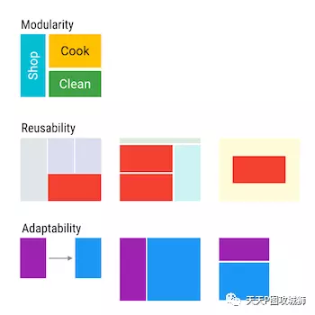

Fragment核心的类有：

- Fragment：Fragment的基类，任何创建的Fragment都需要继承该类。
- FragmentManager：管理和维护Fragment。他是抽象类，具体的实现类是-  FragmentManagerImpl。
- FragmentTransaction：对Fragment的添加、删除等操作都需要通过事务方式进行。他是抽象类，具体的实现类是BackStackRecord。
- Nested Fragment（Fragment内部嵌套Fragment的能力）是Android 4.2提出的，support-fragment库可以兼容到1.6。通过getChildFragmentManager()能够获得管理子Fragment的FragmentManager，在子Fragment中可以通过getParentFragment()获得父Fragment。


# 基本使用

Fragment有很多可以复写的方法，其中最常用的就是onCreateView()，该方法返回Fragment的UI布局，需要注意的是inflate()的第三个参数是false，因为在Fragment内部实现中，会把该布局添加到container中，如果设为true，那么就会重复做两次添加，则会抛如下异常：


如果在创建Fragment时要传入参数，必须要通过setArguments(Bundle bundle)方式添加，而不建议通过为Fragment添加带参数的构造函数，因为通过setArguments()方式添加，在由于内存紧张导致Fragment被系统杀掉并恢复（re-instantiate）时能保留这些数据。官方建议如下：

> It is strongly recommended that subclasses do not have other
>  constructors with parameters, since these constructors will not be
>  called when the fragment is re-instantiated.

我们可以在Fragment的onAttach()中通过getArguments()获得传进来的参数，并在之后使用这些参数。如果要获取Activity对象，不建议调用getActivity()，而是在onAttach()中将Context对象强转为Activity对象。

创建完Fragment后，接下来就是把Fragment添加到Activity中。在Activity中添加Fragment的方式有两种：

- 静态添加：在xml中通过<fragment>的方式添加，缺点是一旦添加就不能在运行时删除。
- 动态添加：运行时添加，这种方式比较灵活，因此建议使用这种方式。
  虽然Fragment能在XML中添加，但是这只是一个语法糖而已，Fragment并不是一个View，而是和Activity同一层次的。

这里只给出动态添加的方式。首先Activity需要有一个容器存放Fragment，一般是FrameLayout，因此在Activity的布局文件中加入FrameLayout：

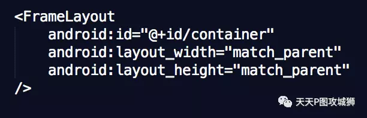

 然后在onCreate()中，通过以下代码将Fragment添加进Activity中。

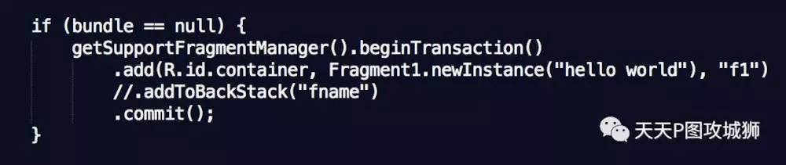

这里需要注意几点：

- 因为我们使用了support库的Fragment，因此需要使用getSupportFragmentManager()获取FragmentManager。
- add()是对Fragment众多操作中的一种，还有remove(), replace()等，第一个参数是根容器的id（FrameLayout的id，即”@id/container”），第二个参数是Fragment对象，第三个参数是fragment的tag名，指定tag的好处是后续我们可以通过Fragment1 frag = getSupportFragmentManager().findFragmentByTag("f1")从FragmentManager中查找Fragment对象。
- 在一次事务中，可以做多个操作，比如同时做add().remove().replace()。
- commit()操作是异步的，内部通过mManager.enqueueAction()加入处理队列。对应的同步方法为commitNow()，commit()内部会有checkStateLoss()操作，如果开发人员使用不当（比如commit()操作在onSaveInstanceState()之后），可能会抛出异常，而commitAllowingStateLoss()方法则是不会抛出异常版本的commit()方法，但是尽量使用commit()，而不要使用commitAllowingStateLoss()。
- addToBackStack("fname")是可选的。FragmentManager拥有回退栈（BackStack），类似于Activity的任务栈，如果添加了该语句，就把该事务加入回退栈，当用户点击返回按钮，会回退该事务（回退指的是如果事务是add(frag1)，那么回退操作就是remove(frag1)）；如果没添加该语句，用户点击返回按钮会直接销毁Activity。
- Fragment有一个常见的问题，即Fragment重叠问题，这是由于Fragment被系统杀掉，并重新初始化时再次将fragment加入activity，因此通过在外围加if语句能判断此时是否是被系统杀掉并重新初始化的情况。


Fragment有个常见的异常：

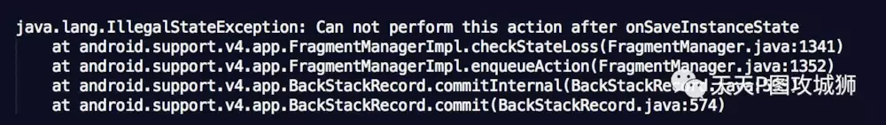

该异常出现的原因是：commit()在onSaveInstanceState()后调用。首先，onSaveInstanceState()在onPause()之后，onStop()之前调用。onRestoreInstanceState()在onStart()之后，onResume()之前。
因此避免出现该异常的方案有：

- 不要把Fragment事务放在异步线程的回调中，比如不要把Fragment事务放在AsyncTask的onPostExecute()，因此onPostExecute()可能会在onSaveInstanceState()之后执行。
- 逼不得已时使用commitAllowingStateLoss()。


# 生命周期

Fragment的生命周期和Activity类似，但比Activity的生命周期复杂一些，基本的生命周期方法如下图：

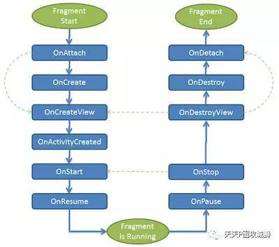

解释如下：

- onAttach()：Fragment和Activity相关联时调用。可以通过该方法获取 Activity引用，还可以通过getArguments()获取参数。

- onCreate()：Fragment被创建时调用。

- onCreateView()：创建Fragment的布局。

- onActivityCreated()：当Activity完成onCreate()时调用。

- onStart()：当Fragment可见时调用。

- onResume()：当Fragment可见且可交互时调用。

- onPause()：当Fragment不可交互但可见时调用。

- onStop()：当Fragment不可见时调用。

- onDestroyView()：当Fragment的UI从视图结构中移除时调用。

- onDestroy()：销毁Fragment时调用。

- onDetach()：当Fragment和Activity解除关联时调用。

上面的方法中，只有onCreateView()在重写时不用写super方法，其他都需要。


因为Fragment是依赖Activity的，因此为了讲解Fragment的生命周期，需要和Activity的生命周期方法一起讲，即Fragment的各个生命周期方法和Activity的各个生命周期方法的关系和顺序，如图：

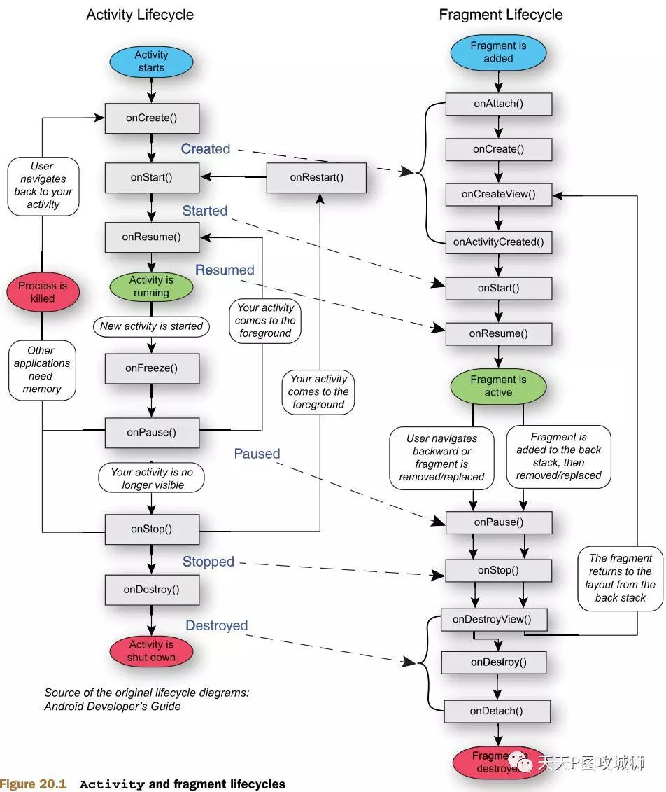

我们这里举个例子来理解Fragment生命周期方法。功能如下：共有两个Fragment：F1和F2，F1在初始化时就加入Activity，点击F1中的按钮调用replace替换为F2。

- 当F1在Activity的onCreate()中被添加时，日志如下：

  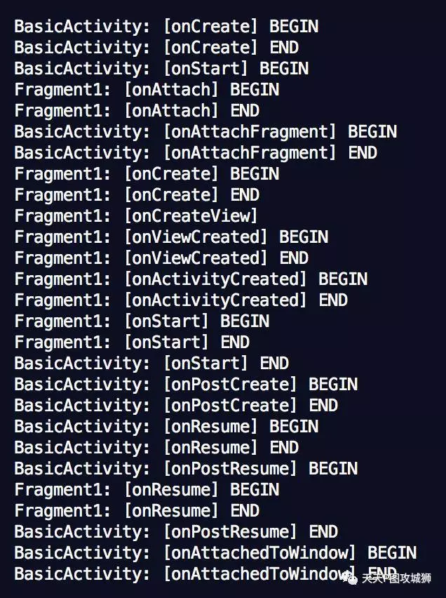

  可以看出：

  - Fragment的onAttach()->onCreate()->onCreateView()->onActivityCreated()->onStart()都是在Activity的onStart()中调用的。
  - Fragment的onResume()在Activity的onResume()之后调用。
     接下去分两种情况，分别是不加addToBackStack()和加addToBackStack()。

- 当点击F1的按钮，调用replace()替换为F2，且不加addToBackStack()时，日志如下：

  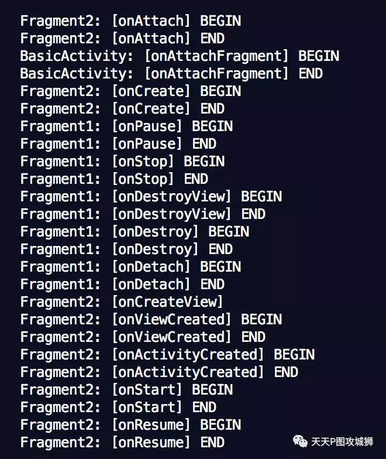

  可以看到，F1最后调用了onDestroy()和onDetach()。

- 当点击F1的按钮，调用replace()替换为F2，且加addToBackStack()时，日志如下：

  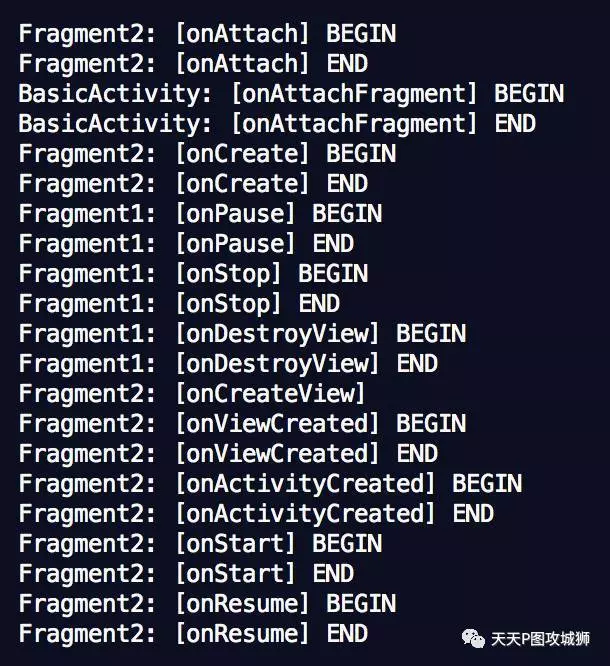

  可以看到，F1被替换时，最后只调到了onDestroyView()，并没有调用onDestroy()和onDetach()。当用户点返回按钮回退事务时，F1会调onCreateView()->onStart()->onResume()，因此在Fragment事务中加不加addToBackStack()会影响Fragment的生命周期。

FragmentTransaction有一些基本方法，下面给出调用这些方法时，Fragment生命周期的变化：

- add(): onAttach()->…->onResume()。
- remove(): onPause()->…->onDetach()。
- replace(): 相当于旧Fragment调用remove()，新Fragment调用add()。
- show(): 不调用任何生命周期方法，调用该方法的前提是要显示的Fragment已经被添加到容器，只是纯粹把Fragment UI的setVisibility为true。
- hide(): 不调用任何生命周期方法，调用该方法的前提是要显示的Fragment已经被添加到容器，只是纯粹把Fragment UI的setVisibility为false。
- detach(): onPause()->onStop()->onDestroyView()。UI从布局中移除，但是仍然被FragmentManager管理。
- attach(): onCreateView()->onStart()->onResume()。


# Fragment实现原理和Back Stack

我们知道Activity有任务栈，用户通过startActivity将Activity加入栈，点击返回按钮将Activity出栈。Fragment也有类似的栈，称为回退栈（Back Stack），回退栈是由FragmentManager管理的。默认情况下，Fragment事务是不会加入回退栈的，如果想将Fragment事务加入回退栈，则可以加入addToBackStack("")。如果没有加入回退栈，则用户点击返回按钮会直接将Activity出栈；如果加入了回退栈，则用户点击返回按钮会回滚Fragment事务。

我们将通过最常见的Fragment用法，讲解Back Stack的实现原理：

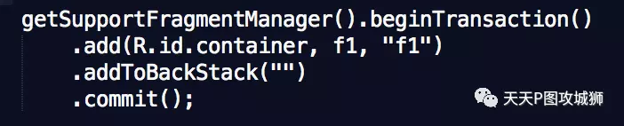

上面这个代码的功能就是将Fragment加入Activity中，内部实现为：创建一个BackStackRecord对象，该对象记录了这个事务的全部操作轨迹（这里只做了一次add操作，并且加入回退栈），随后将该对象提交到FragmentManager的执行队列中，等待执行。

BackStackRecord类的定义如下：

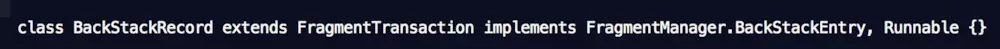

从定义可以看出，BackStackRecord有三重含义：

- 继承了FragmentTransaction，即是事务，保存了整个事务的全部操作轨迹。
- 实现了BackStackEntry，作为回退栈的元素，正是因为该类拥有事务全部的操作轨迹，因此在popBackStack()时能回退整个事务。
- 继承了Runnable，即被放入FragmentManager执行队列，等待被执行。

先看第一层含义，getSupportFragmentManager.beginTransaction()返回的就是BackStackRecord对象，代码如下：

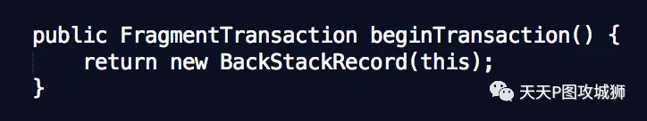

BackStackRecord类包含了一次事务的整个操作轨迹，是以链表形式存在的，链表的元素是Op类，表示其中某个操作，定义如下：

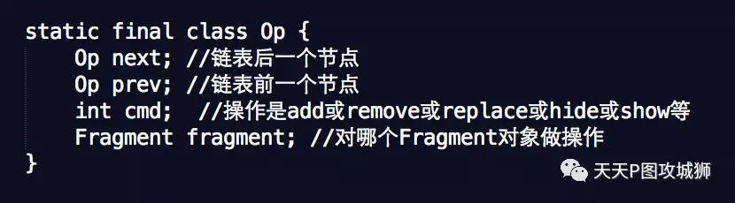

我们来看下具体场景下这些类是怎么被使用的，比如我们的事务做add操作。add函数的定义：

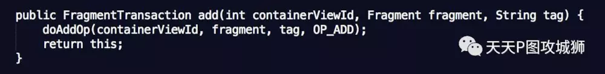

doAddOp()方法就是创建Op对象，并加入链表，定义如下：

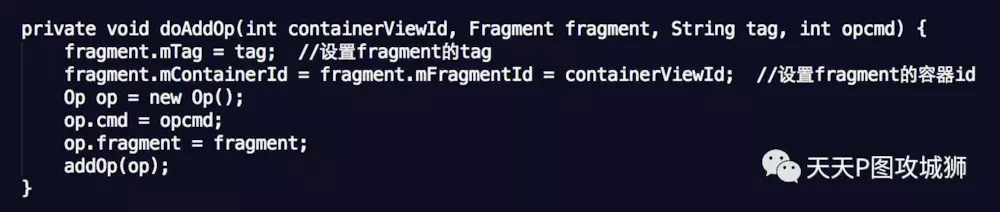

addOp()是将创建好的Op对象加入链表，定义如下：

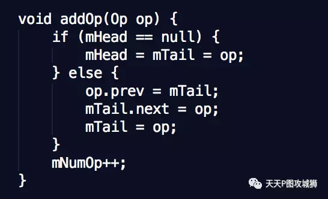

addToBackStack(“”)是将mAddToBackStack变量记为true，在commit()中会用到该变量。commit()是异步的，即不是立即生效的，但是后面会看到整个过程还是在主线程完成，只是把事务的执行扔给主线程的Handler，commit()内部是commitInternal()，实现如下：

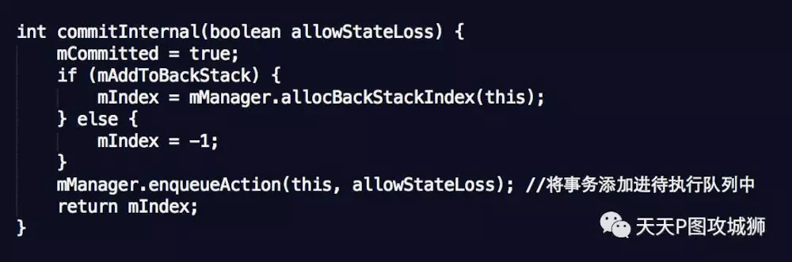

如果mAddToBackStack为true，则调用allocBackStackIndex(this)将事务添加进回退栈，FragmentManager类的变量ArrayList<BackStackRecord> mBackStackIndices;就是回退栈。实现如下：

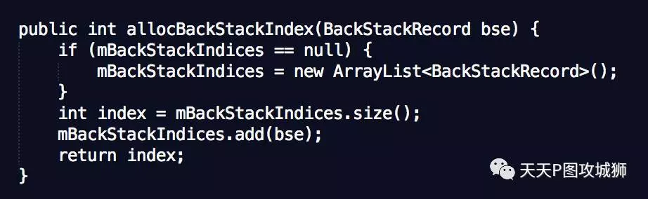

在commitInternal()中，mManager.enqueueAction(this, allowStateLoss);是将BackStackRecord加入待执行队列中，定义如下：

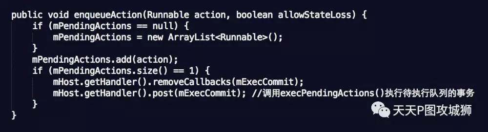

mPendingActions就是前面说的待执行队列，mHost.getHandler()就是主线程的Handler，因此Runnable是在主线程执行的，mExecCommit的内部就是调用了execPendingActions()，即把mPendingActions中所有积压的没被执行的事务全部执行。执行队列中的事务会怎样被执行呢？就是调用BackStackRecord的run()方法，run()方法就是执行Fragment的生命周期函数，还有将视图添加进container中。
与addToBackStack()对应的是popBackStack()，有以下几种变种：

- popBackStack()：将回退栈的栈顶弹出，并回退该事务。
- popBackStack(String name, int flag)：name为addToBackStack(String name)的参数，通过name能找到回退栈的特定元素，flag可以为0或者FragmentManager.POP_BACK_STACK_INCLUSIVE，0表示只弹出该元素以上的所有元素，POP_BACK_STACK_INCLUSIVE表示弹出包含该元素及以上的所有元素。这里说的弹出所有元素包含回退这些事务。
- popBackStack()是异步执行的，是丢到主线程的MessageQueue执行，popBackStackImmediate()是同步版本。
   我们通过讲解Demo1来更清晰地了解回退栈的使用。功能如下：共有三个Fragment：F1, F2, F3，F1在初始化时就加入Activity，点击F1中的按钮跳转到F2，点击F2的按钮跳转到F3，点击F3的按钮回退到F1。

在Activity的onCreate()中，将F1加入Activity中：

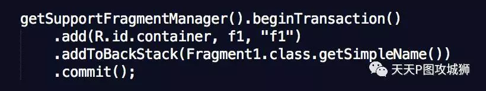

F1按钮的onClick()内容如下：

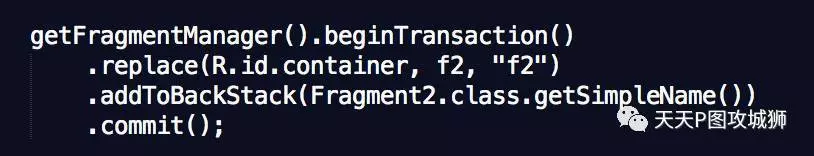

F2按钮的onClick()如下：

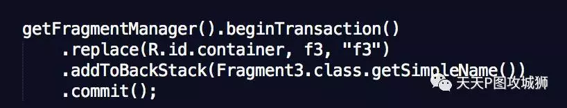

F3按钮的onClick()如下：

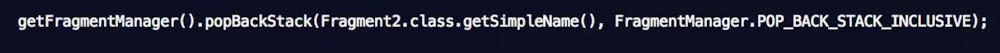

这样就完成了整个界面的跳转逻辑。


这里补充一个点，getSupportFragmentManager().findFragmentByTag()是经常用到的方法，他是FragmentManager的方法，FragmentManager是抽象类，FragmentManagerImpl是继承FragmentManager的实现类，他的内部实现是：


从上面看到，先从mAdded中查找是否有该Fragment，如果没找到，再从mActive中查找是否有该Fragment。mAdded是已经添加到Activity的Fragment的集合，mActive不仅包含mAdded，还包含虽然不在Activity中，但还在回退栈中的Fragment。


# Fragment通信

## Fragment向Activity传递数据

首先，在Fragment中定义接口，并让Activity实现该接口（具体实现省略）：

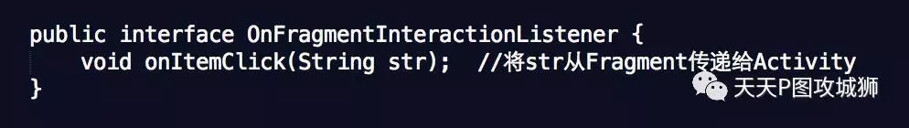

 在Fragment的onAttach()中，将参数Context强转为OnFragmentInteractionListener对象：

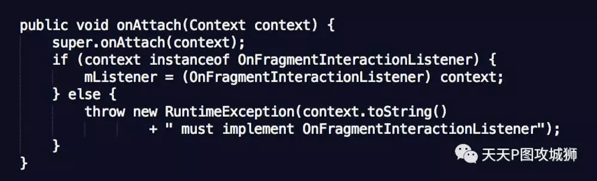

并在Fragment合适的地方调用mListener.onItemClick("hello")将”hello”从Fragment传递给Activity。

## FABridge

由于通过接口的方式从Fragment向Activity进行数据传递比较麻烦，需要在Fragment中定义interface，并让Activity实现该interface，FABridge通过注解的形式免去了这些定义。
在build.gradle中添加依赖：

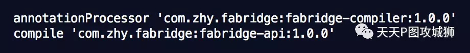

首先定义方法ID，这里为FAB_ITEM_CLICK，接着在Activity中定义接口：

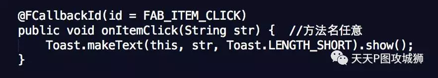

最后，在Fragment中，通过以下形式调用”ID=FAB_ITEM_CLICK”的方法（该方法可能在Activity中，也可能在任何类中）：


## Activity向Fragment传递数据

Activity向Fragment传递数据比较简单，获取Fragment对象，并调用Fragment的方法即可，比如要将一个字符串传递给Fragment，则在Fragment中定义方法：

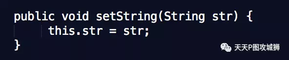

并在Activity中调用fragment.setString("hello")即可。

## Fragment之间通信

由于Fragment之间是没有任何依赖关系的，因此如果要进行Fragment之间的通信，建议通过Activity作为中介，不要Fragment之间直接通信。

# DialogFragment

DialogFragment是Android 3.0提出的，代替了Dialog，用于实现对话框。他的优点是：即使旋转屏幕，也能保留对话框状态。
如果要自定义对话框样式，只需要继承DialogFragment，并重写onCreateView()，该方法返回对话框UI。这里我们举个例子，实现进度条样式的圆角对话框。

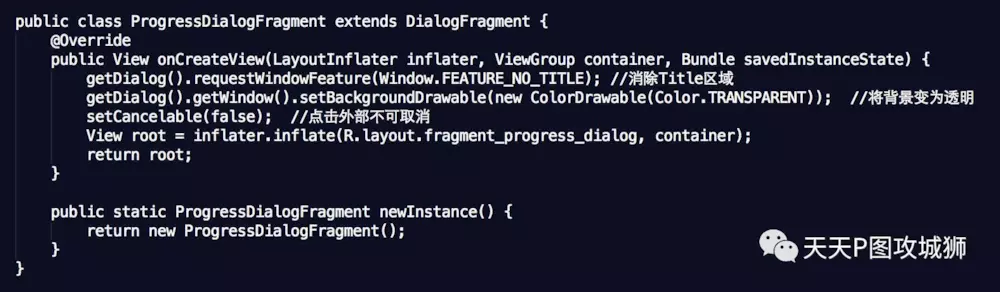

进度条动画我们使用Lottie实现，Lottie动画从这里找到。使用非常方便，只需要下载JSON动画文件，然后在XML中写入：

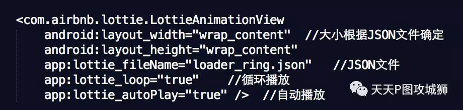

然后通过下面代码显示对话框：

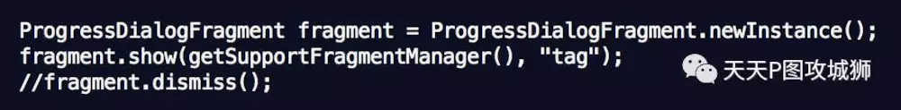


# ViewPager+Fragment相关

## 基本使用

ViewPager是support v4库中提供界面滑动的类，继承自ViewGroup。PagerAdapter是ViewPager的适配器类，为ViewPager提供界面。但是一般来说，通常都会使用PagerAdapter的两个子类：FragmentPagerAdapter和FragmentStatePagerAdapter作为ViewPager的适配器，他们的特点是界面是Fragment。

> 在support v13和support v4中都提供了FragmentPagerAdapter和FragmentStatePagerAdapter，区别在于：support v13中使用android.app.Fragment，而support v4使用android.support.v4.app.Fragment。一般都使用support v4中的FragmentPagerAdapter和FragmentStatePagerAdapter。

默认，ViewPager会缓存当前页相邻的界面，比如当滑动到第2页时，会初始化第1页和第3页的界面（即Fragment对象，且生命周期函数运行到onResume()），可以通过setOffscreenPageLimit(count)设置离线缓存的界面个数。
 FragmentPagerAdapter和FragmentStatePagerAdapter需要重写的方法都一样，常见的重写方法如下：

- public FragmentPagerAdapter(FragmentManager fm): 构造函数，参数为FragmentManager。如果是嵌套Fragment场景，子PagerAdapter的参数传入getChildFragmentManager()。
- Fragment getItem(int position): 返回第position位置的Fragment，必须重写。
- int getCount(): 返回ViewPager的页数，必须重写。
- Object instantiateItem(ViewGroup container, int position): container是ViewPager对象，返回第position位置的Fragment。
- void destroyItem(ViewGroup container, int position, Object object): container是ViewPager对象，object是Fragment对象。
- getItemPosition(Object object): object是Fragment对象，如果返回POSITION_UNCHANGED，则表示当前Fragment不刷新，如果返回POSITION_NONE，则表示当前Fragment需要调用destroyItem()和instantiateItem()进行销毁和重建。 默认情况下返回POSITION_UNCHANGED。

## 懒加载

懒加载主要用于ViewPager且每页是Fragment的情况，场景为微信主界面，底部有4个tab，当滑到另一个tab时，先显示”正在加载”，过一会才会显示正常界面。
 默认情况，ViewPager会缓存当前页和左右相邻的界面。实现懒加载的主要原因是：用户没进入的界面需要有一系列的网络、数据库等耗资源、耗时的操作，预先做这些数据加载是不必要的。
 这里懒加载的实现思路是：用户不可见的界面，只初始化UI，但是不会做任何数据加载。等滑到该页，才会异步做数据加载并更新UI。
 这里就实现类似微信那种效果，整个UI布局为：底部用PagerBottomTabStrip项目实现，上面是ViewPager，使用FragmentPagerAdapter。逻辑为：当用户滑到另一个界面，首先会显示正在加载，等数据加载完毕后（这里用睡眠1秒钟代替）显示正常界面。
 ViewPager默认缓存左右相邻界面，为了避免不必要的重新数据加载（重复调用onCreateView()），因为有4个tab，因此将离线缓存的半径设置为3，即setOffscreenPageLimit(3)。
 懒加载主要依赖Fragment的setUserVisibleHint(boolean isVisible)方法，当Fragment变为可见时，会调用setUserVisibleHint(true)；当Fragment变为不可见时，会调用setUserVisibleHint(false)，且该方法调用时机：

- onAttach()之前，调用setUserVisibleHint(false)。

- onCreateView()之前，如果该界面为当前页，则调用setUserVisibleHint(true)，否则调用setUserVisibleHint(false)。

- 界面变为可见时，调用setUserVisibleHint(true)。

- 界面变为不可见时，调用setUserVisibleHint(false)。

懒加载Fragment的实现：

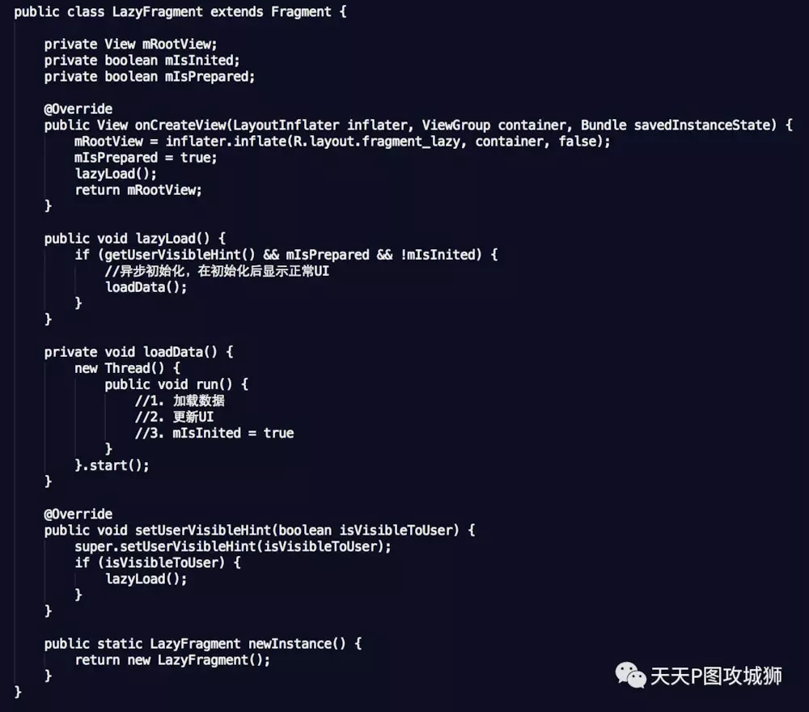

**注意点：**

- 在Fragment中有两个变量控制是否需要做数据加载：
- mIsPrepared：表示UI是否准备好，因为数据加载后需要更新UI，如果UI还没有inflate，就不需要做数据加载，因为setUserVisibleHint()会在onCreateView()之前调用一次，如果此时调用，UI还没有inflate，因此不能加载数据。
- mIsInited：表示是否已经做过数据加载，如果做过了就不需要做了。因为setUserVisibleHint(true)在界面可见时都会调用，如果滑到该界面做过数据加载后，滑走，再滑回来，还是会调用setUserVisibleHint(true)，此时由于mIsInited=true，因此不会再做一遍数据加载。
- lazyLoad()：懒加载的核心类，在该方法中，只有界面可见（getUserVisibleHint()==true）、UI准备好（mIsPrepared==true）、过去没做过数据加载（mIsInited==false）时，才需要调loadData()做数据加载，数据加载做完后把mIsInited置为true。
   布局XML主要分两个container，一个是初始显示的状态，即R.id.container_empty，当数据加载完成，就显示R.id.container：


# 一些常见的坑

## getActivity()空指针

可能你遇到过getActivity()返回null，或者平时运行完好的代码，在“内存重启”之后，调用getActivity()的地方却返回null，报了空指针异常。

大多数情况下的原因：你在调用了getActivity()时，当前的Fragment已经`onDetach()`了宿主Activity。
 比如：你在pop了Fragment之后，该Fragment的异步任务仍然在执行，并且在执行完成后调用了getActivity()方法，这样就会空指针。

### 解决办法：

 **更"安全"的方法**：(对于Fragment已经onDetach这种情况，我们应该避免在这之后再去调用宿主Activity对象，比如取消这些异步任务，但我们的团队可能会有粗心大意的情况，所以下面给出的这个方案会保证安全)

在Fragment基类里设置一个Activity mActivity的全局变量，在`onAttach(Activity activity)`里赋值，使用mActivity代替`getActivity()`，保证Fragment即使在`onDetach`后，仍持有Activity的引用（有引起内存泄露的风险，但是异步任务没停止的情况下，本身就可能已内存泄漏，相比Crash，这种做法“安全”些），即：

```java
protected Activity mActivity;
@Override
public void onAttach(Activity activity) {
    super.onAttach(activity);
    this.mActivity = activity;
}

/**
*  如果你用了support 23的库，上面的方法会提示过时，有强迫症的小伙伴，可以用下面的方法代替
*/
@Override
public void onAttach(Context context) {
    super.onAttach(context);
    this.mActivity = (Activity)context;
}
```

## 异常：Can not perform this action after onSaveInstanceState

有很多小伙伴遇到这个异常，这个异常产生的原因是：

在你离开当前Activity等情况下，系统会调用`onSaveInstanceState()`帮你保存当前Activity的状态、数据等，**直到再回到该Activity之前（onResume()之前），你执行Fragment事务，就会抛出该异常！**（一般是其他Activity的回调让当前页面执行事务的情况，会引发该问题）

### 解决方法：

- **1、该事务使用commitAllowingStateLoss()方法提交，但是有可能导致该次提交无效！（宿主Activity被强杀时）**

> 对于`popBackStack()`没有对应的`popBackStackAllowingStateLoss()`方法，所以可以在下次可见时提交事务，参考2

- **2、利用onActivityForResult()/onNewIntent()，可以做到事务的完整性，不会丢失事务**

一个简单的示例代码 ：

```java
// ReceiverActivity 或 其子Fragment:
void start(){
   startActivityForResult(new Intent(this, SenderActivity.class), 100);
}

@Override
protected void onActivityResult(int requestCode, int resultCode, Intent data) {
     super.onActivityResult(requestCode, resultCode, data);
     if (requestCode == 100 && resultCode == 100) {
         // 执行Fragment事务
     }
 }

// SenderActivity 或 其子Fragment:
void do() { // 操作ReceiverActivity（或其子Fragment）执行事务
    setResult(100);
    finish();
}
```

## Fragment重叠异常-----正确使用hide、show的姿势

在类`onCreate()`的方法加载Fragment，并且没有判断`saveInstanceState==null`或`if(findFragmentByTag(mFragmentTag) == null)`，导致重复加载了同一个Fragment导致重叠。（PS：`replace`情况下，如果没有加入回退栈，则不判断也不会造成重叠，但建议还是统一判断下）

```
@Override 
protected void onCreate(@Nullable Bundle savedInstanceState) {
// 在页面重启时，Fragment会被保存恢复，而此时再加载Fragment会重复加载，导致重叠 ;
    if(saveInstanceState == null){
    // 或者 if(findFragmentByTag(mFragmentTag) == null)
       // 正常情况下去 加载根Fragment 
    } 
}
```

详细原因：[从源码角度分析，为什么会发生Fragment重叠？](https://www.jianshu.com/p/78ec81b42f92)

如果你`add()`了几个Fragment，使用`show()、hide()`方法控制，比如微信、QQ的底部tab等情景，如果你什么都不做的话，在“内存重启”后回到前台，app的这几个Fragment界面会重叠。

原因是FragmentManager帮我们管理Fragment，当发生“内存重启”，他会从栈底向栈顶的顺序一次性恢复Fragment； 但是因为官方没有保存Fragment的mHidden属性，默认为false，即show状态，所以所有Fragment都是以show的形式恢复，我们看到了界面重叠。 （如果是`replace`，恢复形式和Activity一致，只有当你pop之后上一个Fragment才开始重新恢复，所有使用`replace`不会造成重叠现象）

> v4-24.0.0+ 开始，官方修复了上述 没有保存mHidden的问题，所以如果你在使用24.0.0+的v4包，下面分析的2个解决方案可以自行跳过...

### 解决方案：

 1、是大家比较熟悉的 findFragmentByTag：

即在`add()`或者`replace()`时绑定一个tag，一般我们是用fragment的类名作为tag，然后在发生“内存重启”时，通过`findFragmentByTag`找到对应的Fragment，并`hide()`需要隐藏的fragment。

下面是个标准恢复写法：

```
@Override
protected void onCreate(Bundle savedInstanceState) {
    super.onCreate(savedInstanceState);
    setContentView(R.layout.activity);

    TargetFragment targetFragment;
    HideFragment hideFragment;
  
    if (savedInstanceState != null) {  // “内存重启”时调用
        targetFragment = getSupportFragmentManager().findFragmentByTag(TargetFragment.class.getName);
        hideFragment = getSupportFragmentManager().findFragmentByTag(HideFragment.class.getName);
        // 解决重叠问题
        getFragmentManager().beginTransaction()
                .show(targetFragment)
                .hide(hideFragment)
                .commit();
    }else{  // 正常时
        targetFragment = TargetFragment.newInstance();
        hideFragment = HideFragment.newInstance();

        getFragmentManager().beginTransaction()
                .add(R.id.container, targetFragment, targetFragment.getClass().getName())
                .add(R.id,container,hideFragment,hideFragment.getClass().getName())
                .hide(hideFragment)
                .commit();
    }
}
```

如果你想恢复到用户离开时的那个Fragment的界面，你还需要在`onSaveInstanceState(Bundle outState)`里保存离开时的那个可见的tag或下标，在`onCreate`“内存重启”代码块中，取出tag/下标，进行恢复。

2、帖子作者的解决方案，9行代码解决所有情况的Fragment重叠：[传送门](https://www.jianshu.com/p/c12a98a36b2b)

## Fragment嵌套的那些坑

其实一些小伙伴遇到的很多嵌套的坑，大部分都是由于对嵌套的栈视图产生混乱，只要理清栈视图关系，做好恢复相关工作以及正确选择是使用`getFragmentManager()`还是`getChildFragmentManager()`就可以避免这些问题。

这部分内容是我们感觉Fragment非常难用的一个点，我会在[下一篇](https://www.jianshu.com/p/fd71d65f0ec6)中，详细介绍使用Fragment嵌套的一些技巧，以及如何清晰分析各个层级的栈视图。

附：startActivityForResult接收返回问题
 在support 23.2.0以下的支持库中，对于在嵌套子Fragment的`startActivityForResult ()`，会发现无论如何都不能在`onActivityResult()`中接收到返回值，只有最顶层的父Fragment才能接收到，这是一个support v4库的一个BUG，不过在前两天发布的support 23.2.0库中，已经修复了该问题，嵌套的子Fragment也能正常接收到返回数据了!

## 未必靠谱的出栈方法remove()

如果你想让某一个Fragment出栈，使用`remove()`在加入回退栈时并不靠谱。

如果你在add的同时将Fragment加入回退栈：addToBackStack(name)的情况下，它并不能真正将Fragment从栈内移除，如果你在2秒后（确保Fragment事务已经完成）打印`getSupportFragmentManager().getFragments()`，会发现该Fragment依然存在，并且依然可以返回到被remove的Fragment，而且是空白页面。

如果你没有将Fragment加入回退栈，remove方法可以正常出栈。

如果你加入了回退栈，`popBackStack()`系列方法才能真正出栈，这也就引入下一个深坑，`popBackStack(String tag,int flags)`等系列方法的BUG。

## 多个Fragment同时出栈的深坑BUG

> **6月17日更新： 在support-25.4.0版本，google意识到下面的问题，并修复了。 如果你使用25.4.0及以上版本，下面的方法不要再使用，google移除了mAvailIndices属性**

在Fragment库中如下4个方法是可能产生BUG的：

1、popBackStack(String tag,int flags)
 2、popBackStack(int id,int flags)
 3、popBackStackImmediate(String tag,int flags)
 4、popBackStackImmediate(int id,int flags)

上面4个方法作用是，出栈到tag/id的fragment，即一次多个Fragment被出栈。

**1、FragmentManager栈中管理fragment下标位置的数组ArrayList<Integer> mAvailIndeices的BUG**

下面的方法FragmentManagerImpl类方法，产生BUG的罪魁祸首是管理Fragment栈下标的`mAvailIndeices`属性：

```
void makeActive(Fragment f) {
      if (f.mIndex >= 0) {
         return;
      } 
      if (mAvailIndices == null || mAvailIndices.size() <= 0) {
           if (mActive == null) {
              mActive = new ArrayList<Fragment>();
           } 
           f.setIndex(mActive.size(), mParent); 
           mActive.add(f);
       } else {
           f.setIndex(mAvailIndices.remove(mAvailIndices.size()-1), mParent);
           mActive.set(f.mIndex, f);
       } 
      if (DEBUG) Log.v(TAG, "Allocated fragment index " + f);
 }
```

上面代码最终导致了栈内顺序不正确的问题，如下图：

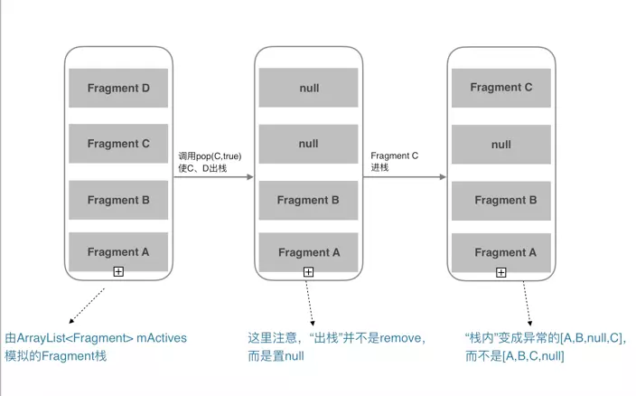

上面的这个情况，会一次异常，一次正常。带来的问题就是“内存重启”后，各种异常甚至Crash。

发现这BUG的时候，我一脸懵比，幸好，stackoverflow上有大神给出了[解决方案](https://link.jianshu.com?t=http%3A%2F%2Fstackoverflow.com%2Fquestions%2F25520705%2Fandroid-cant-retain-fragments-that-are-nested-in-other-fragments)！hack `FragmentManagerImpl`的`mAvailIndices`，对其进行一次`Collections.reverseOrder()`降序排序，保证栈内Fragment的index的正确。

```java
public class FragmentTransactionBugFixHack {

  public static void reorderIndices(FragmentManager fragmentManager) {
    if (!(fragmentManager instanceof FragmentManagerImpl))
      return;
    FragmentManagerImpl fragmentManagerImpl = (FragmentManagerImpl) fragmentManager;
    if (fragmentManagerImpl.mAvailIndices != null && fragmentManagerImpl.mAvailIndices.size() > 1) {
      Collections.sort(fragmentManagerImpl.mAvailIndices, Collections.reverseOrder());
    }
  }
}
```

使用方法就是通过`popBackStackImmediate(tag/id)`多个Fragment后，调用

```java
hanler.post(new Runnable(){
    @Override
     public void run() {
         FragmentTransactionBugFixHack.reorderIndices(fragmentManager));
     }
});
```

**2、popBackStack的坑**
 `popBackStack`和`popBackStackImmediate`的区别在于前者是加入到主线队列的末尾，等其它任务完成后才开始出栈，后者是队列内的任务立即执行，再将出栈任务放到队列尾（可以理解为立即出栈）。

如果你`popBackStack`多个Fragment后，紧接着`beginTransaction()` add新的一个Fragment，接着发生了“内存重启”后，你再执行`popBackStack()`，app就会Crash，解决方案是postDelay出栈动画时间再执行其它事务，但是根据我的观察不是很稳定。

建议是：如果你想出栈多个Fragment，你应尽量使用`popBackStackImmediate(tag/id)`，而不是`popBackStack(tag/id)`，如果你想在出栈后，立刻`beginTransaction()`开始一项事务，你应该把事务的代码post/postDelay到主线程的消息队列里，下一篇有详细描述。

## 深坑 Fragment转场动画（仅分析v4包下的Fragment）

如果你的Fragment没有转场动画，或者使用`setCustomAnimations(enter, exit)`的话，那么上面的那些坑解决后，你可以愉快的玩耍了。

```java
getFragmentManager().beginTransaction()
         .setCustomAnimations(enter, exit)
        // 如果你有通过tag/id同时出栈多个Fragment的情况时，
        // 请谨慎使用.setCustomAnimations(enter, exit, popEnter, popExit)  
        // 在support-25.4.0之前出栈多Fragment时，伴随出栈动画，会在某些情况下发生异常
        // 你需要搭配Fragment的onCreateAnimation()临时取消出栈动画，或者延迟一个动画时间再执行一次上面提到的Hack方法，排序
```

**(注意：如果你想给下一个Fragment设置进栈动画和出栈动画，.setCustomAnimations(enter, exit)只能设置进栈动画，第二个参数并不是设置出栈动画； 请使用.setCustomAnimations(enter, exit, popEnter, popExit)，这个方法的第1个参数对应进栈动画，第4个参数对应出栈动画，所以是.setCustomAnimations(进栈动画, exit, popEnter, 出栈动画))**

总结起来就是Fragment没有出栈动画的话，可以避免很多坑。
 如果想让出栈动画运作正常的话，需要使用Fragment的`onCreateAnimation`中控制动画。

```java
@Override
public Animation onCreateAnimation(int transit, boolean enter, int nextAnim) {
    // 此处设置动画
}
```

但是用代价也是有的，你需要解决出栈动画带来的几个坑。

**1、pop多个Fragment时转场动画 带来的问题**

> 6月17日更新： 在support-25.4.0版本，google意识到下面动画引起的问题，并修复了。

在使用 `pop(tag/id)`出栈多个Fragment的这种情况下，将转场动画临时取消或者延迟一个动画的时间再去执行其他事务；

原因在于这种情景下，可能会导致栈内顺序错乱（上文有提到），同时如果发生“内存重启”后，因为Fragment转场动画没结束时再执行其他方法，会导致Fragment状态不会被FragmentManager正常保存下来。

**2、进入新的Fragment并立刻关闭当前Fragment 时的一些问题**
 （1）如果你想从当前Fragment进入一个新的Fragment，并且同时要关闭当前Fragment。由于数据结构是栈，所以正确做法是先`pop`，再`add`，但是转场动画会有覆盖的不正常现象，你需要特殊处理，不然会闪屏！

**Tip：**
 **如果你遇到Fragment的mNextAnim空指针的异常（通常是在你的Fragment被重启的情况下），那么你首先需要检查是否操作的Fragment是否为null；其次在你的Fragment转场动画还没结束时，你是否就执行了其他事务等方法；解决思路就是延迟一个动画时间再执行事务，或者临时将该Fragment设为无动画**

## add(), show(), hide(), replace()的那点事

**1、区别**
 `show()`，`hide()`最终是让Fragment的View `setVisibility`(true还是false)，不会调用生命周期；

`replace()`的话会销毁视图，即调用onDestoryView、onCreateView等一系列生命周期；

`add()`和 `replace()`不要在同一个阶级的FragmentManager里混搭使用。

**2、使用场景**
 如果你有一个很高的概率会再次使用当前的Fragment，建议使用`show()`，`hide()`，可以提高性能。

在我使用Fragment过程中，大部分情况下都是用`show()`，`hide()`，而不是`replace()`。

注意：如果你的app有大量图片，这时更好的方式可能是replace，配合你的图片框架在Fragment视图销毁时，回收其图片所占的内存。

**3、onHiddenChanged的回调时机**
 当使用`add()`+`show()，hide()`跳转新的Fragment时，旧的Fragment回调`onHiddenChanged()`，不会回调`onStop()`等生命周期方法，而新的Fragment在创建时是不会回调`onHiddenChanged()`，这点要切记。

**4、Fragment重叠问题**
 使用`show()`，`hide()`带来的一个问题就是，如果你不做任何额外处理，在“内存重启”后，Fragment会重叠；（该BUG在support-v4 24.0.0+以上 官方已修复）

有些小伙伴可能就是为了避免Fragment重叠问题，而选择使用`replace()`，但是使用`show()`，`hide()`时，重叠问题很简单解决的：

- 如果你在用24.0.0+的版本，不需要特殊处理，官方已经修复该BUG；
- 如果你在使用小于24.0.0以下的v4包，可以参考[9行代码让你App内的Fragment对重叠说再见](https://www.jianshu.com/p/c12a98a36b2b)

## 关于FragmentManager你需要知道的

**FragmentManager栈视图:**
 （1）每个Fragment以及宿主Activity(继承自FragmentActivity)都会在创建时，初始化一个FragmentManager对象，处理好Fragment嵌套问题的关键，就是理清这些不同阶级的栈视图。

下面给出一个简要的**关系图**：

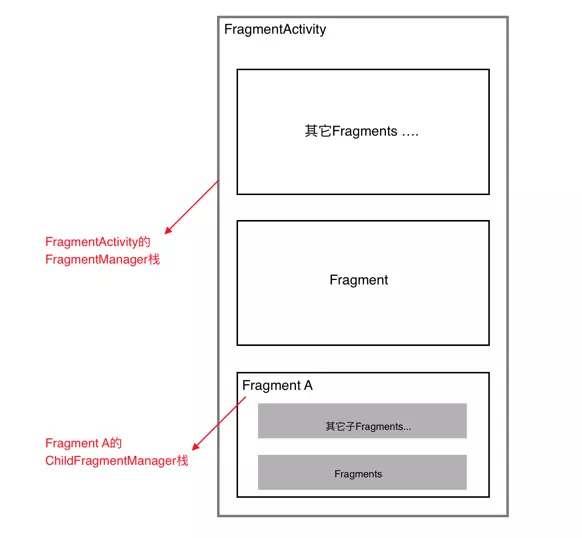

（2）对于宿主Activity，`getSupportFragmentManager()`获取的FragmentActivity的FragmentManager对象;

对于Fragment，`getFragmentManager()`是获取的是父Fragment(如果没有，则是FragmentActivity)的FragmentManager对象，而`getChildFragmentManager()`是获取自己的FragmentManager对象。

## 使用FragmentPagerAdapter+ViewPager的注意事项

- 使用FragmentPagerAdapter+ViewPager时，切换回上一个Fragment页面时（已经初始化完毕），不会回调任何生命周期方法以及`onHiddenChanged()`，只有`setUserVisibleHint(boolean isVisibleToUser)`会被回调，所以如果你想进行一些懒加载，需要在这里处理。
- 在给ViewPager绑定FragmentPagerAdapter时，
   `new FragmentPagerAdapter(fragmentManager)`的FragmentManager，一定要保证正确，如果ViewPager是Activity内的控件，则传递`getSupportFragmentManager()`，如果是Fragment的控件中，则应该传递`getChildFragmentManager()`。只要记住ViewPager内的Fragments是当前组件的子Fragment这个原则即可。
- 你不需要考虑在“内存重启”的情况下，去恢复的Fragments的问题，因为FragmentPagerAdapter已经帮我们处理啦。

## 是使用单Activity＋多Fragment的架构，还是多模块Activity＋多Fragment的架构？

**单Activity＋多Fragment：**
一个app仅有一个Activity，界面皆是Frament，Activity作为app容器使用。

优点：性能高，速度最快。参考：新版知乎 、google系app

缺点：逻辑比较复杂，尤其当Fragment之间联动较多或者嵌套较深时，比较复杂。

**多模块Activity＋多Fragment：**
一个模块用一个Activity，比如
1、登录注册流程：
LoginActivity + 登录Fragment + 注册Fragment + 填写信息Fragment ＋ 忘记密码Fragment
2、或者常见的数据展示流程：
DataActivity + 数据列表Fragment + 数据详情Fragment ＋ ...

优点：速度快，相比较单Activity+多Fragment，更易维护。

**观点：**
权衡利弊，我认为多模块Activity＋多Fragment是最合适的架构，开发起来不是很复杂，app的性能又很高效。

当然。**Fragment只是官方提供的灵活组件，请优先遵从你的项目设计！**真的特别复杂的界面，或者单个Activity就可以完成一个流程的界面，使用Activity可能是更好的方案。


# References

- [Android基础：Fragment，看这篇就够了](https://www.jianshu.com/p/28ca4cbe190c)
- [Fragment全解析系列（一）：那些年踩过的坑](https://www.jianshu.com/p/d9143a92ad94)
- [Fragment全解析系列（二）：正确的使用姿势](https://www.jianshu.com/p/fd71d65f0ec6)
- [Fragment之我的解决方案：Fragmentation](https://www.jianshu.com/p/38f7994faa6b)


