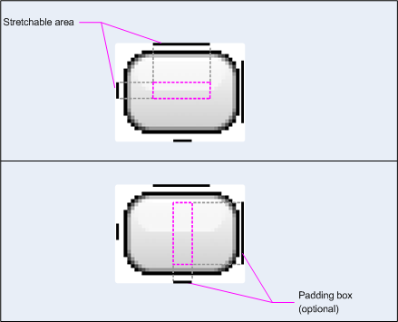

[TOC]

# Images and graphics

## Drawables overview

When you need to display static images in your app, you can use the `Drawable` class and its subclasses to draw shapes and images. A `Drawable` is a general abstraction for *something that can be drawn*. The various subclasses help with specific image scenarios, and you can extend them to define your own drawable objects that behave in unique ways.

There are two ways to define and instantiate a `Drawable` besides using the class constructors:

- Inflate an image resource (a bitmap file) saved in your project.
- Inflate an XML resource that defines the drawable properties.

**Note:** You might instead prefer using a vector drawable, which defines an image with a set of points, lines, and curves, along with associated color information. This allows vector drawables to be scaled for different sizes without a loss of quality. For more information, see [Vector drawables overview](https://developer.android.com/guide/topics/graphics/vector-drawable-resources.html).

### Create drawables from resource images

You can add graphics to your app by referencing an image file from your project resources. Supported file types are PNG (preferred), JPG (acceptable), and GIF (discouraged). App icons, logos, and other graphics, such as those used in games, are well suited for this technique.

To use an image resource, add your file to the `res/drawable/` directory of your project. Once in your project, you can reference the image resource from your code or your XML layout. Either way, it's referred to using a resource ID, which is the file name without the file type extension. For example, refer to `my_image.png` as `my_image`.

**Note:** Image resources placed in the `res/drawable/` directory may be automatically optimized with lossless image compression by the `aapt` tool during the build process. For example, a true-color PNG that doesn't require more than 256 colors may be converted to an 8-bit PNG with a color palette. This results in an image of equal quality but which requires less memory. As a result, the image binaries placed in this directory can change at build time. If you plan on reading an image as a bitstream in order to convert it to a bitmap, put your images in the `res/raw/` folder instead, where the `aapt` tool doesn't modify them.

The following code snippet demonstrates how to build an `ImageView` that uses an image created from a drawable resource and adds it to the layout:

```java
ConstraintLayout constraintLayout;protected void onCreate(Bundle savedInstanceState) {  super.onCreate(savedInstanceState);  // Create a ConstraintLayout in which to add the ImageView  constraintLayout = new ConstraintLayout(this);  // Instantiate an ImageView and define its properties  ImageView i = new ImageView(this);  i.setImageResource(R.drawable.my_image);  i.setContentDescription(getResources().getString(R.string.my_image_desc));  // set the ImageView bounds to match the Drawable's dimensions  i.setAdjustViewBounds(true);  i.setLayoutParams(new ViewGroup.LayoutParams(          ViewGroup.LayoutParams.WRAP_CONTENT,          ViewGroup.LayoutParams.WRAP_CONTENT));  // Add the ImageView to the layout and set the layout as the content view.  constraintLayout.addView(i);  setContentView(constraintLayout);}
```


In other cases, you may want to handle your image resource as a `Drawable` object, as shown in the following example:

```java
Resources res = context.getResources();Drawable myImage = ResourcesCompat.getDrawable(res, R.drawable.my_image, null);
```


**Note:** Each unique resource in your project can maintain only one state, no matter how many different objects you instantiate for it. For example, if you instantiate two `Drawable` objects from the same image resource and change a property (such as the alpha) for one object, then it also affects the other. When dealing with multiple instances of an image resource, instead of directly transforming the `Drawable` object you should perform a [tween animation](https://developer.android.com/guide/topics/graphics/view-animation.html#tween-animation).

The XML snippet below shows how to add a drawable resource to an `ImageView` in the XML layout:

```xml
<ImageView        android:layout_width="wrap_content"        android:layout_height="wrap_content"        android:src="@drawable/my_image"        android:contentDescription="@string/my_image_desc" />
```


For more information about using project resources, see [Resources and assets](https://developer.android.com/guide/topics/resources/index.html).

**Note:** When using image resources as the source of your drawables, be sure the images are the appropriate size for various pixel densities. If the images are not correct they will be scaled up to fit, which can cause artifacting in your drawables. For more information, read [Support different pixel densities](https://developer.android.com/training/multiscreen/screendensities.html).

### Create drawables from XML resources

If there is a `Drawable` object that you'd like to create, which isn't initially dependent on variables defined by your code or user interaction, then defining the `Drawable` in XML is a good option. Even if you expect your `Drawable` to change its properties during the user's interaction with your app, you should consider defining the object in XML, as you can modify properties after it's instantiated.

After you've defined your `Drawable` in XML, save the file in the `res/drawable/` directory of your project. The following example shows the XML that defines a `TransitionDrawable` resource, which inherits from `Drawable`:

```xml
<!-- res/drawable/expand_collapse.xml --><transition xmlns:android="http://schemas.android.com/apk/res/android">    <item android:drawable="@drawable/image_expand">    <item android:drawable="@drawable/image_collapse"></transition>
```


Then, retrieve and instantiate the object by calling `Resources.getDrawable()`, and passing the resource ID of your XML file. Any `Drawable` subclass that supports the `inflate()` method can be defined in XML and instantiated by your app. Each drawable class that supports XML inflation utilizes specific XML attributes that help define the object properties. The following code instantiates the `TransitionDrawable` and sets it as the content of an `ImageView` object:

```java
Resources res = context.getResources();TransitionDrawable transition =    (TransitionDrawable) ResourcesCompat.getDrawable(res, R.drawable.expand_collapse, null);ImageView image = (ImageView) findViewById(R.id.toggle_image);image.setImageDrawable(transition);// Description of the initial state that the drawable represents.image.setContentDescription(getResources().getString(R.string.collapsed));// Then you can call the TransitionDrawable object's methods.transition.startTransition(1000);// After the transition is complete, change the image's content description// to reflect the new state.
```


For more information about the XML attributes supported, refer to the classes listed above.

### Shape drawables

A `ShapeDrawable` object can be a good option when you want to dynamically draw a two-dimensional graphic. You can programmatically draw primitive shapes on a `ShapeDrawable` object and apply the styles that your app needs.

`ShapeDrawable` is a subclass of `Drawable`. For this reason, you can use a `ShapeDrawable` wherever a `Drawable` is expected. For example, you can use a `ShapeDrawable` object to set the background of a view by passing it to the `setBackgroundDrawable()` method of the view. You can also draw your shape as its own custom view and add it to a layout in your app.

Because `ShapeDrawable` has its own `draw()` method, you can create a subclass of `View` that draws the `ShapeDrawable` object during the `onDraw()` event, as shown in the following code example:

```java
public class CustomDrawableView extends View {  private ShapeDrawable drawable;  public CustomDrawableView(Context context) {    super(context);    int x = 10;    int y = 10;    int width = 300;    int height = 50;    setContentDescription(context.getResources().getString(            R.string.my_view_desc));    drawable = new ShapeDrawable(new OvalShape());    // If the color isn't set, the shape uses black as the default.    drawable.getPaint().setColor(0xff74AC23);    // If the bounds aren't set, the shape can't be drawn.    drawable.setBounds(x, y, x + width, y + height);  }  protected void onDraw(Canvas canvas) {    drawable.draw(canvas);  }}
```


You can use the `CustomDrawableView` class in the code sample above as you would use any other custom view. For example, you can programmatically add it to an activity in your app, as shown in the following example:

```java
CustomDrawableView customDrawableView;protected void onCreate(Bundle savedInstanceState) {  super.onCreate(savedInstanceState);  customDrawableView = new CustomDrawableView(this);  setContentView(customDrawableView);}
```


If you want to use the custom view in the XML layout instead, then the `CustomDrawableView` class must override the `View(Context, AttributeSet)` constructor, which is called when the class is inflated from XML. The following example shows how to declare the `CustomDrawableView` in the XML layout:

```xml
<com.example.shapedrawable.CustomDrawableView        android:layout_width="fill_parent"        android:layout_height="wrap_content"        />
```


The `ShapeDrawable` class, like many other drawable types in the `android.graphics.drawable` package, allows you to define various properties of the object by using public methods. Some example properties you might want to adjust include alpha transparency, color filter, dither, opacity, and color.

You can also define primitive drawable shapes using XML resources. For more information, see [Shape drawable](https://developer.android.com/guide/topics/resources/drawable-resource.html#Shape) in [Drawable resource types](https://developer.android.com/guide/topics/resources/drawable-resource.html).

### NinePatch drawables

A `NinePatchDrawable` graphic is a stretchable bitmap image that you can use as the background of a view. Android automatically resizes the graphic to accommodate the contents of the view. An example use of a NinePatch image is the background used by standard Android buttons—buttons must stretch to accommodate strings of various lengths. A NinePatch graphic is a standard PNG image that includes an extra 1-pixel border. It must be saved with the `9.png` extension in the `res/drawable/` directory of your project.

Use the border to define the stretchable and static areas of the image. You indicate a stretchable section by drawing one (or more) 1-pixel wide black line(s) in the left and top part of the border (the other border pixels should be fully transparent or white). You can have as many stretchable sections as you want. The relative size of the stretchable sections stays the same, so the largest section always remains the largest.

You can also define an optional drawable section of the image (effectively, the padding lines) by drawing a line on the right and a line on the bottom. If a `View` object sets the NinePatch graphic as its background and then specifies the view's text, it stretches itself so that all the text occupies only the area designated by the right and bottom lines (if included). If the padding lines aren't included, Android uses the left and top lines to define this drawable area.

To clarify the difference between the lines, the left and top lines define which pixels of the image are allowed to be replicated in order to stretch the image. The bottom and right lines define the relative area within the image that the contents of the view are allowed to occupy.

Figure 1 shows an example of a NinePatch graphic used to define a button:



This NinePatch graphic defines one stretchable area with the left and top lines, and the drawable area with the bottom and right lines. In the top image, the dotted grey lines identify the regions of the image that are replicated in order to stretch the image. The pink rectangle in the bottom image identifies the region in which the contents of the view are allowed. If the contents don't fit in this region, then the image is stretched to make them fit.

The [Draw 9-patch](https://developer.android.com/tools/help/draw9patch.html) tool offers an extremely handy way to create your NinePatch images, using a WYSIWYG graphics editor. It even raises warnings if the region you've defined for the stretchable area is at risk of producing drawing artifacts as a result of the pixel replication.

The following sample layout XML demonstrates how to add a NinePatch graphic to a couple of buttons. The NinePatch image is saved to `res/drawable/my_button_background.9.png`.

```xml
<Button android:id="@+id/tiny"        android:layout_width="wrap_content"        android:layout_height="wrap_content"        android:layout_alignParentTop="true"        android:layout_centerInParent="true"        android:text="Tiny"        android:textSize="8sp"        android:background="@drawable/my_button_background"/><Button android:id="@+id/big"        android:layout_width="wrap_content"        android:layout_height="wrap_content"        android:layout_alignParentBottom="true"        android:layout_centerInParent="true"        android:text="Biiiiiiig text!"        android:textSize="30sp"        android:background="@drawable/my_button_background"/>
```


Note that the `layout_width` and `layout_height` attributes are set to `wrap_content` to make the button fit neatly around the text.

Figure 2 shows the two buttons rendered from the XML and NinePatch image shown above. Notice how the width and height of the button varies with the text, and the background image stretches to accommodate it.


### Custom drawables

When you want to create some custom drawings, you can do so by extending the `Drawable` class (or any of its subclasses).

The most important method to implement is `draw(Canvas)` because this provides the `Canvas` object you must use to provide your drawing instructions.

The following code shows a simple subclass of `Drawable` that draws a circle:

```java
public class MyDrawable extends Drawable {    private final Paint redPaint;    public MyDrawable() {        // Set up color and text size        redPaint = new Paint();        redPaint.setARGB(255, 255, 0, 0);    }    @Override    public void draw(Canvas canvas) {        // Get the drawable's bounds        int width = getBounds().width();        int height = getBounds().height();        float radius = Math.min(width, height) / 2;        // Draw a red circle in the center        canvas.drawCircle(width/2, height/2, radius, redPaint);    }    @Override    public void setAlpha(int alpha) {        // This method is required    }    @Override    public void setColorFilter(ColorFilter colorFilter) {        // This method is required    }    @Override    public int getOpacity() {        // Must be PixelFormat.UNKNOWN, TRANSLUCENT, TRANSPARENT, or OPAQUE        return PixelFormat.OPAQUE;    }}
```


Then you can add your drawable wherever you'd like, such as to an `ImageView` as shown here:

```java
MyDrawable mydrawing = new MyDrawable();ImageView image = findViewById(R.id.imageView);image.setImageDrawable(mydrawing);image.setContentDescription(getResources().getString(R.string.my_image_desc));
```


On Android 7.0 (API level 24) and higher, you can also define instances of your custom drawable with XML in the following ways:

- Using the fully-qualified class name as the XML element name. For this approach, the custom drawable class must be a public top-level class:

  ```xml
  <com.myapp.MyDrawable xmlns:android="http://schemas.android.com/apk/res/android"    android:color="#ffff0000" />
  ```

  

- Using `drawable` as the XML tag name and specifying the fully-qualified class name from the class attribute. This approach may be used for both public top-level classes and public static inner classes:

  ```xml
  <drawable xmlns:android="http://schemas.android.com/apk/res/android"    class="com.myapp.MyTopLevelClass$MyDrawable"    android:color="#ffff0000" />
  ```

  

### Add tint to drawables

With Android 5.0 (API level 21) and above, you can tint bitmaps and nine-patches defined as alpha masks. You can tint them with color resources or theme attributes that resolve to color resources (for example, `?android:attr/colorPrimary`). Usually, you create these assets only once and color them automatically to match your theme.

You can apply a tint to `BitmapDrawable`, `NinePatchDrawable` or `VectorDrawable` objects with the `setTint()` method. You can also set the tint color and mode in your layouts with the `android:tint` and `android:tintMode` attributes.

### Extract prominent colors from an image

The Android Support Library includes the `Palette` class, which lets you extract prominent colors from an image. You can load your drawables as a `Bitmap` and pass it to `Palette` to access its colors. For more information, read [Selecting colors with the Palette API](https://developer.android.com/training/material/palette-colors.html).


