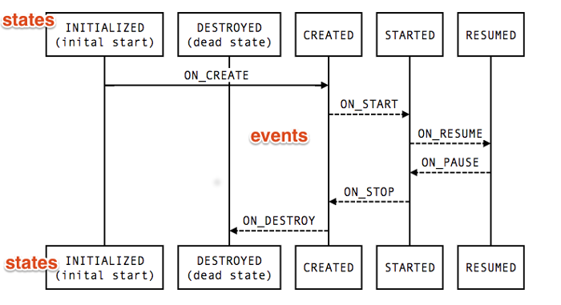

# Handling Lifecycles with Lifecycle-Aware Components **Part of Android Jetpack.**

Lifecycle-aware组件执行某些操作来响应另一个组件（例如Activity和Fragment）的生命周期状态的变化。这些组件可帮助您生成更易于组织且通常更轻量级的代码，这些代码更易于维护。

一种常见模式是在Activity和Fragment的生命周期回调方法中实现这些操作。但是，这种模式导致代码组织不良和错误扩散。通过使用lifecycle-aware组件，您可以将依赖组件的代码移出生命周期方法并移入组件本身。

[`android.arch.lifecycle`](https://developer.android.com/reference/android/arch/lifecycle/package-summary.html)包提供了类和接口，用来构建*lifecycle-aware*组件 - 根据Activity或Fragment的当前生命周期状态自动调整其行为的组件。

**Note:** 要将[`android.arch.lifecycle`](https://developer.android.com/reference/android/arch/lifecycle/package-summary.html)导入到您的Android项目中，请参阅[lifecycle release notes](https://developer.android.com/jetpack/androidx/releases/lifecycle#declaring_dependencies)。

Android Framework中定义的大多数应用程序组件都附加了生命周期。 生命周期由操作系统或运行在app进程的Framework代码管理。 它们是Android运作方式的核心，您的应用程序必须遵守。不这样做可能会触发内存泄漏甚至应用程序崩溃。

想象一下，我们有一个Activity，在屏幕上显示设备位置。常见的实现可能如下所示：

```java
class MyLocationListener {
    public MyLocationListener(Context context, Callback callback) {
        // ...
    }

    void start() {
        // connect to system location service
    }

    void stop() {
        // disconnect from system location service
    }
}

class MyActivity extends AppCompatActivity {
    private MyLocationListener myLocationListener;

    @Override
    public void onCreate(...) {
        myLocationListener = new MyLocationListener(this, (location) -> {
            // update UI
        });
    }

    @Override
    public void onStart() {
        super.onStart();
        myLocationListener.start();
        // manage other components that need to respond
        // to the activity lifecycle
    }

    @Override
    public void onStop() {
        super.onStop();
        myLocationListener.stop();
        // manage other components that need to respond
        // to the activity lifecycle
    }
}
```

即使这个示例看起来很好，但在真实的应用程序中，最终会有太多的调用来管理UI和其他组件以响应生命周期的当前状态。管理多个组件会在生命周期方法中放置大量代码，例如`onStart()`和`onStop()`回调，这使得这些生命周期方法难以维护。

此外，无法保证组件在活动或片段停止之前启动。如果我们需要执行长时间运行的操作，例如`onStart()`中的某些配置检查，则尤其明显。 这可能导致资源竞争，导致`onStop()`方法在`onStart()`之前完成，使组件保持活动的时间超过了它所需的时间。

```java
class MyActivity extends AppCompatActivity {
    private MyLocationListener myLocationListener;

    public void onCreate(...) {
        myLocationListener = new MyLocationListener(this, location -> {
            // update UI
        });
    }

    @Override
    public void onStart() {
        super.onStart();
        Util.checkUserStatus(result -> {
            // what if this callback is invoked AFTER activity is stopped?
            if (result) {
                myLocationListener.start();
            }
        });
    }

    @Override
    public void onStop() {
        super.onStop();
        myLocationListener.stop();
    }
}
```

[`android.arch.lifecycle`](https://developer.android.com/reference/android/arch/lifecycle/package-summary.html)包提供的类和接口可以用弹性和独立的方式解决这些问题。

## Lifecycle

[`Lifecycle`](https://developer.android.com/reference/androidx/lifecycle/Lifecycle.html)是一个类，它包含有关组件生命周期状态的信息（如Activity或Fragment）并允许其他物体要观察这种状态。

[`Lifecycle`](https://developer.android.com/reference/androidx/lifecycle/Lifecycle.html)使用两个主要枚举来跟踪其关联组件的生命周期状态：

- Event

  从Framework和[`Lifecycle`](https://developer.android.com/reference/androidx/lifecycle/Lifecycle.html)类调度的生命周期event。这些事件映射到Activity和Fragment中的回调events。

- State

  由`Lifecycle`对象跟踪的组件的当前state。



可以通过向类方法添加注解来监视组件的生命周期状态。然后你可以通过调用[`addObserver()`](https://developer.android.com/reference/androidx/lifecycle/Lifecycle.html#addObserver(android.arch.lifecycle.LifecycleObserver))方法来添加一个观察者。`Lifecycle`类并传递观察者的实例，如下所示：

```java
public class MyObserver implements LifecycleObserver {
    @OnLifecycleEvent(Lifecycle.Event.ON_RESUME)
    public void connectListener() {
        ...
    }

    @OnLifecycleEvent(Lifecycle.Event.ON_PAUSE)
    public void disconnectListener() {
        ...
    }
}

myLifecycleOwner.getLifecycle().addObserver(new MyObserver());
```

在上面的示例中，`myLifecycleOwner`对象实现了[`LifecycleOwner`](https://developer.android.com/reference/androidx/lifecycle/LifecycleOwner.html)接口，这将在下一节中介绍。

## LifecycleOwner

`LifecycleOwner`是一个单一的方法接口，表示该类有`Lifecycle`。 它有一个方法，[`getLifecycle()`](https://developer.android.com/reference/androidx/lifecycle/LifecycleOwner.html#getLifecycle())。如果您正在尝试管理整个应用程序进程的生命周期，请参阅[`ProcessLifecycleOwner`](https://developer.android.com/reference/androidx/lifecycle/ProcessLifecycleOwner.html)。

此接口从各个类（例如`Fragment`和`AppCompatActivity`）中抽象出[`Lifecycle`](https://developer.android.com/reference/androidx/lifecycle/Lifecycle.html)的所有权，并允许写入 与它们一起使用的组件。任何自定义应用程序类都可以实现[`LifecycleOwner`](https://developer.android.com/reference/androidx/lifecycle/LifecycleOwner.html)界面。

实现`LifecycleObserver`的组件可与实现[`LifecycleOwner`]的组件无缝协作。因为所有者可以提供生命周期，观察者可以注册观察。

以位置跟踪为例，我们可以使`MyLocationListener`类实现`LifecycleObserver`，然后在Activity的`Lifecycle`中的`onCreate()`方法初始化它。 这允许`MyLocationListener`类自给自足，这意味着响应生命周期状态变化的逻辑实现在`MyLocationListener`中，而不是Activity。 使各个组件存储自己的逻辑使得Activity和Fragment逻辑更易于管理。

```java
class MyActivity extends AppCompatActivity {
    private MyLocationListener myLocationListener;

    public void onCreate(...) {
        myLocationListener = new MyLocationListener(this, getLifecycle(), location -> {
            // update UI
        });
        Util.checkUserStatus(result -> {
            if (result) {
                myLocationListener.enable();
            }
        });
  }
}
```

一个常见的用例是，如果“生命周期”现在不处于良好状态，则应避免调用某些回调。例如，如果回调在保存活动状态后运行片段事务，则会触发崩溃，因此我们永远不会想要调用该回调。

为了简化这个用例，`Lifecycle`类允许其他对象查询当前状态。

```java
class MyLocationListener implements LifecycleObserver {
    private boolean enabled = false;
    public MyLocationListener(Context context, Lifecycle lifecycle, Callback callback) {
       ...
    }

    @OnLifecycleEvent(Lifecycle.Event.ON_START)
    void start() {
        if (enabled) {
           // connect
        }
    }

    public void enable() {
        enabled = true;
        if (lifecycle.getCurrentState().isAtLeast(STARTED)) {
            // connect if not connected
        }
    }

    @OnLifecycleEvent(Lifecycle.Event.ON_STOP)
    void stop() {
        // disconnect if connected
    }
}
```

通过这个实现，我们的`LocationListener`类完全可以识别生命周期。 如果我们需要从另一个Activity或Fragment使用我们的`LocationListener`，我们只需要初始化它。所有setup和teardown操作都由类本身管理。

如果库提供了需要使用Android生命周期的类，我们建议您使用生命周期感知组件。您的库客户端可以轻松地集成这些组件，而无需在客户端进行手动生命周期管理。

### Implementing a custom LifecycleOwner

Support库26.1.0及更高版本中的Fragmen和Activity已经实现了“LifecycleOwner”接口。

如果你想要创建`LifecycleOwner`的自定义类，你可以使用LifecycleRegistry类，但是你需要将events转发到该类中，如下所示：

```java
public class MyActivity extends Activity implements LifecycleOwner {
    private LifecycleRegistry lifecycleRegistry;

    @Override
    protected void onCreate(Bundle savedInstanceState) {
        super.onCreate(savedInstanceState);

        lifecycleRegistry = new LifecycleRegistry(this);
        lifecycleRegistry.markState(Lifecycle.State.CREATED);
    }

    @Override
    public void onStart() {
        super.onStart();
        lifecycleRegistry.markState(Lifecycle.State.STARTED);
    }

    @NonNull
    @Override
    public Lifecycle getLifecycle() {
        return lifecycleRegistry;
    }
}
```

## Best practices for lifecycle-aware components

- 保持UI控制器（Activity和Fragment）尽可能精简。它们不应该试图获取自己的数据; 相反，使用[`ViewModel`](https://developer.android.com/reference/androidx/lifecycle/ViewModel.html)来做，并观察[`LiveData`](https://developer.android.com/reference/androidx/lifecycle/LiveData.html)对象将更改反映回视图。
- 尝试编写数据驱动的UI，您的UI控制器负责在数据更改时更新View，或将用户操作通知回[`ViewModel`](https://developer.android.com/reference/androidx/lifecycle/ViewModel.html)。
- 将您的数据逻辑放在`ViewModel`类中。`ViewModel`应该作为UI控制器和应用程序其余部分之间的连接器。但请注意，获取数据（例如，从网络）不是“ViewModel”的责任。相反，`ViewModel`应调用适当的组件来获取数据，然后将结果提供回UI控制器。
- 使用`Data Binding`来维护View和UI控制器之间的干净接口。这使您可以使视图更具说明性，并最大限度地减少在Activity和Fragment中编写所需的更新代码。如果您更喜欢使用Java编程语言，请使用像[Butter Knife](http://jakewharton.github.io/butterknife/)这样的库来避免样板代码并获得更好的抽象。
- 如果您的UI很复杂，请考虑创建一个presenter类来处理UI修改。这可能是一项艰巨的任务，但它可以使您的UI组件更容易测试。
- 避免在`ViewModel`中引用`View`或`Activity`上下文。如果`ViewModel`比Activity存活时间长（例如在configuration change的情况下），您的Activity将泄漏并且gc未正确处理。
- 使用[Kotlin协同程序](https://developer.android.com/topic/libraries/architecture/coroutines)来管理长时间运行的任务以及可以异步运行的其他操作。

## Use cases for lifecycle-aware components

Lifecycle-aware组件可以使您在各种情况下更轻松地管理生命周期。一些例子是：

- 在coarse和fine-grained位置更新之间切换。使用lifecycle-aware组件可在您的位置应用程序可见时启用fine-grained位置更新，并在应用程序位于后台时切换到coarse更新。`LiveData`是一个lifecycle-aware组件，允许您的应用在用户更改位置时自动更新UI。
- 停止和启动视频缓冲。使用lifecycle-aware组件尽快启动视频缓冲，但推迟播放直到应用程序完全启动。您还可以使用lifecycle-aware组件在销毁应用程序时终止缓冲。
- 启动和停止网络连接。使用lifecycle-aware组件在应用程序处于前台时启用网络数据的实时更新（流式传输），并在应用程序进入后台时自动暂停。
- 暂停和恢复动画drawables。当app在后台时使用lifecycle-aware组件处理暂停动画drawables，并在app在前台后恢复drawables。

## Handling on stop events

当`Lifecycle`属于`AppCompatActivity`或`Fragment`时，当'AppCompatActivity`或`Fragment`的`onSaveInstanceState()`被调用时，`Lifecycle`的状态变为`CREATED`并且调度`ON_STOP`事件。

当`Fragment`或`AppCompatActivity`的状态通过`onSaveInstanceState()`保存时，它的UI被认为是不可变的，直到调用`ON_START`。保存状态后尝试修改UI可能会导致应用程序的导航状态不一致，这就是为什么如果应用程序在保存状态后运行`FragmentTransaction`则会引发异常。有关详细信息，请参阅`commit()`。

如果观察者关联的“life-cycle”至少不是“STARTED”，则“LiveData”通过禁止调用其观察者来防止这种边缘情况开箱即用。在屏幕之后，它在决定调用它的观察者之前调用`isAtLeast()`。

不幸的是，`appCompatActivity`的`onStop()`方法在`onSaveInstanceState()`*之后*被调用，这留下了一段空隙，其中不允许UI状态更改但是`Lifecycle`尚未被移动到`CREATED` 状态。

为了防止这个问题，版本`beta2`和更低版本中的`Lifecycle`类将状态标记为`CREATED`而不调度事件，以便任何检查当前状态的代码都获得实际值，即使事件未被调度直到 `onStop()`由系统调用。

不幸的是，这个解决方案仍有两个主要问题：

- 在API级别23和更低级别，Android系统实际上保存了活动的状态，即使它被另一个Activity*部分*覆盖。换句话说，Android系统调用`onSaveInstanceState()`但它不一定调用`onStop()`。这会导致一个可能很长的时间间隔，即使无法修改其UI状态，观察者仍然认为生命周期处于活动状态。
- 任何想要向`LiveData`类公开类似行为的类都必须实现`LiveData`版本`beta 2`及更低版本提供的解决方法。

**Note:** 为了使这个流程更简单，并提供与旧版本更好的兼容性，从版本`1.0.0-rc1`开始，`Lifecycle`对象被标记为`CREATED`，并且当调用`onSaveInstanceState()`而不等待时调度`ON_STOP` 用于调用`onStop()`方法。这不太可能影响您的代码，但是您需要注意它，因为它与API级别26及更低级别的“Activity”类中的调用顺序不匹配。

## Additional resources

To learn more about handling lifecycles with lifecycle-aware components, consult the following additional resources.

### Samples

- [Android Architecture Components Basic Sample](https://github.com/googlesamples/android-architecture-components/tree/master/BasicSample)
- [Sunflower](https://github.com/googlesamples/android-architecture-components), a demo app demonstrating best practices with Architecture Components

### Codelabs

- [Android Lifecycle-aware components](https://codelabs.developers.google.com/codelabs/android-lifecycles/index.html?index=..%2F..%2Findex#0)

### Blogs

- [Introducing Android Sunflower](https://medium.com/androiddevelopers/introducing-android-sunflower-e421b43fe0c2)