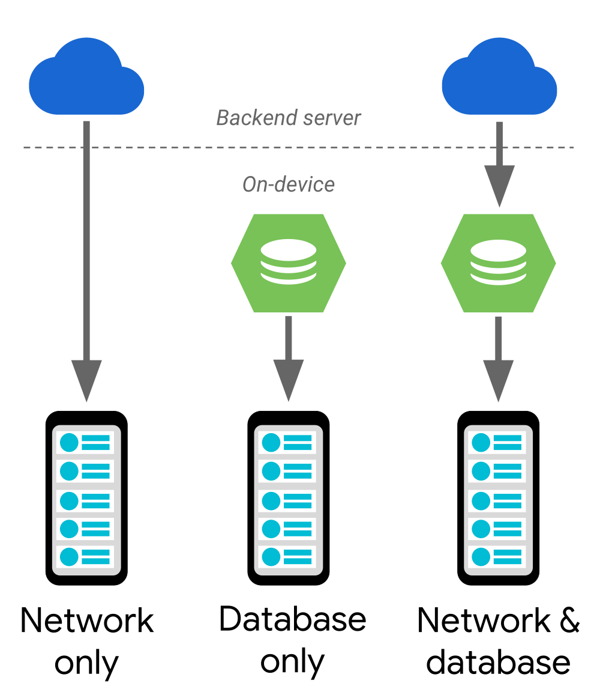

# Paging Library

## Paging library overview   **Part of Android Jetpack.**

The Paging Library helps you load and display small chunks of data at a time. Loading partial data on demand reduces usage of network bandwidth and system resources.

This guide provides several conceptual examples of the library, along with an overview of how it works. To view complete examples of how this library functions, try out the codelab and samples from the [additional resources](https://developer.android.com/topic/libraries/architecture/paging#additional-resources)section.

### Library architecture

This section describes and shows the main components of the paging library.

#### PagedList

The Paging Library's key component is the [`PagedList`](https://developer.android.com/reference/androidx/paging/PagedList) class, which loads chunks of your app's data, or *pages*. As more data is needed, it's paged into the existing `PagedList` object. If any loaded data changes, a new instance of `PagedList` is emitted to the observable data holder from a [`LiveData`](https://developer.android.com/reference/androidx/lifecycle/LiveData) or RxJava2-based object. As [`PagedList`](https://developer.android.com/reference/androidx/paging/PagedList)objects are generated, your app's UI presents their contents, all while respecting your UI controllers' [lifecycles](https://developer.android.com/topic/libraries/architecture/lifecycle).

The following code snippet shows how you can configure your app's view model to load and present data using a `LiveData` holder of `PagedList` objects:

[KOTLIN](https://developer.android.com/topic/libraries/architecture/paging#kotlin)[JAVA](https://developer.android.com/topic/libraries/architecture/paging#java)

```java
public class ConcertViewModel extends ViewModel {
    private ConcertDao concertDao;
    public final LiveData<PagedList<Concert>> concertList;

    // Creates a PagedList object with 50 items per page.
    public ConcertViewModel(ConcertDao concertDao) {
        this.concertDao = concertDao;
        concertList = new LivePagedListBuilder<>(
                concertDao.concertsByDate(), 50).build();
    }
}
```


#### Data

Each instance of [`PagedList`](https://developer.android.com/reference/androidx/paging/PagedList) loads an up-to-date snapshot of your app's data from its corresponding [`DataSource`](https://developer.android.com/reference/androidx/paging/DataSource)object. Data flows from your app's backend or database into the `PagedList` object.

The following example uses the [Room persistence library](https://developer.android.com/training/data-storage/room) to organize your app's data, but if you want to store your data using another means, you can also [provide your own data source factory](https://developer.android.com/topic/libraries/architecture/paging/data#custom-data-source).

[KOTLIN](https://developer.android.com/topic/libraries/architecture/paging#kotlin)[JAVA](https://developer.android.com/topic/libraries/architecture/paging#java)

```java
@Dao
public interface ConcertDao {
    // The Integer type parameter tells Room to use a
    // PositionalDataSource object.
    @Query("SELECT * FROM concerts ORDER BY date DESC")
    DataSource.Factory<Integer, Concert> concertsByDate();
}
```


To learn more about how you can load data into `PagedList` objects, see the guide on how to [Load paged data](https://developer.android.com/topic/libraries/architecture/paging/data).

#### UI

The [`PagedList`](https://developer.android.com/reference/androidx/paging/PagedList) class works with a `PagedListAdapter` to load items into a [`RecyclerView`](https://developer.android.com/reference/androidx/recyclerview/widget/RecyclerView). These classes work together to fetch and display content as it's loaded, prefetching out-of-view content and animating content changes.

To learn more, see the guide on how to [Display paged lists](https://developer.android.com/topic/libraries/architecture/paging/ui).

### Support different data architectures

The Paging Library supports the following data architectures:

- Served only from a backend server.
- Stored only in an on-device database.
- A combination of the other sources, using the on-device database as a cache.

Figure 1 shows how data flows in each of these architecture scenarios. In the case of a network-only or database-only solution, the data flows directly to your app's UI model. If you're using a combined approach, data flows from your backend server, into an on-device database, and then to your app's UI model. Every once in a while, the endpoint of each data flow runs out of data to load, at which point it requests more data from the component that provided the data. For example, when an on-device database runs out of data, it requests more data from the server.



**Figure 1.** How data flows through each of the architectures that the Paging Library supports

The remainder of this section provides recommendations for configuring each data flow use case.

#### Network only

To display data from a backend server, use the synchronous version of the [Retrofit API](http://square.github.io/retrofit/) to load information into [your own custom `DataSource` object](https://developer.android.com/topic/libraries/architecture/paging/data#custom-data-source).

**Note:** The Paging Library's [`DataSource`](https://developer.android.com/reference/androidx/paging/DataSource) objects don't provide any error handling because different apps handle and present error UIs in different ways. If an error occurs, defer to your result callback, and retry the request later. See the [PagingWithNetwork sample](https://github.com/googlesamples/android-architecture-components/tree/master/PagingWithNetworkSample) for an example of this behavior.

#### Database only

Set up your [`RecyclerView`](https://developer.android.com/reference/androidx/recyclerview/widget/RecyclerView) to observe local storage, preferably using the [Room persistence library](https://developer.android.com/topic/libraries/architecture/room). That way, whenever data is inserted or modified in your app's database, these changes are automatically reflected in the `RecyclerView` that's displaying this data.

#### Network and database

After you've started observing the database, you can listen for when the database is out of data by using[`PagedList.BoundaryCallback`](https://developer.android.com/reference/androidx/paging/PagedList.BoundaryCallback). You can then fetch more items from your network and insert them into the database. If your UI is observing the database, that's all you need to do.

### Handle network errors

When using a network to fetch or page the data that you're displaying using the Paging Library, it's important to not treat the network as being either "available" or "unavailable" all the time, as many connections are intermittent or flaky:

- A particular server might fail to respond to a network request.
- The device might be connected to a network that's slow or weak.

Instead, your app should check each request for failures and recover as gracefully as possible in cases where the network isn't available. For example, you can provide a "retry" button for users to select if the data refresh step doesn't work. If an error occurs during the data paging step, it's best to retry the paging requests automatically.

### Update your existing app

If your app already consumes data from a database or a backend source, it's possible to upgrade directly to functionality that the Paging Library provides. This section shows how to upgrade an app that has a common existing design.

#### Custom paging solutions

If you use custom functionality to load small subsets of data from your app's data source, you can replace this logic with that from the [`PagedList`](https://developer.android.com/reference/androidx/paging/PagedList) class. Instances of `PagedList` offer built-in connections to common data sources. These instances also provide adapters for [`RecyclerView`](https://developer.android.com/reference/androidx/recyclerview/widget/RecyclerView) objects that you might include in your app's UI.

#### Data loaded using lists instead of pages

If you use an in-memory list as the backing data structure for your UI's adapter, consider observing data updates using a [`PagedList`](https://developer.android.com/reference/androidx/paging/PagedList) class if the number of items in the list can become large. Instances of `PagedList` can use either [`LiveData`](https://developer.android.com/reference/androidx/lifecycle/LiveData) or `Observable<List>` to pass data updates to your app's UI, minimizing load times and memory usage. Better still, replacing a [`List`](https://developer.android.com/reference/java/util/List) object with a `PagedList` object in your app doesn't require any changes to your app's UI structure or data updating logic.

#### Associate a data cursor with a list view using CursorAdapter

Your app might use a [`CursorAdapter`](https://developer.android.com/reference/android/widget/CursorAdapter) to associate data from a [`Cursor`](https://developer.android.com/reference/android/database/Cursor) with a [`ListView`](https://developer.android.com/reference/android/widget/ListView). In that case, you usually need to migrate from a `ListView` to a [`RecyclerView`](https://developer.android.com/reference/androidx/recyclerview/widget/RecyclerView) as your app's list UI container, then replace the `Cursor`component with either [Room](https://developer.android.com/topic/libraries/architecture/room) or `PositionalDataSource`, depending on whether instances of `Cursor` access a SQLite database.

In some situations, such as when working with instances of [`Spinner`](https://developer.android.com/reference/android/widget/Spinner), you provide only the adapter itself. A library then takes the data that's loaded into that adapter and displays the data for you. In these situations, change the type of your adapter's data to [`LiveData`](https://developer.android.com/reference/androidx/lifecycle/LiveData), then wrap this list in an [`ArrayAdapter`](https://developer.android.com/reference/android/widget/ArrayAdapter) object before attempting to have a library class inflate these items in a UI.

#### Load content asynchronously using AsyncListUtil

If you're using [`AsyncListUtil`](https://developer.android.com/reference/androidx/recyclerview/widget/AsyncListUtil) objects to load and display groups of information asynchronously, the Paging Library lets you load data more easily:

- **Your data doesn't need to be positional.** The Paging Library lets you load data directly from your backend using keys that the network provides.
- **Your data can be uncountably large.** Using the Paging Library, you can load data into pages until there isn't any data remaining.
- **You can observe your data more easily.** The Paging library can present your data that your app's ViewModel holds in an observable data structure.

**Note:** If your existing app accesses a SQLite database, see the section on [using the Room persistence library](https://developer.android.com/topic/libraries/architecture/room).


### Database examples

The following code snippets show several possible ways of having all the pieces work together.

#### Observing paged data using LiveData

The following code snippet shows all the pieces working together. As concert events are added, removed, or changed in the database, the content in the [`RecyclerView`](https://developer.android.com/reference/androidx/recyclerview/widget/RecyclerView.html) is automatically and efficiently updated:

[KOTLIN](https://developer.android.com/topic/libraries/architecture/paging#kotlin)[JAVA](https://developer.android.com/topic/libraries/architecture/paging#java)

```java
@Dao
public interface ConcertDao {
    // The Integer type parameter tells Room to use a PositionalDataSource
    // object, with position-based loading under the hood.
    @Query("SELECT * FROM concerts ORDER BY date DESC")
    DataSource.Factory<Integer, Concert> concertsByDate();
}

public class ConcertViewModel extends ViewModel {
    private ConcertDao concertDao;
    public final LiveData<PagedList<Concert>> concertList;

    public ConcertViewModel(ConcertDao concertDao) {
        this.concertDao = concertDao;
        concertList = new LivePagedListBuilder<>(
            concertDao.concertsByDate(), /* page size */ 50).build();
    }
}

public class ConcertActivity extends AppCompatActivity {
    @Override
    public void onCreate(@Nullable Bundle savedInstanceState) {
        super.onCreate(savedInstanceState);
        ConcertViewModel viewModel =
                ViewModelProviders.of(this).get(ConcertViewModel.class);
        RecyclerView recyclerView = findViewById(R.id.concert_list);
        ConcertAdapter adapter = new ConcertAdapter();
        viewModel.concertList.observe(this, adapter::submitList);
        recyclerView.setAdapter(adapter);
    }
}

public class ConcertAdapter
        extends PagedListAdapter<Concert, ConcertViewHolder> {
    protected ConcertAdapter() {
        super(DIFF_CALLBACK);
    }

    @Override
    public void onBindViewHolder(@NonNull ConcertViewHolder holder,
            int position) {
        Concert concert = getItem(position);
        if (concert != null) {
            holder.bindTo(concert);
        } else {
            // Null defines a placeholder item - PagedListAdapter automatically
            // invalidates this row when the actual object is loaded from the
            // database.
            holder.clear();
        }
    }

    private static DiffUtil.ItemCallback<Concert> DIFF_CALLBACK =
            new DiffUtil.ItemCallback<Concert>() {
        // Concert details may have changed if reloaded from the database,
        // but ID is fixed.
        @Override
        public boolean areItemsTheSame(Concert oldConcert, Concert newConcert) {
            return oldConcert.getId() == newConcert.getId();
        }

        @Override
        public boolean areContentsTheSame(Concert oldConcert,
                Concert newConcert) {
            return oldConcert.equals(newConcert);
        }
    };
}
```


#### Observing paged data using RxJava2

If you prefer using [RxJava2](https://github.com/ReactiveX/RxJava) instead of [`LiveData`](https://developer.android.com/reference/androidx/lifecycle/LiveData.html), you can instead create an `Observable` or `Flowable`object:

[KOTLIN](https://developer.android.com/topic/libraries/architecture/paging#kotlin)[JAVA](https://developer.android.com/topic/libraries/architecture/paging#java)

```java
public class ConcertViewModel extends ViewModel {
    private ConcertDao concertDao;
    public final Observable<PagedList<Concert>> concertList;

    public ConcertViewModel(ConcertDao concertDao) {
        this.concertDao = concertDao;

        concertList = new RxPagedListBuilder<>(
                concertDao.concertsByDate(), /* page size */ 50)
                        .buildObservable();
    }
}
```


You can then start and stop observing the data using the code in the following snippet:

[KOTLIN](https://developer.android.com/topic/libraries/architecture/paging#kotlin)[JAVA](https://developer.android.com/topic/libraries/architecture/paging#java)

```java
public class ConcertActivity extends AppCompatActivity {
    private ConcertAdapter adapter = new ConcertAdapter();
    private ConcertViewModel viewModel;

    private CompositeDisposable disposable = new CompositeDisposable();

    @Override
    public void onCreate(@Nullable Bundle savedInstanceState) {
        super.onCreate(savedInstanceState);
        RecyclerView recyclerView = findViewById(R.id.concert_list);

        viewModel = ViewModelProviders.of(this).get(ConcertViewModel.class);
        recyclerView.setAdapter(adapter);
    }

    @Override
    protected void onStart() {
        super.onStart();
        disposable.add(viewModel.concertList
                .subscribe(adapter.submitList(flowableList)
        ));
    }

    @Override
    protected void onStop() {
        super.onStop();
        disposable.clear();
    }
}
```


The code for the `ConcertDao` and `ConcertAdapter` are the same for an [RxJava2](https://github.com/ReactiveX/RxJava)-based solution as they are for a [`LiveData`](https://developer.android.com/reference/androidx/lifecycle/LiveData.html)-based solution.


## Display paged lists

This guide builds upon the [Paging Library overview](https://developer.android.com/topic/libraries/architecture/paging/index), describing how you can present lists of information to users in your app's UI, particularly when this information changes.

### Connect your UI to your view model

You can connect an instance of [`LiveData`](https://developer.android.com/reference/androidx/lifecycle/LiveData) to a [`PagedListAdapter`](https://developer.android.com/reference/androidx/paging/PagedListAdapter), as shown in the following code snippet:

[KOTLIN](https://developer.android.com/topic/libraries/architecture/paging/ui#kotlin)[JAVA](https://developer.android.com/topic/libraries/architecture/paging/ui#java)

```java
public class ConcertActivity extends AppCompatActivity {
    private ConcertAdapter adapter = new ConcertAdapter();
    private ConcertViewModel viewModel;

    @Override
    public void onCreate(@Nullable Bundle savedInstanceState) {
        super.onCreate(savedInstanceState);
        viewModel = ViewModelProviders.of(this).get(ConcertViewModel.class);
        viewModel.concertList.observe(this, adapter::submitList);
    }
}
```


As data sources provide new instances of [`PagedList`](https://developer.android.com/reference/androidx/paging/PagedList), the activity sends these objects to the adapter. The[`PagedListAdapter`](https://developer.android.com/reference/androidx/paging/PagedListAdapter) implementation defines how updates are computed, and it automatically handles paging and list diffing. Therefore, your [`ViewHolder`](https://developer.android.com/reference/androidx/recyclerview/widget/RecyclerView.ViewHolder) only needs to bind to a particular provided item:

[KOTLIN](https://developer.android.com/topic/libraries/architecture/paging/ui#kotlin)[JAVA](https://developer.android.com/topic/libraries/architecture/paging/ui#java)

```java
public class ConcertAdapter
        extends PagedListAdapter<Concert, ConcertViewHolder> {
    protected ConcertAdapter() {
        super(DIFF_CALLBACK);
    }

    @Override
    public void onBindViewHolder(@NonNull ConcertViewHolder holder,
            int position) {
        Concert concert = getItem(position);

        // Note that "concert" can be null if it's a placeholder.
        holder.bindTo(concert);
    }

    private static DiffUtil.ItemCallback<Concert> DIFF_CALLBACK
            = ... // See Implement the diffing callback section.
}
```


The [`PagedListAdapter`](https://developer.android.com/reference/androidx/paging/PagedListAdapter) handles page load events using a [`PagedList.Callback`](https://developer.android.com/reference/androidx/paging/PagedList.Callback) object. As the user scrolls, the `PagedListAdapter` calls [`PagedList.loadAround()`](https://developer.android.com/reference/androidx/paging/PagedList#loadaround) to provide hints to the underlying [`PagedList`](https://developer.android.com/reference/androidx/paging/PagedList) as to which items it should fetch from the [`DataSource`](https://developer.android.com/reference/androidx/paging/DataSource).

**Note:** [`PagedList`](https://developer.android.com/reference/androidx/paging/PagedList) is content-immutable. This means that, although new content can be loaded into an instance of `PagedList`, the loaded items themselves cannot change once loaded. As such, if content in a `PagedList` updates, the[`PagedListAdapter`](https://developer.android.com/reference/androidx/paging/PagedListAdapter) object receives a completely new `PagedList` that contains the updated information.

### Implement the diffing callback

The following sample shows a manual implementation of [`areContentsTheSame()`](https://developer.android.com/reference/androidx/recyclerview/widget/DiffUtil.ItemCallback#arecontentsthesame), which compares relevant object fields:

[KOTLIN](https://developer.android.com/topic/libraries/architecture/paging/ui#kotlin)[JAVA](https://developer.android.com/topic/libraries/architecture/paging/ui#java)

```java
private static DiffUtil.ItemCallback<Concert> DIFF_CALLBACK =
        new DiffUtil.ItemCallback<Concert>() {

    @Override
    public boolean areItemsTheSame(Concert oldItem, Concert newItem) {
        // The ID property identifies when items are the same.
        return oldItem.getId() == newItem.getId();
    }

    @Override
    public boolean areContentsTheSame(Concert oldItem, Concert newItem) {
        // Don't use the "==" operator here. Either implement and use .equals(),
        // or write custom data comparison logic here.
        return oldItem.equals(newItem);
    }
};
```


Because your adapter includes your definition of comparing items, the adapter automatically detects changes to these items when a new `PagedList` object is loaded. As a result, the adapter triggers efficient item animations within your `RecyclerView` object.

### Diffing using a different adapter type

If you choose not to inherit from [`PagedListAdapter`](https://developer.android.com/reference/androidx/paging/PagedListAdapter)—such as when you're using a library that provides its own adapter—you can still use the Paging Library adapter's diffing functionality by working directly with an[`AsyncPagedListDiffer`](https://developer.android.com/reference/androidx/paging/AsyncPagedListDiffer) object.

### Provide placeholders in your UI

In cases where you want your UI to display a list before your app has finished fetching data, you can show placeholder list items to your users. The [`PagedList`](https://developer.android.com/reference/androidx/paging/PagedList) handles this case by presenting the list item data as `null`until the data is loaded.

**Note:** By default, the Paging Library enables this placeholder behavior.

Placeholders have the following benefits:

- **Support for scrollbars:** The [`PagedList`](https://developer.android.com/reference/androidx/paging/PagedList) provides the number of list items to the [`PagedListAdapter`](https://developer.android.com/reference/androidx/paging/PagedListAdapter). This information allows the adapter to draw a scrollbar that conveys the full size of the list. As new pages load, the scrollbar doesn't jump because your list doesn't change size.
- **No loading spinner necessary:** Because the list size is already known, there's no need to alert users that more items are loading. The placeholders themselves convey that information.

Before adding support for placeholders, though, keep the following preconditions in mind:

- **Requires a countable data set:** Instances of [`DataSource`](https://developer.android.com/reference/androidx/paging/DataSource) from the [Room persistence library](https://developer.android.com/topic/libraries/architecture/room) can efficiently count their items. If you're using a custom local storage solution or a [network-only data architecture](https://developer.android.com/topic/libraries/architecture/paging#network-only-data-arch), however, it might be expensive or even impossible to determine how many items comprise your data set.
- **Requires adapter to account for unloaded items:** The adapter or presentation mechanism that you use to prepare the list for inflation needs to handle null list items. For example, when binding data to a[`ViewHolder`](https://developer.android.com/reference/androidx/recyclerview/widget/RecyclerView.ViewHolder), you need to provide default values to represent unloaded data.
- **Requires same-sized item views:** If list item sizes can change based on their content, such as social networking updates, crossfading between items doesn't look good. We strongly suggest disabling placeholders in this case.

### Provide feedback

Share your feedback and ideas with us through these resources:

- [Issue tracker](https://issuetracker.google.com/issues/new?component=413106&template=1096385) 

  Report issues so we can fix bugs.

### Additional resources

To learn more about the Paging Library, consult the following resources.

#### Samples

- [Android Architecture Components Paging sample](https://github.com/googlesamples/android-architecture-components/tree/master/PagingSample)
- [Paging With Network Sample](https://github.com/googlesamples/android-architecture-components/tree/master/PagingWithNetworkSample)

#### Codelabs

- [Android Paging codelab](https://codelabs.developers.google.com/codelabs/android-paging/index.html?index=..%2F..%2Findex#0)

#### Videos

- [Android Jetpack: manage infinite lists with RecyclerView and Paging (Google I/O '18)](https://www.youtube.com/watch?v=BE5bsyGGLf4)
- [Android Jetpack: Paging](https://www.youtube.com/watch?v=QVMqCRs0BNA)


## Gather paged data

This guide builds upon the [Paging Library overview](https://developer.android.com/topic/libraries/architecture/paging/index), discussing how you can customize your app's data-loading solution to meet your app's architecture needs.

### Construct an observable list

Typically, your UI code observes a [`LiveData`](https://developer.android.com/reference/androidx/lifecycle/LiveData) object (or, if you're using [RxJava2](https://github.com/ReactiveX/RxJava), a`Flowable<PagedList>` or `Observable<PagedList>` object), which resides in your app's [`ViewModel`](https://developer.android.com/reference/androidx/lifecycle/ViewModel). This observable object forms a connection between the presentation and contents of your app's list data.

In order to create one of these observable [`PagedList`](https://developer.android.com/reference/androidx/paging/PagedList) objects, pass in an instance of [`DataSource.Factory`](https://developer.android.com/reference/androidx/paging/DataSource.Factory) to a [`LivePagedListBuilder`](https://developer.android.com/reference/androidx/paging/LivePagedListBuilder) or [`RxPagedListBuilder`](https://developer.android.com/reference/androidx/paging/RxPagedListBuilder) object. A [`DataSource`](https://developer.android.com/reference/androidx/paging/DataSource) object loads pages for a single `PagedList`. The factory class creates new instances of `PagedList` in response to content updates, such as database table invalidations and network refreshes. The [Room persistence library](https://developer.android.com/topic/libraries/architecture/room) can provide `DataSource.Factory` objects for you, or you can [build your own](https://developer.android.com/topic/libraries/architecture/paging/data#custom-data-source).

The following code snippet shows how to create a new instance of [`LiveData`](https://developer.android.com/reference/androidx/lifecycle/LiveData) in your app's [`ViewModel`](https://developer.android.com/reference/androidx/lifecycle/ViewModel)class using Room's [`DataSource.Factory`](https://developer.android.com/reference/androidx/paging/DataSource.Factory)-building capabilities:

ConcertDao

[KOTLIN](https://developer.android.com/topic/libraries/architecture/paging/data#kotlin)[JAVA](https://developer.android.com/topic/libraries/architecture/paging/data#java)

```java
@Dao
public interface ConcertDao {
    // The Integer type parameter tells Room to use a PositionalDataSource
    // object, with position-based loading under the hood.
    @Query("SELECT * FROM concerts ORDER BY date DESC")
    DataSource.Factory<Integer, Concert> concertsByDate();
}
```


ConcertViewModel

[KOTLIN](https://developer.android.com/topic/libraries/architecture/paging/data#kotlin)[JAVA](https://developer.android.com/topic/libraries/architecture/paging/data#java)

```java
// The Integer type argument corresponds to a PositionalDataSource object.
DataSource.Factory<Integer, Concert> myConcertDataSource =
       concertDao.concertsByDate();

LiveData<PagedList<Concert>> concertList =
        LivePagedListBuilder(myConcertDataSource, /* page size */ 50).build();
```


### Define your own paging configuration

To further configure a [`LiveData`](https://developer.android.com/reference/androidx/lifecycle/LiveData) for advanced cases, you can also define your own paging configuration. In particular, you can define the following attributes:

- **Page size:** The number of items in each page.
- **Prefetch distance:** Given the last visible item in an app's UI, the number of items beyond this last item that the Paging Library should attempt to fetch in advance. This value should be several times larger than the page size.
- **Placeholder presence:** Determines whether the UI displays placeholders for list items that haven't finished loading yet. For a discussion about the benefits and drawbacks of using placeholders, learn how to [Provide placeholders in your UI](https://developer.android.com/topic/libraries/architecture/paging/ui#provide-placeholders).

If you'd like more control over when the Paging Library loads a list from your app's database, pass a custom[`Executor`](https://developer.android.com/reference/java/util/concurrent/Executor) object to the [`LivePagedListBuilder`](https://developer.android.com/reference/androidx/paging/LivePagedListBuilder), as shown in the following code snippet:

ConcertViewModel

[KOTLIN](https://developer.android.com/topic/libraries/architecture/paging/data#kotlin)[JAVA](https://developer.android.com/topic/libraries/architecture/paging/data#java)

```java
PagedList.Config myPagingConfig = new PagedList.Config.Builder()
        .setPageSize(50)
        .setPrefetchDistance(150)
        .setEnablePlaceholders(true)
        .build();

// The Integer type argument corresponds to a PositionalDataSource object.
DataSource.Factory<Integer, Concert> myConcertDataSource =
        concertDao.concertsByDate();

LiveData<PagedList<Concert>> concertList =
        new LivePagedListBuilder<>(myConcertDataSource, myPagingConfig)
            .setFetchExecutor(myExecutor)
            .build();
```


### Choose the correct data source type

It's important to connect to the data source that best handles your source data's structure:

- Use [`PageKeyedDataSource`](https://developer.android.com/reference/androidx/paging/PageKeyedDataSource) if pages you load embed next/previous keys. For example, if you're fetching social media posts from the network, you may need to pass a `nextPage` token from one load into a subsequent load.
- Use [`ItemKeyedDataSource`](https://developer.android.com/reference/androidx/paging/ItemKeyedDataSource) if you need to use data from item *N* to fetch item *N+1*. For example, if you're fetching threaded comments for a discussion app, you might need to pass the ID of the last comment to get the contents of the next comment.
- Use [`PositionalDataSource`](https://developer.android.com/reference/androidx/paging/PositionalDataSource) if you need to fetch pages of data from any location you choose in your data store. This class supports requesting a set of data items beginning from whatever location you select. For example, the request might return the 50 data items beginning with location 1500.

### Notify when data is invalid

When using the Paging Library, it's up to the **data layer** to notify the other layers of your app when a table or row has become stale. To do so, call [`invalidate()`](https://developer.android.com/reference/androidx/paging/DataSource#invalidate) from the [`DataSource`](https://developer.android.com/reference/androidx/paging/DataSource) class that you've chosen for your app.

**Note:** Your app's UI can trigger this data invalidation functionality using a [swipe to refresh](https://developer.android.com/training/swipe) model.

### Build your own data sources

If you use a custom local data solution, or if you load data directly from a network, you can implement one of the [`DataSource`](https://developer.android.com/reference/androidx/paging/DataSource) subclassses. The following code snippet shows a data source that's keyed off of a given concert's start time:

[KOTLIN](https://developer.android.com/topic/libraries/architecture/paging/data#kotlin)[JAVA](https://developer.android.com/topic/libraries/architecture/paging/data#java)

```java
public class ConcertTimeDataSource
        extends ItemKeyedDataSource<Date, Concert> {
    @NonNull
    @Override
    public Date getKey(@NonNull Concert item) {
        return item.getStartTime();
    }

    @Override
    public void loadInitial(@NonNull LoadInitialParams<Date> params,
            @NonNull LoadInitialCallback<Concert> callback) {
        List<Concert> items =
            fetchItems(params.key, params.requestedLoadSize);
        callback.onResult(items);
    }

    @Override
    public void loadAfter(@NonNull LoadParams<Date> params,
            @NonNull LoadCallback<Concert> callback) {
        List<Concert> items =
            fetchItemsAfter(params.key, params.requestedLoadSize);
        callback.onResult(items);
    }
```


You can then load this customized data into `PagedList` objects by creating a concrete subclass of[`DataSource.Factory`](https://developer.android.com/reference/androidx/paging/DataSource.Factory). The following code snippet shows how to generate new instances of the custom data source defined in the preceding code snippet:

[KOTLIN](https://developer.android.com/topic/libraries/architecture/paging/data#kotlin)[JAVA](https://developer.android.com/topic/libraries/architecture/paging/data#java)

```java
public class ConcertTimeDataSourceFactory
        extends DataSource.Factory<Date, Concert> {
    private MutableLiveData<ConcertTimeDataSource> sourceLiveData =
            new MutableLiveData<>();

    private ConcertDataSource latestSource;

    @Override
    public DataSource<Date, Concert> create() {
        latestSource = new ConcertTimeDataSource();
        sourceLiveData.postValue(latestSource);
        return latestSource;
    }
}
```


### Consider how content updates work

As you construct observable [`PagedList`](https://developer.android.com/reference/androidx/paging/PagedList) objects, consider how content updates work. If you're loading data directly from a [Room database](https://developer.android.com/training/data-storage/room) updates get pushed to your app's UI automatically.

When using a paged network API, you typically have a user interaction, such as "swipe to refresh," serve as a signal for invalidating the [`DataSource`](https://developer.android.com/reference/androidx/paging/DataSource) that you've used most recently. You then request a new instance of that data source. This following code snippet demonstrates this behavior:

[KOTLIN](https://developer.android.com/topic/libraries/architecture/paging/data#kotlin)[JAVA](https://developer.android.com/topic/libraries/architecture/paging/data#java)

```java
public class ConcertActivity extends AppCompatActivity {
    @Override
    public void onCreate(@Nullable Bundle savedInstanceState) {
        // ...
        viewModel.getRefreshState()
                .observe(this, new Observer<NetworkState>() {
            // Shows one possible way of triggering a refresh operation.
            @Override
            public void onChanged(@Nullable MyNetworkState networkState) {
                swipeRefreshLayout.isRefreshing =
                        networkState == MyNetworkState.LOADING;
            }
        };

        swipeRefreshLayout.setOnRefreshListener(new SwipeRefreshListener() {
            @Override
            public void onRefresh() {
                viewModel.invalidateDataSource();
            }
        });
    }
}

public class ConcertTimeViewModel extends ViewModel {
    private LiveData<PagedList<Concert>> concertList;
    private DataSource<Date, Concert> mostRecentDataSource;

    public ConcertTimeViewModel(Date firstConcertStartTime) {
        ConcertTimeDataSourceFactory dataSourceFactory =
                new ConcertTimeDataSourceFactory(firstConcertStartTime);
        mostRecentDataSource = dataSourceFactory.create();
        concertList = new LivePagedListBuilder<>(dataSourceFactory, 50)
                .setFetchExecutor(myExecutor)
                .build();
    }

    public void invalidateDataSource() {
        mostRecentDataSource.invalidate();
    }
}
```


### Provide data mapping

The Paging Library supports item-based and page-based transformations of items loaded by a [`DataSource`](https://developer.android.com/reference/androidx/paging/DataSource).

In the following code snippet, a combination of concert name and concert date is mapped to a single string containing both the name and date:

[KOTLIN](https://developer.android.com/topic/libraries/architecture/paging/data#kotlin)[JAVA](https://developer.android.com/topic/libraries/architecture/paging/data#java)

```java
public class ConcertViewModel extends ViewModel {
    private LiveData<PagedList<String>> concertDescriptions;

    public ConcertViewModel(MyDatabase database) {
        DataSource.Factory<Integer, Concert> factory =
                database.allConcertsFactory().map(concert ->
                    concert.getName() + "-" + concert.getDate());
        concertDescriptions = new LivePagedListBuilder<>(
            factory, /* page size */ 50).build();
    }
}
```


This can be useful if you want to wrap, convert, or prepare items after they're loaded. Because this work is done on the fetch executor, you can do potentially expensive work, such as reading from disk or querying a separate database.

**Note:** JOIN queries are always more efficient that requerying as part of `map()`.


## Provide feedback

Share your feedback and ideas with us through these resources:

- [Issue tracker](https://issuetracker.google.com/issues/new?component=413106&template=1096385) 

  Report issues so we can fix bugs.


## Additional resources

To learn more about the Paging Library, consult the following resources.

### Samples

- [Android Architecture Components Paging sample](https://github.com/googlesamples/android-architecture-components/tree/master/PagingSample)
- [Paging With Network Sample](https://github.com/googlesamples/android-architecture-components/tree/master/PagingWithNetworkSample)

### Codelabs

- [Android Paging codelab](https://codelabs.developers.google.com/codelabs/android-paging/index.html?index=..%2F..%2Findex#0)

### Videos

- [Android Jetpack: manage infinite lists with RecyclerView and Paging (Google I/O '18)](https://www.youtube.com/watch?v=BE5bsyGGLf4)
- [Android Jetpack: Paging](https://www.youtube.com/watch?v=QVMqCRs0BNA)


