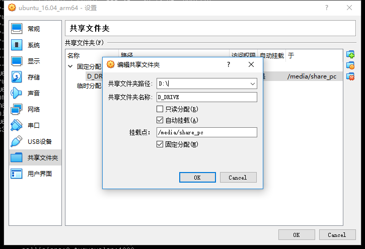
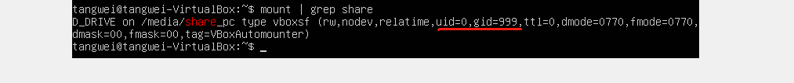
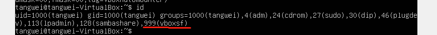
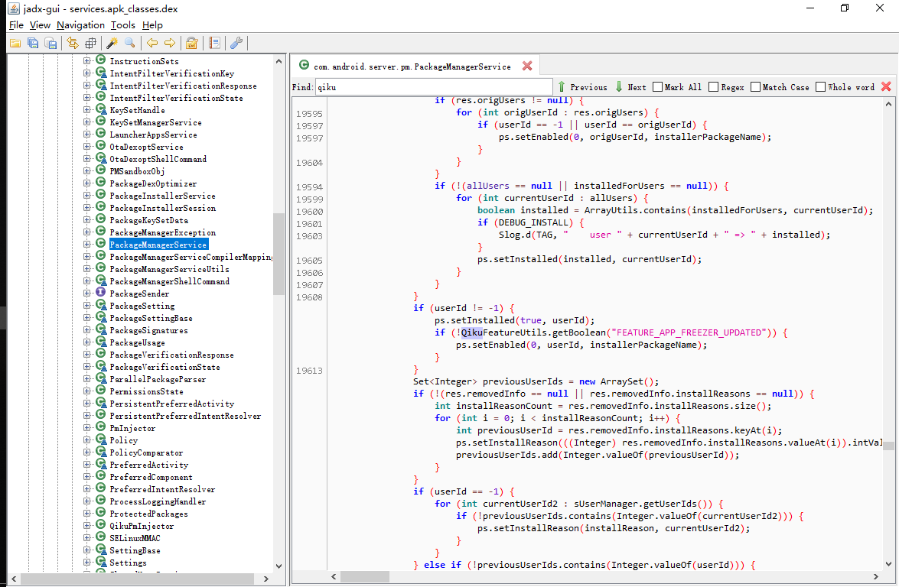
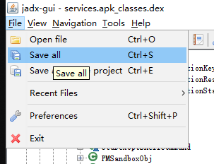

[TOC]

# 反编译工具

## 系统源码

### 8.x以上 - vdexExtractor

因为软件执行并不困难，但需要linux执行环境，因此以windows环境举例说明

#### Step 1. 解压vdexExtractor.zip到linux环境

如果本机是windows，推荐virtualBox安装ubuntu来完成

#### Step 2. 从手机上导出system目录

例如：C:\Users\EDZ\Desktop\2019Q1\decompile_test>**adb pull /system system**

#### Step 3. 在linux环境执行bash deodex.sh %导出的system目录%

虚拟机需共享本机目录，例如如下步骤：

virtualbox菜单 - 设备 > 共享文件夹 > 共享文件夹...

重启虚拟机会发现目录已经挂载成功：

uid=0(root), gid=999(vboxsf)

如果本地shell是非root身份登录，则需要添加vboxsf组：

先使用id命令查看是否有999组权限，如果没有使用sudo gpasswd -a %你的登录用户名% vboxsf，授权成功后需重启虚拟机。

接下来就可以在虚拟机下执行对应的指令来完成反编译了

操作成功后，会在%导出的system目录%的生成一个后缀_deodex的平级目录

#### Step 4. 使用dex反编译工具得到源码

比如：jadx，或者dex2jar

也可以把源码保存下来换别的IDE查看

