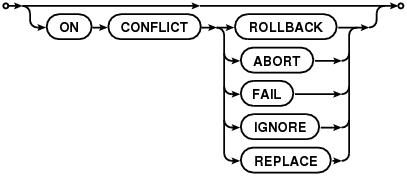

| 版本 | 修订人 |   日期   | 描述       |
| :--: | :----: | :------: | :--------- |
|  --  |  唐炜  | 2019-6-6 | 创建此文档 |


# 1、SQLite教程

## 1.1、SQLite 简介

SQLite是一个进程内的库，实现了自给自足的、无服务器的、零配置的、事务性的 SQL 数据库引擎。它是一个零配置的数据库，这意味着与其他数据库一样，您不需要在系统中配置。

就像其他数据库，SQLite 引擎不是一个独立的进程，可以按应用程序需求进行静态或动态连接。SQLite 直接访问其存储文件。

为什么要用 SQLite？

- 不需要一个单独的服务器进程或操作的系统（无服务器的）。
- SQLite 不需要配置，这意味着不需要安装或管理。
- 一个完整的 SQLite 数据库是存储在一个单一的跨平台的磁盘文件。
- SQLite 是非常小的，是轻量级的，完全配置时小于 400KiB，省略可选功能配置时小于250KiB。
- SQLite 是自给自足的，这意味着不需要任何外部的依赖。
- SQLite 事务是完全兼容 ACID 的，允许从多个进程或线程安全访问。
- SQLite 支持 SQL92（SQL2）标准的大多数查询语言的功能。
- SQLite 使用 ANSI-C 编写的，并提供了简单和易于使用的 API。
- SQLite 可在 UNIX（Linux, Mac OS-X, Android, iOS）和 Windows（Win32, WinCE, WinRT）中运行。


## 1.2、SQLite 语法概要

### 1.2.1、大小写敏感性

有个重要的点值得注意，SQLite 是**不区分大小写**的，但也有一些命令是大小写敏感的，比如 **GLOB** 和 **glob** 在 SQLite 的语句中有不同的含义。

### 1.2.2、注释

单行注释以两个连续的 "-" 字符（ASCII 0x2d）开始，并扩展至下一个换行符（ASCII 0x0a）或直到输入结束，以先到者为准。

多行注释也可以使用 C 风格的注释，以 "/\*" 开始，并扩展至下一个 "\*/" 字符对或直到输入结束，以先到者为准。

### 1.2.3、语句

所有的 SQLite 语句可以以任何关键字开始，如 SELECT、INSERT、UPDATE、DELETE、ALTER、DROP 等，所有的语句以分号（;）结束。


## 1.3、SQLite 数据类型

### 1.3.1、SQLite 存储类

每个存储在 SQLite 数据库中的值都具有以下存储类之一：

| 存储类  | 描述                                                         |
| :------ | :----------------------------------------------------------- |
| NULL    | 值是一个 NULL 值。                                           |
| INTEGER | 值是一个带符号的整数，根据值的大小存储在 1、2、3、4、6 或 8 字节中。<br />例如，INT1的取值范围-128~127 |
| REAL    | 值是一个浮点值，存储为 8 字节的 IEEE 浮点数字。              |
| TEXT    | 值是一个文本字符串，使用数据库编码（UTF-8、UTF-16BE 或 UTF-16LE）存储。 |
| BLOB    | 值是一个 blob 数据，完全根据它的输入存储。                   |

SQLite 的存储类稍微比数据类型更普遍。INTEGER 存储类，例如，包含 6 种不同的不同长度的整数数据类型。

### 1.3.2、SQLite 亲和(Affinity)类型

SQLite支持列的亲和类型概念。任何列仍然可以存储任何类型的数据，当数据插入时，该字段的数据将会优先采用亲缘类型作为该值的存储方式。SQLite目前的版本支持以下五种亲缘类型：

| 亲和类型 | 描述                                                         |
| :------- | :----------------------------------------------------------- |
| TEXT     | 数值型数据在被插入之前，需要先被转换为文本格式，之后再插入到目标字段中。 |
| NUMERIC  | 当文本数据被插入到亲缘性为NUMERIC的字段中时，如果转换操作不会导致数据信息丢失以及完全可逆，那么SQLite就会将该文本数据转换为INTEGER或REAL类型的数据，如果转换失败，SQLite仍会以TEXT方式存储该数据。对于NULL或BLOB类型的新数据，SQLite将不做任何转换，直接以NULL或BLOB的方式存储该数据。需要额外说明的是，对于浮点格式的常量文本，如"30000.0"，如果该值可以转换为INTEGER同时又不会丢失数值信息，那么SQLite就会将其转换为INTEGER的存储方式。 |
| INTEGER  | 对于亲缘类型为INTEGER的字段，其规则等同于NUMERIC，唯一差别是在执行CAST表达式时。 |
| REAL     | 其规则基本等同于NUMERIC，唯一的差别是不会将"30000.0"这样的文本数据转换为INTEGER存储方式。 |
| NONE     | 不做任何的转换，直接以该数据所属的数据类型进行存储。         |

### 1.3.3、SQLite 亲和类型(Affinity)及类型名称

下表列出了当创建 SQLite3 表时可使用的各种数据类型名称，同时也显示了相应的亲和类型：

| Example Typenames From The CREATE TABLE Statement or CAST Expression | Resulting Affinity | Rule Used To Determine Affinity |
| :----------------------------------------------------------- | :----------------- | :------------------------------ |
| INT<br />INTEGER<br />TINYINT<br />SMALLINT<br />MEDIUMINT<br />BIGINT<br />UNSIGNED BIG INT<br />INT2<br />INT8 | INTEGER            | 1                               |
| CHARACTER(20)<br />VARCHAR(255)<br />VARYING CHARACTER(255)<br />NCHAR(55)<br />NATIVE CHARACTER(70)<br />NVARCHAR(100)<br />TEXT<br />CLOB | TEXT               | 2                               |
| BLOB *no datatype specified*                                 | BLOB               | 3                               |
| REAL<br />DOUBLE<br />DOUBLE PRECISION<br />FLOAT            | REAL               | 4                               |
| NUMERIC<br />DECIMAL(10,5)<br />BOOLEAN<br />DATE<br />DATETIME | NUMERIC            | 5                               |

**Note**: that numeric arguments in parentheses that following the type name (ex: "VARCHAR(255)") are ignored by SQLite - SQLite does not impose any length restrictions (other than the large global SQLITE_MAX_LENGTH limit) on the length of strings, BLOBs or numeric values.

### 1.3.4、Boolean 数据类型

SQLite 没有单独的 Boolean 存储类。相反，布尔值被存储为整数 0（false）和 1（true）。

### 1.3.5、Date 与 Time 数据类型

SQLite 没有一个单独的用于存储日期和/或时间的存储类，但 SQLite 能够把日期和时间存储为 TEXT、REAL 或 INTEGER 值。

| 存储类  | 日期格式                                                     |
| :------ | :----------------------------------------------------------- |
| TEXT    | 格式为 "YYYY-MM-DD HH:MM:SS.SSS" 的日期。                    |
| REAL    | 从公元前 4714 年 11 月 24 日格林尼治时间的正午开始算起的天数。 |
| INTEGER | 从 1970-01-01 00:00:00 UTC 算起的秒数。                      |

可以以任何上述格式来存储日期和时间，并且可以使用内置的日期和时间函数来自由转换不同格式。


## 1.4、SQLite 创建数据库

SQLite 的 **sqlite3** 命令被用来创建新的 SQLite 数据库。您不需要任何特殊的权限即可创建一个数据。

### 1.4.1、语法

sqlite3 命令的基本语法如下：

```sqlite
$sqlite3 DatabaseName.db
```

通常情况下，数据库名称在 RDBMS 内应该是唯一的。

### 1.4.2、例子

如果您想创建一个新的数据库 <testDB.db>，SQLITE3 语句如下所示：

```sqlite
$sqlite3 testDB.db
SQLite version 3.7.15.2 2013-01-09 11:53:05
Enter ".help" for instructions
Enter SQL statements terminated with a ";"
sqlite>
```

上面的命令将在当前目录下创建一个文件 **testDB.db**。该文件将被 SQLite 引擎用作数据库。如果您已经注意到 sqlite3 命令在成功创建数据库文件之后，将提供一个 **sqlite>** 提示符。

一旦数据库被创建，您就可以使用 SQLite 的 **.databases** 命令来检查它是否在数据库列表中，如下所示：

```sqlite
sqlite>.databases
seq  name             file
---  ---------------  ----------------------
0    main             /home/sqlite/testDB.db
```

您可以使用 SQLite **.quit** 命令退出 sqlite 提示符，如下所示：

```sqlite
sqlite>.quit
$
```

### 1.4.3、.dump 命令

您可以在命令提示符中使用 SQLite **.dump** 点命令来导出完整的数据库在一个文本文件中，如下所示：

```sqlite
$sqlite3 testDB.db .dump > testDB.sql
```

上面的命令将转换整个 **testDB.db** 数据库的内容到 SQLite 的语句中，并将其转储到 ASCII 文本文件 **testDB.sql** 中。

您可以通过简单的方式从生成的 testDB.sql 恢复，如下所示：

```sqlite
$sqlite3 testDB.db < testDB.sql	
```


## 1.5、SQLite 附加数据库

假设这样一种情况，当在同一时间有多个数据库可用，您想使用其中的任何一个。SQLite 的 **ATTACH DATABASE** 语句是用来选择一个特定的数据库，使用该命令后，所有的 SQLite 语句将在附加的数据库下执行。

### 1.5.1、语法

SQLite 的 ATTACH DATABASE 语句的基本语法如下：

```sqlite
ATTACH DATABASE 'DatabaseName' As 'Alias-Name';
```

如果数据库尚未被创建，上面的命令将创建一个数据库，如果数据库已存在，则把数据库文件名称与逻辑数据库 'Alias-Name' 绑定在一起。

### 1.5.2、实例

如果想附加一个现有的数据库 **testDB.db**，则 ATTACH DATABASE 语句将如下所示：

```sqlite
sqlite> ATTACH DATABASE 'testDB.db' as 'TEST';
```

使用 SQLite **.database** 命令来显示附加的数据库。

```sqlite
sqlite> .database
seq  name             file
---  ---------------  ----------------------
0    main             /home/sqlite/testDB.db
2    test             /home/sqlite/testDB.db
```

数据库名称 **main** 和 **temp** 被保留用于主数据库和存储临时表及其他临时数据对象的数据库。这两个数据库名称可用于每个数据库连接，且不应该被用于附加，否则将得到一个警告消息，如下所示：

```sqlite
sqlite>  ATTACH DATABASE 'testDB.db' as 'TEMP';
Error: database TEMP is already in use
sqlite>  ATTACH DATABASE 'testDB.db' as 'main';
Error: database main is already in use；
```


## 1.6、SQLite 分离数据库

SQLite的 **DETACH DTABASE** 语句是用来把命名数据库从一个数据库连接分离和游离出来，连接是之前使用 ATTACH 语句附加的。如果同一个数据库文件已经被附加上多个别名，DETACH 命令将只断开给定名称的连接，而其余的仍然有效。您无法分离 **main** 或 **temp**数据库。

> 如果数据库是在内存中或者是临时数据库，则该数据库将被摧毁，且内容将会丢失。

### 1.6.1、语法

SQLite 的 DETACH DATABASE 'Alias-Name' 语句的基本语法如下：

```sqlite
DETACH DATABASE 'Alias-Name';
```

在这里，'Alias-Name' 与您之前使用 ATTACH 语句附加数据库时所用到的别名相同。

### 1.6.2、实例

假设在前面的章节中您已经创建了一个数据库，并给它附加了 'test' 和 'currentDB'，使用 .database 命令，我们可以看到：

```sqlite
sqlite>.databases
seq  name             file
---  ---------------  ----------------------
0    main             /home/sqlite/testDB.db
2    test             /home/sqlite/testDB.db
3    currentDB        /home/sqlite/testDB.db
```

现在，让我们尝试把 'currentDB' 从 testDB.db 中分离出来，如下所示：

```sqlite
sqlite> DETACH DATABASE 'currentDB';
```

现在，如果检查当前附加的数据库，您会发现，testDB.db 仍与 'test' 和 'main' 保持连接。

```sqlite
sqlite>.databases
seq  name             file
---  ---------------  ----------------------
0    main             /home/sqlite/testDB.db
2    test             /home/sqlite/testDB.db
```


## 1.7、SQLite 创建表

SQLite 的 **CREATE TABLE** 语句用于在任何给定的数据库创建一个新表。创建基本表，涉及到命名表、定义列及每一列的数据类型。

### 1.7.1、语法

CREATE TABLE 语句的基本语法如下：

```sqlite
CREATE TABLE database_name.table_name(
   column1 datatype  PRIMARY KEY(one or more columns),
   column2 datatype,
   column3 datatype,
   .....
   columnN datatype,
);
```

CREATE TABLE 是告诉数据库系统创建一个新表的关键字。CREATE TABLE 语句后跟着表的唯一的名称或标识。您也可以选择指定带有 *table_name* 的 *database_name*。

### 1.7.2、实例

下面是一个实例，它创建了一个 COMPANY 表，ID 作为主键，NOT NULL 的约束表示在表中创建纪录时这些字段不能为 NULL：

```sqlite
sqlite> CREATE TABLE COMPANY(
   ID INT PRIMARY KEY     NOT NULL,
   NAME           TEXT    NOT NULL,
   AGE            INT     NOT NULL,
   ADDRESS        CHAR(50),
   SALARY         REAL
);
```

让我们再创建一个表，我们将在随后章节的练习中使用：

```sqlite
sqlite> CREATE TABLE DEPARTMENT(
   ID INT PRIMARY KEY      NOT NULL,
   DEPT           CHAR(50) NOT NULL,
   EMP_ID         INT      NOT NULL
);
```

您可以使用 SQLIte 命令中的 **.tables** 命令来验证表是否已成功创建，该命令用于列出附加数据库中的所有表。

```sqlite
sqlite>.tables
COMPANY     DEPARTMENT
```

在这里，可以看到我们刚创建的两张表 COMPANY、 DEPARTMENT。

您可以使用 SQLite **.schema** 命令得到表的完整信息，如下所示：

```sqlite
sqlite>.schema COMPANY
CREATE TABLE COMPANY(
   ID INT PRIMARY KEY     NOT NULL,
   NAME           TEXT    NOT NULL,
   AGE            INT     NOT NULL,
   ADDRESS        CHAR(50),
   SALARY         REAL
);
```


## 1.8、SQLite 删除表

SQLite 的 **DROP TABLE** 语句用来删除表定义及其所有相关数据、索引、触发器、约束和该表的权限规范。

> 使用此命令时要特别注意，因为一旦一个表被删除，表中所有信息也将永远丢失。

### 1.8.1、语法

DROP TABLE 语句的基本语法如下。您可以选择指定带有表名的数据库名称，如下所示：

```sqlite
DROP TABLE database_name.table_name;
```

### 1.8.2、实例

让我们先确认 COMPANY 表已经存在，然后我们将其从数据库中删除。

```sqlite
sqlite>.tables
COMPANY       test.COMPANY
```

这意味着 COMPANY 表已存在数据库中，接下来让我们把它从数据库中删除，如下：

```sqlite
sqlite>DROP TABLE COMPANY;
sqlite>
```

现在，如果尝试 .TABLES 命令，那么将无法找到 COMPANY 表了：

```sqlite
sqlite>.tables
sqlite>
```

显示结果为空，意味着已经成功从数据库删除表。


## 1.9、SQLite Insert 语句

SQLite 的 **INSERT INTO** 语句用于向数据库的某个表中添加新的数据行。

### 1.9.1、语法

INSERT INTO 语句有两种基本语法，如下所示：

```sqlite
INSERT INTO TABLE_NAME [(column1, column2, column3,...columnN)]  
VALUES (value1, value2, value3,...valueN);
```

在这里，column1, column2,...columnN 是要插入数据的表中的列的名称。

如果要为表中的所有列添加值，您也可以不需要在 SQLite 查询中指定列名称。但要确保值的顺序与列在表中的顺序一致。SQLite 的 INSERT INTO 语法如下：

```sqlite
INSERT INTO TABLE_NAME VALUES (value1,value2,value3,...valueN);
```

### 1.9.2、实例

假设您已经在 testDB.db 中创建了 COMPANY表，如下所示：

```sqlite
sqlite> CREATE TABLE COMPANY(
   ID INT PRIMARY KEY     NOT NULL,
   NAME           TEXT    NOT NULL,
   AGE            INT     NOT NULL,
   ADDRESS        CHAR(50),
   SALARY         REAL
);
```

现在，下面的语句将在 COMPANY 表中创建六个记录：

```sqlite
INSERT INTO COMPANY (ID,NAME,AGE,ADDRESS,SALARY)
VALUES (1, 'Paul', 32, 'California', 20000.00 );

INSERT INTO COMPANY (ID,NAME,AGE,ADDRESS,SALARY)
VALUES (2, 'Allen', 25, 'Texas', 15000.00 );

INSERT INTO COMPANY (ID,NAME,AGE,ADDRESS,SALARY)
VALUES (3, 'Teddy', 23, 'Norway', 20000.00 );

INSERT INTO COMPANY (ID,NAME,AGE,ADDRESS,SALARY)
VALUES (4, 'Mark', 25, 'Rich-Mond ', 65000.00 );

INSERT INTO COMPANY (ID,NAME,AGE,ADDRESS,SALARY)
VALUES (5, 'David', 27, 'Texas', 85000.00 );

INSERT INTO COMPANY (ID,NAME,AGE,ADDRESS,SALARY)
VALUES (6, 'Kim', 22, 'South-Hall', 45000.00 );
```

您也可以使用第二种语法在 COMPANY 表中创建一个记录，如下所示：

```sqlite
INSERT INTO COMPANY VALUES (7, 'James', 24, 'Houston', 10000.00 );
```

上面的所有语句将在 COMPANY 表中创建下列记录。下一章会教您如何从一个表中显示所有这些记录。

```sqlite
ID          NAME        AGE         ADDRESS     SALARY
----------  ----------  ----------  ----------  ----------
1           Paul        32          California  20000.0
2           Allen       25          Texas       15000.0
3           Teddy       23          Norway      20000.0
4           Mark        25          Rich-Mond   65000.0
5           David       27          Texas       85000.0
6           Kim         22          South-Hall  45000.0
7           James       24          Houston     10000.0
```

### 1.9.3、使用一个表来填充另一个表

您可以通过在一个有一组字段的表上使用 select 语句，填充数据到另一个表中。下面是语法：

```sqlite
INSERT INTO first_table_name [(column1, column2, ... columnN)] 
   SELECT column1, column2, ...columnN 
   FROM second_table_name
   [WHERE condition];
```


## 1.10、SQLite Select 语句

SQLite 的 **SELECT** 语句用于从 SQLite 数据库表中获取数据，以结果表的形式返回数据。这些结果表也被称为结果集。

### 1.10.1、语法

SQLite 的 SELECT 语句的基本语法如下：

```sqlite
SELECT column1, column2, columnN FROM table_name;
```

在这里，column1, column2...是表的字段，他们的值即是您要获取的。如果您想获取所有可用的字段，那么可以使用下面的语法：

```sqlite
SELECT * FROM table_name;
```

### 1.10.2、实例

假设 COMPANY 表有以下记录：

```sqlite
ID          NAME        AGE         ADDRESS     SALARY
----------  ----------  ----------  ----------  ----------
1           Paul        32          California  20000.0
2           Allen       25          Texas       15000.0
3           Teddy       23          Norway      20000.0
4           Mark        25          Rich-Mond   65000.0
5           David       27          Texas       85000.0
6           Kim         22          South-Hall  45000.0
7           James       24          Houston     10000.0
```

下面是一个实例，使用 SELECT 语句获取并显示所有这些记录。在这里，前三个命令被用来设置正确格式化的输出。

```sqlite
sqlite>.header on
sqlite>.mode column
sqlite> SELECT * FROM COMPANY;
```

最后，将得到以下的结果：

```sqlite
ID          NAME        AGE         ADDRESS     SALARY
----------  ----------  ----------  ----------  ----------
1           Paul        32          California  20000.0
2           Allen       25          Texas       15000.0
3           Teddy       23          Norway      20000.0
4           Mark        25          Rich-Mond   65000.0
5           David       27          Texas       85000.0
6           Kim         22          South-Hall  45000.0
7           James       24          Houston     10000.0
```

如果只想获取 COMPANY 表中指定的字段，则使用下面的查询：

```sqlite
sqlite> SELECT ID, NAME, SALARY FROM COMPANY;
```

上面的查询会产生以下结果：

```sqlite
ID          NAME        SALARY
----------  ----------  ----------
1           Paul        20000.0
2           Allen       15000.0
3           Teddy       20000.0
4           Mark        65000.0
5           David       85000.0
6           Kim         45000.0
7           James       10000.0
```

### 1.10.3、设置输出列的宽度

有时，由于要显示的列的默认宽度导致 **.mode column**，这种情况下，输出被截断。此时，您可以使用 **.width num, num....** 命令设置显示列的宽度，如下所示：

```sqlite
sqlite>.width 10, 20, 10
sqlite>SELECT * FROM COMPANY;
```

上面的 **.width** 命令设置第一列的宽度为 10，第二列的宽度为 20，第三列的宽度为 10。因此上述 SELECT 语句将得到以下结果：

```sqlite
ID          NAME                  AGE         ADDRESS     SALARY
----------  --------------------  ----------  ----------  ----------
1           Paul                  32          California  20000.0
2           Allen                 25          Texas       15000.0
3           Teddy                 23          Norway      20000.0
4           Mark                  25          Rich-Mond   65000.0
5           David                 27          Texas       85000.0
6           Kim                   22          South-Hall  45000.0
7           James                 24          Houston     10000.0
```

### 1.10.4、Schema 信息

因为所有的**点命令**只在 SQLite 提示符中可用，所以当您进行带有 SQLite 的编程时，您要使用下面的带有 **sqlite_master** 表的 SELECT 语句来列出所有在数据库中创建的表：

```sqlite
sqlite> SELECT tbl_name FROM sqlite_master WHERE type = 'table';
```

假设在 testDB.db 中已经存在唯一的 COMPANY 表，则将产生以下结果：

```sqlite
tbl_name
----------
COMPANY
```

您可以列出关于 COMPANY 表的完整信息，如下所示：

```sqlite
sqlite> SELECT sql FROM sqlite_master WHERE type = 'table' AND tbl_name = 'COMPANY';
```

假设在 testDB.db 中已经存在唯一的 COMPANY 表，则将产生以下结果：

```sqlite
CREATE TABLE COMPANY(
   ID INT PRIMARY KEY     NOT NULL,
   NAME           TEXT    NOT NULL,
   AGE            INT     NOT NULL,
   ADDRESS        CHAR(50),
   SALARY         REAL
)
```


## 1.11、SQLite 运算符

### 1.11.1、SQLite 运算符是什么？

运算符是一个保留字或字符，主要用于 SQLite 语句的 WHERE 子句中执行操作，如比较和算术运算。

运算符用于指定 SQLite 语句中的条件，并在语句中连接多个条件。

- 算术运算符
- 比较运算符
- 逻辑运算符
- 位运算符

### 1.11.2、SQLite 算术运算符

假设变量 a=10，变量 b=20，则：

| 运算符 | 描述                                    | 实例              |
| :----- | :-------------------------------------- | :---------------- |
| +      | 加法 - 把运算符两边的值相加             | a + b 将得到 30   |
| -      | 减法 - 左操作数减去右操作数             | a - b 将得到 -10  |
| *      | 乘法 - 把运算符两边的值相乘             | a * b 将得到 200  |
| /      | 除法 - 左操作数除以右操作数             | b / a 将得到 2    |
| %      | 取模 - 左操作数除以右操作数后得到的余数 | b % a will give 0 |

下面是 SQLite 算术运算符的简单实例：

```sqlite
sqlite> .mode line
sqlite> select 10 + 20;
10 + 20 = 30


sqlite> select 10 - 20;
10 - 20 = -10


sqlite> select 10 * 20;
10 * 20 = 200


sqlite> select 10 / 5;
10 / 5 = 2


sqlite> select 12 %  5;
12 %  5 = 2
```

### 1.11.3、SQLite 比较运算符

假设变量 a=10，变量 b=20，则：

| 运算符 | 描述                                                         | 实例              |
| :----- | :----------------------------------------------------------- | :---------------- |
| ==     | 检查两个操作数的值是否相等，如果相等则条件为真。             | (a == b) 不为真。 |
| =      | 检查两个操作数的值是否相等，如果相等则条件为真。             | (a = b) 不为真。  |
| !=     | 检查两个操作数的值是否相等，如果不相等则条件为真。           | (a != b) 为真。   |
| <>     | 检查两个操作数的值是否相等，如果不相等则条件为真。           | (a <> b) 为真。   |
| >      | 检查左操作数的值是否大于右操作数的值，如果是则条件为真。     | (a > b) 不为真。  |
| <      | 检查左操作数的值是否小于右操作数的值，如果是则条件为真。     | (a < b) 为真。    |
| >=     | 检查左操作数的值是否大于等于右操作数的值，如果是则条件为真。 | (a >= b) 不为真。 |
| <=     | 检查左操作数的值是否小于等于右操作数的值，如果是则条件为真。 | (a <= b) 为真。   |
| !<     | 检查左操作数的值是否不小于右操作数的值，如果是则条件为真。   | (a !< b) 为假。   |
| !>     | 检查左操作数的值是否不大于右操作数的值，如果是则条件为真。   | (a !> b) 为真。   |

假设 COMPANY 表有以下记录：

```sqlite
ID          NAME        AGE         ADDRESS     SALARY
----------  ----------  ----------  ----------  ----------
1           Paul        32          California  20000.0
2           Allen       25          Texas       15000.0
3           Teddy       23          Norway      20000.0
4           Mark        25          Rich-Mond   65000.0
5           David       27          Texas       85000.0
6           Kim         22          South-Hall  45000.0
7           James       24          Houston     10000.0
```

下面的实例演示了各种 SQLite 比较运算符的用法。

> 在这里，我们使用 **WHERE** 子句，这将会在后边单独的一个章节中讲解，但现在您需要明白，WHERE 子句是用来设置 SELECT 语句的条件语句。

下面的 SELECT 语句列出了 SALARY 大于 50,000.00 的所有记录：

```sqlite
sqlite> SELECT * FROM COMPANY WHERE SALARY > 50000;
ID          NAME        AGE         ADDRESS     SALARY
----------  ----------  ----------  ----------  ----------
4           Mark        25          Rich-Mond   65000.0
5           David       27          Texas       85000.0
```

下面的 SELECT 语句列出了 SALARY 等于 20,000.00 的所有记录：

```sqlite
sqlite>  SELECT * FROM COMPANY WHERE SALARY = 20000;
ID          NAME        AGE         ADDRESS     SALARY
----------  ----------  ----------  ----------  ----------
1           Paul        32          California  20000.0
3           Teddy       23          Norway      20000.0
```

下面的 SELECT 语句列出了 SALARY 不等于 20,000.00 的所有记录：

```sqlite
sqlite>  SELECT * FROM COMPANY WHERE SALARY != 20000;
ID          NAME        AGE         ADDRESS     SALARY
----------  ----------  ----------  ----------  ----------
2           Allen       25          Texas       15000.0
4           Mark        25          Rich-Mond   65000.0
5           David       27          Texas       85000.0
6           Kim         22          South-Hall  45000.0
7           James       24          Houston     10000.0
```

下面的 SELECT 语句列出了 SALARY 不等于 20,000.00 的所有记录：

```sqlite
sqlite> SELECT * FROM COMPANY WHERE SALARY <> 20000;
ID          NAME        AGE         ADDRESS     SALARY
----------  ----------  ----------  ----------  ----------
2           Allen       25          Texas       15000.0
4           Mark        25          Rich-Mond   65000.0
5           David       27          Texas       85000.0
6           Kim         22          South-Hall  45000.0
7           James       24          Houston     10000.0
```

下面的 SELECT 语句列出了 SALARY 大于等于 65,000.00 的所有记录：

```sqlite
sqlite> SELECT * FROM COMPANY WHERE SALARY >= 65000;
ID          NAME        AGE         ADDRESS     SALARY
----------  ----------  ----------  ----------  ----------
4           Mark        25          Rich-Mond   65000.0
5           David       27          Texas       85000.0
```

### 1.11.4、SQLite 逻辑运算符

下面是 SQLite 中所有的逻辑运算符列表。

| 运算符  | 描述                                                         |
| :------ | :----------------------------------------------------------- |
| AND     | AND 运算符允许在一个 SQL 语句的 WHERE 子句中的多个条件的存在。 |
| BETWEEN | BETWEEN 运算符用于在给定最小值和最大值范围内的一系列值中搜索值。 |
| EXISTS  | EXISTS 运算符用于在满足一定条件的指定表中搜索行的存在。      |
| IN      | IN 运算符用于把某个值与一系列指定列表的值进行比较。          |
| NOT IN  | IN 运算符的对立面，用于把某个值与不在一系列指定列表的值进行比较。 |
| LIKE    | LIKE 运算符用于把某个值与使用通配符运算符的相似值进行比较。  |
| GLOB    | GLOB 运算符用于把某个值与使用通配符运算符的相似值进行比较。GLOB 与 LIKE 不同之处在于，它是大小写敏感的。 |
| NOT     | NOT 运算符是所用的逻辑运算符的对立面。比如 NOT EXISTS、NOT BETWEEN、NOT IN，等等。**它是否定运算符。** |
| OR      | OR 运算符用于结合一个 SQL 语句的 WHERE 子句中的多个条件。    |
| IS NULL | NULL 运算符用于把某个值与 NULL 值进行比较。                  |
| IS      | IS 运算符与 = 相似。                                         |
| IS NOT  | IS NOT 运算符与 != 相似。                                    |
| \|\|    | 连接两个不同的字符串，得到一个新的字符串。                   |
| UNIQUE  | UNIQUE 运算符搜索指定表中的每一行，确保唯一性（无重复）。    |

假设 COMPANY 表有以下记录：

```sqlite
ID          NAME        AGE         ADDRESS     SALARY
----------  ----------  ----------  ----------  ----------
1           Paul        32          California  20000.0
2           Allen       25          Texas       15000.0
3           Teddy       23          Norway      20000.0
4           Mark        25          Rich-Mond   65000.0
5           David       27          Texas       85000.0
6           Kim         22          South-Hall  45000.0
7           James       24          Houston     10000.0
```

下面的实例演示了 SQLite 逻辑运算符的用法。

下面的 SELECT 语句列出了 AGE 大于等于 25 **且**工资大于等于 65000.00 的所有记录：

```sqlite
sqlite> SELECT * FROM COMPANY WHERE AGE >= 25 AND SALARY >= 65000;
ID          NAME        AGE         ADDRESS     SALARY
----------  ----------  ----------  ----------  ----------
4           Mark        25          Rich-Mond   65000.0
5           David       27          Texas       85000.0
```

下面的 SELECT 语句列出了 AGE 大于等于 25 **或**工资大于等于 65000.00 的所有记录：

```sqlite
sqlite> SELECT * FROM COMPANY WHERE AGE >= 25 OR SALARY >= 65000;
ID          NAME        AGE         ADDRESS     SALARY
----------  ----------  ----------  ----------  ----------
1           Paul        32          California  20000.0
2           Allen       25          Texas       15000.0
4           Mark        25          Rich-Mond   65000.0
5           David       27          Texas       85000.0
```

下面的 SELECT 语句列出了 AGE 不为 NULL 的所有记录，结果显示所有的记录，意味着没有一个记录的 AGE 等于 NULL：

```sqlite
sqlite>  SELECT * FROM COMPANY WHERE AGE IS NOT NULL;
ID          NAME        AGE         ADDRESS     SALARY
----------  ----------  ----------  ----------  ----------
1           Paul        32          California  20000.0
2           Allen       25          Texas       15000.0
3           Teddy       23          Norway      20000.0
4           Mark        25          Rich-Mond   65000.0
5           David       27          Texas       85000.0
6           Kim         22          South-Hall  45000.0
7           James       24          Houston     10000.0
```

下面的 SELECT 语句列出了 NAME 以 'Ki' 开始的所有记录，'Ki' 之后的字符不做限制：

```sqlite
sqlite> SELECT * FROM COMPANY WHERE NAME LIKE 'Ki%';
ID          NAME        AGE         ADDRESS     SALARY
----------  ----------  ----------  ----------  ----------
6           Kim         22          South-Hall  45000.0
```

下面的 SELECT 语句列出了 NAME 以 'Ki' 开始的所有记录，'Ki' 之后的字符不做限制：

```sqlite
sqlite> SELECT * FROM COMPANY WHERE NAME GLOB 'Ki*';
ID          NAME        AGE         ADDRESS     SALARY
----------  ----------  ----------  ----------  ----------
6           Kim         22          South-Hall  45000.0
```

下面的 SELECT 语句列出了 AGE 的值为 25 或 27 的所有记录：

```sqlite
sqlite> SELECT * FROM COMPANY WHERE AGE IN ( 25, 27 );
ID          NAME        AGE         ADDRESS     SALARY
----------  ----------  ----------  ----------  ----------
2           Allen       25          Texas       15000.0
4           Mark        25          Rich-Mond   65000.0
5           David       27          Texas       85000.0
```

下面的 SELECT 语句列出了 AGE 的值既不是 25 也不是 27 的所有记录：

```sqlite
sqlite> SELECT * FROM COMPANY WHERE AGE NOT IN ( 25, 27 );
ID          NAME        AGE         ADDRESS     SALARY
----------  ----------  ----------  ----------  ----------
1           Paul        32          California  20000.0
3           Teddy       23          Norway      20000.0
6           Kim         22          South-Hall  45000.0
7           James       24          Houston     10000.0
```

下面的 SELECT 语句列出了 AGE 的值在 25 与 27 之间的所有记录：

```sqlite
sqlite> SELECT * FROM COMPANY WHERE AGE BETWEEN 25 AND 27;
ID          NAME        AGE         ADDRESS     SALARY
----------  ----------  ----------  ----------  ----------
2           Allen       25          Texas       15000.0
4           Mark        25          Rich-Mond   65000.0
5           David       27          Texas       85000.0
```

下面的 SELECT 语句使用 SQL 子查询，子查询查找 SALARY > 65000 的带有 AGE 字段的所有记录，后边的 WHERE 子句与 EXISTS 运算符一起使用，列出了外查询中的 AGE 存在于子查询返回的结果中的所有记录：

```sqlite
sqlite> SELECT AGE FROM COMPANY 
        WHERE EXISTS (SELECT AGE FROM COMPANY WHERE SALARY > 65000);
AGE
----------
32
25
23
25
27
22
24
```

下面的 SELECT 语句使用 SQL 子查询，子查询查找 SALARY > 65000 的带有 AGE 字段的所有记录，后边的 WHERE 子句与 > 运算符一起使用，列出了外查询中的 AGE 大于子查询返回的结果中的年龄的所有记录：

```sqlite
sqlite> SELECT * FROM COMPANY 
        WHERE AGE > (SELECT AGE FROM COMPANY WHERE SALARY > 65000);
ID          NAME        AGE         ADDRESS     SALARY
----------  ----------  ----------  ----------  ----------
1           Paul        32          California  20000.0
```

### 1.11.5、SQLite 位运算符

位运算符作用于位，并逐位执行操作。真值表 & 和 | 如下：

| p    | q    | p & q | p \| q |
| :--- | :--- | :---- | :----- |
| 0    | 0    | 0     | 0      |
| 0    | 1    | 0     | 1      |
| 1    | 1    | 1     | 1      |
| 1    | 0    | 0     | 1      |

假设如果 A = 60，且 B = 13，现在以二进制格式，它们如下所示：

A = 0011 1100

B = 0000 1101

\-----------------

A&B = 0000 1100

A|B = 0011 1101

~A  = 1100 0011

下表中列出了 SQLite 语言支持的位运算符。假设变量 A=60，变量 B=13，则：

| 运算符 | 描述                                                         | 实例                                                         |
| :----- | :----------------------------------------------------------- | :----------------------------------------------------------- |
| &      | 如果同时存在于两个操作数中，二进制 AND 运算符复制一位到结果中。 | (A & B) 将得到 12，即为 0000 1100                            |
| \|     | 如果存在于任一操作数中，二进制 OR 运算符复制一位到结果中。   | (A \| B) 将得到 61，即为 0011 1101                           |
| ~      | 二进制补码运算符是一元运算符，具有"翻转"位效应，即0变成1，1变成0。 | (~A ) 将得到 -61，即为 1100 0011，一个有符号二进制数的补码形式。 |
| <<     | 二进制左移运算符。左操作数的值向左移动右操作数指定的位数。   | A << 2 将得到 240，即为 1111 0000                            |
| >>     | 二进制右移运算符。左操作数的值向右移动右操作数指定的位数。   | A >> 2 将得到 15，即为 0000 1111                             |

下面的实例演示了 SQLite 位运算符的用法：

```sqlite
sqlite> .mode line
sqlite> select 60 | 13;
60 | 13 = 61

sqlite> select 60 & 13;
60 & 13 = 12

sqlite>  select  (~60);
(~60) = -61

sqlite>  select  (60 << 2);
(60 << 2) = 240

sqlite>  select  (60 >> 2);
(60 >> 2) = 15
```


## 1.12、SQLite 表达式

表达式是一个或多个值、运算符和计算值的SQL函数的组合。

SQL 表达式与公式类似，都写在查询语言中。您还可以使用特定的数据集来查询数据库。

### 1.12.1、语法

假设 SELECT 语句的基本语法如下：

```sqlite
SELECT column1, column2, columnN 
FROM table_name 
WHERE [CONDITION | EXPRESSION];
```

有不同类型的 SQLite 表达式，具体讲解如下：

### 1.12.2、SQLite - 布尔表达式

SQLite 的布尔表达式在匹配单个值的基础上获取数据。语法如下：

```sqlite
SELECT column1, column2, columnN 
FROM table_name 
WHERE SINGLE VALUE MATCHING EXPRESSION;
```

假设 COMPANY 表有以下记录：

```sqlite
ID          NAME        AGE         ADDRESS     SALARY
----------  ----------  ----------  ----------  ----------
1           Paul        32          California  20000.0
2           Allen       25          Texas       15000.0
3           Teddy       23          Norway      20000.0
4           Mark        25          Rich-Mond   65000.0
5           David       27          Texas       85000.0
6           Kim         22          South-Hall  45000.0
7           James       24          Houston     10000.0
```

下面的实例演示了 SQLite 布尔表达式的用法：

```sqlite
sqlite> SELECT * FROM COMPANY WHERE SALARY = 10000;
ID          NAME        AGE         ADDRESS     SALARY
----------  ----------  ----------  ----------  ----------
4           James        24          Houston   10000.0
```

### 1.12.3、SQLite - 数值表达式

这些表达式用来执行查询中的任何数学运算。语法如下：

```sqlite
SELECT numerical_expression as  OPERATION_NAME
[FROM table_name WHERE CONDITION] ;
```

在这里，numerical_expression 用于数学表达式或任何公式。下面的实例演示了 SQLite 数值表达式的用法：

```sqlite
sqlite> SELECT (15 + 6) AS ADDITION
ADDITION = 21
```

有几个内置的函数，比如 avg()、sum()、count()，等等，执行被称为对一个表或一个特定的表列的汇总数据计算。

```sqlite
sqlite> SELECT COUNT(*) AS "RECORDS" FROM COMPANY; 
RECORDS = 7
```

### 1.12.4、SQLite - 日期表达式

日期表达式返回当前系统日期和时间值，这些表达式将被用于各种数据操作。

```sqlite
sqlite>  SELECT CURRENT_TIMESTAMP;
CURRENT_TIMESTAMP = 2013-03-17 10:43:35
-- CURRENT_TIMESTAMP拿到的是格林威治时间，如果要取当前时区的时间，用如下代码：
sqlite> select datetime('now','localtime');
datetime('now','localtime') = 2018-09-13 16:38:32
```


## 1.13、SQLite Where 子句

SQLite的 **WHERE** 子句用于指定从一个表或多个表中获取数据的条件。

如果满足给定的条件，即为真（true）时，则从表中返回特定的值。您可以使用 WHERE 子句来过滤记录，只获取需要的记录。

WHERE 子句不仅可用在 SELECT 语句中，它也可用在 UPDATE、DELETE 语句中，等等，这些我们将在随后的章节中学习到。

### 1.13.1、语法

SQLite 的带有 WHERE 子句的 SELECT 语句的基本语法如下：

```sqlite
SELECT column1, column2, columnN 
FROM table_name
WHERE [condition]
```


## 1.14、SQLite Update 语句

SQLite 的 **UPDATE** 查询用于修改表中已有的记录。可以使用带有 WHERE 子句的 UPDATE 查询来更新选定行，否则所有的行都会被更新。

### 1.14.1、语法

带有 WHERE 子句的 UPDATE 查询的基本语法如下：

```sqlite
UPDATE table_name
SET column1 = value1, column2 = value2...., columnN = valueN
WHERE [condition];
```

您可以使用 AND 或 OR 运算符来结合 N 个数量的条件。


## 1.15、SQLite Delete 语句

SQLite 的 **DELETE** 查询用于删除表中已有的记录。可以使用带有 WHERE 子句的 DELETE 查询来删除选定行，否则所有的记录都会被删除。

### 1.15.1、语法

带有 WHERE 子句的 DELETE 查询的基本语法如下：

```sqlite
DELETE FROM table_name
WHERE [condition];
```

您可以使用 AND 或 OR 运算符来结合 N 个数量的条件。


## 1.16、SQLite Like 子句

SQLite 的 **LIKE** 运算符是用来匹配通配符指定模式的文本值。如果搜索表达式与模式表达式匹配，LIKE 运算符将返回真（true），也就是 1。这里有两个通配符与 LIKE 运算符一起使用：

- 百分号 （%）
- 下划线 （_）

百分号（%）代表零个、一个或多个数字或字符。下划线（_）代表一个单一的数字或字符。这些符号可以被组合使用。


## 1.17、SQLite Glob 子句

SQLite 的 **GLOB** 运算符是用来匹配通配符指定模式的文本值。如果搜索表达式与模式表达式匹配，GLOB 运算符将返回真（true），也就是 1。与 LIKE 运算符不同的是，GLOB 是大小写敏感的，对于下面的通配符，它遵循 UNIX 的语法。

- 星号 （*）
- 问号 （?）

星号（*）代表零个、一个或多个数字或字符。问号（?）代表一个单一的数字或字符。这些符号可以被组合使用。


## 1.18、SQLite Limit 子句

SQLite 的 **LIMIT** 子句用于限制由 SELECT 语句返回的数据数量。

### 1.18.1、语法

带有 LIMIT 子句的 SELECT 语句的基本语法如下：

```sqlite
SELECT column1, column2, columnN 
FROM table_name
LIMIT [no of rows]
```

下面是 LIMIT 子句与 OFFSET 子句一起使用时的语法：

```sqlite
SELECT column1, column2, columnN 
FROM table_name
LIMIT [no of rows] OFFSET [row num]
```

SQLite 引擎将返回从下一行开始直到给定的 OFFSET 为止的所有行，如下面的最后一个实例所示。

### 1.18.2、实例

假设 COMPANY 表有以下记录：

```sqlite
ID          NAME        AGE         ADDRESS     SALARY
----------  ----------  ----------  ----------  ----------
1           Paul        32          California  20000.0
2           Allen       25          Texas       15000.0
3           Teddy       23          Norway      20000.0
4           Mark        25          Rich-Mond   65000.0
5           David       27          Texas       85000.0
6           Kim         22          South-Hall  45000.0
7           James       24          Houston     10000.0
```

下面是一个实例，它限制了您想要从表中提取的行数：

```sqlite
sqlite> SELECT * FROM COMPANY LIMIT 6;
```

这将产生以下结果：

```sqlite
ID          NAME        AGE         ADDRESS     SALARY
----------  ----------  ----------  ----------  ----------
1           Paul        32          California  20000.0
2           Allen       25          Texas       15000.0
3           Teddy       23          Norway      20000.0
4           Mark        25          Rich-Mond   65000.0
5           David       27          Texas       85000.0
6           Kim         22          South-Hall  45000.0
```

但是，在某些情况下，可能需要从一个特定的偏移开始提取记录。下面是一个实例，从第三位开始提取 3 个记录：

```sqlite
sqlite> SELECT * FROM COMPANY LIMIT 3 OFFSET 2;
```

这将产生以下结果：

```sqlite
ID          NAME        AGE         ADDRESS     SALARY
----------  ----------  ----------  ----------  ----------
3           Teddy       23          Norway      20000.0
4           Mark        25          Rich-Mond   65000.0
5           David       27          Texas       85000.0
```


## 1.19、SQLite Order By

SQLite 的 **ORDER BY** 子句是用来基于一个或多个列按升序或降序顺序排列数据。

### 1.19.1、语法

ORDER BY 子句的基本语法如下：

```sqlite
SELECT column-list 
FROM table_name 
[WHERE condition] 
[ORDER BY column1, column2, .. columnN] [ASC | DESC];
```

您可以在 ORDER BY 子句中使用多个列。确保您使用的排序列在列清单中。

### 1.19.2、官网解释

在https://www.sqlite.org/lang_select.html中搜索`The ORDER BY clause`

如果返回多行的SELECT语句没有ORDER BY子句，则返回行的顺序不确定。

在复合SELECT语句中（复合语句，比如UNION），只有最后一个或最右边的简单SELECT可以具有ORDER BY子句。该ORDER BY子句将应用于该复合SELECT语句的所有元素。如果复合SELECT的最右边的元素是VALUES子句，则该语句上不允许使用ORDER BY子句。

首先根据对ORDER BY列表中最左边的表达式求值的结果对行进行排序，然后通过对第二个最左边的表达式求值来打破关系。未返回所有ORDER BY表达式求值相等的两行的顺序。每个ORDER BY表达式可以可选地后面跟一个关键字ASC（首先返回较小的值）或DESC（首先返回较大的值）之一。如果未指定ASC或DESC，则默认情况下，行按升序排列（首先是较小的值）。

每个ORDER BY表达式的处理如下：

- 如果ORDER BY表达式是常量整数K，则该表达式被视为结果集的第K列的别名（列从1到从左到右编号）。
- 如果ORDER BY表达式是与输出列之一的别名相对应的标识符，则该表达式被视为该列的别名。
- 否则，如果ORDER BY表达式是任何其他表达式，则将对其求值并将返回值用于对输出行进行排序。如果SELECT语句是简单的SELECT，则ORDER BY可以包含任何任意表达式。但是，如果SELECT是复合SELECT，则不是输出列别名的ORDER BY表达式必须与用作输出列的表达式完全相同。

为了对行进行排序，将以与比较表达式相同的方式比较值。用于比较两个文本值的排序规则序列确定如下：

- 如果使用后缀COLLATE运算符为ORDER BY表达式分配了排序规则序列，则使用指定的排序规则序列。

- 否则，如果ORDER BY表达式是已使用后缀COLLATE运算符分配了排序规则序列的表达式的别名，则使用分配给别名表达式的排序规则序列。

- 否则，如果ORDER BY表达式是列或表达式的别名（是列），则使用该列的默认排序规则序列。

- 否则，将使用BINARY排序规则序列。

在复合SELECT语句中，所有ORDER BY表达式均作为复合结果列之一的别名处理。如果ORDER BY表达式不是整数别名，则SQLite将在复合SELECT语句中最左边的SELECT中搜索与上述第二或第三条规则匹配的结果列。如果找到匹配项，则搜索将停止，并且将表达式作为已与其匹配的结果列的别名来处理。否则，将尝试右边的下一个SELECT，依此类推。如果在任何组成SELECT的结果列中找不到匹配的表达式，则为错误。 ORDER BY子句的每个术语都单独处理，并且可以与复合物中不同SELECT语句的结果列进行匹配。


## 1.20、SQLite Group By

SQLite 的 **GROUP BY** 子句用于与 SELECT 语句一起使用，来对相同的数据进行分组。

在 SELECT 语句中，GROUP BY 子句放在 WHERE 子句之后，放在 ORDER BY 子句之前。

### 1.20.1、语法

下面给出了 GROUP BY 子句的基本语法。GROUP BY 子句必须放在 WHERE 子句中的条件之后，必须放在 ORDER BY 子句之前。

```sqlite
SELECT column-list
FROM table_name
WHERE [ conditions ]
GROUP BY column1, column2....columnN
ORDER BY column1, column2....columnN
```

您可以在 GROUP BY 子句中使用多个列。确保您使用的分组列在列清单中。


## 1.21、SQLite Having 子句

HAVING 子句允许指定条件来过滤将出现在最终结果中的分组结果。

WHERE 子句在所选列上设置条件，而 HAVING 子句则在由 GROUP BY 子句创建的分组上设置条件。

### 1.21.1、语法

下面是 HAVING 子句在 SELECT 查询中的位置：

```sqlite
SELECT
FROM
WHERE
GROUP BY
HAVING
ORDER BY
```

在一个查询中，HAVING 子句必须放在 GROUP BY 子句之后，必须放在 ORDER BY 子句之前。下面是包含 HAVING 子句的 SELECT 语句的语法：

```sqlite
SELECT column1, column2
FROM table1, table2
WHERE [ conditions ]
GROUP BY column1, column2
HAVING [ conditions ]
ORDER BY column1, column2
```


## 1.22、SQLite Distinct 关键字

SQLite 的 **DISTINCT** 关键字与 SELECT 语句一起使用，来消除所有重复的记录，并只获取唯一一次记录。

有可能出现一种情况，在一个表中有多个重复的记录。当提取这样的记录时，DISTINCT 关键字就显得特别有意义，它只获取唯一一次记录，而不是获取重复记录。

### 1.22.1、语法

用于消除重复记录的 DISTINCT 关键字的基本语法如下：

```sqlite
SELECT DISTINCT column1, column2,.....columnN 
FROM table_name
WHERE [condition]
```

### 1.22.2、实例

假设 COMPANY 表有以下记录：

```sqlite
ID          NAME        AGE         ADDRESS     SALARY
----------  ----------  ----------  ----------  ----------
1           Paul        32          California  20000.0
2           Allen       25          Texas       15000.0
3           Teddy       23          Norway      20000.0
4           Mark        25          Rich-Mond   65000.0
5           David       27          Texas       85000.0
6           Kim         22          South-Hall  45000.0
7           James       24          Houston     10000.0
8           Paul        24          Houston     20000.0
9           James       44          Norway      5000.0
10          James       45          Texas       5000.0
```

首先，让我们来看看下面的 SELECT 查询，它将返回重复的工资记录：

```sqlite
sqlite> SELECT name FROM COMPANY;
```

这将产生以下结果：

```sqlite
NAME
----------
Paul
Allen
Teddy
Mark
David
Kim
James
Paul
James
James
```

现在，让我们在上述的 SELECT 查询中使用 **DISTINCT** 关键字：

```sqlite
sqlite> SELECT DISTINCT name FROM COMPANY;
```

这将产生以下结果，没有任何重复的条目：

```sqlite
NAME
----------
Paul
Allen
Teddy
Mark
David
Kim
James
```


## 1.23、SQLite PRAGMA

SQLite 的 **PRAGMA** 命令是一个特殊的命令，可以用在 SQLite 环境内控制各种环境变量和状态标志。一个 PRAGMA 值可以被读取，也可以根据需求进行设置。

### 1.23.1、语法

要查询当前的 PRAGMA 值，只需要提供该 pragma 的名字：

```sqlite
PRAGMA pragma_name;
```

要为 PRAGMA 设置一个新的值，语法如下：

```sqlite
PRAGMA pragma_name = value;
```

设置模式，可以是名称或等值的整数，但返回的值将始终是一个整数。

### 1.23.2、auto_vacuum Pragma

**auto_vacuum** Pragma 获取或设置 auto-vacuum 模式。语法如下：

```sqlite
PRAGMA [database.]auto_vacuum;
PRAGMA [database.]auto_vacuum = mode;
```

其中，**mode** 可以是以下任何一种：

| Pragma 值        | 描述                                                         |
| :--------------- | :----------------------------------------------------------- |
| 0 或 NONE        | 禁用 Auto-vacuum。这是默认模式，意味着数据库文件尺寸大小不会缩小，除非手动使用 VACUUM 命令。 |
| 1 或 FULL        | 启用 Auto-vacuum，是全自动的。在该模式下，允许数据库文件随着数据从数据库移除而缩小。 |
| 2 或 INCREMENTAL | 启用 Auto-vacuum，但是必须手动激活。在该模式下，引用数据被维持，免费页面只放在免费列表中。这些页面可在任何时候使用 **incremental_vacuum pragma** 进行覆盖。 |

### 1.23.3、cache_size Pragma

**cache_size** Pragma 可获取或暂时设置在内存中页面缓存的最大尺寸。语法如下：

```sqlite
PRAGMA [database.]cache_size;
PRAGMA [database.]cache_size = pages;
```

**pages** 值表示在缓存中的页面数。内置页面缓存的默认大小为 2,000 页，最小尺寸为 10 页。

### 1.23.4、case_sensitive_like Pragma

**case_sensitive_like** Pragma 控制内置的 LIKE 表达式的大小写敏感度。默认情况下，该 Pragma 为 false，这意味着，内置的 LIKE 操作符忽略字母的大小写。语法如下：

```sqlite
PRAGMA case_sensitive_like = [true|false];
```

目前没有办法查询该 Pragma 的当前状态。

### 1.23.5、count_changes Pragma

**count_changes** Pragma 获取或设置数据操作语句的返回值，如 INSERT、UPDATE 和 DELETE。语法如下：

```sqlite
PRAGMA count_changes;
PRAGMA count_changes = [true|false];
```

默认情况下，该 Pragma 为 false，这些语句不返回任何东西。如果设置为 true，每个所提到的语句将返回一个单行单列的表，由一个单一的整数值组成，该整数表示操作影响的行。

### 1.23.6、database_list Pragma

**database_list** Pragma 将用于列出了所有的数据库连接。语法如下：

```sqlite
PRAGMA database_list;
```

该 Pragma 将返回一个单行三列的表格，每当打开或附加数据库时，会给出数据库中的序列号，它的名称和相关的文件。

### 1.23.7、encoding Pragma

**encoding** Pragma 控制字符串如何编码及存储在数据库文件中。语法如下：

```sqlite
PRAGMA encoding;
PRAGMA encoding = format;
```

格式值可以是 UTF-8、UTF-16le 或 UTF-16be 之一。

### 1.23.8、freelist_count Pragma

**freelist_count** Pragma 返回一个整数，表示当前被标记为免费和可用的数据库页数。语法如下：

```sqlite
PRAGMA [database.]freelist_count;
```

格式值可以是 UTF-8、UTF-16le 或 UTF-16be 之一。

### 1.23.9、index_info Pragma

**index_info** Pragma 返回关于数据库索引的信息。语法如下：

```sqlite
PRAGMA [database.]index_info( index_name );
```

结果集将为每个包含在给出列序列的索引、表格内的列索引、列名称的列显示一行。

### 1.23.10、index_list Pragma

**index_list** Pragma 列出所有与表相关联的索引。语法如下：

```sqlite
PRAGMA [database.]index_list( table_name );
```

结果集将为每个给出列序列的索引、索引名称、表示索引是否唯一的标识显示一行。

### 1.23.11、journal_mode Pragma

**journal_mode** Pragma 获取或设置控制日志文件如何存储和处理的日志模式。语法如下：:

```sqlite
PRAGMA journal_mode;
PRAGMA journal_mode = mode;
PRAGMA database.journal_mode;
PRAGMA database.journal_mode = mode;
```

这里支持五种日志模式：

| Pragma 值 | 描述                                                   |
| :-------- | :----------------------------------------------------- |
| DELETE    | 默认模式。在该模式下，在事务结束时，日志文件将被删除。 |
| TRUNCATE  | 日志文件被阶段为零字节长度。                           |
| PERSIST   | 日志文件被留在原地，但头部被重写，表明日志不再有效。   |
| MEMORY    | 日志记录保留在内存中，而不是磁盘上。                   |
| OFF       | 不保留任何日志记录。                                   |

### 1.23.12、max_page_count Pragma

**max_page_count** Pragma 为数据库获取或设置允许的最大页数。语法如下：

```sqlite
PRAGMA [database.]max_page_count;
PRAGMA [database.]max_page_count = max_page;
```

默认值是 1,073,741,823，这是一个千兆的页面，即如果默认 1 KB 的页面大小，那么数据库中增长起来的一个兆字节。

### 1.23.13、page_count Pragma

**page_count** Pragma 返回当前数据库中的页面数量。语法如下：

```sqlite
PRAGMA [database.]page_count;
```

数据库文件的大小应该是 page_count * page_size。

### 1.23.14、page_size Pragma

**page_size** Pragma 获取或设置数据库页面的大小。语法如下：

```sqlite
PRAGMA [database.]page_size;
PRAGMA [database.]page_size = bytes;
```

默认情况下，允许的尺寸是 512、1024、2048、4096、8192、16384、32768 字节。改变现有数据库页面大小的唯一方法就是设置页面大小，然后立即 VACUUM 该数据库。

### 1.23.15、parser_trace Pragma

**parser_trace** Pragma 随着它解析 SQL 命令来控制打印的调试状态，语法如下：

```sqlite
PRAGMA parser_trace = [true|false];
```

默认情况下，它被设置为 false，但设置为 true 时则启用，此时 SQL 解析器会随着它解析 SQL 命令来打印出它的状态。

### 1.23.16、recursive_triggers Pragma

**recursive_triggers** Pragma 获取或设置递归触发器功能。如果未启用递归触发器，一个触发动作将不会触发另一个触发。语法如下：

```sqlite
PRAGMA recursive_triggers;
PRAGMA recursive_triggers = [true|false];
```

### 1.23.17、schema_version Pragma

**schema_version** Pragma 获取或设置存储在数据库头中的的架构版本值。语法如下：

```sqlite
PRAGMA [database.]schema_version;
PRAGMA [database.]schema_version = number;
```

这是一个 32 位有符号整数值，用来跟踪架构的变化。每当一个架构改变命令执行（比如 CREATE... 或 DROP...）时，这个值会递增。

### 1.23.18、secure_delete Pragma

**secure_delete** Pragma 用来控制内容是如何从数据库中删除。语法如下：

```sqlite
PRAGMA secure_delete;
PRAGMA secure_delete = [true|false];
PRAGMA database.secure_delete;
PRAGMA database.secure_delete = [true|false];
```

安全删除标志的默认值通常是关闭的，但是这是可以通过 SQLITE_SECURE_DELETE 构建选项来改变的。

### 1.23.19、sql_trace Pragma

**sql_trace** Pragma 用于把 SQL 跟踪结果转储到屏幕上。语法如下：

```sqlite
PRAGMA sql_trace;
PRAGMA sql_trace = [true|false];
```

SQLite 必须通过 SQLITE_DEBUG 指令来编译要引用的该 Pragma。

### 1.23.20、synchronous Pragma

**synchronous** Pragma 获取或设置当前磁盘的同步模式，该模式控制积极的 SQLite 如何将数据写入物理存储。语法如下：

```sqlite
PRAGMA [database.]synchronous;
PRAGMA [database.]synchronous = mode;
```

SQLite 支持下列同步模式：

| Pragma 值   | 描述                               |
| :---------- | :--------------------------------- |
| 0 或 OFF    | 不进行同步。                       |
| 1 或 NORMAL | 在关键的磁盘操作的每个序列后同步。 |
| 2 或 FULL   | 在每个关键的磁盘操作后同步。       |

### 1.23.21、temp_store Pragma

**temp_store** Pragma 获取或设置临时数据库文件所使用的存储模式。语法如下：

```sqlite
PRAGMA temp_store;
PRAGMA temp_store = mode;
```

SQLite 支持下列存储模式：

| Pragma 值    | 描述                                |
| :----------- | :---------------------------------- |
| 0 或 DEFAULT | 默认使用编译时的模式。通常是 FILE。 |
| 1 或 FILE    | 使用基于文件的存储。                |
| 2 或 MEMORY  | 使用基于内存的存储。                |

### 1.23.22、temp_store_directory Pragma

**temp_store_directory** Pragma 获取或设置用于临时数据库文件的位置。语法如下：

```sqlite
PRAGMA temp_store_directory;
PRAGMA temp_store_directory = 'directory_path';
```

### 1.23.23、user_version Pragma

**user_version** Pragma 获取或设置存储在数据库头的用户自定义的版本值。语法如下：

```sqlite
PRAGMA [database.]user_version;
PRAGMA [database.]user_version = number;
```

这是一个 32 位的有符号整数值，可以由开发人员设置，用于版本跟踪的目的。

### 1.23.24、writable_schema Pragma

**writable_schema** Pragma 获取或设置是否能够修改系统表。语法如下：

```sqlite
PRAGMA writable_schema;
PRAGMA writable_schema = [true|false];
```

如果设置了该 Pragma，则表以 sqlite_ 开始，可以创建和修改，包括 sqlite_master 表。使用该 Pragma 时要注意，因为它可能导致整个数据库损坏。


## 1.24、SQLite 约束

约束是在表的数据列上强制执行的规则。这些是用来限制可以插入到表中的数据类型。这确保了数据库中数据的准确性和可靠性。

约束可以是列级或表级。列级约束仅适用于列，表级约束被应用到整个表。

以下是在 SQLite 中常用的约束。

- **NOT NULL 约束**：确保某列不能有 NULL 值。
- **DEFAULT 约束**：当某列没有指定值时，为该列提供默认值。
- **UNIQUE 约束**：确保某列中的所有值是不同的。
- **PRIMARY Key 约束**：唯一标识数据库表中的各行/记录。
- **CHECK 约束**：CHECK 约束确保某列中的所有值满足一定条件。

### 1.24.1、NOT NULL 约束

默认情况下，列可以保存 NULL 值。如果您不想某列有 NULL 值，那么需要在该列上定义此约束，指定在该列上不允许 NULL 值。

NULL 与没有数据是不一样的，它代表着未知的数据。

例如，下面的 SQLite 语句创建一个新的表 COMPANY，并增加了五列，其中 ID、NAME 和 AGE 三列指定不接受 NULL 值：

```
CREATE TABLE COMPANY(
   ID INT PRIMARY KEY     NOT NULL,
   NAME           TEXT    NOT NULL,
   AGE            INT     NOT NULL,
   ADDRESS        CHAR(50),
   SALARY         REAL
);
```

### 1.24.2、DEFAULT 约束

DEFAULT 约束在 INSERT INTO 语句没有提供一个特定的值时，为列提供一个默认值。

例如，下面的 SQLite 语句创建一个新的表 COMPANY，并增加了五列。在这里，SALARY 列默认设置为 5000.00。所以当 INSERT INTO 语句没有为该列提供值时，该列将被设置为 5000.00。

```
CREATE TABLE COMPANY(
   ID INT PRIMARY KEY     NOT NULL,
   NAME           TEXT    NOT NULL,
   AGE            INT     NOT NULL,
   ADDRESS        CHAR(50),
   SALARY         REAL    DEFAULT 50000.00
);
```

### 1.24.3、UNIQUE 约束

UNIQUE 约束防止在一个特定的列存在两个记录具有相同的值。在 COMPANY 表中，例如，您可能要防止两个或两个以上的人具有相同的年龄。

例如，下面的 SQLite 语句创建一个新的表 COMPANY，并增加了五列。在这里，AGE 列设置为 UNIQUE，所以不能有两个相同年龄的记录：

```
CREATE TABLE COMPANY(
   ID INT PRIMARY KEY     NOT NULL,
   NAME           TEXT    NOT NULL,
   AGE            INT     NOT NULL UNIQUE,
   ADDRESS        CHAR(50),
   SALARY         REAL    DEFAULT 50000.00
);
```

### 1.24.4、PRIMARY KEY 约束

PRIMARY KEY 约束唯一标识数据库表中的每个记录。在一个表中可以有多个 UNIQUE 列，但只能有一个主键。在设计数据库表时，主键是很重要的。主键是唯一的 ID。

我们使用主键来引用表中的行。可通过把主键设置为其他表的外键，来创建表之间的关系。由于"长期存在编码监督"，在 SQLite 中，主键可以是 NULL，这是与其他数据库不同的地方。

主键是表中的一个字段，唯一标识数据库表中的各行/记录。主键必须包含唯一值。主键列不能有 NULL 值。

一个表只能有一个主键，它可以由一个或多个字段组成。当多个字段作为主键，它们被称为**复合键**。

如果一个表在任何字段上定义了一个主键，那么在这些字段上不能有两个记录具有相同的值。

已经看到了我们创建以 ID 作为主键的 COMAPNY 表的各种实例：

```
CREATE TABLE COMPANY(
   ID INT PRIMARY KEY     NOT NULL,
   NAME           TEXT    NOT NULL,
   AGE            INT     NOT NULL,
   ADDRESS        CHAR(50),
   SALARY         REAL
);
```

### 1.24.5、CHECK 约束

CHECK 约束启用输入一条记录要检查值的条件。如果条件值为 false，则记录违反了约束，且不能输入到表。

例如，下面的 SQLite 创建一个新的表 COMPANY，并增加了五列。在这里，我们为 SALARY 列添加 CHECK，所以工资不能为零：

```
CREATE TABLE COMPANY3(
   ID INT PRIMARY KEY     NOT NULL,
   NAME           TEXT    NOT NULL,
   AGE            INT     NOT NULL,
   ADDRESS        CHAR(50),
   SALARY         REAL    CHECK(SALARY > 0)
);
```

### 1.24.6、删除约束

SQLite 支持 ALTER TABLE 的有限子集。在 SQLite 中，ALTER TABLE 命令允许用户重命名表，或向现有表添加一个新的列。重命名列，删除一列，或从一个表中添加或删除约束都是不可能的。


## 1.25、SQLite Join

SQLite 的 **Join** 子句用于结合两个或多个数据库中表的记录。JOIN 是一种通过共同值来结合两个表中字段的手段。

SQL 定义了三种主要类型的连接：

- 交叉连接 - CROSS JOIN
- 内连接 - INNER JOIN
- 外连接 - OUTER JOIN

在我们继续之前，让我们假设有两个表 COMPANY 和 DEPARTMENT。我们已经看到了用来填充 COMPANY 表的 INSERT 语句。现在让我们假设 COMPANY 表的记录列表如下：

```
ID          NAME        AGE         ADDRESS     SALARY
----------  ----------  ----------  ----------  ----------
1           Paul        32          California  20000.0
2           Allen       25          Texas       15000.0
3           Teddy       23          Norway      20000.0
4           Mark        25          Rich-Mond   65000.0
5           David       27          Texas       85000.0
6           Kim         22          South-Hall  45000.0
7           James       24          Houston     10000.0
```

另一个表是 DEPARTMENT，定义如下：

```
CREATE TABLE DEPARTMENT(
   ID INT PRIMARY KEY      NOT NULL,
   DEPT           CHAR(50) NOT NULL,
   EMP_ID         INT      NOT NULL
);
```

下面是填充 DEPARTMENT 表的 INSERT 语句：

```sqlite
INSERT INTO DEPARTMENT (ID, DEPT, EMP_ID)
VALUES (1, 'IT Billing', 1 );

INSERT INTO DEPARTMENT (ID, DEPT, EMP_ID)
VALUES (2, 'Engineering', 2 );

INSERT INTO DEPARTMENT (ID, DEPT, EMP_ID)
VALUES (3, 'Finance', 7 );
```

最后，我们在 DEPARTMENT 表中有下列的记录列表：

```
ID          DEPT        EMP_ID
----------  ----------  ----------
1           IT Billing  1
2           Engineerin  2
3           Finance     7
```

### 1.25.1、交叉连接 - CROSS JOIN

交叉连接（CROSS JOIN）把第一个表的每一行与第二个表的每一行进行匹配。如果两个输入表分别有 x 和 y 行，则结果表有 x*y 行。由于交叉连接（CROSS JOIN）有可能产生非常大的表，使用时必须谨慎，只在适当的时候使用它们。

> 交叉连接的操作，它们都返回被连接的两个表所有数据行的笛卡尔积，返回到的数据行数等于第一个表中符合查询条件的数据行数乘以第二个表中符合查询条件的数据行数。

下面是交叉连接（CROSS JOIN）的语法：

```sqlite
SELECT ... FROM table1 CROSS JOIN table2 ...
```

基于上面的表，我们可以写一个交叉连接（CROSS JOIN），如下所示：

```sqlite
sqlite> SELECT EMP_ID, NAME, DEPT FROM COMPANY CROSS JOIN DEPARTMENT;
```

上面的查询会产生以下结果：

```sqlite
EMP_ID      NAME        DEPT
----------  ----------  ----------
1           Paul        IT Billing
2           Paul        Engineerin
7           Paul        Finance
1           Allen       IT Billing
2           Allen       Engineerin
7           Allen       Finance
1           Teddy       IT Billing
2           Teddy       Engineerin
7           Teddy       Finance
1           Mark        IT Billing
2           Mark        Engineerin
7           Mark        Finance
1           David       IT Billing
2           David       Engineerin
7           David       Finance
1           Kim         IT Billing
2           Kim         Engineerin
7           Kim         Finance
1           James       IT Billing
2           James       Engineerin
7           James       Finance
```

### 1.25.2、内连接 - INNER JOIN

内连接（INNER JOIN）根据连接谓词结合两个表（table1 和 table2）的列值来创建一个新的结果表。查询会把 table1 中的每一行与 table2 中的每一行进行比较，找到所有满足连接谓词的行的匹配对。当满足连接谓词时，A 和 B 行的每个匹配对的列值会合并成一个结果行。

内连接（INNER JOIN）是最常见的连接类型，是默认的连接类型。INNER 关键字是可选的。

下面是内连接（INNER JOIN）的语法：

```sqlite
SELECT ... FROM table1 [INNER] JOIN table2 ON conditional_expression ...
```

为了避免冗余，并保持较短的措辞，可以使用 **USING** 表达式声明内连接（INNER JOIN）条件。这个表达式指定一个或多个列的列表：

```sqlite
SELECT ... FROM table1 JOIN table2 USING ( column1 ,... ) ...
```

自然连接（NATURAL JOIN）类似于 **JOIN...USING**，只是它会自动测试存在两个表中的每一列的值之间相等值：

```sqlite
SELECT ... FROM table1 NATURAL JOIN table2...
```

基于上面的表，我们可以写一个内连接（INNER JOIN），如下所示：

```sqlite
sqlite> SELECT EMP_ID, NAME, DEPT FROM COMPANY INNER JOIN DEPARTMENT
        ON COMPANY.ID = DEPARTMENT.EMP_ID;
```

上面的查询会产生以下结果：

```sqlite
EMP_ID      NAME        DEPT
----------  ----------  ----------
1           Paul        IT Billing
2           Allen       Engineerin
7           James       Finance
```

### 1.25.3、外连接 - OUTER JOIN

外连接（OUTER JOIN）是内连接（INNER JOIN）的扩展。虽然 SQL 标准定义了三种类型的外连接：LEFT、RIGHT、FULL，但 SQLite 只支持 **左外连接（LEFT OUTER JOIN）**。

外连接（OUTER JOIN）声明条件的方法与内连接（INNER JOIN）是相同的，使用 ON、USING 或 NATURAL 关键字来表达。最初的结果表以相同的方式进行计算。一旦主连接计算完成，外连接（OUTER JOIN）将从一个或两个表中任何未连接的行合并进来，外连接的列使用 NULL 值，将它们附加到结果表中。

下面是左外连接（LEFT OUTER JOIN）的语法：

```sqlite
SELECT ... FROM table1 LEFT OUTER JOIN table2 ON conditional_expression ...
```

为了避免冗余，并保持较短的措辞，可以使用 **USING** 表达式声明外连接（OUTER JOIN）条件。这个表达式指定一个或多个列的列表：

```sqlite
SELECT ... FROM table1 LEFT OUTER JOIN table2 USING ( column1 ,... ) ...
```

基于上面的表，我们可以写一个外连接（OUTER JOIN），如下所示：

```sqlite
sqlite> SELECT EMP_ID, NAME, DEPT FROM COMPANY LEFT OUTER JOIN DEPARTMENT
        ON COMPANY.ID = DEPARTMENT.EMP_ID;
```

上面的查询会产生以下结果：

```sqlite
EMP_ID      NAME        DEPT
----------  ----------  ----------
1           Paul        IT Billing
2           Allen       Engineerin
            Teddy
            Mark
            David
            Kim
7           James       Finance
```


## 1.26、SQLite Unions 子句

SQLite的 **UNION** 子句/运算符用于合并两个或多个 SELECT 语句的结果，不返回任何重复的行。

为了使用 UNION，每个 SELECT 被选择的列数必须是相同的，相同数目的列表达式，相同的数据类型，并确保它们有相同的顺序，但它们不必具有相同的长度。

### 1.26.1、语法

**UNION** 的基本语法如下：

```sqlite
SELECT column1 [, column2 ]
FROM table1 [, table2 ]
[WHERE condition]

UNION

SELECT column1 [, column2 ]
FROM table1 [, table2 ]
[WHERE condition]
```

这里给定的条件根据需要可以是任何表达式。

### 1.26.2、实例

假设有下面两个表，（1）COMPANY 表如下所示：

```sqlite
sqlite> select * from COMPANY;
ID          NAME                  AGE         ADDRESS     SALARY
----------  --------------------  ----------  ----------  ----------
1           Paul                  32          California  20000.0
2           Allen                 25          Texas       15000.0
3           Teddy                 23          Norway      20000.0
4           Mark                  25          Rich-Mond   65000.0
5           David                 27          Texas       85000.0
6           Kim                   22          South-Hall  45000.0
7           James                 24          Houston     10000.0
```

（2）另一个表是 DEPARTMENT，如下所示：

```sqlite
ID          DEPT                  EMP_ID
----------  --------------------  ----------
1           IT Billing            1
2           Engineering           2
3           Finance               7
4           Engineering           3
5           Finance               4
6           Engineering           5
7           Finance               6
```

现在，让我们使用 SELECT 语句及 UNION 子句来连接两个表，如下所示：

```sqlite
sqlite> SELECT EMP_ID, NAME, DEPT FROM COMPANY INNER JOIN DEPARTMENT
        ON COMPANY.ID = DEPARTMENT.EMP_ID
   UNION
     SELECT EMP_ID, NAME, DEPT FROM COMPANY LEFT OUTER JOIN DEPARTMENT
        ON COMPANY.ID = DEPARTMENT.EMP_ID;
```

这将产生以下结果：

```sqlite
EMP_ID      NAME                  DEPT
----------  --------------------  ----------
1           Paul                  IT Billing
2           Allen                 Engineerin
3           Teddy                 Engineerin
4           Mark                  Finance
5           David                 Engineerin
6           Kim                   Finance
7           James                 Finance
```

### 1.26.3、UNION ALL 子句

UNION ALL 运算符用于结合两个 SELECT 语句的结果，包括重复行。

适用于 UNION 的规则同样适用于 UNION ALL 运算符。

**UNION ALL** 的基本语法如下：

```sqlite
SELECT column1 [, column2 ]
FROM table1 [, table2 ]
[WHERE condition]

UNION ALL

SELECT column1 [, column2 ]
FROM table1 [, table2 ]
[WHERE condition]
```

这里给定的条件根据需要可以是任何表达式。

现在，让我们使用 SELECT 语句及 UNION ALL 子句来连接两个表，如下所示：

```sqlite
sqlite> SELECT EMP_ID, NAME, DEPT FROM COMPANY INNER JOIN DEPARTMENT
        ON COMPANY.ID = DEPARTMENT.EMP_ID
   UNION ALL
     SELECT EMP_ID, NAME, DEPT FROM COMPANY LEFT OUTER JOIN DEPARTMENT
        ON COMPANY.ID = DEPARTMENT.EMP_ID;
```

这将产生以下结果：

```sqlite
EMP_ID      NAME                  DEPT
----------  --------------------  ----------
1           Paul                  IT Billing
2           Allen                 Engineerin
3           Teddy                 Engineerin
4           Mark                  Finance
5           David                 Engineerin
6           Kim                   Finance
7           James                 Finance
1           Paul                  IT Billing
2           Allen                 Engineerin
3           Teddy                 Engineerin
4           Mark                  Finance
5           David                 Engineerin
6           Kim                   Finance
7           James                 Finance
```


## 1.27、SQLite NULL 值

SQLite 的 **NULL** 是用来表示一个缺失值的项。表中的一个 NULL 值是在字段中显示为空白的一个值。

带有 NULL 值的字段是一个不带有值的字段。NULL 值与零值或包含空格的字段是不同的，理解这点是非常重要的。

### 1.27.1、语法

创建表时使用 **NULL** 的基本语法如下：

```sqlite
SQLite> CREATE TABLE COMPANY(
   ID INT PRIMARY KEY     NOT NULL,
   NAME           TEXT    NOT NULL,
   AGE            INT     NOT NULL,
   ADDRESS        CHAR(50),
   SALARY         REAL
);
```

在这里，**NOT NULL** 表示列总是接受给定数据类型的显式值。这里有两个列我们没有使用 NOT NULL，这意味着这两个列可以为 NULL。

带有 NULL 值的字段在记录创建的时候可以保留为空。

### 1.27.2、实例

NULL 值在选择数据时会引起问题，因为当把一个未知的值与另一个值进行比较时，结果总是未知的，且不会包含在最后的结果中。假设有下面的表，COMPANY 的记录如下所示：

```sqlite
ID          NAME        AGE         ADDRESS     SALARY
----------  ----------  ----------  ----------  ----------
1           Paul        32          California  20000.0
2           Allen       25          Texas       15000.0
3           Teddy       23          Norway      20000.0
4           Mark        25          Rich-Mond   65000.0
5           David       27          Texas       85000.0
6           Kim         22          South-Hall  45000.0
7           James       24          Houston     10000.0
```

让我们使用 UPDATE 语句来设置一些允许空值的值为 NULL，如下所示：

```sqlite
sqlite> UPDATE COMPANY SET ADDRESS = NULL, SALARY = NULL where ID IN(6,7);
```

现在，COMPANY 表的记录如下所示：

```sqlite
ID          NAME        AGE         ADDRESS     SALARY
----------  ----------  ----------  ----------  ----------
1           Paul        32          California  20000.0
2           Allen       25          Texas       15000.0
3           Teddy       23          Norway      20000.0
4           Mark        25          Rich-Mond   65000.0
5           David       27          Texas       85000.0
6           Kim         22
7           James       24
```

接下来，让我们看看 **IS NOT NULL** 运算符的用法，它用来列出所有 SALARY 不为 NULL 的记录：

```
sqlite> SELECT  ID, NAME, AGE, ADDRESS, SALARY
        FROM COMPANY
        WHERE SALARY IS NOT NULL;
```

上面的 SQLite 语句将产生下面的结果：

```sqlite
ID          NAME        AGE         ADDRESS     SALARY
----------  ----------  ----------  ----------  ----------
1           Paul        32          California  20000.0
2           Allen       25          Texas       15000.0
3           Teddy       23          Norway      20000.0
4           Mark        25          Rich-Mond   65000.0
5           David       27          Texas       85000.0
```

下面是 **IS NULL** 运算符的用法，将列出所有 SALARY 为 NULL 的记录：

```sqlite
sqlite> SELECT  ID, NAME, AGE, ADDRESS, SALARY
        FROM COMPANY
        WHERE SALARY IS NULL;
```

上面的 SQLite 语句将产生下面的结果：

```sqlite
ID          NAME        AGE         ADDRESS     SALARY
----------  ----------  ----------  ----------  ----------
6           Kim         22
7           James       24
```


## 1.28、SQLite 别名

您可以暂时把表或列重命名为另一个名字，这被称为**别名**。使用表别名是指在一个特定的 SQLite 语句中重命名表。重命名是临时的改变，在数据库中实际的表的名称不会改变。

列别名用来为某个特定的 SQLite 语句重命名表中的列。

### 1.28.1、语法

**表** 别名的基本语法如下：

```sqlite
SELECT column1, column2....
FROM table_name AS alias_name
WHERE [condition];
```

**列** 别名的基本语法如下：

```sqlite
SELECT column_name AS alias_name
FROM table_name
WHERE [condition];
```

### 1.28.2、实例

假设有下面两个表，（1）COMPANY 表如下所示：

```sqlite
sqlite> select * from COMPANY;
ID          NAME                  AGE         ADDRESS     SALARY
----------  --------------------  ----------  ----------  ----------
1           Paul                  32          California  20000.0
2           Allen                 25          Texas       15000.0
3           Teddy                 23          Norway      20000.0
4           Mark                  25          Rich-Mond   65000.0
5           David                 27          Texas       85000.0
6           Kim                   22          South-Hall  45000.0
7           James                 24          Houston     10000.0
```

（2）另一个表是 DEPARTMENT，如下所示：

```sqlite
ID          DEPT                  EMP_ID
----------  --------------------  ----------
1           IT Billing            1
2           Engineering           2
3           Finance               7
4           Engineering           3
5           Finance               4
6           Engineering           5
7           Finance               6
```

现在，下面是 **表别名** 的用法，在这里我们使用 C 和 D 分别作为 COMPANY 和 DEPARTMENT 表的别名：

```sqlite
sqlite> SELECT C.ID, C.NAME, C.AGE, D.DEPT
        FROM COMPANY AS C, DEPARTMENT AS D
        WHERE  C.ID = D.EMP_ID;
```

上面的 SQLite 语句将产生下面的结果：

```sqlite
ID          NAME        AGE         DEPT
----------  ----------  ----------  ----------
1           Paul        32          IT Billing
2           Allen       25          Engineerin
3           Teddy       23          Engineerin
4           Mark        25          Finance
5           David       27          Engineerin
6           Kim         22          Finance
7           James       24          Finance
```

让我们看一个 **列别名** 的实例，在这里 COMPANY_ID 是 ID 列的别名，COMPANY_NAME 是 name 列的别名：

```sqlite
sqlite> SELECT C.ID AS COMPANY_ID, C.NAME AS COMPANY_NAME, C.AGE, D.DEPT
        FROM COMPANY AS C, DEPARTMENT AS D
        WHERE  C.ID = D.EMP_ID;
```

上面的 SQLite 语句将产生下面的结果：

```sqlite
COMPANY_ID  COMPANY_NAME  AGE         DEPT
----------  ------------  ----------  ----------
1           Paul          32          IT Billing
2           Allen         25          Engineerin
3           Teddy         23          Engineerin
4           Mark          25          Finance
5           David         27          Engineerin
6           Kim           22          Finance
7           James         24          Finance
```


## 1.29、SQLite 触发器（Trigger）

SQLite **触发器（Trigger）**是数据库的回调函数，它会在指定的数据库事件发生时自动执行/调用。以下是关于 SQLite 的触发器（Trigger）的要点：

- SQLite 的触发器（Trigger）可以指定在特定的数据库表发生 DELETE、INSERT 或 UPDATE 时触发，或在一个或多个指定表的列发生更新时触发。
- SQLite 只支持 FOR EACH ROW 触发器（Trigger），没有 FOR EACH STATEMENT 触发器（Trigger）。因此，明确指定 FOR EACH ROW 是可选的。
- WHEN 子句和触发器（Trigger）动作可能访问使用表单 **NEW.column-name** 和 **OLD.column-name** 的引用插入、删除或更新的行元素，其中 column-name 是从与触发器关联的表的列的名称。
- 如果提供 WHEN 子句，则只针对 WHEN 子句为真的指定行执行 SQL 语句。如果没有提供 WHEN 子句，则针对所有行执行 SQL 语句。
- BEFORE 或 AFTER 关键字决定何时执行触发器动作，决定是在关联行的插入、修改或删除之前或者之后执行触发器动作。
- 当触发器相关联的表删除时，自动删除触发器（Trigger）。
- 要修改的表必须存在于同一数据库中，作为触发器被附加的表或视图，且必须只使用 **tablename**，而不是 **database.tablename**。
- 一个特殊的 SQL 函数 RAISE() 可用于触发器程序内抛出异常。

### 1.29.1、语法

创建 **触发器（Trigger）** 的基本语法如下：

```sqlite
CREATE  TRIGGER trigger_name [BEFORE|AFTER] event_name 
ON table_name
BEGIN
 -- Trigger logic goes here....
END;
```

在这里，**event_name** 可以是在所提到的表 **table_name** 上的 *INSERT、DELETE 和 UPDATE* 数据库操作。您可以在表名后选择指定 FOR EACH ROW。

以下是在 UPDATE 操作上在表的一个或多个指定列上创建触发器（Trigger）的语法：

```sqlite
CREATE  TRIGGER trigger_name [BEFORE|AFTER] UPDATE OF column_name 
ON table_name
BEGIN
 -- Trigger logic goes here....
END;
```

for each row 是操作语句每影响到一行的时候就触发一次，也就是删了 10 行就触发 10 次，而 for each state 一条操作语句就触发一次，有时没有被影响的行也执行。sqlite 只实现了 for each row 的触发。when 和 for each row 用法是这样的：

```sqlite
CREATE TRIGGER trigger_name 
AFTER UPDATE OF id ON table_1 
FOR EACH ROW 
WHEN new.id>30 
BEGIN 
UPDATE table_2 SET id=new.id WHERE table_2.id=old.id;
END;
```

上面的触发器在 table_1 改 id 的时候如果新的 id>30 就把 表table_2 中和表table_1 id 相等的行一起改为新的 id。

### 1.29.2、实例

让我们假设一个情况，我们要为被插入到新创建的 COMPANY 表（如果已经存在，则删除重新创建）中的每一个记录保持审计试验：

```sqlite
sqlite> CREATE TABLE COMPANY(
   ID INT PRIMARY KEY     NOT NULL,
   NAME           TEXT    NOT NULL,
   AGE            INT     NOT NULL,
   ADDRESS        CHAR(50),
   SALARY         REAL
);
```

为了保持审计试验，我们将创建一个名为 AUDIT 的新表。每当 COMPANY 表中有一个新的记录项时，日志消息将被插入其中：

```sqlite
sqlite> CREATE TABLE AUDIT(
    EMP_ID INT NOT NULL,
    ENTRY_DATE TEXT NOT NULL
);
```

在这里，ID 是 AUDIT 记录的 ID，EMP_ID 是来自 COMPANY 表的 ID，DATE 将保持 COMPANY 中记录被创建时的时间戳。所以，现在让我们在 COMPANY 表上创建一个触发器，如下所示：

```sqlite
sqlite> CREATE TRIGGER audit_log AFTER INSERT 
ON COMPANY
BEGIN
   INSERT INTO AUDIT(EMP_ID, ENTRY_DATE) VALUES (new.ID, datetime('now'));
END;
```

现在，我们将开始在 COMPANY 表中插入记录，这将导致在 AUDIT 表中创建一个审计日志记录。因此，让我们在 COMPANY 表中创建一个记录，如下所示：

```sqlite
sqlite> INSERT INTO COMPANY (ID,NAME,AGE,ADDRESS,SALARY)
VALUES (1, 'Paul', 32, 'California', 20000.00 );
```

这将在 COMPANY 表中创建如下一个记录：

```sqlite
ID          NAME        AGE         ADDRESS     SALARY
----------  ----------  ----------  ----------  ----------
1           Paul        32          California  20000.0
```

同时，将在 AUDIT 表中创建一个记录。这个纪录是触发器的结果，这是我们在 COMPANY 表上的 INSERT 操作上创建的触发器（Trigger）。类似的，可以根据需要在 UPDATE 和 DELETE 操作上创建触发器（Trigger）。

```sqlite
EMP_ID      ENTRY_DATE
----------  -------------------
1           2013-04-05 06:26:00
```

### 1.29.3、列出触发器（TRIGGERS）

您可以从 **sqlite_master** 表中列出所有触发器，如下所示：

```sqlite
sqlite> SELECT name FROM sqlite_master
WHERE type = 'trigger';
```

上面的 SQLite 语句只会列出一个条目，如下：

```sqlite
name
----------
audit_log
```

如果您想要列出特定表上的触发器，则使用 AND 子句连接表名，如下所示：

```sqlite
sqlite> SELECT name FROM sqlite_master
WHERE type = 'trigger' AND tbl_name = 'COMPANY';
```

上面的 SQLite 语句只会列出一个条目，如下：

```sqlite
name
----------
audit_log
```

### 1.29.4、删除触发器（TRIGGERS）

下面是 DROP 命令，可用于删除已有的触发器：

```sqlite
sqlite> DROP TRIGGER trigger_name;
```


## 1.30、SQLite 索引（Index）

索引（Index）是一种特殊的查找表，数据库搜索引擎用来加快数据检索。简单地说，索引是一个指向表中数据的指针。一个数据库中的索引与一本书后边的索引是非常相似的。

例如，如果您想在一本讨论某个话题的书中引用所有页面，您首先需要指向索引，索引按字母顺序列出了所有主题，然后指向一个或多个特定的页码。

索引有助于加快 SELECT 查询和 WHERE 子句，但它会减慢使用 UPDATE 和 INSERT 语句时的数据输入。索引可以创建或删除，但不会影响数据。

使用 CREATE INDEX 语句创建索引，它允许命名索引，指定表及要索引的一列或多列，并指示索引是升序排列还是降序排列。

索引也可以是唯一的，与 UNIQUE 约束类似，在列上或列组合上防止重复条目。

### 1.30.1、CREATE INDEX 命令

**CREATE INDEX** 的基本语法如下：

```sqlite
CREATE INDEX index_name ON table_name;
```

### 1.30.2、单列索引

单列索引是一个只基于表的一个列上创建的索引。基本语法如下：

```sqlite
CREATE INDEX index_name
ON table_name (column_name);
```

### 1.30.3、唯一索引

使用唯一索引不仅是为了性能，同时也为了数据的完整性。唯一索引不允许任何重复的值插入到表中。基本语法如下：

```sqlite
CREATE UNIQUE INDEX index_name
on table_name (column_name);
```

### 1.30.4、组合索引

组合索引是基于一个表的两个或多个列上创建的索引。基本语法如下：

```sqlite
CREATE INDEX index_name
on table_name (column1, column2);
```

是否要创建一个单列索引还是组合索引，要考虑到您在作为查询过滤条件的 WHERE 子句中使用非常频繁的列。

如果值使用到一个列，则选择使用单列索引。如果在作为过滤的 WHERE 子句中有两个或多个列经常使用，则选择使用组合索引。

### 1.30.5、隐式索引

隐式索引是在创建对象时，由数据库服务器自动创建的索引。索引自动创建为主键约束和唯一约束。

下面是一个例子，我们将在 COMPANY 表的 salary 列上创建一个索引：

```sqlite
sqlite> CREATE INDEX salary_index ON COMPANY (salary);
```

现在，让我们使用 **.indices** 或 **.indexes** 命令列出 COMPANY 表上所有可用的索引，如下所示：

```sqlite
sqlite> .indices COMPANY
```

这将产生如下结果，其中 *sqlite_autoindex_COMPANY_1* 是创建表时创建的隐式索引。

```sqlite
salary_index
sqlite_autoindex_COMPANY_1
```

您可以列出数据库范围的所有索引，如下所示：

```sqlite
sqlite> SELECT * FROM sqlite_master WHERE type = 'index';
```

### 1.30.6、DROP INDEX 命令

一个索引可以使用 SQLite 的 **DROP** 命令删除。当删除索引时应特别注意，因为性能可能会下降或提高。

基本语法如下：

```sqlite
DROP INDEX index_name;
```

您可以使用下面的语句来删除之前创建的索引：

```sqlite
sqlite> DROP INDEX salary_index;
```

### 1.30.7、什么情况下要避免使用索引？

虽然索引的目的在于提高数据库的性能，但这里有几个情况需要避免使用索引。使用索引时，应重新考虑下列准则：

- 索引不应该使用在较小的表上。
- 索引不应该使用在有频繁的大批量的更新或插入操作的表上。
- 索引不应该使用在含有大量的 NULL 值的列上。
- 索引不应该使用在频繁操作的列上。


## 1.31、SQLite Indexed By

"INDEXED BY index-name" 子句规定必须需要命名的索引来查找前面表中值。

如果索引名 index-name 不存在或不能用于查询，然后 SQLite 语句的准备失败。

"NOT INDEXED" 子句规定当访问前面的表（包括由 UNIQUE 和 PRIMARY KEY 约束创建的隐式索引）时，没有使用索引。

然而，即使指定了 "NOT INDEXED"，INTEGER PRIMARY KEY 仍然可以被用于查找条目。

### 1.31.1、语法

下面是 INDEXED BY 子句的语法，它可以与 DELETE、UPDATE 或 SELECT 语句一起使用：

```sqlite
SELECT|DELETE|UPDATE column1, column2...
INDEXED BY (index_name)
table_name
WHERE (CONDITION);
```

### 1.31.2、实例

假设有表 COMPANY，我们将创建一个索引，并用它进行 INDEXED BY 操作。

```sqlite
sqlite> CREATE INDEX salary_index ON COMPANY(salary);
sqlite>
```

现在使用 INDEXED BY 子句从表 COMPANY 中选择数据，如下所示：

```sqlite
sqlite> SELECT * FROM COMPANY INDEXED BY salary_index WHERE salary > 5000;
```


## 1.32、SQLite Alter 命令

SQLite 的 **ALTER TABLE** 命令不通过执行一个完整的转储和数据的重载来修改已有的表。您可以使用 ALTER TABLE 语句重命名表，使用 ALTER TABLE 语句还可以在已有的表中添加额外的列。

在 SQLite 中，除了重命名表和在已有的表中添加列，ALTER TABLE 命令不支持其他操作。

### 1.32.1、语法

用来重命名已有的表的 **ALTER TABLE** 的基本语法如下：

```sqlite
ALTER TABLE database_name.table_name RENAME TO new_table_name;
```

用来在已有的表中添加一个新的列的 **ALTER TABLE** 的基本语法如下：

```sqlite
ALTER TABLE database_name.table_name ADD COLUMN column_def...;
```

### 1.32.2、实例

假设我们的 COMPANY 表有如下记录：

```sqlite
ID          NAME        AGE         ADDRESS     SALARY
----------  ----------  ----------  ----------  ----------
1           Paul        32          California  20000.0
2           Allen       25          Texas       15000.0
3           Teddy       23          Norway      20000.0
4           Mark        25          Rich-Mond   65000.0
5           David       27          Texas       85000.0
6           Kim         22          South-Hall  45000.0
7           James       24          Houston     10000.0
```

现在，让我们尝试使用 ALTER TABLE 语句重命名该表，如下所示：

```sqlite
sqlite> ALTER TABLE COMPANY RENAME TO OLD_COMPANY;
```

上面的 SQLite 语句将重命名 COMPANY 表为 OLD_COMPANY。现在，让我们尝试在 OLD_COMPANY 表中添加一个新的列，如下所示：

```sqlite
sqlite> ALTER TABLE OLD_COMPANY ADD COLUMN SEX char(1);
```

现在，COMPANY 表已经改变，使用 SELECT 语句输出如下：

```sqlite
ID          NAME        AGE         ADDRESS     SALARY      SEX
----------  ----------  ----------  ----------  ----------  ---
1           Paul        32          California  20000.0
2           Allen       25          Texas       15000.0
3           Teddy       23          Norway      20000.0
4           Mark        25          Rich-Mond   65000.0
5           David       27          Texas       85000.0
6           Kim         22          South-Hall  45000.0
7           James       24          Houston     10000.0
```

请注意，新添加的列是以 NULL 值来填充的。

测试发现 sqlite3 并不支持直接添加带有 unique 约束的列：

```sqlite
sqlite> alter table company add department text unique;
Error: Cannot add a UNIQUE column
```

可以先直接添加一列数据，然后再添加 unique 索引。其实在建表的时候如果列有 unique 约束，通过查询系统表 SQLITE_MASTER 可以看到，会自动创建相应的索引。

SQLITE_TEMP_MASTER 跟 SQLITE_MASTER 是 sqlite 的系统表，SQLITE_TEMP_MASTER 表存储临时表有关的所有内容。


## 1.33、SQLite Truncate Table

在 SQLite 中，并没有 TRUNCATE TABLE 命令，但可以使用 SQLite 的 **DELETE** 命令从已有的表中删除全部的数据。

### 1.33.1、语法

DELETE 命令的基本语法如下：

```sqlite
sqlite> DELETE FROM table_name;
```

但这种方法无法将递增数归零。

如果要将递增数归零，可以使用以下方法：

```sqlite
sqlite> DELETE FROM sqlite_sequence WHERE name = 'table_name';
```

> 当 SQLite 数据库中包含自增列时，会自动建立一个名为 sqlite_sequence 的表。这个表包含两个列：name 和 seq。name 记录自增列所在的表，seq 记录当前序号（下一条记录的编号就是当前序号加 1）。如果想把某个自增列的序号归零，只需要修改 sqlite_sequence 表就可以了。
>
> ```sqlite
> UPDATE sqlite_sequence SET seq = 0 WHERE name = 'table_name';
> ```

### 1.33.2、实例

假设 COMPANY 表有如下记录：

```sqlite
ID          NAME        AGE         ADDRESS     SALARY
----------  ----------  ----------  ----------  ----------
1           Paul        32          California  20000.0
2           Allen       25          Texas       15000.0
3           Teddy       23          Norway      20000.0
4           Mark        25          Rich-Mond   65000.0
5           David       27          Texas       85000.0
6           Kim         22          South-Hall  45000.0
7           James       24          Houston     10000.0
```

下面为删除上表记录的实例：

```sqlite
SQLite> DELETE FROM sqlite_sequence WHERE name = 'COMPANY';
SQLite> VACUUM;
```

现在，COMPANY 表中的记录完全被删除，使用 SELECT 语句将没有任何输出。


## 1.34、SQLite 视图（View）

视图（View）只不过是通过相关的名称存储在数据库中的一个 SQLite 语句。视图（View）实际上是一个以预定义的 SQLite 查询形式存在的表的组合。

视图（View）可以包含一个表的所有行或从一个或多个表选定行。视图（View）可以从一个或多个表创建，这取决于要创建视图的 SQLite 查询。、

视图（View）是一种虚表，允许用户实现以下几点：

- 用户或用户组查找结构数据的方式更自然或直观。
- 限制数据访问，用户只能看到有限的数据，而不是完整的表。
- 汇总各种表中的数据，用于生成报告。

SQLite 视图是只读的，因此可能无法在视图上执行 DELETE、INSERT 或 UPDATE 语句。但是可以在视图上创建一个触发器，当尝试 DELETE、INSERT 或 UPDATE 视图时触发，需要做的动作在触发器内容中定义。

### 1.34.1、创建视图

SQLite 的视图是使用 **CREATE VIEW** 语句创建的。SQLite 视图可以从一个单一的表、多个表或其他视图创建。

CREATE VIEW 的基本语法如下：

```sqlite
CREATE [TEMP | TEMPORARY] VIEW view_name AS
SELECT column1, column2.....
FROM table_name
WHERE [condition];
```

您可以在 SELECT 语句中包含多个表，这与在正常的 SQL SELECT 查询中的方式非常相似。如果使用了可选的 TEMP 或 TEMPORARY 关键字，则将在临时数据库中创建视图。

### 1.34.2、实例

假设 COMPANY 表有以下记录：

```sqlite
ID          NAME        AGE         ADDRESS     SALARY
----------  ----------  ----------  ----------  ----------
1           Paul        32          California  20000.0
2           Allen       25          Texas       15000.0
3           Teddy       23          Norway      20000.0
4           Mark        25          Rich-Mond   65000.0
5           David       27          Texas       85000.0
6           Kim         22          South-Hall  45000.0
7           James       24          Houston     10000.0
```

现在，下面是一个从 COMPANY 表创建视图的实例。视图只从 COMPANY 表中选取几列：

```sqlite
sqlite> CREATE VIEW COMPANY_VIEW AS
SELECT ID, NAME, AGE
FROM  COMPANY;
```

现在，可以查询 COMPANY_VIEW，与查询实际表的方式类似。下面是实例：

```sqlite
sqlite> SELECT * FROM COMPANY_VIEW;
```

这将产生以下结果:

```sqlite
ID          NAME        AGE
----------  ----------  ----------
1           Paul        32
2           Allen       25
3           Teddy       23
4           Mark        25
5           David       27
6           Kim         22
7           James       24
```

### 1.34.3、删除视图

要删除视图，只需使用带有 **view_name** 的 DROP VIEW 语句。DROP VIEW 的基本语法如下：

```sqlite
sqlite> DROP VIEW view_name;
```

下面的命令将删除我们在前面创建的 COMPANY_VIEW 视图：

```sqlite
sqlite> DROP VIEW COMPANY_VIEW;
```


## 1.35、SQLite 事务（Transaction）

事务（Transaction）是一个对数据库执行工作单元。事务（Transaction）是以逻辑顺序完成的工作单位或序列，可以是由用户手动操作完成，也可以是由某种数据库程序自动完成。

事务（Transaction）是指一个或多个更改数据库的扩展。例如，如果您正在创建一个记录或者更新一个记录或者从表中删除一个记录，那么您正在该表上执行事务。重要的是要控制事务以确保数据的完整性和处理数据库错误。

实际上，您可以把许多的 SQLite 查询联合成一组，把所有这些放在一起作为事务的一部分进行执行。

### 1.35.1、事务的属性

事务（Transaction）具有以下四个标准属性，通常根据首字母缩写为 ACID：

- **原子性（Atomicity）：**确保工作单位内的所有操作都成功完成，否则，事务会在出现故障时终止，之前的操作也会回滚到以前的状态。
- **一致性（Consistency)：**确保数据库在成功提交的事务上正确地改变状态。
- **隔离性（Isolation）：**使事务操作相互独立和透明。
- **持久性（Durability）：**确保已提交事务的结果或效果在系统发生故障的情况下仍然存在。

### 1.35.2、事务控制

使用下面的命令来控制事务：

- **BEGIN TRANSACTION**：开始事务处理。
- **COMMIT**：保存更改，或者可以使用 **END TRANSACTION** 命令。
- **ROLLBACK**：回滚所做的更改。

事务控制命令只与 DML 命令 INSERT、UPDATE 和 DELETE 一起使用。他们不能在创建表或删除表时使用，因为这些操作在数据库中是自动提交的。

### 1.35.3、BEGIN TRANSACTION 命令

事务（Transaction）可以使用 BEGIN TRANSACTION 命令或简单的 BEGIN 命令来启动。此类事务通常会持续执行下去，直到遇到下一个 COMMIT 或 ROLLBACK 命令。不过在数据库关闭或发生错误时，事务处理也会回滚。以下是启动一个事务的简单语法：

```sqlite
BEGIN;

or 

BEGIN TRANSACTION;
```

### 1.35.4、COMMIT 命令

COMMIT 命令是用于把事务调用的更改保存到数据库中的事务命令。

COMMIT 命令把自上次 COMMIT 或 ROLLBACK 命令以来的所有事务保存到数据库。

COMMIT 命令的语法如下：

```sqlite
COMMIT;

or

END TRANSACTION;
```

### 1.35.5、ROLLBACK 命令

ROLLBACK 命令是用于撤消尚未保存到数据库的事务的事务命令。

ROLLBACK 命令只能用于撤销自上次发出 COMMIT 或 ROLLBACK 命令以来的事务。

ROLLBACK 命令的语法如下：

```sqlite
ROLLBACK;
```

### 1.35.6、实例

假设 COMPANY 表有以下记录：

```sqlite
ID          NAME        AGE         ADDRESS     SALARY
----------  ----------  ----------  ----------  ----------
1           Paul        32          California  20000.0
2           Allen       25          Texas       15000.0
3           Teddy       23          Norway      20000.0
4           Mark        25          Rich-Mond   65000.0
5           David       27          Texas       85000.0
6           Kim         22          South-Hall  45000.0
7           James       24          Houston     10000.0
```

现在，让我们开始一个事务，并从表中删除 age = 25 的记录，最后，我们使用 ROLLBACK 命令撤消所有的更改。

```sqlite
sqlite> BEGIN;
sqlite> DELETE FROM COMPANY WHERE AGE = 25;
sqlite> ROLLBACK;
```

检查 COMPANY 表，仍然有以下记录：

```sqlite
ID          NAME        AGE         ADDRESS     SALARY
----------  ----------  ----------  ----------  ----------
1           Paul        32          California  20000.0
2           Allen       25          Texas       15000.0
3           Teddy       23          Norway      20000.0
4           Mark        25          Rich-Mond   65000.0
5           David       27          Texas       85000.0
6           Kim         22          South-Hall  45000.0
7           James       24          Houston     10000.0
```

现在，让我们开始另一个事务，从表中删除 age = 25 的记录，最后我们使用 COMMIT 命令提交所有的更改。

```sqlite
sqlite> BEGIN;
sqlite> DELETE FROM COMPANY WHERE AGE = 25;
sqlite> COMMIT;
```

检查 COMPANY 表，有以下记录：

```sqlite
ID          NAME        AGE         ADDRESS     SALARY
----------  ----------  ----------  ----------  ----------
1           Paul        32          California  20000.0
3           Teddy       23          Norway      20000.0
5           David       27          Texas       85000.0
6           Kim         22          South-Hall  45000.0
7           James       24          Houston     10000.0
```


## 1.36、SQLite 子查询

子查询或内部查询或嵌套查询是在另一个 SQLite 查询内嵌入在 WHERE 子句中的查询。

使用子查询返回的数据将被用在主查询中作为条件，以进一步限制要检索的数据。

子查询可以与 SELECT、INSERT、UPDATE 和 DELETE 语句一起使用，可伴随着使用运算符如 =、<、>、>=、<=、IN、BETWEEN 等。

以下是子查询必须遵循的几个规则：

- 子查询必须用括号括起来。
- 子查询在 SELECT 子句中只能有一个列，除非在主查询中有多列，与子查询的所选列进行比较。
- ORDER BY 不能用在子查询中，虽然主查询可以使用 ORDER BY。可以在子查询中使用 GROUP BY，功能与 ORDER BY 相同。
- 子查询返回多于一行，只能与多值运算符一起使用，如 IN 运算符。
- BETWEEN 运算符不能与子查询一起使用，但是，BETWEEN 可在子查询内使用。

### 1.36.1、SELECT 语句中的子查询使用

子查询通常与 SELECT 语句一起使用。基本语法如下：

```sqlite
SELECT column_name [, column_name ]
FROM   table1 [, table2 ]
WHERE  column_name OPERATOR
      (SELECT column_name [, column_name ]
      FROM table1 [, table2 ]
      [WHERE])
```

### 1.36.2、实例

假设 COMPANY 表有以下记录：

```sqlite
ID          NAME        AGE         ADDRESS     SALARY
----------  ----------  ----------  ----------  ----------
1           Paul        32          California  20000.0
2           Allen       25          Texas       15000.0
3           Teddy       23          Norway      20000.0
4           Mark        25          Rich-Mond   65000.0
5           David       27          Texas       85000.0
6           Kim         22          South-Hall  45000.0
7           James       24          Houston     10000.0
```

现在，让我们检查 SELECT 语句中的子查询使用：

```sqlite
sqlite> SELECT * 
     FROM COMPANY 
     WHERE ID IN (SELECT ID 
                  FROM COMPANY 
                  WHERE SALARY > 45000) ;
```

这将产生以下结果:

```sqlite
ID          NAME        AGE         ADDRESS     SALARY
----------  ----------  ----------  ----------  ----------
4           Mark        25          Rich-Mond   65000.0
5           David       27          Texas       85000.0
```

### 1.36.3、INSERT 语句中的子查询使用

子查询也可以与 INSERT 语句一起使用。INSERT 语句使用子查询返回的数据插入到另一个表中。在子查询中所选择的数据可以用任何字符、日期或数字函数修改。

基本语法如下：

```sqlite
INSERT INTO table_name [ (column1 [, column2 ]) ]
           SELECT [ *|column1 [, column2 ]
           FROM table1 [, table2 ]
           [ WHERE VALUE OPERATOR ]
```

假设 COMPANY_BKP 的结构与 COMPANY 表相似，且可使用相同的 CREATE TABLE 进行创建，只是表名改为 COMPANY_BKP。现在把整个 COMPANY 表复制到 COMPANY_BKP，语法如下：

```sqlite
sqlite> INSERT INTO COMPANY_BKP
     SELECT * FROM COMPANY 
     WHERE ID IN (SELECT ID 
                  FROM COMPANY) ;
```

### 1.36.4、UPDATE 语句中的子查询使用

子查询可以与 UPDATE 语句结合使用。当通过 UPDATE 语句使用子查询时，表中单个或多个列被更新。

基本语法如下：

```sqlite
UPDATE table
SET column_name = new_value
[ WHERE OPERATOR [ VALUE ]
   (SELECT COLUMN_NAME
   FROM TABLE_NAME)
   [ WHERE) ]
```

假设，我们有 COMPANY_BKP 表，是 COMPANY 表的备份。

下面的实例把 COMPANY 表中所有 AGE 大于或等于 27 的客户的 SALARY 更新为原来的 0.50 倍：

```sqlite
sqlite> UPDATE COMPANY
     SET SALARY = SALARY * 0.50
     WHERE AGE IN (SELECT AGE FROM COMPANY_BKP
                   WHERE AGE >= 27 );
```

这将影响两行，最后 COMPANY 表中的记录如下：

```sqlite
ID          NAME        AGE         ADDRESS     SALARY
----------  ----------  ----------  ----------  ----------
1           Paul        32          California  10000.0
2           Allen       25          Texas       15000.0
3           Teddy       23          Norway      20000.0
4           Mark        25          Rich-Mond   65000.0
5           David       27          Texas       42500.0
6           Kim         22          South-Hall  45000.0
7           James       24          Houston     10000.0
```

### 1.36.5、DELETE 语句中的子查询使用

子查询可以与 DELETE 语句结合使用，就像上面提到的其他语句一样。

基本语法如下：

```sqlite
DELETE FROM TABLE_NAME
[ WHERE OPERATOR [ VALUE ]
   (SELECT COLUMN_NAME
   FROM TABLE_NAME)
   [ WHERE) ]
```

假设，我们有 COMPANY_BKP 表，是 COMPANY 表的备份。

下面的实例删除 COMPANY 表中所有 AGE 大于或等于 27 的客户记录：

```sqlite
sqlite> DELETE FROM COMPANY
     WHERE AGE IN (SELECT AGE FROM COMPANY_BKP
                   WHERE AGE > 27 );
```

这将影响两行，最后 COMPANY 表中的记录如下：

```sqlite
ID          NAME        AGE         ADDRESS     SALARY
----------  ----------  ----------  ----------  ----------
2           Allen       25          Texas       15000.0
3           Teddy       23          Norway      20000.0
4           Mark        25          Rich-Mond   65000.0
5           David       27          Texas       42500.0
6           Kim         22          South-Hall  45000.0
7           James       24          Houston     10000.0
```


## 1.37、SQLite Autoincrement（自动递增）

SQLite 的 **AUTOINCREMENT** 是一个关键字，用于表中的字段值自动递增。我们可以在创建表时在特定的列名称上使用 **AUTOINCREMENT** 关键字实现该字段值的自动增加。

关键字 **AUTOINCREMENT** 只能用于整型（INTEGER）字段。

### 1.37.1、语法

**AUTOINCREMENT** 关键字的基本用法如下：

```sqlite
CREATE TABLE table_name(
   column1 INTEGER AUTOINCREMENT,
   column2 datatype,
   column3 datatype,
   .....
   columnN datatype,
);
```

### 1.37.2、实例

假设要创建的 COMPANY 表如下所示：

```sqlite
sqlite> CREATE TABLE COMPANY(
   ID INTEGER PRIMARY KEY   AUTOINCREMENT,
   NAME           TEXT      NOT NULL,
   AGE            INT       NOT NULL,
   ADDRESS        CHAR(50),
   SALARY         REAL
);
```

现在，向 COMPANY 表插入以下记录：

```sqlite
INSERT INTO COMPANY (NAME,AGE,ADDRESS,SALARY)
VALUES ( 'Paul', 32, 'California', 20000.00 );

INSERT INTO COMPANY (NAME,AGE,ADDRESS,SALARY)
VALUES ('Allen', 25, 'Texas', 15000.00 );

INSERT INTO COMPANY (NAME,AGE,ADDRESS,SALARY)
VALUES ('Teddy', 23, 'Norway', 20000.00 );

INSERT INTO COMPANY (NAME,AGE,ADDRESS,SALARY)
VALUES ( 'Mark', 25, 'Rich-Mond ', 65000.00 );

INSERT INTO COMPANY (NAME,AGE,ADDRESS,SALARY)
VALUES ( 'David', 27, 'Texas', 85000.00 );


INSERT INTO COMPANY (NAME,AGE,ADDRESS,SALARY)
VALUES ( 'Kim', 22, 'South-Hall', 45000.00 );

INSERT INTO COMPANY (NAME,AGE,ADDRESS,SALARY)
VALUES ( 'James', 24, 'Houston', 10000.00 );
```

这将向 COMPANY 表插入 7 个元组，此时 COMPANY 表的记录如下：

```sqlite
ID          NAME        AGE         ADDRESS     SALARY
----------  ----------  ----------  ----------  ----------
1           Paul        32          California  20000.0
2           Allen       25          Texas       15000.0
3           Teddy       23          Norway      20000.0
4           Mark        25          Rich-Mond   65000.0
5           David       27          Texas       85000.0
6           Kim         22          South-Hall  45000.0
7           James       24          Houston     10000.0
```


## 1.38、SQLite 注入

如果您的站点允许用户通过网页输入，并将输入内容插入到 SQLite 数据库中，这个时候您就面临着一个被称为 SQL 注入的安全问题。本章节将向您讲解如何防止这种情况的发生，确保脚本和 SQLite 语句的安全。

注入通常在请求用户输入时发生，比如需要用户输入姓名，但用户却输入了一个 SQLite 语句，而这语句就会在不知不觉中在数据库上运行。

永远不要相信用户提供的数据，所以只处理通过验证的数据，这项规则是通过模式匹配来完成的。在下面的实例中，用户名 username 被限制为字母数字字符或者下划线，长度必须在 8 到 20 个字符之间 - 请根据需要修改这些规则。

```sqlite
if (preg_match("/^\w{8,20}$/", $_GET['username'], $matches)){
   $db = new SQLiteDatabase('filename');
   $result = @$db->query("SELECT * FROM users WHERE username=$matches[0]");
}else{
   echo "username not accepted";
}
```

为了演示这个问题，假设考虑此摘录：To demonstrate the problem, consider this excerpt:

```sqlite
$name = "Qadir'; DELETE FROM users;";
@$db->query("SELECT * FROM users WHERE username='{$name}'");
```

函数调用是为了从用户表中检索 name 列与用户指定的名称相匹配的记录。正常情况下，**$name** 只包含字母数字字符或者空格，比如字符串 ilia。但在这里，向 $name 追加了一个全新的查询，这个对数据库的调用将会造成灾难性的问题：注入的 DELETE 查询会删除 users 的所有记录。

虽然已经存在有不允许查询堆叠或在单个函数调用中执行多个查询的数据库接口，如果尝试堆叠查询，则会调用失败，但 SQLite 和 PostgreSQL 里仍进行堆叠查询，即执行在一个字符串中提供的所有查询，这会导致严重的安全问题。

### 1.38.1、防止 SQL 注入

在脚本语言中，比如 PERL 和 PHP，您可以巧妙地处理所有的转义字符。编程语言 PHP 提供了字符串函数 **SQLite3::escapeString($string)** 和 **sqlite_escape_string()** 来转义对于 SQLite 来说比较特殊的输入字符。

注意：使用函数 **sqlite_escape_string()** 的 PHP 版本要求为 **PHP 5 < 5.4.0**。

更高版本 PHP 5 >= 5.3.0, PHP 7 使用以上函数:

```sqlite
SQLite3::escapeString($string);//$string为要转义的字符串
```

以下方式在最新版本的 PHP 中不支持：

```sqlite
if (get_magic_quotes_gpc()) 
{
  $name = sqlite_escape_string($name);
}
$result = @$db->query("SELECT * FROM users WHERE username='{$name}'");
```

虽然编码使得插入数据变得安全，但是它会呈现简单的文本比较，在查询中，对于包含二进制数据的列，**LIKE** 子句是不可用的。

请注意，addslashes() 不应该被用在 SQLite 查询中引用字符串，它会在检索数据时导致奇怪的结果。


## 1.39、SQLite Vacuum

VACUUM 命令通过复制主数据库中的内容到一个临时数据库文件，然后清空主数据库，并从副本中重新载入原始的数据库文件。这消除了空闲页，把表中的数据排列为连续的，另外会清理数据库文件结构。

如果表中没有明确的整型主键（INTEGER PRIMARY KEY），VACUUM 命令可能会改变表中条目的行 ID（ROWID）。VACUUM 命令只适用于主数据库，附加的数据库文件是不可能使用 VACUUM 命令。

如果有一个活动的事务，VACUUM 命令就会失败。VACUUM 命令是一个用于内存数据库的任何操作。由于 VACUUM 命令从头开始重新创建数据库文件，所以 VACUUM 也可以用于修改许多数据库特定的配置参数。

### 1.39.1、手动 VACUUM

下面是在命令提示符中对整个数据库发出 VACUUM 命令的语法：

```sqlite
$sqlite3 database_name "VACUUM;"
```

您也可以在 SQLite 提示符中运行 VACUUM，如下所示：

```sqlite
sqlite> VACUUM;
```

您也可以在特定的表上运行 VACUUM，如下所示：

```sqlite
sqlite> VACUUM table_name;
```

### 1.39.2、自动 VACUUM（Auto-VACUUM）

SQLite 的 Auto-VACUUM 与 VACUUM 不大一样，它只是把空闲页移到数据库末尾，从而减小数据库大小。通过这样做，它可以明显地把数据库碎片化，而 VACUUM 则是反碎片化。所以 Auto-VACUUM 只会让数据库更小。

在 SQLite 提示符中，您可以通过下面的编译运行，启用/禁用 SQLite 的 Auto-VACUUM：

```sqlite
sqlite> PRAGMA auto_vacuum = NONE;  -- 0 means disable auto vacuum
sqlite> PRAGMA auto_vacuum = INCREMENTAL;  -- 1 means enable incremental vacuum
sqlite> PRAGMA auto_vacuum = FULL;  -- 2 means enable full auto vacuum
```

您可以从命令提示符中运行下面的命令来检查 auto-vacuum 设置：

```sqlite
$sqlite3 database_name "PRAGMA auto_vacuum;"
```


## 1.40、SQLite 日期 & 时间

SQLite 支持以下五个日期和时间函数：

| 序号 | 函数                                                  | 实例                                                         |
| :--- | :---------------------------------------------------- | :----------------------------------------------------------- |
| 1    | date(timestring, modifier, modifier, ...)             | 以 YYYY-MM-DD 格式返回日期。                                 |
| 2    | time(timestring, modifier, modifier, ...)             | 以 HH:MM:SS 格式返回时间。                                   |
| 3    | datetime(timestring, modifier, modifier, ...)         | 以 YYYY-MM-DD HH:MM:SS 格式返回。                            |
| 4    | julianday(timestring, modifier, modifier, ...)        | 这将返回从格林尼治时间的公元前 4714 年 11 月 24 日正午算起的天数。 |
| 5    | strftime(format, timestring, modifier, modifier, ...) | 这将根据第一个参数指定的格式字符串返回格式化的日期。具体格式见下边讲解。 |

上述五个日期和时间函数把时间字符串作为参数。时间字符串后跟零个或多个 modifier 修饰符。strftime() 函数也可以把格式字符串 format 作为其第一个参数。下面将为您详细讲解不同类型的时间字符串和修饰符。

### 1.40.1、时间字符串

一个时间字符串可以采用下面任何一种格式：

| 序号 | 时间字符串              | 实例                    |
| :--- | :---------------------- | :---------------------- |
| 1    | YYYY-MM-DD              | 2010-12-30              |
| 2    | YYYY-MM-DD HH:MM        | 2010-12-30 12:10        |
| 3    | YYYY-MM-DD HH:MM:SS.SSS | 2010-12-30 12:10:04.100 |
| 4    | MM-DD-YYYY HH:MM        | 30-12-2010 12:10        |
| 5    | HH:MM                   | 12:10                   |
| 6    | YYYY-MM-DD**T**HH:MM    | 2010-12-30 12:10        |
| 7    | HH:MM:SS                | 12:10:01                |
| 8    | YYYYMMDD HHMMSS         | 20101230 121001         |
| 9    | now                     | 2013-05-07              |

您可以使用 "T" 作为分隔日期和时间的文字字符。

### 1.40.2、修饰符（Modifier）

时间字符串后边可跟着零个或多个的修饰符，这将改变有上述五个函数返回的日期和/或时间。任何上述五大功能返回时间。修饰符应从左到右使用，下面列出了可在 SQLite 中使用的修饰符：

- NNN days
- NNN hours
- NNN minutes
- NNN.NNNN seconds
- NNN months
- NNN years
- start of month
- start of year
- start of day
- weekday N
- unixepoch
- localtime
- utc

### 1.40.3、格式化

SQLite 提供了非常方便的函数 **strftime()** 来格式化任何日期和时间。您可以使用以下的替换来格式化日期和时间：

| 替换 | 描述                              |
| :--- | :-------------------------------- |
| %d   | 一月中的第几天，01-31             |
| %f   | 带小数部分的秒，SS.SSS            |
| %H   | 小时，00-23                       |
| %j   | 一年中的第几天，001-366           |
| %J   | 儒略日数，DDDD.DDDD               |
| %m   | 月，00-12                         |
| %M   | 分，00-59                         |
| %s   | 从 1970-01-01 算起的秒数          |
| %S   | 秒，00-59                         |
| %w   | 一周中的第几天，0-6 (0 is Sunday) |
| %W   | 一年中的第几周，01-53             |
| %Y   | 年，YYYY                          |
| %%   | % symbol                          |

### 1.40.4、实例

现在让我们使用 SQLite 提示符尝试不同的实例。下面是计算当前日期：

```sqlite
sqlite> SELECT date('now');
2013-05-07
```

下面是计算当前月份的最后一天：

```sqlite
sqlite> SELECT date('now','start of month','+1 month','-1 day');
2013-05-31
```

下面是计算给定 UNIX 时间戳 1092941466 的日期和时间：

```sqlite
sqlite> SELECT datetime(1092941466, 'unixepoch');
2004-08-19 18:51:06
```

下面是计算给定 UNIX 时间戳 1092941466 相对本地时区的日期和时间：

```sqlite
sqlite> SELECT datetime(1092941466, 'unixepoch', 'localtime');
2004-08-19 11:51:06
```

下面是计算当前的 UNIX 时间戳：

```sqlite
sqlite> SELECT strftime('%s','now');
1367926057
```

下面是计算美国"独立宣言"签署以来的天数：

```sqlite
sqlite> SELECT julianday('now') - julianday('1776-07-04');
86504.4775830326
```

下面是计算从 2004 年某一特定时刻以来的秒数：

```sqlite
sqlite> SELECT strftime('%s','now') - strftime('%s','2004-01-01 02:34:56');
295001572
```

下面是计算当年 10 月的第一个星期二的日期：

```sqlite
sqlite> SELECT date('now','start of year','+9 months','weekday 2');
2013-10-01
```

下面是计算从 UNIX 纪元算起的以秒为单位的时间（类似 strftime('%s','now') ，不同的是这里有包括小数部分）：

```sqlite
sqlite> SELECT (julianday('now') - 2440587.5)*86400.0;
1367926077.12598
```

在 UTC 与本地时间值之间进行转换，当格式化日期时，使用 utc 或 localtime 修饰符，如下所示：

```sqlite
sqlite> SELECT time('12:00', 'localtime');
05:00:00
sqlite>  SELECT time('12:00', 'utc');
19:00:00
```


## 1.41、SQLite 常用函数

SQLite 有许多内置函数用于处理字符串或数字数据。下面列出了一些有用的 SQLite 内置函数，且所有函数都是大小写不敏感，这意味着您可以使用这些函数的小写形式或大写形式或混合形式。欲了解更多详情，请查看 SQLite 的官方文档：

| 序号 | 函数 & 描述                                                  |
| :--- | :----------------------------------------------------------- |
| 1    | **SQLite COUNT 函数** SQLite COUNT 聚集函数是用来计算一个数据库表中的行数。 |
| 2    | **SQLite MAX 函数** SQLite MAX 聚合函数允许我们选择某列的最大值。 |
| 3    | **SQLite MIN 函数** SQLite MIN 聚合函数允许我们选择某列的最小值。 |
| 4    | **SQLite AVG 函数** SQLite AVG 聚合函数计算某列的平均值。    |
| 5    | **SQLite SUM 函数** SQLite SUM 聚合函数允许为一个数值列计算总和。 |
| 6    | **SQLite RANDOM 函数** SQLite RANDOM 函数返回一个介于 -9223372036854775808 和 +9223372036854775807 之间的伪随机整数。 |
| 7    | **SQLite ABS 函数** SQLite ABS 函数返回数值参数的绝对值。    |
| 8    | **SQLite UPPER 函数** SQLite UPPER 函数把字符串转换为大写字母。 |
| 9    | **SQLite LOWER 函数** SQLite LOWER 函数把字符串转换为小写字母。 |
| 10   | **SQLite LENGTH 函数** SQLite LENGTH 函数返回字符串的长度。  |
| 11   | **SQLite sqlite_version 函数** SQLite sqlite_version 函数返回 SQLite 库的版本。 |

在我们开始讲解这些函数实例之前，先假设 COMPANY 表有以下记录：

```
ID          NAME        AGE         ADDRESS     SALARY
----------  ----------  ----------  ----------  ----------
1           Paul        32          California  20000.0
2           Allen       25          Texas       15000.0
3           Teddy       23          Norway      20000.0
4           Mark        25          Rich-Mond   65000.0
5           David       27          Texas       85000.0
6           Kim         22          South-Hall  45000.0
7           James       24          Houston     10000.0
```

### 1.41.1、SQLite COUNT 函数

SQLite COUNT 聚集函数是用来计算一个数据库表中的行数。下面是实例：

```sqlite
sqlite> SELECT count(*) FROM COMPANY;
```

上面的 SQLite SQL 语句将产生以下结果：

```sqlite
count(*)
----------
7
```

### 1.41.2、SQLite MAX 函数

SQLite MAX 聚合函数允许我们选择某列的最大值。下面是实例：

```sqlite
sqlite> SELECT max(salary) FROM COMPANY;
```

上面的 SQLite SQL 语句将产生以下结果：

```sqlite
max(salary)
-----------
85000.0
```

### 1.41.3、SQLite MIN 函数

SQLite MIN 聚合函数允许我们选择某列的最小值。下面是实例：

```sqlite
sqlite> SELECT min(salary) FROM COMPANY;
```

上面的 SQLite SQL 语句将产生以下结果：

```sqlite
min(salary)
-----------
10000.0
```

### 1.41.4、SQLite AVG 函数

SQLite AVG 聚合函数计算某列的平均值。下面是实例：

```sqlite
sqlite> SELECT avg(salary) FROM COMPANY;
```

上面的 SQLite SQL 语句将产生以下结果：

```sqlite
avg(salary)
----------------
37142.8571428572
```

### 1.41.5、SQLite SUM 函数

SQLite SUM 聚合函数允许为一个数值列计算总和。下面是实例：

```sqlite
sqlite> SELECT sum(salary) FROM COMPANY;
```

上面的 SQLite SQL 语句将产生以下结果：

```sqlite
sum(salary)
-----------
260000.0
```

### 1.41.6、SQLite RANDOM 函数

SQLite RANDOM 函数返回一个介于 -9223372036854775808 和 +9223372036854775807 之间的伪随机整数。下面是实例：

```sqlite
sqlite> SELECT random() AS Random;
```

上面的 SQLite SQL 语句将产生以下结果：

```sqlite
Random
-------------------
5876796417670984050
```

### 1.41.7、SQLite ABS 函数

SQLite ABS 函数返回数值参数的绝对值。下面是实例：

```sqlite
sqlite> SELECT abs(5), abs(-15), abs(NULL), abs(0), abs("ABC");
```

上面的 SQLite SQL 语句将产生以下结果：

```sqlite
abs(5)      abs(-15)    abs(NULL)   abs(0)      abs("ABC")
----------  ----------  ----------  ----------  ----------
5           15                      0           0.0
```

### 1.41.8、SQLite UPPER 函数

SQLite UPPER 函数把字符串转换为大写字母。下面是实例：

```sqlite
sqlite> SELECT upper(name) FROM COMPANY;
```

上面的 SQLite SQL 语句将产生以下结果：

```sqlite
upper(name)
-----------
PAUL
ALLEN
TEDDY
MARK
DAVID
KIM
JAMES
```

### 1.41.9、SQLite LOWER 函数

SQLite LOWER 函数把字符串转换为小写字母。下面是实例：

```sqlite
sqlite> SELECT lower(name) FROM COMPANY;
```

上面的 SQLite SQL 语句将产生以下结果：

```sqlite
lower(name)
-----------
paul
allen
teddy
mark
david
kim
james
```

### 1.41.10、SQLite LENGTH 函数

SQLite LENGTH 函数返回字符串的长度。下面是实例：

```sqlite
sqlite> SELECT name, length(name) FROM COMPANY;
```

上面的 SQLite SQL 语句将产生以下结果：

```sqlite
NAME        length(name)
----------  ------------
Paul        4
Allen       5
Teddy       5
Mark        4
David       5
Kim         3
James       5
```

### 1.41.11、SQLite sqlite_version 函数

SQLite sqlite_version 函数返回 SQLite 库的版本。下面是实例：

```sqlite
sqlite> SELECT sqlite_version() AS 'SQLite Version';
```

上面的 SQLite SQL 语句将产生以下结果：

```sqlite
SQLite Version
--------------
3.6.20
```

### 1.41.12、SQLite group_concat函数

group_concat()函数返回一个字符串，它是X的所有非NULL值的串联。如果存在参数Y，则它用作X实例之间的分隔符。如果省略Y，逗号"，"用作分隔符。连接元素的顺序是任意的（无序）。

### 1.41.13、SQLite quote函数

quote(X)函数返回SQL语法的文本，该文本是适合包含在SQL语句中的参数的值。字符串被单引号包围，根据需要在内部引号上有转义符。BLOB编码为十六进制文字。具有嵌入式NUL字符的字符串不能在SQL中表示为字符串文字，因此返回的字符串文字在第一个NUL之前被截断（类似C语言中\0）。


## 1.42、[FOREIGN KEY 外键关联约束](https://www.sqlite.org/foreignkeys.html)

FOREIGN KEY外键关联约束被用来约束表之间的”存在“关系。例如，

```sqlite
CREATE TABLE artist(
  artistid    INTEGER PRIMARY KEY, 
  artistname  TEXT
);
CREATE TABLE track(
  trackid     INTEGER,
  trackname   TEXT, 
  trackartist INTEGER     -- Must map to an artist.artistid!
);
```

使用该数据库的应用程序会认为每一行*track*都存在对应的*artist*，正如声明中的注释所描述的一样。但是，如果用户使用外部工具修改了数据库或者程序存在bug，那么*track*中的行可能会出现在*artist*中找不到对应的情况。或者从artist表中删除行，在track表中留下不符合artist中剩余行的孤立行。这可能导致应用程序或应用程序稍后出现故障，或者至少使应用程序编码更加困难。

一种解决方案是在数据库模式中添加一个SQL外键约束，以强制artist和track之间的关系。为此，可以通过将track的声明修改为以下来添加外键定义：

```sqlite
CREATE TABLE track(
  trackid     INTEGER, 
  trackname   TEXT, 
  trackartist INTEGER,
  FOREIGN KEY(trackartist) REFERENCES artist(artistid)
);
```

通过这种方式，`Sqlite`被强制添加约束,当尝试向track表插入一条和artist表中没有关联的数据时候会失败。当从artist表中删除一条和track表有关联的数据会触发异常(Foreign Key Constraint Exception)。在`SQL`中表示，这意味着对于*track*表中的每一行，以下表达式的计算结果为true：

```sqlite
trackartist IS NULL OR EXISTS(SELECT 1 FROM artist WHERE artistid=trackartist)
```

以下`SQLite`命令行会话说明了添加到*track*表的外键约束的效果:

```sqlite
sqlite> SELECT * FROM artist;
artistid  artistname       
--------  -----------------
1         Dean Martin      
2         Frank Sinatra    

sqlite> SELECT * FROM track;
trackid  trackname          trackartist
-------  -----------------  -----------
11       That's Amore       1  
12       Christmas Blues    1  
13       My Way             2  

sqlite> -- This fails because the value inserted into the trackartist column (3)
sqlite> -- does not correspond to row in the artist table.
sqlite> INSERT INTO track VALUES(14, 'Mr. Bojangles', 3);
SQL error: foreign key constraint failed

sqlite> -- This succeeds because a NULL is inserted into trackartist. A
sqlite> -- corresponding row in the artist table is not required in this case.
sqlite> INSERT INTO track VALUES(14, 'Mr. Bojangles', NULL);

sqlite> -- Trying to modify the trackartist field of the record after it has 
sqlite> -- been inserted does not work either, since the new value of trackartist (3)
sqlite> -- Still does not correspond to any row in the artist table.
sqlite> UPDATE track SET trackartist = 3 WHERE trackname = 'Mr. Bojangles';
SQL error: foreign key constraint failed

sqlite> -- Insert the required row into the artist table. It is then possible to
sqlite> -- update the inserted row to set trackartist to 3 (since a corresponding
sqlite> -- row in the artist table now exists).
sqlite> INSERT INTO artist VALUES(3, 'Sammy Davis Jr.');
sqlite> UPDATE track SET trackartist = 3 WHERE trackname = 'Mr. Bojangles';

sqlite> -- Now that "Sammy Davis Jr." (artistid = 3) has been added to the database,
sqlite> -- it is possible to INSERT new tracks using this artist without violating
sqlite> -- the foreign key constraint:
sqlite> INSERT INTO track VALUES(15, 'Boogie Woogie', 3);
```

正如您所料，通过删除或更新*artist*表中的行，无法将数据库操作为违反外键约束的状态:

```sqlite
sqlite> -- Attempting to delete the artist record for "Frank Sinatra" fails, since
sqlite> -- the track table contains a row that refer to it.
sqlite> DELETE FROM artist WHERE artistname = 'Frank Sinatra';
SQL error: foreign key constraint failed

sqlite> -- Delete all the records from the track table that refer to the artist
sqlite> -- "Frank Sinatra". Only then is it possible to delete the artist.
sqlite> DELETE FROM track WHERE trackname = 'My Way';
sqlite> DELETE FROM artist WHERE artistname = 'Frank Sinatra';

sqlite> -- Try to update the artistid of a row in the artist table while there
sqlite> -- exists records in the track table that refer to it. 
sqlite> UPDATE artist SET artistid=4 WHERE artistname = 'Dean Martin';
SQL error: foreign key constraint failed

sqlite> -- Once all the records that refer to a row in the artist table have
sqlite> -- been deleted, it is possible to modify the artistid of the row.
sqlite> DELETE FROM track WHERE trackname IN('That''s Amore', 'Christmas Blues');
sqlite> UPDATE artist SET artistid=4 WHERE artistname = 'Dean Martin';
```

`SQLite`使用以下术语:

- **parent table**是外键约束引用的表。 本节示例中的**parent table**是*artist*表。 有些书和文章将此称为**referenced table**，这可以说是更正确的，但往往会导致混淆。
- **child table**是应用外键约束的表和包含REFERENCES子句的表。 本节中的示例使用*track*表作为子表。 其他书籍和文章将此称为**referencing table**。
- **parent key**是外键约束引用的父表中的列或列集。 这通常是（但不总是）父表的主键。 **parent key**必须是父表中的一个或多个命名列，而不是[rowid](https://www.sqlite.org/lang_createtable.html#rowid)。
- **child key**是子表中的列或列集，它们受外键约束约束并且包含REFERENCES子句。

### 1.42.1、Enabling Foreign Key Support

为了在SQLite中使用外键约束，在编译时必须不能定义[SQLITE_OMIT_FOREIGN_KEY](https://www.sqlite.org/compile.html#omit_foreign_key)或[SQLITE_OMIT_TRIGGER](https://www.sqlite.org/compile.html#omit_trigger)。

- 如果SQLITE_OMIT_TRIGGER已定义但SQLITE_OMIT_FOREIGN_KEY未定义，则SQLite的行为与[版本3.6.19](https://www.sqlite.org/releaselog/3_6_19.html)（2009-10-14）之前的行为相同 - 外键解析定义并使用[PRAGMA foreign_key_list](https://www.sqlite.org/pragma.html#pragma_foreign_key_list)查询定义，但不强制执行外键约束。 [PRAGMA foreign_keys](https://www.sqlite.org/pragma.html#pragma_foreign_keys)命令在此配置中是无操作。 
- 如果定义了OMIT_FOREIGN_KEY，则无法解析外键定义（尝试指定外键定义是语法错误）。

假设在使用外键约束的情况下编译库，应用程序在运行时仍必须使用[PRAGMA foreign_keys](https://www.sqlite.org/pragma.html#pragma_foreign_keys)命令启用它。 例如:

```sqlite
sqlite> PRAGMA foreign_keys = ON;
```

默认情况下禁用外键约束（为了向后兼容），因此必须为每个[数据库连接](https://www.sqlite.org/c3ref/sqlite3.html)单独启用。 （但请注意，SQLite的未来版本可能会更改，以便默认情况下启用外键约束。小心的开发人员不会对默认情况下是否启用外键进行任何假设，而是根据需要启用或禁用它们。） 应用程序还可以使用[PRAGMA foreign_keys](https://www.sqlite.org/pragma.html#pragma_foreign_keys)语句来确定当前是否启用了外键。 以下命令行会话演示了这一点:

```sqlite
sqlite> PRAGMA foreign_keys;
0
sqlite> PRAGMA foreign_keys = ON;
sqlite> PRAGMA foreign_keys;
1
sqlite> PRAGMA foreign_keys = OFF;
sqlite> PRAGMA foreign_keys;
0
```

Tip: 如果命令`PRAGMA foreign_keys`不返回任何数据而不是包含“0”或“1”的单行，那么您使用的SQLite版本不支持外键（版本低于3.6.19 或 编译时使用[SQLITE_OMIT_FOREIGN_KEY](https://www.sqlite.org/compile.html#omit_foreign_key)或[SQLITE_OMIT_TRIGGER](https://www.sqlite.org/compile.html#omit_trigger)定义）。

无法在[多语句事务](https://www.sqlite.org/lang_transaction.html)中启用或禁用外键约束（当SQLite不在[自动提交模式](https://www.sqlite.org/c3ref/get_autocommit.html)时）。试图这样做不会返回错误; 它根本没有效果。

### 1.42.2、Required and Suggested Database Indexes

通常，外键约束的父键是父表的主键。 如果它们不是主键，则父键列必须共同使用UNIQUE约束或具有UNIQUE索引。 如果父键列具有UNIQUE索引，则该索引必须使用CREATE TABLE语句中为父表指定的归类序列。例如，

```sqlite
CREATE TABLE parent(a PRIMARY KEY, b UNIQUE, c, d, e, f);
CREATE UNIQUE INDEX i1 ON parent(c, d);
CREATE INDEX i2 ON parent(e);
CREATE UNIQUE INDEX i3 ON parent(f COLLATE nocase);

CREATE TABLE child1(f, g REFERENCES parent(a));                        -- Ok
CREATE TABLE child2(h, i REFERENCES parent(b));                        -- Ok
CREATE TABLE child3(j, k, FOREIGN KEY(j, k) REFERENCES parent(c, d));  -- Ok
CREATE TABLE child4(l, m REFERENCES parent(e));                        -- Error!
CREATE TABLE child5(n, o REFERENCES parent(f));                        -- Error!
CREATE TABLE child6(p, q, FOREIGN KEY(p, q) REFERENCES parent(b, c));  -- Error!
CREATE TABLE child7(r REFERENCES parent(c));                           -- Error!
```

作为表*child1*，*child2*和*child3*的一部分创建的外键约束都正确。 声明为table *child4*的一部分的外键是错误的，因为即使父键列已编制索引，索引也不是UNIQUE。 table *child5*的外键是一个错误，因为即使父键列具有唯一索引，索引也会使用不同的整理顺序。 Tables *child6*和*child7*不正确，因为虽然它们的父键上都有UNIQUE索引，但这些键与单个UNIQUE索引的列不完全匹配。

子键列不需要索引，但它们几乎总是有益的。 回到[第1节](https://www.sqlite.org/foreignkeys.html#fk_basics)中的示例，每次应用程序从*artist*表（父表）中删除一行时，它都会执行相同的操作用于搜索*track*表（子表）中的引用行的以下SELECT语句。

```sqlite
SELECT rowid FROM track WHERE trackartist = ?
```

`where ?`在上面的内容被替换为从*artist*表中删除的记录的*artistid*列的值（回想一下*trackartist*列是子键，*artistid*列是父键）。 或者，更一般地说：

```sqlite
SELECT rowid FROM <child-table> WHERE <child-key> = :parent_key_value
```

如果此SELECT返回任何行，则SQLite断定从父表中删除行将违反外键约束并返回错误。 如果修改了父键的内容或者将新行插入到父表中，则可以运行类似的查询。 如果这些查询无法使用索引，则会强制它们对整个子表执行线性扫描。 在*non-trivial*数据库中，这可能非常昂贵。

因此，在大多数实际系统中，应在每个外键约束的子键列上创建索引。 子键索引不必是（通常也不是）UNIQUE索引。 再次回到第1节中的示例，有效实现外键约束的完整数据库模式可能是：

```sqlite
CREATE TABLE artist(
  artistid    INTEGER PRIMARY KEY, 
  artistname  TEXT
);
CREATE TABLE track(
  trackid     INTEGER,
  trackname   TEXT, 
  trackartist INTEGER REFERENCES artist
);
CREATE INDEX trackindex ON track(trackartist);
```

如果没有显示申明*parent key*，则默认为*parent table*的主键（例子中是*artistid*）。

### 1.42.3、ON DELETE and ON UPDATE Actions

外键ON DELETE和ON UPDATE子句用于配置从父表中删除行（ON DELETE）或修改现有行的父键值（ON UPDATE）时发生的操作。 单个外键约束可以为ON DELETE和ON UPDATE配置不同的操作。 外键操作在很多方面类似于触发器。

与SQLite数据库中的每个外键关联的ON DELETE和ON UPDATE操作是“**NO ACTION**”，“**RESTRICT**”，“**SET NULL**”，“**SET DEFAULT**”或“**CASCADE**”之一。 如果未明确指定操作，则默认为“**NO ACTION**”。

- **NO ACTION**: 配置“NO ACTION”意味着：当从数据库中修改或删除父键时，不会采取任何特殊操作。
- **RESTRICT**: “RESTRICT”操作意味着当存在映射到它的一个或多个子键时，禁止应用程序删除（对于ON DELETE RESTRICT）或修改（对于ON UPDATE RESTRICT）父键。 RESTRICT操作和正常外键约束强制执行的效果之间的区别在于RESTRICT操作处理在字段更新后立即发生 - 不是在当前语句的末尾，因为它会立即约束，或者在结束时与延迟约束一样的当前事务。 即使附加的外键约束被延迟，配置RESTRICT操作也会导致SQLite在删除或修改具有从属子键的父键时立即返回错误。
- **SET NULL**: 如果配置的操作是“SET NULL”，那么当删除父键（对于ON DELETE SET NULL）或修改（对于ON UPDATE SET NULL）时，子表中映射到父表的所有行的子键列 key设置为NULL值。
- **SET DEFAULT**: “SET DEFAULT”操作类似于“SET NULL”，除了每个子键列都设置为包含列默认值而不是NULL。 有关如何为表列分配默认值的详细信息，请参阅[CREATE TABLE](https://www.sqlite.org/lang_createtable.html)文档。
- **CASCADE**: “CASCADE”操作将父键上的删除或更新操作传播到每个从属子键。 对于“ON DELETE CASCADE”操作，这意味着子表中与已删除的父行关联的每一行也将被删除。 对于“ON UPDATE CASCADE”动作，这意味着修改存储在每个从属子键中的值以匹配新的父键值。

例如，如下所示向外键添加“ON UPDATE CASCADE”子句增强了第1节中的示例模式，以允许用户更新artistid（外键约束的父键）列而不破坏参照完整性：

```sqlite
-- Database schema
CREATE TABLE artist(
  artistid    INTEGER PRIMARY KEY, 
  artistname  TEXT
);
CREATE TABLE track(
  trackid     INTEGER,
  trackname   TEXT, 
  trackartist INTEGER REFERENCES artist(artistid) ON UPDATE CASCADE
);

sqlite> SELECT * FROM artist;
artistid  artistname       
--------  -----------------
1         Dean Martin      
2         Frank Sinatra    

sqlite> SELECT * FROM track;
trackid  trackname          trackartist
-------  -----------------  -----------
11       That's Amore       1
12       Christmas Blues    1
13       My Way             2  

sqlite> -- Update the artistid column of the artist record for "Dean Martin".
sqlite> -- Normally, this would raise a constraint, as it would orphan the two
sqlite> -- dependent records in the track table. However, the ON UPDATE CASCADE clause
sqlite> -- attached to the foreign key definition causes the update to "cascade"
sqlite> -- to the child table, preventing the foreign key constraint violation.
sqlite> UPDATE artist SET artistid = 100 WHERE artistname = 'Dean Martin';

sqlite> SELECT * FROM artist;
artistid  artistname       
--------  -----------------
2         Frank Sinatra    
100       Dean Martin      

sqlite> SELECT * FROM track;
trackid  trackname          trackartist
-------  -----------------  -----------
11       That's Amore       100
12       Christmas Blues    100  
13       My Way             2  
```

配置ON UPDATE或ON DELETE操作并不意味着不需要满足外键约束。 例如，如果配置了“ON DELETE SET DEFAULT”操作，但父表中没有与子键列的默认值对应的行，则在存在依赖子键时删除父键仍会导致外键 违反。 例如：

```sqlite
-- Database schema
CREATE TABLE artist(
  artistid    INTEGER PRIMARY KEY, 
  artistname  TEXT
);
CREATE TABLE track(
  trackid     INTEGER,
  trackname   TEXT, 
  trackartist INTEGER DEFAULT 0 REFERENCES artist(artistid) ON DELETE SET DEFAULT
);

sqlite> SELECT * FROM artist;
artistid  artistname       
--------  -----------------
3         Sammy Davis Jr.

sqlite> SELECT * FROM track;
trackid  trackname          trackartist
-------  -----------------  -----------
14       Mr. Bojangles      3

sqlite> -- Deleting the row from the parent table causes the child key
sqlite> -- value of the dependent row to be set to integer value 0. However, this
sqlite> -- value does not correspond to any row in the parent table. Therefore
sqlite> -- the foreign key constraint is violated and an is exception thrown.
sqlite> DELETE FROM artist WHERE artistname = 'Sammy Davis Jr.';
SQL error: foreign key constraint failed

sqlite> -- This time, the value 0 does correspond to a parent table row. And
sqlite> -- so the DELETE statement does not violate the foreign key constraint
sqlite> -- and no exception is thrown.
sqlite> INSERT INTO artist VALUES(0, 'Unknown Artist');
sqlite> DELETE FROM artist WHERE artistname = 'Sammy Davis Jr.';

sqlite> SELECT * FROM artist;
artistid  artistname       
--------  -----------------
0         Unknown Artist

sqlite> SELECT * FROM track;
trackid  trackname          trackartist
-------  -----------------  -----------
14       Mr. Bojangles      0
```

那些熟悉[SQLite触发器](https://www.sqlite.org/lang_createtrigger.html)的人会注意到上面例子中演示的“ON DELETE SET DEFAULT”操作与下面的AFTER DELETE触发器类似：

```sqlite
CREATE TRIGGER on_delete_set_default AFTER DELETE ON artist BEGIN
  UPDATE child SET trackartist = 0 WHERE trackartist = old.artistid;
END;
```

每当删除外键约束的父表中的行时，或者修改存储在父键列中的值时，事件的逻辑顺序为：

1. 执行适用的BEFORE trigger，
2. 检查本地（非外键）约束，
3. 更新或删除父表中的行，
4. 执行任何所需的外键操作，
5. 执行适用的AFTER trigger。

ON UPDATE外键操作和SQL触发器之间存在一个重要区别。 仅当修改了父键的值以使新的父键值不等于旧值时，才会执行ON UPDATE操作。 例如：

```sqlite
-- Database schema
CREATE TABLE parent(x PRIMARY KEY);
CREATE TABLE child(y REFERENCES parent ON UPDATE SET NULL);

sqlite> SELECT * FROM parent;
x
----
key

sqlite> SELECT * FROM child;
y
----
key

sqlite> -- Since the following UPDATE statement does not actually modify
sqlite> -- the parent key value, the ON UPDATE action is not performed and
sqlite> -- the child key value is not set to NULL.
sqlite> UPDATE parent SET x = 'key';
sqlite> SELECT IFNULL(y, 'null') FROM child;
y
----
key

sqlite> -- This time, since the UPDATE statement does modify the parent key
sqlite> -- value, the ON UPDATE action is performed and the child key is set
sqlite> -- to NULL.
sqlite> UPDATE parent SET x = 'key2';
sqlite> SELECT IFNULL(y, 'null') FROM child;
y
----
null
```

## 1.43、`NULL`的处理

官网地址：https://www.sqlite.org/nulls.html

下表说明了对`NULL`的处理：

|                                          | **SQLite** |
| ---------------------------------------- | :--------: |
| Adding anything to null gives null       |    Yes     |
| Multiplying null by zero gives null      |    Yes     |
| nulls are distinct in a UNIQUE column    |    Yes     |
| nulls are distinct in SELECT DISTINCT    |     No     |
| nulls are distinct in a UNION            |     No     |
| "CASE WHEN null THEN 1 ELSE 0 END" is 0? |    Yes     |
| "null OR true" is true                   |    Yes     |
| "not (null AND false)" is true           |    Yes     |

例如，

nulls are distinct是否定的，那么当Table1左连接Table2时，Table2数据并非一一对应Table1，则会发生当GROUP BY时，结果集中的数据被认为是相同的，因为Table2的列左连接不存在时默认为NULL。

Table1如下所示：

| ID   | NAME   | AGE  |
| ---- | ------ | ---- |
| 001  | 唐炜   | 39   |
| 002  | 章文宣 | 38   |
| 003  | 唐铭翰 | 9    |
| 004  | 唐缘卿 | 1    |

Table2如下所示：

| ID   | GAME      | YEARS |
| ---- | --------- | ----- |
| 001  | WarCraft3 | 8     |
| 001  | StarCraft | 12    |
| 003  | MiniWorld | 4     |

那么想统计每个人有多少喜欢的游戏时：

```sqlite
SELECT
	NAME, AGE, COUNT(GAME)
FROM Table1
LEFT JOIN Table2 ON (Table1.ID = Table2.ID)
GROUP BY Table2.ID
```

会得到如下结果集：

| NAME   | AGE  | COUNT(GAME) |
| ------ | ---- | ----------- |
| 唐炜   | 39   | 2           |
| 章文宣 | 38   | 0           |
| 唐铭翰 | 9    | 1           |

`唐缘卿`的数据行丢失

## 1.44、`ON CONFLICT`语句



ON CONFLICT子句是SQLite特有的非标准扩展，可以出现在许多其他SQL命令中。

ON CONFLICT子句的语法如上所示，用于CREATE TABLE命令。 对于INSERT和UPDATE命令，关键字“ON CONFLICT”将替换为“OR”，以便语法更自然地读取。 例如，我们有“INSERT OR IGNORE”而不是“INSERT ON CONFLICT IGNORE”。 关键字会改变，但该子句的含义无论如何都是相同的。

ON CONFLICT子句适用于UNIQUE，NOT NULL，CHECK和PRIMARY KEY约束。 ON CONFLICT算法不适用于FOREIGN KEY约束。 有五种冲突解决算法选择：ROLLBACK，ABORT，FAIL，IGNORE和REPLACE。 默认冲突解决算法是ABORT。

- **ROLLBACK**

  当发生适用的约束冲突时，ROLLBACK解析算法将使用SQLITE_CONSTRAINT错误中止当前SQL语句并回滚当前事务。 如果没有事务处于活动状态（除了在每个命令上创建的隐含事务之外），则ROLLBACK解析算法的工作方式与ABORT算法相同。

- **ABORT**

  当发生适用的约束冲突时，ABORT解析算法将使用SQLITE_CONSTRAINT错误中止当前SQL语句，并撤消当前SQL语句所做的任何更改; 但保留同一事务中先前SQL语句引起的更改，并且事务保持活动状态。 这是SQL标准指定的默认行为和行为。

- **FAIL**

  当发生适用的约束冲突时，FAIL解析算法将使用SQLITE_CONSTRAINT错误中止当前的SQL语句。 但是，FAIL解决方案不会撤消先前更改的SQL语句的更改，也不会结束事务。 例如，如果UPDATE语句在尝试更新的第100行遇到约束违规，则会保留前99行更改，但不会发生对行100及更高行的更改。

  FAIL行为仅适用于唯一性，NOT NULL和CHECK约束。 外键约束违规导致ABORT。

- **IGNORE**

  当发生适用的约束冲突时，IGNORE解析算法会跳过包含约束违规的一行，并继续处理SQL语句的后续行，就像没有出错一样。 包含约束违例的行之前和之后的其他行将正常插入或更新。 使用IGNORE冲突解决算法时，不会返回唯一性，NOT NULL和UNIQUE约束错误的错误。 但是，对于外键约束错误，IGNORE冲突解决算法的工作方式类似于ABORT。

- **REPLACE**

  当发生UNIQUE或PRIMARY KEY约束违规时，REPLACE算法会删除在插入或更新当前行之前导致约束违规的预先存在的行，并且命令继续正常执行。 如果发生NOT NULL约束冲突，则REPLACE冲突解决方案将NULL值替换为该列的默认值，或者如果列没有默认值，则使用ABORT算法。 如果发生CHECK约束或外键约束违规，则REPLACE冲突解决算法的工作方式与ABORT类似。

  当REPLACE冲突解决策略删除行以满足约束时，当且仅当启用了递归触发器时，删除触发器才会触发。

  对于REPLACE冲突解决策略删除的行，不会调用update挂钩。 REPLACE也不会增加变更计数器。 本段中定义的异常行为可能会在将来的版本中发生变化。


# 2、使用技巧

## 2.1、[数据库重构神器：一个给可以支持sqlite数据库直接生成er图的在线网站](https://www.jianshu.com/p/c674c7ff1422)

 https://vertabelo.com

使用方法如下：

**1**.选择SQLite3.7.X

**2**.选择FROM SQL 

**3**.然后导入sql文件（备注：需要把sqlite数据库导出为sql文件上传）


# 3、References

- [官方网站](https://www.sqlite.org/index.html)
- [BUNOOB Sqlite教程](https://www.runoob.com/sqlite/sqlite-tutorial.html)
- [Blog: 如何建立index优化查询效率](https://mariadb.com/kb/en/library/building-the-best-index-for-a-given-select/)