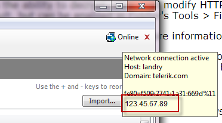
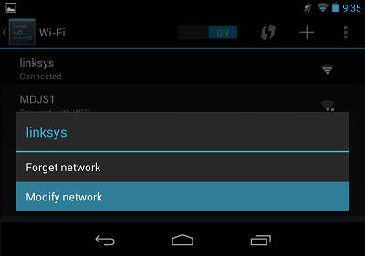
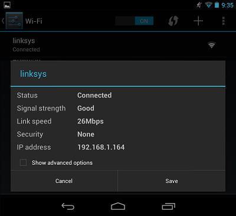
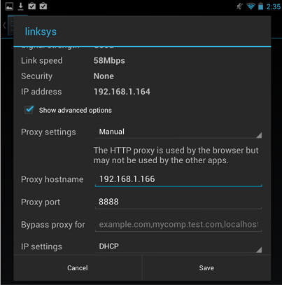
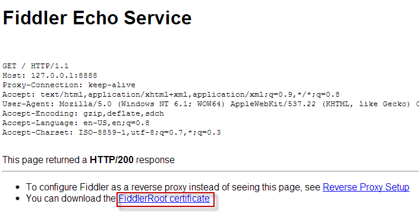
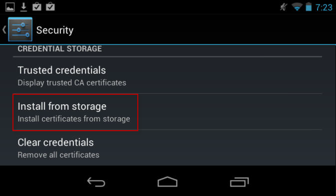

[TOC]

# [手机如何连接Fiddler代理](https://docs.telerik.com/fiddler/Configure-Fiddler/Tasks/ConfigureForAndroid)

## [Configure Fiddler](https://docs.telerik.com/fiddler/Configure-Fiddler/Tasks/ConfigureForAndroid#configure-fiddler)

1. Click **Tools > Fiddler Options > Connections**.
2. Ensure that the checkbox by **Allow remote computers to connect** is checked.
3. If you check the box, restart Fiddler.
4. Hover over the **Online indicator** at the far right of the Fiddler toolbar to display the IP address of the Fiddler server.

## [Configure Device](https://docs.telerik.com/fiddler/Configure-Fiddler/Tasks/ConfigureForAndroid#configure-nexus-device)

1. Swipe down from the top of the screen and tap the **Settings** icon.

2. Tap **Wi-Fi**.

3. Tap and hold your current Wi-Fi network. Select **Modify Network**.
   

4. Tap the **Show advanced options** box.
   

5. Tap the **Proxy settings** dropdown and select **Manual**.
   

6. Type the IP address and port (usually 8888) of the Fiddler server.
   

7. Tap **Save**.

To verify this configuration, go to **http://ipv4.fiddler:8888/**. Chrome should display the **Fiddler Echo Service** webpage, and the traffic should appear in Fiddler.

## [Disable the proxy](https://docs.telerik.com/fiddler/Configure-Fiddler/Tasks/ConfigureForAndroid#disable-the-proxy)

After using Fiddler, return to the **Proxy Settings** screen above and remove the proxy.

## [Decrypt HTTPS](https://docs.telerik.com/fiddler/Configure-Fiddler/Tasks/ConfigureForAndroid#decrypt-https)

1. On the **Fiddler Echo Service Webpage**, click the **FiddlerRoot Certificate** link.
   

2. If the download doesn't open automatically, swipe down from the top and tap the **Settings** icon.

3. Tap **Personal > Security.**

4. Under **Credential Storage**, tap **Install from storage**.
   

5. Tap the **FiddlerRoot.cer** file.

6. (Optional) Type a name for the certificate.

To verify this configuration, tap **Trusted credentials > User**. This should display the Fiddler certificate.
## [Disable HTTPS Decryption](https://docs.telerik.com/fiddler/Configure-Fiddler/Tasks/ConfigureForAndroid#disable-https-decryption)

To delete the FiddlerRoot certificate, tap **Trusted credentials > User** and delete the certificate.

# References

1. [官方网站](https://www.telerik.com/fiddler)

