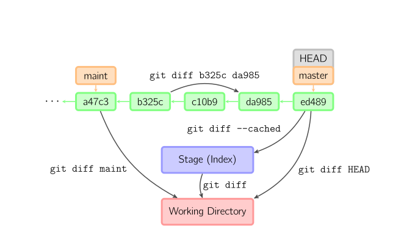
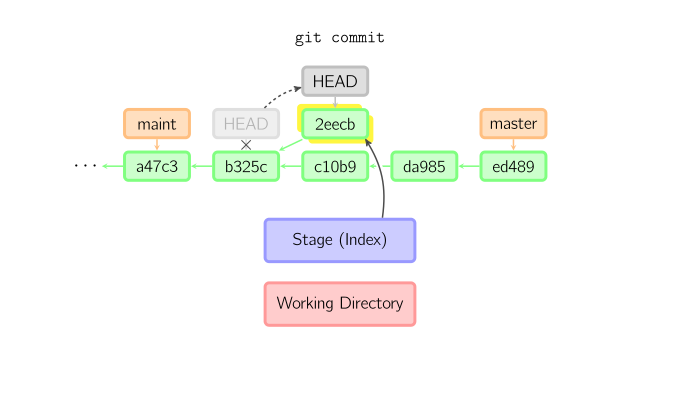

[TOC]

# 1、工作区、暂存区、版本库、远程仓库

## 1.1、各分区的关系

Git本地有四个工作区域：工作目录（Working Directory）、暂存区(Stage/Index)、资源库(Repository或Git Directory)、git仓库(Remote Directory)。

文件在这四个区域之间的转换关系如下：


- **Workspace**： 工作区，就是你平时存放项目代码的地方

- **Index / Stage**： 暂存区，用于临时存放你的改动，事实上它只是一个文件，保存即将提交到文件列表信息

- **Repository**： 仓库区（或版本库），就是安全存放数据的位置，这里面有你提交到所有版本的数据。其中HEAD指向最新放入仓库的版本

- **Remote**： 远程仓库，托管代码的服务器，可以简单的认为是你项目组中的一台电脑用于远程数据交换


git的工作流程一般是这样的：

１、在工作目录中添加、修改文件；

２、将需要进行版本管理的文件放入暂存区域；

３、将暂存区域的文件提交到git仓库。


## 1.2、文件的状态

版本控制就是对文件的版本控制，要对文件进行修改、提交等操作，首先要知道文件当前在什么状态，不然可能会提交了现在还不想提交的文件，或者要提交的文件没提交上。

GIT不关心文件两个版本之间的具体差别，而是关心文件的整体是否有改变，若文件被改变，在添加提交时就生成文件新版本的快照，而判断文件整体是否改变的方法就是用SHA-1算法计算文件的校验和。


- **Untracked:**   未跟踪, 此文件在文件夹中, 但并没有加入到git库, 不参与版本控制. 通过git add 状态变为Staged。

- **Unmodify:**   文件已经入库, 未修改, 即版本库中的文件快照内容与文件夹中完全一致. 这种类型的文件有两种去处, 如果它被修改, 而变为Modified.
  如果使用git rm移出版本库, 则成为Untracked文件。

- **Modified:** 文件已修改, 仅仅是修改, 并没有进行其他的操作. 这个文件也有两个去处, 通过git add可进入暂存staged状态, 使用git checkout 则丢弃修改过, 返回到unmodify状态, 这个git checkout即从库中取出文件, 覆盖当前修改。

- **Staged:** 暂存状态. 执行git commit则将修改同步到库中, 这时库中的文件和本地文件又变为一致, 文件为Unmodify状态. 执行git reset HEAD filename取消暂存, 文件状态为Modified。

 下面的图很好的解释了这四种状态的转变：


# 2、使用技巧

## 2.1、切换difftool

global的配置存在~/.gitconfig中 

mergetool的配置在.gitconfig中修改，如下所示（注意缩进）： 

```properties
[merge]
    tool = bc3

[mergetool "bc3"]
    path = /d/installed/Beyond Compare 3/BCompare.exe
    keepBackup = false
    trustExitCode = false
```

或者使用git config --global --add merge.tool="bc3"来添加


## 2.2、快捷sync & push脚本(免输入当前的branch)

把files目录中的gitpush.sh和gitsync.sh拷贝到git对应的上下文目录中，例如：

- **windows**
      `D:\installed\Git\usr\bin`
- **linux**
      `/home/mine/bin/`

属性`push.type`被用来指示是否不采用gerrit中转提交

- 不配置或者direct

  `git push origin dev`

- gerrit

  `git push origin HEAD:refs/for/dev`

- tfs，可跟参数--force

  `git push --force origin dev:${self_defined_branch}`

尽可能的配置user.name，比如`wei.tang@teddy.dell`，或者`wei.tang@self.iMac#BaoAnHome`


## 2.3、使用alias增强git log输出

shell终端下不能gitk，完全需要用log来查看，新增一个或几个alias快捷命令：
`git config --global alias.slog 'log --color --oneline --decorate'`

- --decorate[=short|full|auto|no]
  Print out the ref names of any commits that are shown. If short is specified, the ref name prefixes refs/heads/, refs/tags/ and refs/remotes/ will not be printed. If full is specified, the full ref name (including prefix) will be printed. If auto is specified, then if the output is going to a terminal, the ref names are shown as if short were given, otherwise no ref names are shown. The default option is short.

- --oneline
  This is a shorthand for "--pretty=oneline --abbrev-commit" used together.

- 查询相关提交人的，模糊匹配
  --author=

- 查询commitlog相关，模糊匹配
  --grep=''

个人常用

`git config --global alias.glog "log --color --oneline --decorate --graph --pretty=format:'%C(red)%h%Creset -%C(yellow)%d%Creset %Cgreen(%cd) %C(bold blue)%an%Creset %s' --date=short"`


## 2.4、解决gitk中文乱码问题

```shell
git config --global --add gui.encoding utf-8
```


## 2.5、全局.gitignore配置`core.excludesfile`

正如 [忽略文件](https://git-scm.com/book/zh/v2/ch00/r_ignoring) 所述，你可以在你的项目的 `.gitignore` 文件里面规定无需纳入 Git 管理的文件的模板，这样它们既不会出现在未跟踪列表，也不会在你运行 `git add` 后被暂存。

不过有些时候，你想要在你所有的版本库中忽略掉某一类文件。 如果你的操作系统是 OS X，很可能就是指 `.DS_Store`。 如果你把 Emacs 或 Vim 作为首选的编辑器，你肯定知道以 `~` 结尾的临时文件。

这个配置允许你设置类似于全局生效的 `.gitignore` 文件。 如果你按照下面的内容创建一个 `~/.gitignore_global` 文件：

```
*~
.DS_Store
```

……然后运行 `git config --global core.excludesfile ~/.gitignore_global`，Git 将把那些文件永远地拒之门外。


## 2.6、[Microsoft Word 进行版本控制](https://www.cnblogs.com/yezuhui/p/6853271.html)

1. Install pandoc.   去http://pandoc.org/installing.html 找到合适的pandoc下载文件，然后下载安装。

2. 编辑 ~/.gitconfig 文件，添加

   ```properties
   [diff "pandoc"]
     textconv=pandoc --to=markdown
     prompt=false
   [alias]
     wdiff = diff --word-diff=color
   ```

   或者使用如下命令：

   ```shell
   git config --global diff.pandoc.textconv="pandoc --to=markdown"
   git config --global diff.pandoc.prompt="false"
   git config --global alias.wdiff="diff --word-diff=color"
   ```

3. 然后在你的工程目录下新建一个 .gitattributes，写入：

   ```properties
   *.docx diff=pandoc
   ```

   如果是doc文件，把docx换成doc应该也是一样的。

## 2.7、创建本地分支后，让远程分支与它关联

```shell
git branch --set-upstream-to=origin/remote_branch  your_branch
```

使用git在本地新建一个分支后，需要做远程分支关联。如果没有关联，git会在下面的操作中提示你显示的添加关联。

关联目的是在执行git pull, git push操作时就不需要指定对应的远程分支，你只要没有显示指定，git pull的时候，就会提示你。


# 3、图解git

## 3.1、基本用法


上面的四条命令在工作目录、暂存目录(也叫做索引)和仓库之间复制文件。

- `git add files` 把当前文件放入暂存区域。
- `git commit` 给暂存区域生成快照并提交。
- `git reset -- files` 用来撤销最后一次`git add files`，你也可以用`git reset` 撤销所有暂存区域文件。
- `git checkout -- files` 把文件从暂存区域复制到工作目录，用来丢弃本地修改。

你可以用 `git reset -p`, `git checkout -p`, or `git add -p`进入交互模式。


也可以跳过暂存区域直接从仓库取出文件或者直接提交代码。如下图所示：


- `git commit -a `相当于运行 `git add` 把所有当前目录下的文件加入暂存区域再运行。`git commit`.
- `git commit files` 进行一次包含最后一次提交加上工作目录中文件快照的提交。并且文件被添加到暂存区域。
- `git checkout HEAD -- files` 回滚到复制最后一次提交。

## 3.2、约定

后文中以下面的形式使用图片：


绿色的5位字符表示提交的ID，分别指向父节点。

分支用橘色显示，分别指向特定的提交。

当前分支由附在其上的*HEAD*标识。 

这张图片里显示最后5次提交，*ed489*是最新提交。 *master*分支指向此次提交，另一个*maint*分支指向祖父提交节点。

## 3.3、命令详解

### 3.3.1、Diff

有许多种方法查看两次提交之间的变动。下面是一些示例：



### 3.3.2、Commit

提交时，git用暂存区域的文件创建一个新的提交，并把此时的节点设为父节点。然后把当前分支指向新的提交节点。

下图中，当前分支是*master*。 在运行命令之前，*master*指向*ed489*，提交后，*master*指向新的节点*f0cec*并以*ed489*作为父节点。


即便当前分支是某次提交的祖父节点，git会同样操作。下图中，在*master*分支的祖父节点*maint*分支进行一次提交，生成了*1800b*。 这样，*maint*分支就不再是*master*分支的祖父节点。此时，[merge](http://marklodato.github.io/visual-git-guide/index-zh-cn.html#merge) (或者 [rebase](http://marklodato.github.io/visual-git-guide/index-zh-cn.html#rebase)) 是必须的。


如果想更改一次提交，使用 `git commit --amend`。git会使用与当前提交相同的父节点进行一次新提交，旧的提交会被取消。


### 3.3.3、Checkout

checkout命令用于从历史提交（或者暂存区域）中拷贝文件到工作目录，也可用于切换分支。

如果不指定branch或某一个提交，则从暂存区域拷贝到工作目录，如[3.1、基本用法](#3.1、基本用法)中有介绍。

以下指令均指定了branch或某一个提交

当给定某个文件名（或者打开-p选项，或者文件名和-p选项同时打开）时，git会从指定的提交中拷贝文件到暂存区域和工作目录。比如，`git checkout HEAD~ foo.c`会将提交节点*HEAD~*(即当前提交节点的父节点)中的`foo.c`复制到工作目录并且加到暂存区域中。（如果命令中没有指定提交节点，则会从暂存区域中拷贝内容。）注意当前分支不会发生变化。


当不指定文件名，而是给出一个（本地）分支时，那么*HEAD*标识会移动到那个分支（也就是说，我们“切换”到那个分支了），然后暂存区域和工作目录中的内容会和*HEAD*对应的提交节点一致。新提交节点（下图中的a47c3）中的所有文件都会被复制（到暂存区域和工作目录中）；只存在于老的提交节点（ed489）中的文件会被删除；不属于上述两者的文件会被忽略，不受影响。


如果既没有指定文件名，也没有指定分支名，而是一个标签、远程分支、SHA-1值或者是像*master~3*类似的东西，就得到一个匿名分支，称作*detached HEAD*（被分离的*HEAD*标识）。这样可以很方便地在历史版本之间互相切换。比如说你想要编译1.6.6.1版本的git，你可以运行`git checkout v1.6.6.1`（这是一个标签，而非分支名），编译，安装，然后切换回另一个分支，比如说`git checkout master`。然而，当提交操作涉及到“分离的HEAD”时，其行为会略有不同。


#### HEAD标识处于分离状态时的提交操作

当*HEAD*处于分离状态（不依附于任一分支）时，提交操作可以正常进行，但是不会更新任何已命名的分支。(你可以认为这是在更新一个匿名分支。)



一旦此后你切换到别的分支，比如说*master*，那么这个提交节点（可能）再也不会被引用到，然后就会被丢弃掉了。注意这个命令之后就不会有东西引用*2eecb*。


但是，如果你想保存这个状态，可以用命令`git checkout -b name`来创建一个新的分支。


### 3.3.4、Reset

reset命令把当前分支指向另一个位置，并且有选择的变动工作目录和索引。也用来在从历史仓库中复制文件到索引，而不动工作目录。

如果不给选项，那么当前分支指向到那个提交。如果用`--hard`选项，那么工作目录也更新，如果用`--soft`选项，那么都不变。


如果没有给出提交点的版本号，那么默认用*HEAD*。这样，分支指向不变，但是索引会回滚到最后一次提交，如果用`--hard`选项，工作目录也同样。


如果给了文件名(或者 `-p`选项), 那么工作效果和带文件名的[checkout](http://marklodato.github.io/visual-git-guide/index-zh-cn.html#checkout)差不多，除了索引被更新。


### 3.3.5、Merge

merge 命令把不同分支合并起来。合并前，索引必须和当前提交相同。如果另一个分支是当前提交的祖父节点，那么合并命令将什么也不做。 另一种情况是如果当前提交是另一个分支的祖父节点，就导致*fast-forward*合并。指向只是简单的移动，并生成一个新的提交。


否则就是一次真正的合并。默认把当前提交(*ed489* 如下所示)和另一个提交(*33104*)以及他们的共同祖父节点(*b325c*)进行一次[三方合并](http://en.wikipedia.org/wiki/Three-way_merge)。结果是先保存当前目录和索引，然后和父节点*33104*一起做一次新提交。


### 3.3.6、Cherry Pick

cherry-pick命令"复制"一个提交节点并在当前分支做一次完全一样的新提交。


### 3.3.7、Rebase

rebase是merge命令的另一种选择。merge把两个父分支合并进行一次提交，提交历史不是线性的。rebase在当前分支上重演另一个分支的历史，提交历史是线性的。 本质上，这是线性化的自动的 [cherry-pick](#3.3.6、Cherry Pick)。


上面的命令都在*topic*分支中进行，而不是*master*分支，在*master*分支上重演，并且把分支指向新的节点。注意旧提交没有被引用，将被回收。

要限制回滚范围，使用`--onto`选项。下面的命令在*master*分支上重演当前分支从*169a6*以来的最近几个提交，即*2c33a*。


同样有`git rebase --interactive`或者`git rebase -i`让你更方便的完成一些复杂操作，比如丢弃、重排、修改、合并提交。没有图片体现这些，细节看这里:[git-rebase(1)](http://www.kernel.org/pub/software/scm/git/docs/git-rebase.html#_interactive_mode)

# 4、Git内部原理揭秘

本文以一个具体例子结合动图介绍了Git的内部原理，包括Git是什么储存我们的代码和变更历史的、更改一个文件时，Git内部是怎么变化的、Git这样实现的有什么好处等等。

视频链接：

https://www.bilibili.com/video/av77252063

PPT 链接：

https://www.lzane.com/slide/git-under-the-hood


## 4.1、Git是怎么储存信息的

这里会用一个简单的例子让大家直观感受一下git是怎么储存信息的。

首先我们先创建两个文件

```shell
$ git init
$ echo '111' > a.txt
$ echo '222' > b.txt
$ git add *.txt
```

Git会将整个数据库储存在`.git/`目录下，如果你此时去查看`.git/objects`目录，你会发现仓库里面多了两个object。

```shell
$ tree .git/objects
.git/objects
├── 58
│   └── c9bdf9d017fcd178dc8c073cbfcbb7ff240d6c
├── c2
│   └── 00906efd24ec5e783bee7f23b5d7c941b0c12c
├── info
└── pack
```

好奇的我们来看一下里面存的是什么东西

```shell
$ cat .git/objects/58/c9bdf9d017fcd178dc8c073cbfcbb7ff240d6c
xKOR0a044K%
```

怎么是一串乱码？这是因为Git将信息压缩成二进制文件。但是不用担心，因为Git也提供了一个能够帮助你探索它的api `git cat-file [-t] [-p]`， `-t`可以查看object的类型，`-p`可以查看object储存的具体内容。

```shell
$ git cat-file -t 58c9
blob
$ git cat-file -p 58c9
111
```

可以发现这个object是一个blob类型的节点，他的内容是111，也就是说这个object储存着a.txt文件的内容。

这里我们遇到第一种Git object，blob类型，它只储存的是一个文件的内容，不包括文件名等其他信息。然后将这些信息经过SHA1哈希算法得到对应的哈希值
58c9bdf9d017fcd178dc8c073cbfcbb7ff240d6c，作为这个object在Git仓库中的唯一身份证。

也就是说，我们此时的Git仓库是这样子的：


我们继续探索，我们创建一个commit。

```shell
$ git commit -am '[+] init'
$ tree .git/objects
.git/objects
├── 0c
│   └── 96bfc59d0f02317d002ebbf8318f46c7e47ab2
├── 4c
│   └── aaa1a9ae0b274fba9e3675f9ef071616e5b209
...
```

我们会发现当我们commit完成之后，Git仓库里面多出来两个object。同样使用`cat-file`命令，我们看看它们分别是什么类型以及具体的内容是什么。

```shell
$ git cat-file -t 4caaa1
tree
$ git cat-file -p 4caaa1
100644 blob 58c9bdf9d017fcd178dc8c0...     a.txt
100644 blob c200906efd24ec5e783bee7...    b.txt
```

这里我们遇到了第二种Git object类型——tree，它将当前的目录结构打了一个快照。从它储存的内容来看可以发现它储存了一个目录结构（类似于文件夹），以及每一个文件（或者子文件夹）的权限、类型、对应的身份证（SHA1值）、以及文件名。

此时的Git仓库是这样的：


```shell
$ git cat-file -t 0c96bf
commit
$ git cat-file -p 0c96bf
tree 4caaa1a9ae0b274fba9e3675f9ef071616e5b209
author lzane 李泽帆  1573302343 +0800
committer lzane 李泽帆  1573302343 +0800
[+] init
```

接着我们发现了第三种Git object类型——commit，它储存的是一个提交的信息，包括对应目录结构的快照tree的哈希值，上一个提交的哈希值（这里由于是第一个提交，所以没有父节点。在一个merge提交中还会出现多个父节点），提交的作者以及提交的具体时间，最后是该提交的信息。

此时我们去看Git仓库是这样的：


到这里我们就知道Git是怎么储存一个提交的信息的了，那有同学就会问，我们平常接触的分支信息储存在哪里呢？

```shell
$ cat .git/HEAD
ref: refs/heads/master

$ cat .git/refs/heads/master
0c96bfc59d0f02317d002ebbf8318f46c7e47ab2
```

在Git仓库里面，HEAD、分支、普通的Tag可以简单的理解成是一个指针，指向对应commit的SHA1值。


其实还有第四种Git object，类型是tag，在添加含附注的tag（`git tag -a`）的时候会新建，这里不详细介绍，有兴趣的朋友按照上文中的方法可以深入探究。

至此我们知道了Git是什么储存一个文件的内容、目录结构、commit信息和分支的。**其本质上是一个key-value的数据库加上默克尔树形成的有向无环图（DAG）**。这里可以蹭一下区块链的热度，区块链的数据结构也使用了默克尔树。（[默克尔树的帖子](https://www.cnblogs.com/fengzhiwu/p/5524324.html)）


## 4.2、Git的三个分区

接下来我们来看一下Git的三个分区（工作目录、Index 索引区域、Git仓库），以及Git变更记录是怎么形成的。了解这三个分区和Git链的内部原理之后可以对Git的众多指令有一个“可视化”的理解，不会再经常搞混。

接着上面的例子，目前的仓库状态如下：


这里有三个区域，他们所储存的信息分别是：

- 工作目录 （ working directory ）：操作系统上的文件，所有代码开发编辑都在这上面完成。
- 索引（ index or staging area ）：可以理解为一个暂存区域，这里面的代码会在下一次commit被提交到Git仓库。
- Git仓库（ git repository ）：由Git object记录着每一次提交的快照，以及链式结构记录的提交变更历史。

我们来看一下更新一个文件的内容这个过程会发生什么事。


运行`echo "333" > a.txt`将a.txt的内容从111修改成333，此时如上图可以看到，此时索引区域和git仓库没有任何变化。


运行`git add a.txt`将a.txt加入到索引区域，此时如上图所示，git在仓库里面新建了一个blob object，储存了新的文件内容。并且更新了索引将a.txt指向了新建的blob object。


运行`git commit -m 'update'`提交这次修改。如上图所示

1. Git首先根据当前的索引生产一个tree object，充当新提交的一个快照。
2. 创建一个新的commit object，将这次commit的信息储存起来，并且parent指向上一个commit，组成一条链记录变更历史。
3. 将master分支的指针移到新的commit结点。

至此我们知道了Git的三个分区分别是什么以及他们的作用，以及历史链是怎么被建立起来的。**基本上Git的大部分指令就是在操作这三个分区以及这条链。**可以尝试的思考一下git的各种命令，试一下你能不能够在上图将它们**“可视化”**出来，这个很重要，建议尝试一下。

## 4.3、一些有趣的问题

有兴趣的同学可以继续阅读，这部分不是文章的主要内容

- 问题1：为什么要把文件的权限和文件名储存在tree object里面而不是blob object呢？

想象一下修改一个文件的命名。

如果将文件名保存在blob里面，那么Git只能多复制一份原始内容形成一个新的blob object。而Git的实现方法只需要创建一个新的tree object将对应的文件名更改成新的即可，原本的blob object可以复用，节约了空间。

- 问题2：每次commit，Git储存的是全新的文件快照还是储存文件的变更部分？

由上面的例子我们可以看到，Git储存的是全新的文件快照，而不是文件的变更记录。也就是说，就算你只是在文件中添加一行，Git也会新建一个全新的blob object。那这样子是不是很浪费空间呢?

这其实是Git在空间和时间上的一个取舍，思考一下你要checkout一个commit，或对比两个commit之间的差异。如果Git储存的是问卷的变更部分，那么为了拿到一个commit的内容，Git都只能从第一个commit开始，然后一直计算变更，直到目标commit，这会花费很长时间。而相反，Git采用的储存全新文件快照的方法能使这个操作变得很快，直接从快照里面拿取内容就行了。

当然，在涉及网络传输或者Git仓库真的体积很大的时候，Git会有垃圾回收机制gc，不仅会清除无用的object，还会把已有的相似object打包压缩。

- 问题3：Git怎么保证历史记录不可篡改？

通过SHA1哈希算法和哈系树来保证。假设你偷偷修改了历史变更记录上一个文件的内容，那么这个问卷的blob object的SHA1哈希值就变了，与之相关的tree object的SHA1也需要改变，commit的SHA1也要变，这个commit之后的所有commit SHA1值也要跟着改变。又由于Git是分布式系统，即所有人都有一份完整历史的Git仓库，所以所有人都能很轻松的发现存在问题。


# References

- [官方网站](https://git-scm.com/)
- [图解git](http://marklodato.github.io/visual-git-guide/index-zh-cn.html)
- [Git内部原理揭秘](https://mp.weixin.qq.com/s/UQKrAR3zsdTRz8nFiLk2uQ)
- [Scott Chacon, Ben Straub - Pro Git-Apress (2014)](https://git-scm.com/book/en/v1) 免费，有兴趣继续深入的同学推荐阅读这本书
- [Jon Loeliger, Matthew  McCullough - Version Control with Git, 2nd Edition - O'Reilly Media (2012)](https://www.amazon.com/Version-Control-Git-collaborative-development/dp/1449316387/ref=sr_1_1?keywords=Version+Control+with+Git&qid=1573794832&sr=8-1) 作为上面那本书的补充