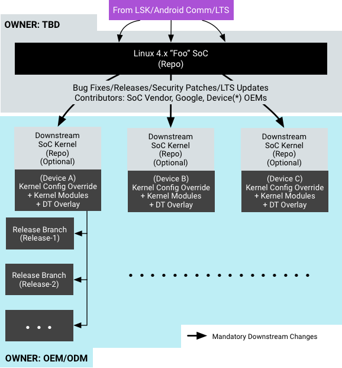

# Android 架构

Android 系统架构包含以下组件：


**图 1.** Android 系统架构

- **应用框架**。应用框架最常被应用开发者使用。作为硬件开发者，您应该非常了解开发者 API，因为很多此类 API 都可以直接映射到底层 HAL 接口，并可提供与实现驱动程序相关的实用信息。
- **Binder IPC**。Binder 进程间通信 (IPC) 机制允许应用框架跨越进程边界并调用 Android 系统服务代码，这使得高级框架 API 能与 Android 系统服务进行交互。在应用框架级别，开发者无法看到此类通信的过程，但一切似乎都在“按部就班地运行”。
- **系统服务**。系统服务是专注于特定功能的模块化组件，例如窗口管理器、搜索服务或通知管理器。 应用框架 API 所提供的功能可与系统服务通信，以访问底层硬件。Android 包含两组服务：“系统”（诸如窗口管理器和通知管理器之类的服务）和“媒体”（与播放和录制媒体相关的服务）。
- **硬件抽象层 (HAL)**。HAL 可定义一个标准接口以供硬件供应商实现，这可让 Android 忽略较低级别的驱动程序实现。借助 HAL，您可以顺利实现相关功能，而不会影响或更改更高级别的系统。HAL 实现会被封装成模块，并会由 Android 系统适时地加载。有关详情，请参阅[硬件抽象层 (HAL)](https://source.android.google.cn/devices/architecture/hal.html) 一文。
- **Linux 内核**。开发设备驱动程序与开发典型的 Linux 设备驱动程序类似。Android 使用的 Linux 内核版本包含几个特殊的补充功能，例如：Low Memory Killer（一种内存管理系统，可更主动地保留内存）、唤醒锁定（一种 [`PowerManager`](https://developer.android.google.cn/reference/android/os/PowerManager.html) 系统服务）、Binder IPC 驱动程序以及对移动嵌入式平台来说非常重要的其他功能。这些补充功能主要用于增强系统功能，不会影响驱动程序开发。您可以使用任意版本的内核，只要它支持所需功能（如 Binder 驱动程序）即可。不过，我们建议您使用 Android 内核的最新版本。有关详情，请参阅[编译内核](https://source.android.google.cn/setup/building-kernels.html)一文。

## HAL 接口定义语言 (HIDL)

Android 8.0 重新设计了 Android 操作系统框架（在一个名为“Treble”的项目中），以便让制造商能够以更低的成本更轻松、更快速地将设备更新到新版 Android 系统。在这种新架构中，HAL 接口定义语言（HIDL，发音为“hide-l”）指定了 HAL 和其用户之间的接口，让用户能够替换 Android 框架，而无需重新编译 HAL。

**注意**：如需详细了解 Treble 项目，请参阅开发者博文 [Treble 现已推出：Android 的模块化基础](https://android-developers.googleblog.com/2017/05/here-comes-treble-modular-base-for.html)和[借助 Treble 项目更快速地采用新系统](https://android-developers.googleblog.com/2018/05/faster-adoption-with-project-treble.html)。

利用新的供应商接口，HIDL 将供应商实现（由芯片制造商编写的设备专属底层软件）与 Android 操作系统框架分离开来。供应商或 SOC 制造商编译一次 HAL，并将其放置在设备的 `/vendor` 分区中；框架可以在自己的分区中通过[无线下载 (OTA) 更新](https://source.android.google.cn/devices/tech/ota/)进行替换，而无需重新编译 HAL。

旧版 Android 架构与当前基于 HIDL 的架构的区别在于对供应商接口的使用：

- Android 7.x 及更早版本中没有正式的供应商接口，因此设备制造商必须更新大量 Android 代码才能将设备更新到新版 Android 系统：

  **图 2.** 旧版 Android 更新环境

- Android 8.0 及更高版本提供了一个稳定的新供应商接口，因此设备制造商可以访问 Android 代码中特定于硬件的部分，这样一来，设备制造商只需更新 Android 操作系统框架，即可跳过芯片制造商直接提供新的 Android 版本：

  **图 3.** 当前 Android 更新环境

所有搭载 Android 8.0 及更高版本的新设备都可以利用这种新架构。为了确保供应商实现的向前兼容性，供应商接口会由[供应商测试套件 (VTS)](https://source.android.google.cn/devices/tech/vts/index.html) 进行验证，该套件类似于[兼容性测试套件 (CTS)](https://source.android.google.cn/compatibility/cts/)。您可以使用 VTS 在旧版 Android 架构和当前 Android 架构中自动执行 HAL 和操作系统内核测试。

## 架构资源

要详细了解 Android 架构，请参阅以下部分：

- [HAL 类型](https://source.android.google.cn/devices/architecture/hal-types.html)：提供了关于绑定式 HAL、直通 HAL、Same-Process (SP) HAL 和旧版 HAL 的说明。
- [HIDL（一般信息）](https://source.android.google.cn/devices/architecture/hidl/index.html)：包含与 HAL 和其用户之间的接口有关的一般信息。
- [HIDL (C++)](https://source.android.google.cn/devices/architecture/hidl-cpp/index.html)：包含关于为 HIDL 接口创建 C++ 实现的详情。
- [HIDL (Java)](https://source.android.google.cn/devices/architecture/hidl-java/index.html)：包含关于 HIDL 接口的 Java 前端的详情。
- [ConfigStore HAL](https://source.android.google.cn/devices/architecture/configstore/index.html)：提供了关于可供访问用于配置 Android 框架的只读配置项的 API 的说明。
- [设备树叠加层](https://source.android.google.cn/devices/architecture/dto/index.html)：提供了关于在 Android 中使用设备树叠加层 (DTO) 的详情。
- [供应商原生开发套件 (VNDK)](https://source.android.google.cn/devices/architecture/vndk/index.html)：提供了关于一组可供实现供应商 HAL 的供应商专用库的说明。
- [供应商接口对象 (VINTF)](https://source.android.google.cn/devices/architecture/vintf/index.html)：提供了关于收集设备的相关信息并通过可查询 API 提供这些信息的对象的说明。
- [SELinux for Android 8.0](https://source.android.google.cn/security/selinux/images/SELinux_Treble.pdf)：提供了关于 SELinux 变更和自定义的详情。


# 模块化系统组件

## 概览

Android 10 对某些 Android 系统组件进行了模块化处理，使其能够在正常的 Android 发布周期之外进行更新。最终用户设备可以从 Google Play 商店基础架构或通过合作伙伴提供的无线下载 (OTA) 机制接收这些模块化系统组件的更新。

### 关于模块化系统组件

利用模块化系统组件，Google 和 Android 合作伙伴能够以非侵入方式广泛、快速、无缝地向最终用户设备分发更新。例如，媒体编解码器碎片和严重错可能会显著降低应用的采用率和用户互动度。频繁更新媒体相关模块可以减少编解码器碎片，以使媒体应用在不同 Android 设备上的行为更加一致，并且可以修复严重错误，以建立用户信任。

### 架构

Android 10 会将选定的系统组件转换为模块，其中一些模块采用 [APEX 容器格式](https://source.android.google.cn/devices/tech/ota/apex)（在 Android 10 中引入），另一些则采用 APK 格式。借助模块化架构，系统组件能够根据需要以修复严重问题以及做出其他改进的方式进行更新，而不会影响较低级别的供应商实现或较高级别的应用和服务。

**图 1.** 模块化系统组件

模块更新不会引入新的 API。它们仅使用由[兼容性测试套件 (CTS)](https://source.android.google.cn/compatibility/tests) 保证的 SDK 和系统 API，并且只会彼此之间进行通信，且只使用稳定的 C API 或[稳定的 AIDL 接口](https://source.android.google.cn/devices/bootloader/stable-aidl)。

您可以将更新后的模块化系统组件打包在一起，并通过 Google（使用 Google Play 商店基础架构）或 Android 合作伙伴（使用合作伙伴提供的 OTA 机制）将其推送到最终用户设备。模块软件包会以原子方式安装（和回滚），这意味着所有需要更新的模块都会进行更新，或者所有模块都不会进行更新。例如，如果某个需要更新的模块出于某种原因无法更新，则设备不会安装软件包中的任何模块。

### 可用模块

Android 10 包含以下模块。

| 模块名称                                                     | 软件包名称                                | 类型 |
| :----------------------------------------------------------- | :---------------------------------------- | :--- |
| [Runtime](https://source.android.google.cn/devices/architecture/modular-system/runtime) | com.android.runtime.release.apex          | APEX |
| [Captive Portal Login](https://source.android.google.cn/devices/architecture/modular-system/networking) | com.android.captiveportallogin            | APK  |
| [Conscrypt](https://source.android.google.cn/devices/architecture/modular-system/conscrypt) | com.android.conscrypt                     | APEX |
| [DNS Resolver](https://source.android.google.cn/devices/architecture/modular-system/dns-resolver) | com.android.resolv                        | APEX |
| [DocumentsUI](https://source.android.google.cn/devices/architecture/modular-system/documentsui) | com.android.documentsui                   | APK  |
| [ExtServices](https://source.android.google.cn/devices/architecture/modular-system/extservices) | com.android.ext.services                  | APK  |
| [Media Codecs](https://source.android.google.cn/devices/architecture/modular-system/media) | com.android.media.swcodec                 | APEX |
| [Media Extractors and MediaPlayer2](https://source.android.google.cn/devices/architecture/modular-system/media) | com.android.media                         | APEX |
| [ModuleMetadata](https://source.android.google.cn/devices/architecture/modular-system/metadata) | com.android.modulemetadata                | APK  |
| [Network Stack Permission Configuration](https://source.android.google.cn/devices/architecture/modular-system/networking) | com.android.networkstack.permissionconfig | APK  |
| [Network Components](https://source.android.google.cn/devices/architecture/modular-system/networking) | com.android.networkstack                  | APK  |
| [PermissionController](https://source.android.google.cn/devices/architecture/modular-system/permissioncontroller) | com.android.permissioncontroller          | APK  |
| [Time Zone Data](https://source.android.google.cn/devices/architecture/modular-system/timezone) | com.android.tzdata                        | APEX |


## 运行时

运行时模块 (`com.android.runtime.release.apex`) 是用于原生和托管式 Android 运行时的 APEX 模块。该模块包含以下组件：

- ART
- Bionic
- 托管核心库（Android 10 中的新组件）
- ICU 库
- `libnativebridge`
- `libnativehelper`
- `libnativeloader`

运行时模块在编译 Android 时生成，包含其组成项目的编译工件。它与 [Conscrypt 模块](https://source.android.google.cn/devices/architecture/modular-system/conscrypt) (`com.android.conscrypt.apex`) 以及[时区数据模块](https://source.android.google.cn/devices/architecture/modular-system/timezone) (`com.android.tzdata.apex`) 紧密相关，后者也是 Android 10 中的新模块。

**注意**：Android 10 中的运行时模块不可更新。

### Android Runtime (ART) 方面的变更

在 Android 10 中，ART 编译系统以两种变体形式创建运行时模块，分别为发布和调试（包含更多诊断和调试工具）。发布版本安装在 `user` 编译版本上，调试版本安装在 `userdebug` 和 `eng` 编译版本上。当设备启动时，`apexd` 会将运行时模块装载到 `/apex/com.android.runtime` 下。

在该模块中，启动类路径拆分为托管核心库等类、其他模块（例如 Conscrypt 和媒体）中的类以及系统分区（例如 `framework.jar`）中的类。如果更新了模块，dex2oat 会以 JIT 方式编译模块中的启动类。

Android 10 包含 API 方面的以下变更：

- 新增了一个用于支持 DEX 文件的 API，可在系统代码（例如堆栈展开程序）和 ART 之间提供稳定的接口。
- 新增了一个 API，作为 ART 专用平台抽象层 (PAL) 与系统配合使用。系统元素 (`libartpalette-system.so`) 提供了 ART 所依赖的系统功能，并且可通过客户端库 (`libartpalette.so`) 进行访问；该客户端库可加载设备上安装的系统库。

Android 10 还重构了一些 ART 二进制文件的路径，并将以下二进制文件从 `/system/bin` 移到了运行时模块中：`dalvikvm`、`dalvikvm32`、`dalvikvm64`、`dex2oat`、`dexdiag`、`dexdump`、`dexlist`、`dexoptanalyzer`、`oatdump` 和 `profman`。为了确保兼容性，重构涵盖 `/system/bin` 中的符号链接。

### Bionic 方面的变更

`libc` 的 `tzcode` 使用由运行时模块 (`/apex/com.android.runtime/etc/tz/`) 和时区数据模块 (`/apex/com.android.tzdata/etc/tz/`) 提供的时区数据。 `tzcode` 会优先采用[基于 APK 的时区更新](https://source.android.google.cn/devices/tech/config/timezone-rules)中的数据，然后再采用基于 APEX 的时区更新中的数据（由时区数据模块提供），最后会回退到 `/system` 数据。

`libc` 使用新库 (`libandroidicu`)，而不是 `libicuuc`/`libicui18n`。如需了解详情，请参阅[托管核心库](https://source.android.google.cn/devices/architecture/modular-system/runtime#managed-core-library)。

最后，Bionic 共享库和动态链接器路径现在是符号链接（同样适用于 64 位变体）。具体而言，变更情况如下：

- `/system/lib/libc.so` -> `/apex/com.android.runtime/lib/bionic/libc.so`
- `/system/lib/libm.so` -> `/apex/com.android.runtime/lib/bionic/libm.so`
- `/system/lib/libdl.so` -> `/apex/com.android.runtime/lib/bionic/libdl.so`
- `/system/bin/linker` -> `/apex/com.android.runtime/bin/linker`

### 启动序列方面的变更

为了支持运行时模块，Android 10 的启动序列更新如下：

1. `init` 准备引导程序和默认的[装载命名空间](http://man7.org/linux/man-pages/man7/mount_namespaces.7.html)。`tmpfs` 装载在 `/apex` 上，装载点的传播类型设置为 `private`。
2. `apexd` 在其他任何进程之前以引导程序模式启动。它会激活 `/system/apex` 中的 APEX 文件，并将它们装载到引导程序装载命名空间中。
3. 其他预 `apexd` 进程启动。这些进程位于引导程序装载命名空间中，并随系统 APEX 文件中的库一起提供。
4. `/data` 执行装载。`init` 切换到默认的装载命名空间，并将 `apexd` 作为守护进程启动。
5. `apexd` 扫描 /`data/apex` 和 `/system/apex`，并激活这些目录中最新的 APEX 文件。在此阶段激活的 APEX 文件只能装载在默认命名空间，对预 `apexd` 进程不可见。

### 托管核心库

托管核心库是可更新的低层级托管式（由 Android Runtime 执行 `dex`）代码的集合，以前称为 libcore。在 Android 10 中，托管核心库包含多个 Git 项目（含 `platform/libcore/`），这一新术语指的是代码的集合。

托管核心库由运行时、时区数据和 Conscrypt 模块提供，并依赖于运行时模块中存在的原生库，例如 `libjavacore` 和 `libandroidicu`。收集到的代码来自多个 Git 项目，例如 `libcore`、`apache-xml`、`boringssl`、`bouncycastle`、`conscrypt`、`expat`、`fdlibm`、`icu`、`okhttp`、`ziparchive` 和 `zlib`。该库在启动类路径上的多个 `.jar` 文件（例如 `core-oj.jar`、`core-libart.jar`、`conscrypt.jar`、`okhttp.jar`、`bouncycastle.jar` 和 `apache-xml.jar`）之间进行拆分；但是，其中并不包括 `framework.jar` 和 `ext.jar` 文件。

#### 组件重新打包

Android 10 重新打包了以前使用字节码处理工具在 `android.*` 和 `com.android.*` 下打包的几个组件（`bouncycastle/`、`conscrypt/` 和 `okhttp/`）。这些组件使用源代码转换重新打包，从而使 Java 注释能够用于 API 元数据。

**注意**：`icu/` 也已在先前的 Android 版本中进行了重新打包和转换。

#### Core Platform API

Core Platform API 提供了一个稳定的托管代码 API 供 Android 框架使用，它可确保系统能够清楚地了解所有框架依赖项并因而能够对托管核心库进行更新。Core Platform API 具有以下功能：

- 指示包括公共 SDK API 在内的依赖项。如需了解 API 相关的内容，请参阅 `libcore/mmodules/core_platform_api/`。
- 明确标注托管代码（使用 `@libcore.api.CorePlatformApi`）。对于 l`ibcore/ojluni/src/` 中的代码，请参阅 `libcore/ojluni/annotations/mmodule/` 中的注释；对于所有其他项目，请参阅主源代码文件。

编译系统在编译 Java 源代码平台目标（即 `.bp` 文件中缺少 `"sdk_version:"` 或者 `.mk` 文件中缺少 `"LOCAL_SDK_VERSION="`）时默认使用 Core Platform API。此默认行为可确保 Android 框架代码只能使用公共 API 和 Core Platform API（无实现类）。其他 `sdk_version` 值（例如 `"core_current"` 和 `"current"`）将正常工作（它们仅允许使用公共 SDK API）。编译系统还会报告对 Core Platform API 界面的更改，并防止目标（少数例外情况除外）依赖于托管核心库内部构件。

运行时模块对 Core Platform API 涵盖的字段和方法执行访问权限检查。当平台代码访问 Core Platform API 中的方法时，模块将执行检查。系统属性 `persist.debug.dalvik.vm.core_platform_api_policy` 用于控制这些检查所遵循的政策。有效的政策值为 `enabled`、`disabled` 和 `just-warn`。对于 debug 和 eng 编译版本，标准政策为 `just-warn`，用于在检测到违反政策的情况时记录一条警告。对于 user 编译版本，默认政策为 `disabled`，并且不执行任何操作。当原生代码通过 Java 原生接口 (JNI) 解析字段和方法时，运行时模块也会执行 Core Platform API 检查。

Android 10 还进行了大量更改，用于简化 Android 框架与托管核心库之间的 API、运行时依赖项以及编译时依赖项。

Android 10 重新打包了 `com.android.org.kxml2` 下的 `org.kxml2` 解析器。

#### 原生库

Android 10 重构了支持托管核心库的原生库。之前与平台的其他部分共用的几个动态链接库（如 `libcrypto`、`libexpat` 和 `zlib`）现在已进行复制，这样，运行时模块得以将自己的副本加载到运行时链接器命名空间中。运行时模块提供的动态链接原生库位于 `/apex/com.android.runtime/{lib,lib64}`。

#### ICU 库

运行时模块包含 ICU 库（ICU4C 和 ICU4J）及关联数据。

Android 10 包括 `libandroidicu`，这是一个新的动态库，可以为框架代码提供部分 ICU4C 函数。`libandroidicu` 的链接器符号在 ICU 版本间是固定的（该符号以 `_android` 结尾，而不是以 `libicuuc` 和 `libicui18n` 中使用的 `_icu-version-number` 结尾）。不过，为了确保应用兼容性，`libicuuc` 和 `libicui18n` 符号仍然可用。同样，为了确保应用兼容性，链接器还会在 dlopen() 调用中将绝对路径重定向到 ICU 库，例如，`dlopen("/system/lib/libicuuc.so", ...)` 和 `dlopen("/system/lib/libicui18n.so", ...)` 会重定向到 `/apex/com.android.runtime/lib/` 中相应的库（如果应用符合 `targetSdkVersion < 29` 这一情况）。

在运行时，ICU 数据文件将安装到 `/apex/com.android.runtime/etc/icu/`。为了确保应用兼容性，Android 10 还包含从之前的 ICU 数据文件位置 (`/system/usr/icu/`) 到 `/apex/com.android.runtime/etc/icu` 的符号链接。

#### Conscrypt 交互

Android 10 将 Conscrypt（逻辑上是托管核心库的一部分）移到了其自身[可独立更新的 APEX 模块](https://source.android.google.cn/devices/architecture/modular-system/conscrypt)中。在 Conscrypt 和运行时模块之间，除了公共 SDK API 之外，还有一个新的双向 API 界面可表示依赖项（如需了解详情，请参阅 `libcore/mmodules/intracoreapi/`）。API 元素使用 `@libcore.api.IntraCoreApi` 明确标注。

编译系统会验证 Conscrypt 代码是否只能使用公共 API 和核心内 API。Conscrypt 上的其他托管核心库依赖项基于反射；编译系统会尽可能记录此类依赖项，并向 API 界面报告所有更改。

#### 时区数据交互

在 Android 10 中，架构 libcore、运行时 libcore 和 ICU4J/ICU4C 使用由运行时模块 (`/apex/com.android.runtime/etc/tz/`) 以及时区数据模块 (`/apex/com.android.tzdata/etc/tz/`) 提供的时区数据。此类库具有以下特点：

- 回退到 `/system` 数据。
- 优先处理[基于 APK 的时区更新](https://source.android.google.cn/devices/tech/config/timezone-rules)中的数据，然后再处理基于 APEX 的时区更新中的数据（由[时区数据模块](https://source.android.google.cn/devices/architecture/modular-system/timezone)提供）。

#### 其他方面的变更

Android 10 将 `AsynchronousCloseMonitor` API 从 `libnativehelper.so` 移到了 `libandroidio.so`。该 API 由 `AsynchronousCloseMonitor.h` 提供。

### libnativebridge 方面的变更

Android 10 将 `libnativebridge` 库移到了运行时模块，因为此库与运行时模块中的 `libnativeloader` 库和 Bionic C 库紧密关联。

### libnativehelper 方面的变更

在 Android 10 中，运行时模块使 `libnativehelper` 可用于系统和框架代码，而运行时模块之外的代码则链接到 `libnativehelper` 的存根 API（仅限 C）。`libnativehelper` 库进行了如下变更：

- 减少了缓存的 JNI 类、方法和字段。
- 改进了 `platform_include/jni_macros.h` 中的 JNI 宏。
- 新增了一些 JNI 帮助程序方法，用于访问原生代码中的 `java.nio.Buffer` 类的内部构件（请参阅 `libnativehelper/include/nativehelper/JNIHelp.h` 中名称以 `jniGetNio` 开头的方法）。框架代码也会使用这些方法。

### libnativeloader 方面的变更

在 Android 10 中，运行时模块包含 `libnativeloader` 库，该库负责为 Java 类加载器创建链接器命名空间。链接器命名空间适用于以托管代码编写的 Android 应用所加载的原生库。该库与同样位于运行时模块中的 Bionic 链接器紧密关联。

### libpac 方面的变更

Android 10 将可为 PacProcessor 提供 C API 的 `libpac` 移到了运行时模块中。`libpac` 库包含一个完整的 V8 JavaScript 引擎，只能由 PacProcessor（一个独立的软件包和进程）使用。

### 链接器配置方面的变更

在 Android 10 中，[链接器命名空间](https://source.android.google.cn/devices/architecture/vndk/linker-namespace)用于将运行时模块中的内部动态原生库依赖项与平台和其他 APEX 模块分开。`runtime` 链接器命名空间是为运行时模块库设置的，并在外部依赖项的其他命名空间之间提供了适当的链接。

对于 `/vendor` 和 `/system` 中的二进制文件，链接器配置位于 `/system/etc/ld.config.txt`；对于运行时模块本身中的二进制文件 (`/apex/com.android.runtime/bin`)，链接器配置位于 `/apex/com.android.runtime/etc/ld.config.txt`。

### SystemServer 和框架方面的变更

在 Android 10 中，SystemServer 托管了一项新的 RuntimeService，用于报告来自运行时模块的信息。要查看这些信息，请使用以下 ADB 命令：

```
adb shell dumpsys runtimeinfo
```

RuntimeService 管理的信息是可扩展的。如需了解服务源代码，请参阅 `frameworks/base/services/core/java/com/android/server/RuntimeService.java`；如需查看客户端代码示例，请参阅 `libcore/luni/src/main/java/libcore/util/CoreLibraryDebug.java`。

Android 10 还更新了无线下载 (OTA) 更新流程，以使用运行时模块中的 `dex2oat` 和其他工具。


## Conscrypt

Conscrypt 模块可以加速实现安全改进并提高设备安全性，而无需依赖于 OTA 更新。它使用 Java 代码和原生库来提供 Android TLS 实现以及大部分 Android 加密功能（例如密钥生成器、加密方式和消息摘要）。Conscrypt 作为[开源库](https://github.com/google/conscrypt)提供，但在包含在 Android 平台中时具有一些特化。

Conscrypt 模块使用 [BoringSSL](https://boringssl.googlesource.com/boringssl/)，后者是 Google 在 OpenSSL 基础上派生出的一个原生库，在很多 Google 产品（最值得注意的是 Google Chrome）中用于加密和 TLS。BoringSSL 没有正式版本（所有用户都需要从头构建），并且无法保证 API 或 ABI 稳定性。

### Android 10 中的变化

Android 9 不包含用于 Conscrypt 的 Android 专有公共 API，而是使用一种安全提供程序。该安全提供程序为 Java 加密架构 (JCA)（包括加密方式和消息摘要）和 Java 安全套接字扩展 (JSSE)（包括 SLSocket 和 SSLEngine）实现了标准类。用户与这些类互动，`libcore` 和框架代码使用了一些非公开的 Conscrypt API。

Android 10 在 `android.net.ssl` 中添加了少量公共 API 方法，以便用户访问 `javax.net.ssl` 下的类未公开的 Conscrypt 功能。此外，Android 10 还包含精简版的 [Bouncy Castle](https://en.wikipedia.org/wiki/Bouncy_Castle_(cryptography))，后者作为 Android Runtime 的一部分提供不太热门的加密工具（未包含在 Conscrypt 模块中）。

### 格式和依赖项

Conscrypt 模块作为 [APEX](https://source.android.google.cn/devices/tech/ota/apex) 文件进行分发，该文件中包含 Conscrypt Java 代码以及动态链接到 Android NDK 库（例如 `liblog`）的 Conscrypt 原生库。原生库还包含拥有 AArch64 [加密算法验证计划 (CAVP)](https://csrc.nist.gov/projects/cryptographic-algorithm-validation-program) 证书的 BoringSSL 的副本。该副本与[认证测量及验证专家 (CMVP)](https://www.aeecenter.org/certifications/certifications/certified-measurement-verification-professional) 证书**不**兼容。

**注意**：Conscrypt 模块包含 [/external/conscrypt](https://android.googlesource.com/platform/external/conscrypt/) 和 [/external/boringssl](https://android.googlesource.com/platform/external/boringssl/)，但不包含 `/external/bouncycastle`。

Conscrypt 模块公开以下 API：

- **公共 API** 是软件包（位于 `java.*` 和 `javax.*`）中的类和接口以及 `android.net.ssl.*` 下的类的扩展。外部应用代码无法直接调用 Conscrypt。平台 API 标准确保这些 API 保持向后和向前兼容性。
- **核心平台 API** 是框架访问非公开功能时使用的隐藏 API。这些 API 相对有限；最大的用户是 `NetworkSecurityConfig`，它扩展 Conscrypt 信任管理器（用于验证证书的组件）来实现[网络安全配置功能](https://developer.android.google.cn/training/articles/security-config)。
- **核心内 API** 仅限于由 JCA 和 JSEE 机制反射调用的零参数构造函数使用。


## DNS 解析器

DNS 解析器模块针对 DNS 拦截和配置更新攻击提供用户保护，并且改进了 DNS 解析的网络性能。此模块包含用于实现 DNS 存根解析器的代码，该解析器可将 **www.google.com** 等名称转换为 IP 地址（例如 **2001:db8::1**）。DNS 存根解析器支持 Java API 元素（如 [InetAddress#getAllByName](https://developer.android.google.cn/reference/java/net/InetAddress#getAllByName(java.lang.String)) 和 [Network#getAllByName](https://developer.android.google.cn/reference/android/net/Network#getAllByName(java.lang.String))）以及[原生网络功能](https://developer.android.google.cn/ndk/reference/group/networking)，且可发送和接收 DNS 查询以及缓存结果。

### Android 10 中的变化

在搭载 Android 9 及更低版本的设备上，DNS 解析器代码分布在 Bionic 和 `netd` 中。DNS 查找集中在 `netd` 守护进程中，以便进行系统级缓存，而应用在 Bionic 中调用函数（例如 `getaddrinfo`）。查询通过 UNIX 套接字发送到 `/dev/socket/dnsproxyd`，再到 `netd` 守护进程，该守护进程会解析请求并再次调用 `getaddrinfo`，以发出 DNS 查找，然后它会缓存结果以便其他应用可以使用它们。DNS 解析器实现主要包含在 `bionic/libc/dns/` 中，部分包含在 `system/netd/server/dns` 中。

Android 10 将 DNS 解析器代码移至 `system/netd/resolv,`将其转换为 C++，然后对代码进行翻新和重构。由于应用兼容性方面的原因，Bionic 中的代码继续存在，但系统不会再调用它们。以下源文件路径受到重构的影响：

- `bionic/libc/dns`
- `system/netd/client`
- `system/netd/server/dns`
- `system/netd/server/DnsProxyListener.*`
- `system/netd/resolv`

### 格式和依赖项

DNS 解析器模块以 [APEX](https://source.android.google.cn/devices/tech/ota/apex) 文件的形式提供，并由 `netd` 动态链接；但是，`netd` **不是**依赖项，因为模块直接提供本地套接字 `/dev/socket/dnsproxyd`。解析器配置的 Binder 端点从 `netd` 移至解析器，这意味着系统服务可以直接调用解析器模块（无需通过 `netd`）。

DNS 解析器模块依赖 `libc` (Bionic) 并静态链接其依赖项；不需要使用其他库。


## DocumentsUI

DocumentsUI 模块控制对处理文档权限（例如将文件附加到电子邮件）之组件的特定文件的访问权限。将存储访问权和权限加入可更新模块有助于更好地保障最终用户的隐私和安全，同时使 Android 合作伙伴能够通过运行时资源叠加层 (RRO) 自定义应用的功能和主题。这种模块格式确保所有设备都能提供相同的 DocumentsUI 体验，从而使开发者能够了解用户看到相关 API 的哪些部分。

### Android 10 中的变化

在 Android 10 中，DocumentsUI 模块实现了 `GET_CONTENT` 操作，该操作使应用能够请求访问用户的其他数据。作为可更新模块，DocumentsUI：

- 仅通过稳定的 `@SystemApi` API（不使用 `@hide` API）与框架进行互动。
- 提供了一种机制，使 Android 合作伙伴能够自定义功能和主题。
- 使用签名权限保护 `MANAGE_DOCUMENTS` 权限。

### 格式和依赖项

DocumentsUI 模块作为 APK 文件提供。它依赖于签名权限保护的 `MANAGE_DOCUMENTS` 权限，同时另一个权限类可确保设备上只有一个应用具有 `MANAGE_DOCUMENTS` 权限。


## ExtServices

ExtServices 模块更新了框架组件，例如存储、自动填充、通知助手以及其他持续运行的服务。该模块与 DocumentsUI 以及 PermissionController 一起，确保最终用户获得一致的权限界面，同时启用迭代以响应不断变化的隐私环境和政府法规。

### Android 10 中的变化

`com.android.ext.services` APK 包含以下服务：

- [`AutofillFieldClassificationService`](https://android.googlesource.com/platform/frameworks/base/+/master/core/java/android/service/autofill/AutofillFieldClassificationService.java)
- [`NotificationAssistantService`](https://android.googlesource.com/platform/frameworks/base/+/master/core/java/android/service/notification/NotificationAssistantService.java)
- [`ResolverRankerService`](https://android.googlesource.com/platform/frameworks/base/+/master/core/java/android/service/resolver/ResolverRankerService.java)
- [`CacheQuotaService`](https://android.googlesource.com/platform/frameworks/base/+/master/core/java/android/app/usage/CacheQuotaService.java)

### 格式和依赖项

ExtServices 模块作为 APK 文件提供。


## 媒体

媒体模块提供安全更新和媒体功能更新，无需完整的系统映像更新。媒体组件是常见的攻击目标（很多最近发现的安全漏洞都与媒体相关），因此通过加速安全漏洞和功能的更新来加强安全性应该会减少可被攻击利用的安全漏洞的数量。媒体框架仍然可扩展；合作伙伴可以继续扩展媒体编解码器和媒体格式提取器。

如需详细了解媒体模块，请参阅[可更新的媒体组件](https://source.android.google.cn/devices/media/updatable-media)。


## ModuleMetadata

ModuleMetadata 模块包含指定设备上模块列表的元数据。系统会在系统服务器启动后立即解析并缓存这类元数据。

### Android 10 中的变化

ModuleMetadata APK 包含用于实现 [`PackageManager`](https://developer.android.google.cn/reference/android/content/pm/PackageManager) API 中 `getModuleInfo` 和 `getInstalledModules` 方法的 `ModuleInfoProvider`。这些方法由从模块元数据提供商软件包解析的 XML元数据提供支持。模块元数据软件包的软件包名称存储在 `config_defaultModuleMetadataProvider` 配置值中。

模块元数据提供商必须包含其 `` 标记的 `` 条目。元数据条目必须包含单个密钥 (`android.content.pm.MODULE_METADATA`)，该密钥的值是对 XML 资源的引用，后者包含指定设备上模块列表的元数据。

### 格式和依赖项

ModuleMetadata 模块作为 APK 文件提供。在 XML 文档中，元数据包含一个顶级 `` 元素（具有一个或多个子项）。每个子项都是一个 `` 元素，包含以下属性：

- `name` 是对用户可见的软件包名称的资源引用。映射到 `ModuleInfo#getName`。
- `packageName` 是模块的软件包名称。映射到 `ModuleInfo#getPackageName`。
- `isHidden` 表示模块是否已隐藏。映射到 `ModuleInfo#isHidden`。

例如：

```xml
<module-metadata>
    <module name="@string/resource" packageName="package_name" isHidden="false|true" />
    <module .... />
</module-metadata>
```


## 网络

Android 10 包含以下网络模块：

- 网络组件模块，用于提供常见的 IP 服务、网络连接监控和强制登录门户检测。
- 网络堆栈权限配置模块，定义了一种可让模块执行网络相关任务的权限。

### 网络组件模块

网络组件模块可以确保 Android 能够适应不断完善的网络标准，还支持与新实现进行互操作。例如，通过针对强制门户检测和登录代码的更新，Android 能够及时了解不断变化的强制门户模型；通过针对高级政策防火墙 (APF) 的更新，Android 能够在新型数据包变得常见的同时节省 WLAN 耗电量。

#### Android 10 中的变化

网络组件模块包含以下组件。

- **IP 服务。** IpClient（以前称为 IpManager）组件负责处理 IP 层配置和维护。在 Android 9 中，它被蓝牙等组件用于进程间处理，被 WLAN 等组件用于进程内处理。DhcpClient 组件从 DHCP 服务器获取 IP 地址，以便将它们分配给接口。
- **NetworkMonitor。** NetworkMonitor 组件会在连接到新网络或出现网络故障时、检测强制门户时以及验证网络时测试互联网可达性。
- **强制门户登录应用。** 强制门户登录应用是一款预安装应用，负责管理强制门户的登录操作。自 Android 5.0 开始，此应用一直是一款独立应用，但它会与 NetworkMonitor 交互，以将一些用户选择项转发给系统。

在使用网络组件模块的设备上，系统会将上述服务重构为其他进程，并使用[稳定的 AIDL 接口](https://source.android.google.cn/devices/bootloader/stable-aidl)进行访问。重构路径如下表所示。

IP 服务重构路径

| Android 9 及更低版本  | 在 `frameworks/base/services/net/java/android/net/` 中：<br/>-  `apf`<br/>- `dhcp`<br/>- `ip`<br/>- `netlink`<br/>- `util`（部分） |
| :-------------------- | ------------------------------------------------------------ |
| Android 10 及更高版本 | `packages/modules/NetworkStack`                              |

强制门户登录重构路径

| Android 9 及更低版本  | 在 `frameworks/base/` 中：<br/>-`core/java/android/net/captiveportal/`<br/>-`services/core/java/com/android/server/connectivity/NetworkMonitor.java`<br/>-`packages/CaptivePortalLogin/*`（其中 * 表示通配符） |
| :-------------------- | ------------------------------------------------------------ |
| Android 10 及更高版本 | `packages/modules/CaptivePortalLogin`（以及一些其他共享位置） |

#### 格式和依赖项

网络组件模块作为三个 APK 提供：一个用于 IP 服务，一个用于强制门户登录，一个用于[网络堆栈权限配置](https://source.android.google.cn/devices/architecture/modular-system/networking#network-stack-permission-config)。

网络组件模块依赖于以下各项：

- **系统服务器中的特权 `@hide` 方法**（如 `IConnectivityManager.aidl` 中的此类方法）。这些 API 带有 `@SystemApi` 注释并受到适当保护，这样一来，该模块可以访问它们，但其他特权应用（如使用新签名权限的应用）则不能。
- **`INetd.aidl` 中定义的指向 `netd` 的 Binder IPC。** 此接口已转换为稳定的 AIDL，并且需要进行一致性测试。

### 网络堆栈权限配置模块

网络堆栈权限配置模块不包含任何代码，而是定义了一种供网络堆栈模块和强制门户登录模块使用的权限。系统允许已获得此权限的模块在设备上执行相关的网络配置任务。


## PermissionController

PermissionController 模块启用可更新的隐私权政策和界面元素（例如，围绕授予权限和管理权限的政策和界面）。此模块可处理与权限相关的界面和逻辑（重构自软件包安装程序）以及角色（允许出于特定目的访问应用）。

### Android 10 中的变化

`com.android.permissioncontroller` APK 可处理与权限相关的界面、逻辑和角色，以允许出于特定目的访问应用。它可以控制以下方面：

- 授予运行时权限（包括向系统应用授予权限）
- 管理运行时权限（包括权限分组）
- 跟踪运行时权限使用情况（Android 10 中的新功能）
- 角色（Android 10 中的新功能）

在 Android 9 中，此类权限为 `com.android.packageinstaller` 的一部分。在 Android 10 及更高版本中，软件包安装程序应用将会被拆分，以确保更新权限逻辑。

作为可更新的 Android 模块，PermissionController：

- 仅通过稳定的 `@SystemApi` API（不使用 `@hide` API）与框架进行互动。
- 处理优先级大于 0 的权限相关 intent。
- 提供了一种机制，使 Android 合作伙伴能够自定义主题。
- 提供系统和应用可以绑定的服务，包括角色管理、权限撤消和基本权限信息（适用于“设置”）。

### 格式和依赖项

PermissionController 模块作为 APK 文件提供。


## 时区数据

时区数据模块会更新 Android 设备上的夏令时 (DST) 和时区，并将数据（会因宗教、政治和地缘政治而频繁变化）和整个生态系统的更新机制标准化。如需详细了解时区数据，请参阅[时区规则](https://source.android.google.cn/devices/tech/config/timezone-rules)。

### Android 10 中的变化

Android 10 弃用了[基于 APK 的时区数据更新机制](https://source.android.google.cn/devices/tech/config/timezone-rules)（在 Android 8.1 和 Android 9 中使用），并将其替换为[基于 APEX 的模块更新机制](https://source.android.google.cn/devices/tech/ota/apex)。AOSP 继续包含基于 APK 的更新所需的平台代码，因此升级到 Android 10 的设备仍然可以通过 APK 接收合作伙伴提供的时区数据更新。不过，不能在同时接收模块更新的生产设备上使用 APK 更新机制，因为基于 APK 的更新将取代基于 APEX 的更新（即接收 APK 更新的设备会忽略基于 APEX 的更新）。

### 格式和依赖项

时区数据模块作为 [APEX](https://source.android.google.cn/devices/tech/ota/apex) 文件进行分发。


# 硬件抽象层（HAL）

## 旧版 HAL

HAL 可定义一个标准接口以供硬件供应商实现，这可让 Android 忽略较低级别的驱动程序实现。借助 HAL，您可以顺利实现相关功能，而不会影响或更改更高级别的系统。本页面介绍了自 Android 8.0 开始已不再支持的旧版架构。对于 Android 8.0 及更高版本，请参阅 [HAL 类型](https://source.android.google.cn/devices/architecture/hal-types/)。


**图 1.** HAL 组件

您必须为您的产品所提供的特定硬件实现相应的 HAL（和驱动程序）。HAL 实现通常会内置在共享库模块（`.so` 文件）中，但 Android 并不要求 HAL 实现与设备驱动程序之间进行标准交互，因此您可以视情况采取适当的做法。不过，要使 Android 系统能够与您的硬件正确互动，您**必须**遵守各个特定于硬件的 HAL 接口中定义的合同。

为了保证 HAL 具有可预测的结构，每个特定于硬件的 HAL 接口都要具有 `hardware/libhardware/include/hardware/hardware.h` 中定义的属性。这类接口可让 Android 系统以一致的方式加载 HAL 模块的正确版本。HAL 接口包含两个组件：模块和设备。

### HAL 模块

模块表示被封装且存储为共享库 (`.so file`) 的 HAL 实现。`hardware/libhardware/include/hardware/hardware.h` 标头文件会定义一个表示模块的结构体 (`hw_module_t`)，其中包含模块的版本、名称和作者等元数据。Android 会根据这些元数据来找到并正确加载 HAL 模块。

另外，`hw_module_t` 结构体还包含指向另一个结构体 `hw_module_methods_t` 的指针，后面这个结构体会包含一个指向相应模块的 open 函数的指针。此 open 函数用于与相关硬件（此 HAL 是其抽象形式）建立通信。每个特定于硬件的 HAL 通常都会使用附加信息为该特定硬件扩展通用的 `hw_module_t` 结构体。例如，在相机 HAL 中，`camera_module_t` 结构体会包含一个 `hw_module_t` 结构体以及其他特定于相机的函数指针：

```
typedef struct camera_module {
    hw_module_t common;
    int (*get_number_of_cameras)(void);
    int (*get_camera_info)(int camera_id, struct camera_info *info);
} camera_module_t;
```

实现 HAL 并创建模块结构体时，您必须将其命名为 `HAL_MODULE_INFO_SYM`。以下是 Nexus 9 音频 HAL 的示例：

```
struct audio_module HAL_MODULE_INFO_SYM = {
    .common = {
        .tag = HARDWARE_MODULE_TAG,
        .module_api_version = AUDIO_MODULE_API_VERSION_0_1,
        .hal_api_version = HARDWARE_HAL_API_VERSION,
        .id = AUDIO_HARDWARE_MODULE_ID,
        .name = "NVIDIA Tegra Audio HAL",
        .author = "The Android Open Source Project",
        .methods = &hal_module_methods,
    },
};
```

### HAL 设备

设备是产品硬件的抽象表示。例如，一个音频模块可能包含主音频设备、USB 音频设备或蓝牙 A2DP 音频设备。

设备由 `hw_device_t` 结构体表示。与模块类似，每类设备都定义了一个通用 `hw_device_t` 的详细版本，其中包含指向硬件特定功能的函数指针。例如，`audio_hw_device_t` 结构体类型会包含指向音频设备操作的函数指针：

```
struct audio_hw_device {
    struct hw_device_t common;

    /**
     * used by audio flinger to enumerate what devices are supported by
     * each audio_hw_device implementation.
     *
     * Return value is a bitmask of 1 or more values of audio_devices_t
     */
    uint32_t (*get_supported_devices)(const struct audio_hw_device *dev);
  ...
};
typedef struct audio_hw_device audio_hw_device_t;
```

除了这些标准属性之外，每个特定于硬件的 HAL 接口都可以定义更多的自有功能和要求。有关详情，请参阅 [HAL 参考文档](https://source.android.google.cn/reference/hal/)以及各 HAL 的单独说明。

### 编译 HAL 模块

HAL 实现会内置在模块 (`.so`) 文件中，并由 Android 适时地动态链接。您可以为每个 HAL 实现创建 `Android.mk` 文件并指向源文件，从而编译模块。一般来说，您的共享库必须以特定格式命名，以方便找到并正确加载。各模块的命名方案略有不同，但它们都遵循以下通用模式：`.`。


## HAL 类型

在 Android 8.0 及更高版本中，较低级别的层已重新编写以采用更加模块化的新架构。运行 Android 8.0 或更高版本的设备必须支持使用 HIDL 语言编写的 HAL，下面列出了一些例外情况。这些 HAL 可以是绑定式 HAL 也可以是直通式 HAL：

- **绑定式 HAL。** 以 HAL 接口定义语言 (HIDL) 表示的 HAL。这些 HAL 取代了早期 Android 版本中使用的传统 HAL 和旧版 HAL。在绑定式 HAL 中，Android 框架和 HAL 之间通过 Binder 进程间通信 (IPC) 调用进行通信。所有在推出时即搭载了 Android 8.0 或更高版本的设备都必须只支持绑定式 HAL。
- **直通式 HAL。** 以 HIDL 封装的传统 HAL 或旧版 HAL。这些 HAL 封装了现有的 HAL，可在绑定模式和 Same-Process（直通）模式下使用。升级到 Android 8.0 的设备可以使用直通式 HAL。

### HAL 模式要求

| 设备                                                         | 直通式                                                       | 绑定式                                                       |
| :----------------------------------------------------------- | :----------------------------------------------------------- | :----------------------------------------------------------- |
| *搭载 Android 8.0 的设备*                                    | [直通式 HAL](https://source.android.google.cn/devices/architecture/hal-types#passthrough) 中列出的 HAL 必须为直通式。 | 所有其他 HAL 均为绑定式（包括作为供应商扩展程序的 HAL）。    |
| *升级到 Android 8.0 的设备*                                  | [直通式 HAL](https://source.android.google.cn/devices/architecture/hal-types#passthrough) 中列出的 HAL 必须为直通式。 | [绑定式 HAL](https://source.android.google.cn/devices/architecture/hal-types#binderized) 中列出的 HAL 必须为绑定式。 |
| 供应商映像提供的所有其他 HAL 既可以在直通模式下使用，也可以在绑定模式下使用。在完全符合 Treble 标准的设备中，所有 HAL 都必须为绑定式 HAL。 |                                                              |                                                              |

### 绑定式 HAL

Android 要求所有 Android 设备（无论是搭载 Android O 的设备还是升级到 Android O 的设备）上的下列 HAL 均为绑定式：

- `android.hardware.biometrics.fingerprint@2.1`。取代 Android 8.0 中已不存在的 `fingerprintd`。
- `android.hardware.configstore@1.0`。Android 8.0 中的新 HAL。
- `android.hardware.dumpstate@1.0`。此 HAL 提供的原始接口可能无法继续使用，并且已更改。因此，`dumpstate_board` 必须在指定的设备上重新实现（这是一个可选的 HAL）。
- `android.hardware.graphics.allocator@2.0`。在 Android 8.0 中，此 HAL 必须为绑定式，因此无需在可信进程和不可信进程之间分享文件描述符。
- `android.hardware.radio@1.0`。取代由存活于自身进程中的 `rild` 提供的接口。
- `android.hardware.usb@1.0`。Android 8.0 中的新 HAL。
- `android.hardware.wifi@1.0`。Android 8.0 中的新 HAL，可取代此前加载到 `system_server` 的旧版 WLAN HAL 库。
- `android.hardware.wifi.supplicant@1.0`。在现有 `wpa_supplicant` 进程之上的 HIDL 接口

**注意**：Android 提供的以下 HIDL 接口将一律在绑定模式下使用：`android.frameworks.*`、`android.system.*` 和 `android.hidl.*`（不包括下文所述的 `android.hidl.memory@1.0`）。

### 直通式 HAL

Android 要求所有 Android 设备（无论是搭载 Android O 的设备还是升级到 Android O 的设备）上的下列 HAL 均在直通模式下使用：

- `android.hardware.graphics.mapper@1.0`。将内存映射到其所属的进程中。
- `android.hardware.renderscript@1.0`。在同一进程中传递项（等同于 `openGL`）。

上方未列出的所有 HAL 在搭载 Android O 的设备上都必须为绑定式。

### Same-Process HAL

Same-Process HAL (SP-HAL) 一律在使用它们的进程中打开，其中包括未以 HIDL 表示的所有 HAL，以及那些**非**绑定式的 HAL。SP-HAL 集的成员只能由 Google 控制，这一点没有例外。

SP-HAL 包括以下 HAL：

- `openGL`
- `Vulkan`
- `android.hidl.memory@1.0`（由 Android 系统提供，一律为直通式）
- `android.hardware.graphics.mapper@1.0`。
- `android.hardware.renderscript@1.0`

### 传统 HAL 和旧版 HAL

传统 HAL（在 Android 8.0 中已弃用）是指与具有特定名称及版本号的应用二进制接口 (ABI) 标准相符的接口。大部分 Android 系统接口（[相机](https://android.googlesource.com/platform/hardware/libhardware/+/master/include/hardware/camera3.h)、[音频](https://android.googlesource.com/platform/hardware/libhardware/+/master/include/hardware/audio.h)和[传感器](https://android.googlesource.com/platform/hardware/libhardware/+/master/include/hardware/sensors.h)等）都采用传统 HAL 形式（已在 [hardware/libhardware/include/hardware](https://android.googlesource.com/platform/hardware/libhardware/+/master/include/hardware) 下进行定义）。

旧版 HAL（也已在 Android 8.0 中弃用）是指早于传统 HAL 的接口。一些重要的子系统（WLAN、无线接口层和蓝牙）采用的就是旧版 HAL。虽然没有统一或标准化的方式来指明是否为旧版 HAL，但如果 HAL 早于 Android 8.0 而出现，那么这种 HAL 如果不是传统 HAL，就是旧版 HAL。有些旧版 HAL 的一部分包含在 [libhardware_legacy](https://android.googlesource.com/platform/hardware/libhardware_legacy/+/master) 中，而其他部分则分散在整个代码库中。


## HIDL 框架向后兼容性验证

[HIDL HAL](https://source.android.google.cn/devices/architecture/#hidl) 可保证 Android 核心系统（也称为 system.img 或框架）向后兼容。虽然[供应商测试套件 (VTS)](https://source.android.google.cn/compatibility/vts) 测试可确保 HAL 按预期运行（例如，针对所有 1.2 实现运行 1.1 HAL 测试），但仍需要进行框架测试，以确保提供受支持的 HAL（1.0、1.1 或 1.2）时该框架适用于该 HAL。

要详细了解 HAL 接口定义语言 (HIDL)，请参阅 [HIDL](https://source.android.google.cn/devices/architecture/hidl)、[HIDL 版本控制](https://source.android.google.cn/devices/architecture/hidl/versioning)和 [HIDL HAL 弃用](https://source.android.google.cn/devices/architecture/vintf/fcm#hal-version-deprecation)。

### 关于 HAL 升级

HAL 升级分为两类：主要和次要。大多数系统仅包含一个 HAL 实现，但支持多个实现。例如：

```
android.hardware.teleport@1.0 # initial interface
android.hardware.teleport@1.1 # minor version upgrade
android.hardware.teleport@1.2 # another minor version upgrade
...
android.hardware.teleport@2.0 # major version upgrade
...
```

系统分区通常包含一个框架守护进程（如 `teleportd`），用于管理与特定 HAL 实现组进行的通信。作为一种替代方法，系统可能会包含一个用于实现便捷客户端行为的系统库（如 `android.hardware.configstore-utils`）。在上面的示例中，无论设备上安装了哪个版本的 HAL，`teleportd` 都必须能够正常运行。

### Google 维护的版本

如果存在主要版本升级（1.0、2.0、3.0 等），则至少必须有一台 Google 维护的设备来维护各主要版本的实现，直到该版本弃用为止。如果 Google 维护的所有设备均未搭载特定主要版本，则 Google 会继续维护该主要版本的旧实现。

这种维护会增加一点额外的开销，因为创建新实现（如 2.0）时，旧实现（如 1.2）将保留且默认处于不使用的状态。

### 测试次要版本升级

如要测试框架中次要版本的向后兼容性，则需要一种自动生成次要版本实现的方法。鉴于 Google 维护的版本存在一定限制，`hidl-gen` 只会（且只能）生成采用 1.(x+n) 实现并提供 1.x 实现的适配器；它无法根据 2.0 实现生成 1.0 实现（以主要版本的定义为准）。

例如，要针对 1.2 实现运行 1.1 测试，则必须能够模拟具有 1.1 实现的情况。1.2 接口可自动用作 1.1 实现，但行为上存在一些细微差别（例如，框架会手动检查所属的具体版本或对自身调用 `castFrom`）。

基本做法如下所示：

1. 在 Android 移动设备上安装 x.(y+n) 接口。
2. 安装并启用目标为 x.y 的适配器。
3. 测试设备，验证它能否按预期运行旧版次要版本。

这些适配器完全隐藏了如下事实：实现实际上由 1.2 接口提供支持，并且仅提供 1.1 接口（适配器采用 1.2 接口并让其看起来像 1.1 接口）。

#### 工作流程示例

在此示例中，Android 设备运行 `android.hardware.foo@1.1::IFoo/default`。要确保客户端在 `android.hardware.foo@1.0::IFoo/default` 上正常运行，请执行以下操作：

1. 在终端中，运行以下命令：

   ```
   $ PACKAGE=android.hidl.allocator@1.0-adapter
   $ INTERFACE=IAllocator
   $ INSTANCE=ashmem
   $ THREAD_COUNT=1 # can see current thread use on `lshal -i -e`
   $ m -j $PACKAGE
   $ /data/nativetest64/$PACKAGE/$PACKAGE $INTERFACE $INSTANCE $THREAD_COUNT
   Trying to adapt down android.hidl.allocator@1.0-adapter/default
   Press any key to disassociate adapter.
   ```

2. 使用 `adb shell stop`（或 `start`）重启客户端，或者仅终止相应进程。

3. 测试完成后，取消关联适配器。

4. 通过重启设备或重启客户端来恢复系统状态。

#### 其他目标

对于编译系统中使用 `hidl_interface` 指定的每个接口，`hidl-gen` 会自动为其适配器添加额外的编译目标。对于软件包 `a.b.c@x.y`，还需添加额外的 C++ 目标 `a.b.c@x.y-adapter`。

**注意**：无需提供任何 Java 适配器，因为 C++ 适配器始终可用于封装 Java 服务。

`a.b.c@x.y` 的适配器将一些实现 `a.b.c@x.(y+n)::ISomething/instance-name` 用作输入，并且必须注册 `a.b.c@x.y::ISomething/instance-name`，还必须取消注册 `y+n` 实现。

假设有如下示例接口：

```
// IFoo.hal
package a.b.c@1.0;
interface IFoo {
    doFoo(int32_t a) generates (int64_t b);
    doSubInterface() generates (IFoo a);
};
```

由 `a.b.c@1.0-adapter` 提供的代码与以下示例类似：

```
// autogenerated code
// in namespace a::b::c::V1_0::IFoo
struct MockFoo {
    // takes some subclass of V1_0. May be V1_1, V1_2, etc...
    MockFoo(V1_0::IFoo impl) mImpl(impl) {}

    Return<int64_t> doFoo(int32_t a) {
        return this->mImpl->doFoo(a);
    }

    Return<V1_0::ICallback> doSubInterface() {
        // getMockForBinder returns MockCallback instance
        // that corresponds to a particular binder object
        // It can't return a new object every time or
        // clients using interfacesSame will have
        // divergent behavior when using the mock.
        auto _hidl_out = this->mImpl->doSubInterface();
        return getMockForBinder(_hidl_out);
    }
};
```

数据值会精确地转发到自动生成的模拟类以及从中转出，子接口除外（它们会返回）。这些接口必须封装在相应的最新回调对象中。


## 动态可用的 HAL

Android 9 支持在不使用或不需要 Android 硬件子系统时动态关停这些子系统。例如，如果用户未使用 WLAN，WLAN 子系统就不应占用内存、耗用电量或使用其他系统资源。早期版本的 Android 中，在 Android 手机启动的整个期间，Android 设备上的 HAL/驱动程序都会保持开启状态。

实现动态关停涉及连接数据流以及执行动态进程，下文对此进行了详细介绍。

### 对 HAL 定义所做的更改

要实现动态关停，需要有关于哪些进程为哪些 HAL 接口提供服务的信息（此类信息之后在其他情况中也可能很有用），还需要确保在设备启动时不启动进程，而且在进程退出后，直到系统再次请求启动它们之前，都不重新启动它们。

```sh
# some init.rc script associated with the HAL
service vendor.some-service-name /vendor/bin/hw/some-binary-service
    # init language extension, provides information of what service is served
    # if multiple interfaces are served, they can be specified one on each line
    interface android.hardware.light@2.0::ILight default
    # restarted if hwservicemanager dies
    # would also cause the hal to start early during boot if oneshot wasn't set
    class hal
    # will not be restarted if it exits until it is requested to be restarted
    oneshot
    # will only be started when requested
    disabled
    # ... other properties
```

### 对 init 和 hwservicemanager 所做的更改

要实现动态关停，还需要让 `hwservicemanager` 告知 `init` 启动所请求的服务。在 Android 9 中，`init` 包含三个额外的控制消息（例如，`ctl.start`）：`ctl.interface_start`、`ctl.interface_stop` 和 `ctl.interface_restart`。这些消息可用于指示 `init` 打开或关闭特定硬件接口。如果系统请求使用某个服务但该服务未注册，则 `hwservicemanager` 会请求启动该服务。不过，动态 HAL 不需要使用以上任何消息。

### 确定 HAL 退出

在 Android 9 中，必须手动确定 HAL 退出。对于 Android 10 及更高版本，还可以使用[自动生命周期](https://source.android.google.cn/devices/architecture/hal/dynamic-lifecycle#automatic-lifecycles)确定 HAL 退出。

要实现动态关停，需要多个政策来决定何时启动和关停 HAL。如果 HAL 出于任何原因而决定退出，则当系统再次需要用到它时，它将使用以下信息和基础架构自动重新启动：HAL 定义中提供的信息，以及更改后的 `init` 和 `hwservicemanager` 提供的基础架构。 这可能会涉及多个不同的政策，包括：

- 如果有人对 HAL 调用关闭命令或类似的 API，则 HAL 可能会选择自行调用退出命令。此行为必须在相应的 HAL 接口中指定。
- HAL 可在任务完成后关停（记录在 HAL 文件中）。

### 自动生命周期

Android 10 为内核和 `hwservicemanager` 添加了更多支持，可让 HAL 在没有任何客户端时自动关闭。要使用此功能，请完成[对 HAL 定义所做的更改](https://source.android.google.cn/devices/architecture/hal/dynamic-lifecycle#changes-HAL-definitions)部分的所有步骤，并执行以下操作：

- 使用`LazyServiceRegistrar`而不是成员函数`registerAsService`在 C++ 中注册服务，例如：

  ```
  // only one instance of LazyServiceRegistrar per process
  LazyServiceRegistrar registrar();
  registrar.registerAsService(myHidlService /* , "default" */);
  ```

- 验证 HAL 客户端是否仅在使用时保留对顶级 HAL（通过 `hwservicemanager` 注册的接口）的引用。为了避免出现延迟，如果该引用在继续执行的 hwbinder 线程上被丢弃，则客户端还应该在丢弃引用后调用 `IPCThreadState::self()->flushCommands()`，以确保 Binder 驱动程序在相关引用计数发生变化时收到通知。


# 内核

## 概览

Linux 内核是几乎所有的 Android 设备上极其重要的软件组成部分。本部分介绍了 Linux 内核开发和版本模型（如下）、[稳定的长期支持 (LTS) 内核](https://source.android.google.cn/devices/architecture/kernel/releases.html)（包括所有 Android 设备都应使用稳定版本而非择优挑选补丁程序的原因）、内核[配置](https://source.android.google.cn/devices/architecture/kernel/config.html)和[加固](https://source.android.google.cn/devices/architecture/kernel/hardening.html)、[接口](https://source.android.google.cn/devices/architecture/kernel/reqs-interfaces.html)和[模块化内核](https://source.android.google.cn/devices/architecture/kernel/modular-kernels.html)要求（在 Android O 中推出）、内核[调试](https://source.android.google.cn/devices/architecture/kernel/lldb-debug.html)和[网络测试](https://source.android.google.cn/devices/architecture/kernel/network_tests.html)以及 [SquashFS](https://source.android.google.cn/devices/architecture/kernel/squashfs.html)。

### Linux 内核开发

Linux 内核是迄今为止最大的协同软件项目。在 2016 年，超过 450 家不同公司的 4000 多名开发者对该项目做出了贡献。该项目共有 6 个版本，每个版本都包含 12000 到 16000 项不同的更改。在 2016 年底，Linux 内核的规模刚好超过 56000 个文件，其中包括 2200 万行代码、编译脚本和文档（内核版本 4.9）。（要查看完整的 Linux 开发统计信息，请参阅 https://kernelnewbies.org/DevelopmentStatistics。）

虽然 Linux 内核包含其支持的所有不同芯片架构和硬件驱动程序的代码，但各个系统仅运行一小部分代码库。一台普通的笔记本电脑需要使用来自 5000 个文件的大约 200 万行内核代码才能正常运行；而 Pixel 手机需要使用来自 6000 个文件的 320 万行内核代码才能正常运行（因为 SoC 的复杂性有所增加）。

### Linux 内核版本

Linux 内核使用的版本模型与标准 AOSP 版本大不相同。随着 2.6 内核在 2003 年 12 月发布，内核开发者社区从之前具有单独开发和稳定内核分支的模型迁移到“仅限稳定”的分支模型。在此模型中，每 2-3 个月发布一次新版本，内核开发者社区声明该版本“稳定”，并建议所有用户运行该版本。开发模型出现这种变化的原因在于：2.6 版本内核之前的版本周期非常长（将近 3 年），且同时维护两个不同的代码库分支难度很高。

内核版本的编号从 2.6.x 开始，其中 x 是个数字，会在每次发布新版本时递增（除了表示此版本比上一内核版本更新之外，该数字的值不具有任何意义）。自那时起，内核版本现在已发展到 4.x，其中发生了 2 次重大版本变更。维护人员采用这些版本号只是为了避免更高的次要版本号令用户感到困惑。


## 稳定的内核版本和更新

### 概览

由于之前的内核开发模型（每 2-3 个月发布一次新版本）被认为无法满足大多数用户的需求，Linux 内核稳定版模型于 2005 年随之诞生。用户希望实际用到在 2-3 个月内提交的错误修复程序，但 Linux 发行方发现，如果没有内核社区的反馈，很难确保内核保持最新状态。一般情况下，努力确保各个内核的安全并及时集成最新的错误修复程序对各方而言不仅任务艰巨，而且令人颇感困惑。

稳定的内核版本直接基于 Linus Torvalds 的版本，一般每周发布一次，具体取决于各种外部因素（处于一年中的哪个时间、可用的补丁程序、维护人员的工作量等）。稳定版本的编号开头为内核版本编号，末尾再添加一个数字。例如，Linus 发布了 4.4 内核，则基于此内核的稳定内核版本编号为 4.4.1、4.4.2、4.4.3，依此类推。表示稳定内核版本树时，该序列号通常简写为 4.4.y。每个稳定的内核版本树由一位内核开发者维护，该开发者负责为该版本挑选所需的补丁程序以及管理审核/发布流程。

稳定内核的维护期限为当前开发周期。Linus 发布新内核后，上一个稳定内核版本树就会停止维护，用户必须转为使用新发布的内核。

#### 长期稳定的内核

这种新的稳定版本流程在采用一年之后，很多不同的 Linux 用户都表示希望延长对内核的支持，而不只是几个月时间。因此，长期支持 (LTS) 内核版本应运而生，第一个 LTS 内核 (2.6.16) 在 2006 年诞生。从那时起，每年都会选择一个新的 LTS 内核，并且内核社区会为该内核提供最少 2 年的维护支持。

在撰写本文之时，LTS 内核版本为 4.4.y、4.9.y 和 4.14.y，并且每周发布一个新内核。为了满足某些用户和发行方的需求，内核开发者会额外维护一些较旧的内核，但会延长发布周期。如需有关所有长期稳定内核、内核负责方以及维护时长的信息，请访问 [kernel.org 版本](https://www.kernel.org/category/releases.html)页面。

LTS 内核版本每天平均会接纳 6-8 个补丁程序，而常规稳定内核版本每天则接纳 10-15 个补丁程序。考虑到相应开发内核版本的当前时间和其他外部不定因素，每个版本的补丁程序数量也会有所不同。LTS 内核的版本越旧，对应的补丁程序数量就越少，这是因为很多最新的错误修复程序与旧版内核无关。不过，内核版本越旧，向后移植那些需要采纳的更改就越难，这是因为代码库发生了变化。因此，虽然采纳的总体补丁程序数量比较少，但维护 LTS 内核所需的工作量要高于维护常规稳定内核所需的工作量。

#### 稳定内核补丁程序规则

对于哪些内容可添加到稳定内核版本方面，相关规则自稳定内核版本模型推出后几乎没有发生任何变化，这些规则可总结为以下几点：

- 必须明显正确无疑且经过测试。
- 不得超过 100 行。
- 必须只修复一个问题。
- 必须修复已得到报告的问题。
- 可以是新的设备 ID 或硬件 quirk，但不可以添加主要新功能。
- 必须已合并到 Linus Torvalds 树中。

**注意**：有关哪些补丁程序可添加到稳定内核版本的完整规则列表，请参阅 `Documentation/process/stable_kernel_rules.rst` 内核文件。

最后一条规则“必须已合并到 Linus Torvalds 树中”可防止内核社区遗漏修复程序。该社区不希望那些不在 Linus Torvalds 树中的修复程序进入稳定内核版本，以使升级的任何用户都绝不会遇到回归问题。这样可避免给维护稳定开发分支的其他项目人员带来诸多问题。

#### 内核更新

Linux 内核社区以前曾向其用户群承诺，任何升级都不会破坏当前在上一个版本中运行正常的任何功能。这个承诺如今依然有效。回归确实会发生，但属于优先级最高的错误，要么快速对其进行修复，要么从 Linux 内核树快速还原那些导致回归的更改。

这一承诺既适用于稳定内核的渐增式更新，也适用于每 3 个月进行一次的大规模重要更新。不过，内核社区只能对已合并到 Linux 内核树的代码做出此承诺。如果在合并到设备内核的任何代码中，有任何代码不在 [kernel.org](https://www.kernel.org/) 版本中，则均属于未知代码，社区无法规划（甚至考虑）与这些代码的互动。

由于各版本之间发生了大量更改（每个版本有 10000-14000 项更改），因此包含大型补丁程序集的基于 Linux 的设备在更新到新版内核时可能会遇到严重问题。由于 SoC 补丁程序集的体积大、对架构专用内核代码（有时甚至是核心内核代码）的修改较多，在更新到新版内核时尤其容易出现问题。因此，大多数 SoC 供应商开始使用 LTS 版本对其设备进行标准化，使这些设备能够直接从 Linux 内核社区接收错误和安全更新。

#### 安全

在发布内核时，Linux 内核社区几乎从不将具体更改声明为“安全修复程序”。这是因为存在一个基本问题，那就是在开发错误修复程序时难以确定其是否为安全修复程序。此外，很多错误修复程序要经过很长时间之后才能确定为与安全相关，因此内核社区强烈建议始终接纳已发布的所有错误修复程序。

**注意**：要详细了解 Linus Torvalds 关于安全修复程序的声明，请参阅相关[电子邮件会话](http://marc.info/?t=121507404600023&r=4&w=2)。

内核社区收到安全问题的报告时，便会尽快进行修复并将相应代码公开推送到开发树和稳定版本。如上所述，这些更改几乎从来都不会被描述为“安全修复程序”，而是看起来与内核的其他错误修复程序别无二致。这样做是为了让相关方能够在问题报告者将相应问题公诸于世之前更新其系统。

要详细了解如何向内核社区报告安全错误以使其尽快得到解决和修复，请参阅《Linux 内核用户和管理员指南》([www.kernel.org](https://www.kernel.org/doc/html/latest/admin-guide/security-bugs.html)) 中的“安全错误”部分。

由于内核团队不会公布安全错误，因此 Linux 内核相关问题的 CVE 编号通常在修复程序合并到稳定开发分支后的几周、几个月甚或几年后发布。

##### 确保系统安全

部署使用 Linux 的设备时，强烈建议制造商采纳所有 LTS 内核更新，在适当的测试表明更新没有什么问题后，将其推送给用户。这样做有多项优势：

- 内核开发者已整体审核发布的版本，而不是单独审核各个组件。
- 很难（即使能够）确定哪些补丁程序修复的是“安全”问题，哪些修复的不是安全问题。几乎所有 LTS 版本都至少包含一个已知的安全修复程序，以及很多暂时“未知”的安全修复程序。
- 如果测试表明有问题，则内核开发者社区会迅速采取应对措施以解决问题。
- 如果在更改的代码中，尝试仅过滤出您运行的那些代码，会导致内核树无法与未来的上游版本正确合并。


### Linux-stable Merges

Every day a significant number of changes are committed to the upstream Linux kernel. These changes are generally not evaluated for security impact, but many of them have the potential to impact the security of the kernel. Evaluating each of these changes for security impact is an expensive and likely unfeasible operation. Instead a more sustainable and maintainable approach is to regularly sync changes with the upstream Linux kernel.

It is recommended to regularly update devices with newer Long Term Supported (LTS) kernels. Regular LTS updates can help address potential unrecognized security vulnerabilities, such as [this Project Zero report](https://bugs.chromium.org/p/project-zero/issues/detail?id=1942) from earlier in 2019, prior to public disclosure or discovery by malicious actors.

#### Prerequisites

- Android common kernel branch (from AOSP)
- An LTS merge staging branch for the target device kernel
- Device kernel release branch
- Git repo
- Kernel build toolchain

#### Merging with LTS changes


**Figure 1**: Merging LTS changes

The following steps outline the typical steps for an LTS merge.

- Back-merge the target kernel release branch into the -LTS staging branch
- Locally merge linux-stable or Android common into the -LTS staging branch
- Resolve merge conflicts (consult area/code owners as needed)
- Build locally and perform sanity/unit testing (see testing section below)
- Upload and merge Android common changes to LTS staging branch
- Test thoroughly using -LTS staging branch (see testing section below)
- Review test results
- Address any regressions, bisect merge as needed
- Merge -LTS staging branch into main device kernel release branch
- Create new Android build for your devices that includes the staging LTS kernel
- Compile release build/ROM with new kernel

Example of merging with LTS.

**Note:** The <Device kernel LTS staging branch> on line 3 and the <Device kernel release branch> on line 6 below are the same staging and release branch for the target device kernel described in the prerequisites.

Merge android-4.9 into main/master (via LTS staging) and checkout and sync LTS staging branch:

```
repo init -b <Device kernel LTS staging branch>  # init
repo sync
git checkout -b lts <Device kernel LTS staging branch>
git merge <Device kernel release branch>         # back-merge
git commit
```

At this point it is best to push the back-merge to your source remote before continuing. After that, merge Android common into LTS staging.

```
git merge -X patience android-4.9-q            # LTS merge
```

#### Resolving merge conflicts

In most cases, there will be conflicts between the Android common kernel and the -LTS staging branch. Resolving merge conflicts during LTS merges can be challenging so below are some helpful tips on addressing them.

##### Incremental merging

If a significant amount of time has passed since a device kernel was updated with LTS, there is a good chance that there have been many (>50) stable releases since the last merged update was released upstream. The best way to address this is to slowly catch up by merging in a smaller number of releases at a time (<=5 minor versions), while testing at each step of the way.

For example, if device kernel version sublevel is 4.14.100 and the upstream stable sublevel is 4.14.155, it is best to merge in small increments to ensure a reasonable volume of changes can be adequately reviewed and tested.

In general, we have found that working incrementally in batches of <=5 minor releases per merge ensures a more manageable set of patches.

#### Testing

##### Quick boot test

To perform a quick boot test you must first merge LTS changes locally and build the kernel.
The following steps explain the quick boot test process.

Connect the target device to your computer using a USB cable and push .ko to the device using Android Debug Bridge (ADB).

```
adb root
adb disable-verity
adb reboot
(wait for device boot-to-home)
adb root
adb remount
adb push *.ko vendor/lib/modules/
adb reboot bootloader
```

Boot dtbo and sideload the kernel image.

```
fastboot boot --header-version=2 Image.lz4 (redo again if device rebooted)
```

Check the /dev/kmsg log for an errors.

```
adb shell
su
cat /dev/kmsg  (inspect kernel log for obvious new errors)
```

##### Android tests

First build the -userbug image locally with the new LTS kernel and modules.

Check the /dev/kmsg for any errors and confirm there are none before continuing. Test the following things to ensure everything is acting as expected.

- Wi-Fi speed
- Chrome browser
- Image and video capture with camera app
- YouTube video playback with built-in speakers and Bluetooth headset
- Calls over carrier network
- Video call over Wi-Fi

##### Automated testing suites

The final verification to ensure the product image does not regress is performed using the tests suites available through the [vendor test suite](https://source.android.google.cn/compatibility/vts) (VTS) and automated stability stress testing.


## Android 通用内核

[AOSP 通用内核](https://android.googlesource.com/kernel/common/)是长期支持 (LTS) 内核的下游，包含与 Android 社区相关但尚未合并到 LTS 的补丁程序。这些补丁程序可能包括：

- 针对 Android 需求定制的功能（例如交互式 `cpufreq` 调节器）。
- 由于实现方面的问题而被上游拒绝的功能（例如 MTP/PTP、Paranoid Networking）。
- 可供 Android 设备使用但仍处于开发上游阶段的功能（例如 Energy Aware Scheduling/EAS）。
- 对其他方有用的供应商/OEM 功能（例如 `sdcardfs`）。

### 通用内核列表

要查看 Android 通用内核列表，请访问 https://android.googlesource.com/kernel/common/（如下所示）。


**图 1.** Android 通用内核列表

#### 与 LTS 的区别

与 LTS (4.14.0) 相比，Android 通用内核更改了 355 行，插入了 32266 行，并删除了 1546 行（截至 2018 年 2 月）。


**图 2.** 各个版本的 Android 特定代码

最大的特性包括：

- 19.8% Energy Aware Scheduling (kernel/sched)
- 13.8% 网络 (net/netfilter)
- 13.5% Sdcardfs (fs/sdcardfs)
- 9.4% USB (drivers/usb)
- 7.2% SoC (arch/arm64, arch/x86)
- 6.2% f2fs（fs/f2fs - 从上游向后移植）
- 6.1% 输入 (drivers/input/misc)
- 5.4% FIQ 调试程序 (drivers/staging/android/fiq_debugger)
- 3.6% Goldfish 模拟器 (drivers/platform/goldfish)
- 3.4% Verity (drivers/md)
- 11.6% 其他

### 要求

所有 AOSP 通用内核必须提供以下各项：

- 用于下游合作伙伴及时获取最新更新（包括所有 LTS 补丁程序）的方法。
- 用于确保新功能开发不会影响从 AOSP 通用内核合并的机制（即使之前的 Android 版本也不受影响）。
- 用于下游合作伙伴轻松识别属于 [Android 安全公告 (ASB)](https://source.android.google.cn/security/bulletin/) 范围内的安全补丁程序的方法。如果 OEM 尝试包含公告中未列出的补丁程序，则满足运营商有关全面重新认证的要求。

此外，必须在 AOSP 通用内核上定期执行测试，并且在分支通过测试时对其进行标记。

#### LTS 合并

为确保下游合作伙伴能够及时获取最新更新（包括所有 LTS 补丁程序），android-X.Y 将从 LTS 获取定期合并，并通过自动 VTS、CTS 和编译/启动测试进行验证。

#### Android-dessert 版本分支

为确保新功能开发不会影响从 AOSP 通用内核合并（即使之前的 Android 版本也不受影响），android-X.Y-androidRel 是从 Android-dessert 最初版本之前的 android-X.Y 克隆的，它会从 LTS 获取定期合并，并基于相关的 Android 版本进行测试。例如，android-4.4-n 分支从 LTS 4.4.y 分支获取合并。

#### Android-release 版本分支

为确保下游合作伙伴能够轻松识别属于 ASB 范围内的安全补丁程序，android-X.Y-androidRel-type 是从 Android 版本发布时的 android-X.Y-androidRel 克隆的，并且只能获取公告中列出的补丁程序。

在确认与公告相关的补丁程序合并到版本分支之后，相应分支将用 ASB 级别进行标记。例如，标记 **ASB-2017-10-05** 表示相应版本分支包含 2017 年 10 月 5 日发布的 Android 安全公告中的补丁程序。父分支包含这些安全补丁程序，因此，如果 android-4.4-o-release 分支标记为 **ASB-2017-10-01**，则 android-4.4-o 和 android-4.4 也是用相应公告中的补丁程序进行更新的最新版本。例如：

- 在发布 Android N MR1 之前，**android-4.4-n-mr1** 是从 **android-4.4-n** 克隆的。
- 只有 ASB 中列出的补丁程序才会进行合并，允许 OEM（运营商对其有严格的要求，旨在避免对安全更新进行全面重新认证）查找公告中列出的补丁程序。
- **android-4.4-n-mr2** 将由 **android-4.4-n-mr1** 以及这两个版本之间合并的 LTS 补丁程序构成。
- 每个月 ASB 公开发布时，相应版本分支都会使用公告中提及的所有上游补丁程序进行更新（公告中提及的设备特定补丁程序不会应用于通用内核）。

#### 定期测试

所有 AOSP 通用内核都会定期接受测试，并且测试结果将公开发布。具体而言：

- 在 LTS 更新或其他补丁程序合并之后，将会运行 VTS 以及一部分 CTS，相关结果将在 https://qa-reports.linaro.org/lkft 上公布。
- 为持续测试各种架构和版本中的编译/启动中断，将会运行 `kernelci`，相关结果将在 [https://kernelci.org/job/android](https://kernelci.org/job/android/) 上公布。

#### 分支层次结构 (android-4.4)

android-4.4 内核的分支层次结构使用了以下结构：


**图 3.** android-4.4 内核的分支层次结构。

### 准则

Android 实现应使用以下内核准则：

- 将新的 AOSP 通用内核用作上游合并源。

  - 要从 LTS 获取补丁程序，需从 android-X.Y合并。

    - 在开发阶段定期合并。
    - 将设备更新至新的 Android 版本时，需从 android-X.Y 分支或目标版本的版本分支合并（例如，要更新至 Nougat MR2，需从 android-4.4-n-mr2 分支合并）。

  - 如果运营商对安全更新补丁程序有限制，则需从版本分支合并，以便进行安全更新。

- 将修复程序发送至上游主线内核、LTS 内核或 AOSP 通用内核。


## 模块化内核

### 模块化内核要求

Android 8.0 中引入了模块化内核，将设备内核分为系统芯片 (SoC)、设备和板专属组件。这一变化使得原始设计制造商 (ODM) 和原始设备制造商 (OEM) 可以在独立的板专属树中使用板专属功能、驱动程序等，使他们可以替换通用的内核配置、以内核模块的形式添加新的驱动程序等。

Android 中的模块化内核支持包括：

- 对于独立 SoC 和 OEM/ODM 内核开发的平台支持。Android 9 及更高版本建议以设备中的内核模块的形式编译和推出所有板专属代码。因此：
  - 所有平台都应支持[设备树](https://www.devicetree.org/)或[高级配置与电源接口 (ACPI)](http://www.uefi.org/acpi/specs)，以便描述所有不可发现的设备。
  - 所有基于设备树的平台都应将板专属设备节点作为[叠加层](https://source.android.google.cn/devices/architecture/dto/index)添加到内核设备树中。
- 在[供应商测试套件 (VTS)](https://source.android.google.cn/devices/tech/vts/index) 中支持应用二进制接口 (ABI)/应用编程接口 (API) 测试。这些测试能够确保指定内核可以运行 Android 开源项目 (AOSP) 框架。
- 每个 Android 版本的最低内核版本。
- 对于生成 [Android 供应商接口 (VINTF) 内核对象](https://source.android.google.cn/devices/architecture/vintf/index)的支持。


### 可加载的内核模块

Android 8.0 中引入的模块化内核要求规定，所有系统芯片 (SoC) 内核都必须支持可加载的内核模块。

#### 内核配置选项

为了支持可加载的内核模块，所有常见内核中的 [android-base.cfg](https://android.googlesource.com/kernel/common/+/android-4.4-o/android/configs/android-base.cfg) 都包含以下内核配置选项（或其内核版本等效选项）：

```
CONFIG_MODULES=y
CONFIG_MODULE_UNLOAD=y
CONFIG_MODVERSIONS=y
```

所有设备内核都必须启用这些选项。内核模块还应尽可能支持卸载和重新加载。

**注意**：`CONFIG_MODULE_SRCVERSION_ALL` 是可选的，并且未经过测试。

#### 模块签名

原始设计制造商 (ODM) 可以选择性启用以下内核配置选项，以在其内核配置中启用模块签名：

```
CONFIG_MODULE_SIG=y
CONFIG_MODULE_SIG_FORCE=y
```

在需要支持验证启动的设备上，Android 要求内核模块位于启用 dm-verity 的分区中。模块签名并非强制性要求，也不会进行测试；不过，如有需要，ODM 也可以启用模块签名，但前提是 ODM 拥有所需的密钥签名及其他基础架构，以确保未来可进行独立的内核和文件系统 OTA 更新。

#### 文件位置

Android 7.x 及更低版本对内核模块（包括对 `insmod` 和 `rmmod` 的支持）没有强制要求，而 Android 8.x 及更高版本建议在生态系统中使用内核模块。下表显示了 Android 的 3 种启动模式所需的潜在板专属外设支持：

| 启动模式 | 存储 | 显示 | 拨号键盘 | 电池 | PMIC | 触摸屏 | NFC、WLAN、 蓝牙 | 传感器 | 相机 |
| :------- | :--- | :--- | :------- | :--- | :--- | :----- | :--------------- | :----- | :--- |
| 恢复     | √    | √    | √        | √    | √    | X      | X                | X      | X    |
| 充电     | √    | √    | √        | √    | √    | X      | X                | X      | X    |
| Android  | √    | √    | √        | √    | √    | √      | √                | √      | √    |

除了按 Android 启动模式的可用情况对内核模块进行分类之外，还可以按照所有者（SoC 供应商或 ODM）进行分类。如果使用了内核模块，则它们在文件系统中的放置位置的要求如下：

- 所有内核都应内置对启动和装载分区的支持。
- 必须从只读分区加载内核模块。
- 对于需要支持验证启动的设备，应从验证分区加载内核模块。
- 内核模块不应位于 `/system` 中。
- 完整 Android 模式或充电模式所需的 SoC 供应商内核模块应该位于 `/vendor/lib/modules` 中。
- 如果存在 ODM 分区，则完整 Android 模式或充电模式所需的 ODM 内核模块应该位于 `/odm/lib/modules` 中。如果不存在，则这些模块应该位于 `/vendor/lib/modules` 中。
- 来自 SoC 供应商和 ODM 且恢复模式所需的内核模块应该位于 `/lib/modules` 下的恢复 `ramfs` 中。
- 恢复模式和完整 Android/充电模式所需的内核模块应同时位于恢复 `rootfs` 以及 `/vendor` 或 `/odm` 分区中（如上所述）。
- 恢复模式所用的内核模块不应依赖仅位于 `/vendor` 或 `/odm` 中的模块，因为这些分区在恢复模式下没有装载。
- SoC 供应商内核模块不应依赖 ODM 内核模块。

在 Android 7.x 及更低版本中，`/vendor` 和 `/odm` 分区**不会**提前装载。在 Android 8.x 及更高版本中，为使模块能够从这些分区加载，已进行相关配置，以便为[非 A/B 和 A/B 设备](https://source.android.google.cn/devices/tech/ota/ab_updates)提前装载分区。这还确保了在 Android 和充电模式下均装载分区。

#### Android 编译系统支持

在 `BoardConfig.mk` 中，Android 编译系统定义了 `BOARD_VENDOR_KERNEL_MODULES` 变量，此变量提供了用于供应商映像的内核模块的完整列表。此变量中列出的模块会被复制到位于 `/lib/modules/` 的供应商映像中，在 Android 中装载后会显示在 `/vendor/lib/modules` 中（根据上述要求）。下面是一个供应商内核模块的配置示例：

```
vendor_lkm_dir := device/$(vendor)/lkm-4.x
BOARD_VENDOR_KERNEL_MODULES := \
  $(vendor_lkm_dir)/vendor_module_a.ko \
  $(vendor_lkm_dir)/vendor_module_b.ko \
  $(vendor_lkm_dir)/vendor_module_c.ko
```

在此示例中，供应商内核模块预编译代码库会映射到 Android 编译系统中的上述位置。

恢复映像可能包含供应商模块的子集。Android 编译系统定义了这些模块的变量 `BOARD_RECOVERY_KERNEL_MODULES`。示例：

```
vendor_lkm_dir := device/$(vendor)/lkm-4.x
BOARD_RECOVERY_KERNEL_MODULES := \
  $(vendor_lkm_dir)/vendor_module_a.ko \
  $(vendor_lkm_dir)/vendor_module_b.ko
```

Android 编译系统负责运行 `depmod` 以在 `/vendor/lib/modules` 和 `/lib/modules` (`recovery ramfs`) 中生成所需的 `modules.dep` 文件。

#### 模块加载和版本管理

通过调用 `modprobe -a` 从 `init.rc*` 一次加载所有内核模块。这样可以避免重复初始化 `modprobe` 二进制文件的 C 运行时环境产生的开销。您可以修改 `early-init` 事件来调用 `modprobe`：

```
on early-init
    exec u:r:modprobe:s0 -- /vendor/bin/modprobe -a -d \
        /vendor/lib/modules module_a module_b module_c ...
```

通常，内核模块必须使用将与此模块结合使用的内核进行编译，否则，内核会拒绝加载此模块。 `CONFIG_MODVERSIONS` 通过检测应用二进制接口 (ABI) 中的损坏情况提供一种解决方法。此功能会为内核中导出的每个符号的原型计算循环冗余校验 (CRC) 值，并将这些值作为内核的一部分存储起来；对于内核模块所使用的符号，相应的值也会存储在内核模块中。模块加载完成后，模块所用符号的值将与内核中的相应值进行比较。如果这些值相互匹配，则加载模块；如果不匹配，则模块加载会失败。

**注意**：如需在比较、跟踪和缓解内核 ABI 更改（会影响与内核模块的兼容性）方面获得帮助，请参阅 [ABI 监控实用程序](https://android.googlesource.com/kernel/build/+/refs/heads/master/abi/)中的脚本和实用程序。

要使内核映像的更新独立于供应商映像，请启用 `CONFIG_MODVERSIONS`。这样做可以在确保与供应商映像中的现有内核模块保持兼容的同时，对内核进行小幅度更新（例如 LTS 提供的问题修复）。不过，`CONFIG_MODVERSIONS` 本身并不会修复 ABI 损坏。如果内核中某个导出的符号的原型由于源代码的修改或内核配置更改而发生变化，则会破坏与使用此符号的内核模块的兼容性。在此类情况下，必须重新编译内核模块。

例如，内核中的 `task_struct` 结构（在 `include/linux/sched.h` 中定义）包含很多字段，具体包含的字段根据相关条件取决于内核配置。`sched_info` 字段仅在 `CONFIG_SCHED_INFO` 启用（启用 `CONFIG_SCHEDSTATS` 或 `CONFIG_TASK_DELAY_ACCT` 时发生）时才显示。如果这些配置选项的状态发生变化，`task_struct` 结构的布局也将发生变化，同时，从内核导出的使用 `task_struct` 的所有接口都会发生变化（如 `kernel/sched/core.c` 中的 `set_cpus_allowed_ptr`）。与使用这些接口的之前编译的内核模块的兼容性将会被破坏，这就需要使用新的内核配置重新编译这些模块。

要详细了解 `CONFIG_MODVERSIONS`，请参阅位于 `Documentation/kbuild/modules.txt` 的内核树中的相关文档。


### 提前装载分区

支持 Treble 的设备必须启用第一阶段装载，以确保 `init` 可以加载分布在 `system` 和 `vendor` 分区的[安全增强型 Linux (SELinux)](https://source.android.google.cn/security/selinux) 政策片段。此访问权限还可实现在内核启动后尽快加载内核模块。

要执行提前装载，Android 必须有权访问模块所在的文件系统。Android 8.0 及更高版本支持在 `init` 的第一阶段（即初始化 SELinux 之前）装载 `/system`、`/vendor` 或 `/odm`。

**AOSP 提前装载更改摘要：**[提前装载 v1](https://android-review.googlesource.com/#/q/topic:pre-early-mount) 和 [v2](https://android-review.googlesource.com/#/q/status:merged+project:platform/system/core+branch:master+topic:pre-early-mount-2)[杂项分区查找移除](https://android-review.googlesource.com/#/c/339471/)[提前装载支持](https://android-review.googlesource.com/#/q/branch:master+topic:early-mount-support)[使用 VBoot 2.0 (AVB) 完成提前装载](https://android-review.googlesource.com/#/q/branch:master+topic:early-mount-support)

#### Fstab 条目

在 Android 9 及更低版本中，设备可以使用[设备树叠加层 (DTO)](https://source.android.google.cn/devices/architecture/dto) 为提前装载的分区指定 `fstab` 条目。在 Android 10 及更高版本中，设备必须使用第一阶段 [ramdisk](https://source.android.google.cn/devices/bootloader/system-as-root#ramdisk) 中的 `fstab` 文件为提前装载的分区指定 `fstab` 条目。Android 10 引入了以下可在 `fstab` 文件中使用的 `fs_mgr` 标记：

- `first_stage_mount` 表明将由第一阶段 init 装载分区。
- `logical` 表明这是一个[动态分区](https://source.android.google.cn/devices/tech/ota/dynamic_partitions)。
- `avb=vbmeta-partition-name` 可指定 `vbmeta` 分区。第一阶段 init 可初始化该分区，然后再装载其他分区。如果该条目的 `vbmeta` 分区已由上一行中的其他 `fstab` 条目指定，则可以省略此标记的参数。

以下示例展示了将 `system`、`vendor` 和 `product` 分区设置为逻辑（动态）分区的 `fstab` 条目。

```
#<dev>  <mnt_point> <type>  <mnt_flags options> <fs_mgr_flags>
system   /system     ext4    ro,barrier=1     wait,slotselect,avb=vbmeta_system,logical,first_stage_mount
vendor   /vendor     ext4    ro,barrier=1     wait,slotselect,avb=vbmeta,logical,first_stage_mount
product  /product    ext4    ro,barrier=1     wait,slotselect,avb,logical,first_stage_mount
```

在上述示例中，供应商使用 `fs_mgr` 标记 `avb=vbmeta` 指定了 `vbmeta` 分区，但 `product` 省略了 `vbmeta` 参数，因为供应商已将 `vbmeta` 添加到了分区列表。

搭载 Android 10 及更高版本的设备必须将 `fstab` 文件放在 ramdisk 和 `vendor` 分区中。

##### Ramdisk

`fstab` 文件在 ramdisk 中的位置取决于设备如何使用 ramdisk。

**具有启动 ramdisk** 的设备必须将 `fstab` 文件放在启动 ramdisk 根目录中。如果设备同时具有启动 ramdisk 和恢复 ramdisk，则无需对恢复 ramdisk 进行任何更改。示例：

```
PRODUCT_COPY_FILES +=  device/google/<product-name>/fstab.hardware:$(TARGET_COPY_OUT_RAMDISK)/fstab.$(PRODUCT_PLATFORM)
```

**将恢复用作 ramdisk** 的设备必须使用内核命令行参数 `androidboot.force_normal_boot=1` 来决定是启动到 Android 还是继续启动到恢复模式中。在这些设备中，第一阶段 init 在装载提前装载分区之前将根操作切换到了 `/first_stage_ramdisk`，因此设备必须将 `fstab` 文件放在 `$(TARGET_COPY_OUT_RECOVERY)/root/first_stage_ramdisk` 中。示例：

```
PRODUCT_COPY_FILES +=  device/google/<product-name>/fstab.hardware:$(TARGET_COPY_OUT_RECOVERY)/root/first_stage_ramdisk/fstab.$(PRODUCT_PLATFORM)
```

##### 供应商

所有设备都必须将 `fstab` 文件的副本放到 `/vendor/etc` 中。这是因为第一阶段 init 在完成分区提前装载之后释放了 ramdisk，并执行了切换根操作，以将位于 `/system` 的装载移动到了 `/`。因此，后续任何需要访问 `fstab` 文件的操作都必须使用 `/vendor/etc` 中的副本。例如：

```
PRODUCT_COPY_FILES +=  device/google/<product-name>/fstab.hardware:$(TARGET_COPY_OUT_VENDOR)/etc/fstab.$(PRODUCT_PLATFORM)
```

#### 提前装载分区，VBoot 1.0

使用 VBoot 1.0 提前装载分区的要求包括：

1. 设备节点路径必须在 `fstab` 和设备树条目中使用其 `by-name` 符号链接。例如，确保对分区进行命名且设备节点为 `/dev/block/…./by-name/{system,vendor,odm}`，而不是使用 `/dev/block/mmcblk0pX` 指定分区。

2. 在产品的设备配置中（即`device/oem/project/device.mk`中）为`PRODUCT_{SYSTEM,VENDOR}_VERITY_PARTITION`和`CUSTOM_IMAGE_VERITY_BLOCK_DEVICE`指定的路径必须与`fstab`/设备树条目中相应块设备节点指定的`by-name`相匹配。示例：

   ```
   PRODUCT_SYSTEM_VERITY_PARTITION := /dev/block/…./by-name/system
   PRODUCT_VENDOR_VERITY_PARTITION := /dev/block/…./by-name/vendor
   CUSTOM_IMAGE_VERITY_BLOCK_DEVICE := /dev/block/…./by-name/odm
   ```

3. 通过设备树叠加层提供的条目不得在 `fstab` 文件片段中出现重复。例如，指定某个条目以在设备树中装载 `/vendor` 时，`fstab` 文件不得重复该条目。

4. **不得**提前装载需要 `verifyatboot` 的分区（此操作不受支持）。

5. 必须在 `kernel_cmdline` 中使用 `androidboot.veritymode` 选项指定验证分区的真实模式/状态（现有要求）。

#### 提前装载设备树，VBoot 1.0

在 Android 8.x 及更高版本中，`init` 会解析设备树并创建 `fstab` 条目，以在其第一阶段提前装载分区。`fstab` 条目采取以下形式：

```
src mnt_point type mnt_flags fs_mgr_flags
```

定义设备树属性以模拟该格式：

- `fstab` 条目必须在设备树中的 `/firmware/android/fstab` 下，且必须将兼容字符串集设为 `android,fstab`。

- `/firmware/android/fstab`下的每个节点都被视为单个提前装载`fstab`条目。节点必须定义以下属性：
  - `dev` 必须指向代表 `by-name` 分区的设备节点。
  - `type` 必须是文件系统类型（如在 `fstab` 文件中一样）。
- `mnt_flags` 必须是装载标记的逗号分隔列表（如在 `fstab` 文件中一样）。
  - `fsmgr_flags` 必须是 Android `fs_mgr flags` 列表（如在 `fstab` 文件中一样）。

- A/B 分区必须具有 `slotselect fs_mgr` 选项。

- 已启用 dm-verity 的分区必须具有 `verify fs_mgr` 选项。

##### **示例**：N6P 上的 /system 和 /vendor

下面的示例显示的是在 Nexus 6P 上为 `system` 和 `vendor` 分区提前装载设备树：

```
/ {
  firmware {
    android {
      compatible = "android,firmware";
  fstab {
    compatible = "android,fstab";
    system {
      compatible = "android,system";
      dev = "/dev/block/platform/soc.0/f9824900.sdhci/by-name/system";
      type = "ext4";
      mnt_flags = "ro,barrier=1,inode_readahead_blks=8";
      fsmgr_flags = "wait,verify";
    };
    vendor {
      compatible = "android,vendor";
      dev = "/dev/block/platform/soc.0/f9824900.sdhci/by-name/vendor";
      type = "ext4";
      mnt_flags = "ro,barrier=1,inode_readahead_blks=8";
      fsmgr_flags = "wait";
    };
      };
    };
  };
};
```

##### **示例**：Pixel 上的 /vendor

下面的示例显示的是在 Pixel 上为 `/vendor` 提前装载设备树（请务必为 A/B 分区添加 `slotselect`）：

```
/ {
  firmware {
    android {
      compatible = "android,firmware";
      fstab {
        compatible = "android,fstab";
        vendor {
          compatible = "android,vendor";
          dev = "/dev/block/platform/soc/624000.ufshc/by-name/vendor";
          type = "ext4";
          mnt_flags = "ro,barrier=1,discard";
          fsmgr_flags = "wait,slotselect,verify";
        };
      };
    };
  };
};
```

#### 提前装载分区，VBoot 2.0

VBoot 2.0 是 [Android 验证启动 (AVB)](https://android.googlesource.com/platform/external/avb/)。使用 VBoot 2.0 提前装载分区的要求如下：

1. 设备节点路径必须在 `fstab` 和设备树条目中使用其 `by-name` 符号链接。例如，确保对分区进行命名且设备节点为 `/dev/block/…./by-name/{system,vendor,odm}`，而不是使用 `/dev/block/mmcblk0pX` 指定分区。

2. VBoot 1.0 所用的编译系统变量（如 `PRODUCT_{SYSTEM,VENDOR}_VERITY_PARTITION` 和 `CUSTOM_IMAGE_VERITY_BLOCK_DEVICE`）对 VBoot 2.0 而言并不是必需的。您应定义 VBoot 2.0 中引入的编译变量（包括 `BOARD_AVB_ENABLE := true`）；如需查看完整配置，请参阅[适用于 AVB 的编译系统集成](https://android.googlesource.com/platform/external/avb/#Build-System-Integration)。

3. 通过设备树叠加层提供的条目不得在 `fstab` 文件片段中出现重复。例如，如果您指定某个条目以在设备树中装载 `/vendor`，则 `fstab` 文件不得重复该条目。

4. VBoot 2.0 不支持 `verifyatboot`，无论是否启用了提前装载。

5. 必须在 `kernel_cmdline` 中使用`androidboot.veritymode`选项指定验证分区的真实模式/状态（现有要求）。确保包含以下 AVB 修复程序：
  
   - https://android-review.googlesource.com/#/q/topic:libavb-api-rev-for-verity-modes+(status:open+OR+status:merged)
   - https://android-review.googlesource.com/#/c/394215/

#### 提前装载设备树，VBoot 2.0

VBoot 2.0 设备树中的配置与 [VBoot 1.0](https://source.android.google.cn/devices/architecture/kernel/mounting-partitions-early#early-mounting-device-tree-vboot-1-0) 中的大致相同，但还有以下几项不同之处：

- `fsmgr_flag` 由 `verify` 变为 `avb`。
- 包含 AVB 元数据的所有分区都必须位于设备树的 VBMeta 条目中，即使相应的分区并非提前装载的分区（如 `/boot`）也是如此。

##### **示例**：N5X 上的 /system 和 /vendor

下面的示例显示的是在 Nexus 5X 上为 `system` 和 `vendor` 分区提前装载设备树。请注意：

- `/system` 使用 AVB 进行装载，且 `/vendor` 的装载不需要进行完整性验证。

- 由于 Nexus 5X 没有`/vbmeta`分区，因此顶级 vbmeta 位于`/boot`分区的末端（如需了解详情，请参阅[AOSP 变更列表](https://android-review.googlesource.com/#/c/344907/)）。

  ```
/ {
    firmware {
    android {
        compatible = "android,firmware";
        vbmeta {
        compatible = "android,vbmeta";
        parts = "boot,system,vendor";
        };
    fstab {
      compatible = "android,fstab";
      system {
        compatible = "android,system";
        dev = "/dev/block/platform/soc.0/f9824900.sdhci/by-name/system";
        type = "ext4";
        mnt_flags = "ro,barrier=1,inode_readahead_blks=8";
        fsmgr_flags = "wait,avb";
          };
      vendor {
        compatible = "android,vendor";
        dev = "/dev/block/platform/soc.0/f9824900.sdhci/by-name/vendor";
        type = "ext4";
        mnt_flags = "ro,barrier=1,inode_readahead_blks=8";
        fsmgr_flags = "wait";
          };
        };
      };
    };
  };
  ```

##### **示例**：Pixel 上的 /vendor

下面的示例显示的是在 Pixel 上提前装载 `/vendor`。请注意：

- 很多分区都是在 vbmeta 条目中指定的，因为这些分区[受 AVB 保护](https://android.googlesource.com/platform/external/avb/#The-VBMeta-struct)。

- 请务必包含所有 AVB 分区，即使仅提前装载了 `/vendor` 也是如此。

- 请务必为 A/B 分区添加`slotselect`。

  ```
/ {
    vbmeta {
        compatible = "android,vbmeta";
    parts = "vbmeta,boot,system,vendor,dtbo";
  };
    firmware {
    android {
        compatible = "android,firmware";
        fstab {
          compatible = "android,fstab";
          vendor {
            compatible = "android,vendor";
            dev = "/dev/block/platform/soc/624000.ufshc/by-name/vendor";
            type = "ext4";
            mnt_flags = "ro,barrier=1,discard";
            fsmgr_flags = "wait,slotselect,avb";
          };
        };
      };
    };
  };
  ```


### DTO 支持

[设备树叠加层 (DTO)](https://source.android.google.cn/devices/architecture/dto/) 扩展了现有的[扁平化设备树 (FDT)](https://events.linuxfoundation.org/sites/events/files/slides/petazzoni-device-tree-dummies.pdf) 实现，让用户空间（在运行时）可以通过加载用于修改原始数据的额外叠加层 FDT 来修改内核中的初始设备树数据。Android 不需要在运行时更新用户空间的 DT Blob，而是建议供应商借助 `libfdt` 或 `libufdt` 在引导加载程序中添加设备树补丁程序。

#### Android DTO 支持

Android 对 DTO 的支持因 Android 版本而异：

- Android 7.x 及更早版本不要求提供设备树支持，同时，没有针对供应商如何将 DT Blob 传递给内核或在何处存储这些 Blob 提供建议。
- Android 8.x 建议提供设备树支持，以将内核的板专属部分和仅限 SoC 访问的部分区分开来。
- Android 9 及更高版本要求必须存在设备树 Blob 叠加层 (DTBO) 分区并且至少应用一个 DTO。

#### DTO 分区要求

大多数 Android 设备都在编译时将 DT Blob 附加到内核中，并且引导加载程序会从内核加载 Blob。但是，由于 DT Blob 被视为系统芯片 (SoC) 内核的一部分，因此 Android 对如何编译或存储 DT Blob 没有特定要求。设备可以将 DT Blob 附加到内核，也可以将 Blob 存储在单独的分区中；唯一的要求是引导加载程序应该知道如何加载以及从何处加载 DT Blob。

**注意**：要详细了解分区格式，请参阅 [DTB/DTBO 分区](https://source.android.google.cn/devices/architecture/dto/partitions)。

要支持 DTO，设备应具备以下条件：

- 每个适用于板专属 DT 叠加层的内核映像都应具有一个 DTBO 分区，并且引导加载程序必须知道从何处以及如何加载 SoC 专属 DTB。分区大小取决于编译 SoC 内核所需的更改数量；选择分区大小时需要为未来更新留出空间，通常，8 MB 大小的分区已绰绰有余。
- [针对 A/B 设备更新](https://source.android.google.cn/devices/tech/ota/ab_updates)了 DTO 分区。恢复内核与 Android 内核相同，但分区必须针对 A/B 设备设置，因为这样才可以通过无线下载 (GOTA) 更新进行更新。分区大小取决于设备以及主 SoC 内核 DT Blob 上所需的更改数量。

#### DTO 引导加载程序要求

要支持 DTO，引导加载程序应具备以下条件：

- 知道如何以及从何处（考虑使用 A/B 设备的启动槽）以供应商独有的方式加载 SoC 专属 DT Blob（通常是从内核映像的末端提取，因为 Blob 已附加到内核中）。
- 知道如何以及从何处以供应商独有的方式加载叠加层 DT Blob。
- 将组合设备树传递给内核之前，使用叠加层修补主 DT Blob。

要详细了解如何在引导加载程序中增加对 DTO 的支持，请参阅[设备树叠加层](https://source.android.google.cn/devices/architecture/dto/index)。


### 核心内核要求

Android 8.0 及更高版本指定了最低内核版本和内核配置，并由供应商测试套件 (VTS) 和无线下载 (OTA) 更新对其进行验证。Android 设备内核必须启用内核 `.config` 支持以及在运行时通过 `procfs` 读取内核配置的选项。

#### 内核 .config 支持

所有设备内核都必须完整启用 [android-base.cfg](https://android.googlesource.com/kernel/common/+/android-4.4/android/configs/android-fetch-configs.sh)，其中必须包含以下内核配置选项（或其内核版本等效选项）：

```
CONFIG_IKCONFIG=y
CONFIG_IKCONFIG_PROC=y
```

#### 内核版本

对于 Android 9，要求的最低长期支持 (LTS) 内核版本是 4.4.107、4.9.84 和 4.14.42。

- 2018 年生产的所有系统芯片 (SoC) 在推出时都必须采用 4.9.84 版或更高版本的内核。
- 所有其他 SoC 在推出搭载 Android 9 的 Android 设备时，都必须使用 4.4.107 版或更高版本的内核。
- 基于 4.14 的设备内核必须包含 4.14.42 或更高版本的 LTS。
- 发布搭载 Android 8.0 及更高版本的设备时，所有 SoC 仍然需要遵循启用 Treble 所需的内核更改要求，无论发布日期是什么时候。
- 要升级到 Android 8.0 或更高版本的早期 Android 设备可以继续使用原来的基础内核版本。

要详细了解 LTS 内核，请参阅[长期稳定的内核](https://source.android.google.cn/devices/architecture/kernel/releases#long-term-stable-kernels)和 [Android 通用内核](https://source.android.google.cn/devices/architecture/kernel/android-common)

#### 设备树支持

如果平台不支持[高级配置与电源接口 (ACPI)](http://www.uefi.org/acpi/specs)，则内核中必须启用设备树支持，且引导加载程序必须将硬件描述以设备树的形式传递给内核。设备树还必须可供 Android 读取，且能够将供应商和 ODM 特有的参数传递给 Android。`CONFIG_OF` 以及所有其他设备和子系统专属的 `CONFIG_OF_*` 内核配置选项都是强制性的选项。

#### DebugFS

供应商接口的实现不应依赖 `debugfs`，您可以启用 debugfs，但在不装载 `debugfs` 的情况下也可以完成 VTS 测试。


### 未来的 Android 版本

当前的 Android 版本建议以设备中的内核模块的形式编译和推出所有板专属代码。对 Android 而言，内核的其余部分为一个整体（无论它是单片内核，还是其中的一部分是作为内核模块编译的）。

该单片内核是可以在 SoC 供应商的参考硬件上启动的 SoC 内核，但仅限于此。如今，对 SoC 内核的处理方式与通用内核类似；SoC 内核在板专属的代码库中会有大量副本。这种分发模型会导致，针对每个分支中的同一错误，系统会采取极为不同的方式修复 SoC 内核；这样一来，由于会在不同的时间择优挑选或修复同一错误的方式不同，未来的内核更新会有延迟。要解决此问题，必须单独提供 SoC 内核，以便使用 SoC 的每个人都可以为同一 SoC 内核做贡献。

#### 单片内核碎片

SoC 内核会在一段时间内在各个 Android 版本以及 ODM 之间逐渐碎片化。


**图 1.** 设备内核副本

此示例说明了以下事实：

1. 每个人都需要花费大量的时间和精力对板专属分支/标签进行交叉合并。
2. 等待交叉合并的同时，Android 设备制造商会修补他们自己的内核以获取错误/安全漏洞修复程序。
3. 与父级的偏离导致未来的升级/合并变得很困难。

#### 通用 SoC 内核

针对通用 SoC 内核提议的模型可解决上行合并更改（如 SoC 专属错误修复程序、LTS 升级和安全漏洞修复程序）导致的问题。例如，按 SoC 和内核进行过统一的理想场景具有以下工作流程。



**图 2.** Android 8.x 及更高版本的设备内核

此工作流程旨在通过与设备制造商展开协作以采用最新的通用 SoC 内核，解决内核代码库碎片化的问题。Android 8.x 及更高版本为 ODM 提供了各种可能的选项，使 ODM 不需要维护自己的 SoC 内核，而是依赖通用 SoC 内核来进行升级，例如获取 LTS 升级、问题修复程序和安全漏洞补丁程序。

我们初步的计划是推动所有 ODM/供应商都使用单一的 SoC 内核源。未来，我们计划朝着每个 SoC 分发单个内核二进制文件的方向发展。

#### 上游内核变更

为了更轻松且更自动化地更新为较新的内核版本，并为 ODM 提供更安全可靠的平台来开发产品，我们强烈建议 SoC 供应商在上游更改其内核，并让 kernel.org 主代码库接受这些更改。一开始，这样做需要付出额外的努力和工程资源，但从长远的角度来看，这样可以节省时间和资金。与未经社区审核的代码相比，合并后的代码质量高很多，错误和安全漏洞问题也更少（这些错误和安全漏洞问题的严重程度通常更低）。

如果将对 SoC 的全面支持合并到上游，社区便可以在内部的内核 API 随时间不断发展的同时，做出必要的 API 更改，从而延长平台的使用寿命。通过将硬件平台添加到诸多由社区管理的内核测试平台中的一个（如 `kernelci.org`），还可以在开发版本和稳定版本中自动对内核进行回归测试。

要获取与 Linux 内核社区协作以将您的代码上游化的相关帮助，请参阅以下资源：

- `Documentation/process`（在 4.9 版及更低版本中为 `Documentation/development-process`）
- `Documentation/CodingStyle`
- `Documentation/SubmittingPatches`

社区会稍作审核就接受独立的驱动程序和文件系统，并将其纳入内核的暂存区，然后在其中努力提高代码质量。


## 接口要求

本页介绍了 Android 正常运行所需的一系列 Linux 内核接口。[供应商测试套件 (VTS)](https://source.android.google.cn/devices/tech/vts/index.html) 会测试这些接口是否存在并正确无误。这些接口的数量将与日俱增，包含越来越多的 Android 内核接口。

### 系统调用

所有系统调用提供的签名和语义应与同一版本的上游 Linux 内核中的签名和语义相同。

#### prctl

除了用于受支持的内核版本的上游 `prctl` 指令外，Android 还依赖于其他 `prctl` 指令；这些指令的实现可以在 android-common 内核中找到。

```
PR_SET_TIMERSLACK_PID
PR_SET_VMA
```

### 文件系统

Linux 内核可通过多个文件系统导出接口。Android 要求这些接口以相同的格式传递相同的信息，并且提供的语义与上游 Linux 内核中的语义相同。对于上游中不存在的接口，相应的行为将由对应的 Android 通用内核分支决定。

#### procfs

| 接口                                         | 说明                                                         |
| :------------------------------------------- | :----------------------------------------------------------- |
| /proc/asound/                                | 用于显示当前已配置 ALSA 驱动程序列表的只读文件。             |
| /proc/cmdline                                | 包含传递到内核的命令行参数的只读文件。                       |
| /proc/config.gz                              | 包含内核编译配置的只读文件。                                 |
| /proc/cpuinfo                                | 包含架构对应的 CPU 详细信息的只读文件。                      |
| /proc/diskstats                              | 用于显示块设备的 I/O 统计信息的只读文件。                    |
| /proc/filesystems                            | 列出内核当前支持的文件系统的只读文件。                       |
|                                              |                                                              |
| /proc/kmsg                                   | 实时显示内核信息的只读文件。                                 |
| /proc/loadavg                                | 用于显示特定时间段内平均 CPU 负载和 I/O 负载的只读文件。     |
| /proc/meminfo                                | 显示内存子系统详细信息的只读文件。                           |
| /proc/misc                                   | 列出在其他主要设备上注册的其他驱动程序的只读文件。           |
| /proc/modules                                | 包含已加载内核模块的相关信息的只读文件。                     |
| /proc/mounts                                 | 指向 `/proc/self/mounts`（一个只读文件，列出了已装载的文件系统的相关信息）的符号链接。 |
| /proc/net                                    | 包含各种网络堆栈参数的目录。                                 |
| /proc/net/xt_qtaguid/                        | 提供已标记的套接字相关信息的读写文件。                       |
| /proc/pagetypeinfo                           | 包含页面分配器信息的只读文件。                               |
| /proc/stat                                   | 包含各种内核和系统统计信息的只读文件。                       |
| /proc/swaps                                  | 用于显示交换空间利用情况的只读文件。**此文件是可选的；只有在该文件存在时，系统才会在 VTS 中验证其内容和权限**。 |
| /proc/sys/abi/swp                            | 用于确定已弃用 ARM 指令 SWP 的行为的读写文件。               |
| /proc/sys/fs/pipe-max-size                   | 用于报告单个管道缓冲区的大小上限（以字节为单位）的读写文件。 |
| /proc/sys/fs/protected_hardlinks             | 用于控制硬链接的创建行为的读写文件。                         |
| /proc/sys/fs/protected_symlinks              | 用于控制符号链接的创建行为的读写文件。                       |
| /proc/sys/fs/suid_dumpable                   | 读写文件，用于控制 SetUID 或其他受保护/被污染的二进制文件的内核转储模式。 |
| /proc/sys/kernel/core_pattern                | 用于指定内核转储文件名模式的读写文件。                       |
| /proc/sys/kernel/core_pipe_limit             | 读写文件，用于定义多少并行崩溃进程可以同时传输给用户应用。   |
| /proc/sys/kernel/dmesg_restrict              | 用于控制无特权的用户是否可以访问 dmesg 的读写文件。          |
| /proc/sys/kernel/domainname                  | 包含系统的 YP/NIS 域名的读写文件。                           |
| /proc/sys/kernel/hostname                    | 用于确定系统的主机名的读写文件。                             |
| /proc/sys/kernel/hung_task_timeout_secs      | 读写文件，用于控制超时（用于确定任务何时变为无响应状态且应被视为挂起）。**此文件是可选的；只有在该文件存在时，系统才会在 VTS 中验证其内容和权限**。 |
| /proc/sys/kernel/kptr_restrict               | 决定内核指针是否印在 `proc` 文件和其他接口中的读写文件。     |
| /proc/sys/kernel/modules_disabled            | 用于控制是否可以加载内核模块的读写文件。                     |
| /proc/sys/kernel/panic_on_oops               | 用于控制出现异常状况时内核的行为的读写文件。                 |
| /proc/sys/kernel/perf_event_max_sample_rate  | 用于控制性能事件的采样率上限的读写文件。                     |
| /proc/sys/kernel/perf_event_paranoid         | 用于控制无特权用户对性能事件系统的使用情况的读写文件。       |
| /proc/sys/kernel/pid_max                     | 包含 PID 分配封装值的读写文件。                              |
| /proc/sys/kernel/random/boot_id              | 包含每次启动时的新随机 ID 的只读文件。                       |
| /proc/sys/kernel/randomize_va_space          | 用于确定系统的地址布局随机化政策的读写文件。                 |
| /proc/sys/kernel/sched_child_runs_first      | 读写文件，用于控制新派生的任务在调度安排上是否优先于其父级任务。 |
| /proc/sys/kernel/sched_latency_ns            | 读写文件，包含任务在被调度安排之前可能产生的最长延迟时间（以纳秒为单位）。 |
| /proc/sys/kernel/sched_rt_period_us          | 读写文件，包含系统级 RT 执行限制使用的周期长度（以微秒为单位）。 |
| /proc/sys/kernel/sched_rt_runtime_us         | 读写文件，包含系统可执行 RT 任务的时间长度（相对于 sched_rt_period_us）。 |
| /proc/sys/kernel/sched_tunable_scaling       | 读写文件，用于控制调度程序是否应根据 CPU 数量自动调整 sched_latency_ns。 |
| /proc/sys/kernel/sched_wakeup_granularity_ns | 读写文件，包含任务 A 的虚拟运行时必须比任务 B 多出多少（以纳秒为单位），任务 B 才能抢占它的相关信息。 |
| /proc/sys/kernel/sysrq                       | 读写文件，用于控制允许通过 sysrq 键调用的函数。              |
| /proc/sys/net/*                              | 包含各种网络堆栈参数的目录。                                 |
| /proc/sysrq-trigger                          | 可用于启动 sysrq 函数的只写文件。                            |
| /proc/sys/vm/dirty_background_ratio          | 读写文件，包含后台内核刷写程序线程开始写出脏数据的页数，以占总可用内存（包括空闲页面和可回收页面）的百分比的形式表示。 |
| /proc/sys/vm/dirty_expire_centisecs          | 读写文件，定义脏数据何时可以被内核刷写程序线程写出。         |
| /proc/sys/vm/drop_caches                     | 读写文件，可用于强制内核删除已清除的缓存。                   |
| /proc/sys/vm/extra_free_kbytes               | 读写文件，可用于保留启动后台回收 (kswapd) 的阈值和启动直接回收（通过分配进程）的阈值之间的额外可用内存。**此文件是可选的；只有在该文件存在时，系统才会在 VTS 中验证其内容和权限**。 |
| /proc/sys/vm/max_map_count                   | 读写文件，包含进程可以具有的内存映射区域数上限。             |
| /proc/sys/vm/mmap_min_addr                   | 读写文件，用于确定可进行 `mmap` 调用的最小地址。             |
| /proc/sys/vm/mmap_rnd_bits                   | 读写文件，用于指定 `mmap` 调用的地址中的随机性程度。         |
| /proc/sys/vm/mmap_rnd_compat_bits            | 读写文件，用于指定 `mmap` 调用的地址中的随机性程度。         |
| /proc/sys/vm/overcommit_memory               | 确定内核虚拟内存记录模式的读写文件。                         |
| /proc/sys/vm/page-cluster                    | 读写文件，用于控制一次可从交换中读取的连续页面数上限。       |
| /proc/uid_cputime/remove_uid_range           | 只写文件，向其中写入数据时，会移除 `/proc/uid_cputime/show_uid_stat` 中显示的 UID。 |
| /proc/uid_cputime/show_uid_stat              | 只读文件，包含 UID 进程在用户空间和内核空间中花费的时间。    |
| /proc/uid_io/stats                           | 只读文件，包含系统中每个 UID 的 I/O 统计信息列表             |
| /proc/uid_procstat/set                       | 只写文件，用于将 UID 配置为前台或后台。                      |
| /proc/uid_time_in_state                      | 只读文件，包含每个 UID 的进程以每种可用频率执行的时间。**此文件是可选的；只有在该文件存在时，系统才会在 VTS 中验证其内容和权限**。 |
| /proc/uptime                                 | 显示系统运行时间的只读文件。                                 |
| /proc/version                                | 包含描述内核版本的字符串的只读文件。                         |
| /proc/vmallocinfo                            | 包含 `vmalloc` 进行分配的范围的只读文件。                    |
| /proc/vmstat                                 | 包含来自内核的虚拟内存统计信息的只读文件。                   |
| /proc/zoneinfo                               | 包含内存区域相关信息的只读文件。                             |

#### dev

| 接口            | 说明                         |
| :-------------- | :--------------------------- |
| /dev/ashmem     | 匿名的共享内存设备文件。     |
| /dev/binder     | Binder 设备文件。            |
| /dev/hwbinder   | 硬件 binder 设备文件。       |
| /dev/tun        | 通用 TUN/TAP 设备文件。      |
| /dev/xt_qtaguid | QTAGUID netfilter 设备文件。 |

#### sysfs

| 接口                       | 说明                                                         |
| :------------------------- | :----------------------------------------------------------- |
| /sys/class/net/*/mtu       | 包含每个接口的最大传输单元的读写文件。                       |
| /sys/class/rtc/*/hctosys   | 只读文件，显示特定 rtc 是否在启动和恢复时提供系统时间。      |
| /sys/devices/system/cpu/   | 包含 CPU 配置和频率相关信息的目录。                          |
| /sys/kernel/ipv4           | 用于配置 TCP 套接字缓冲区大小的读写文件的目录。              |
| /sys/kernel/wakeup_reasons | 包含上次暂停时间和恢复原因的只读文件的目录。                 |
| /sys/power/state           | 用于控制系统休眠状态的读写文件。                             |
| /sys/power/wake_lock       | 包含有效唤醒锁定的读写文件。                                 |
| /sys/power/wake_unlock     | 包含非有效唤醒锁定的读写文件。                               |
| /sys/power/wakeup_count    | 读写文件，可用于将系统置于休眠状态（同时将唤醒事件的并行就位考虑在内）。 |

#### selinuxfs

该框架会将 `selinuxfs` 装载到 `/sys/fs/selinux` 中。

| 路径                         | 说明                                                         |
| :--------------------------- | :----------------------------------------------------------- |
| /sys/fs/selinux/checkreqprot | 读/写文件，包含可用于确定如何在 `mmap` 和 `mprotect` 调用中检查 SElinux 保护的二进制标记。 |
| /sys/fs/selinux/null         | 供 SElinux 使用的读/写空设备。                               |
| /sys/fs/selinux/policy       | 只读文件，包含了二进制文件形式的 SElinux 政策。              |

**注意**：要详细了解 Android 8.0 中的 SELinux，请参阅 [SELinux for Android 8.0](https://source.android.google.cn/security/selinux/images/SELinux_Treble.pdf)。


## 使用 eBPF 扩展内核

Android 包含一个 eBPF 加载程序和库，它会在 Android 启动时加载 eBPF 程序以扩展内核功能，这可用于从内核收集统计信息，进行监控或调试。

### 关于 eBPF

扩展型伯克利包过滤器 (eBPF) 是一个内核内部的虚拟机，可运行用户提供的 eBPF 程序。这些程序可以通过 hook 接入内核中的探测点或事件、收集有用的统计信息，并将结果存储在多个数据结构中。程序通过 `bpf(2)` 系统调用加载到内核中，并作为 eBPF 机器指令的二进制 blob 由用户提供。Android 编译系统支持使用下文所述的简单编译文件语法将 C 程序编译到 eBPF。

要详细了解 eBPF 内部架构，请参阅 [Brendan Gregg 的 eBPF 页面](http://www.brendangregg.com/ebpf.html)。

### Android BPF 加载程序

在 Android 启动期间，系统会加载位于 `/system/etc/bpf/` 的所有 eBPF 程序。这些程序是 Android 编译系统根据 C 程序和 Android 源代码树中的 Android.bp 文件编译而成的二进制对象。编译系统将生成的对象存储在 `/system/etc/bpf`，这些对象将成为系统映像的一部分。

#### Android eBPF C 程序的格式

在 Android 设备上加载的 eBPF C 程序必须具有以下格式：

```
#include <bpf_helpers.h>

/* Define one or more maps in the maps section, for example
 * define a map of type array int -> uint32_t, with 10 entries
 */
DEFINE_BPF_MAP(name_of_my_map, ARRAY, int, uint32_t, 10);

/* this will also define type-safe accessors:
 *   value * bpf_name_of_my_map_lookup_elem(&key);
 *   int bpf_name_of_my_map_update_elem(&key, &value, flags);
 *   int bpf_name_of_my_map_delete_elem(&key);
 * as such it is heavily suggested to use lowercase *_map names.
 * Also note that due to compiler deficiencies you cannot use a type
 * of 'struct foo' but must instead use just 'foo'.  As such structs
 * must not be defined as 'struct foo {}' and must instead be
 * 'typedef struct {} foo'.
 */

SEC("PROGTYPE/PROGNAME")
int PROGFUNC(..args..) {
   <body-of-code
    ... read or write to MY_MAPNAME
    ... do other things
   >
}

char _license[] SEC("license") = "GPL"; // or other license
```

在这里，`name_of_my_map` 是您映射变量的名称，用于指示 BPF 加载程序要使用哪些参数来创建哪种类型的映射。此结构体的定义见 C 程序所包含的 `bpf_helpers.h` 头文件。运行以上代码会创建一个由 10 个条目构成的数组映射。

接下来，程序会定义函数 `PROGFUNC`。编译时，此函数会放置在一个 section 中。此 section 的名称必须为以下格式：`PROGTYPE/PROGNAME`。`PROGTYPE` 可以是下列任一项。更多类型可以在[加载程序源代码](https://android.googlesource.com/platform/system/bpf/+/4845288a6e42e13b1bb8063923b24371c9e93397/libbpf_android/Loader.cpp)中找到。

| kprobe                | 使用 kprobe 基础架构将 `PROGFUNC` 通过 hook 接入某个内核指令。`PROGNAME` 必须是 kprobe 目标内核函数的名称。要详细了解 kprobe，请参阅 [kprobe 内核文档](https://www.kernel.org/doc/Documentation/kprobes.txt)。 |
| :-------------------- | ------------------------------------------------------------ |
| tracepoint            | 通过 hook 将 `PROGFUNC` 接入某个跟踪点。`PROGNAME` 的格式必须为 `SUBSYSTEM/EVENT`。例如，用于将函数附加到调度程序上下文切换事件的跟踪点 section 将是 `SEC("tracepoint/sched/sched_switch")`，其中 `sched` 是跟踪子系统的名称，`sched_switch` 是跟踪事件的名称。要详细了解跟踪点，请参阅[跟踪事件内核文档](https://www.kernel.org/doc/Documentation/trace/events.txt)。 |
| skfilter              | 程序将用作网络套接字过滤器。                                 |
| schedcls              | 程序将用作网络流量分类器。                                   |
| cgroupskb、cgroupsock | 只要 CGroup 中的进程创建了 AF_INET 或 AF_INET6 套接字，程序就会运行。 |

下面是一个完整的 C 程序示例，它创建了一个映射并定义了函数 `tp_sched_switch`，该函数可以附加到 `sched:sched_switch trace` 事件中（要了解如何附加，请[参阅此部分内容](https://source.android.google.cn/devices/architecture/kernel/bpf#attaching_programs_to_tracepoints_and_kprobes)）。该程序添加了与曾在特定 CPU 上运行的最新任务 PID 相关的信息，命名为 `myschedtp.c`。我们将在本文档的后面部分说到此文件。

```
#include <linux/bpf.h>
#include <stdbool.h>
#include <stdint.h>
#include <bpf_helpers.h>

DEFINE_BPF_MAP(cpu_pid_map, ARRAY, int, uint32_t, 1024);

struct switch_args {
    unsigned long long ignore;
    char prev_comm[16];
    int prev_pid;
    int prev_prio;
    long long prev_state;
    char next_comm[16];
    int next_pid;
    int next_prio;
};

SEC("tracepoint/sched/sched_switch")
int tp_sched_switch(struct switch_args* args) {
    int key;
    uint32_t val;

    key = bpf_get_smp_processor_id();
    val = args->next_pid;

    bpf_cpu_pid_map_update_elem(&key, &val, BPF_ANY);
    return 0;
}

char _license[] SEC("license") = "GPL";
```

当该程序使用内核提供的 BPF 辅助函数时，内核会使用许可证 section 验证程序是否与内核许可证兼容。请将 `_license` 设为您项目的许可证。

#### Android.bp 文件的格式

为了使 Android 编译系统能编译 eBPF .c 程序，必须在项目的 Android.bp 文件中输入内容。

例如，要编译一个名为 `bpf_test.c` 的 eBPF C 程序，请在项目的 Android.bp 文件中输入以下内容：

```
bpf {
    name: "bpf_test.o",
    srcs: ["bpf_test.c"],
    cflags: [
        "-Wall",
        "-Werror",
    ],
}
```


这样就会编译该 C 程序并生成对象 `/system/etc/bpf/bpf_test.o`。在启动时，Android 系统会自动将 `bpf_test.o` 程序加载到内核中。

#### sysfs 中的可用文件

在启动过程中，Android 系统会自动从 `/system/etc/bpf/` 加载所有 eBPF 对象、创建程序所需的映射，并将加载的程序及其映射固定到 bpf 文件系统。这些文件之后可用于与 eBPF 程序进一步交互或读取映射。本部分介绍了这些文件的命名规范及它们在 sysfs 中的位置。

系统会创建并固定以下文件：

- 对于任何已加载的程序，假设 `PROGNAME` 是程序的名称，而 `FILENAME` 是 eBPF C 文件的名称，则 Android 加载程序会创建每个程序并将其固定到 `/sys/fs/bpf/prog_FILENAME_PROGTYPE_PROGNAME`。

  例如，对于上述 `myschedtp.c` 中的 `sched_switch` 跟踪点示例，系统会创建一个程序文件并将其固定到 `/sys/fs/bpf/prog_myschedtp_tracepoint_sched_sched_switch`。

- 对于任何已创建的映射，假设 `MAPNAME` 是映射的名称，而 `FILENAME` 是 eBPF C 文件的名称，则 Android 加载程序会将其创建的每个映射固定到 `/sys/fs/bpf/map_FILENAME_MAPNAME`。

  例如，对于上述 `myschedtp.c` 中的 `sched_switch` 跟踪点示例，系统会创建一个映射文件并将其固定到 `/sys/fs/bpf/map_myschedtp_cpu_pid_map`。

- Android BPF 库中的 `bpf_obj_get()` 可用于从这些固定的 /sys/fs/bpf 文件中获取文件描述符。此函数会返回文件描述符，该描述符可用于进一步执行操作（例如读取映射或将程序附加到跟踪点）。

### Android BPF 库

Android BPF 库名为 `libbpf_android.so`，属于系统映像的一部分。该库向用户提供了执行以下操作所需的低级 eBPF 功能：创建和读取映射，以及创建探测点、跟踪点、性能缓冲区等。

#### 将程序附加到跟踪点和 kprobe

跟踪点和 kprobe 程序加载完成后（如前所述，会在启动时自动完成），需要激活。要激活它们，请首先使用 `bpf_obj_get()` API 从固定文件的位置获取程序 fd（请参阅 [sysfs 中的可用文件](https://source.android.google.cn/devices/architecture/kernel/bpf#files_available_in_sysfs)部分）。接下来，调用 BPF 库中的 `bpf_attach_tracepoint()` API，将程序 fd 和跟踪点名称传递给该 API。

例如，要附加在上述示例的 `myschedtp.c` 源文件中定义的 `sched_switch` 跟踪点，请执行以下操作（没显示错误检查）：

```
  char *tp_prog_path = "/sys/fs/bpf/prog_myschedtp_tracepoint_sched_sched_switch";
  char *tp_map_path = "/sys/fs/bpf/map_myschedtp_cpu_pid";

  // Attach tracepoint and wait for 4 seconds
  int mProgFd = bpf_obj_get(tp_prog_path);
  int mMapFd = bpf_obj_get(tp_map_path);
  int ret = bpf_attach_tracepoint(mProgFd, "sched", "sched_switch");
  sleep(4);

  // Read the map to find the last PID that ran on CPU 0
  android::bpf::BpfMap myMap(mMapFd);
  printf("last PID running on CPU %d is %d\n", 0, myMap.readValue(0));
```

#### 从映射中读取数据

BPF 映射支持任意复杂的键和值结构或类型。Android BPF 库包含一个 `android::BpfMap` 类，该类利用 C++ 模板根据相关映射的键和值类型来实例化 `BpfMap`。上述代码示例演示了键和值为整数的 `BpfMap`。整数也可以是任意结构。

因此，使用模板化的 `BpfMap` 类可让您轻松定义适合特定映射的自定义 `BpfMap` 对象。之后可以使用生成的类型感知型自定义函数来访问该映射，从而生成更清晰的代码。

要详细了解 `BpfMap`，请参阅 [Android 源代码](https://android.googlesource.com/platform/system/bpf/+/75b410bdf186263fa4e05e079bfba44578622c33/libbpf/include/bpf/BpfMap.h)。

### 调试问题

在启动期间，系统将记录与 BPF 加载相关的多条消息。如果加载进程因任何原因失败，logcat 中会提供详细的日志消息。按照“bpf”过滤 logcat 日志时，会输出加载过程中的所有消息和错误详情，例如 eBPF 验证程序错误。

### Android 中的 eBPF 用户

目前 Android 中有两个 eBPF C 程序，您可以作为示例来参考。

`netd` [eBPF C 程序](https://android.googlesource.com/platform/system/bpf/+/4845288a6e42e13b1bb8063923b24371c9e93397/progs/netd.c)可供 Android 中的网络守护进程 (netd) 用于多种用途，例如过滤套接字和收集统计信息。要了解此程序的使用方式，请查阅 [eBPF 流量监控](https://www.google.com/url?sa=D&q=https%3A%2F%2Fsource.android.com%2Fdevices%2Ftech%2Fdatausage%2Febpf-traffic-monitor)源代码。

`time_in_state` [eBPF C 程序](https://android.googlesource.com/platform/system/bpfprogs/+/482dfa1ca63eb209866ff3a7b3aeb3daada7b4e1/time_in_state.c)会计算一款 Android 应用在不同 CPU 频率下运行所花费的时间，该时间可用于计算功率。此程序目前正在开发中。

### 许可注意事项

如果您想贡献 eBPF C 程序，则应根据其许可证将该程序贡献给合适的项目。获得 GPL 许可证的 eBPF C 程序应该贡献给 `system/bpfprogs` AOSP 项目，获得 Apache 许可证的程序则应该贡献给 `system/bpf` AOSP 项目。


## Ion ABI 变更

搭载内核 4.14 及更高版本的设备受到一项对 [Ion 内核模块](https://git.kernel.org/pub/scm/linux/kernel/git/torvalds/linux.git/tree/drivers/staging/android/ion)的重大重构的影响，许多供应商图形内存分配器 (gralloc) 硬件抽象层 (HAL) 实现会通过调用该模块来分配共享内存缓冲区。本文提供了有关如何将旧版供应商代码迁移到新版 Ion 的指导，并讨论了未来可能出现的应用二进制接口 (ABI) 中断问题。

### 关于 Ion

Ion 是上游内核正在开发中的[状态树](https://www.kernel.org/doc/html/latest/process/2.Process.html#staging-trees)的一部分。在生产前调试阶段，Ion 的用户空间到内核 ABI 可能会在主要内核版本之间产生中断。尽管 **Ion ABI 中断不会直接影响普通应用或已发布的设备**，但如果供应商迁移到新的主要内核版本，则可能会遇到影响对 Ion 的供应商代码调用的变更。此外，随着 Android 系统团队与上游合作将 Ion 迁出状态树，未来也可能会出现 ABI 中断问题。

### android-4.14 中的变化

内核 4.12 大幅度重构了 Ion 内核代码，清理并移除了 lon 中与其他内核框架重叠的部分。因此，许多旧版 Ion ioctl 不再有存在的意义，也已经被移除了。

#### 移除了 Ion 客户端和句柄

在内核 4.12 之前，打开 `/dev/ion` 会分配一个 Ion 客户端。`IOC_ION_ALLOC` ioctl 分配了一个新的缓冲区，并将其作为 Ion 句柄（仅对分配它的 Ion 客户端有意义的不透明整数）返回至用户空间。要将缓冲区映射到用户空间或与其他进程共享缓冲区，可使用 `IOC_ION_SHARE` ioctl 将 Ion 句柄重新导出为 dma-buf fd。

在内核 4.12 中，`IOC_ION_ALLOC` ioctl 可直接输出 dma-buf fd。中间 Ion 句柄状态以及所有使用或生成 Ion 句柄的 ioctl 均已移除。由于 dma-buf fd 并未与特定的 Ion 客户端相关联，因此不再需要 `IOC_ION_SHARE` ioctl，并且所有 Ion 客户端基础架构均已移除。

#### 添加了缓存一致性 ioctl

在内核 4.12 之前，Ion 提供了一个 `ION_IOC_SYNC` ioctl 来使文件描述符与内存实现同步。此 ioctl 的相关记录不完整，并且不够灵活。因此，许多供应商实现了自定义 ioctls 来执行缓存维护。

内核 4.12 将 `ION_IOC_SYNC` 替换为 [linux/dma-buf.h](https://git.kernel.org/pub/scm/linux/kernel/git/torvalds/linux.git/tree/include/uapi/linux/dma-buf.h) 中定义的 `DMA_BUF_IOCTL_SYNC ioctl`。在每次 CPU 访问开始和结束时调用 `DMA_BUF_IOCTL_SYNC`，并通过标记来指明这些访问为读取和/或写入。尽管与 `ION_IOC_SYNC` 相比，`DMA_BUF_IOCTL_SYNC` 更为冗长，但它可以使用户空间更好地控制底层缓存维护操作。

`DMA_BUF_IOCTL_SYNC` 是内核的稳定 ABI 的一部分，适用于所有 dma-buf fd，无论它们是否由 Ion 分配。

### 将供应商代码迁移至 android-4.12+

对于**用户空间**客户端，Android 系统团队强烈建议使用 [libion](https://android.googlesource.com/platform/system/core/+/master/libion/)，而不是对 `ioctl()` 调用进行开放编码。从 Android 9 开始，libion 会在运行时自动检测 Ion ABI，并尝试掩盖内核之间的任何差异。但是，在内核 4.12 之后，生成或使用 `ion_user_handle_t` 句柄的任何 libion 函数都无法再继续使用。您可以使用 dma-buf fd 上的以下等效操作（适用于到目前为止的所有内核版本）替换这些函数。

| 旧版 ion_user_handle_t 调用               |                                                              |
| :---------------------------------------- | ------------------------------------------------------------ |
| `ion_alloc(ion_fd, …, &buf_handle)`       | `ion_alloc_fd(ion_fd, ..., &buf_fd)`                         |
| `ion_share(ion_fd, buf_handle, &buf_fd)`  | 不适用（dma-buf fd 不需要此调用）                            |
| `ion_map(ion_fd, buf_handle, ...)`        | `mmap(buf_fd, ...)`                                          |
| `ion_free(ion_fd, buf_handle)`            | `close(buf_fd)`                                              |
| `ion_import(ion_fd, buf_fd, &buf_handle)` | 不适用（dma-buf fd 不需要此调用）                            |
| `ion_sync_fd(ion_fd, buf_fd)`             | `If (ion_is_legacy(ion_fd))``ion_sync_fd(ion_fd, buf_fd);``else``ioctl(buf_fd, DMA_BUF_IOCTL_SYNC, ...);` |

对于**内核中**客户端，由于 Ion 不再导出任何面向内核的 API，因此，以前将内核中 Ion 内核 API 与 `ion_import_dma_buf_fd()` 结合使用的驱动程序必须转换为将[内核中 dma-buf API](https://www.kernel.org/doc/html/latest/driver-api/dma-buf.html) 与 `dma_buf_get()` 结合使用。

### 未来的 Ion ABI 中断问题

在将 Ion 移出状态树之前，未来的内核版本可能需要再次中断 Ion ABI。Android 系统团队**并不希望**这些变更影响到搭载下一个 Android 版本的设备，但此类变更可能会影响到搭载后续 Android 版本的设备。

例如，上游社区已提议将单个 `/dev/ion` 节点拆分为多个按堆划分的节点（例如 `/dev/ion/heap0`），从而使设备能够针对各个堆应用不同的 SELinux 政策。如果在未来的内核版本中实现此变更，则可能会中断 Ion ABI。


## 内核配置

您可以将以下配置设置用作 Android 内核配置的基础。设置会整理到 `android-base`、`android-base-ARCH` 和 `android-recommended` 的 `.cfg` 文件中：

- `android-base` 选项可实现核心 Android 功能，并且应配置为所有设备指定的选项。
- `android-base-ARCH` 选项可实现核心 Android 功能，并且应配置为架构 ARCH 的所有设备指定的选项。并非所有架构都具有相应的特定于架构的必需选项文件。如果您的架构没有相应文件，则它没有额外特定于架构的 Android 内核配置要求。
- `android-recommended`。这些选项可实现高级 Android 功能，设备可选择性启用。

这些配置文件位于 `kernel/configs` repo 中。使用一组对应您正在使用的内核版本的配置文件。

如需详细了解已用于加强设备内核的控件，请参阅[系统和内核安全](https://source.android.google.cn/security/overview/kernel-security.html)。如需详细了解必需的设置，请参阅 [Android 兼容性定义文档 (CDD)](https://source.android.google.cn/compatibility/cdd.html)。

### 生成内核配置

对于具有极简 `defconfig` 格式的设备，您可以在内核树中使用 `merge_config.sh` 脚本来启用选项：

```
ARCH=ARCH scripts/kconfig/merge_config.sh <...>/device_defconfig <...>/android-base.cfg <...>/android-base-ARCH.cfg <...>/android-recommended.cfg
```

这会生成一个 `.config` 文件，您可以使用该文件保存新的 `defconfig` 文件或编译启用 Android 功能的新内核。

### 其他内核配置要求

在某些情况下，平台维护人员可以从多项内核功能中进行选择以满足 Android 依赖项的要求。这类依赖项不能在内核配置片段文件（如上所述）中表示，因为这些文件的格式不支持逻辑表达式。在 Android 9 及更高版本中，[兼容性测试套件 (CTS)](https://source.android.google.cn/compatibility/cts/) 和[供应商测试套件 (VTS)](https://source.android.google.cn/compatibility/vts/) 会验证是否满足以下要求：

- `CONFIG_OF=y` 或 `CONFIG_ACPI=y`
- 4.4 和 4.9 内核具有 `CONFIG_ANDROID_LOW_MEMORY_KILLER=y`，或同时具有 `CONFIG_MEMCG=y` 和 `CONFIG_MEMCG_SWAP=y`
- `CONFIG_DEBUG_RODATA=y` 或 `CONFIG_STRICT_KERNEL_RWX=y`
- `CONFIG_DEBUG_SET_MODULE_RONX=y` 或 `CONFIG_STRICT_MODULE_RWX=y`
- 仅适用于 ARM64：`CONFIG_ARM64_SW_TTBR0_PAN=y` 或 `CONFIG_ARM64_PAN=y`

此外，对于 Android 9 及更高版本中的 4.9 内核，必须将 `CONFIG_INET_UDP_DIAG` 选项设为 `y`。

### 启用 USB 主机模式选项

对于 USB 主机模式音频，请启用以下选项：

```
CONFIG_SND_USB=y
CONFIG_SND_USB_AUDIO=y
# CONFIG_USB_AUDIO is for a peripheral mode (gadget) driver
```

对于 USB 主机模式 MIDI，请启用以下选项：

```
CONFIG_SND_USB_MIDI=y
```

### Seccomp BPF 与 TSYNC

安全计算柏克莱封包过滤器 (Seccomp BPF) 是一种内核安全技术，它支持创建沙盒来定义进程可进行系统调用的上下文。线程同步 (TSYNC) 功能可以实现从多线程程序中使用 Seccomp BPF。这种能力仅限由上游提供 Seccomp 支持的架构（ARM、ARM64、x86 和 x86_64）。

### Android Live-Lock 守护进程

Android 10 包含 Android Live-Lock 守护进程 (llkd)，它旨在捕获和减少内核死锁问题。如需详细了解如何使用 llkd，请参阅 [README.md](https://android.googlesource.com/platform/system/core/+/HEAD/llkd/README.md)。

### 在 ARM64 上使用 vDSO32

虚拟动态共享对象 (vDSO) 是系统调用的替代选项，如果正确使用和配置，可以降低周期费用。Android 10 增加了对在 64 位内核上使用 vDSO32 的支持（Android 已经支持在 64 位内核上使用 vDSO64 以及在 32 位内核上使用 vDSO32）。在 ARM64 架构上使用 vDSO32 (`CONFIG_VDSO_COMPAT`) 可以使电池续航时间提升 0.4%，并有助于改进其他方面的性能。

Linux 社区致力于[跨架构统一 vDSO](https://lkml.org/lkml/2019/6/21/247)。您可以在 Linux 内核中设置 vDSO，方法是通过 arm32 编译器三元组启用具有 `CONFIG_COMPAT` 和 `CONFIG_CROSS_COMPILE_COMPAT_VDSO` 的 vDSO32。Android 内核团队已将旧版 vDSO 补丁程序系列向后移植至 Pixel 设备，因此您可以在 Pixel 内核版本（`LINUX_FCC_CROSS_COMPILE_ARM32_PREBUILTS_BIN` 路径、`CROSS_COMPILE_ARM32` 参考和 `CONFIG_CROSS_COMPILE_ARM32` 配置）中找到相关示例。


## 内核加固

Android 8.0 增添了内核加固功能，以帮助减少内核漏洞并发现内核驱动程序中的错误。这些功能位于分支 android-3.18、android-4.4 和 android-4.9 的 [kernel/common](https://android.googlesource.com/kernel/common/) 中。

### 实现

要获得这些功能，设备制造商和 SOC 应该将来自 `kernel/common` 的所有加固补丁程序合并到其内核树并启用以下内核配置选项：

- 加固后的用户复制功能：`CONFIG_HARDENED_USERCOPY=y`
- PAN 模拟 - arm64：`CONFIG_ARM64_SW_TTBR0_PAN=y`
- PAN 模拟 - arm：`CONFIG_CPU_SW_DOMAIN_PAN=y`
- KASLR - 4.4 及更高版本的内核：`CONFIG_RANDOMIZE_BASE=y`

KASLR 还需要引导加载程序支持以通过设备树节点 `/chosen/kaslr-seed` 或通过实现 `EFI_RNG_PROTOCOL` 来传递硬件熵。

此外，还要确保启用现有的加固功能：

- 堆栈缓冲区溢出缓解：`CONFIG_CC_STACKPROTECTOR_STRONG=y`
- 内存储器保护：`CONFIG_DEBUG_RODATA=y` 或 `CONFIG_STRICT_KERNEL_RWX=y`
- 限制内核对用户空间的访问 - x86（默认已启用）：`CONFIG_X86_SMAP=y`

### 测试

要测试您的实现，请将 `CONFIG_LKDTM=y` 添加到内核配置，并确认以下每个命令都会导致内核崩溃：

```
echo ACCESS_USERSPACE > /sys/kernel/debug/provoke-crash/DIRECT
echo EXEC_USERSPACE > /sys/kernel/debug/provoke-crash/DIRECT
echo WRITE_RO > /sys/kernel/debug/provoke-crash/DIRECT
echo WRITE_RO_AFTER_INIT > /sys/kernel/debug/provoke-crash/DIRECT
echo WRITE_KERN > /sys/kernel/debug/provoke-crash/DIRECT
echo EXEC_STACK > /sys/kernel/debug/provoke-crash/DIRECT
echo EXEC_RODATA > /sys/kernel/debug/provoke-crash/DIRECT
echo EXEC_KMALLOC > /sys/kernel/debug/provoke-crash/DIRECT
echo EXEC_VMALLOC > /sys/kernel/debug/provoke-crash/DIRECT
echo CORRUPT_STACK > /sys/kernel/debug/provoke-crash/DIRECT
```

**对于 android-4.9：**

```
echo USERCOPY_HEAP_SIZE_TO > /sys/kernel/debug/provoke-crash/DIRECT
echo USERCOPY_HEAP_SIZE_FROM > /sys/kernel/debug/provoke-crash/DIRECT
```

### 常见问题

这些更改可能会暴露内核驱动程序中的错误，这些错误则需要由设备制造商或内核驱动程序所有者修复。

- 将数据复制到用户空间/从用户空间复制数据时，加固用户复制功能会发生错误的边界检查。应该像修复任何其他存储器损坏错误一样，对这些错误进行修复。
- PAN 模拟会导致内核直接访问用户空间，而这是不允许的。相反，尝试访问用户空间存储器的驱动程序需要改为使用标准的 `copy_to_user()`/`copy_from_user()` 函数。


## 在内核级别优化 SquashFS

SquashFS 是 Linux 的只读压缩文件系统。该文件系统设计为只读，因此适合在系统分区上使用。很多 Android 设备都可以通过对其系统分区使用此文件系统来获益；例如，以下设备：

- 存储容量小的设备，例如 Android Watch。
- 闪存缓慢的设备（压缩可减少块 I/O 的数量）。

遗憾的是，SquashFS 的性能落后于 ext4。

### 优化

为提高 SquashFS 的性能，已经实现下列优化。

#### 减少内存使用量和 memcpy 调用次数

读取块（默认为 128K）时，SquashFS 会尝试抓取包含此块的所有页面。

如果某个页面是最新页面或已被锁定，则 SquashFS 会转而分配一个完整块，提交读取请求，然后将其内容复制到这些页面。

这种方法效果极其低效；一段时间后，页面缓存可能包含最新页面，即使相邻页面并非最新页面也是如此。

代码现在能够处理有孔（即缺少页面）的块。这通过以下方式来提高性能：

- 减少 `memcpy` 调用次数
- 减少内存分配

#### 异步读取

SquashFS 仍使用已弃用的 `ll_rw_block()` 函数。使用这种方法存在两个问题：

- 顾名思义，该函数会等待读取完成之后再返回结果。这是多余的，因为 `.readpage()` 已在页面锁上等待。此外，我们需要一个异步机制来高效实现 `.readpages()`。
- 合并读取请求完全取决于 I/O 调度程序。 `ll_rw_block()` 只会为每个缓冲区创建一个请求。在应该合并哪些信息方面，SquashFS 包含的信息比 I/O 调度程序多。此外，合并请求意味着我们对 I/O 调度程序的依赖会有所减少。

因此，`ll_rw_block()` 函数已被 `submit_bio()` 替换。

#### Readpages（预先抓取）

SquashFS 不会实现 `.readpages()`，因此内核会反复调用 `.readpage()`。

由于我们的读取请求是异步的，因此内核可以使用其异步预读机制真正预先抓取页面。

#### 优化未压缩块的读取操作

Android 之类的现代系统包含大量经过压缩的文件。因此，映像包含大量无法压缩的块。

SquashFS 使用相同的逻辑处理压缩和未压缩的块：当 SquashFS 需要读取一个页面时，它实际上读取的是一个完整块（默认为 128k）。 虽然对于压缩块，这是必需的；但对于未压缩的块，这只是在浪费资源。

SquashFS 现在只读取预读算法建议的内容，而不会读取一个完整块。

这极大地提高了随机读取的性能。

### 代码

AOSP 中提供 SquashFS 代码优化：

- https://android-review.googlesource.com/#/q/topic:squashfs


## 用于 LLDB/C++ 调试的内核增强功能

Android 8.0 版本包含一些内核增强功能，可通过改善开发者的调试体验来帮助开发者打造出更好的应用。

arm64 Android 内核支持在非 4/8 字节对齐的存储器地址上设置观察点，并报告对这些地址的所有访问。

### 实现

该功能可在任何 ARM 64 位设备上运行。可以选择添加对 32 位硬件/内核的支持。所有必要的内核修改都已完成。

4.4 及更高版本的通用内核包含此功能。要将此功能添加到尚未包含它的内核中，请择优挑选必要的 CL 并将其加入到您的内核版本中。由于内核代码库会不断发展完善，补丁程序也会随之进行一些必要的调整，因此请根据您的内核所基于的版本选择相应的补丁程序集：

分支 android-4.4：

- https://android.googlesource.com/kernel/common/+/91495bc622e9356dd63a7c77b98a21f0e2f5d2b2
- https://android.googlesource.com/kernel/common/+/7409857a0717fa78dc936ea08099880be893156c
- https://android.googlesource.com/kernel/common/+/b48318f371e8a8b98238deac868bc7af8ed8ba4b
- https://android.googlesource.com/kernel/common/+/edc166a8714b012a3dd207e437c772ae2a264eca

分支 android-4.9：

- https://android.googlesource.com/kernel/common/+/85c450ac7ac0a69aca4c6eb845e419ae092d8c86
- https://android.googlesource.com/kernel/common/+/67de4de5628a47fa794920745dc7869c97b558d3
- https://android.googlesource.com/kernel/common/+/32649b0a393303a97fab6003c5757ff7b100331a
- https://android.googlesource.com/kernel/common/+/d32793b6be517dffa29329a92ffcc688e74bc690

此功能实现了 `ptrace` API 扩展，可支持编写调试程序。

### 验证

上游代码库中有一个内核自测（即 CTS 测试），并且有用于测试新内核 API 而添加的 CTS 测试：

https://android.googlesource.com/platform/bionic/+/master/tests/sys_ptrace_test.cpp


## 内核网络单元测试

从 Android 5.0 开始，要使 Android 网络堆栈在 Linux 内核中正常运行，开发者需要集成近期才提交给上游或尚未提交给上游的多个补丁程序。手动验证需要的内核功能或跟踪缺失的补丁程序并不容易，因此，Android 团队打算共享他们使用的测试方案，以确保内核按预期运行。

### 为何要运行测试？

运行这些测试的原因主要有 3 个：

1. 设备上使用的 Linux 内核的确切版本通常是特定于设备的，如果不运行测试，就很难了解所有内核是否都能够正常工作。
2. 将内核补丁程序向前移植和向后移植到不同的内核版本或不同的设备树时，可能会导致出现一些细微的问题；如果不运行测试，则很难发现这些问题。
3. 新的网络功能可能需要新的内核功能，或需要修复内核错误。

如果未通过测试，设备的网络堆栈将无法正常运作，从而导致出现用户可见的连接错误，例如 WLAN 网络断开连接。设备还可能会无法通过 Android 兼容性测试套件 (CTS) 测试。

### 使用测试

测试会使用 [User-Mode Linux](http://user-mode-linux.sourceforge.net/) 来启动内核，如同 Linux 主机上的一个进程。请参阅[构建编译环境](https://source.android.google.cn/setup/initializing)，查看合适的操作系统版本。单元测试框架会使用适当的磁盘映像启动内核，并从主机文件系统运行测试。测试使用 Python 2.x 进行编写，并使用 TAP 接口来测试内核行为和套接字 API。

#### 针对 ARCH=um 编译内核

要运行测试，内核必须针对 `ARCH=um SUBARCH=x86_64` 进行编译。此架构在上游和通用 Android 内核树（例如 `android-4.4`）中均受支持。不过，有时设备内核不能在此模式下编译，因为设备树的公共文件（例如 `sys/exit.c`）中包含特定于设备或特定于硬件的代码。

在很多情况下，只要确保特定于硬件的代码位于 `#ifdef` 之后，就足够了。通常，这应该是配置选项中的 `#ifdef`，用于控制与代码相关的特定功能。如果没有这样的配置选项，则将特定于硬件的代码放在 `#ifndef CONFIG_UML` 块中。

一般情况下，此项修复应该由内核树提供方（例如，芯片组供应商或 SoC 供应商）负责。我们正在与原始设备制造商 (OEM) 和供应商合作，确保当前和未来的内核将针对 `ARCH=um SUBARCH=x86_64` 进行编译，而无需进行任何更改。

#### 运行测试

测试位于 [`kernel/tests/net/test`](https://android.googlesource.com/kernel/tests/+/master/net/test) 下。建议您**从 AOSP master 运行**测试，因为它们是最新的；在某些情况下，指定的 Android 版本正常运行所必需的内核功能尚未在指定版本中进行全面测试。有关如何运行测试的信息，请参阅[内核网络测试自述文件](https://android.googlesource.com/kernel/tests/+/master/net/test/README)。总而言之，从您的内核树顶部运行：

```
ANDROID_TREE/kernel/tests/net/test/run_net_test.sh all_tests.sh
```

#### 通过测试

内核网络测试 Python 源文件包含注释，这些注释会指定通过测试所必需的已知内核提交。测试应该在 AOSP 的 [`kernel/common`](https://android-review.googlesource.com/#/q/project:kernel/common) 项目中传入通用内核树（所有通用内核分支 `android-4.4` 及更高版本）。因此，要在内核上通过测试，只需从相应的通用内核分支不断进行合并。

### 贡献

#### 报告问题

请使用[组件网络](https://code.google.com/p/android/issues/list?q=label%3AComponent-Networking)标签在 [Android 问题跟踪器](https://code.google.com/p/android/issues/entry?template=Developer bug report)中报告内核网络测试出现的任何问题。

#### 记录提交并添加测试

请如上文所述报告问题；如果可能，请在发生以下情况时上传更改以修复问题：

- 测试没有在通用内核树上通过
- 您发现在源代码注释中没有提及某项必要的提交
- 需要进行重大更改才能在上游内核通过测试
- 您认为测试是多余指定的，或者未来的内核测试会失败
- 您希望添加更多测试或扩大现有测试的覆盖面。


# HIDL（一般信息）

## 概览

HAL 接口定义语言（简称 HIDL，发音为“hide-l”）是用于指定 HAL 和其用户之间的接口的一种接口描述语言 (IDL)。HIDL 允许指定类型和方法调用（会汇集到接口和软件包中）。从更广泛的意义上来说，HIDL 是用于在可以独立编译的代码库之间进行通信的系统。

HIDL 旨在用于进程间通信 (IPC)。进程之间的通信经过 [*Binder*](https://source.android.google.cn/devices/architecture/hidl/binder-ipc) 化。对于必须与进程相关联的代码库，还可以使用[直通模式](https://source.android.google.cn/devices/architecture/hidl#passthrough)（在 Java 中不受支持）。

HIDL 可指定数据结构和方法签名，这些内容会整理归类到接口（与类相似）中，而接口会汇集到软件包中。尽管 HIDL 具有一系列不同的关键字，但 C++ 和 Java 程序员对 HIDL 的语法并不陌生。此外，HIDL 还使用 Java 样式的注释。

### HIDL 设计

HIDL 的目标是，框架可以在无需重新构建 HAL 的情况下进行替换。HAL 将由供应商或 SOC 制造商构建，放置在设备的 `/vendor` 分区中，这样一来，框架就可以在其自己的分区中通过 OTA 进行替换，而无需重新编译 HAL。

HIDL 设计在以下方面之间保持了平衡：

- **互操作性**。在可以使用各种架构、工具链和编译配置来编译的进程之间创建可互操作的可靠接口。HIDL 接口是分版本的，发布后不得再进行更改。
- **效率**。HIDL 会尝试尽可能减少复制操作的次数。HIDL 定义的数据以 C++ 标准布局数据结构传递至 C++ 代码，无需解压，可直接使用。此外，HIDL 还提供共享内存接口；由于 RPC 本身有点慢，因此 HIDL 支持两种无需使用 RPC 调用的数据传输方法：共享内存和快速消息队列 (FMQ)。
- **直观**。通过仅针对 RPC 使用 `in` 参数，HIDL 避开了内存所有权这一棘手问题（请参阅 [Android 接口定义语言 (AIDL)](https://developer.android.google.cn/guide/components/aidl.html)）；无法从方法高效返回的值将通过回调函数返回。无论是将数据传递到 HIDL 中以进行传输，还是从 HIDL 接收数据，都不会改变数据的所有权，也就是说，数据所有权始终属于调用函数。数据仅需要在函数被调用期间保留，可在被调用的函数返回数据后立即清除。

### 使用直通模式

要将运行早期版本的 Android 的设备更新为使用 Android O，您可以将惯用的（和旧版）HAL 封装在一个新 HIDL 接口中，该接口将在绑定式模式和同进程（直通）模式提供 HAL。这种封装对于 HAL 和 Android 框架来说都是透明的。

直通模式仅适用于 C++ 客户端和实现。运行早期版本的 Android 的设备没有用 Java 编写的 HAL，因此 Java HAL 自然而然经过 Binder 化。

#### 直通式标头文件

编译 `.hal` 文件时，除了用于 Binder 通信的标头之外，`hidl-gen` 还会生成一个额外的直通标头文件 `BsFoo.h`；此标头定义了会被执行 `dlopen` 操作的函数。由于直通式 HAL 在它们被调用的同一进程中运行，因此在大多数情况下，直通方法由直接函数调用（同一线程）来调用。`oneway` 方法在各自的线程中运行，因为它们不需要等待 HAL 来处理它们（这意味着，在直通模式下使用 `oneway` 方法的所有 HAL 对于线程必须是安全的）。

如果有一个 `IFoo.hal`，`BsFoo.h` 会封装 HIDL 生成的方法，以提供额外的功能（例如使 `oneway` 事务在其他线程中运行）。该文件类似于 `BpFoo.h`，不过，所需函数是直接调用的，并未使用 Binder 传递调用 IPC。未来，HAL 的实现**可能提供**多种实现结果，例如 FooFast HAL 和 FooAccurate HAL。在这种情况下，系统会针对每个额外的实现结果创建一个文件（例如 `PTFooFast.cpp` 和 `PTFooAccurate.cpp`）。

#### Binder 化直通式 HAL

您可以将支持直通模式的 HAL 实现 Binder 化。如果有一个 HAL 接口 `a.b.c.d@M.N::IFoo`，系统会创建两个软件包：

- `a.b.c.d@M.N::IFoo-impl`。包含 HAL 的实现，并暴露函数 `IFoo* HIDL_FETCH_IFoo(const char* name)`。在旧版设备上，此软件包经过 `dlopen` 处理，且实现使用 `HIDL_FETCH_IFoo` 进行了实例化。您可以使用 `hidl-gen` 和 `-Lc++-impl` 以及 `-Landroidbp-impl` 来生成基础代码。
- `a.b.c.d@M.N::IFoo-service`。打开直通式 HAL，并将其自身注册为 Binder 化服务，从而使同一 HAL 实现能够同时以直通模式和 Binder 化模式使用。

如果有一个 `IFoo`，您可以调用 `sp IFoo::getService(string name, bool getStub)`，以获取对 `IFoo` 实例的访问权限。如果 `getStub` 为 True，则 `getService` 会尝试仅在直通模式下打开 HAL。如果 `getStub` 为 False，则 `getService` 会尝试找到 Binder 化服务；如果未找到，则它会尝试找到直通式服务。除了在 `defaultPassthroughServiceImplementation` 中，其余情况一律不得使用 `getStub` 参数。（搭载 Android O 的设备是完全 Binder 化的设备，因此不得在直通模式下打开服务。）

### HIDL 语法

根据设计，HIDL 语言与 C 语言类似（但前者不使用 C 预处理器）。下面未描述的所有标点符号（用途明显的 `=` 和 `|` 除外）都是语法的一部分。

**注意**：有关 HIDL 代码样式的详细信息，请参阅[代码样式指南](https://source.android.google.cn/devices/architecture/hidl/code-style.html)。

- `/** */` 表示文档注释。此样式只能应用于类型、方法、字段和枚举值声明。
- `/* */` 表示多行注释。
- `//` 表示注释一直持续到行结束。除了 `//`，换行符与任何其他空白一样。
- 在以下示例语法中，从 `//` 到行结束的文本不是语法的一部分，而是对语法的注释。
- `[empty]` 表示该字词可能为空。
- `?` 跟在文本或字词后，表示它是可选的。
- `...` 表示包含零个或多个项、用指定的分隔符号分隔的序列。HIDL 中不含可变参数。
- 逗号用于分隔序列元素。
- 分号用于终止各个元素，包括最后的元素。
- 大写字母是非终止符。
- `*italics*` 是一个令牌系列，如 `*integer*` 或 `*identifier*`（标准 C 解析规则）。
- `*constexpr* `是 C 样式的常量表达式（例如 `1 + 1` 和 `1L << 3`）。
- `*import_name*` 是软件包或接口名称，按 [HIDL 版本编号](https://source.android.google.cn/devices/architecture/hidl/versioning.html)中所述的方式加以限定。
- 小写 `words` 是文本令牌。

例如：

```
ROOT =
    PACKAGE IMPORTS PREAMBLE { ITEM ITEM ... }  // not for types.hal
  | PACKAGE IMPORTS ITEM ITEM...  // only for types.hal; no method definitions

ITEM =
    ANNOTATIONS? oneway? identifier(FIELD, FIELD ...) GENERATES?;
  |  safe_union identifier { UFIELD; UFIELD; ...};
  |  struct identifier { SFIELD; SFIELD; ...};  // Note - no forward declarations
  |  union identifier { UFIELD; UFIELD; ...};
  |  enum identifier: TYPE { ENUM_ENTRY, ENUM_ENTRY ... }; // TYPE = enum or scalar
  |  typedef TYPE identifier;

VERSION = integer.integer;

PACKAGE = package android.hardware.identifier[.identifier[...]]@VERSION;

PREAMBLE = interface identifier EXTENDS

EXTENDS = <empty> | extends import_name  // must be interface, not package

GENERATES = generates (FIELD, FIELD ...)

// allows the Binder interface to be used as a type
// (similar to typedef'ing the final identifier)
IMPORTS =
   [empty]
  |  IMPORTS import import_name;

TYPE =
  uint8_t | int8_t | uint16_t | int16_t | uint32_t | int32_t | uint64_t | int64_t |
 float | double | bool | string
|  identifier  // must be defined as a typedef, struct, union, enum or import
               // including those defined later in the file
|  memory
|  pointer
|  vec<TYPE>
|  bitfield<TYPE>  // TYPE is user-defined enum
|  fmq_sync<TYPE>
|  fmq_unsync<TYPE>
|  TYPE[SIZE]

FIELD =
   TYPE identifier

UFIELD =
   TYPE identifier
  |  safe_union identifier { FIELD; FIELD; ...} identifier;
  |  struct identifier { FIELD; FIELD; ...} identifier;
  |  union identifier { FIELD; FIELD; ...} identifier;

SFIELD =
   TYPE identifier
  |  safe_union identifier { FIELD; FIELD; ...};
  |  struct identifier { FIELD; FIELD; ...};
  |  union identifier { FIELD; FIELD; ...};
  |  safe_union identifier { FIELD; FIELD; ...} identifier;
  |  struct identifier { FIELD; FIELD; ...} identifier;
  |  union identifier { FIELD; FIELD; ...} identifier;

SIZE =  // Must be greater than zero
     constexpr

ANNOTATIONS =
     [empty]
  |  ANNOTATIONS ANNOTATION

ANNOTATION =
  |  @identifier
  |  @identifier(VALUE)
  |  @identifier(ANNO_ENTRY, ANNO_ENTRY  ...)

ANNO_ENTRY =
     identifier=VALUE

VALUE =
     "any text including \" and other escapes"
  |  constexpr
  |  {VALUE, VALUE ...}  // only in annotations

ENUM_ENTRY =
     identifier
  |  identifier = constexpr
```

### 术语

本部分使用的 HIDL 相关术语如下：

| Binder 化 | 表示 HIDL 用于进程之间的远程过程调用，并通过类似 Binder 的机制来实现。另请参阅“直通式”。 |
| :-------- | ------------------------------------------------------------ |
| 异步回调  | 由 HAL 用户提供、传递给 HAL（通过 HIDL 方法）并由 HAL 调用以随时返回数据的接口。 |
| 同步回调  | 将数据从服务器的 HIDL 方法实现返回到客户端。不用于返回无效值或单个原始值的方法。 |
| 客户端    | 调用特定接口的方法的进程。HAL 进程或框架进程可以是一个接口的客户端和另一个接口的服务器。另请参阅“直通式”。 |
| 扩展      | 表示向另一接口添加方法和/或类型的接口。一个接口只能扩展另一个接口。可用于具有相同软件包名称的 Minor 版本递增，也可用于在旧软件包的基础上构建的新软件包（例如，供应商扩展）。 |
| 生成      | 表示将值返回给客户端的接口方法。要返回一个非原始值或多个值，则会生成同步回调函数。 |
| 接口      | 方法和类型的集合。会转换为 C++ 或 Java 中的类。接口中的所有方法均按同一方向调用：客户端进程会调用由服务器进程实现的方法。 |
| 单向      | 应用到 HIDL 方法时，表示该方法既不返回任何值也不会造成阻塞。 |
| 软件包    | 共用一个版本的接口和数据类型的集合。                         |
| 直通式    | HIDL 的一种模式，使用这种模式时，服务器是共享库，由客户端进行 `dlopen` 处理。在直通模式下，客户端和服务器是相同的进程，但代码库不同。此模式仅用于将旧版代码库并入 HIDL 模型。另请参阅“Binder 化”。 |
| 服务器    | 实现接口的方法的进程。另请参阅“直通式”。                     |
| 传输      | 在服务器和客户端之间移动数据的 HIDL 基础架构。               |
| 版本      | 软件包的版本。由两个整数组成：Major 版本和 Minor 版本。Minor 版本递增可以添加（但不会更改）类型和方法。 |


## 接口和软件包

HIDL 是围绕接口进行编译的，接口是面向对象的语言使用的一种用来定义行为的抽象类型。每个接口都是软件包的一部分。

### 软件包

软件包名称可以具有子级，例如 `package.subpackage`。已发布的 HIDL 软件包的根目录是 `hardware/interfaces` 或 `vendor/vendorName`（例如 Pixel 设备为 `vendor/google`）。软件包名称在根目录下形成一个或多个子目录；定义软件包的所有文件都位于同一目录下。例如，`package android.hardware.example.extension.light@2.0` 可以在 `hardware/interfaces/example/extension/light/2.0` 下找到。

下表列出了软件包前缀和位置：

| 软件包前缀             | 位置                               | 接口类型         |
| :--------------------- | :--------------------------------- | :--------------- |
| `android.hardware.*`   | `hardware/interfaces/*`            | HAL              |
| `android.frameworks.*` | `frameworks/hardware/interfaces/*` | frameworks/ 相关 |
| `android.system.*`     | `system/hardware/interfaces/*`     | system/ 相关     |
| `android.hidl.*`       | `system/libhidl/transport/*`       | core             |

软件包目录中包含扩展名为 `.hal` 的文件。每个文件均必须包含一个指定文件所属的软件包和版本的 `package` 语句。文件 `types.hal`（如果存在）并不定义接口，而是定义软件包中每个接口可以访问的数据类型。

### 接口定义

除了 `types.hal` 之外，其他 `.hal` 文件均定义一个接口。接口通常定义如下：

```
interface IBar extends IFoo { // IFoo is another interface
    // embedded types
    struct MyStruct {/*...*/};

    // interface methods
    create(int32_t id) generates (MyStruct s);
    close();
};
```

不含显式 `extends` 声明的接口会从 `android.hidl.base@1.0::IBase`（类似于 Java 中的 `java.lang.Object`）隐式扩展。隐式导入的 IBase 接口声明了多种不应也不能在用户定义的接口中重新声明或以其他方式使用的预留方法。这些方法包括：

- `ping`
- `interfaceChain`
- `interfaceDescriptor`
- `notifySyspropsChanged`
- `linkToDeath`
- `unlinkToDeath`
- `setHALInstrumentation`
- `getDebugInfo`
- `debug`
- `getHashChain`

### 导入

`import` 语句是用于访问其他软件包中的软件包接口和类型的 HIDL 机制。`import` 语句本身涉及两个实体：

- 导入实体：可以是软件包或接口；以及
- 被导入实体：也可以是软件包或接口。

导入实体由 `import` 语句的位置决定。当该语句位于软件包的 `types.hal` 中时，导入的内容对整个软件包是可见的；这是软件包级导入。当该语句位于接口文件中时，导入实体是接口本身；这是接口级导入。

被导入实体由 `import` 关键字后面的值决定。该值不必是完全限定名称；如果某个组成部分被删除了，系统会自动使用当前软件包中的信息填充该组成部分。 对于完全限定值，支持的导入情形有以下几种：

- **完整软件包导入**。如果该值是一个软件包名称和版本（语法见下文），则系统会将整个软件包导入至导入实体中。

- 部分导入

  。如果值为：

  - 一个接口，则系统会将该软件包的 `types.hal` 和该接口导入至导入实体中。
  - 在 `types.hal` 中定义的 UDT，则系统仅会将该 UDT 导入至导入实体中（不导入 `types.hal` 中的其他类型）。

- **仅类型导入**。如果该值将上文所述的“部分导入”的语法与关键字 `types` 而不是接口名称配合使用，则系统仅会导入指定软件包的 `types.hal` 中的 UDT。

导入实体可以访问以下各项的组合：

- `types.hal` 中定义的被导入软件包的常见 UDT；
- 被导入的软件包的接口（完整软件包导入）或指定接口（部分导入），以便调用它们、向其传递句柄和/或从其继承句柄。

导入语句使用完全限定类型名称语法来提供被导入的软件包或接口的名称和版本：

```
import android.hardware.nfc@1.0;            // import a whole package
import android.hardware.example@1.0::IQuux; // import an interface and types.hal
import android.hardware.example@1.0::types; // import just types.hal
```

### 接口继承

接口可以是之前定义的接口的扩展。扩展可以是以下三种类型中的一种：

- 接口可以向其他接口添加功能，并按原样纳入其 API。
- 软件包可以向其他软件包添加功能，并按原样纳入其 API。
- 接口可以从软件包或特定接口导入类型。

接口只能扩展一个其他接口（不支持多重继承）。具有非零 Minor 版本号的软件包中的每个接口必须扩展一个以前版本的软件包中的接口。例如，如果 4.0 版本的软件包 `derivative` 中的接口 `IBar` 是基于（扩展了）1.2 版本的软件包 `original` 中的接口 `IFoo`，并且您又创建了 1.3 版本的软件包 `original`，则 4.1 版本的 `IBar` 不能扩展 1.3 版本的 `IFoo`。相反，4.1 版本的 `IBar` 必须扩展 4.0 版本的 `IBar`，因为后者是与 1.2 版本的 `IFoo` 绑定的。 如果需要，5.0 版本的 `IBar` 可以扩展 1.3 版本的 `IFoo`。

接口扩展并不意味着生成的代码中存在代码库依赖关系或跨 HAL 包含关系，接口扩展只是在 HIDL 级别导入数据结构和方法定义。HAL 中的每个方法必须在相应 HAL 中实现。

### 供应商扩展

在某些情况下，供应商扩展会作为以下基础对象的子类予以实现：代表其扩展的核心接口的基础对象。同一对象会同时在基础 HAL 名称和版本下，以及扩展的（供应商）HAL 名称和版本下注册。

### 版本编号

软件包分版本，且接口的版本和其软件包的版本相同。版本用两个整数表示：major.minor。

- **Major** 版本不向后兼容。递增 Major 版本号将会使 Minor 版本号重置为 0。
- **Minor** 版本向后兼容。如果递增 Minor 版本号，则意味着较新版本完全向后兼容之前的版本。您可以添加新的数据结构和方法，但不能更改现有的数据结构或方法签名。

可同时在一台设备上提供 HAL 的多个 Major 或 Minor 版本。不过，Minor 版本应优先于 Major 版本，因为与之前的 Minor 版本接口一起使用的客户端代码也适用于同一接口的后续 Minor 版本。有关版本控制和供应商扩展的更多详细信息，请参阅 [HIDL 版本控制](https://source.android.google.cn/devices/architecture/hidl/versioning)。

### 接口布局总结

本部分总结了如何管理 HIDL 接口软件包（如 `hardware/interfaces`）并整合了整个 HIDL 部分提供的信息。在阅读之前，请务必先熟悉 [HIDL 版本控制](https://source.android.google.cn/devices/architecture/hidl/versioning)、[使用 hidl-gen 添加哈希](https://source.android.google.cn/devices/architecture/hidl/hashing#hidl-gen)中的哈希概念、关于[在一般情况下使用 HIDL](https://source.android.google.cn/devices/architecture/hidl/) 的详细信息以及以下定义：

| 术语                  | 定义                                                         |
| :-------------------- | :----------------------------------------------------------- |
| 应用二进制接口 (ABI)  | 应用编程接口 + 所需的任何二进制链接。                        |
| 完全限定名称 (fqName) | 用于区分 hidl 类型的名称。例如：`android.hardware.foo@1.0::IFoo`。 |
| 软件包                | 包含 HIDL 接口和类型的软件包。例如：`android.hardware.foo@1.0`。 |
| 软件包根目录          | 包含 HIDL 接口的根目录软件包。例如：HIDL 接口 `android.hardware` 在软件包根目录 `android.hardware.foo@1.0` 中。 |
| 软件包根目录路径      | 软件包根目录映射到的 Android 源代码树中的位置。              |

有关更多定义，请参阅 HIDL [术语](https://source.android.google.cn/devices/architecture/hidl/#terms)。

#### 每个文件都可以通过软件包根目录映射及其完全限定名称找到

软件包根目录以参数 `-r android.hardware:hardware/interfaces` 的形式指定给 `hidl-gen`。例如，如果软件包为 `vendor.awesome.foo@1.0::IFoo` 并且向 `hidl-gen` 发送了 `-r vendor.awesome:some/device/independent/path/interfaces`，那么接口文件应该位于 `$ANDROID_BUILD_TOP/some/device/independent/path/interfaces/foo/1.0/IFoo.hal`。

在实践中，建议称为 `awesome` 的供应商或原始设备制造商 (OEM) 将其标准接口放在 `vendor.awesome` 中。在选择了软件包路径之后，不能再更改该路径，因为它已写入接口的 ABI。

#### 软件包路径映射不得重复

例如，如果您有 `-rsome.package:$PATH_A` 和 `-rsome.package:$PATH_B`，则 `$PATH_A` 必须等于 `$PATH_B` 才能实现一致的接口目录（这也能让[接口版本控制起来](https://source.android.google.cn/devices/architecture/hidl/versioning)更简单）。

#### 软件包根目录必须有版本控制文件

如果您创建一个软件包路径（如 `-r vendor.awesome:vendor/awesome/interfaces`），则还应创建文件 `$ANDROID_BUILD_TOP/vendor/awesome/interfaces/current.txt`，该文件应包含使用 `hidl-gen`（在[使用 hidl-gen 添加哈希](https://source.android.google.cn/devices/architecture/hidl/hashing#hidl-gen)中广泛进行了讨论）中的 `-Lhash` 选项所创建接口的哈希。

**注意**：请谨慎管理所有更改！如果接口未冻结，则[供应商测试套件 (VTS)](https://source.android.google.cn/devices/tech/vts/) 将失败，并且对接口进行的与 ABI 不兼容的更改将导致仅限框架的 OTA 失败。

#### 接口位于设备无关的位置

在实践中，建议在分支之间共享接口。这样可以最大限度地重复使用代码，并在不同的设备和用例中对代码进行最大程度的测试。


## 接口哈希

本文档介绍了 HIDL 接口哈希，该哈希是一种旨在防止意外更改接口并确保接口更改经过全面审查的机制。这种机制是必需的，因为 HIDL 接口带有版本编号，也就是说，接口一经发布便不得再更改，但不会影响应用二进制接口 (ABI) 的情况（例如更正备注）除外。

### 布局

每个软件包根目录（即映射到 `hardware/interfaces` 的 `android.hardware` 或映射到 `vendor/foo/hardware/interfaces` 的 `vendor.foo`）都必须包含一个列出所有已发布 HIDL 接口文件的 `current.txt` 文件。

```
# current.txt files support comments starting with a ‘#' character
# this file, for instance, would be vendor/foo/hardware/interfaces/current.txt

# Each line has a SHA-256 hash followed by the name of an interface.
# They have been shortened in this doc for brevity but they are
# 64 characters in length in an actual current.txt file.
d4ed2f0e...995f9ec4 vendor.awesome.foo@1.0::IFoo # comments can also go here

# types.hal files are also noted in types.hal files
c84da9f5...f8ea2648 vendor.awesome.foo@1.0::types

# Multiple hashes can be in the file for the same interface. This can be used
# to note how ABI sustaining changes were made to the interface.
# For instance, here is another hash for IFoo:

# Fixes type where "FooCallback" was misspelled in comment on "FooStruct"
822998d7...74d63b8c vendor.awesome.foo@1.0::IFoo
```

**注意**：为了便于跟踪各个哈希的来源，Google 会将 HIDL `current.txt` 文件分为不同的部分：第一部分列出在 Android O 中发布的接口文件，第二部分列出在 Android O MR1 中发布的接口文件。我们强烈建议在您的 `current.txt` 文件中使用类似布局。

### 使用 hidl-gen 添加哈希

您可以手动将哈希添加到 `current.txt` 文件中，也可以使用 `hidl-gen` 添加。以下代码段提供了可与 `hidl-gen` 搭配使用来管理 `current.txt` 文件的命令示例（哈希已缩短）：

```
hidl-gen -L hash -r vendor.awesome:vendor/awesome/hardware/interfaces -r android.hardware:hardware/interfaces -r android.hidl:system/libhidl/transport vendor.awesome.nfc@1.0::types
9626fd18...f9d298a6 vendor.awesome.nfc@1.0::types
hidl-gen -L hash -r vendor.awesome:vendor/awesome/hardware/interfaces -r android.hardware:hardware/interfaces -r android.hidl:system/libhidl/transport vendor.awesome.nfc@1.0::INfc
07ac2dc9...11e3cf57 vendor.awesome.nfc@1.0::INfc
hidl-gen -L hash -r vendor.awesome:vendor/awesome/hardware/interfaces -r android.hardware:hardware/interfaces -r android.hidl:system/libhidl/transport vendor.awesome.nfc@1.0
9626fd18...f9d298a6 vendor.awesome.nfc@1.0::types
07ac2dc9...11e3cf57 vendor.awesome.nfc@1.0::INfc
f2fe5442...72655de6 vendor.awesome.nfc@1.0::INfcClientCallback
hidl-gen -L hash -r vendor.awesome:vendor/awesome/hardware/interfaces -r android.hardware:hardware/interfaces -r android.hidl:system/libhidl/transport vendor.awesome.nfc@1.0 >> vendor/awesome/hardware/interfaces/current.txt
```

> **警告**：请勿更换之前发布的接口的哈希。如要更改此类接口，请向 `current.txt` 文件的末尾添加新的哈希。要了解详情，请参阅 [ABI 稳定性](https://source.android.google.cn/devices/architecture/hidl/hashing#abi-stability)。

`hidl-gen` 生成的每个接口定义库都包含哈希，通过调用 `IBase::getHashChain` 可检索这些哈希。`hidl-gen` 编译接口时，会检查 HAL 软件包根目录中的 `current.txt` 文件，以查看 HAL 是否已被更改：

- 如果没有找到 HAL 的哈希，则接口会被视为未发布（处于开发阶段），并且编译会继续进行。
- 如果找到了相应哈希，则会对照当前接口对其进行检查：
  - 如果接口与哈希匹配，则编译会继续进行。
  - 如果接口与哈希不匹配，则编译会暂停，因为这意味着之前发布的接口会被更改。
    - 要在更改的同时不影响 ABI（请参阅 [ABI 稳定性](https://source.android.google.cn/devices/architecture/hidl/hashing#abi-stability)），请务必先修改 `current.txt` 文件，然后编译才能继续进行。
    - 所有其他更改都应在接口的 minor 或 major 版本升级中进行。

### ABI 稳定性

**要点**：请仔细阅读并理解本部分。

应用二进制接口 (ABI) 包括二进制关联/调用规范/等等。如果 ABI/API 发生更改，则相应接口就不再适用于使用官方接口编译的常规 `system.img`。

确保接口带有版本编号且 ABI 稳定**至关重要**，具体原因有如下几个：

- 可确保您的实现能够通过供应商测试套件 (VTS) 测试，通过该测试后您将能够正常进行仅限框架的 OTA。
- 作为原始设备制造商 (OEM)，您将能够提供简单易用且符合规定的板级支持包 (BSP)。
- 有助于您跟踪哪些接口可以发布。您可以将 `current.txt` 视为接口目录的“地图”，从中了解软件包根目录中提供的所有接口的历史记录和状态。

对于在 `current.txt` 中已有条目的接口，为其添加新的哈希时，请务必仅为可保持 ABI 稳定性的接口添加哈希。请查看以下更改类型：

| 允许的更改   | 更改备注（除非这会更改方法的含义）。更改参数的名称。更改返回参数的名称。更改注释。 |
| :----------- | ------------------------------------------------------------ |
| 不允许的更改 | 重新排列参数、方法等…重命名接口或将其移至新的软件包。重命名软件包。在接口的任意位置添加方法/结构体字段等等…会破坏 C++ vtable 的任何更改。等等… |


## 服务和数据转移

本部分介绍了如何注册和发现服务，以及如何通过调用 `.hal` 文件内的接口中定义的方法将数据发送到服务。

### 注册服务

HIDL 接口服务器（实现接口的对象）可注册为已命名的服务。注册的名称不需要与接口或软件包名称相关。如果没有指定名称，则使用名称“默认”；这应该用于不需要注册同一接口的两个实现的 HAL。例如，在每个接口中定义的服务注册的 C++ 调用是：

```
status_t status = myFoo->registerAsService();
status_t anotherStatus = anotherFoo->registerAsService("another_foo_service");  // if needed
```

HIDL 接口的版本包含在接口本身中。版本自动与服务注册关联，并可通过每个 HIDL 接口上的方法调用 (`android::hardware::IInterface::getInterfaceVersion()`) 进行检索。服务器对象不需要注册，并可通过 HIDL 方法参数传递到其他进程，相应的接收进程会向服务器发送 HIDL 方法调用。

### 发现服务

客户端代码按名称和版本请求指定的接口，并对所需的 HAL 类调用 `getService`：

```
// C++
sp<V1_1::IFooService> service = V1_1::IFooService::getService();
sp<V1_1::IFooService> alternateService = V1_1::IFooService::getService("another_foo_service");
// Java
V1_1.IFooService service = V1_1.IFooService.getService(true /* retry */);
V1_1.IFooService alternateService = V1_1.IFooService.getService("another", true /* retry */);
```

每个版本的 HIDL 接口都会被视为单独的接口。因此，`IFooService` 版本 1.1 和 `IFooService` 版本 2.2 都可以注册为“foo_service”，并且两个接口上的 `getService("foo_service")` 都可获取该接口的已注册服务。因此，在大多数情况下，注册或发现服务均无需提供名称参数（也就是说名称为“默认”）。

供应商接口对象还会影响所返回接口的传输方法。对于软件包 `android.hardware.foo@1.0` 中的接口 `IFoo`，`IFoo::getService` 返回的接口始终使用设备清单中针对 `android.hardware.foo` 声明的传输方法（如果相应条目存在的话）；如果该传输方法不存在，则返回 nullptr。

在某些情况下，即使没有获得相关服务，也可能需要立即继续。例如，当客户端希望自行管理服务通知或者在需要获取所有 hwservice 并检索它们的诊断程序（例如 `atrace`）中时，可能会发生这种情况。在这种情况下，可以使用其他 API，例如 C++ 中的 `tryGetService` 或 Java 中的 `getService("instance-name", false)`。Java 中提供的旧版 API `getService` 也必须与服务通知一起使用。使用此 API 不会避免以下竞态条件：当客户端使用某个非重试 API 请求服务器后，该服务器对自身进行了注册。

### 服务终止通知

想要在服务终止时收到通知的客户端会接收到框架传送的终止通知。要接收通知，客户端必须：

1. 将 HIDL 类/接口 `hidl_death_recipient`（位于 C++ 代码中，而非 HIDL 中）归入子类。
2. 替换其 `serviceDied()` 方法。
3. 实例化 `hidl_death_recipient` 子类的对象。
4. 在要监控的服务上调用 `linkToDeath()` 方法，并传入 `IDeathRecipient` 的接口对象。请注意，此方法并不具备在其上调用它的终止接收方或代理的所有权。

伪代码示例（C++ 和 Java 类似）：

```
class IMyDeathReceiver : hidl_death_recipient {
  virtual void serviceDied(uint64_t cookie,
                           wp<IBase>& service) override {
    log("RIP service %d!", cookie);  // Cookie should be 42
  }
};
....
IMyDeathReceiver deathReceiver = new IMyDeathReceiver();
m_importantService->linkToDeath(deathReceiver, 42);
```

同一终止接收方可能已在多个不同的服务上注册。

### 数据转移

可通过调用 `.hal` 文件内的接口中定义的方法将数据发送到服务。具体方法有两类：

- **阻塞**方法会等到服务器产生结果。
- **单向**方法仅朝一个方向发送数据且不阻塞。如果 RPC 调用中正在传输的数据量超过实现限制，则调用可能会阻塞或返回错误指示（具体行为尚不确定）。

不返回值但未声明为 `oneway` 的方法仍会阻塞。

在 HIDL 接口中声明的所有方法都是单向调用，要么从 HAL 发出，要么到 HAL。该接口没有指定具体调用方向。需要从 HAL 发起调用的架构应该在 HAL 软件包中提供两个（或更多个）接口并从每个进程提供相应的接口。我们根据接口的调用方向来取名“客户端”或“服务器”（即 HAL 可以是一个接口的服务器，也可以是另一个接口的客户端）。

#### 回调

“回调”一词可以指代两个不同的概念，可通过“同步回调”和“异步回调”进行区分。

“同步回调”用于返回数据的一些 HIDL 方法。返回多个值（或返回非基元类型的一个值）的 HIDL 方法会通过回调函数返回其结果。如果只返回一个值且该值是基元类型，则不使用回调且该值从方法中返回。服务器实现 HIDL 方法，而客户端实现回调。

“异步回调”允许 HIDL 接口的服务器发起调用。通过第一个接口传递第二个接口的实例即可完成此操作。第一个接口的客户端必须作为第二个接口的服务器。第一个接口的服务器可以在第二个接口对象上调用方法。例如，HAL 实现可以通过在由该进程创建和提供的接口对象上调用方法来将信息异步发送回正在使用它的进程。用于异步回调的接口中的方法可以是阻塞方法（并且可能将值返回到调用程序），也可以是 `oneway` 方法。要查看相关示例，请参阅 [HIDL C++](https://source.android.google.cn/devices/architecture/hidl-cpp/interfaces.html) 中的“异步回调”。

要简化内存所有权，方法调用和回调只能接受 `in` 参数，并且不支持 `out` 或 `inout` 参数。

#### 每事务限制

每事务限制不会强制限制在 HIDL 方法和回调中发送的数据量。但是，每事务调用 4KB 以上的数据便被视为过度调用。如果发生这种情况，建议重新设计给定 HIDL 接口的架构。另一个限制是可供 HIDL 基础架构处理多个同时进行的事务的资源。由于多个线程或进程向一个进程发送调用或者接收进程未能快速处理多个 `oneway` 调用，因此多个事务可能会同时进行。默认情况下，所有并发事务可用的最大总空间为 1MB。

在设计良好的接口中，不应出现超出这些资源限制的情况；如果超出的话，则超出资源的调用可能会阻塞，直到资源可用或发出传输错误的信号。每当因正在进行的总事务导致出现超出每事务限制或溢出 HIDL 实现资源的情况时，系统都会记录下来以方便调试。

#### 方法实现

HIDL 生成以目标语言（C++ 或 Java）声明必要类型、方法和回调的标头文件。客户端和服务器代码的 HIDL 定义方法和回调的原型是相同的。HIDL 系统提供调用程序端（整理 IPC 传输的数据）的方法**代理**实现，并将代码**存根**到被调用程序端（将数据传递到方法的开发者实现）。

函数的调用程序（HIDL 方法或回调）拥有对传递到该函数的数据结构的所有权，并在调用后保留所有权；被调用程序在所有情况下都无需释放存储。

- 在 C++ 中，数据可能是只读的（尝试写入可能会导致细分错误），并且在调用期间有效。客户端可以深层复制数据，以在调用期间外传播。
- 在 Java 中，代码会接收数据的本地副本（普通 Java 对象），代码可以保留和修改此数据或允许垃圾回收器回收。

#### 非 RPC 数据转移

HIDL 在不使用 RPC 调用的情况下通过两种方法来转移数据：共享内存和快速消息队列 (FMQ)，只有 C++ 同时支持这两种方法。

- **共享内存**。内置 HIDL 类型 `memory` 用于传递表示已分配的共享内存的对象。 可以在接收进程中使用，以映射共享内存。

- **快速消息队列 (FMQ)**。HIDL 提供了一种可实现无等待消息传递的模板化消息队列类型。它在直通式或绑定式模式下不使用内核或调度程序（设备间通信将不具有这些属性）。通常，HAL 会设置其队列的末尾，从而创建可以借助内置 HIDL 类型`MQDescriptorSync`或`MQDescriptorUnsync`的参数通过 RPC 传递的对象。接收进程可使用此对象设置队列的另一端。

  - “已同步”队列不能溢出，且只能有一个读取器。
  - “未同步”队列可以溢出，且可以有多个读取器；每个读取器必须及时读取数据，否则数据就会丢失。

  两种队列都不能下溢（从空队列进行读取将会失败），且都只能有一个写入器。

有关 FMQ 的更多详情，请参阅[快速消息队列 (FMQ)](https://source.android.google.cn/devices/architecture/hidl/fmq.html)。


## 快速消息队列 (FMQ)

HIDL 的远程过程调用 (RPC) 基础架构使用 Binder 机制，这意味着调用涉及开销、需要内核操作，并且可以触发调度程序操作。不过，对于必须在开销较小且无内核参与的进程之间传输数据的情况，则使用快速消息队列 (FMQ) 系统。

FMQ 会创建具有所需属性的消息队列。`MQDescriptorSync` 或 `MQDescriptorUnsync` 对象可通过 HIDL RPC 调用发送，并可供接收进程用于访问消息队列。

仅 C++ 支持快速消息队列。

### MessageQueue 类型

Android 支持两种队列类型（称为“风格”）：

- 未同步队列：可以溢出，并且可以有多个读取器；每个读取器都必须及时读取数据，否则数据将会丢失。
- 已同步队列：不能溢出，并且只能有一个读取器。

这两种队列都不能下溢（从空队列进行读取将会失败），并且只能有一个写入器。

#### 未同步

未同步队列只有一个写入器，但可以有任意多个读取器。此类队列有一个写入位置；不过，每个读取器都会跟踪各自的独立读取位置。

对此类队列执行写入操作一定会成功（不会检查是否出现溢出情况），但前提是写入的内容不超出配置的队列容量（如果写入的内容超出队列容量，则操作会立即失败）。由于各个读取器的读取位置可能不同，因此每当新的写入操作需要空间时，系统都允许数据离开队列，而无需等待每个读取器读取每条数据。

读取操作负责在数据离开队列末尾之前对其进行检索。如果读取操作尝试读取的数据超出可用数据量，则该操作要么立即失败（如果非阻塞），要么等到有足够多的可用数据时（如果阻塞）。如果读取操作尝试读取的数据超出队列容量，则读取一定会立即失败。

如果某个读取器的读取速度无法跟上写入器的写入速度，则写入的数据量和该读取器尚未读取的数据量加在一起会超出队列容量，这会导致下一次读取不会返回数据；相反，该读取操作会将读取器的读取位置重置为等于最新的写入位置，然后返回失败。如果在发生溢出后但在下一次读取之前，系统查看可供读取的数据，则会显示可供读取的数据超出了队列容量，这表示发生了溢出。（如果队列溢出发生在系统查看可用数据和尝试读取这些数据之间，则溢出的唯一表征就是读取操作失败。）

#### 已同步

已同步队列有一个写入器和一个读取器，其中写入器有一个写入位置，读取器有一个读取位置。写入的数据量不可能超出队列可提供的空间；读取的数据量不可能超出队列当前存在的数据量。如果尝试写入的数据量超出可用空间或尝试读取的数据量超出现有数据量，则会立即返回失败，或会阻塞到可以完成所需操作为止，具体取决于调用的是阻塞还是非阻塞写入或读取函数。如果尝试读取或尝试写入的数据量超出队列容量，则读取或写入操作一定会立即失败。

### 设置 FMQ

一个消息队列需要多个 `MessageQueue` 对象：一个对象用作数据写入目标位置，以及一个或多个对象用作数据读取来源。没有关于哪些对象用于写入数据或读取数据的显式配置；用户需负责确保没有对象既用于读取数据又用于写入数据，也就是说最多只有一个写入器，并且对于已同步队列，最多只有一个读取器。

#### 创建第一个 MessageQueue 对象

通过单个调用创建并配置消息队列：

```
#include <fmq/MessageQueue.h>
using android::hardware::kSynchronizedReadWrite;
using android::hardware::kUnsynchronizedWrite;
using android::hardware::MQDescriptorSync;
using android::hardware::MQDescriptorUnsync;
using android::hardware::MessageQueue;
....
// For a synchronized non-blocking FMQ
mFmqSynchronized =
  new (std::nothrow) MessageQueue<uint16_t, kSynchronizedReadWrite>
      (kNumElementsInQueue);
// For an unsynchronized FMQ that supports blocking
mFmqUnsynchronizedBlocking =
  new (std::nothrow) MessageQueue<uint16_t, kUnsynchronizedWrite>
      (kNumElementsInQueue, true /* enable blocking operations */);
```

- `MessageQueue(numElements)` 初始化程序负责创建并初始化支持消息队列功能的对象。
- `MessageQueue(numElements, configureEventFlagWord)` 初始化程序负责创建并初始化支持消息队列功能和阻塞的对象。
- `flavor` 可以是 `kSynchronizedReadWrite`（对于已同步队列）或 `kUnsynchronizedWrite`（对于未同步队列）。
- `uint16_t`（在本示例中）可以是任意不涉及嵌套式缓冲区（无 `string` 或 `vec` 类型）、句柄或接口的 [HIDL 定义的类型](https://source.android.google.cn/devices/architecture/hidl-cpp/types.html)。
- `kNumElementsInQueue` 表示队列的大小（以条目数表示）；它用于确定将为队列分配的共享内存缓冲区的大小。

#### 创建第二个 MessageQueue 对象

使用从消息队列的第一侧获取的 `MQDescriptor` 对象创建消息队列的第二侧。通过 HIDL RPC 调用将 `MQDescriptor` 对象发送到将容纳消息队列末端的进程。`MQDescriptor` 包含该队列的相关信息，其中包括：

- 用于映射缓冲区和写入指针的信息。
- 用于映射读取指针的信息（如果队列已同步）。
- 用于映射事件标记字词的信息（如果队列是阻塞队列）。
- 对象类型 (``)，其中包含 [HIDL 定义的队列元素类型](https://source.android.google.cn/devices/architecture/hidl-cpp/types.html)和队列风格（已同步或未同步）。

`MQDescriptor` 对象可用于构建 `MessageQueue` 对象：

```
MessageQueue<T, flavor>::MessageQueue(const MQDescriptor<T, flavor>& Desc, bool resetPointers)
```

`resetPointers` 参数表示是否在创建此 `MessageQueue` 对象时将读取和写入位置重置为 0。在未同步队列中，读取位置（在未同步队列中，是每个 `MessageQueue` 对象的本地位置）在此对象创建过程中始终设为 0。通常，`MQDescriptor` 是在创建第一个消息队列对象过程中初始化的。要对共享内存进行额外的控制，您可以手动设置 `MQDescriptor`（`MQDescriptor` 是在 [`system/libhidl/base/include/hidl/MQDescriptor.h`](https://android.googlesource.com/platform/system/libhidl/+/master/base/include/hidl/MQDescriptor.h) 中定义的），然后按照本部分所述内容创建每个 `MessageQueue` 对象。

#### 阻塞队列和事件标记

默认情况下，队列不支持阻塞读取/写入。有两种类型的阻塞读取/写入调用：

- 短格式：有三个参数（数据指针、项数、超时）。支持阻塞针对单个队列的各个读取/写入操作。在使用这种格式时，队列将在内部处理事件标记和位掩码，并且[第一个消息队列对象](https://source.android.google.cn/devices/architecture/hidl/fmq#first-object)必须初始化为第二个参数为`true`

  。例如：

  ```
  // For an unsynchronized FMQ that supports blocking mFmqUnsynchronizedBlocking =  new (std::nothrow) MessageQueue<uint16_t, kUnsynchronizedWrite>      (kNumElementsInQueue, true /* enable blocking operations */);
  ```

- 长格式：有六个参数（包括事件标记和位掩码）。支持在多个队列之间使用共享 `EventFlag` 对象，并允许指定要使用的通知位掩码。在这种情况下，必须为每个读取和写入调用提供事件标记和位掩码。

对于长格式，可在每个 `readBlocking()` 和 `writeBlocking()` 调用中显式提供 `EventFlag`。可以将其中一个队列初始化为包含一个内部事件标记，如果是这样，则必须使用 `getEventFlagWord()` 从相应队列的 `MessageQueue` 对象中提取该标记，以用于在每个进程中创建与其他 FMQ 一起使用的 `EventFlag` 对象。或者，可以将 `EventFlag` 对象初始化为具有任何合适的共享内存。

一般来说，每个队列都应只使用以下三项之一：非阻塞、短格式阻塞，或长格式阻塞。混合使用也不算是错误；但要获得理想结果，则需要谨慎地进行编程。

### 使用 MessageQueue

`MessageQueue` 对象的公共 API 是：

```
size_t availableToWrite()  // Space available (number of elements).
size_t availableToRead()  // Number of elements available.
size_t getQuantumSize()  // Size of type T in bytes.
size_t getQuantumCount() // Number of items of type T that fit in the FMQ.
bool isValid() // Whether the FMQ is configured correctly.
const MQDescriptor<T, flavor>* getDesc()  // Return info to send to other process.

bool write(const T* data)  // Write one T to FMQ; true if successful.
bool write(const T* data, size_t count) // Write count T's; no partial writes.

bool read(T* data);  // read one T from FMQ; true if successful.
bool read(T* data, size_t count);  // Read count T's; no partial reads.

bool writeBlocking(const T* data, size_t count, int64_t timeOutNanos = 0);
bool readBlocking(T* data, size_t count, int64_t timeOutNanos = 0);

// Allows multiple queues to share a single event flag word
std::atomic<uint32_t>* getEventFlagWord();

bool writeBlocking(const T* data, size_t count, uint32_t readNotification,
uint32_t writeNotification, int64_t timeOutNanos = 0,
android::hardware::EventFlag* evFlag = nullptr); // Blocking write operation for count Ts.

bool readBlocking(T* data, size_t count, uint32_t readNotification,
uint32_t writeNotification, int64_t timeOutNanos = 0,
android::hardware::EventFlag* evFlag = nullptr) // Blocking read operation for count Ts;

//APIs to allow zero copy read/write operations
bool beginWrite(size_t nMessages, MemTransaction* memTx) const;
bool commitWrite(size_t nMessages);
bool beginRead(size_t nMessages, MemTransaction* memTx) const;
bool commitRead(size_t nMessages);
```

`availableToWrite()` 和 `availableToRead()` 可用于确定在一次操作中可传输的数据量。在未同步队列中：

- `availableToWrite()` 始终返回队列容量。
- 每个读取器都有自己的读取位置，并会针对 `availableToRead()` 进行自己的计算。
- 如果是读取速度缓慢的读取器，队列可以溢出，这可能会导致 `availableToRead()` 返回的值大于队列的大小。发生溢出后进行的第一次读取操作将会失败，并且会导致相应读取器的读取位置被设为等于当前写入指针，无论是否通过 `availableToRead()` 报告了溢出都是如此。

如果所有请求的数据都可以（并已）传输到队列/从队列传出，则 `read()` 和 `write()` 方法会返回 `true`。这些方法不会阻塞；它们要么成功（并返回 `true`），要么立即返回失败 (`false`)。

`readBlocking()` 和 `writeBlocking()` 方法会等到可以完成请求的操作，或等到超时（`timeOutNanos` 值为 0 表示永不超时）。

阻塞操作使用事件标记字词来实现。默认情况下，每个队列都会创建并使用自己的标记字词来支持短格式的 `readBlocking()` 和 `writeBlocking()`。多个队列可以共用一个字词，这样一来，进程就可以等待对任何队列执行写入或读取操作。可以通过调用 `getEventFlagWord()` 获得指向队列事件标记字词的指针，此类指针（或任何指向合适的共享内存位置的指针）可用于创建 `EventFlag` 对象，以传递到其他队列的长格式 `readBlocking()` 和 `writeBlocking()`。`readNotification` 和 `writeNotification` 参数用于指示事件标记中的哪些位应该用于针对相应队列发出读取和写入信号。`readNotification` 和 `writeNotification` 是 32 位的位掩码。

`readBlocking()` 会等待 `writeNotification` 位；如果该参数为 0，则调用一定会失败。如果 `readNotification` 值为 0，则调用不会失败，但成功的读取操作将不会设置任何通知位。在已同步队列中，这意味着相应的 `writeBlocking()` 调用一定不会唤醒，除非已在其他位置对相应的位进行设置。在未同步队列中，`writeBlocking()` 将不会等待（它应仍用于设置写入通知位），而且对于读取操作来说，不适合设置任何通知位。同样，如果 `readNotification` 为 0，`writeblocking()` 将会失败，并且成功的写入操作会设置指定的 `writeNotification` 位。

要一次等待多个队列，请使用 `EventFlag` 对象的 `wait()` 方法来等待通知的位掩码。`wait()` 方法会返回一个状态字词以及导致系统设置唤醒的位。然后，该信息可用于验证相应的队列是否有足够的控件或数据来完成所需的写入/读取操作，并执行非阻塞 `write()`/`read()`。要获取操作后通知，请再次调用 `EventFlag` 的 `wake()` 方法。有关 `EventFlag` 抽象的定义，请参阅 [`system/libfmq/include/fmq/EventFlag.h`](https://android.googlesource.com/platform/system/libfmq/+/master/include/fmq/EventFlag.h)。

### 零复制操作

`read`/`write`/`readBlocking`/`writeBlocking()` API 会将指向输入/输出缓冲区的指针作为参数，并在内部使用 `memcpy()` 调用，以便在相应缓冲区和 FMQ 环形缓冲区之间复制数据。为了提高性能，Android 8.0 及更高版本包含一组 API，这些 API 可提供对环形缓冲区的直接指针访问，这样便无需使用 `memcpy` 调用。

使用以下公共 API 执行零复制 FMQ 操作：

```
bool beginWrite(size_t nMessages, MemTransaction* memTx) const;
bool commitWrite(size_t nMessages);

bool beginRead(size_t nMessages, MemTransaction* memTx) const;
bool commitRead(size_t nMessages);
```

- `beginWrite` 方法负责提供用于访问 FMQ 环形缓冲区的基址指针。在数据写入之后，使用 `commitWrite()` 提交数据。`beginRead`/`commitRead` 方法的运作方式与之相同。
- `beginRead`/`Write` 方法会将要读取/写入的消息条数视为输入，并会返回一个布尔值来指示是否可以执行读取/写入操作。如果可以执行读取或写入操作，则 `memTx` 结构体中会填入基址指针，这些指针可用于对环形缓冲区共享内存进行直接指针访问。
- `MemRegion` 结构体包含有关内存块的详细信息，其中包括基础指针（内存块的基址）和以 `T` 表示的长度（以 HIDL 定义的消息队列类型表示的内存块长度）。
- `MemTransaction` 结构体包含两个 `MemRegion` 结构体（`first` 和 `second`），因为对环形缓冲区执行读取或写入操作时可能需要绕回到队列开头。这意味着，要对 FMQ 环形缓冲区执行数据读取/写入操作，需要两个基址指针。

从 `MemRegion` 结构体获取基址和长度：

```
T* getAddress(); // gets the base address
size_t getLength(); // gets the length of the memory region in terms of T
size_t getLengthInBytes(); // gets the length of the memory region in bytes
```

获取对 `MemTransaction` 对象内的第一个和第二个 `MemRegion` 的引用：

```
const MemRegion& getFirstRegion(); // get a reference to the first MemRegion
const MemRegion& getSecondRegion(); // get a reference to the second MemRegion
```

使用零复制 API 写入 FMQ 的示例：

```
MessageQueueSync::MemTransaction tx;
if (mQueue->beginRead(dataLen, &tx)) {
    auto first = tx.getFirstRegion();
    auto second = tx.getSecondRegion();

    foo(first.getAddress(), first.getLength()); // method that performs the data write
    foo(second.getAddress(), second.getLength()); // method that performs the data write

    if(commitWrite(dataLen) == false) {
       // report error
    }
} else {
   // report error
}
```

以下辅助方法也是 `MemTransaction` 的一部分：

- `T* getSlot(size_t idx);`
  返回一个指针，该指针指向属于此 `MemTransaction` 对象一部分的 `MemRegions` 内的槽位 `idx`。如果 `MemTransaction` 对象表示要读取/写入 N 个类型为 T 的项目的内存区域，则 `idx` 的有效范围在 0 到 N-1 之间。
- `bool copyTo(const T* data, size_t startIdx, size_t nMessages = 1);`
  将 `nMessages` 个类型为 T 的项目写入到该对象描述的内存区域，从索引 `startIdx` 开始。此方法使用 `memcpy()`，但并非旨在用于零复制操作。如果 `MemTransaction` 对象表示要读取/写入 N 个类型为 T 的项目的内存区域，则 `idx` 的有效范围在 0 到 N-1 之间。
- `bool copyFrom(T* data, size_t startIdx, size_t nMessages = 1);`
  一种辅助方法，用于从该对象描述的内存区域读取 `nMessages` 个类型为 T 的项目，从索引 `startIdx` 开始。此方法使用 `memcpy()`，但并非旨在用于零复制操作。

### 通过 HIDL 发送队列

在创建侧执行的操作：

1. 创建消息队列对象，如上所述。
2. 使用 `isValid()` 验证对象是否有效。
3. 如果您要通过将 `EventFlag` 传递到长格式的 `readBlocking()`/`writeBlocking()` 来等待多个队列，则可以从经过初始化的 `MessageQueue` 对象提取事件标记指针（使用 `getEventFlagWord()`）以创建标记，然后使用该标记创建必需的 `EventFlag` 对象。
4. 使用 `MessageQueue` `getDesc()` 方法获取描述符对象。
5. 在 `.hal` 文件中，为某个方法提供一个类型为 `fmq_sync` 或 `fmq_unsync` 的参数，其中 `T` 是 HIDL 定义的一种合适类型。使用此方法将 `getDesc()` 返回的对象发送到接收进程。

在接收侧执行的操作：

1. 使用描述符对象创建 `MessageQueue` 对象。务必使用相同的队列风格和数据类型，否则将无法编译模板。
2. 如果您已提取事件标记，则在接收进程中从相应的 `MessageQueue` 对象提取该标记。
3. 使用 `MessageQueue` 对象传输数据。


## 使用 Binder IPC

本页介绍了 Android 8 中对 Binder 驱动程序进行的更改、提供了有关使用 Binder IPC 的详细信息，并列出了必需的 SELinux 政策。

### 对 Binder 驱动程序进行的更改

从 Android 8 开始，Android 框架和 HAL 现在使用 Binder 互相通信。由于这种通信方式极大地增加了 Binder 流量，因此 Android 8 包含了几项改进，旨在使 Binder IPC 速度很快。SoC 供应商和 OEM 应直接从 android-4.4、android-4.9 和更高版本[内核/通用](https://android.googlesource.com/kernel/common/)项目的相关分支进行合并。

#### 多个 Binder 域（上下文）

*通用 4.4 及更高版本，包括上游*

为了在框架（独立于设备）和供应商（特定于设备）代码之间彻底拆分 Binder 流量，Android 8 引入了“Binder 上下文”的概念。每个 Binder 上下文都有自己的设备节点和上下文（服务）管理器。您只能通过上下文管理器所属的设备节点对其进行访问，并且在通过特定上下文传递 Binder 节点时，只能由另一个进程从相同的上下文访问上下文管理器，从而确保这些域完全互相隔离。如需使用方法的详细信息，请参阅 [vndbinder](https://source.android.google.cn/devices/architecture/hidl/binder-ipc#vndbinder) 和 [vndservicemanager](https://source.android.google.cn/devices/architecture/hidl/binder-ipc#vndservicemanager)。

#### 分散-集中

*通用 4.4 及更高版本，包括上游*

在之前的 Android 版本中，Binder 调用中的每条数据都会被复制 3 次：

- 一次是在调用进程中将数据序列化为 `Parcel`
- 一次是在内核驱动程序中将 `Parcel` 复制到目标进程
- 一次是在目标进程中反序列化 `Parcel`

Android 8 使用[分散-集中优化](https://en.wikipedia.org/wiki/Vectored_I/O)将副本数量从 3 减少到 1。数据保留其原始结构和内存布局，且 Binder 驱动程序会立即将数据复制到目标进程中，而不是先在 `Parcel` 中序列化数据。在目标进程中，这些数据的结构和内存布局保持不变，并且，在无需再次复制的情况下即可读取这些数据。

#### 精细锁定

*通用 4.4 及更高版本，包括上游*

在之前的 Android 版本中，Binder 驱动程序使用全局锁来防范对重要数据结构的并发访问。虽然采用全局锁时出现争用的可能性极低，但主要的问题是，如果低优先级线程获得该锁，然后实现了抢占，则会导致同样需要获得该锁的优先级较高的线程出现严重的延迟。这会导致平台卡顿。

原先尝试解决此问题的方法是在保留全局锁的同时禁止抢占。但是，这更像是一种临时应对手段而非真正的解决方案，最终被上游拒绝并舍弃。后来尝试的解决方法侧重于提升锁定的精细程度，自 2017 年 1 月以来，Pixel 设备上一直采用的是更加精细的锁定。虽然这些更改大部分已公开，但后续版本中还会有一些重大的改进。

在确定了精细锁定实现中的一些小问题后，我们使用不同的锁定架构设计了一种改进的解决方案，并在所有通用内核分支中提交了更改。我们会继续在大量不同的设备上测试这种实现；由于目前我们没有发现这个方案存在什么突出问题，因此建议搭载 Android 8 的设备都使用这种实现。

**注意**：我们强烈建议为精细锁定安排充足的测试时间。

#### 实时优先级继承

*通用 4.4 和通用 4.9（即将推送到上游）*

Binder 驱动程序一直支持 nice 优先级继承。随着 Android 中以实时优先级运行的进程日益增加，现在出现以下这种情形也属正常：如果实时线程发出 Binder 调用，则处理该调用的进程中的线程同样会以实时优先级运行。为了支持这些使用情景，Android 8 现在在 Binder 驱动程序中实现了实时优先级继承。

除了事务级优先级继承之外，“节点优先级继承”允许节点（Binder 服务对象）指定执行对该节点的调用所需的最低优先级。之前版本的 Android 已经通过 nice 值支持节点优先级继承，但 Android 8 增加了对实时调度政策节点继承的支持。

**注意**：Android 性能团队发现，实时优先级继承会对框架 Binder 域 (`/dev/binder`) 造成负面影响，因此已针对该域**停用**实时优先级继承。

#### userspace 更改

Android 8 包含在通用内核中使用当前 Binder 驱动程序所需的所有 userspace 更改，但有一个例外：针对 `/dev/binder` 停用实时优先级继承的原始实现使用了 [ioctl](https://android.googlesource.com/kernel/msm/+/868f6ee048c6ff51dbd92353dd5c68bea4419c78)。由于后续开发将优先级继承的控制方法改为了更加精细的方法（根据 Binder 模式，而非上下文），因此，ioctl 不存于 Android 通用分支中，而是[提交到了我们的通用内核中](https://android-review.googlesource.com/#/c/421861/)。

此项更改的影响是，所有节点均默认停用实时优先级继承。Android 性能团队发现，为 `hwbinder` 域中的所有节点启用实时优先级继承会有一定好处。要达到同样的效果，请在用户空间中择优实施[此更改](https://android-review.googlesource.com/#/c/440359/)。

#### 通用内核的 SHA

要获取对 Binder 驱动程序所做的必要更改，请同步到下列 SHA（或更高版本）：

### 使用 Binder IPC

一直以来，供应商进程都使用 Binder 进程间通信 (IPC) 技术进行通信。在 Android 8 中，`/dev/binder` 设备节点成为框架进程的专有节点，这意味着供应商进程无法再访问此节点。供应商进程可以访问 `/dev/hwbinder`，但必须将其 AIDL 接口转为使用 HIDL。对于想要继续在供应商进程之间使用 AIDL 接口的供应商，Android 会按以下方式支持 Binder IPC。

#### vndbinder

Android 8 支持供供应商服务使用的新 Binder 域，访问此域需要使用 `/dev/vndbinder`（而非 `/dev/binder`）。添加 `/dev/vndbinder` 后，Android 现在拥有以下 3 个 IPC 域：

| IPC 域           | 说明                                                         |
| :--------------- | :----------------------------------------------------------- |
| `/dev/binder`    | 框架/应用进程之间的 IPC，使用 AIDL 接口                      |
| `/dev/hwbinder`  | 框架/供应商进程之间的 IPC，使用 HIDL 接口 供应商进程之间的 IPC，使用 HIDL 接口 |
| `/dev/vndbinder` | 供应商/供应商进程之间的 IPC，使用 AIDL 接口                  |

为了显示 `/dev/vndbinder`，请确保内核配置项 `CONFIG_ANDROID_BINDER_DEVICES` 设为 `"binder,hwbinder,vndbinder"`（这是 Android 通用内核树的默认设置）。

通常，供应商进程不直接打开 Binder 驱动程序，而是链接到打开 Binder 驱动程序的 `libbinder` 用户空间库。为 `::android::ProcessState()` 添加方法可为 `libbinder` 选择 Binder 驱动程序。供应商进程应该在调用 `ProcessState,`、`IPCThreadState` 或发出任何普通 Binder 调用**之前**调用此方法。要使用该方法，请在供应商进程（客户端和服务器）的 `main()` 后放置以下调用：

```
ProcessState::initWithDriver("/dev/vndbinder");
```

#### vndservicemanager

以前，Binder 服务通过 `servicemanager` 注册，其他进程可从中检索这些服务。在 Android 8 中，`servicemanager` 现在专供框架使用，而应用进程和供应商进程无法再对其进行访问。

不过，供应商服务现在可以使用 `vndservicemanager`，这是一个使用 `/dev/vndbinder`（作为编译基础的源代码与框架 `servicemanager` 的相同）而非 `/dev/binder` 的 `servicemanager` 的新实例。供应商进程无需更改即可与 `vndservicemanager` 通信；当供应商进程打开 /`dev/vndbinder` 时，服务查询会自动转至 `vndservicemanager`。

`vndservicemanager` 二进制文件包含在 Android 的默认设备 Makefile 中。

### SELinux 政策

想要使用 Binder 功能来相互通信的供应商进程需要满足以下要求：

1. 能够访问 `/dev/vndbinder`。
2. 将 Binder `{transfer, call}` 接入 `vndservicemanager`。
3. 针对想要通过供应商 Binder 接口调用供应商域 B 的任何供应商域 A 执行 `binder_call(A, B)` 操作。
4. 有权在 `vndservicemanager` 中对服务执行 `{add, find}` 操作。

要满足要求 1 和 2，请使用 `vndbinder_use()` 宏：

```
vndbinder_use(some_vendor_process_domain);
```

要满足要求 3，需要通过 Binder 通信的供应商进程 A 和 B 的 `binder_call(A, B)` 可以保持不变，且不需要重命名。

要满足要求 4，您必须按照处理服务名称、服务标签和规则的方式进行更改。

有关 SELinux 的详细信息，请参阅 [Android 中的安全增强型 Linux](https://source.android.google.cn/security/selinux/)。有关 Android 8.0 中 SELinux 的详细信息，请参阅 [SELinux for Android 8.0](https://source.android.google.cn/security/selinux/images/SELinux_Treble.pdf)。

#### 服务名称

以前，供应商进程在 `service_contexts` 文件中注册服务名称并添加用于访问该文件的相应规则。来自 `device/google/marlin/sepolicy` 的 `service_contexts` 文件示例：

```
AtCmdFwd                              u:object_r:atfwd_service:s0
cneservice                            u:object_r:cne_service:s0
qti.ims.connectionmanagerservice      u:object_r:imscm_service:s0
rcs                                   u:object_r:radio_service:s0
uce                                   u:object_r:uce_service:s0
vendor.qcom.PeripheralManager         u:object_r:per_mgr_service:s0
```

在 Android 8 中，`vndservicemanager` 会改为加载 `vndservice_contexts` 文件。迁移到 `vndservicemanager`（且已经在旧的 `service_contexts` 文件中）的供应商服务应该添加到新的 `vndservice_contexts` 文件中。

#### 服务标签

以前，服务标签（例如 `u:object_r:atfwd_service:s0`）在 `service.te` 文件中定义。例如：

```
type atfwd_service,      service_manager_type;
```

在 Android 8 中，您必须将类型更改为 `vndservice_manager_type`，并将规则移至 `vndservice.te` 文件。例如：

```
type atfwd_service,      vndservice_manager_type;
```

#### Servicemanager 规则

以前，规则会授予域访问权限，以向 `servicemanager` 添加服务或在其中查找服务。例如：

```
allow atfwd atfwd_service:service_manager find;
allow some_vendor_app atfwd_service:service_manager add;
```

在 Android 8 中，这样的规则可继续存在并使用相同的类。示例：

```
allow atfwd atfwd_service:service_manager find;allow some_vendor_app atfwd_service:service_manager add;
```


## HIDL 内存块

HIDL MemoryBlock 是构建在 `hidl_memory`、`HIDL @1.0::IAllocator` 和 `HIDL @1.0::IMapper` 之上的抽象层，专为有多个内存块共用单个内存堆的 HIDL 服务而设计。

### 性能提升

在应用中使用 MemoryBlock 可显著减少 `mmap`/`munmap` 数量和用户空间细分错误，从而提升性能。例如：

- 对每个缓冲区分配使用一个 `hidl_memory`，则每次分配平均用时 238 us。
- 使用 `MemoryBlock` 并共享单个 `hidl_memory`，则每次分配平均用时 2.82 us。

### 架构

HIDL MemoryBlock 架构包括一些有多个内存块共用单个内存堆的 HIDL 服务：


**图 1.** HIDL MemoryBlock 架构

### 常规用法

本部分提供了一个关于如何通过以下方式使用 MemoryBlock 的示例：先声明 HAL，然后实现 HAL。

#### 声明 HAL

对于以下示例 IFoo HAL：

```
import android.hidl.memory.block@1.0::MemoryBlock;

interface IFoo {
    getSome() generates(MemoryBlock block);
    giveBack(MemoryBlock block);
};
```

`Android.bp` 如下所示：

```
hidl_interface {
    ...
    srcs: [
        "IFoo.hal",
    ],
    interfaces: [
        "android.hidl.memory.block@1.0",
        ...
};
```

#### 实现 HAL

要实现示例 HAL，请执行以下操作：

1. 获取 `hidl_memory`（有关详情，请参阅 [HIDL C++](https://source.android.google.cn/devices/architecture/hidl-cpp/)）。

   ```
   #include <android/hidl/allocator/1.0/IAllocator.h>
   
   using ::android::hidl::allocator::V1_0::IAllocator;
   using ::android::hardware::hidl_memory;
   ...
     sp<IAllocator> allocator = IAllocator::getService("ashmem");
     allocator->allocate(2048, [&](bool success, const hidl_memory& mem)
     {
           if (!success) { /* error */ }
           // you can now use the hidl_memory object 'mem' or pass it
     }));
   ```

2. 使用获取的 `hidl_memory` 创建 `HidlMemoryDealer`：

   ```
   #include <hidlmemory/HidlMemoryDealer.h>
   
   using ::android::hardware::HidlMemoryDealer
   /* The mem argument is acquired in the Step1, returned by the ashmemAllocator->allocate */
   sp<HidlMemoryDealer> memory_dealer = HidlMemoryDealer::getInstance(mem);
   ```

3. 分配 `MemoryBlock`（使用 HIDL 定义的结构体）。

   示例 `MemoryBlock`：

   ```
   struct MemoryBlock {
   IMemoryToken token;
   uint64_t size;
   uint64_t offset;
   };
   ```

   使用 `MemoryDealer` 分配 `MemoryBlock` 的示例：

   ```
   #include <android/hidl/memory/block/1.0/types.h>
   
   using ::android::hidl::memory::block::V1_0::MemoryBlock;
   
   Return<void> Foo::getSome(getSome_cb _hidl_cb) {
       MemoryBlock block = memory_dealer->allocate(1024);
       if(HidlMemoryDealer::isOk(block)){
           _hidl_cb(block);
       ...
   ```

4. 解除 `MemoryBlock` 分配：

   ```
   Return<void> Foo::giveBack(const MemoryBlock& block) {
       memory_dealer->deallocate(block.offset);
   ...
   ```

5. 操控数据：

   ```
   #include <hidlmemory/mapping.h>
   #include <android/hidl/memory/1.0/IMemory.h>
   
   using ::android::hidl::memory::V1_0::IMemory;
   
   sp<IMemory> memory = mapMemory(block);
   uint8_t* data =
   
   static_cast<uint8_t*>(static_cast<void*>(memory->getPointer()));
   ```

6. 配置 `Android.bp`：

   ```
   shared_libs: [
           "android.hidl.memory@1.0",
   
           "android.hidl.memory.block@1.0"
   
           "android.hidl.memory.token@1.0",
           "libhidlbase",
           "libhidlmemory",
   ```

7. 查看流程，确定是否需要 `lockMemory`。

   通常，MemoryBlock 使用引用计数来维护共享的 `hidl_memory`：当其中有 `MemoryBlock` 首次被映射时，系统会对该内存执行 `mmap()` 操作；如果没有任何内容引用该内存，则系统会对其执行 `munmap()` 操作。为确保始终映射 `hidl_memory`，您可以使用 `lockMemory`，这是一种 RAII 样式的对象，可使相应的 `hidl_memory` 在整个锁定生命周期内保持映射状态。示例：

   ```
   #include <hidlmemory/mapping.h>
   
   sp<RefBase> lockMemory(const sp<IMemoryToken> key);
   ```

### 扩展用法

本部分详细介绍了 `MemoryBlock` 的扩展用法。

#### 使用引用计数来管理 Memoryblock

在大多数情况下，要使用 MemoryBlock，最高效的方法是明确分配/解除分配。不过，在复杂应用中，使用引用计数进行垃圾回收可能会更好。要获得 MemoryBlock 的引用计数，您可以将 MemoryBlock 与 binder 对象绑定，这有助于对引用进行计数，并在计数降至零时解除 MemoryBlock 分配。

#### 声明 HAL

声明 HAL 时，请描述包含 MemoryBlock 和 IBase 的 HIDL 结构体：

```
import android.hidl.memory.block@1.0::MemoryBlock;

struct MemoryBlockAllocation {
    MemoryBlock block;
    IBase refcnt;
};
```

使用 `MemoryBlockAllocation` 替换 `MemoryBlock` 并移除相应方法，以返回 `MemoryBlock`。该内存块将由引用计数功能通过 `MemoryBlockAllocation` 解除分配。示例：

```
interface IFoo {
    allocateSome() generates(MemoryBlockAllocation allocation);
};
```

#### 实现 HAL

HAL 服务端实现示例：

```
class MemoryBlockRefCnt: public virtual IBase {
   MemoryBlockRefCnt(uint64_t offset, sp<MemoryDealer> dealer)
     : mOffset(offset), mDealer(dealer) {}
   ~MemoryBlockRefCnt() {
       mDealer->deallocate(mOffset);
   }
 private:
   uint64_t mOffset;
   sp<MemoryDealer> mDealer;
};

Return<void> Foo::allocateSome(allocateSome_cb _hidl_cb) {
    MemoryBlockAllocation allocation;
    allocation.block = memory_dealer->allocate(1024);
    if(HidlMemoryDealer::isOk(block)){
        allocation.refcnt= new MemoryBlockRefCnt(...);
        _hidl_cb(allocation);
```

HAL 客户端实现示例：

```
ifoo->allocateSome([&](const MemoryBlockAllocation& allocation){
    ...
);
```

#### 附加/检索元数据

某些应用需要额外的数据才能与所分配的 `MemoryBlock` 绑定。您可以使用以下两种方法来附加/检索元数据：

- 如果应用访问元数据的频率与访问内存块本身的频率相同，请附加元数据并以结构体的形式传递所有元数据。示例：

  ```
  import android.hidl.memory.block@1.0::MemoryBlock;
  
  struct MemoryBlockWithMetaData{
      MemoryBlock block;
      MetaDataStruct metaData;
  };
  ```

- 如果应用访问元数据的频率远低于访问内存块的频率，则使用接口被动传递元数据会更加高效。示例：

  ```
  import android.hidl.memory.block@1.0::MemoryBlock;
  
  struct MemoryBlockWithMetaData{
      MemoryBlock block;
      IMetaData metaData;
  };
  ```

  接下来，使用 Memory Dealer 将元数据和 MemoryBlock 绑定在一起。示例：

  ```
  MemoryBlockWithMetaData memory_block;
  memory_block.block = dealer->allocate(size);
  if(HidlMemoryDealer::isOk(block)){
      memory_block.metaData = new MetaData(...);
  ```


## 网络堆栈配置工具

Android 操作系统中包含标准的 Linux 网络实用程序，例如 `ifconfig`、`ip` 和 `ip6tables`。这些实用程序位于系统映像中，并支持对整个 Linux 网络堆栈进行配置。在搭载 Android 7.x 及更低版本的设备上，供应商代码可以直接调用此类二进制文件，这会导致出现以下问题：

- 由于网络实用程序在系统映像中更新，因此无法提供稳定的实现。
- 网络实用程序的范围非常广泛，因此难以在保证行为可预测的同时不断改进系统映像。

在搭载 Android 8.0 及更高版本的设备上，供应商分区会在系统分区接收更新时保持不变。为了实现这一点，Android 8.0 不仅提供了定义稳定的版本化接口的功能，同时还使用了 SELinux 限制，以便在供应商映像与系统映像之间保持已知的良好相互依赖关系。

供应商可以使用平台提供的网络配置实用程序来配置 Linux 网络堆栈，但这些实用程序并未包含 HIDL 接口封装容器。为定义这类接口，Android 8.0 中纳入了 `netutils-wrapper-1.0` 工具。

### Netutils 封装容器

`netutils` 封装容器实用程序提供了一部分未受系统分区更新影响的 Linux 网络堆栈配置。Android 8.0 中包含版本 1.0 的封装容器，借助它，您可以传递与所封装的实用程序（安装在系统分区的 `/system/bin` 中）相同的参数，如下所示：

```
u:object_r:system_file:s0           /system/bin/ip-wrapper-1.0 -> netutils-wrapper-1.0
u:object_r:system_file:s0           /system/bin/ip6tables-wrapper-1.0 -> netutils-wrapper-1.0
u:object_r:system_file:s0           /system/bin/iptables-wrapper-1.0 -> netutils-wrapper-1.0
u:object_r:system_file:s0           /system/bin/ndc-wrapper-1.0 -> netutils-wrapper-1.0
u:object_r:netutils_wrapper_exec:s0 /system/bin/netutils-wrapper-1.0
u:object_r:system_file:s0           /system/bin/tc-wrapper-1.0 -> netutils-wrapper-1.0
```

符号链接显示由 `netutils` 封装容器封装的网络实用程序，其中包括：

- `ip`
- `iptables`
- `ip6tables`
- `ndc`
- `tc`

要在 Android 8.0 及更高版本中使用这些实用程序，供应商实现必须遵循以下规则：

- 供应商进程不得直接执行 `/system/bin/netutils-wrapper-1.0`，否则会导致错误。
- `netutils-wrapper-1.0` 封装的所有实用程序必须使用其符号链接启动。例如，将以前执行该操作的供应商代码 (`/system/bin/ip  `) 更改为 `/system/bin/ip-wrapper-1.0  `。
- 平台 SELinux 政策禁止执行不包含网域转换的封装容器。此规则不得更改，可在 [Android 兼容性测试套件 (CTS)](https://source.android.google.cn/compatibility/cts.html) 中进行测试。
- 平台 SELinux 政策还禁止直接执行来自供应商进程的实用程序（例如，`/system/bin/ip  `）。此规则不得更改，可在 CTS 中进行测试。
- 任何需要启动封装容器的供应商网域（进程）必须在 SELinux 政策中添加以下网域转换规则：`domain_auto_trans(VENDOR-DOMAIN-NAME, netutils_wrapper_exec, netutils_wrapper)`。

**注意**：要详细了解 Android 8.0 及更高版本中的 SELinux，请参阅[在 Android 8.0 及更高版本中自定义 SEPolicy](https://source.android.google.cn/security/selinux/customize#android-o)。

### Netutils 封装容器过滤器

封装的实用程序几乎可用于配置 Linux 网络堆栈的任何方面。不过，为了确保可以维护稳定的接口并允许对系统分区进行更新，只能执行某些命令行参数组合；其他命令将被拒绝。

#### 供应商接口和链

封装容器有一个概念称为“供应商接口”。供应商接口通常是指由供应商代码管理的接口，例如移动数据网络接口。通常，其他类型的接口（如 WLAN）由 HAL 和框架管理。封装容器按名称（使用正则表达式）识别供应商接口，且允许供应商代码对其执行多种操作。目前，供应商接口包括以下接口：

- 名称以“oem”后跟数字结尾的接口，例如 `oem0` 或 `r_oem1234`。
- 当前 SOC 和 OEM 实现使用的接口，如 `rmnet_data[0-9]`。

通常由框架管理的接口的名称（例如 `wlan0`）一律不是供应商接口。

封装容器还有一个相似的概念称为“供应商链”。供应商链在 `iptables` 命令中使用，也按名称识别。目前，供应商链包括以下链：

- 以 `oem_` 开头的链。
- 当前 SOC 和 OEM 实现使用的链，例如以 `nm_` 或 `qcom_` 开头的链。

#### 允许执行的命令

下面列出了当前允许执行的命令。系统通过一组正则表达式对执行的命令行实施限制。有关详情，请参阅 `system/netd/netutils_wrappers/NetUtilsWrapper-1.0.cpp`。

ip

`ip` 命令用于配置 IP 地址、路由、IPsec 加密以及多种其他网络参数。封装容器允许执行以下命令：

- 从供应商管理的接口添加和移除 IP 地址。
- 配置 IPsec 加密。

iptables/ip6tables

`iptables` 和 `ip6tables` 命令用于配置防火墙、数据包处理、NAT 和其他按数据包处理。封装容器允许执行以下命令：

- 添加和删除供应商链。
- 在引用进入 (`-i`) 或离开 (`-o`) 供应商接口的数据包的任何链中添加和删除规则。
- 从任何其他链的任意一点跳转到供应商链。

ndc

`ndc` 用于与在 Android 设备上执行大部分网络配置的 `netd` 守护进程通信。封装容器允许执行以下命令：

- 创建和销毁 OEM 网络 (`oemXX`)。
- 向 OEM 网络添加供应商管理的接口。
- 向 OEM 网络添加路由。
- 在全局范围内和供应商接口上启用或停用 IP 转发。

tc

`tc` 命令用于配置供应商接口上的流量队列和调整。


## 线程模型

标记为 `oneway` 的方法不会阻塞。对于未标记为 `oneway` 的方法，在服务器完成执行任务或调用同步回调（以先发生者为准）之前，客户端的方法调用将一直处于阻塞状态。服务器方法实现最多可以调用一个同步回调；多出的回调调用会被舍弃并记录为错误。如果方法应通过回调返回值，但未调用其回调，系统会将这种情况记录为错误，并作为传输错误报告给客户端。

### 直通模式下的线程

在直通模式下，大多数调用都是同步的。不过，为确保 `oneway` 调用不会阻塞客户端这一预期行为，系统会分别为每个进程创建线程。要了解详情，请参阅 [HIDL 概览](https://source.android.google.cn/devices/architecture/hidl/index.html#passthrough)。

### 绑定式 HAL 中的线程

为了处理传入的 RPC 调用（包括从 HAL 到 HAL 用户的异步回调）和终止通知，系统会为使用 HIDL 的每个进程关联一个线程池。如果单个进程实现了多个 HIDL 接口和/或终止通知处理程序，则所有这些接口和/或处理程序会共享其线程池。当进程接收从客户端传入的方法调用时，它会从线程池中选择一个空闲线程，并在该线程上执行调用。如果没有空闲的线程，它将会阻塞，直到有可用线程为止。

如果服务器只有一个线程，则传入服务器的调用将按顺序完成。具有多个线程的服务器可以不按顺序完成调用，即使客户端只有一个线程也是如此。不过，对于特定的接口对象，`oneway` 调用会保证按顺序进行（请参阅[服务器线程模型](https://source.android.google.cn/devices/architecture/hidl/threading#model)）。对于托管了多个界面的多线程服务器，对不同界面的多项 `oneway` 调用可能会并行处理，也可能会与其他阻塞调用并行处理。

系统会在同一个 hwbinder 线程中发送多个嵌套调用。例如，如果进程 (A) 通过 hwbinder 线程对进程 (B) 进行同步调用，然后进程 (B) 对进程 (A) 进行同步回调，则系统会在 (A) 中的原始 hwbinder 线程（在原始调用中已被屏蔽）上执行该调用。这种优化使单个线程服务器能够处理嵌套调用，但是对于需要在其他 IPC 调用序列中传输调用的情况，这种优化并不适用。例如，如果进程 (B) 进行了 binder/vndbinder 调用，并在此过程中调用了进程 (C)，然后进程 (C) 回调进程 (A)，则系统无法在进程 (A) 中的原始线程上处理该调用。

### 服务器线程模型

（直通模式除外）HIDL 接口的服务器实现位于不同于客户端的进程中，并且需要一个或多个线程等待传入的方法调用。这些线程构成服务器的线程池；服务器可以决定它希望在其线程池中运行多少线程，并且可以利用一个线程大小的线程池来按顺序处理其接口上的所有调用。如果服务器的线程池中有多个线程，则服务器可以在其任何接口上接收同时传入的调用（在 C++ 中，这意味着必须小心锁定共享数据）。

传入同一接口的单向调用会按顺序进行处理。如果多线程客户端在接口 `IFoo` 上调用 `method1` 和 `method2`，并在接口 `IBar` 上调用 `method3`，则 `method1` 和 `method2` 将始终按顺序运行，但 `method3` 可以与 `method1` 和 `method2` 并行运行。

单一客户端执行线程可能会通过以下两种方式在具有多个线程的服务器上引发并行运行：

- `oneway` 调用不会阻塞。如果执行 `oneway` 调用，然后调用非 `oneway`，则服务器可以同时执行 `oneway` 调用和非 `oneway` 调用。
- 当系统从服务器调用回调时，通过同步回调传回数据的服务器方法可以立即解除对客户端的阻塞。

对于第二种方式，在调用回调之后执行的服务器函数中的任何代码都可以并行运行，同时服务器会处理来自客户端的后续调用。这包括服务器函数中的代码，以及在函数结束时执行的自动析构函数中的代码。如果服务器的线程池中有多个线程，那么即使仅从一个单一客户端线程传入调用，也会出现并行处理问题。（如果一个进程提供的任意 HAL 需要多个线程，则所有 HAL 都将具有多个线程，因为线程池是按进程共享的。）

当服务器调用所提供的回调时，transport 可以立即调用客户端上已实现的回调，并解除对客户端的阻塞。客户端会继续与服务器实现在调用回调之后所执行的任何任务（可能包括正在运行的析构函数）并行运行。回调后，只要服务器线程池中有足够多的线程来处理传入的调用，服务器函数中的代码就不会再阻塞客户端，但可以与来自客户端的未来调用并行执行（除非服务器线程池中只有一个线程）。

除了同步回调外，来自单线程客户端的 `oneway` 调用也可以由线程池中具有多个线程的服务器并行处理，但前提是要在不同的接口上执行这些 `oneway` 调用。同一接口上的 `oneway` 调用一律按顺序处理。

**注意**：我们强烈建议服务器函数在调用回调函数后立即返回。

例如（在 C++ 中）：

```
Return<void> someMethod(someMethod_cb _cb) {
    // Do some processing, then call callback with return data
    hidl_vec<uint32_t> vec = ...
    _cb(vec);
    // At this point, the client's callback will be called,
    // and the client will resume execution.
    ...
    return Void(); // is basically a no-op
};
```

### 客户端线程模型

非阻塞调用（带有 `oneway` 关键字标记的函数）与阻塞调用（未指定 `oneway` 关键字的函数）的客户端线程模型有所不同。

#### 阻塞调用

对于阻塞调用来说，除非发生以下情况之一，否则客户端将一直处于阻塞状态：

- 出现传输错误；`Return` 对象包含可通过 `Return::isOk()` 检索的错误状态。
- 服务器实现调用回调（如果有）。
- 服务器实现返回值（如果没有回调参数）。

如果成功的话，客户端以参数形式传递的回调函数始终会在函数本身返回之前被服务器调用。回调是在进行函数调用的同一线程上执行，所以在函数调用期间，实现人员必须谨慎地持有锁（并尽可能彻底避免持有锁）。不含 `generates` 语句或 `oneway` 关键字的函数仍处于阻塞状态；在服务器返回 `Return` 对象之前，客户端将一直处于阻塞状态。

#### 单向调用

如果某个函数标记有 `oneway`，则客户端会立即返回，而不会等待服务器完成其函数调用。从表面（整体）上看，这意味着函数调用只用了一半的时间，因为它执行了一半的代码，但是当编写性能敏感型实现时，这会带来一些调度方面的影响。通常，使用单向调用会导致调用程序继续被调度，而使用正常的同步调用会使调度程序立即从调用程序转移到被调用程序进程。这就是 binder 中的性能优化。对于必须在具有高优先级的目标进程中执行单向调用的服务，可以更改接收服务的调度策略。在 C++ 中，使用 `libhidltransport` 的 `setMinSchedulerPolicy` 方法，并在 `sched.h` 中定义调度程序优先级和策略可确保所有对服务的调用至少以设置的调度策略和优先级运行。


## 转换 HAL 模块

您可以通过转换 `hardware/libhardware/include/hardware` 中的标头将预装的 HAL 模块更新为 HIDL HAL 模块。

### 使用 c2hal

`c2hal` 工具可处理大部分转换工作，从而减少所需进行的手动更改次数。例如，要为 NFC HAL 生成 HIDL `.hal` 文件，请使用以下命令：

```
make c2hal
c2hal -r android.hardware:hardware/interfaces -randroid.hidl:system/libhidl/transport -p android.hardware.nfc@1.0 hardware/libhardware/include/hardware/nfc.h
```

这些命令会在 `hardware/interfaces/nfc/1.0/` 中添加文件。从 $ANDROID_BUILD_TOP 目录运行 `hardware/interfaces/update-makefiles.sh` 还会向 HAL 添加所需的 makefile。在这里，您可以进行手动更改，以完全转换 HAL。

### c2hal 操作

当您运行 `c2hal` 时，标头文件中的所有内容都会转移到 `.hal` 文件。

`c2hal` 会识别在提供的标头文件中包含函数指针的结构体，并将每个结构体转换为单独的接口文件。 例如，`alloc_device_t` 会转换为 `IAllocDevice` HAL 模块（位于文件 `IAllocDevice.hal` 中）。

所有其他数据类型都会复制到 `types.hal` 文件。 磅定义已移到枚举中，不属于 HIDL 的项或不可转换的项（例如静态函数声明）会复制到标记有文字“`NOTE`”的备注中。

### 手动操作

`c2hal` 工具在遇到某些构造时不知该如何应对。例如，HIDL 没有原始指针的概念；因此，当 `c2hal` 遇到标头文件中的指针时，不知道应将指针解读为数组还是对其他对象的引用。它同样不理解无类型指针。

在转换到 HIDL 期间，必须手动移除 `int reserved[7]` 等字段。应将返回值的名称等项更新为更有意义的内容；例如，将方法的返回参数（例如，NFC 中的 `write`）从自动生成的 `int32_t write_ret` 转换为 `Status status`（其中 `Status` 是包含可能的 NFC 状态的新枚举）。

### 实现 HAL

创建 `.hal` 文件以表示您的 HAL 后，您必须生成在 C++ 和 Java 中创建语言支持的 makefile（Make 或 Soong），除非 HAL 使用的功能在 Java 中不受支持。`./hardware/interfaces/update-makefiles.sh` 脚本可以为 `hardware/interfaces` 目录中的 HAL 自动生成 makefile（对于其他位置的 HAL，只需更新脚本即可）。

如果 makefile 是最新版本，则表示您已准备好生成标头文件和实现方法了。要详细了解如何实现生成的接口，请参阅 [HIDL C++](https://source.android.google.cn/devices/architecture/hidl-cpp/index.html)（用于 C++ 实现）或 [HIDL Java](https://source.android.google.cn/devices/architecture/hidl-java/index.html)（用于 Java 实现）。


## 数据类型

本部分介绍了 HIDL 数据类型。如需了解实现详情，请参阅 [HIDL C++](https://source.android.google.cn/devices/architecture/hidl-cpp/index.html)（如果是 C++ 实现）或 [HIDL Java](https://source.android.google.cn/devices/architecture/hidl-java/index.html)（如果是 Java 实现）。

与 C++ 的相似之处包括：

- `structs` 使用 C++ 语法；`unions` 默认支持 C++ 语法。结构体和联合都必须具有名称；不支持匿名结构体和联合。
- HIDL 中允许使用 typedef（和在 C++ 中一样）。
- 允许使用 C++ 样式的备注，并且此类备注会被复制到生成的标头文件中。

与 Java 的相似之处包括：

- 对于每个文件，HIDL 都会定义一个 Java 样式的命名空间，并且这些命名空间必须以 `android.hardware.` 开头。生成的 C++ 命名空间为 `::android::hardware::…`。

- 文件的所有定义都包含在一个 Java 样式的 `interface` 封装容器中。

- HIDL 数组声明遵循 Java 样式，而非 C++ 样式。例如：

  ```
  struct Point {
      int32_t x;
      int32_t y;
  };
  Point[3] triangle;   // sized array
  ```

- 备注类似于 javadoc 格式。

### 数据表示法

采用[标准布局](http://en.cppreference.com/w/cpp/language/data_members#Standard_layout)（plain-old-data 类型要求的子集）的 `struct` 或 `union` 在生成的 C++ 代码中具有一致的内存布局，这是依靠 `struct` 和 `union` 成员上的显式对齐属性实现的。

基本 HIDL 类型以及 `enum` 和 `bitfield` 类型（一律从基本类型派生而来）会映射到标准 C++ 类型，例如 [cstdint](http://en.cppreference.com/w/cpp/types/integer) 中的 `std::uint32_t`。

由于 Java 不支持无符号的类型，因此无符号的 HIDL 类型会映射到相应的有符号 Java 类型。结构体会映射到 Java 类；数组会映射到 Java 数组；Java 目前不支持联合。字符串在内部以 UTF8 格式存储。由于 Java 仅支持 UTF16 字符串，因此发送到或来自 Java 实现的字符串值会进行转换；在重新转换回来后，字符串值可能不会与原来的值完全相同，这是因为字符集并非总能顺畅映射。

在 C++ 中通过 IPC 接收的数据会被标记为 `const`，并存储在仅在函数调用期间存在的只读内存中。在 Java 中通过 IPC 接收的数据已被复制到 Java 对象中，因此无需额外的复制操作即可保留下来（可以对其进行修改）。

### 注释

可以将 Java 样式的注释添加到类型声明中。注释由 HIDL 编译器的供应商测试套件 (VTS) 后端解析，但 HIDL 编译器实际上并不理解任何此类经过解析的注释。经过解析的 VTS 注释将由 VTS 编译器 (VTSC) 处理。

注释使用 Java 语法：`@annotation`、`@annotation(value)` 或 `@annotation(id=value, id=value…)`，其中值可以是常量表达式、字符串或在 `{}` 中列出的一系列值，正如在 Java 中一样。可以将多个名称相同的注释附加到同一项内容。

### 前向声明

在 HIDL 中，结构体不能采用前向声明，因此无法实现用户定义的自指数据类型（例如，您不能在 HIDL 中描述关联的列表，也不能描述树）。大多数现有（Android 8.x 之前的）HAL 都对使用前向声明有限制，这种限制可以通过重新排列数据结构声明来移除。

由于存在这种限制，因此可以通过简单的深层复制按值复制数据结构，而无需跟踪可以在一个自指数据结构中出现多次的指针值。如果将同一项数据传递两次（例如，使用两个方法参数或使用两个指向该数据的 `vec`），则会生成并传送两个单独的副本。

### 嵌套式声明

HIDL 支持根据需要嵌套任意多层的声明（有一种例外情况，请见下方的备注）。例如：

```
interface IFoo {
    uint32_t[3][4][5][6] multidimArray;

    vec<vec<vec<int8_t>>> multidimVector;

    vec<bool[4]> arrayVec;

    struct foo {
        struct bar {
            uint32_t val;
        };
        bar b;
    }
    struct baz {
        foo f;
        foo.bar fb; // HIDL uses dots to access nested type names
    }
    …
```

例外情况是：接口类型只能嵌入到 `vec` 中，并且只能嵌套一层（不能出现 `vec>` 这样的情况）。

### 原始指针语法

HIDL 语言不使用 *****，并且不支持 C/C++ 原始指针的全面灵活性。要详细了解 HIDL 如何封装指针和数组/向量，请参阅 [vec  模板](https://source.android.google.cn/devices/architecture/hidl/types#vec)。

### 接口

`interface` 关键字有以下两种用途。

- 打开 .hal 文件中接口的定义。
- 可用作结构体/联合字段、方法参数和返回项中的特殊类型。该关键字被视为一般接口，与 `android.hidl.base@1.0::IBase` 同义。

例如，`IServiceManager` 具有以下方法：

```
get(string fqName, string name) generates (interface service);
```

该方法可按名称查找某个接口。此外，该方法与使用 `android.hidl.base@1.0::IBase` 替换接口完全一样。

接口只能以两种方式传递：作为顶级参数，或作为 `vec` 的成员。它们不能是嵌套式向量、结构体、数组或联合的成员。

### MQDescriptorSync 和 MQDescriptorUnsync

`MQDescriptorSync` 和 `MQDescriptorUnsync` 类型用于在 HIDL 接口内传递已同步或未同步的快速消息队列 (FMQ) 描述符。要了解详情，请参阅 [HIDL C++](https://source.android.google.cn/devices/architecture/hidl-cpp/index.html)（Java 中不支持 FMQ）。

### memory 类型

`memory` 类型用于表示 HIDL 中未映射的共享内存。只有 C++ 支持该类型。可以在接收端使用这种类型的值来初始化 `IMemory` 对象，从而映射内存并使其可用。要了解详情，请参阅 [HIDL C++](https://source.android.google.cn/devices/architecture/hidl-cpp/index.html)。

**警告**：位于共享内存中的结构化数据所属的类型必须符合以下条件：其格式在传递 `memory` 的接口版本的生命周期内绝不会改变。否则，HAL 可能会发生严重的兼容性问题。

### pointer 类型

`pointer` 类型仅供 HIDL 内部使用。

### bitfield <T> 类型模板

`bitfield`（其中 `T` 是[用户定义的枚举](https://source.android.google.cn/devices/architecture/hidl/types#enum)）表明该值是在 `T` 中定义的枚举值的按位“或”值。在生成的代码中，`bitfield` 显示为 T 的基础类型。例如：

```
enum Flag : uint8_t {
    HAS_FOO = 1 << 0,
    HAS_BAR = 1 << 1,
    HAS_BAZ = 1 << 2
};
typedef bitfield<Flag> Flags;
setFlags(Flags flags) generates (bool success);
```

编译器会按照处理 `uint8_t` 的相同方式处理 Flag 类型。

为什么不使用 `(u)int8_t`/`(u)int16_t`/`(u)int32_t`/`(u)int64_t`？使用 `bitfield` 可向读取器提供额外的 HAL 信息，读取器现在知道 `setFlags` 采用 Flag 的按位“或”值（即知道使用 int16_t 调用 `setFlags` 是无效的）。如果没有 `bitfield`，则该信息仅通过文档传达。此外，VTS 实际上可以检查标记的值是否为 Flag 的按位“或”值。

### 句柄基本类型

**警告**：任何类型的地址（即使是物理设备地址）都不能是原生句柄的一部分。在进程之间传递该信息很危险，会导致进程容易受到攻击。在进程之间传递的任何值都必须先经过验证，然后才能用于在进程内查找分配的内存。否则，错误的句柄可能会导致内存访问错误或内存损坏。

HIDL 语义是按值复制，这意味着参数会被复制。所有大型数据或需要在进程之间共享的数据（例如同步栅栏）都是通过传递指向以下持久对象的文件描述符进行处理：针对共享内存的 `ashmem`、实际文件或可隐藏在文件描述符后的任何其他内容。Binder 驱动程序会将文件描述符复制到其他进程。

#### native_handle_t

Android 支持 `native_handle_t`（在 `libcutils` 中定义的一般句柄概念）。

```
typedef struct native_handle
{
  int version;        /* sizeof(native_handle_t) */
  int numFds;         /* number of file-descriptors at &data[0] */
  int numInts;        /* number of ints at &data[numFds] */
  int data[0];        /* numFds + numInts ints */
} native_handle_t;
```

原生句柄是整数和文件描述符的集合（按值传递）。单个文件描述符可存储在没有整数、包含单个文件描述符的原生句柄中。使用封装有 `handle` 基本类型之原生句柄的传递句柄可确保相应的原生句柄直接包含在 HIDL 中。

`native_handle_t` 的大小可变，因此无法直接包含在结构体中。句柄字段会生成指向单独分配的 `native_handle_t` 的指针。

在早期版本的 Android 中，原生句柄是使用 [libcutils](https://android.googlesource.com/platform/system/core/+/master/libcutils/native_handle.cpp) 中的相同函数创建的。在 Android 8.0 中，这些函数现在被复制到了 `android::hardware::hidl` 命名空间或移到了 NDK 中。HIDL 自动生成的代码会自动对这些函数进行序列化和反序列化，而无需用户编写的代码参与。

#### 句柄和文件描述符所有权

当您调用传递（或返回）`hidl_handle` 对象（复合类型的顶级或一部分）的 HIDL 接口方法时，其中包含的文件描述符的所有权如下所述：

- 将 `hidl_handle` 对象作为参数传递的**调用程序**会保留对其封装的 `native_handle_t` 中包含的文件描述符的所有权；该调用程序在完成对这些文件描述符的操作后，必须将这些文件描述符关闭。
- 通过将 `hidl_handle` 对象传递到 `_cb` 函数来返回该对象的**进程**会保留对该对象封装的 `native_handle_t` 中包含的文件描述符的所有权；该进程在完成对这些文件描述符的操作后，必须将这些文件描述符关闭。
- 接收 `hidl_handle` 的**传输**拥有对相应对象封装的 `native_handle_t` 中的文件描述符的所有权；接收器可在事务回调期间按原样使用这些文件描述符，但如果想在回调完成后继续使用这些文件描述符，则必须克隆原生句柄。事务完成时，传输将自动对文件描述符执行 `close()` 操作。

HIDL 不支持在 Java 中使用句柄（因为 Java 根本不支持句柄）。

### 有大小的数组

对于 HIDL 结构体中有大小的数组，其元素可以是结构体可包含的任何类型：

```
struct foo {
uint32_t[3] x; // array is contained in foo
};
```

### 字符串

字符串在 C++ 和 Java 中的显示方式不同，但基础传输存储类型是 C++ 结构。如需了解详情，请参阅 [HIDL C++ 数据类型](https://source.android.google.cn/devices/architecture/hidl-cpp/types.html)或 [HIDL Java 数据类型](https://source.android.google.cn/devices/architecture/hidl-java/types.html)。

**注意**：通过 HIDL 接口将字符串传递到 Java 或从 Java 传递字符串（包括从 Java 传递到 Java）将会导致字符集转换，而此项转换可能无法精确保留原始编码。

### vec<T> 类型模板

`vec` 模板表示包含 `T` 实例的可变大小的缓冲区。

`T` 可以是以下项之一：

- 基本类型（例如 uint32_t）
- 字符串
- 用户定义的枚举
- 用户定义的结构体
- 接口，或 `interface` 关键字（`vec`，`vec` 仅在作为顶级参数时受支持）
- 句柄
- bitfield<U>
- vec<U>，其中 U 可以是此列表中的任何一项，接口除外（例如，`vec>` 不受支持）
- U[]（有大小的 U 数组），其中 U 可以是此列表中的任何一项，接口除外

### 用户定义的类型

本部分介绍了用户定义的类型。

#### 枚举

HIDL 不支持匿名枚举。另一方面，HIDL 中的枚举与 C++11 类似：

```
enum name : type { enumerator , enumerator = constexpr , …  }
```

基本枚举是根据 HIDL 中的某个整数类型而定义的。如果没有为基于整数类型的枚举的第一个枚举器指定值，则此值默认为 0。如果没有为后面的枚举器指定值，则此值默认为先前的值加 1。例如：

```
// RED == 0
// BLUE == 4 (GREEN + 1)
enum Color : uint32_t { RED, GREEN = 3, BLUE }
```

枚举也可以从先前定义的枚举继承。如果没有为子枚举的第一个枚举器指定值（在本例中为 `FullSpectrumColor`），则此值默认为父枚举的最后一个枚举器的值加 1。例如：

```
// ULTRAVIOLET == 5 (Color:BLUE + 1)
enum FullSpectrumColor : Color { ULTRAVIOLET }
```

**警告**：枚举继承的作用顺序与大多数其他类型的集成是相反的。子枚举值不可用作父枚举值。这是因为子枚举包含的值多于父枚举。不过，父枚举值可以安全地用作子枚举值，因为根据定义，子枚举值是父枚举值的超集。在设计接口时请注意这一点，因为这意味着在以后的接口迭代中，引用父枚举的类型无法引用子枚举。

枚举的值通过冒号语法（而不是像嵌套式类型一样使用点语法）引用。语法是 `Type:VALUE_NAME`。如果在相同的枚举类型或子类型中引用枚举的值，则无需指定类型。示例：

```
enum Grayscale : uint32_t { BLACK = 0, WHITE = BLACK + 1 };
enum Color : Grayscale { RED = WHITE + 1 };
enum Unrelated : uint32_t { FOO = Color:RED + 1 };
```

从 Android 10 开始，枚举具有可以在常量表达式中使用的 `len` 属性。 `MyEnum::len` 是相应枚举中条目的总数。这不同于值的总数，当值重复时，值的总数可能会较小。

#### 结构体

HIDL 不支持匿名结构体。另一方面，HIDL 中的结构体与 C 非常类似。

HIDL 不支持完全包含在结构体内且长度可变的数据结构。这包括 C/C++ 中有时用作结构体最后一个字段且长度不定的数组（有时会看到其大小为 `[0]`）。HIDL `vec` 表示数据存储在单独的缓冲区中且大小动态变化的数组；此类实例由 `struct` 中的 `vec` 的实例表示。

同样，`string` 可包含在 `struct` 中（关联的缓冲区是相互独立的）。在生成的 C++ 代码中，HIDL 句柄类型的实例通过指向实际原生句柄的指针来表示，因为基础数据类型的实例的长度可变。

#### 联合

HIDL 不支持匿名联合。另一方面，联合与 C 类似。

联合不能包含修正类型（指针、文件描述符、Binder 对象，等等）。它们不需要特殊字段或关联的类型，只需通过 `memcpy()` 或等效函数即可复制。联合不能直接包含（或通过其他数据结构包含）需要设置 Binder 偏移量（即句柄或 Binder 接口引用）的任何内容。例如：

```
union UnionType {
uint32_t a;
//  vec<uint32_t> r;  // Error: can't contain a vec<T>
uint8_t b;1
};
fun8(UnionType info); // Legal
```

联合还可以在结构体中进行声明。例如：

```
struct MyStruct {
    union MyUnion {
      uint32_t a;
      uint8_t b;
    }; // declares type but not member

    union MyUnion2 {
      uint32_t a;
      uint8_t b;
    } data; // declares type but not member
  }
```


## Safe Union

HIDL 中的 `safe_union` 表示一种显式标记联合类型。它类似于 `union`，但 `safe_union` 会跟踪基础类型且与 Java 兼容。`safe_union` 类型适用于搭载 Android 10 及更高版本的新设备和升级设备。

### 语法

`safe_union` 在 HIDL 中的表示方式与 `union` 或 `struct` 完全相同。

```
safe_union MySafeUnion {
     TypeA a;
     TypeB b;
     ...
};
```

### 用法

在运行时中，`safe_union` 只是一种类型。默认情况下，它将是联合中的第一个类型。例如，在上面的示例中，`MySafeUnion` 默认为 `TypeA`。

在 C++ 和 Java 中，`hidl-gen` 会为 `safe_union` 生成一个自定义类或结构。该类包括每个成员的判别器（位于 `hidl_discriminator` 中），一个用于获取当前判别器的方法 (`getDiscriminator`)，以及每个成员的 setter 和 getter。每个 setter 和 getter 的名称都与其成员完全一样。例如，`TypeA a` 的 getter 名为“a”，它将返回 `TypeA` 的内容。对应的 setter 也命名为“a”，它会采用 `TypeA` 的参数。在 `safe_union` 中设置值会更新 `getDiscriminator` 返回的判别器的值。从当前判别器以外的判别器访问值会中止该程序。例如，如果在 `MySafeUnion` 实例上调用 `getDiscriminator` 会返回 `hidl_discriminator::b`，则尝试检索 `a` 会中止该程序。

### Monostate

`safe_union` 始终有一个值，但如果希望它没有值，请使用 `android.hidl.safe_union@1.0::Monostate` 作为占位符。例如，以下联合可以是 `noinit`（空）或 `foo`：

```
import android.hidl.safe_union@1.0::Monostate;

safe_union OptionalFoo {
     Monostate noinit;
     Foo foo;
};
```


## 版本编号

HIDL 要求每个使用 HIDL 编写的接口均必须带有版本编号。HAL 接口一经发布便会被冻结，如果要做任何进一步的更改，都只能在接口的新版本中进行。虽然无法对指定的已发布接口进行修改，但可通过其他接口对其进行扩展。

### HIDL 代码结构

[HIDL 代码按用户定义的类型、接口和软件包进行整理](https://source.android.google.cn/reference/hidl/index.html)：

- **用户定义的类型 (UDT)**。HIDL 能够提供对一组基本数据类型的访问权限，这些数据类型可用于通过结构、联合和枚举组成更复杂的类型。UDT 会被传递到接口的方法。可以在软件包级定义 UDT（针对所有接口的通用 UDT），也可以在本地针对某个接口定义 UDT。
- **接口**。作为 HIDL 的基本构造块，接口由 UDT 和方法声明组成。接口也可以继承自其他接口。
- **软件包**。整理相关 HIDL 接口及其操作的数据类型。软件包通过名称和版本进行标识，包括以下内容：
  - 称为 `types.hal` 的数据类型定义文件。
  - 零个或多个接口，每个都位于各自的 `.hal` 文件中。

数据类型定义文件 `types.hal` 中仅包含 UDT（所有软件包级 UDT 都保存在一个文件中）。采用目标语言的表示法可用于软件包中的所有接口。

### 版本编号理念

针对指定版本（如 `1.0`）发布后，HIDL 软件包（如 `android.hardware.nfc`）便不可再改变；您无法对其进行更改。如果要对已发布软件包中的接口进行修改，或要对其 UDT 进行任何更改，都只能在另一个软件包中进行。

在 HIDL 中，版本编号是在软件包级而非接口级应用，并且软件包中的所有接口和 UDT 共用同一个版本。软件包版本遵循[语义化版本编号](http://semver.org/)规则，不含补丁程序级别和编译元数据组成部分。在指定的软件包中，**minor 版本**更新意味着新版本的软件包向后兼容旧软件包，而 **major 版本**更新意味着新版本的软件包不向后兼容旧软件包。

从概念上来讲，软件包可通过以下方式之一与另一个软件包相关：

- **完全不相关**。
- **软件包级向后兼容的可扩展性**。软件包的新 minor 版本升级（下一个递增的修订版本）中会出现这种情况；新软件包拥有与旧软件包一样的名称和 major 版本，但其 minor 版本会更高。从功能上来讲，新软件包是旧软件包的超集，也就是说：
  - 父级软件包的顶级接口会包含在新的软件包中，不过这些接口可以在 `types.hal` 中有新的方法、新的接口本地 UDT（下文所述的接口级扩展）和新的 UDT。
  - 新接口也可以添加到新软件包中。
  - 父级软件包的所有数据类型均会包含在新软件包中，并且可由来自旧软件包中的方法（可能经过了重新实现）来处理。
  - 新数据类型也可以添加到新软件包中，以供升级的现有接口的新方法使用，或供新接口使用。
- **接口级向后兼容的可扩展性**。新软件包还可以扩展原始软件包，方法是包含逻辑上独立的接口，这些接口仅提供附加功能，并不提供核心功能。要实现这一目的，可能需要满足以下条件：
  - 新软件包中的接口需要依赖于旧软件包的数据类型。
  - 新软件包中的接口可以扩展一个或多个旧软件包中的接口。
- **扩展原始的向后不兼容性**。这是软件包的一种 major 版本升级，并且新旧两个版本之间不需要存在任何关联。如果存在关联，则这种关联可以通过以下方式来表示：组合旧版本软件包中的类型，以及继承旧软件包中的部分接口。

### 构建接口

对于结构合理的接口，要添加不属于原始设计的新类型的功能，应该需要修改 HIDL 接口。反过来，如果您可以或想对接口两侧进行更改以引入新功能，而无需更改接口本身，则说明接口未进行结构化。

Treble 支持单独编译的供应商组件和系统组件，其中设备上的 `vendor.img` 以及 `system.img` 可单独编译。`vendor.img` 和 `system.img` 之间的所有互动都必须具有明确且详尽的定义，以便其能够继续运行多年。这包括许多 API 表面，但主要表面是 HIDL 在 `system.img`/`vendor.img` 边界上进行进程间通信时所使用的 IPC 机制。

#### 要求

所有通过 HIDL 传递的数据都必须进行明确的定义。要确保实现和客户端可以继续协同工作（即使进行单独编译或独立开发也不受影响），数据必须符合以下要求：

- 可使用有语义的名称和含义直接以 HIDL 进行描述（使用结构体枚举等）。
- 可依照 ISO/IEC 7816 等公共标准进行描述。
- 可依照硬件标准或硬件物理布局进行描述。
- 如有必要，可以是不透明数据（如公钥、ID 等）。

如果使用不透明数据，则只能在 HIDL 接口的一侧读取相关数据。例如，如果 `vendor.img` 代码为 `system.img` 上的某个组件提供了一项字符串消息或 `vec` 数据，则这项数据不能由 `system.img` 自行解析，只能传回到 `vendor.img` 进行解读。**将 `vendor.img` 中的值传递给 `system.img` 上的供应商代码或传递给其他设备时，相关数据的格式及其解读方式必须准确描述，并且仍是相应接口的一部分**。

#### 准则

您应该只需使用 .hal 文件即可编写 HAL 实现或客户端（即，您无需查看 Android 源代码或公共标准）。我们建议您指定确切的所需行为。“一个实现可以执行 A 或 B”之类的语句会导致实现与开发实现所使用的客户端之间互相交织。

### HIDL 代码布局

HIDL 包括核心软件包和供应商软件包。

核心 HIDL 接口是指由 Google 指定的接口。此类接口所属的软件包以 `android.hardware.` 开头，并以子系统命名（可能采用嵌套层命名方式）。例如，NFC 软件包命名为 `android.hardware.nfc`，而摄像头软件包命名为 `android.hardware.camera`。一般来说，核心软件包的名称为 `android.hardware.`[`name1`].[`name2`]…。HIDL 软件包除了其名称之外，还有版本。例如，软件包 `android.hardware.camera` 的版本可以是 `3.4`；这一点非常重要，因为软件包的版本会影响其在源代码树中的位置。

所有核心软件包都位于编译系统中的 `hardware/interfaces/` 下。`$m.$n` 版本的软件包 `android.hardware.`[`name1`].[`name2`]… 位于 `hardware/interfaces/name1/name2/`…`/$m.$n/` 下；`3.4` 版本的软件包 `android.hardware.camera` 位于目录 `hardware/interfaces/camera/3.4/.` 下。 软件包前缀 `android.hardware.` 和路径 `hardware/interfaces/` 之间存在硬编码映射。

非核心（供应商）软件包是指由 SoC 供应商或 ODM 开发的软件包。非核心软件包的前缀是 `vendor.$(VENDOR).hardware.`，其中 `$(VENDOR)` 是指 SoC 供应商或 OEM/ODM。此前缀会映射到源代码树中的路径 `vendor/$(VENDOR)/interfaces`（此映射也属于硬编码映射）。

### 用户定义的类型的完全限定名称

在 HIDL 中，每个 UDT 都有一个完全限定名称，该名称由 UDT 名称、定义 UDT 的软件包名称，以及软件包版本组成。完全限定名称仅在声明类型的实例时使用，在定义类型本身时不使用。例如，假设 `1.0` 版本的软件包 `android.hardware.nfc,` 定义了一个名为 `NfcData` 的结构体。在声明位置（无论是在 `types.hal` 中，还是在接口的声明中），声明中仅注明：

```
struct NfcData {
    vec<uint8_t> data;
};
```

声明此类型的实例（无论是在数据结构中，还是作为方法参数）时，请使用完全限定类型名称：

```
android.hardware.nfc@1.0::NfcData
```

一般语法是 `PACKAGE@VERSION::UDT`，其中：

- `PACKAGE` 是 HIDL 软件包的点分隔名称（例如，`android.hardware.nfc`）。
- `VERSION` 是软件包的点分隔 major.minor 版本格式（例如，`1.0`）。
- `UDT` 是 HIDL UDT 的点分隔名称。由于 HIDL 支持嵌套式 UDT，并且 HIDL 接口可以包含 UDT（一种嵌套式声明），因此用点访问名称。

例如，如果以下嵌套式声明是在 `1.0` 版本的软件包 `android.hardware.example` 内的通用类型文件中定义的：

```
// types.hal
package android.hardware.example@1.0;
struct Foo {
    struct Bar {
        // …
    };
    Bar cheers;
};
```

`Bar` 的完全限定名称为 `android.hardware.example@1.0::Foo.Bar`。如果嵌套式声明除了位于上述软件包中之外，还位于名为 `IQuux` 的接口中：

```
// IQuux.hal
package android.hardware.example@1.0;
interface IQuux {
    struct Foo {
        struct Bar {
            // …
        };
        Bar cheers;
    };
    doSomething(Foo f) generates (Foo.Bar fb);
};
```

`Bar` 的完全限定名称为 `android.hardware.example@1.0::IQuux.Foo.Bar`。

在上述两种情况下，只有在 `Foo` 的声明范围内才能使用 `Bar` 来引用 `Bar`。在软件包级或接口级，必须通过 `Foo`:`Foo.Bar 来引用 Bar`（如上述方法 `doSomething` 的声明中所示）。或者，您可以更详细地将该方法声明为：

```
// IQuux.hal
doSomething(android.hardware.example@1.0::IQuux.Foo f) generates (android.hardware.example@1.0::IQuux.Foo.Bar fb);
```

### 完全限定的枚举值

如果 UDT 是一种枚举类型，则该枚举类型的每个值都会有一个完全限定名称，这些名称以该枚举类型的完全限定名称开头，后跟一个冒号，然后是相应枚举值的名称。例如，假设 `1.0` 版本的软件包 `android.hardware.nfc,` 定义了一个枚举类型 `NfcStatus`：

```
enum NfcStatus {
    STATUS_OK,
    STATUS_FAILED
};
```

则引用 `STATUS_OK` 时，完全限定名称为：

```
android.hardware.nfc@1.0::NfcStatus:STATUS_OK
```

一般语法是 `PACKAGE@VERSION::UDT:VALUE`，其中：

- `PACKAGE@VERSION::UDT` 与枚举类型的完全限定名称完全相同。
- `VALUE` 是值的名称。

### 自动推理规则

无需指定完全限定的 UDT 名称。UDT 名称可以安全地省略以下各项：

- 软件包，例如 `@1.0::IFoo.Type`
- 软件包和版本，例如 `IFoo.Type`

**注意**：不允许使用缺少版本但指定了存在软件包的 UDT 名称。

HIDL 会尝试使用自动推理规则补全名称（规则号越低，优先级越高）。

#### 规则 1

如果未提供任何软件包和版本，则系统会尝试在本地查找名称。例如：

```
interface Nfc {
    typedef string NfcErrorMessage;
    send(NfcData d) generates (@1.0::NfcStatus s, NfcErrorMessage m);
};
```

系统在本地查找 `NfcErrorMessage`，并发现了其上方的 `typedef`。系统还会在本地查找 `NfcData`，但由于它未在本地定义，因此系统会使用规则 2 和 3。`@1.0::NfcStatus` 提供了版本，所以规则 1 并不适用。

#### 规则 2

如果规则 1 失败，并且完全限定名称的某个组成部分（软件包、版本，或软件包和版本）缺失，则系统会自动使用当前软件包中的信息填充该组成部分。然后，HIDL 编译器会在当前文件（和所有导入内容）中查找自动填充的完全限定名称。以上面的示例来说，假设 `ExtendedNfcData` 是在声明 `NfcData` 的同一版本 (`1.0`) 的同一软件包 (`android.hardware.nfc`) 中声明的，如下所示：

```
struct ExtendedNfcData {
    NfcData base;
    // … additional members
};
```

HIDL 编译器会填上当前软件包中的软件包名称和版本名称，以生成完全限定的 UDT 名称 `android.hardware.nfc@1.0::NfcData`。由于该名称在当前软件包中已存在（假设它已正确导入），因此它会用于声明。

仅当以下条件之一为 true 时，才会导入当前软件包中的名称：

- 使用 `import` 语句显式导入相应名称。
- 相应名称是在当前软件包中的 `types.hal` 内定义的。

如果 `NfcData` 仅由版本号限定，则遵循相同的过程：

```
struct ExtendedNfcData {
    // autofill the current package name (android.hardware.nfc)
    @1.0::NfcData base;
    // … additional members
};
```

#### 规则 3

如果规则 2 未能生成匹配项（UDT 未在当前软件包中定义），HIDL 编译器会扫描所有导入的软件包，查找是否有匹配项。以上面的示例来说，假设 `ExtendedNfcData` 是在 `1.1` 版软件包 `android.hardware.nfc` 中声明的，则 `1.1` 版会按预期导入 `1.0` 版（请参阅[软件包级扩展](https://source.android.google.cn/devices/architecture/hidl/versioning#package-ext)），且定义只会指定 UDT 名称：

```
struct ExtendedNfcData {
    NfcData base;
    // … additional members
};
```

编译器查找名称为 `NfcData` 的所有 UDT，并在 `1.0` 版本的 `android.hardware.nfc` 中找到一个，从而生成 `android.hardware.nfc@1.0::NfcData` 这一完全限定的 UDT。如果针对指定的部分限定 UDT 找到多个匹配项，则 HIDL 编译器会抛出错误。

#### 示例

如果使用规则 2，则与来自其他软件包的导入式类型相比，更倾向于当前软件包中定义的导入式类型：

```
// hardware/interfaces/foo/1.0/types.hal
package android.hardware.foo@1.0;
struct S {};

// hardware/interfaces/foo/1.0/IFooCallback.hal
package android.hardware.foo@1.0;
interface IFooCallback {};

// hardware/interfaces/bar/1.0/types.hal
package android.hardware.bar@1.0;
typedef string S;

// hardware/interfaces/bar/1.0/IFooCallback.hal
package android.hardware.bar@1.0;
interface IFooCallback {};

// hardware/interfaces/bar/1.0/IBar.hal
package android.hardware.bar@1.0;
import android.hardware.foo@1.0;
interface IBar {
    baz1(S s); // android.hardware.bar@1.0::S
    baz2(IFooCallback s); // android.hardware.foo@1.0::IFooCallback
};
```

- 内插 **`S`** 后得到 `android.hardware.bar@1.0::S`，并可在 `bar/1.0/types.hal` 中找到它（因为 `types.hal` 是自动导入的）。
- 使用规则 2 内插 **`IFooCallback`** 后得到 `android.hardware.bar@1.0::IFooCallback`，但无法找到它，因为 `bar/1.0/IFooCallback.hal` 不是自动导入的（`types.hal` 是自动导入的）。因此，规则 3 会将其解析为 `android.hardware.foo@1.0::IFooCallback`（通过 `import android.hardware.foo@1.0;` 导入）。

### types.hal

每个 HIDL 软件包都包含一个 `types.hal` 文件，该文件中包含参与相应软件包的所有接口共享的 UDT。不论 UDT 是在 `types.hal` 中还是在接口声明中声明的，HIDL 类型始终是公开的，您可以在这些类型的定义范围之外访问它们。`types.hal` 并非为了描述软件包的公共 API，而是为了托管软件包内的所有接口使用的 UDT。HIDL 的性质决定了所有 UDT 都是接口的一部分。

`types.hal` 由 UDT 和 `import` 语句组成。因为 `types.hal` 可供软件包的每个接口使用（它是一种隐式导入），所以按照定义，这些 `import` 语句是软件包级的。此外，`types.hal` 中的 UDT 还可以整合导入的 UDT 和接口。

例如，对于 `IFoo.hal`：

```
package android.hardware.foo@1.0;
// whole package import
import android.hardware.bar@1.0;
// types only import
import android.hardware.baz@1.0::types;
// partial imports
import android.hardware.qux@1.0::IQux.Quux;
// partial imports
import android.hardware.quuz@1.0::Quuz;
```

会导入以下内容：

- `android.hidl.base@1.0::IBase`（隐式）
- `android.hardware.foo@1.0::types`（隐式）
- `android.hardware.bar@1.0` 中的所有内容（包括所有接口及其 `types.hal`）
- `android.hardware.baz@1.0::types` 中的 `types.hal`（`android.hardware.baz@1.0` 中的接口不会被导入）
- `android.hardware.qux@1.0` 中的 `IQux.hal` 和 `types.hal`
- `android.hardware.quuz@1.0` 中的 `Quuz`（假设 `Quuz` 是在 `types.hal` 中定义的，整个 `types.hal` 文件经过解析，但除 `Quuz` 之外的类型都不会被导入）。

### 接口级版本编号

软件包中的每个接口都位于各自的文件中。接口所属的软件包是使用 `package` 语句在接口的顶部声明的。在软件包声明之后，可以列出零个或多个接口级导入（部分或完整软件包）。例如：

```
package android.hardware.nfc@1.0;
```

在 HIDL 中，接口可以使用 `extends` 关键字从其他接口继承。如果一个接口要扩展另一个接口，那么前者必须有权通过 `import` 语句访问后者。被扩展的接口（基接口）的名称遵循以上所述的类型名称限定规则。接口只能从一个接口继承；HIDL 不支持多重继承。

下面的升级版本编号示例使用的是以下软件包：

```
// types.hal
package android.hardware.example@1.0
struct Foo {
    struct Bar {
        vec<uint32_t> val;
    };
};

// IQuux.hal
package android.hardware.example@1.0
interface IQuux {
    fromFooToBar(Foo f) generates (Foo.Bar b);
}
```

#### 升级规则

要定义软件包 `package@major.minor`，则 A 必须为 true，或 B 中的所有项必须为 true：

| 规则 A | “是起始 minor 版本”：所有之前的 minor 版本（`package@major.0`、`package@major.1`…`package@major.(minor-1)`）必须均未定义。 |
| :----- | ------------------------------------------------------------ |
|        |                                                              |

**或**

| 规则 B | 以下各项均为 true：“以前的 minor 版本有效”：`package@major.(minor-1)` 必须已定义，并且遵循相同的规则 A（从 `package@major.0` 到 `package@major.(minor-2)` 均未定义）或规则 B（如果它是从 `@major.(minor-2)` 升级而来）；  和  “继承至少一个具有相同名称的接口”：存在扩展 `package@major.(minor-1)::IFoo` 的接口 `package@major.minor::IFoo`（如果前一个软件包具有接口）；  和  “没有具有不同名称的继承接口”：不得存在扩展 `package@major.(minor-1)::IBaz` 的 `package@major.minor::IBar`，其中 `IBar` 和 `IBaz` 是两个不同的名称。如果存在具有相同名称的接口，则 `package@major.minor::IBar` 必须扩展 `package@major.(minor-k)::IBar`，以确保不存在 k 较小的 IBar。 |
| :----- | ------------------------------------------------------------ |
|        |                                                              |

由于规则 A：

- 软件包可以使用任何起始 minor 版本号（例如，`android.hardware.biometrics.fingerprint` 的起始版本号是 `@2.1`）。
- “`android.hardware.foo@1.0` 未定义”这项要求意味着目录 `hardware/interfaces/foo/1.0` 甚至不应存在。

不过，规则 A 不会影响软件包名称相同但 major 版本不同的软件包（例如，`android.hardware.camera.device` 定义了 `@1.0` 和 `@3.2`；`@3.2` 无需与 `@1.0` 进行交互）。因此，`@3.2::IExtFoo` 可扩展 `@1.0::IFoo`。

如果软件包名称不同，则 `package@major.minor::IBar` 可从名称不同的接口进行扩展（例如，`android.hardware.bar@1.0::IBar` 可扩展 `android.hardware.baz@2.2::IBaz`）。如果接口未使用 `extend` 关键字显式声明超类型，它将扩展 `android.hidl.base@1.0::IBase`（`IBase` 本身除外）。

必须同时遵循 B.2 和 B.3。例如，即使 `android.hardware.foo@1.1::IFoo` 扩展 `android.hardware.foo@1.0::IFoo`，以通过规则 B.2，但如果 `android.hardware.foo@1.1::IExtBar` 扩展 `android.hardware.foo@1.0::IBar`，那么这仍不是一次有效的升级。

#### 升级接口

将 `android.hardware.example@1.0`（在上文中进行了定义）升级到 `@1.1`：

```
// types.hal
package android.hardware.example@1.1;
import android.hardware.example@1.0;

// IQuux.hal
package android.hardware.example@1.1
interface IQuux extends @1.0::IQuux {
    fromBarToFoo(Foo.Bar b) generates (Foo f);
}
```

这是 `types.hal` 中 `1.0` 版本的 `android.hardware.example` 的软件包级 `import`。虽然 `1.1` 版本的软件包中没有添加新的 UDT，但仍需引用 `1.0` 版本中的 UDT，因此是 `types.hal` 中的软件包级导入。（借助 `IQuux.hal` 中的接口级导入可以实现相同的效果。）

在 `IQuux` 声明中的 `extends @1.0::IQuux` 内，我们指定了被继承的 `IQuux` 的版本（需要澄清说明，因为 `IQuux` 用于声明接口和从接口继承）。由于声明只是名称（会继承位于声明位置处的所有软件包和版本属性），因此澄清说明必须位于基接口的名称中；我们可能也使用了完全限定的 UDT，但这样做是多余的。

新接口 `IQuux` 不会重新声明它从 `@1.0::IQuux` 继承的方法 `fromFooToBar()`；它只会列出它添加的新方法 `fromBarToFoo()`。在 HIDL 中，**不得**在子接口中重新声明继承的方法，因此 `IQuux` 接口无法显式声明 `fromFooToBar()` 方法。

**要点**：在 HIDL 中，每个从基类继承的方法都必须在继承类中显式实现。如果方法实现需要回退到相关基类的方法实现，则回退必须位于实现中。

#### 升级规范

有时接口名称必须重新命名扩展接口。我们建议枚举扩展、结构体和联合采用与其扩展的内容相同的名称，除非它们有足够多的不同之处，有必要使用新名称。例如：

```
// in parent hal file
enum Brightness : uint32_t { NONE, WHITE };

// in child hal file extending the existing set with additional similar values
enum Brightness : @1.0::Brightness { AUTOMATIC };

// extending the existing set with values that require a new, more descriptive name:
enum Color : @1.0::Brightness { HW_GREEN, RAINBOW };
```

如果方法可以有新的语义名称（例如 `fooWithLocation`），则首选该名称。否则，它应采用与其扩展的内容相似的名称。例如，如果没有更好的备用名称，则 `@1.1::IFoo` 中的方法 `foo_1_1` 可以取代 `@1.0::IFoo` 中 `foo` 方法的功能。

### 软件包级版本编号

HIDL 版本编号在软件包级进行；软件包一经发布，便不可再改变（它的一套接口和 UDT 无法更改）。软件包可通过多种方式彼此建立关系，所有这些关系都可通过接口级继承和构建 UDT 的组合（按构成）来表示。

不过，有一种类型的关系经过严格定义，且必须强制执行，即软件包级向后兼容的继承。在这种情况下，父级软件包是被继承的软件包，而子软件包是扩展父级的软件包。软件包级向后兼容的继承规则如下：

1. 父级软件包的所有顶级接口都会被子级软件包中的接口继承。
2. 新接口也可以添加到新软件包中（与其他软件包中其他接口的关系不受限制）。
3. 新数据类型也可以添加到新软件包中，以供升级的现有接口的新方法使用，或供新接口使用。

这些规则可以使用 HIDL 接口级继承和 UDT 构成来实现，但需要元级知识才能了解这些关系如何构成向后兼容的软件包扩展。元级知识按以下方式推断：

**要点**：对于 `major.minor` 版本的软件包 `package`，如果存在 `major.(minor-1)` 版本的 `package`，则 `package@major.minor` 属于 minor 版本升级，并且必须遵循向后兼容性规则。

如果软件包符合这一要求，则 `hidl-gen` 会强制执行向后兼容性规则。


## 代码样式指南

HIDL 代码样式类似于 Android 框架中的 C++ 代码，缩进 4 个空格，并且采用混用大小写的文件名。软件包声明、导入和文档字符串与 Java 中的类似，只有些微差别。

下面针对 `IFoo.hal` 和 `types.hal` 的示例展示了 HIDL 代码样式，并提供了指向每种样式（`IFooClientCallback.hal`、`IBar.hal` 和 `IBaz.hal` 已省略）详细信息的快速链接。

`hardware/interfaces/foo/1.0/IFoo.hal`

```
/*
 * (License Notice)
 */

package android.hardware.foo@1.0;

import android.hardware.bar@1.0::IBar;

import IBaz;
import IFooClientCallback;

/**
 * IFoo is an interface that…
 */
interface IFoo {

    /**
     * This is a multiline docstring.
     *
     * @return result 0 if successful, nonzero otherwise.
     */
     foo() generates (FooStatus result);

    /**
     * Restart controller by power cycle.
     *
     * @param bar callback interface that…
     * @return result 0 if successful, nonzero otherwise.
     */
    powerCycle(IBar bar) generates (FooStatus result);

    /** Single line docstring. */
    baz();

    /**
     * The bar function.
     *
     * @param clientCallback callback after function is called
     * @param baz related baz object
     * @param data input data blob
     */
    bar(IFooClientCallback clientCallback,
        IBaz baz,
        FooData data);

};
```

`hardware/interfaces/foo/1.0/types.hal`

```

/*
 * (License Notice)
 */

package android.hardware.foo@1.0;

/** Replied status. */
enum Status : int32_t {
    OK,
    /* invalid arguments */
    ERR_ARG,
    /* note, no transport related errors */
    ERR_UNKNOWN = -1,
};

struct ArgData {
    int32_t[20]  someArray;
    vec<uint8_t> data;
};
```


### 命名规范

函数名称、变量名称和文件名应该是描述性名称；避免过度缩写。将首字母缩略词视为字词（例如，请使用 `INfc`，而非 `INFC`）。

#### 目录结构和文件命名

目录结构应如下所示：

- `ROOT-DIRECTORY`
  - `MODULE`
    - `SUBMODULE`（可选，可以有多层）
      - `VERSION`
        - `Android.mk`
        - `IINTERFACE_1.hal`
        - `IINTERFACE_2.hal`
        - `…`
        - `IINTERFACE_N.hal`
        - `types.hal`（可选）

其中：

- `ROOT-DIRECTORY`为：
  - `hardware/interfaces`（如果是核心 HIDL 软件包）。
  - `vendor/VENDOR/interfaces`（如果是供应商软件包），其中 `VENDOR` 是指 SoC 供应商或原始设备制造商 (OEM)/原始设计制造商 (ODM)。
- `MODULE` 应该是一个描述子系统的小写字词（例如 `nfc`）。如果需要多个字词，请使用嵌套式 `SUBMODULE`。可以嵌套多层。
- `VERSION` 应该与[版本](https://source.android.google.cn/devices/architecture/hidl/code-style#versions)中所述的版本 (major.minor) 完全相同。
- 如[接口名称](https://source.android.google.cn/devices/architecture/hidl/code-style#interface-names)中所述，`IINTERFACE_X` 应该是含有 `UpperCamelCase`/`PascalCase` 的接口名称（例如 `INfc`）。

例如：

- `hardware/interfaces`
  - `nfc`
    - `1.0`
      - `Android.mk`
      - `INfc.hal`
      - `INfcClientCallback.hal`
      - `types.hal`

> **注意**：所有文件都必须采用不可执行的权限（在 Git 中）。

#### 软件包名称

软件包名称必须采用以下[完全限定名称 (FQN)](https://source.android.google.cn/devices/architecture/hidl/code-style#fqn) 格式（称为 `PACKAGE-NAME`）：

```
PACKAGE.MODULE[.SUBMODULE[.SUBMODULE[…]]]@VERSION
```

其中：

- `PACKAGE`是映射到`ROOT-DIRECTORY` 的软件包。具体来说，`PACKAGE`是：
  - `android.hardware`（如果是核心 HIDL 软件包）（映射到 `hardware/interfaces`）。
  - `vendor.VENDOR.hardware`（如果是供应商软件包），其中 `VENDOR` 是指 SoC 供应商或 OEM/ODM（映射到 `vendor/VENDOR/interfaces`）。
- `MODULE[.SUBMODULE[.SUBMODULE[…]]]@VERSION` 与[目录结构](https://source.android.google.cn/devices/architecture/hidl/code-style#dir-structure)中所述结构内的文件夹名称完全相同。
- 软件包名称应为小写。如果软件包名称包含多个字词，则这些字词应用作子模块或以 `snake_case` 形式书写。
- 不允许使用空格。

软件包声明中始终使用 FQN。

#### 版本

版本应具有以下格式：

```
MAJOR.MINOR
```

MAJOR 和 MINOR 版本都应该是一个整数。HIDL 使用[语义化版本编号](http://semver.org/)规则。

#### 导入

导入采用以下 3 种格式之一：

- 完整软件包导入：`import PACKAGE-NAME;`
- 部分导入：`import PACKAGE-NAME::UDT;`（或者，如果导入的类型在同一个软件包中，则为 `import UDT;`）
- 仅类型导入：`import PACKAGE-NAME::types;`

`PACKAGE-NAME` 遵循[软件包名称](https://source.android.google.cn/devices/architecture/hidl/code-style#package-names)中的格式。当前软件包的 `types.hal`（如果存在）是自动导入的（请勿对其进行显式导入）。

完全限定名称 (FQN)

仅在必要时对用户定义的类型导入使用完全限定名称。如果导入类型在同一个软件包中，则省略 `PACKAGE-NAME`。FQN 不得含有空格。完全限定名称示例：

```
android.hardware.nfc@1.0::INfcClientCallback
```

如果是在 `android.hardware.nfc@1.0` 下的另一个文件中，可以使用 `INfcClientCallback` 引用上述接口。否则，只能使用完全限定名称。

对导入进行分组和排序

在软件包声明之后（在导入之前）添加一个空行。每个导入都应占用一行，且不应缩进。按以下顺序对导入进行分组：

1. 其他 `android.hardware` 软件包（使用完全限定名称）。
2. 其他`vendor.VENDOR`软件包（使用完全限定名称）。
   - 每个供应商都应是一个组。
   - 按字母顺序对供应商排序。
3. 源自同一个软件包中其他接口的导入（使用简单名称）。

在组与组之间添加一个空行。在每个组内，按字母顺序对导入排序。例如：

```
import android.hardware.nfc@1.0::INfc;
import android.hardware.nfc@1.0::INfcClientCallback;

/* Importing the whole module. */
import vendor.barvendor.bar@3.1;

import vendor.foovendor.foo@2.2::IFooBar;
import vendor.foovendor.foo@2.2::IFooFoo;

import IBar;
import IFoo;
```

#### 接口名称

接口名称必须以 `I` 开头，后跟 `UpperCamelCase`/`PascalCase` 名称。名称为 `IFoo` 的接口必须在文件 `IFoo.hal` 中定义。此文件只能包含 `IFoo` 接口的定义（接口 `INAME` 应位于 `INAME.hal` 中）。

#### 函数

对于函数名称、参数和返回变量名称，请使用 `lowerCamelCase`。例如：

```
open(INfcClientCallback clientCallback) generates (int32_t retVal);
oneway pingAlive(IFooCallback cb);
```

#### 结构体/联合字段名称

对于结构体/联合字段名称，请使用 `lowerCamelCase`。例如：

```
struct FooReply {
    vec<uint8_t> replyData;
}
```

#### 类型名称

类型名称指结构体/联合定义、枚举类型定义和 `typedef`。对于这些名称，请使用 `UpperCamelCase`/`PascalCase`。例如：

```
enum NfcStatus : int32_t {
    /*...*/
};
struct NfcData {
    /*...*/
};
```

#### 枚举值

枚举值应为 `UPPER_CASE_WITH_UNDERSCORES`。将枚举值作为函数参数传递以及作为函数返回项返回时，请使用实际枚举类型（而不是基础整数类型）。例如：

```
enum NfcStatus : int32_t {
    HAL_NFC_STATUS_OK               = 0,
    HAL_NFC_STATUS_FAILED           = 1,
    HAL_NFC_STATUS_ERR_TRANSPORT    = 2,
    HAL_NFC_STATUS_ERR_CMD_TIMEOUT  = 3,
    HAL_NFC_STATUS_REFUSED          = 4
};
```

> **注意**：枚举类型的基础类型是在冒号后显式声明的。因为它不依赖于编译器，所以使用实际枚举类型会更明晰。

对于枚举值的完全限定名称，请在枚举类型名称和枚举值名称之间使用**冒号**：

```
PACKAGE-NAME::UDT[.UDT[.UDT[…]]:ENUM_VALUE_NAME
```

完全限定名称内不得含有空格。仅在必要时使用完全限定名称，其他情况下可以省略不必要的部分。例如：

```
android.hardware.foo@1.0::IFoo.IFooInternal.FooEnum:ENUM_OK
```

### 备注

对于单行备注，使用 `//`、`/* */` 和 `/** */` 都可以。

```
// This is a single line comment
/* This is also single line comment */
/** This is documentation comment */
```

- 使用 `/* */` 进行备注。虽然 HIDL 支持使用 `//` 进行备注，但我们不建议这么做，因为它们不会出现在生成的输出中。

- 针对生成的文档使用`/** */`。此样式只能应用于类型、方法、字段和枚举值声明。示例：

  ```
  /** Replied status */
  enum TeleportStatus {
      /** Object entirely teleported. */
      OK              = 0,
      /** Methods return this if teleportation is not completed. */
      ERROR_TELEPORT  = 1,
      /**
       * Teleportation could not be completed due to an object
       * obstructing the path.
       */
      ERROR_OBJECT    = 2,
      ...
  }
  ```

- 另起一行使用`/**`开始书写多行备注。每行都使用`*`开头。用`*/`为备注结尾，并要单独占一行且与星号对齐。例如：

  ```
  /**
   * My multi-line
   * comment
   */
  ```

- 许可通知和变更日志的第一行应为`/*`（一个星号），每行的开头应使用`*`，并且应将`*/`单独放在最后一行（各行的星号应对齐）。例如：

  ```
  /*
   * Copyright (C) 2017 The Android Open Source Project
   * ...
   */
  
  /*
   * Changelog:
   * ...
   */
  ```

#### 文件备注

每个文件的开头都应为相应的许可通知。对于核心 HAL，该通知应为 [`development/docs/copyright-templates/c.txt`](https://android.googlesource.com/platform/development/+/master/docs/copyright-templates/c.txt) 中的 AOSP Apache 许可。请务必更新年份，并使用 `/* */` 样式的多行备注（如上所述）。

您可以视需要在许可通知后空一行，后跟变更日志/版本编号信息。使用 `/* */` 样式的多行备注（如上所述），在变更日志后空一行，后跟软件包声明。

#### TODO 备注

TODO 备注应包含全部大写的字符串 `TODO`，后跟一个冒号。例如：

```
// TODO: remove this code before foo is checked in.
```

只有在开发期间才允许使用 TODO 备注；TODO 备注不得存在于已发布的接口中。

#### 接口/函数备注（文档字符串）

对于多行和单行文档字符串，请使用 `/** */`。对于文档字符串，请勿使用 `//`。

接口的文档字符串应描述接口的一般机制、设计原理、目的等。函数的文档字符串应针对特定函数（软件包级文档位于软件包目录下的 README 文件中）。

```
/**
 * IFooController is the controller for foos.
 */
interface IFooController {
    /**
     * Opens the controller.
     *
     * @return status HAL_FOO_OK if successful.
     */
    open() generates (FooStatus status);

    /** Close the controller. */
    close();
};
```

您必须为每个参数/返回值添加 `@param` 和 `@return`：

- 必须为每个参数添加 `@param`。其后应跟参数的名称，然后是文档字符串。
- 必须为每个返回值添加 `@return`。其后应跟返回值的名称，然后是文档字符串。

例如：

```
/**
 * Explain what foo does.
 *
 * @param arg1 explain what arg1 is
 * @param arg2 explain what arg2 is
 * @return ret1 explain what ret1 is
 * @return ret2 explain what ret2 is
 */
foo(T arg1, T arg2) generates (S ret1, S ret2);
```

### 格式

一般格式规则包括：

- **行长**：每行文字最长不应超过 **100** 列。

- **空格**：各行不得包含尾随空格；空行不得包含空格。

- **空格与制表符**：仅使用空格。

- **缩进大小**：数据块缩进 **4** 个空格，换行缩进 **8** 个空格。

- 大括号

  ：（

  注释值

  除外）

  左

  大括号与前面的代码在同一行，

  右

  大括号与后面的分号占一整行。例如：

  ```
  interface INfc {
      close();
  };
  ```

#### 软件包声明

软件包声明应位于文件顶部，在许可通知之后，应占一整行，并且不应缩进。声明软件包时需采用以下格式（有关名称格式，请参阅[软件包名称](https://source.android.google.cn/devices/architecture/hidl/code-style#package-names)）：

```
package PACKAGE-NAME;
```

例如：

```
package android.hardware.nfc@1.0;
```

#### 函数声明

函数名称、参数、`generates` 和返回值应在同一行中（如果放得下）。例如：

```
interface IFoo {
    /** ... */
    easyMethod(int32_t data) generates (int32_t result);
};
```

如果一行中放不下，则尝试按相同的缩进量放置参数和返回值，并突出 `generate`，以便读取器快速看到参数和返回值。例如：

```
interface IFoo {
    suchALongMethodThatCannotFitInOneLine(int32_t theFirstVeryLongParameter,
                                          int32_t anotherVeryLongParameter);
    anEvenLongerMethodThatCannotFitInOneLine(int32_t theFirstLongParameter,
                                             int32_t anotherVeryLongParameter)
                                  generates (int32_t theFirstReturnValue,
                                             int32_t anotherReturnValue);
    superSuperSuperSuperSuperSuperSuperLongMethodThatYouWillHateToType(
            int32_t theFirstVeryLongParameter, // 8 spaces
            int32_t anotherVeryLongParameter
        ) generates (
            int32_t theFirstReturnValue,
            int32_t anotherReturnValue
        );
    /* method name is even shorter than 'generates' */
    foobar(AReallyReallyLongType aReallyReallyLongParameter,
           AReallyReallyLongType anotherReallyReallyLongParameter)
        generates (ASuperLongType aSuperLongReturnValue, // 4 spaces
                   ASuperLongType anotherSuperLongReturnValue);
}
```

其他细节：

- 左括号始终与函数名称在同一行。
- 函数名称和左括号之间不能有空格。
- 括号和参数之间不能有空格，它们之间出现换行时除外。
- 如果 `generates` 与前面的右括号在同一行，则前面加一个空格。如果 `generates` 与接下来的左括号在同一行，则后面加一个空格。
- 将所有参数和返回值对齐（如果可能）。
- 默认缩进 4 个空格。
- 将换行的参数与上一行的第一个参数对齐，如果不能对齐，则这些参数缩进 8 个空格。

#### 注释

对于注释，请采用以下格式：

```
@annotate(keyword = value, keyword = {value, value, value})
```

按字母顺序对注释进行排序，并在等号两边加空格。例如：

```
@callflow(key = value)
@entry
@exit
```

确保注释占一整行。例如：

```
/* Good */
@entry
@exit

/* Bad */
@entry @exit
```

如果注释在同一行中放不下，则缩进 8 个空格。例如：

```
@annotate(
        keyword = value,
        keyword = {
                value,
                value
        },
        keyword = value)
```

如果整个值数组在同一行中放不下，则在左大括号 `{` 后和数组内的每个逗号后换行。在最后一个值后紧跟着添加一个右括号。如果只有一个值，请勿使用大括号。

如果整个值数组可以放到同一行，则请勿在左大括号后和右大括号前加空格，并在每个逗号后加一个空格。例如：

```
/* Good */
@callflow(key = {"val", "val"})

/* Bad */
@callflow(key = { "val","val" })
```

注释和函数声明之间不得有空行。例如：

```
/* Good */
@entry
foo();

/* Bad */
@entry

foo();
```

#### 枚举声明

对于枚举声明，请遵循以下规则：

- 如果与其他软件包共用枚举声明，则将声明放在 `types.hal` 中，而不是嵌入到接口内。
- 在冒号前后加空格，并在基础类型后和左大括号前加空格。
- 最后一个枚举值可以有也可以没有额外的逗号。

#### 结构体声明

对于结构体声明，请遵循以下规则：

- 如果与其他软件包共用结构体声明，则将声明放在 `types.hal` 中，而不是嵌入到接口内。

- 在结构体类型名称后和左大括号前加空格。

- 对齐字段名称（可选）。例如：

  ```
  struct MyStruct {
      vec<uint8_t>   data;
      int32_t        someInt;
  }
  ```

#### 数组声明

请勿在以下内容之间加空格：

- 元素类型和左方括号。
- 左方括号和数组大小。
- 数组大小和右方括号。
- 右方括号和接下来的左方括号（如果存在多个维度）。

例如：

```
/* Good */
int32_t[5] array;

/* Good */
int32_t[5][6] multiDimArray;

/* Bad */
int32_t [ 5 ] [ 6 ] array;
```

#### 矢量

请勿在以下内容之间加空格：

- `vec` 和左尖括号。
- 左尖括号和元素类型（例外情况：元素类型也是 `vec`）。
- 元素类型和右尖括号（例外情况：元素类型也是 `vec`）。

例如：

```
/* Good */
vec<int32_t> array;

/* Good */
vec<vec<int32_t>> array;

/* Good */
vec< vec<int32_t> > array;

/* Bad */
vec < int32_t > array;

/* Bad */
vec < vec < int32_t > > array;
```


# HIDL C++

## 概览

Android O 对 Android 操作系统的架构重新进行了设计，以在独立于设备的 Android 平台与特定于设备和供应商的代码之间定义清晰的接口。Android 已经以 HAL 接口的形式（在 `hardware/libhardware` 中定义为 C 标头）定义了许多此类接口。HIDL 将这些 HAL 接口替换为稳定的带版本接口，它们可以是采用 C++（如下所述）或 [Java](https://source.android.google.cn/devices/architecture/hidl-java/index.html) 的客户端和服务器端 HIDL 接口。

本部分中的几页内容介绍了 HIDL 接口的 C++ 实现，其中详细说明了 `hidl-gen` 编译器基于 HIDL `.hal` 文件自动生成的文件，这些文件如何打包，以及如何将这些文件与使用它们的 C++ 代码集成。

### 客户端和服务器实现

HIDL 接口具有客户端和服务器实现：

- HIDL 接口的**客户端**实现是指通过在该接口上调用方法来使用该接口的代码。
- **服务器**实现是指 HIDL 接口的实现，它可接收来自客户端的调用并返回结果（如有必要）。

在从 `libhardware` HAL 转换为 HIDL HAL 的过程中，HAL 实现成为服务器，而调用 HAL 的进程则成为客户端。默认实现可提供直通和绑定式 HAL，并可能会随着时间而发生变化：


**图 1.** 旧版 HAL 的发展历程。

### 创建 HAL 客户端

首先将 HAL 库添加到 makefile 中：

- Make：`LOCAL_SHARED_LIBRARIES += android.hardware.nfc@1.0`
- Soong：`shared_libs: [ …, android.hardware.nfc@1.0 ]`

接下来，添加 HAL 头文件：

```
#include <android/hardware/nfc/1.0/IFoo.h>
…
// in code:
sp<IFoo> client = IFoo::getService();
client->doThing();
```

### 创建 HAL 服务器

要创建 HAL 实现，您必须具有表示 HAL 的 `.hal` 文件并已在 `hidl-gen` 上使用 `-Lmakefile` 或 `-Landroidbp` 为 HAL 生成 makefile（`./hardware/interfaces/update-makefiles.sh` 会为内部 HAL 文件执行这项操作，这是一个很好的参考）。从 `libhardware` 通过 HAL 传输时，您可以使用 c2hal 轻松完成许多此类工作。

要创建必要的文件来实现您的 HAL，请使用以下代码：

```
PACKAGE=android.hardware.nfc@1.0
LOC=hardware/interfaces/nfc/1.0/default/
m -j hidl-gen
hidl-gen -o $LOC -Lc++-impl -randroid.hardware:hardware/interfaces \
    -randroid.hidl:system/libhidl/transport $PACKAGE
hidl-gen -o $LOC -Landroidbp-impl -randroid.hardware:hardware/interfaces \
    -randroid.hidl:system/libhidl/transport $PACKAGE
```

为了让 HAL 在直通模式下发挥作用（对于旧版设备），必须具有 HIDL_FETCH_IModuleName 函数（位于 `/(system|vendor|...)/lib(64)?/hw/android.hardware.package@3.0-impl($OPTIONAL_IDENTIFIER).so` 下），其中 `$OPTIONAL_IDENTIFIER` 是一个标识直通实现的字符串。直通模式要求会通过上述命令自动满足，这些命令也会创建 `android.hardware.nfc@1.0-impl` 目标，但是可以使用任何扩展。例如，`android.hardware.nfc@1.0-impl-foo` 就是使用 `-foo` 区分自身。

接下来，使用相应功能填写存根并设置守护进程。守护进程代码（支持直通）示例：

```
#include <hidl/LegacySupport.h>

int main(int /* argc */, char* /* argv */ []) {
    return defaultPassthroughServiceImplementation<INfc>("nfc");
}
```

`defaultPassthroughServiceImplementation` 将对提供的 `-impl` 库执行 `dlopen()` 操作，并将其作为绑定式服务提供。守护进程代码（对于纯绑定式服务）示例：

```
int main(int /* argc */, char* /* argv */ []) {
    // This function must be called before you join to ensure the proper
    // number of threads are created. The threadpool will never exceed
    // size one because of this call.
    ::android::hardware::configureRpcThreadpool(1 /*threads*/, true /*willJoin*/);

    sp nfc = new Nfc();
    const status_t status = nfc->registerAsService();
    if (status != ::android::OK) {
        return 1; // or handle error
    }

    // Adds this thread to the threadpool, resulting in one total
    // thread in the threadpool. We could also do other things, but
    // would have to specify 'false' to willJoin in configureRpcThreadpool.
    ::android::hardware::joinRpcThreadpool();
    return 1; // joinRpcThreadpool should never return
}
```

此守护进程通常存在于 `$PACKAGE + "-service-suffix"`（例如 `android.hardware.nfc@1.0-service`）中，但也可以位于任何位置。HAL 的特定类的 [sepolicy](https://source.android.google.cn/security/selinux/device-policy.html) 是属性 `hal_`（例如 `hal_nfc)`）。您必须将此属性应用到运行特定 HAL 的守护进程（如果同一进程提供多个 HAL，则可以将多个属性应用到该进程）。


## 软件包

**注意**：本部分使用 `.hal` 示例文件来说明 HIDL 语言结构如何映射到 C++。

HIDL 接口软件包位于 `hardware/interfaces` 或 `vendor/` 目录下（少数例外情况除外）。`hardware/interfaces` 顶层会直接映射到 `android.hardware` 软件包命名空间；版本是软件包（而不是接口）命名空间下的子目录。

`hidl-gen` 编译器会将 `.hal` 文件编译成一组 `.h` 和 `.cpp` 文件。这些自动生成的文件可用来编译客户端/服务器实现链接到的共享库。用于编译此共享库的 `Android.bp` 文件由 `hardware/interfaces/update-makefiles.sh` 脚本自动生成。每次将新软件包添加到 `hardware/interfaces` 或在现有软件包中添加/移除 `.hal` 文件时，您都必须重新运行该脚本，以确保生成的共享库是最新的。

例如，`IFoo.hal` 示例文件应该位于 `hardware/interfaces/samples/1.0` 下。`**IFoo.hal**` 示例文件会在**示例**软件包中创建一个 IFoo 接口：

```
package android.hardware.samples@1.0;
interface IFoo {
    struct Foo {
       int64_t someValue;
       handle  myHandle;
    };

    someMethod() generates (vec<uint32_t>);
    anotherMethod(Foo foo) generates (int32_t ret);
};
```

### 生成的文件

HIDL 软件包中自动生成的文件会链接到与软件包同名的单个共享库（例如 `android.hardware.samples@1.0`）。该共享库还会导出单个标头 `IFoo.h`，用于包含在客户端和服务器中。绑定式模式使用 `hidl-gen` 编译器并以 `IFoo.hal` 接口文件作为输入，它具有以下自动生成的文件：


**图 1.** 由编译器生成的文件。

- **`IFoo.h`**。描述 C++ 类中的纯 `IFoo` 接口；它包含 `IFoo.hal` 文件中的 `IFoo` 接口中所定义的方法和类型，必要时会转换为 C++ 类型。**不包含**与用于实现此接口的 RPC 机制（例如 `HwBinder`）相关的详细信息。类的命名空间包含软件包名称和版本号，例如 `::android::hardware::samples::IFoo::V1_0`。客户端和服务器都包含此标头：客户端用它来调用方法，服务器用它来实现这些方法。
- **`IHwFoo.h`**。头文件，其中包含用于对接口中使用的数据类型进行序列化的函数的声明。开发者不得直接包含其标头（它不包含任何类）。
- **`BpFoo.h`**。从 `IFoo` 继承的类，可描述接口的 `HwBinder` 代理（客户端）实现。开发者不得直接引用此类。
- **`BnFoo.h`**。保存对 `IFoo` 实现的引用的类，可描述接口的 `HwBinder` 存根（服务器端）实现。开发者不得直接引用此类。
- **`FooAll.cpp`**。包含 `HwBinder` 代理和 `HwBinder` 存根的实现的类。当客户端调用接口方法时，代理会自动从客户端封送参数，并将事务发送到绑定内核驱动程序，该内核驱动程序会将事务传送到另一端的存根（该存根随后会调用实际的服务器实现）。

这些文件的结构类似于由 `aidl-cpp` 生成的文件（如需了解详细信息，请参阅 [HIDL 概览](https://source.android.google.cn/devices/architecture/hidl/index.html)中的“直通模式”）。独立于 HIDL 使用的 RPC 机制的唯一一个自动生成的文件是 `IFoo.h`；其他所有文件都与 HIDL 使用的 HwBinder RPC 机制相关联。因此，客户端和服务器实现**不得直接引用除 `IFoo` 之外的任何内容**。为了满足这项要求，请只包含 `IFoo.h` 并链接到生成的共享库。

**注意**：HwBinder 只是一种可能的传输机制，未来可能会添加新的传输机制。

### 链接到共享库

使用软件包中的任何接口的客户端或服务器必须在下面的**其中一 (1) 个**位置包含该软件包的共享库：

- 在`Android.mk`中：

  ```
  LOCAL_SHARED_LIBRARIES += android.hardware.samples@1.0
  ```

- 在`Android.bp`中：

  ```
  shared_libs: [
      /* ... */
      "android.hardware.samples@1.0",
  ],
  ```

您可能需要包含的其他库：

| `libhidlbase`      | 包含标准 HIDL 数据类型。从 Android 10 开始，该库还包含先前在 `libhidltransport` 和 `libhwbinder` 中的所有符号。 |
| :----------------- | ------------------------------------------------------------ |
| `libhidltransport` | 通过不同的 RPC/IPC 机制处理 HIDL 调用的传输。**Android 10 弃用了该库。** |
| `libhwbinder`      | 特定于 Binder 的符号。**Android 10 弃用了该库。**            |
| `libfmq`           | 快速消息队列 IPC。                                           |

### 命名空间

HIDL 函数和类型（如 `Return` 和 `Void()`）已在命名空间 `::android::hardware` 中进行声明。软件包的 C++ 命名空间由软件包的名称和版本号确定。例如，`hardware/interfaces` 下版本为 1.2 的软件包 **mypackage** 具有以下特质：

- **C++ 命名空间**是 `::android::hardware::mypackage::V1_2`
- 该软件包中 `IMyInterface` 的**完全限定名称**是：`::android::hardware::mypackage::V1_2::IMyInterface`。（`IMyInterface` 是一个标识符，而不是命名空间的一部分）。
- 在软件包的 `types.hal` 文件中定义的**类型**标识为：`::android::hardware::mypackage::V1_2::MyPackageType`


## 接口

HIDL 软件包中定义的每个接口在其软件包的命名空间内都有自己的自动生成的 C++ 类。客户端和服务器会通过不同的方式处理接口：

- **服务器**实现接口。
- **客户端**在接口上调用方法。

接口可以由服务器按名称注册，也可以作为参数传递到以 HIDL 定义的方法。例如，框架代码可设定一个从 HAL 接收异步消息的接口，并将该接口直接传递到 HAL（无需注册该接口）。

### 服务器实现

实现 `IFoo` 接口的服务器必须包含自动生成的 `IFoo` 头文件：

```
#include <android/hardware/samples/1.0/IFoo.h>
```

该标头由 `IFoo` 接口的共享库自动导出以进行链接。`IFoo.hal` 示例：

```
// IFoo.hal
interface IFoo {
    someMethod() generates (vec<uint32_t>);
    ...
}
```

IFoo 接口的服务器实现的示例框架：

```
// From the IFoo.h header
using android::hardware::samples::V1_0::IFoo;

class FooImpl : public IFoo {
    Return<void> someMethod(foo my_foo, someMethod_cb _cb) {
        vec<uint32_t> return_data;
        // Compute return_data
        _cb(return_data);
        return Void();
    }
    ...
};
```

要使服务器接口的实现可供客户端使用，您可以：

1. 向 `hwservicemanager` **注册**接口实现（详情见下文），

   或

   

2. 将接口实现作为接口方法的参数进行**传递**（详情见[异步回调](https://source.android.google.cn/devices/architecture/hidl-cpp/interfaces#asynchronous)部分）。

注册接口实现时，`hwservicemanager` 进程会按名称和版本号跟踪设备上正在运行的已注册 HIDL 接口。服务器可以按名称注册 HIDL 接口实现，而客户端则可以按名称和版本号请求服务实现。该进程可提供 HIDL 接口 `android.hidl.manager@1.0::IServiceManager`。

每个自动生成的 HIDL 接口头文件（如 `IFoo.h`）都有一个 `registerAsService()` 方法，可用于向 `hwservicemanager` 注册接口实现。唯一一个必需的参数是接口实现的名称，因为稍后客户端将使用此名称从 `hwservicemanager` 检索接口：

```
::android::sp<IFoo> myFoo = new FooImpl();
::android::sp<IFoo> mySecondFoo = new FooAnotherImpl();
status_t status = myFoo->registerAsService();
status_t anotherStatus = mySecondFoo->registerAsService("another_foo");
```

`hwservicemanager` 会将 `[package@version::interface, instance_name]` 组合视为唯一，以使不同的接口（或同一接口的不同版本）能够采用完全相同的实例名称无冲突地注册。如果您调用的 `registerAsService()` 具有完全相同的软件包版本、接口和实例名称，则 `hwservicemanager` 将丢弃对先前注册的服务的引用，并使用新的服务。

### 客户端实现

和服务器一样，客户端也必须 `#include` 其引用的每个接口：

```
#include <android/hardware/samples/1.0/IFoo.h>
```

客户端可以通过两种方式获取接口：

- 通过 `I::getService`（借助 `hwservicemanager`）
- 通过接口方法

每个自动生成的接口头文件都有一个静态 `getService` 方法，可用于从 `hwservicemanager` 检索服务实例：

```
// getService will return nullptr if the service can't be found
sp<IFoo> myFoo = IFoo::getService();
sp<IFoo> myAlternateFoo = IFoo::getService("another_foo");
```

现在，客户端有一个 `IFoo` 接口，并可以向其（将其当作本地类实现）调用方法。实际上，实现可以在同一个进程中运行，也可以在不同的进程中运行，甚至还可以在另一个设备上运行（通过 HAL 远程处理）。由于客户端在 `1.0 `版软件包中包含的 `IFoo` 对象上调用 `getService`，因此仅当服务器实现与 `1.0` 客户端兼容时，`hwservicemanager` 才会返回该实现。实际上，这意味着系统只会返回版本为 `1.n` 的服务器实现（`x.(y+1)` 版本的接口必须扩展（继承自）`x.y`）。

此外，您也可以使用 `castFrom` 方法，在不同的接口之间进行类型转换。该方法会通过以下方式发挥作用：对远程接口进行 IPC 调用，以确保底层类型与正在请求的类型相同。如果请求的类型不可用，则返回 `nullptr`。

```
sp<V1_0::IFoo> foo1_0 = V1_0::IFoo::getService();
sp<V1_1::IFoo> foo1_1 = V1_1::IFoo::castFrom(foo1_0);
```

### 异步回调

很多现有的 HAL 实现会与异步硬件通信，这意味着它们需要以异步方式通知客户端已发生的新事件。HIDL 接口可以用作异步回调，因为 HIDL 接口函数可以将 HIDL 接口对象用作参数。

`IFooCallback.hal` 接口文件示例：

```
package android.hardware.samples@1.0;
interface IFooCallback {
    sendEvent(uint32_t event_id);
    sendData(vec<uint8_t> data);
}
```

`IFoo` 中采用 `IFooCallback` 参数的新方法示例：

```
package android.hardware.samples@1.0;
interface IFoo {
    struct Foo {
       int64_t someValue;
       handle myHandle;
    };

    someMethod(Foo foo) generates (int32_t ret);
    anotherMethod() generates (vec<uint32_t>);
    registerCallback(IFooCallback callback);
};
```

使用 `IFoo` 接口的客户端是 `IFooCallback` 接口的服务器；它会提供 `IFooCallback` 的实现：

```
class FooCallback : public IFooCallback {
    Return<void> sendEvent(uint32_t event_id) {
        // process the event from the HAL
    }
    Return<void> sendData(const hidl_vec<uint8_t>& data) {
        // process data from the HAL
    }
};
```

它也可以简单地通过 `IFoo` 接口的现有实例来传递该实现：

```
sp<IFooCallback> myFooCallback = new FooCallback();
myFoo.registerCallback(myFooCallback);
```

实现 `IFoo` 的服务器会将此作为 `sp` 对象进行接收。它可以存储该回调，而且只要它想使用此接口，均可回调到客户端。

### 服务终止通知接收方

由于服务实现可以在不同的进程中运行，因此可能会出现实现接口的进程已终止但客户端仍保持活动状态的情况。对托管在已终止进程中的接口对象的任何调用都将失败，并会返回相应的传输错误（`isOK()` 将返回 false）。要从这类故障中恢复正常，唯一的方法是通过调用 `I::getService()` 来请求服务的新实例。仅当崩溃的进程已重新启动且已向 `servicemanager` 重新注册其服务时，这种方法才有效（对 HAL 实现而言通常如此）。

接口的客户端也可以注册为服务终止通知接收方，以便在服务终止时收到通知，而不是被动地应对这种情况。要在检索的 `IFoo` 接口上注册此类通知，客户端可以执行以下操作：

```
foo->linkToDeath(recipient, 1481 /* cookie */);
```

`recipient` 参数必须是由 HIDL 提供的 `android::hardware::hidl_death_recipient` 接口的实现，该接口中包含在托管接口的进程终止时从 RPC 线程池中的线程调用的单个 `serviceDied()` 方法：

```
class MyDeathRecipient : public android::hardware::hidl_death_recipient {
    virtual void serviceDied(uint64_t cookie, const android::wp<::android::hidl::base::V1_0::IBase>& who) {
       // Deal with the fact that the service died
    }
}
```

`cookie` 参数包含通过 `linkToDeath()` 传入的 Cookie，而 `who` 参数则包含一个弱指针，它指向表示客户端中的服务的对象。在上面给出的调用示例中，`cookie` 等于 1481，`who` 等于 `foo`。

您也可以在注册服务终止通知接收方后将其取消注册：

```
foo->unlinkToDeath(recipient);
```


## 数据类型

HIDL 数据声明可生成 C++ 标准布局数据结构。您可以将这些结构放置在任何合适的位置（可以放在堆栈上，放在文件或全局范围内，也可以放在堆区上），而且这些结构能以相同的方式构成。客户端代码会调用传入常量引用和基元类型的 HIDL 代理代码，而存根和代理代码会隐藏序列化的细节。

**注意**：在任何情况下，开发者编写的代码都不需要对数据结构进行显式序列化或反序列化。

下表说明 HIDL 基元与 C++ 数据类型之间的对应关系：

| **HIDL 类型**       | **C++ 类型**         | **头文件/库** |
| :------------------ | :------------------- | :------------ |
| `enum`              | `enum class`         |               |
| `uint8_t..uint64_t` | `uint8_t..uint64_t`  | `<stdint.h>`  |
| `int8_t..int64_t`   | `int8_t..int64_t`    | `<stdint.h`   |
| `float`             | `float`              |               |
| `double`            | `double`             |               |
| `vec`               | `hidl_vec`           | `libhidlbase` |
| `T[S1][S2]...[SN]`  | `T[S1][S2]...[SN]`   |               |
| `string`            | `hidl_string`        | `libhidlbase` |
| `handle`            | `hidl_handle`        | `libhidlbase` |
| `safe_union`        | `(custom) struct`    |               |
| `struct`            | `struct`             |               |
| `union`             | `union`              |               |
| `fmq_sync`          | `MQDescriptorSync`   | `libhidlbase` |
| `fmq_unsync`        | `MQDescriptorUnsync` | `libhidlbase` |

下面几部分详细介绍了这些数据类型。

### 枚举

HIDL 形式的枚举会变成 C++ 形式的枚举。例如：

```
enum Mode : uint8_t { WRITE = 1 << 0, READ = 1 << 1 };
enum SpecialMode : Mode { NONE = 0, COMPARE = 1 << 2 };
```

…会变为：

```
enum class Mode : uint8_t { WRITE = 1, READ = 2 };
enum class SpecialMode : uint8_t { WRITE = 1, READ = 2, NONE = 0, COMPARE = 4 };
```

从 Android 10 开始，可以使用 `::android::hardware::hidl_enum_range` 迭代枚举。此范围包括每个枚举（按照在 HIDL 源代码中显示的顺序迭代），从父级枚举开始到最后一个子级。例如，此代码按这样的顺序迭代 `WRITE`、`READ`、`NONE` 和 `COMPARE`。根据上述 `SpecialMode`：

```
template <typename T>
using hidl_enum_range = ::android::hardware::hidl_enum_range<T>

for (SpecialMode mode : hidl_enum_range<SpecialMode>) {...}
```

`hidl_enum_range` 还实现了反向迭代，可以在 `constexpr` 上下文中使用。如果某个值在枚举中多次出现，则该值会多次出现在该范围内。

### bitfield<T>

`bitfield`（其中 `T` 是用户定义的枚举）会变为 C++ 形式的该枚举的底层类型。在上述示例中，`bitfield` 会变为 `uint8_t`。

### vec<T>

`hidl_vec` 类模板是 `libhidlbase` 的一部分，可用于传递具备任意大小的任何 HIDL 类型的矢量。与之相当的具有固定大小的容器是 `hidl_array`。此外，您也可以使用 `hidl_vec::setToExternal()` 函数将 `hidl_vec` 初始化为指向 `T` 类型的外部数据缓冲区。

除了在生成的 C++ 头文件中适当地发出/插入结构之外，您还可以使用 `vec` 生成一些便利函数，用于转换到 `std::vector` 和 `T` 裸指针或从它们进行转换。如果您将 `vec` 用作参数，则使用它的函数将过载（将生成两个原型），以接受并传递该参数的 HIDL 结构和 `std::vector` 类型。

### 数组

hidl 中的常量数组由 `libhidlbase` 中的 `hidl_array` 类表示。`hidl_array` 表示具有固定大小的 N 维数组 `T[S1][S2]…[SN]`。

### 字符串

`hidl_string` 类（`libhidlbase` 的一部分）可用于通过 HIDL 接口传递字符串，并在 `/system/libhidl/base/include/hidl/HidlSupport.h` 下进行定义。该类中的第一个存储位置是指向其字符缓冲区的指针。

`hidl_string` 知道如何使用 `operator=`、隐式类型转换和 `.c_str()` 函数转换自或转换到 `std::string and char*`（C 样式的字符串）。HIDL 字符串结构具有适当的复制构造函数和赋值运算符，可用于：

- 从 `std::string` 或 C 字符串加载 HIDL 字符串。
- 从 HIDL 字符串创建新的 `std::string`。

此外，HIDL 字符串还有转换构造函数，因此 C 字符串 (`char *`) 和 C++ 字符串 (`std::string`) 可用于采用 HIDL 字符串的方法。

### 结构

HIDL 形式的 `struct` 只能包含固定大小的数据类型，不能包含任何函数。HIDL 结构定义会直接映射到 C++ 形式的标准布局 `struct`，从而确保 `struct` 具有一致的内存布局。一个结构可以包括多种指向单独的可变长度缓冲区的 HIDL 类型（包括 `handle`、`string` 和 `vec`）。

### 句柄

**警告**：任何类型的地址（即使是物理设备地址）都不得是原生句柄的一部分。在进程之间传递该信息很危险，会导致进程容易受到攻击。在进程之间传递的任何值都必须先经过验证，然后才能用于在进程内查找分配的内存。否则，错误的句柄可能会导致内存访问错误或内存损坏。

`handle` 类型由 C++ 形式的 `hidl_handle` 结构表示，该结构是一个简单的封装容器，用于封装指向 `const native_handle_t` 对象的指针（该对象已经在 Android 中存在了很长时间）。

```
typedef struct native_handle
{
    int version;        /* sizeof(native_handle_t) */
    int numFds;         /* number of file descriptors at &data[0] */
    int numInts;        /* number of ints at &data[numFds] */
    int data[0];        /* numFds + numInts ints */
} native_handle_t;
```

默认情况下，`hidl_handle` 并**不**具备对它所封装的 `native_handle_t` 指针的所有权。它的存在只是为了安全地存储指向 `native_handle_t` 的指针，以使其在 32 位和 64 位进程中均可使用。

在以下情况下，`hidl_handle` 会拥有对其所封装文件描述符的所有权：

- 在调用 `setTo(native_handle_t* handle, bool shouldOwn)` 方法（`shouldOwn` 参数已设置为 `true`）后
- 当通过复制其他 `hidl_handle` 对象的构造创建 `hidl_handle` 对象时
- 当 `hidl_handle` 对象从其他 `hidl_handle` 对象复制赋值时

`hidl_handle` 可提供到/从 `native_handle_t* `对象的隐式和显式转换。在 HIDL 中，`handle` 类型的主要用途是通过 HIDL 接口传递文件描述符。因此，单个文件描述符由没有 `int` 的 `native_handle_t` 和单个 `fd` 表示。如果客户端和服务器在不同的进程中运行，则 RPC 实现将自动处理文件描述符，以确保这两个进程可对同一个文件执行操作。

尽管由某个进程在 `hidl_handle` 中接收的文件描述符在该进程中有效，但超出接收函数范围后该描述符将不会持续存在（该函数返回后描述符将会关闭）。要持续访问文件描述符，进程必须对所封装的文件描述符执行 `dup()` 操作或复制整个 `hidl_handle` 对象。

### 内存

HIDL `memory` 类型会映射到 `libhidlbase` 中的 `hidl_memory` 类，该类表示未映射的共享内存。这是要在 HIDL 中共享内存而必须在进程之间传递的对象。要使用共享内存，需满足以下条件：

1. 获取 `IAllocator` 的实例（当前只有“ashmem”实例可用）并使用该实例分配共享内存。
2. `IAllocator::allocate()` 返回 `hidl_memory` 对象，该对象可通过 HIDL RPC 传递，并能使用 `libhidlmemory` 的 `mapMemory` 函数映射到某个进程。
3. `mapMemory` 返回对可用于访问内存的 `sp` 对象的引用（`IMemory` 和 `IAllocator` 在 `android.hidl.memory@1.0` 中定义）。

`IAllocator` 的实例可用于分配内存：

```
#include <android/hidl/allocator/1.0/IAllocator.h>
#include <android/hidl/memory/1.0/IMemory.h>
#include <hidlmemory/mapping.h>
using ::android::hidl::allocator::V1_0::IAllocator;
using ::android::hidl::memory::V1_0::IMemory;
using ::android::hardware::hidl_memory;
....
  sp<IAllocator> ashmemAllocator = IAllocator::getService("ashmem");
  ashmemAllocator->allocate(2048, [&](bool success, const hidl_memory& mem) {
        if (!success) { /* error */ }
        // now you can use the hidl_memory object 'mem' or pass it around
  }));
```

对内存的实际更改必须通过 `IMemory` 对象完成（在创建 `mem` 的一端或在通过 HIDL RPC 接收更改的一端完成）。

```
// Same includes as above

sp<IMemory> memory = mapMemory(mem);
void* data = memory->getPointer();
memory->update();
// update memory however you wish after calling update and before calling commit
data[0] = 42;
memory->commit();
// …
memory->update(); // the same memory can be updated multiple times
// …
memory->commit();
```

### 接口

接口可作为对象传递。“接口”一词可用作 `android.hidl.base@1.0::IBase` 类型的语法糖；此外，当前的接口以及任何导入的接口都将被定义为一个类型。

存储接口的变量应该是强指针：`sp`。接受接口参数的 HIDL 函数会将原始指针转换为强指针，从而导致不可预料的行为（可能会意外清除指针）。为避免出现问题，请务必将 HIDL 接口存储为 `sp<>`。


## 函数

HIDL 接口中的函数会映射到自动生成的 `IFoo` C++ 类声明中的方法。每个函数的名称在 C++ 中都将保持不变；下面几部分介绍了 HIDL 参数和返回值如何转换为 C++。

### 函数参数

`.hal` 文件中列出的参数会映射到 C++ 数据类型。未映射到基元 C++ 类型的参数会通过常量引用进行传递。

对于具有返回值（具有 `generates` 语句）的每个 HIDL 函数，该函数的 C++ 参数列表中都有一个附加参数：使用 HIDL 函数的返回值调用的回调函数。有**一种情况例外**：如果 `generates` 子句包含直接映射到 C++ 基元的单个参数，则使用回调省略（回调会被移除，而返回值则会通过正常的 `return` 语句从函数返回）。

### 函数返回值

以下函数具有返回值。

#### 传输错误和返回类型

`generates` 语句可以产生三种类型的函数签名：

- 如果只有一个作为 C++ 基元的返回值，`generates` 返回值会由 `Return` 对象中函数的值返回。
- 如果情况更复杂，`generates` 返回值则会通过随函数调用本身一起提供的回调参数返回，而函数则返回 `Return`。
- 如果不存在 `generates` 语句，函数则会返回 `Return`。

RPC 调用可能偶尔会遇到传输错误，例如服务器终止，传输资源不足以完成调用，或传递的参数不允许完成调用（例如缺少必需的回调函数）。`Return` 对象会存储传输错误指示以及 `T` 值（`Return` 除外）。

由于客户端和服务器端函数具有相同的签名，因此服务器端函数必须返回 `Return` 类型（即使其实现并不会指出传输错误）。`Return` 对象会使用 `Return(myTValue)` 进行构建（也可以通过 `mTValue` 隐式构建，例如在 `return` 语句中），而 `Return` 对象则使用 `Void()` 进行构建。

`Return` 对象可以从其 `T` 值执行隐式转换，也可以执行到该值的隐式转换。您可以检查 `Return` 对象是否存在传输错误，只需调用其 `isOk()` 方法即可。这项检查不是必需的；不过，如果发生了一个错误，而您未在 `Return` 对象销毁前对该错误进行检查，或尝试进行了 `T` 值转换，则客户端进程将会终止并记录一个错误。如果 `isOk()` 表明存在由开发者代码中的逻辑错误（例如将 `nullptr` 作为同步回调进行传递）导致的传输错误或失败调用，则可以对 Return 对象调用 `description()` 以返回适合日志记录的字符串。在这种情况下，您无法确定因调用失败而在服务器上执行的代码可能有多少。另外，您还可以使用 `isDeadObject()` 方法。此方法表明，之所以会显示 `!isOk()`，是因为远程对象已崩溃或已不存在。`isDeadObject()` 一律表示 `!isOk()`。

#### 由值返回

如果 `generates` 语句映射到单个 C++ 基元，则参数列表中不会有任何回调参数，而实现会在 `Return` 对象中提供返回值 `T`，该值可以从基元类型 `T` 隐式生成。例如：

```
Return<uint32_t> someMethod() {
    uint32_t return_data = ...; // Compute return_data
    return return_data;
};
```

另外，您还可以使用 `Return<*>::withDefault` 方法。此方法会在返回值为 `!isOk()` 的情况下提供一个值。此方法还会自动将返回对象标记为正常，以免客户端进程遭到终止。

#### 使用回调参数返回

回调可以将 HIDL 函数的返回值回传给调用方。回调的原型是 `std::function` 对象，其参数（从 `generates` 语句中获取）会映射到 C++ 类型。它的返回值为 void（回调本身并不会返回任何值）。

具有回调参数的 C++ 函数的返回值具有 `Return` 类型。服务器实现仅负责提供返回值。由于返回值已使用回调传输，因此 `T` 模板参数为 `void`：

```
Return<void> someMethod(someMethod_cb _cb);
```

服务器实现应从其 C++ 实现中返回 `Void()`（这是一个可返回 `Return` 对象的静态内嵌函数）。具有回调参数的典型服务器方法实现示例：

```
Return<void> someMethod(someMethod_cb _cb) {
    // Do some processing, then call callback with return data
    hidl_vec<uint32_t> vec = ...
    _cb(vec);
    return Void();
};
```

### 没有返回值的函数

没有 `generates` 语句的函数的 C++ 签名将不会在参数列表中有任何回调参数。它的返回类型将为 `Return.`

### 单向函数

以 `oneway` 关键字标记的函数是异步函数（其执行不会阻塞客户端），而且没有任何返回值。`oneway` 函数的 C++ 签名将不会在参数列表中有任何回调参数，而且其 C++ 返回值将为 `Return`。


# HIDL Java

## 概览

Android 8.0 对 Android 操作系统的架构重新进行了设计，以在独立于设备的 Android 平台与特定于设备和供应商的代码之间定义清晰的接口。Android 已经以 HAL 接口的形式（在 `hardware/libhardware` 中定义为 C 头文件）定义了许多此类接口。HIDL 将这些 HAL 接口替换为带版本编号的稳定接口，可以采用 Java（如下所述），也可以采用 [C++](https://source.android.google.cn/devices/architecture/hidl-cpp/index) 的客户端和服务器端 HIDL 接口。

HIDL 接口主要通过原生代码使用，因此 HIDL 专注于自动生成高效的 C++ 代码。不过，HIDL 接口也必须能够直接通过 Java 使用，因为有些 Android 子系统（如 Telephony）很可能具有 Java HIDL 接口。

本部分介绍了 HIDL 接口的 Java 前端，详细说明了如何创建、注册和使用服务，以及使用 Java 编写的 HAL 和 HAL 客户端如何与 HIDL RPC 系统进行交互。

### 作为客户端

这是软件包 `android.hardware.foo@1.0` 中的接口 `IFoo` 的一个客户端示例，该软件包的服务名称注册为 `default`，另外还有一个自定义服务名称为 `second_impl` 的附加服务。

#### 添加库

您需要添加相应 HIDL 存根库的依赖项（如果您需要使用的话）。通常，这是一个静态库：

```
// in Android.bp
static_libs: [ "android.hardware.foo-V1.0-java", ],
// in Android.mk
LOCAL_STATIC_JAVA_LIBRARIES += android.hardware.foo-V1.0-java
```

如果您知道已经获得这些库的依赖项，则还可以使用共享关联：

```
// in Android.bp
libs: [ "android.hardware.foo-V1.0-java", ],
// in Android.mk
LOCAL_JAVA_LIBRARIES += android.hardware.foo-V1.0-java
```

在 Android 10 中添加库的额外注意事项

如果您的系统/供应商应用以 Android 10 及更高版本为目标平台，那么您必须以静态方式包含这些库。对于旧版应用，旧式行为会保留下来。或者，也可以仅使用设备上安装的自定义 JAR 中的 HIDL 类，以及使用通过系统应用的现有 `uses-library` 机制提供的稳定 Java API。为了节省设备上的空间，我们建议采用这种方法。如需了解详情，请参阅[实现 Java SDK 库](https://source.android.google.cn/devices/architecture/build/java-library)。

从 Android 10 开始，我们还会提供这些库的“浅层”版本。这些版本包含相关类，但不包含任何从属类。例如，`android.hardware.foo-V1.0-java-shallow` 包含 foo 软件包中的类，但不包含 `android.hidl.base-V1.0-java`（其中包含所有 HIDL 接口的基类）中的类。如果要创建的库已经将优先接口的基类作为依赖项，则您可以使用以下命令：

```
// in Android.bp
static_libs: [ "android.hardware.foo-V1.0-java-shallow", ],
// in Android.mk
LOCAL_STATIC_JAVA_LIBRARIES += android.hardware.foo-V1.0-java-shallow
```

启动类路径中也不再提供 HIDL 基类和管理器库。不过，这些内容已移动到具有 `jarjar` 的新命名空间中。使用 HIDL 的启动类路径中的模块需要使用这些库的浅层变体以及将 `jarjar_rules: ":framework-jarjar-rules"` 添加到其 `Android.bp` 中，以避免重复的代码，并让系统/供应商应用使用隐藏 API。

#### 修改 Java 源代码

此服务只有一个版本 (`@1.0`)，因此该代码仅检索该版本。如需了解如何处理此服务的多个不同版本，请参阅[接口扩展](https://source.android.google.cn/devices/architecture/hidl-java#extensions)。

```
import android.hardware.foo.V1_0.IFoo;
...
// retry to wait until the service starts up if it is in the manifest
IFoo server = IFoo.getService(true /* retry */); // throws NoSuchElementException if not available
IFoo anotherServer = IFoo.getService("second_impl", true /* retry */);
server.doSomething(…);
```

**警告**：不含参数的 Java `getService` 不会等待服务启动。

### 提供服务

Java 中的框架代码可能需要提供接口才能接收来自 HAL 的异步回调。

**警告**：请勿用 Java 实现驱动程序 (HAL)。我们强烈建议您用 C++ 实现驱动程序。

**警告**：Java 驱动程序必须与其客户端处于不同的进程中（不支持同一进程通信）。

对于 1.0 版软件包 `android.hardware.foo` 中的接口 `IFooCallback`，您可以按照以下步骤用 Java 实现接口：

1. 用 HIDL 定义您的接口。
2. 打开 `/tmp/android/hardware/foo/IFooCallback.java` 作为参考。
3. 为您的 Java 实现创建一个新模块。
4. 检查抽象类 `android.hardware.foo.V1_0.IFooCallback.Stub`，然后编写一个新类以对其进行扩展，并实现抽象方法。

#### 查看自动生成的文件

要查看自动生成的文件，请运行以下命令：

```
hidl-gen -o /tmp -Ljava \
  -randroid.hardware:hardware/interfaces \
  -randroid.hidl:system/libhidl/transport android.hardware.foo@1.0
```

这些命令会生成目录 `/tmp/android/hardware/foo/1.0`。对于文件 `hardware/interfaces/foo/1.0/IFooCallback.hal`，这会生成文件 `/tmp/android/hardware/foo/1.0/IFooCallback.java`，其中包含 Java 接口、代理代码和存根（代理和存根均与接口吻合）。

`-Lmakefile` 会生成在构建时运行此命令的规则，并允许您包含 `android.hardware.foo-V1.0-java` 并链接到相应的文件。您可以在 `hardware/interfaces/update-makefiles.sh` 中找到自动为充满接口的项目执行此操作的脚本。 本示例中的路径是相对路径；硬件/接口可能是代码树下的一个临时目录，让您能够先开发 HAL 然后再进行发布。

### 运行服务

HAL 提供 `IFoo` 接口，它必须通过接口 `IFooCallback` 对框架进行异步回调。`IFooCallback` 接口不按名称注册为可检测到的服务；相反，`IFoo` 必须包含一个诸如 `setFooCallback(IFooCallback x)` 的方法。

要在 1.0 版软件包 `android.hardware.foo` 中设置 `IFooCallback`，请将 `android.hardware.foo-V1.0-java` 添加到 `Android.mk`。运行服务的代码为：

```java
import android.hardware.foo.V1_0.IFoo;
import android.hardware.foo.V1_0.IFooCallback.Stub;
....
class FooCallback extends IFooCallback.Stub {
    // implement methods
}
....
// Get the service you will be receiving callbacks from.
// This also starts the threadpool for your callback service.
IFoo server = IFoo.getService(true /* retry */); // throws NoSuchElementException if not available
....
// This must be a persistent instance variable, not local,
//   to avoid premature garbage collection.
FooCallback mFooCallback = new FooCallback();
....
// Do this once to create the callback service and tell the "foo-bar" service
server.setFooCallback(mFooCallback);
```

### 接口扩展

假设指定服务在所有设备上实现了接口 `IFoo`，那么该服务在特定设备上可能会提供在接口扩展 `IBetterFoo` 中实现的附加功能，如下所示：

```java
interface IFoo {
   ...
};

interface IBetterFoo extends IFoo {
   ...
};
```

感知到扩展接口的调用代码可以使用 `castFrom()` Java 方法将基本接口安全地转换为扩展接口：

```java
IFoo baseService = IFoo.getService(true /* retry */); // throws NoSuchElementException if not available
IBetterFoo extendedService = IBetterFoo.castFrom(baseService);
if (extendedService != null) {
    // The service implements the extended interface.
} else {
    // The service implements only the base interface.
}
```


## 数据类型

给定一个 HIDL 接口文件，Java HIDL 后端会生成 Java 接口、存根和代理代码。它支持所有标量 HIDL 类型（[`u`]`int`{`8,16,32,64}_t, float, double,` 及 `enum`），以及受支持 HIDL 类型的字符串、接口、safe_union 类型、结构类型、数组和矢量。Java HIDL 后端**不支持联合类型、原生句柄、共享内存和 fmq 类型**。

由于 Java 运行时本身不支持无符号整数的概念，所有无符号类型（以及基于这些类型的枚举）都会被自动视为其有符号的等效项，也就是说，`uint32_t` 在 Java 接口中会变为 `int`。不会进行任何值转换；Java 端的实现人员必须将有符号值当做无符号值来使用。

### 枚举

枚举不会生成 Java 枚举类，而是转换为包含各个枚举用例的静态常量定义的内部类。如果枚举类派生自其他枚举类，则会沿用后者的存储类型。基于无符号整数类型的枚举将重写为其有符号的等效项。由于基础类型是基元，因此即使没有零枚举器，枚举字段/变量的默认值也为零。

例如，一个类型为 `uint8_t` 的 `SomeBaseEnum`：

```
enum SomeBaseEnum : uint8_t { foo = 3 };
enum SomeEnum : SomeBaseEnum {
    quux = 33,
    goober = 127
};
```

…会变为：

```
public final class SomeBaseEnum { public static final byte foo = 3; }
public final class SomeEnum {
    public static final byte foo = 3;
    public static final byte quux = 33;
    public static final byte goober = 127;
}
```

且：

```
enum SomeEnum : uint8_t {
    FIRST_CASE = 10,
    SECOND_CASE = 192
};
```

…重写为：

```
public final class SomeEnum {
    static public final byte FIRST_CASE  = 10;  // no change
    static public final byte SECOND_CASE = -64;
}
```

### 字符串

Java 中的 `String` 为 utf-8 或 utf-16，但在传输时会转换为 utf-8 作为常见的 HIDL 类型。另外，`String` 在传入 HIDL 时不能为 null。

### 数组和矢量

数组会转换为 Java 数组，矢量会转换为 `ArrayList`，其中 T 是相应的对象类型，可能是 `vec => ArrayList` 之类的封装标量类型。例如：

```
takeAnArray(int32_t[3] array);
returnAVector() generates (vec<int32_t> result);
```

…会变为：

```
void takeAnArray(int[] array);
ArrayList<Integer> returnAVector();
```

### 结构

结构会转换为具有相似布局的 Java 类。例如：

```
struct Bar {
 vec<bool> someBools;
};
struct Foo {
 int32_t a;
 int8_t b;
 float[10] c;
 Bar d;
};
```

…会变为：

```
class Bar {
 public final ArrayList<Boolean> someBools = new ArrayList();
};
class Foo {
 public int a;
 public byte b;
 public final float[] c = new float[10];
 public final Bar d = new Bar();
}
```

### 已声明的类型

在 `types.hal` 中声明的每个顶级类型都有自己的 .java 输出文件（根据 Java 要求）。例如，以下 `types.hal` 文件会导致创建两个额外的文件（Foo.java 和 Bar.java）：

```
struct Foo {
 ...
};

struct Bar {
 ...

 struct Baz {
 };

 ...
};
```

Baz 的定义位于 Bar 的静态内部类中（在 Bar.java 内）。


## 接口方法和错误

本部分详细介绍了接口方法和错误。

### Void 方法

不返回结果的方法将转换为返回 `void` 的 Java 方法。例如，HIDL 声明：

```
doThisWith(float param);
```

…会变为：

```
void doThisWith(float param);
```

### 单结果方法

返回单个结果的方法将转换为同样返回单个结果的 Java 等效方法。例如，以下方法：

```
doQuiteABit(int32_t a, int64_t b,
            float c, double d) generates (double something);
```

…会变为：

```
double doQuiteABit(int a, long b, float c, double d);
```

### 多结果方法

对于返回多个结果的每个方法，系统都会生成一个回调类，在其 `onValues` 方法中提供所有结果。 该回调会用作此方法的附加参数。例如，以下方法：

```
oneProducesTwoThings(SomeEnum x) generates (double a, double b);
```

…会变为：

```
public interface oneProducesTwoThingsCallback {
    public void onValues(double a, double b);
}
void oneProducesTwoThings(byte x, oneProducesTwoThingsCallback cb);
```

`oneProducesTwoThings()` 的调用者通常使用匿名内部类或 lambda 在本地实现回调：

```
someInstanceOfFoo.oneProducesTwoThings(
         5 /* x */,
         new IFoo.oneProducesTwoThingsCallback() {
          @Override
          void onValues(double a, double b) {
             // do something interesting with a and b.
             ...
          }});
```

或：

```
someInstanceOfFoo.oneProducesTwoThings(5 /* x */,
    (a, b) -> a > 3.0 ? f(a, b) : g(a, b)));
```

您还可以定义一个类以用作回调…

```
class MyCallback implements oneProducesTwoThingsCallback {
  public void onValues(double a, double b) {
    // do something interesting with a and b.
  }
}
```

…并传递 `MyCallback` 的一个实例作为 `oneProducesTwoThings()` 的第三个参数。

### 传输错误和终止通知接收方

由于服务实现可以在不同的进程中运行，在某些情况下，即使实现接口的进程已终止，客户端也可以保持活动状态。调用已终止进程中托管的接口对象会失败并返回传输错误（调用的方法抛出的运行时异常）。可以通过调用 `I.getService()` 以请求服务的新实例，从此类失败的调用中恢复。不过，仅当崩溃的进程已重新启动且已向 servicemanager 重新注册其服务时，这种方法才有效（对 HAL 实现而言通常如此）。

接口的客户端也可以注册一个终止通知接收方，以便在服务终止时收到通知。如果调用在服务器刚终止时发出，仍然可能发生传输错误。要在检索的 `IFoo` 接口上注册此类通知，客户端可以执行以下操作：

```
foo.linkToDeath(recipient, 1481 /* cookie */);
```

`recipient` 参数必须是由 HIDL 提供的 `HwBinder.DeathRecipient` 接口的实现。该接口包含会在托管该接口的进程终止时调用的单个方法 `serviceDied()`。

```
final class DeathRecipient implements HwBinder.DeathRecipient {
    @Override
    public void serviceDied(long cookie) {
        // Deal with service going away
    }
}
```

`cookie` 参数包含使用 `linkToDeath()` 调用传递的 Cookie。您也可以在注册服务终止通知接收方后将其取消注册：

```
foo.unlinkToDeath(recipient);
```


## 导出常量

在接口不兼容 Java（例如由于使用联合类型而不兼容 Java）的情况下，可能仍需将常量（枚举值）导出到 Java 环境。这种情况需要用到 `hidl-gen -Ljava-constants …`，它会将已添加注释的枚举声明从软件包的接口文件提取出来，并生成一个名为 `[PACKAGE-NAME]-V[PACKAGE-VERSION]-java-constants` 的 java 库。请为每个要导出的枚举声明添加注释，如下所示：

```
@export
enum Foo : int32_t {
  SOME_VALUE,
  SOME_OTHER_VALUE,
};
```

如有必要，这一类型导出到 Java 环境时所使用的名称可以不同于接口声明中选定的名称，方法是添加注释参数 `name`：

```
@export(name="JavaFoo")
enum Foo : int32_t {
  SOME_VALUE,
  SOME_OTHER_VALUE,
};
```

如果依据 Java 惯例或个人偏好需要将一个公共前缀添加到枚举类型的值，请使用注释参数 `value_prefix`：

```
// File "types.hal".

package android.hardware.bar@1.0;

@export(name="JavaFoo", value_prefix="JAVA_")
enum Foo : int32_t {
  SOME_VALUE,
  SOME_OTHER_VALUE,
};
```

生成的 Java 类如下所示：

```
package android.hardware.bar.V1_0;

public class Constants {
  public final class JavaFoo {
    public static final int JAVA_SOME_VALUE = 0;
    public static final int JAVA_SOME_OTHER_VALUE = 1;
  };
};
```

最后，针对 `types.hal` 中声明的枚举类型的 Java 类型声明将划分到指定软件包中的类 `Constants` 内。声明为接口子级的枚举类型将划分到该接口的 Java 类声明下。


# 配置

## 概览

Android 10 因 ConfigStore HAL 内存耗用量高且难以使用而将其弃用，并用系统属性替换了这个 HAL。在 Android 10 中：

- ConfigStore 使用编译标记在供应商分区中存储配置值，系统分区中的服务使用 HIDL 访问这些值（在 Android 9 中也是如此）。
- 系统属性使用 `PRODUCT_DEFAULT_PROPERTY_OVERRIDES` 在供应商分区的 `default.prop` 中存储系统属性，而该服务使用 `sysprop` 读取这些属性。

ConfigStore HAL 保留在 AOSP 中以支持旧版供应商分区。在搭载 Android 10 的设备上，`surfaceflinger` 首先读取系统属性；如果没有为 `SurfaceFlingerProperties.sysprop` 中的配置项定义任何系统属性，则 `surfaceflinger` 会回退到 ConfigStore HAL。

### 编译标记和系统属性

ConfigStore 中的每个编译标记都有一个匹配的系统属性，如下表所示。

| 编译标记                                | 系统属性                                                 |
| :-------------------------------------- | :------------------------------------------------------- |
| `TARGET_FORCE_HWC_FOR_VIRTUAL_DISPLAYS` | `ro.surface_flinger.force_hwc_copy_for_virtual_displays` |
| `TARGET_HAS_HDR_DISPLAY`                | `ro.surface_flinger.has_HDR_display`                     |
| `TARGET_HAS_WIDE_COLOR_DISPLAY`         | `ro.surface_flinger.has_wide_color_display`              |
| `NUM_FRAMEBUFFER_SURFACE_BUFFERS`       | `ro.surface_flinger.max_frame_buffer_acquired_buffers`   |
| `MAX_VIRTUAL_DISPLAY_DIMENSION`         | `ro.surface_flinger.max_virtual_display_dimension`       |
| `PRIMARY_DISPLAY_ORIENTATION`           | `ro.surface_flinger.primary_display_orientation`         |
| `PRESENT_TIME_OFFSET_FROM_VSYNC_NS`     | `ro.surface_flinger.present_time_offset_from_vsync_ns`   |
| `TARGET_RUNNING_WITHOUT_SYNC_FRAMEWORK` | `ro.surface_flinger.running_without_sync_framework`      |
| `SF_START_GRAPHICS_ALLOCATOR_SERVICE`   | `ro.surface_flinger.start_graphics_allocator_service`    |
| `TARGET_USE_CONTEXT_PRIORITY`           | `ro.surface_flinger.use_context_priority`                |
| `USE_VR_FLINGER`                        | `ro.surface_flinger.use_vr_flinger`                      |
| `VSYNC_EVENT_PHASE_OFFSET_NS`           | `ro.surface_flinger.vsync_event_phase_offset_ns`         |
| `SF_VSYNC_EVENT_PHASE_OFFSET_NS`        | `ro.surface_flinger.vsync_sf_event_phase_offset_ns`      |

### 新系统属性

Android 10 包含以下新系统属性：

- `ro.surface_flinger.default_composition_dataspace`
- `ro.surface_flinger.default_composition_pixel_format`
- `ro.surface_flinger.use_color_management`
- `ro.surface_flinger.wcg_composition_dataspace`
- `ro.surface_flinger.wcg_composition_pixel_format`
- `ro.surface_flinger.display_primary_red`
- `ro.surface_flinger.display_primary_green`
- `ro.surface_flinger.display_primary_blue`
- `ro.surface_flinger.display_primary_white`
- `ro.surface_flinger.protected_contents`
- `ro.surface_flinger.set_idle_timer_ms`
- `ro.surface_flinger.set_touch_timer_ms`
- `ro.surface_flinger.use_smart_90_for_video`
- `ro.surface_flinger.protected_contents`
- `ro.surface_flinger.support_kernel_idle_timer`

如需详细了解这些属性，请参阅 `frameworks/native/services/surfaceflinger/sysprop/SurfaceFlingerProperties.sysprop`。

### 使用 SurfaceFlingerProperties

在 SurfaceFlingerProperties 库的以下示例中，函数名称是 `SurfaceFlingerProperties.sysprop` 中的 `api_name`。

```
cc_binary {
    name: "cc_client",
    srcs: ["baz.cpp"],
    shared_libs: ["SurfaceFlingerProperties"],
}
java_library {
    name: "JavaClient",
    srcs: ["foo/bar.java"],
    libs: ["SurfaceFlingerProperties"],
}

```

```
import android.sysprop.SurfaceFlingerProperties;
...

static void foo() {
    ...
    boolean temp = SurfaceFlingerProperties.vsync_event_phase_offset_ns().orElse(true);
    ...
}
...
```

```
#include <SurfaceFlingerProperties.sysprop.h>
using namespace android::sysprop;

...

void bar() {
    ...
    bool temp = SurfaceFlingerProperties::vsync_event_phase_offset_ns(true);
    ...
}
...
```


## 将系统属性作为 API 实现

系统属性是在系统范围内共享信息（通常是配置）的一种便捷方式。每个分区都可以在内部使用自己的系统属性。跨分区访问属性时可能会出现问题，例如 `/vendor` 访问 `/system` 定义的属性。从 Android 8.0 开始，可以升级某些分区（如 `/system`），而 `/vendor` 保持不变。由于系统属性只是不具有架构的字符串键/值对的全局字典，因此很难稳定属性。`/system` 分区可以更改或移除 `/vendor` 分区所依赖的属性，而不会另行通知。

从 Android 10 版本开始，跨分区访问的系统属性系统化为 Sysprop 说明文件，并且访问属性的 API 会生成为 C++ 具体函数和 Java 类。这些 API 便于使用，因为访问不需要 magic 字符串（如 `ro.build.date`），它们可以静态输入。在编译时也需要检查 ABI 稳定性；如果发生不兼容的更改，则编译会中断。此检查充当各个分区之间明确定义的接口。这些 API 还可以在 Java 和 C ++ 之间实现一致性。

### 将系统属性定义为 API

使用 Sysprop 说明文件 (`.sysprop`) 将系统属性定义为 API，该文件使用 protobuf 的 TextFormat，其架构如下：

```
// File: sysprop.proto

syntax = "proto3";

package sysprop;

enum Access {
  Readonly = 0;
  Writeonce = 1;
  ReadWrite = 2;
}

enum Owner {
  Platform = 0;
  Vendor = 1;
  Odm = 2;
}

enum Scope {
  Public = 0;
  System = 1;
  Internal = 2;
}

enum Type {
  Boolean = 0;
  Integer = 1;
  Long = 2;
  Double = 3;
  String = 4;
  Enum = 5;

  BooleanList = 20;
  IntegerList = 21;
  LongList = 22;
  DoubleList = 23;
  StringList = 24;
  EnumList = 25;
}

message Property {
  string api_name = 1;
  Type type = 2;
  Access access = 3;
  Scope scope = 4;
  string prop_name = 5;
  string enum_values = 6;
  bool integer_as_bool = 7;
}

message Properties {
  Owner owner = 1;
  string module = 2;
  repeated Property prop = 3;
}
```

一个 Sysprop 说明文件包含一个属性消息，该消息描述一组属性。其字段的含义如下。

| 字段     | 含义                                                         |
| :------- | :----------------------------------------------------------- |
| `owner`  | 设置为具有以下属性的分区：`Platform`、`Vendor` 或 `Odm`。    |
| `module` | 用于创建放置生成的 API 的命名空间 (C++) 或静态最终类 (Java)。例如，`com.android.sysprop.BuildProperties` 将是 C ++ 中的命名空间 `com::android::sysprop::BuildProperties`，并且也是 Java 中 `com.android.sysprop` 中的软件包中的 `BuildProperties` 类。 |
| `prop`   | 属性列表。                                                   |

`Property` 消息字段的含义如下。

| 字段              | 含义                                                         |
| :---------------- | :----------------------------------------------------------- |
| `api_name`        | 生成的 API 的名称。                                          |
| `type`            | 此属性的类型。                                               |
| `access`          | `Readonly`：仅生成 getter API`Writeonce`、`ReadWrite`：生成具有内部范围的 setter API注意：前缀为 `ro.` 的属性可能不会使用 `ReadWrite` 访问权限。 |
| `scope`           | `Internal`：只有所有者才能访问。`System`：仅捆绑模块（不是针对 SDK 或 NDK 编译的）才能访问。`Public`：除 NDK 模块外的所有人都可以访问。 |
| `prop_name`       | 底层系统属性的名称，例如 `ro.build.date`。                   |
| `enum_values`     | （仅 `Enum`、`EnumList`）一个竖条 (|) 分隔的字符串，包含可能的枚举值。例如，`value1\|value2`。 |
| `integer_as_bool` | （仅 `Boolean`、`BooleanList`）允许 setter 使用 `0` 和 `1` 而不是 `false` 和 true。 |

每种类型的属性都映射到 C ++ 和 Java 中的以下类型。

| 类型    | C++                                | Java                          |
| :------ | :--------------------------------- | :---------------------------- |
| Boolean | `std::optional`                    | `Optional`                    |
| Integer | `std::optional`                    | `Optional`                    |
| Long    | `std::optional`                    | `Optional`                    |
| Double  | `std::optional`                    | `Optional`                    |
| String  | `std::optional`                    | `Optional`                    |
| Enum    | `std::optional<{api_name}_values>` | `Optional<{api_name}_values>` |
| T List  | `std::vector`                      | `List`                        |

下面的示例展示了定义三个属性的 Sysprop 说明文件：

```
# File: android/sysprop/PlatformProperties.sysprop

owner: Platform
module: "android.sysprop.PlatformProperties"
prop {
    api_name: "build_date"
    type: String
    prop_name: "ro.build.date"
    scope: System
    access: Readonly
}
prop {
    api_name: "date_utc"
    type: Integer
    prop_name: "ro.build.date_utc"
    scope: Internal
    access: Readonly
}
prop {
    api_name: "device_status"
    type: Enum
    enum_values: "on|off|unknown"
    prop_name: "device.status"
    scope: Public
    access: ReadWrite
}
```

### 定义系统属性库

您现在可以使用 Sysprop 说明文件定义 `sysprop_library` 模块。 `sysprop_library` 用作 C ++ 和 Java 的 API。编译系统在内部为 `cc_library` 的每个实例生成一个 `java_sdk_library` 和一个 `sysprop_library`。

```
// File: Android.bp
sysprop_library {
    name: "PlatformProperties",
    srcs: ["android/sysprop/PlatformProperties.sysprop"],
    property_owner: "Platform",
    api_packages: ["android.sysprop"],
    vendor_available: true,
}
```

您必须在源代码中包含 API 列表文件以进行 API 检查。为此，请创建 API 文件和一个 `api` 目录。将 `api` 目录放到与 `Android.bp` 相同的目录中。API 文件名包括 `current.txt`、`removed.txt`、`system-current.txt`、`system-removed.txt`、`test-current.txt` 和 `test-removed.txt`。您可以通过运行 `make update-api` 命令来更新 API 文件。编译系统通过在编译时将这些 API 文件与生成的 API 文件进行比较来检查 API 是否发生更改。下面是一个目录和文件单位示例：

```
├── api
│   ├── current.txt
│   ├── removed.txt
│   ├── system-current.txt
│   ├── system-removed.txt
│   ├── test-current.txt
│   └── test-removed.txt
└── Android.bp
```

Java 和 C ++ 客户端模块都可以链接到 `sysprop_library` 以使用生成的 API。编译系统会创建从客户端到生成的 C ++ 和 Java 库的链接，从而使客户端能够访问生成的 API。

```
java_library {
    name: "JavaClient",
    srcs: ["foo/bar.java"],
    libs: ["PlatformProperties"],
}

cc_binary {
    name: "cc_client",
    srcs: ["baz.cpp"],
    shared_libs: ["PlatformProperties"],
}
```

在上面的示例中，您可以按如下方式访问定义的属性。

Java 示例：

```
import android.sysprop.PlatformProperties;

…

static void foo() {
    …
    Integer dateUtc = PlatformProperties.date_utc().orElse(-1);
    …
}
…
```

C ++ 示例：

```
#include <android/sysprop/PlatformProperties.sysprop.h>
using namespace android::sysprop;

…

void bar() {
    …
    std::string build_date = PlatformProperties::build_date().value_or("(unknown)");
    …
}
…
```


## 实现 Config File Schema API

Android 平台包含大量用于存储配置数据（例如，音频配置）的 XML 文件。很多 XML 文件都位于 `vendor` 分区中，但读取它们的操作在 `system` 分区进行。在这种情况下，XML 文件的架构充当这两个分区之间的接口，因此您必须明确指定架构，并且必须以向后兼容的方式改进该架构。

在 Android 10 之前的版本中，Android 平台没有提供需要指定和使用 XML 架构的机制，也没有提供防止架构中发生不兼容更改的机制。Android 10 提供了这种机制，称为 Config File Schema API。该机制由一个名为 `xsdc` 的工具和一个名为 `xsd_config` 的编译规则组成。

`xsdc` 工具是一种 XML 架构文档 (XSD) 编译器。它用于解析描述 XML 文件架构的 XSD 文件，并生成 Java 和 C++ 代码。生成的代码会将符合 XSD 架构的 XML 文件解析到对象树，其中的每个对象均会为一个 XML 标记建模。XML 属性会建模为对象的字段。

`xsd_config` 编译规则会将 `xsdc` 工具集成到编译系统中。对于给定的 XSD 输入文件，该编辑规则会生成 Java 和 C++ 库。您可以将这些库与在其中读取和使用符合 XSD 的 XML 文件的模块相关联。您可以将该编译规则用于跨 `system` 和 `vendor` 分区使用的 XML 文件。

### 构建 Config File Schema API

本部分介绍了如何构建 Config File Schema API。

#### 在 Android.bp 中配置 xsd_config 编译规则

`xsd_config` 编译规则使用 `xsdc` 工具生成解析器代码。`xsd_config` 编译规则的 `package_name` 属性决定了生成的 Java 代码的数据包名称。

`Android.bp` 中的 `xsd_config` 编译规则示例：

```
xsd_config {
    name: "hal_manifest",
    srcs: ["hal_manifest.xsd"],
    package_name: "hal.manifest",
}
```

目录结构示例：

```
├── Android.bp
├── api
│   ├── current.txt
│   ├── last_current.txt
│   ├── last_removed.txt
│   └── removed.txt
└── hal_manifest.xsd
```

编译系统使用生成的 Java 代码生成 API 列表，并根据该列表检查 API。此项 API 检查已添加到 DroidCore 并在 `m -j` 处执行。

#### 创建 API 列表文件

要执行 API 检查，需要使用源代码创建 API 列表文件。

API 列表文件包括以下内容：

- `current.txt` 和 `removed.txt`：通过在编译时与生成的 API 文件进行比较来检查 API 是否发生更改。
- `last_current.txt` 和 `last_removed.txt`：通过与 API 文件进行比较来检查 API 是否向后兼容。

要创建 API 列表文件，请执行以下操作：

1. 创建空列表文件。
2. 运行命令 `make update-api`。

### 使用生成的解析器代码

要使用生成的 Java 代码，请在 Java `srcs` 属性中添加 `:` 作为 `xsd_config` 模块名称的前缀。生成的 Java 代码的数据包与 `package_name` 属性相同。

```
java_library {
    name: "vintf_test_java",
    srcs: [
        "srcs/**/*.java"
        ":hal_manifest"
    ],
}
```

要使用生成的 C++ 代码，请将 `xsd_config` 模块名称添加到 `generated_sources` 和 `generated_headers` 属性中。生成的 C++ 代码的命名空间与 `package_name` 属性相同。例如，如果 `xsd_config` 模块名称为 `hal.manifest`，则命名空间为 `hal::manifest`。

```
cc_library{
    name: "vintf_test_cpp",
    srcs: ["main.cpp"],
    generated_sources: ["hal_manifest"],
    generated_headers: ["hal_manifest"],
}
```

### 使用解析器

要使用 Java 解析器代码，请使用 `read` 或 `read{class-name}` 方法返回根元素的类。此时会进行解析。

```
import hal.manifest;

…

class HalInfo {
    public String name;
    public String format;
    public String optional;
    …
}

void readHalManifestFromXml(File file) {
    …
    try (InputStream str = new BufferedInputStream(new FileInputStream(file))) {
        Manifest manifest = read(str);
        for (Hal hal : manifest.getHal()) {
            HalInfor halinfo;
            HalInfo.name = hal.getName();
            HalInfo.format = hal.getFormat();
            HalInfor.optional = hal.getOptional();
            …
        }
    }
    …
}
```

要使用 C++ 解析器代码，请先添加头文件。将数据包名称中的句点 (.) 转换为下划线 (_)，该名称即是头文件的名称。然后，使用 `read` 或 `read{class-name}` 方法返回根元素的类。此时会进行解析。返回值是 `std::optional<>`。

```
include "hal_manifest.h"

…
using namespace hal::manifest

struct HalInfor {
    public std::string name;
    public std::string format;
    public std::string optional;
    …
};

void readHalManifestFromXml(std::string file_name) {
    …
    Manifest manifest = *read(file_name.c_str());
    for (Hal hal : manifest.getHal()) {
        struct HalInfor halinfo;
        HalInfo.name = hal.getName();
        HalInfo.format = hal.getFormat();
        HalInfor.optional = hal.getOptional();
        …
    }
    …
}
```

提供的所有可以使用解析器的 API 均位于 `api/current.txt` 中。为保持统一，所有元素和属性名称均会转换为驼峰式大小写形式（例如，`ElementName`），并用作相应的变量、方法和类名称。您可以使用 `read{class-name}` 函数获取已解析的根元素的类。如果只有一个根元素，则函数名称为 `read`。您可以使用 `get{variable-name}` 函数获取已解析的子元素或属性的值。

### 生成解析器代码

在大多数情况下，您不需要直接运行 `xsdc`。您可以改为使用 `xsd_config` 编译规则，如[在 Android.bp 中配置 xsd_config 编译规则](https://source.android.google.cn/devices/architecture/config-file-schema-api#config-build-rule)中所述。本部分介绍 `xsdc` 命令行界面只是为了本文档的完整性。它对于调试可能很有用。

您必须为 `xsdc` 工具提供 XSD 文件的路径和一个数据包。该数据包是指 Java 代码中的数据包名称和 C++ 代码中的命名空间。`-j` 和 `-c` 选项分别用于确定生成的代码是否是 Java 代码和 C 代码。`-o` 选项表示输出目录的路径。

```
usage: xsdc path/to/xsd_file.xsd [-c] [-j] [-o <arg>] [-p]
 -c,--cpp           Generate C++ code.
 -j,--java          Generate Java code.
 -o,--outDir <arg>  Out Directory
 -p,--package       Package name of the generated java file. file name of
                    generated C++ file and header
```

命令示例：

```
$ xsdc audio_policy_configuration.xsd -p audio.policy -j
```


## ConfigStore HAL

### 概览

> **警告**：Android 10 弃用了 ConfigStore HAL，并用系统属性替换了 HAL。如需了解详情，请参阅[配置](https://source.android.google.cn/devices/architecture/configuration)。

Android 8.0 将整个 Android 操作系统拆分为通用分区 (`system.img`) 和特定于硬件的分区（`vendor.img` 和 `odm.img`）。受这种变更的影响，您必须从安装到系统分区的模块中移除条件式编译，而且此类模块必须在运行时确定系统配置（并根据相应配置采取不同的行为）。

ConfigStore HAL 提供了一组 API，可供访问用于配置 Android 框架的只读配置项。本页面介绍了 ConfigStore HAL 的设计（以及不使用系统属性来访问只读配置项的原因）；本部分的其他页面详细介绍了 [HAL 接口](https://source.android.google.cn/devices/architecture/configstore/interface.html)、[服务实现](https://source.android.google.cn/devices/architecture/configstore/service.html)和[客户端使用情况](https://source.android.google.cn/devices/architecture/configstore/client.html)，所有这些均以 `surfaceflinger` 为例。如需获得 ConfigStore 接口类的相关帮助，请参阅[添加接口类和项](https://source.android.google.cn/devices/architecture/configstore/add-class-item.html)。

#### 为什么不使用系统属性？

我们考虑过使用系统属性，但发现了以下几个重大问题，例如：

- **值的长度受限。** 系统属性对其值的长度具有严格限制（92 个字节）。此外，由于这些限制已作为 C 宏直接提供给 Android 应用，增加长度会导致出现向后兼容性问题。
- **无类型支持。** 所有值本质上都是字符串，而 API 仅仅是将字符串解析为 `int` 或 `bool`。其他复合数据类型（如数组和结构体）应由客户端进行编码/解码（例如，`"aaa,bbb,ccc"` 可以解码为由三个字符串组成的数组）。
- **覆盖。** 由于只读系统属性是以一次写入属性的形式实现的，因此如果供应商/原始设计制造商 (ODM) 想要覆盖 AOSP 定义的只读值，则必须先导入自己的只读值，然后再导入 AOSP 定义的只读值。这反过来会导致供应商定义的可重写值被 AOSP 定义的值覆盖。
- **地址空间要求。** 系统属性在每个进程中都会占用较大的地址空间。系统属性在 `prop_area` 单元中以 128KB 的固定大小进行分组，即使目前只访问该单元中的一个系统属性，其中的所有属性也将会分配到进程地址空间。这可能会导致对地址空间需求较高的 32 位设备出现问题。

我们曾尝试在不牺牲兼容性的情况下克服这些限制，但依然会担心系统属性的设计不支持访问只读配置项。最终，我们判定系统属性更适合在所有 Android 中实时共享一些动态更新内容，因此需要采用一个专用于访问只读配置项的新系统。

#### ConfigStore HAL 设计

基本设计很简单：


**图 1.** ConfigStore HAL 设计

- 以 HIDL 描述编译标记（目前用于对框架进行条件式编译）。
- 供应商和原始设备制造商 (OEM) 通过实现 HAL 服务为编译标记提供 SoC 和设备特定值。
- 修改框架，以使用 HAL 服务在运行时查找配置项的值。

当前由框架引用的配置项会包含在具有版本号的 HIDL 软件包 (`android.hardware.configstore@1.0`) 中。供应商/原始设备制造商 (OEM) 通过实现此软件包中的接口为配置项提供值，而框架会在需要获取配置项的值时使用这些接口。

#### 安全注意事项

在同一接口中定义的编译标记会受到相同 SELinux 政策的影响。如果一个或多个编译标记应具有不同的 SELinux 政策，则**必须将这些标记分隔到其他接口**。这可能需要对 `android.hardware.configstore package` 进行重大修订，因为被分隔的接口不再向后兼容。

**注意**：如需详细了解 SELinux，请参阅 [SELinux 概览](https://source.android.google.cn/security/selinux/)。


### 创建 HAL 接口

**警告**：Android 10 弃用了 ConfigStore HAL，并用系统属性替换了这个 HAL。如需了解详情，请参阅[配置](https://source.android.google.cn/devices/architecture/configuration)。

您必须使用 HIDL 来描述用于对框架进行条件式编译的所有编译标记。相关编译标记必须分组并包含在单个 `.hal` 文件中。使用 HIDL 指定配置项具有以下优势：

- 可实施版本控制（为了添加新配置项，供应商/OEM 必须明确扩展 HAL）
- 记录详尽
- 可使用 SELinux 实现访问控制
- 可通过[供应商测试套件](https://source.android.google.cn/devices/tech/test_infra/tradefed/fundamentals/vts)对配置项进行全面检查（范围检查、各项内容之间的相互依赖性检查等）
- 在 C++ 和 Java 中自动生成 API

#### 确定框架使用的编译标记

首先，请确定用于对框架进行条件式编译的编译标记，然后舍弃过时的配置以缩小编译标记集的范围。例如，下列编译标记集已确定用于 `surfaceflinger`：

- `TARGET_USES_HWC2`
- `TARGET_BOARD_PLATFORM`
- `TARGET_DISABLE_TRIPLE_BUFFERING`
- `TARGET_FORCE_HWC_FOR_VIRTUAL_DISPLAYS`
- `NUM_FRAMEBUFFER_SURFACE_BUFFERS`
- `TARGET_RUNNING_WITHOUT_SYNC_FRAMEWORK`
- `VSYNC_EVENT_PHASE_OFFSET_NS`
- `SF_VSYNC_EVENT_PHASE_OFFSET_NS`
- `PRESENT_TIME_OFFSET_FROM_VSYNC_NS`
- `MAX_VIRTUAL_DISPLAY_DIMENSION`

#### 创建 HAL 接口

子系统的编译配置是通过 HAL 接口访问的，而用于提供配置值的接口会在 HAL 软件包 `android.hardware.configstore`（目前为 1.0 版）中进行分组。例如，要为 `surfaceflinger` 创建 HAL 接口，请在 `hardware/interfaces/configstore/1.0/ISurfaceFlingerConfigs.hal` 中运行以下命令：

```
package android.hardware.configstore@1.0;

interface ISurfaceFlingerConfigs {
    // TO-BE-FILLED-BELOW
};
```

创建 `.hal` 文件后，请运行 `hardware/interfaces/update-makefiles.sh` 以将新的 `.hal` 文件添加到 `Android.bp` 和 `Android.mk` 文件中。

#### 为编译标记添加函数

对于每个编译标记，请向相应接口各添加一个新函数。例如，在 `hardware/interfaces/configstore/1.0/ISurfaceFlingerConfigs.hal` 中运行以下命令：

```
interface ISurfaceFlingerConfigs {
    disableTripleBuffering() generates(OptionalBool ret);
    forceHwcForVirtualDisplays() generates(OptionalBool ret);
    enum NumBuffers: uint8_t {
        USE_DEFAULT = 0,
        TWO = 2,
        THREE = 3,
    };
    numFramebufferSurfaceBuffers() generates(NumBuffers ret);
    runWithoutSyncFramework() generates(OptionalBool ret);
    vsyncEventPhaseOffsetNs generates (OptionalUInt64 ret);
    presentTimeOffsetFromSyncNs generates (OptionalUInt64 ret);
    maxVirtualDisplayDimension() generates(OptionalInt32 ret);
};
```

添加函数时，请注意以下事项：

- **采用简洁的名称。** 请避免将 makefile 变量名称转换为函数名称，并切记 `TARGET_` 和 `BOARD_` 前缀不再是必需的。
- **添加注释。** 帮助开发者了解配置项的用途，配置项如何改变框架行为、有效值以及其他相关信息。

函数返回类型可以是 `Optional[Bool|String|Int32|UInt32|Int64|UInt64]`。类型会在同一目录中的 `types.hal` 中进行定义，并使用字段（可表明原始值是否是由 HAL 指定）来封装原始值；如果原始值不是由 HAL 指定，则使用默认值。

```
struct OptionalString {
    bool specified;
    string value;
};
```

在适当的情况下，请定义最能代表配置项类型的枚举，并将该枚举用作返回类型。在上述示例中，`NumBuffers` 枚举会被定义为限制有效值的数量。在定义此类自定义数据类型时，请添加字段或枚举值（例如，`USE_DEFAULT`）来表示该值是否由 HAL 指定。

在 HIDL 中，单个编译标记并不一定要变成单个函数。模块所有者也可以将密切相关的编译标记汇总为一个结构体，并通过某个函数返回该结构体（这样做可以减少函数调用的次数）。

例如，用于在 `hardware/interfaces/configstore/1.0/ISurfaceFlingerConfigs.hal` 中将两个编译标记汇总到单个结构体的选项如下：

```
 interface ISurfaceFlingerConfigs {
    // other functions here
    struct SyncConfigs {
        OptionalInt64 vsyncEventPhaseoffsetNs;
        OptionalInt64 presentTimeoffsetFromSyncNs;
    };
    getSyncConfigs() generates (SyncConfigs ret);
    // other functions here
};
```

#### 单个 HAL 函数的替代函数

作为针对所有编译标记使用单个 HAL 函数的替代函数，HAL 接口还提供了 `getBoolean(string key)` 和 `getInteger(string key)` 等简单函数。实际的 `key=value` 对会存储在单独的文件中，而 HAL 服务会通过读取/解析这些文件来提供值。

虽然这种方法很容易定义，但它不具备 HIDL 提供的优势（强制实施版本控制、便于记录、实现访问控制），因此不推荐使用。

**注意：**在使用简单函数时，几乎不可能实现访问控制，因为 HAL 自身无法识别客户端。

#### 单个接口与多个接口

面向配置项设计的 HAL 接口提供了以下两种选择：

- 单个接口；涵盖所有配置项
- 多个接口；每个接口分别涵盖一组相关配置项

单个接口更易于使用，但随着更多的配置项添加到单个文件中，单个接口可能会越来越难以维护。此外，由于访问控制不够精细，获得接口访问权限的进程可能会读取所有配置项（无法授予对部分配置项的访问权限）。此外，如果未授予访问权限，则无法读取任何配置项。

由于存在这些问题，Android 会针对一组相关配置项将多个接口与单个 HAL 接口搭配使用。例如，对 `surfaceflinger` 相关配置项使用 `ISurfaceflingerConfigs`，对蓝牙相关配置项使用 `IBluetoothConfigs` 等等。


### 实现服务

**警告**：Android 10 弃用了 ConfigStore HAL，并用系统属性替换了 HAL。要了解详情，请参阅[配置](https://source.android.google.cn/devices/architecture/configuration)。

为了准备 HAL 实现，您可以先生成基本的 ConfigStore 接口代码，然后再对其进行修改以满足自己的需求。

#### 生成接口代码

要为接口生成样板代码，请运行 `hidl-gen`。 例如，要为 `surfaceflinger` 生成代码，请运行以下命令：

```
hidl-gen -o hardware/interfaces/configstore/1.0/default \
    -Lc++-impl \
    -randroid.hardware:hardware/interfaces \
    -randroid.hidl:system/libhidl/transport \
    android.hardware.config@1.0::ISurfaceFlingerConfigs
```

**注意**：请勿使用 `-Landroidbp-impl` 运行 `hidl-gen`，因为这么做会生成 `Android.bp`。该模块必须通过 `Android.mk` 进行编译才能访问编译标记。

#### 修改 Android.mk

接下来，请修改 `Android.mk` 文件，以便将实现文件 (`Configs.cpp`) 添加到 `LOCAL_SRC_FILES`，并将编译标记映射到宏定义中。例如，您可以在 `hardware/interface/configstore/1.0/default/Android.mk` 中修改 `surfaceflinger`：

```
LOCAL_SRC_FILES += SurfaceFlingerConfigs.cpp
ifneq ($(NUM_FRAMEBUFFER_SURFACE_BUFFERS),)
    LOCAL_CFLAGS += -DNUM_FRAMEBUFFER_SURFACE_BUFFERS=$(NUM_FRAMEBUFFER_SURFACE_BUFFERS)
endif

ifeq ($(TARGET_RUNNING_WITHOUT_SYNC_FRAMEWORK),true)
    LOCAL_CFLAGS += -DRUNNING_WITHOUT_SYNC_FRAMEWORK
endif
```

如果 `Android.mk` 包含几个 `ifeq-endif` 块，请考虑将代码移动到新文件（即 `surfaceflinger.mk`）中，然后从 `Android.mk` 中引用该文件。

#### 实现函数

要填充函数以实现 HAL，请以不同的值回调 `_hidl_cb` 函数（以编译标记为条件）。例如，您可以在 `hardware/interfaces/configstore/1.0/default/SurfaceFlingerConfigs.cpp` 中填充 `surfaceflinger` 的函数：

```
Return<void> SurfaceFlingerConfigs::numFramebufferSurfaceBuffers(
        numFramebufferSurfaceBuffers_cb _hidl_cb) {
    #if NUM_FRAMEBUFFER_SURFACE_BUFFERS 2
    _hidl_cb(NumBuffers.TWO);
    #else if NUM_FRAMEBUFFER_SURFACE_BUFFERS 3
    _hidl_cb(NumBuffers.THREE);
    #else
    _hidl_cb(NumBuffers.USE_DEFAULT);
    #endif
}

Return<void> SurfaceFlingerConfigs::runWithoutSyncFramework(
        runWithoutSyncFramework_cb _hidl_cb) {
    #ifdef RUNNING_WITHOUT_SYNC_FRAMEWORK
    _hidl_cb({true /* specified */, true /* value */});
    #else
    // when macro not defined, we can give any value to the second argument.
    // It will simply be ignored in the framework side.
    _hidl_cb({false /* specified */, false /* value */});
    #endif
}
```

请确保该实现不包含名为 `HIDL_FETCH_interface-name` 的函数（例如 `HIDL_FETCH_ISurfaceFlingerConfigs`）。这是 HIDL 直通模式所需的函数，`configstore` 不使用（且被禁止使用）该函数。ConfigStore 必须始终在绑定模式下运行。

#### 注册为服务

最后，将所有接口实现注册为 `configstore` 服务。例如，您可以在 `hardware/interfaces/configstore/1.0/default/service.cpp` 中注册 `surfaceflinger` 实现：

```
configureRpcThreadpool(maxThreads, true);
sp<ISurfaceFlingerConfigs> surfaceFlingerConfigs = new SurfaceFlingerConfigs;
status_t status = surfaceFlingerConfigs->registerAsService();

sp<IBluetoothConfigs> bluetoothConfigs = new BluetoothConfigs;
status = bluetoothConfigs->registerAsService();

// register more interfaces here
joinRpcThreadpool();
```

#### 确保可尽早访问

为了确保框架模块可以尽早访问 HAL 服务，config HAL 服务应该在 `hwservicemanager` 准备就绪之后尽早启动。由于 config HAL 服务不会读取外部文件，因此在启动之后预计很快就能准备就绪。


### 客户端使用情况

**警告**：Android 10 弃用了 ConfigStore HAL，并用系统属性替换了这个 HAL。如需了解详情，请参阅[配置](https://source.android.google.cn/devices/architecture/configuration)。

您可以重构经过条件式编译的代码，以便从 HAL 接口动态读取值。例如：

```
#ifdef TARGET_FORCE_HWC_FOR_VIRTUAL_DISPLAYS
//some code fragment
#endif
```

随后，框架代码便可以调用一个在 `` 中定义的适当效用函数（根据其类型）。

#### ConfigStore 示例

以下示例显示了读取 `TARGET_FORCE_HWC_FOR_VIRTUAL_DISPLAYS`（在 ConfigStore HAL 中定义为 `forceHwcForVirtualDisplays()`，返回类型为 `OptionalBool`）的情形：

```
#include <configstore/Utils.h>
using namespace android::hardware::configstore;
using namespace android::hardware::configstore::V1_0;

static bool vsyncPhaseOffsetNs = getBool<ISurfaceFlingerConfigs,
        ISurfaceFlingerConfigs::forceHwcForVirtualDisplays>(false);
```

效用函数（上例中的 `getBool`）会与 `configstore` 服务进行通信以获取接口函数代理的句柄，然后通过 HIDL/hwbinder 来调用句柄，从而检索该值。

#### 效用函数

`` (`configstore/1.0/include/configstore/Utils.h`) 会为每个原始返回类型（包括 `Optional[Bool|String|Int32|UInt32|Int64|UInt64]`）提供效用函数，如下所示：

| 类型             | 函数（已省略模板参数）                               |
| :--------------- | :--------------------------------------------------- |
| `OptionalBool`   | `bool getBool(const bool defValue)`                  |
| `OptionalInt32`  | `int32_t getInt32(const int32_t defValue)`           |
| `OptionalUInt32` | `uint32_t getUInt32(const uint32_t defValue)`        |
| `OptionalInt64`  | `int64_t getInt64(const int64_t defValue)`           |
| `OptionalUInt64` | `uint64_t getUInt64(const uint64_t defValue)`        |
| `OptionalString` | `std::string getString(const std::string &defValue)` |

`defValue` 是在 HAL 实现没有为配置项指定值时返回的默认值。每个函数都需要使用两个模板参数：

- `**I**` 是接口类名称。
- `**Func**` 是用于获取配置项的成员函数指针。

由于配置值是只读属性且不会发生更改，因此效用函数会在内部缓存配置值。使用同一链接单元中的缓存值可以更有效地执行后续调用。

#### 使用 configstore-utils

ConfigStore HAL 旨在向前兼容次要版本升级，这意味着当 HAL 进行修订并且某些框架代码使用新引入的项时，您仍然可以使用 `/vendor` 中旧的次要版本的 ConfigStore 服务。

为了实现向前兼容性，请确保在实现过程中遵循以下准则：

1. 当只有旧版服务可用时，新项使用默认值。

   

   例如：

   ```
   service = V1_1::IConfig::getService(); // null if V1_0 is installed
   value = DEFAULT_VALUE;
     if(service) {
       value = service->v1_1API(DEFAULT_VALUE);
     }
   ```

2. 客户端使用包含 ConfigStore 项的第一个接口。例如：

   ```
   V1_1::IConfig::getService()->v1_0API(); // NOT ALLOWED
   
   V1_0::IConfig::getService()->v1_0API(); // OK
   ```

3. 可以为旧版接口检索新版服务。在以下示例中，如果已安装版本为 v1_1，则必须为

    

   ```
   getService()
   ```

    

   返回 v1_1 服务：

   ```
   V1_0::IConfig::getService()->v1_0API();
   ```

   **注意**：[当前 AOSP 实现](https://android-review.googlesource.com/c/393736/)符合此要求。

当 `configstore-utils` 库中的访问函数用于访问 ConfigStore 项时，#1 由实现保证，#2 由编译器错误保证。基于这些原因，我们强烈建议尽量使用 `configstore-utils`。


### 添加 ConfigStore 类和项

**警告**：Android 10 弃用了 ConfigStore HAL，并用系统属性替换了这个 HAL。如需了解详情，请参阅[配置](https://source.android.google.cn/devices/architecture/configuration)。

您可以为现有接口类添加新的 ConfigStore 项（即接口方法）。如果您未定义接口类，则必须先添加一个新类，然后才能为该接口类添加 ConfigStore 项。本部分使用 `disableInitBlank` 配置项示例来演示将 `healthd` 添加到 `IChargerConfigs` 接口类的过程。

**注意**：请务必先熟悉[常规 HIDL 概念](https://source.android.google.cn/devices/architecture/hidl/index.html)、[HIDL C++ 开发工作流程](https://source.android.google.cn/devices/architecture/hidl-cpp/index.html)、[HIDL 代码样式](https://source.android.google.cn/devices/architecture/hidl/code-style.html)和 [ConfigStore 设计](https://source.android.google.cn/devices/architecture/configstore/index.html)，然后再继续操作。

#### 添加接口类

如果您没有为要添加的接口方法定义接口类，则必须先添加接口类，然后才能添加相关联的 ConfigStore 项。

1. 创建 HAL 接口文件。ConfigStore 版本为 1.0，因此请在

    

   ```
   hardware/interfaces/configstore/1.0
   ```

    

   中定义 ConfigStore 接口。例如，在

    

   ```
   hardware/interfaces/configstore/1.0/IChargerConfigs.hal
   ```

    

   中运行以下命令：

   ```
   package android.hardware.configstore@1.0;
   
   interface IChargerConfigs {
       // TO-BE-FILLED-BELOW
   };
   ```

2. 为 ConfigStore 共享库和头文件更新

    

   ```
   Android.bp
   ```

    

   和

    

   ```
   Android.mk
   ```

   ，以包含新的接口 HAL。例如：

   ```
   hidl-gen -o hardware/interfaces/configstore/1.0/default -Lmakefile -randroid.hardware:hardware/interfaces -randroid.hidl:system/libhidl/transport android.hardware.configstore@1.0::IChargerConfigs
   hidl-gen -o hardware/interfaces/configstore/1.0/default -Landroidbp -randroid.hardware:hardware/interfaces -randroid.hidl:system/libhidl/transport android.hardware.configstore@1.0::IChargerConfigs
   ```

   这些命令可在

    

   ```
   hardware/interfaces/configstore/1.0
   ```

    

   中更新

    

   ```
   Android.bp
   ```

    

   和

    

   ```
   Android.mk
   ```

   。

3. 生成用于实现服务器代码的 C++ 存根。例如：

   ```
   hidl-gen -o hardware/interfaces/configstore/1.0/default -Lc++-impl -randroid.hardware:hardware/interfaces -randroid.hidl:system/libhidl/transport android.hardware.configstore@1.0::IChargerConfigs
   ```

   此命令可在

    

   ```
   hardware/interfaces/configstore/1.0/default
   ```

    

   中创建两个文件：

   ```
   ChargerConfigs.h
   ```

    

   和

    

   ```
   ChargerConfigs.cpp
   ```

   。

4. 打开 `.h` 和 `.cpp` 实现文件，并移除与函数 `HIDL_FETCH_name`（例如，`HIDL_FETCH_IChargerConfigs`）相关的代码。这是 HIDL 直通模式所需的函数，ConfigStore 不使用该模式。

5. 将实现注册为 ConfigStore 服务。例如，在

    

   ```
   hardware/interfaces/configstore/1.0/default/service.cpp
   ```

    

   中运行以下命令：

   ```
   #include <android/hardware/configstore/1.0/IChargerConfigs.h>
   #include "ChargerConfigs.h"
   
   using android::hardware::configstore::V1_0::IChargerConfigs;
   using android::hardware::configstore::V1_0::implementation::ChargerConfigs;
   
   int main() {
       ... // other code
       sp<IChargerConfigs> chargerConfigs = new ChargerConfigs;
       status = chargerConfigs->registerAsService();
       LOG_ALWAYS_FATAL_IF(status != OK, "Could not register IChargerConfigs");
       ... // other code
   }
   ```

6. 修改

    

   ```
   Android.mk
   ```

    

   文件，以便将实现文件 (

   ```
   modulenameConfigs.cpp
   ```

   ) 添加到

    

   ```
   LOCAL_SRC_FILES
   ```

    

   并将编译标记映射到宏定义中。例如，在

    

   ```
   hardware/interfaces/configstore/1.0/default/Android.mk
   ```

    

   中运行以下命令：

   ```
   LOCAL_SRC_FILES += ChargerConfigs.cpp
   
   ifeq ($(strip $(BOARD_CHARGER_DISABLE_INIT_BLANK)),true)
   LOCAL_CFLAGS += -DCHARGER_DISABLE_INIT_BLANK
   endif
   ```

7. （可选）添加清单条目。如果清单条目不存在，则默认添加 ConfigStore 的“default”实例名称。例如，在

    

   ```
   device/google/marlin/manifest.xml
   ```

    

   中运行以下命令：

   ```
       <hal format="hidl">
           <name>android.hardware.configstore</name>
           ...
           <interface>
               <name>IChargerConfigs</name>
               <instance>default</instance>
           </interface>
       </hal>
   ```

8. 视需要（即如果客户端没有向

    

   ```
   hal_configstore
   ```

    

   进行 hwbinder 调用的权限）添加 sepolicy 规则。例如，在

    

   ```
   system/sepolicy/private/healthd.te
   ```

    

   中运行以下命令：

   ```
   ... // other rules
   binder_call(healthd, hal_configstore)
   ```

#### 添加新的 ConfigStore 项

要添加新的 ConfigStore 项，请执行以下操作：

1. 打开 HAL 文件，并为该项添加所需的接口方法（ConfigStore 的

    

   ```
   .hal
   ```

    

   文件位于

    

   ```
   hardware/interfaces/configstore/1.0
   ```

    

   中）。例如，在

    

   ```
   hardware/interfaces/configstore/1.0/IChargerConfigs.hal
   ```

    

   中运行以下命令：

   ```
   package android.hardware.configstore@1.0;
   
   interface IChargerConfigs {
       ... // Other interfaces
       disableInitBlank() generates(OptionalBool value);
   };
   ```

2. 在相应的接口 HAL 实现文件（

   ```
   .h
   ```

    

   和

    

   ```
   .cpp
   ```

   ）中实现该方法。将默认实现放置在

    

   ```
   hardware/interfaces/configstore/1.0/default
   ```

    

   中。

   **注意**：使用 `-Lc++-impl` 运行 `hidl-gen` 将为新添加的接口方法生成框架代码。不过，由于该方法也会覆盖所有现有接口方法的实现，因此请酌情使用 `-o` 选项。

   例如，在

    

   ```
   hardware/interfaces/configstore/1.0/default/ChargerConfigs.h
   ```

    

   中运行以下命令：

   ```
   struct ChargerConfigs : public IChargerConfigs {
       ... // Other interfaces
       Return<void> disableInitBlank(disableInitBlank_cb _hidl_cb) override;
   };
   ```

   在

    

   ```
   hardware/interfaces/configstore/1.0/default/ChargerConfigs.cpp
   ```

    

   中运行以下命令：

   ```
   Return<void> ChargerConfigs::disableInitBlank(disableInitBlank_cb _hidl_cb) {
       bool value = false;
   #ifdef CHARGER_DISABLE_INIT_BLANK
       value = true;
   #endif
       _hidl_cb({true, value});
       return Void();
   }
   ```

#### 使用 ConfigStore 项

要使用 ConfigStore 项，请执行以下操作：

1. 添加所需的头文件。例如，在

    

   ```
   system/core/healthd/healthd.cpp
   ```

    

   中运行以下命令：

   ```
   #include <android/hardware/configstore/1.0/IChargerConfigs.h>
   #include <configstore/Utils.h>
   ```

2. 使用

    

   ```
   android.hardware.configstore-utils
   ```

    

   中相应的模板函数访问 ConfigStore 项。例如，在

    

   ```
   system/core/healthd/healthd.cpp
   ```

    

   中运行以下命令：

   ```
   using namespace android::hardware::configstore;
   using namespace android::hardware::configstore::V1_0;
   
   static int64_t disableInitBlank = getBool<
           IChargerConfigs,
           &IChargerConfigs::disableInitBlank>(false);
   ```

   在本例中，系统检索了 ConfigStore 项

    

   ```
   disableInitBlank
   ```

    

   并将其存储到某个变量中（在需要多次访问该变量时，这样做非常有帮助）。从 ConfigStore 检索的值会缓存到实例化的模板函数内，这样系统就可以快速从缓存值中检索到该值，而无需与 ConfigStore 服务通信以便稍后调用实例化的模板函数。

3. 在 `Android.mk` 或 `Android.bp` 中添加对 ConfigStore 和 `configstore-utils` 库的依赖关系。例如，在 `system/core/healthd/Android.mk` 中运行以下命令：`LOCAL_SHARED_LIBRARIES := \    android.hardware.configstore@1.0 \    android.hardware.configstore-utils \    ... (other libraries) \`


# SystemSuspend 服务

在 Android 9 及更低版本中，[libsuspend](https://android.googlesource.com/platform/system/core/+/pie-dev/libsuspend/autosuspend_wakeup_count.cpp#65) 中有一个负责发起系统挂起的线程。Android 10 在 SystemSuspend HIDL 服务中引入了等效功能。此服务位于系统映像中，由 Android 平台提供。`libsuspend` 的逻辑基本保持不变，除了阻止系统挂起的每个用户空间进程都需要与 SystemSuspend 进行通信。

## libsuspend 和 libpower

在 Android 10 中，SystemSuspend 服务取代了 `libsuspend`。`libpower` 经过重新实现，依赖于 SystemSuspend 服务（而不是 `/sys/**power**/wake[un]lock`），而无需更改 C API。

下面的伪代码显示了如何实现 `acquire_wake_lock` 和 `release_wake_lock`。

```
static std::unordered_map<std::string, sp<IWakeLock>> gWakeLockMap;

int acquire_wake_lock(int, const char* id) {
    ...
    if (!gWakeLockMap[id]) {
        gWakeLockMap[id] = suspendService->acquireWakeLock(WakeLockType::PARTIAL, id);
    }
    ...
    return 0;
}

int release_wake_lock(const char* id) {
    ...
    if (gWakeLockMap[id]) {
        auto ret = gWakeLockMap[id]->release();
        gWakeLockMap[id].clear();
        return 0;
    }
    ...
    return -1;
}
```

## 执行线程

SystemSuspend 服务使用挂起计数器跟踪发出的唤醒锁数量。它有两个执行线程：

- **主**线程响应 binder 调用。
- **挂起**线程控制系统挂起。

### 主线程

主线程响应来自客户端的请求以分配新的唤醒锁，从而递增/递减挂起计数器。

### 挂起线程

挂起线程循环执行以下操作：

1. 从 `/sys/**power**/wakeup_count` 读取。
2. 获取互斥量。这可确保挂起线程在**主**线程尝试递增或递减挂起计数器时不会触发挂起计数器。如果挂起计数器达到零，并且**挂起**线程尝试运行，则系统会在发出或移除唤醒锁时阻止**主**线程。
3. 等到计数器等于零。
4. 将从 `/sys/**power** /wakeup_count`（第 1 步中）读取的值写入此文件。如果写入失败，则返回到循环的开头
5. 通过将 `mem` 写入 `/sys/power/**state**` 来发起系统挂起。
6. 释放互斥量。

成功返回唤醒锁的请求后，挂起线程会被阻止。

**图 1.** 挂起线程循环

**注意：**互斥量始终在循环迭代结束时释放。

### SystemSuspend API

SystemSuspend API 包含两个接口。HIDL 接口由原生进程用于获取唤醒锁，AIDL 接口用于在 SystemServer 和 SystemSuspend 之间通信。

### ISystemSuspend HIDL 接口

```
enum WakeLockType : uint32_t {
    PARTIAL,
    FULL
};

interface IWakeLock {
    oneway release();
};

interface ISystemSuspend {
    acquireWakeLock(WakeLockType type, string debugName)
        generates (IWakeLock lock);
};
```

请求唤醒锁的每个客户端都会收到唯一的 `IWakeLock` 实例。这与 `/sys/**power**/wake_lock` 不同，后者允许多个客户端使用相同名称的唤醒锁。如果拥有 `IWakeLock` 实例的客户端终止，则 binder 驱动程序和 SystemSuspend 服务会将其清除。

### ISuspendControlService AIDL 接口

ISuspendControlService 仅供 SystemServer 使用。

```
interface ISuspendCallback {
     void notifyWakeup(boolean success);
}

interface ISuspendControlService {
    boolean enableAutosuspend();
    boolean registerCallback(ISuspendCallback callback);
    boolean forceSuspend();
}
```

利用 Android HIDL 可带来以下好处：

- 如果挂起阻止进程终止，则可以通知 SystemSuspend。
- 可以为负责系统挂起的线程提供回调。


