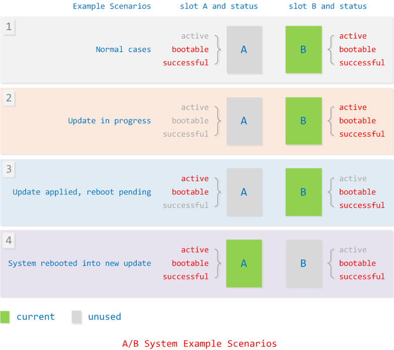
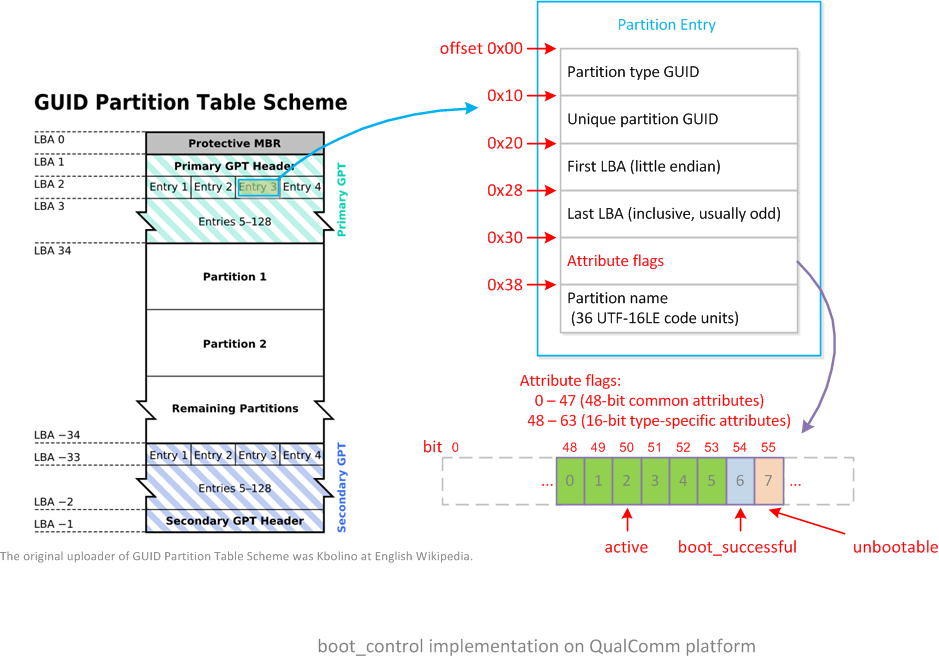

[TOC]


# [【BLOG】Android A/B System OTA分析](https://blog.csdn.net/guyongqiangx/article/details/71334889)

Android从7.0开始引入新的OTA升级方式，`A/B System Updates`，这里将其叫做`A/B`系统。

## 1、`A/B`系统的特点

顾名思义，A/B系统就是设备上有A和B两套可以工作的系统（用户数据只有一份，为两套系统共用），简单来讲，可以理解为一套系统分区，另外一套为备份分区。其系统版本可能一样；也可能不一样，其中一个是新版本，另外一个旧版本，通过升级，将旧版本也更新为新版本。当然，设备出厂时这两套系统肯定是一样的。

> 之所以叫套，而不是个，是因为Android系统不是由一个分区组成，其系统包括boot分区的kernel和ramdisk，system和vendor分区的应用程序和库文件，以及userdata分区的数据
>

A/B系统实现了无缝升级(seamless updates)，有以下特点：

- 出厂时设备上有两套可以正常工作的系统，升级时确保设备上始终有一个可以工作的系统，减少设备变砖的可能性，方便维修和售后。
- OTA升级在Android系统的后台进行，所以更新过程中，用户可以正常使用设备，数据更新完成后，仅需要用户重启一次设备进入新系统
- 如果OTA升级失败，设备可以回退到升级前的旧系统，并且可以尝试再次更新升级。

Android 7.0上传统OTA方式和新的A/B系统方式都存在，只是编译时只能选择其中的一种OTA方式。由于A/B系统在分区上与传统OTA的分区设计不一样，二者无法兼容，所以7.0以前的系统无法通过OTA方式升级为A/B系统。

> 7.0以前传统的OTA方式：
>
> 设备上有一个Android主系统和一个Recovery系统，Android主系统运行时检测是否需要升级，如果需要升级，则将升级的数据包下载并存放到cache分区，重启系统后进入Recovery系统，并用cache分区下载好的数据更新Android主系统，更新完成后重新启动进入Android主系统。如果更新失败，设备重启后就不能正常使用了，唯一的办法就是重新升级，直到成功为止。

A/B系统主要由运行在Android后台的update_engine和两套分区‘slot A’和‘slot B’组成。Android系统从其中一套分区启动，在后台运行update_engine监测升级信息并下载升级数据，然后将数据更新到另外一套分区，写入数据完成后从更新的分区启动。


与传统OTA方式相比，A/B系统的变化主要有：

1. 系统的分区设置
   传统方式只有一套分区
   A/B系统有两套分区，称为slot A和slot B
   
2. 跟bootloader沟通的方式 
   传统方式bootloader通过读取misc分区信息来决定是进入Android主系统还是Recovery系统
   A/B系统的bootloader通过特定的分区信息来决定从slot A还是slot B启动
   
3. 系统的编译过程 
   传统方式在编译时会生成boot.img和recovery.img分别用于Android主系统和Recovery系统的ramdisk
   A/B系统只有boot.img，而不再生成单独的recovery.img
   
4. OTA更新包的生成方式 
   A/B系统生成OTA包的工具和命令跟传统方式一样，但是生成内容的格式不一样了


## 2、`A/B`系统的分区

### 2.1、传统OTA的分区

传统OTA方式下的分区主要包括：

- bootloader

    存放用于引导linux的bootloader

- boot

    存放Android主系统的linux kernel文件和用于挂载system和其他分区的ramdisk

- system

  Android主系统分区，包括Android的系统应用程序和库文件

- vendor

  Android主系统分区，主要是包含开发厂商定制的一些应用和库文件，很多时候开发厂商也直接将这个分区的内容直接放入system分区

- userdata

  用户数据分区，存放用户数据，包括用户安装的应用程序和使用时生成的数据

- cache

  临时存放数据的分区，通常用于存放OTA的升级包

- recovery

  存放Recovery系统的linux kernel文件和ramdisk

- misc

  存放Android主系统和Recovery系统跟bootloader通信的数据
  

### 2.2、`A/B`系统的分区

- bootloader

  存放用于引导linux的bootloader

- boot_a和boot_b

  分别用于存放两套系统各自的linux kernel文件和用于挂载system和其他分区的ramdisk

- system_a和system_b

  Android主系统分区，分别用于存放两套系统各自的系统应用程序和库文件

- vendor_a和vendor_b

  Android主系统分区， 分别用于存放两套系统各自的开发厂商定制的一些应用和库文件，很多时候开发厂商也直接将这个分区的内容直接放入system分区

- userdata

  用户数据分区，存放用户数据，包括用户安装的应用程序和使用时生成的数据

- misc或其他名字分区

  存放Android主系统和Recovery系统跟bootloader通信的数据，由于存放方式和分区名字没有强制要求，所以部分实现上保留了misc分区（代码中可见Brillo和Intel的平台），另外部分实现采用其他分区存放数据（Broadcom机顶盒平台采用名为eio的分区）。
  

### 2.3、一张图比较传统分区和`A/B`系统分区

关于分区的区别，文字描述不够直观，采用图片清楚多了。


主要区别在于A/B系统：

1. boot，system和vendor系统分区从传统的一套变为两套，叫做slot A和slot B；

2. 不再需要cache和recovery分区

3. misc分区不是必须

> 关于cache和misc分区：
>
> 仍然有部分厂家保留cache分区，用于一些其他的用途，相当于temp文件夹，但不是用于存放下载的OTA数据。
> 部分厂家使用misc分区存放Android系统同bootloader通信数据，另有部分厂家使用其它名字的分区存储这类数据。


## 3、`A/B`系统的状态

###  3.1、系统分区属性

对于A/B系统的slot A和slot B分区，其都存在以下三个属性：

- active

  系统的活动分区标识，这是一个排他属性，系统只能有一个分区设置为active属性，启动时bootloader选取设置为active的分区进行启动。

- bootable

  分区可启动标识，设置为bootable的分区表明该分区包含了一个完整的可以启动的系统。

- successful

  分区成功运行标识，设置为successful的分区表明该分区在上一次启动或当前启动中可以正确运行。

### 3.2、系统的典型场景

典型的应用场景有以下4个（假定当前从B分区启动）：



图中：

- 当前运行的系统（current）用绿色方框表示，当前没有用的系统（unused）用灰色方框表示。
- 属性标识为红色，表示该状态下相应属性被设置，标识为灰色标识该状态下属性没有设置或设置为相反属性，如： 
  - ”active” 表示已经设置active属性，当前为活动分区；”active” 表示没有设置active属性
  - “bootable” 表示已经设置bootable属性；”bootable” 表示设置为unbootable或没有设置bootable属性
  - “successful” 表示已经设置successful属性，”successful” 表示没有设置successful属性

每个场景详细说明如下：

1. 普通场景（Normal cases）

   最常见的情形，例如设备出厂时，A分区和B分区都可以成功启动并正确运行，所以两个分区都设置为bootable和successful，但由于是从B分区启动，所以只有B分区设置为active。

2. 升级中（Update in progress）

   B分区检测到升级数据，在A分区进行升级，此时将A分区标识为unbootable，另外清除successful标识；B分区仍然为active，bootable和successful。

3. 更新完成，等待重启（Update applied, reboot pending）

   B分区将A分区成功更新后，将A分区标识为bootable。另外，由于重启后需要从A分区启动，所以也需要将A分区设置为active，但是由于还没有验证过A分区是否能成功运行，所以不设置successful；B分区的状态变为bootable和successful，但没有active。

4. 从新系统成功启动（System rebooted into new update）

   设备重启后，bootloader检测到A分区为active，所以加载A分区系统。进入A系统后如果能正确运行，需要将A分区标识为successful。对比第1个普通场景，A和B系统都设置为bootable和successful，但active从B分区切换到A分区。至此，B分区成功更新并切换到A分区，设备重新进入普通场景。
   

## 4、`A/B`系统的更新流程

整个A/B系统的升级更新在后台完成，升级中任何时间点都是可中断和可恢复的，相当于下载中的断点续传，更新操作对用户是透明的，在不影响用户操作的情况下完成升级。

设备可以设置数据下载、更新升级的场景和策略，例如：

- 只有在WiFi连接时才下载数据

- 电量较少时不下载数据、不进行更新

- 用户没有活动时才进行数据下载和更新等

具体有哪些策略依赖于开发者和用户的设置。


## 5、`A/B`系统和传统方式下镜像内容的比较

传统OTA方式下：

1. boot.img内有一个boot ramdisk，用于系统启动时加载system.img；

2. recovery.img内有一个recovery ramdisk，作为recovery系统运行的ramdisk；

3. system.img只包含android系统的应用程序和库文件；

A/B系统下：

1. system.img除了包含android系统的应用程序和库文件还，另外含有boot ramdisk，相当于传统OTA下

   boot.img内的ramdisk存放到system.img内了；

2. boot.img内包含的是recovery ramdisk，而不是boot ramdisk。Android系统启动时不再加载boot.img内的

   ramdisk，而是通过device mappezr机制选择system.img内的ramdisk进行加载；

3. 没有recovery.img文件

要想知道系统的各个分区到底有什么东西，跟传统OTA的镜像文件到底有什么区别，需要阅读Makefile，看看每个镜像里面到底打包了哪些文件。

在看系统编译打包文件生成镜像之前，先看看跟A/B相关的到底有哪些变量，以及这些变量有什么作用。


## 6、`A/B`系统相关的Makefile变量

这些变量主要有三类：

- A/B系统必须定义的变量

  - AB_OTA_UPDATER := true

    A/B系统的主要开关变量，设置后：

    1. recovery系统内不再具有操作cache分区的功能，bootable\recovery\device.cpp；
    2. recovery系统使用不同的方式来解析升级文件，bootable\recovery\install.cpp
    3. 生成A/B系统相关的META文件

  - AB_OTA_PARTITIONS := boot system vendor

    将A/B系统可升级的分区写入文件$(zip_root)/META/ab_partitions.txt

  - BOARD_BUILD_SYSTEM_ROOT_IMAGE := true

    将boot ramdisk放到system分区内

  - TARGET_NO_RECOVERY := true

    不再生成recovery.img镜像

  - BOARD_USES_RECOVERY_AS_BOOT := true

    将recovery ramdisk放到boot.img文件内

  - PRODUCT_PACKAGES += update_engine update_verifier

    编译update_engine和update_verifier模块，并安装相应的应用

- A/B系统可选定义的变量

  - PRODUCT_PACKAGES_DEBUG += update_engine_client

    系统自带了一个update_engine_client应用，可以根据需要选择是否编译并安装

- A/B系统不能定义的变量

  - BOARD_RECOVERYIMAGE_PARTITION_SIZE

    系统没有recovery分区，不需要设置recovery分区的SIZE

  - BOARD_CACHEIMAGE_PARTITION_SIZE
  
    系统没有cache分区，不需要设置cache分区的SIZE
  
  - BOARD_CACHEIMAGE_FILE_SYSTEM_TYPE
  
    系统没有cache分区，不需要设置cache分区的TYPE


## 7、`A/B`系统镜像文件的生成

> 基于`AOSP 7.1.1_r23 (NMF27D)`代码进行分析

`build\core\Makefile`定义了所需生成的镜像目标和规则，各镜像规则如下，我直接在代码里进行注释了。

1. recovery.img

   ```makefile
   # A/B系统中，"TARGET_NO_RECOVERY := true"，所以条件成立
   ifeq (,$(filter true, $(TARGET_NO_KERNEL) $(TARGET_NO_RECOVERY)))
     INSTALLED_RECOVERYIMAGE_TARGET := $(PRODUCT_OUT)/recovery.img
   else
     INSTALLED_RECOVERYIMAGE_TARGET :=
   endif
   ```

   由于`A/B`系统定了`TARGET_NO_RECOVERY := true`，这里`INSTALLED_RECOVERYIMAGE_TARGET`被设置为空，所以不会生成`recovery.img`

2. boot.img

   ```makefile
   # 定义boot.img的名字和存放的路径
   INSTALLED_BOOTIMAGE_TARGET := $(PRODUCT_OUT)/boot.img
   
   #
   # 以下error表明：
   #     BOARD_USES_RECOVERY_AS_BOOT和BOARD_BUILD_SYSTEM_ROOT_IMAGE
   #     在A/B系统中需要同时被定义为true
   #
   # BOARD_USES_RECOVERY_AS_BOOT = true must have BOARD_BUILD_SYSTEM_ROOT_IMAGE = true.
   # BOARD_USES_RECOVERY_AS_BOOT 已经定义为true
   ifeq ($(BOARD_USES_RECOVERY_AS_BOOT),true) 
   ifneq ($(BOARD_BUILD_SYSTEM_ROOT_IMAGE),true)
     # 如果没有定义BOARD_BUILD_SYSTEM_ROOT_IMAGE 则编译终止，并显示错误信息
     $(error BOARD_BUILD_SYSTEM_ROOT_IMAGE must be enabled for BOARD_USES_RECOVERY_AS_BOOT.)
   endif
   endif
   
   # ...... 省略若干代码
   
   # 好吧，这里才是生成boot.img的地方
   ifeq ($(BOARD_USES_RECOVERY_AS_BOOT),true)
   # 对boot.img添加依赖：boot_signer，这里不关心
   ifeq (true,$(PRODUCTS.$(INTERNAL_PRODUCT).PRODUCT_SUPPORTS_BOOT_SIGNER))
   $(INSTALLED_BOOTIMAGE_TARGET) : $(BOOT_SIGNER)
   endif
   # 对boot.img添加依赖：vboot_signer.sh，这里不关心
   ifeq (true,$(PRODUCTS.$(INTERNAL_PRODUCT).PRODUCT_SUPPORTS_VBOOT))
   $(INSTALLED_BOOTIMAGE_TARGET) : $(VBOOT_SIGNER)
   endif
   # boot.img的其它依赖，并通过宏build-recoveryimage-target来生成boot.img
   $(INSTALLED_BOOTIMAGE_TARGET): $(MKBOOTFS) $(MKBOOTIMG) $(MINIGZIP) \
           $(INSTALLED_RAMDISK_TARGET) \
           $(INTERNAL_RECOVERYIMAGE_FILES) \
           $(recovery_initrc) $(recovery_sepolicy) $(recovery_kernel) \
           $(INSTALLED_2NDBOOTLOADER_TARGET) \
           $(recovery_build_prop) $(recovery_resource_deps) \
           $(recovery_fstab) \
           $(RECOVERY_INSTALL_OTA_KEYS)
           $(call pretty,"Target boot image from recovery: $@")
           $(call build-recoveryimage-target, $@)
   endif
   
   #
   # 上面的规则中：
   #   INSTALLED_BOOTIMAGE_TARGET = $(PRODUCT_OUT)/boot.img
   # 其依赖的是recovery系统文件，最后通过build-recoveryimage-target打包成boot.img
   # 这不就是把recovery.img换个名字叫boot.img么？
   #
   
   #
   # 再来看看原本的recovery.img的生成规则：
   #  - A/B 系统下，INSTALLED_RECOVERYIMAGE_TARGET已经定义为空，什么都不做
   #  - 非A/B 系统下，以下规则会生成recovery.img
   #
   $(INSTALLED_RECOVERYIMAGE_TARGET): $(MKBOOTFS) $(MKBOOTIMG) $(MINIGZIP) \
           $(INSTALLED_RAMDISK_TARGET) \
           $(INSTALLED_BOOTIMAGE_TARGET) \
           $(INTERNAL_RECOVERYIMAGE_FILES) \
           $(recovery_initrc) $(recovery_sepolicy) $(recovery_kernel) \
           $(INSTALLED_2NDBOOTLOADER_TARGET) \
           $(recovery_build_prop) $(recovery_resource_deps) \
           $(recovery_fstab) \
           $(RECOVERY_INSTALL_OTA_KEYS)
           $(call build-recoveryimage-target, $@)
   ```

3. `BuildImage`函数

   ```makefile
   def BuildImage(in_dir, prop_dict, out_file, target_out=None):
     #...... 省略若干代码
   
     # 关键！！！前面改动过了in_dir，所以条件成立
     if in_dir != origin_in:
       # Construct a staging directory of the root file system.
       ramdisk_dir = prop_dict.get("ramdisk_dir")
       if ramdisk_dir:
         shutil.rmtree(in_dir)
         # 将字典system_image_info.txt里"ramdisk_dir"指定的内容复制到临时文件夹in_dir中，并保持原有的符号链接
         shutil.copytree(ramdisk_dir, in_dir, symlinks=True)
       staging_system = os.path.join(in_dir, "system")
       # 删除in_dir/system目录，即删除ramdisk_dir下system目录
       shutil.rmtree(staging_system, ignore_errors=True)
       # 将origin_in目录的内容复制到ramdisk_dir/system目录下
       # 原来的origin_in是指定的$(PRODUCT_OUT)/system目录
       # 所以这里的操作是将ramdisk和system的内容合并生成一个完整的文件系统
       shutil.copytree(origin_in, staging_system, symlinks=True)
   
     reserved_blocks = prop_dict.get("has_ext4_reserved_blocks") == "true"
     ext4fs_output = None
   
     # 继续对合并后完整的文件系统进行其它操作，最后打包为system.img
     ...
   
     return exit_code == 0
   ```

   显然，`build_image.py`脚本将ramdisk和system文件夹下的内容合并成一个完整的文件系统，最终输出为system.img，再也不用担心system.img没有rootfs了。

4. userdata.img

   ```makefile
   # Don't build userdata.img if it's extfs but no partition size
   skip_userdata.img :=
   # 如果TARGET_USERIMAGES_USE_EXT4定义为true，则会进行以下定义：
   # INTERNAL_USERIMAGES_USE_EXT := true
   # INTERNAL_USERIMAGES_EXT_VARIANT := ext4
   # 在vendor相关的deivce下，BoradConfig.mk中会定义BOARD_USERDATAIMAGE_PARTITION_SIZE
   # 所以这里最终skip_userdata.img仍然为空
   ifdef INTERNAL_USERIMAGES_EXT_VARIANT
   ifndef BOARD_USERDATAIMAGE_PARTITION_SIZE
     skip_userdata.img := true
   endif
   endif
   
   # skip_userdata.img为空，所以这里会定义userdata.img并生成这个文件
   ifneq ($(skip_userdata.img),true)
   userdataimage_intermediates := \
       $(call intermediates-dir-for,PACKAGING,userdata)
   BUILT_USERDATAIMAGE_TARGET := $(PRODUCT_OUT)/userdata.img
   
   # 具体生成userdata.img的宏函数
   define build-userdataimage-target
     $(call pretty,"Target userdata fs image: $(INSTALLED_USERDATAIMAGE_TARGET)")
     @mkdir -p $(TARGET_OUT_DATA)
     @mkdir -p $(userdataimage_intermediates) && rm -rf $(userdataimage_intermediates)/userdata_image_info.txt
     $(call generate-userimage-prop-dictionary, $(userdataimage_intermediates)/userdata_image_info.txt, skip_fsck=true)
     $(hide) PATH=$(foreach p,$(INTERNAL_USERIMAGES_BINARY_PATHS),$(p):)$$PATH \
         ./build/tools/releasetools/build_image.py \
         $(TARGET_OUT_DATA) $(userdataimage_intermediates)/userdata_image_info.txt $(INSTALLED_USERDATAIMAGE_TARGET) $(TARGET_OUT)
     $(hide) $(call assert-max-image-size,$(INSTALLED_USERDATAIMAGE_TARGET),$(BOARD_USERDATAIMAGE_PARTITION_SIZE))
   endef
   
   # 好吧，这里才是真正调用build-userdataimage-target去生成userdata.img的规则
   # We just build this directly to the install location.
   INSTALLED_USERDATAIMAGE_TARGET := $(BUILT_USERDATAIMAGE_TARGET)
   $(INSTALLED_USERDATAIMAGE_TARGET): $(INTERNAL_USERIMAGES_DEPS) \
                                      $(INTERNAL_USERDATAIMAGE_FILES)
       # 生成userdata.img的入口就这里了
       $(build-userdataimage-target)
   ```

   这里的步骤跟生成system.img基本一致，宏函数build-userdataimage-target内通过build_image.py来将$(PRODUCT_OUT)/data目录内容打包生成userdata.img，不同的是，这里不再需要放入ramdisk的内容。

   显然，userdata.img的生成跟是否是A/B系统没有关系。

5. cache.img

   ```makefile
   # cache partition image
   # `A/B`系统中 BOARD_CACHEIMAGE_FILE_SYSTEM_TYPE 没有定义，这里条件不能满足，所以不会生成cache.img
   ifdef BOARD_CACHEIMAGE_FILE_SYSTEM_TYPE
   INTERNAL_CACHEIMAGE_FILES := \
       $(filter $(TARGET_OUT_CACHE)/%,$(ALL_DEFAULT_INSTALLED_MODULES))
   
   cacheimage_intermediates := \
       $(call intermediates-dir-for,PACKAGING,cache)
   BUILT_CACHEIMAGE_TARGET := $(PRODUCT_OUT)/cache.img
   
   #...... 省略若干代码
   
   # We just build this directly to the install location.
   # 这里是真正去生成cache.img的地方，可惜`A/B`系统下不会再有调用了
   INSTALLED_CACHEIMAGE_TARGET := $(BUILT_CACHEIMAGE_TARGET)
   $(INSTALLED_CACHEIMAGE_TARGET): $(INTERNAL_USERIMAGES_DEPS) $(INTERNAL_CACHEIMAGE_FILES)
       $(build-cacheimage-target)
   
   #...... 省略若干代码
   
   else # BOARD_CACHEIMAGE_FILE_SYSTEM_TYPE
   # we need to ignore the broken cache link when doing the rsync
   IGNORE_CACHE_LINK := --exclude=cache
   endif # BOARD_CACHEIMAGE_FILE_SYSTEM_TYPE
   ```

   由于A/B系统定了没有定义`BOARD_CACHEIMAGE_FILE_SYSTEM_TYPE`，这里`BUILT_CACHEIMAGE_TARGET`也不会定义，所以不会生成cache.img

6. vendor.img

   ```makefile
   # vendor partition image
   # 如果系统内有定义BOARD_VENDORIMAGE_FILE_SYSTEM_TYPE，则这里会生成vendor.img
   ifdef BOARD_VENDORIMAGE_FILE_SYSTEM_TYPE
   # 定义vendor系统内包含的所有文件
   INTERNAL_VENDORIMAGE_FILES := \
       $(filter $(TARGET_OUT_VENDOR)/%,\
         $(ALL_DEFAULT_INSTALLED_MODULES)\
         $(ALL_PDK_FUSION_FILES))
   
   # platform.zip depends on $(INTERNAL_VENDORIMAGE_FILES).
   $(INSTALLED_PLATFORM_ZIP) : $(INTERNAL_VENDORIMAGE_FILES)
   
   # vendor的文件列表：installed-files-vendor.txt
   INSTALLED_FILES_FILE_VENDOR := $(PRODUCT_OUT)/installed-files-vendor.txt
   $(INSTALLED_FILES_FILE_VENDOR) : $(INTERNAL_VENDORIMAGE_FILES)
       @echo Installed file list: $@
       @mkdir -p $(dir $@)
       @rm -f $@
       $(hide) build/tools/fileslist.py $(TARGET_OUT_VENDOR) > $@
   
   # vendor.img目标
   vendorimage_intermediates := \
       $(call intermediates-dir-for,PACKAGING,vendor)
   BUILT_VENDORIMAGE_TARGET := $(PRODUCT_OUT)/vendor.img
   
   # 定义生成vendor.img的宏函数build-vendorimage-target
   define build-vendorimage-target
     $(call pretty,"Target vendor fs image: $(INSTALLED_VENDORIMAGE_TARGET)")
     @mkdir -p $(TARGET_OUT_VENDOR)
     @mkdir -p $(vendorimage_intermediates) && rm -rf $(vendorimage_intermediates)/vendor_image_info.txt
     $(call generate-userimage-prop-dictionary, $(vendorimage_intermediates)/vendor_image_info.txt, skip_fsck=true)
     $(hide) PATH=$(foreach p,$(INTERNAL_USERIMAGES_BINARY_PATHS),$(p):)$$PATH \
         ./build/tools/releasetools/build_image.py \
         $(TARGET_OUT_VENDOR) $(vendorimage_intermediates)/vendor_image_info.txt $(INSTALLED_VENDORIMAGE_TARGET) $(TARGET_OUT)
     $(hide) $(call assert-max-image-size,$(INSTALLED_VENDORIMAGE_TARGET),$(BOARD_VENDORIMAGE_PARTITION_SIZE))
   endef
   
   # We just build this directly to the install location.
   # 生成vendor.img的依赖和规则
   INSTALLED_VENDORIMAGE_TARGET := $(BUILT_VENDORIMAGE_TARGET)
   $(INSTALLED_VENDORIMAGE_TARGET): $(INTERNAL_USERIMAGES_DEPS) $(INTERNAL_VENDORIMAGE_FILES) $(INSTALLED_FILES_FILE_VENDOR)
       $(build-vendorimage-target)
   
   .PHONY: vendorimage-nodeps
   vendorimage-nodeps: | $(INTERNAL_USERIMAGES_DEPS)
       $(build-vendorimage-target)
   
   # 如果定义了BOARD_PREBUILT_VENDORIMAGE，说明已经预备好了vendor.img，那就直接复制到目标位置
   else ifdef BOARD_PREBUILT_VENDORIMAGE
   INSTALLED_VENDORIMAGE_TARGET := $(PRODUCT_OUT)/vendor.img
   $(eval $(call copy-one-file,$(BOARD_PREBUILT_VENDORIMAGE),$(INSTALLED_VENDORIMAGE_TARGET)))
   endif
   ```

   显然，vendor.img跟是否是`A/B`系统没有关系，主要看系统是否定义了`BOARD_VENDORIMAGE_FILE_SYSTEM_TYPE`。

到此为止，我们已经分析了除升级包update.zip外的主要文件的生成，包括recovery.img，boot.img，system.img，userdata.img，cache.img和vendor.img。

总结：

- recovery.img，不再单独生成，传统方式的recovery.img现在叫做boot.img

- boot.img，包含kernel和recovery模式的ramdisk

- system.img，传统方式下system.img由$(PRODUCT_OUT)/system文件夹打包而成，A/B系统下，制作时将$(PRODUCT_OUT)/root和$(PRODUCT_OUT)/system合并到一起，生成一个完整的带有rootfs的system.img

- userdata.img，跟原来一样，打包$(PRODUCT_OUT)/data文件夹而成

- cache.img，A/B系统下不再单独生成cache.img

- vendor.img，文件的生成跟是否A/B系统无关，主要有厂家决定

现在的情况是，设备启动后bootloader解析boot.img得到kernel文件，启动linux进入系统，然后加载Android主系统system，但是boot.img和system.img两个镜像内都有rootfs，这个启动是如何启动，那这个到底是怎么搞的呢？下一篇会对这个启动流程详细分析。


## 8、传统系统的沟通机制

传统方式中，`Android`主系统同`bootloader`和`recovery`系统通过存放于`misc`分区的`bootloader_message`结构进行通信。

```c
struct bootloader_message {
    char command[32];
    char status[32];
    char recovery[768];

    /* The 'recovery' field used to be 1024 bytes.  It has only ever
     * been used to store the recovery command line, so 768 bytes
     * should be plenty.  We carve off the last 256 bytes to store the
     * stage string (for multistage packages) and possible future
     * expansion.*/
    char stage[32];
    char reserved[224];
};
```

1. android系统或recovery系统根据操作更新bootloader_message的command成员，并写入misc分区；

2. bootloader启动后读取misc分区并解析得到bootloader_message，根据command内容选择相应的操作，command可能的内容包括：

   - "update-radio/hboot" 

     指示bootloader更新firmware

   - "boot-recovery" 

     指示bootloader加载recovery系统，进入recovery mode


## 9、`A/B`系统的沟通机制

### 9.1、`boot_control`的接口定义

A/B系统中，指定了用于通信的HAL层boot_control功能的定义，但没有指定通信数据具体的存储实现，这点有别于传统方式下AOSP定义的存储于misc分区的bootloader_message结构。

HAL层的boot_control，其定义位于文件中hardware/libhardware/include/hardware/boot_control.h：

```c
/**
 * Every hardware module must have a data structure named HAL_MODULE_INFO_SYM
 * and the fields of this data structure must begin with hw_module_t
 * followed by module specific information.
 */
typedef struct boot_control_module {
    struct hw_module_t common;

    /*
     * (*init)() perform any initialization tasks needed for the HAL.
     * This is called only once.
     */
    /* init 用于HAL初始化调用，仅启动时调用一次 */
    void (*init)(struct boot_control_module *module);

    /*
     * (*getNumberSlots)() returns the number of available slots.
     * For instance, a system with a single set of partitions would return
     * 1, a system with A/B would return 2, A/B/C -> 3...
     */
    /* 返回系统slot分区套数，1套slot包含boot, system和vendor分区 */
    unsigned (*getNumberSlots)(struct boot_control_module *module);

    /*
     * (*getCurrentSlot)() returns the value letting the system know
     * whether the current slot is A or B. The meaning of A and B is
     * left up to the implementer. It is assumed that if the current slot
     * is A, then the block devices underlying B can be accessed directly
     * without any risk of corruption.
     * The returned value is always guaranteed to be strictly less than the
     * value returned by getNumberSlots. Slots start at 0 and
     * finish at getNumberSlots() - 1
     */
    /* 返回系统当前所在的slot位置 */
    unsigned (*getCurrentSlot)(struct boot_control_module *module);

    /*
     * (*markBootSuccessful)() marks the current slot
     * as having booted successfully
     *
     * Returns 0 on success, -errno on error.
     */
    /* 标记当前slot为已经成功启动 */
    int (*markBootSuccessful)(struct boot_control_module *module);

    /*
     * (*setActiveBootSlot)() marks the slot passed in parameter as
     * the active boot slot (see getCurrentSlot for an explanation
     * of the "slot" parameter). This overrides any previous call to
     * setSlotAsUnbootable.
     * Returns 0 on success, -errno on error.
     */
    /* 标记指定slot为可启动 */
    int (*setActiveBootSlot)(struct boot_control_module *module, unsigned slot);

    /*
     * (*setSlotAsUnbootable)() marks the slot passed in parameter as
     * an unbootable. This can be used while updating the contents of the slot's
     * partitions, so that the system will not attempt to boot a known bad set up.
     * Returns 0 on success, -errno on error.
     */
    /* 标记指定slot为不可启动 */
    int (*setSlotAsUnbootable)(struct boot_control_module *module, unsigned slot);

    /*
     * (*isSlotBootable)() returns if the slot passed in parameter is
     * bootable. Note that slots can be made unbootable by both the
     * bootloader and by the OS using setSlotAsUnbootable.
     * Returns 1 if the slot is bootable, 0 if it's not, and -errno on
     * error.
     */
    /* 返回指定slot是否可启动 */
    int (*isSlotBootable)(struct boot_control_module *module, unsigned slot);

    /*
     * (*getSuffix)() returns the string suffix used by partitions that
     * correspond to the slot number passed in parameter. The returned string
     * is expected to be statically allocated and not need to be freed.
     * Returns NULL if slot does not match an existing slot.
     */
    /* 返回指定slot的系统分区后缀，例如“_a”/“_b”等 */
    const char* (*getSuffix)(struct boot_control_module *module, unsigned slot);

    /*
     * (*isSlotMarkedSucessful)() returns if the slot passed in parameter has
     * been marked as successful using markBootSuccessful.
     * Returns 1 if the slot has been marked as successful, 0 if it's
     * not the case, and -errno on error.
     */
    /* 返回指定slot是否已经标记为成功启动 */
    int (*isSlotMarkedSuccessful)(struct boot_control_module *module, unsigned slot);

    void* reserved[31];
} boot_control_module_t;
```

### 9.2、`boot_control`的存储和功能实现

对于boot_control，AOSP仅定义了其功能接口，并没有提供具体的代码实现，各厂家根据这个头文件，自定义其存储和功能实现。

使用grep工具搜索代码中的boot_control关键字，可以发现AOSP代码里面包含了三个平台的boot_control实现：

- Google平台的Brillo
- Intel平台的edison
- QualComm
  

#### 9.2.1、`Google`平台`Brillo`的实现

`AOSP`代码中，`system\extra\boot_control_copy` 定义了`bootctrl.default`实现：

```sh
$ ls -lh system/extras/boot_control_copy/
total 36K
-rw-r--r-- 1 ygu users  458 Mar 31 08:50 Android.mk
-rw-r--r-- 1 ygu users  11K Mar 31 08:50 NOTICE
-rw-r--r-- 1 ygu users 7.7K Mar 31 08:50 boot_control_copy.c
-rw-r--r-- 1 ygu users 5.1K Mar 31 08:50 bootinfo.c
-rw-r--r-- 1 ygu users 2.0K Mar 31 08:50 bootinfo.h
```

各文件的内容如下：

- `bootinfo.h`定义了结构体`BrilloSlotInfo`和`BrilloBootInfo`

  `BrilloBootInfo`包含结构体`BrilloBootInfo`，作为`boot_control`的私有数据实现，定义如下：
  
  ```c
  typedef struct BrilloSlotInfo {
    uint8_t bootable : 1;
    uint8_t reserved[3];
  } BrilloSlotInfo;
  
  typedef struct BrilloBootInfo {
    // Used by fs_mgr. Must be NUL terminated.
    char bootctrl_suffix[4];
  
    // Magic for identification - must be 'B', 'C', 'c' (short for
    // "boot_control copy" implementation).
    uint8_t magic[3];
  
    // Version of BrilloBootInfo struct, must be 0 or larger.
    uint8_t version;
  
    // Currently active slot.
    uint8_t active_slot;
  
    // Information about each slot.
    BrilloSlotInfo slot_info[2];
  
    uint8_t reserved[15];
  } BrilloBootInfo;
  ```
  
  结构体`BrilloBootInfo`占用32字节，系统复用`misc`分区的`bootloader_message`结构体，将`BrilloBootInfo`存放在偏移量为864字节的成员`slot_suffix[32]`中，整个`misc`分区数据结构的框图如下：
  
  

- `bootinfo.c`实现了对`BrilloBootInfo`进行存取操作的接口

  - 存取操作
    - `bool boot_info_load(BrilloBootInfo *out_info)`
    - `bool boot_info_save(BrilloBootInfo *info)`
  - 校验和复位操作
    - `bool boot_info_validate(BrilloBootInfo* info)`
    - `void boot_info_reset(BrilloBootInfo* info)`
  - 指定分区的打开操作
    - `int boot_info_open_partition(const char *name, uint64_t *out_size, int flags)`

- `boot_control_copy.c`实现了`boot_control`模块的功能

  ```c
  /* This boot_control HAL implementation emulates A/B by copying the
   * contents of the boot partition of the requested slot to the boot
   * partition. It hence works with bootloaders that are not yet aware
   * of A/B. This code is only intended to be used for development.
   */
  boot_control_module_t HAL_MODULE_INFO_SYM = {
    .common = {
      .tag                 = HARDWARE_MODULE_TAG,
      .module_api_version  = BOOT_CONTROL_MODULE_API_VERSION_0_1,
      .hal_api_version     = HARDWARE_HAL_API_VERSION,
      .id                  = BOOT_CONTROL_HARDWARE_MODULE_ID,
      .name                = "Copy Implementation of boot_control HAL",
      .author              = "The Android Open Source Project",
      .methods             = &module_methods,
    },
    .init                 = module_init,
    .getNumberSlots       = module_getNumberSlots,
    .getCurrentSlot       = module_getCurrentSlot,
    .markBootSuccessful   = module_markBootSuccessful,
    .setActiveBootSlot    = module_setActiveBootSlot,
    .setSlotAsUnbootable  = module_setSlotAsUnbootable,
    .isSlotBootable       = module_isSlotBootable,
    .getSuffix            = module_getSuffix,
  };
  ```

  代码实现了boot_control_module_t模块接口的功能，这里不再对每一个函数实现进行注释，但需要特别指出的是，函数module_setActiveBootSlot内部会根据传入的slot参数将对应分区boot_X内容复制到boot分区（系统上应该存在三个分区，如boot，boot_a和boot_b），bootloader不需要改动代码去检查到底是从哪个分区启动，只管加载boot分区就好了，带来的问题就是，一旦启动失败（例如，kernel挂载system分区失败，根本没有进入Android环境），bootloader无法切换到另外一个slot。注释中也提到，这种方式不需要修改bootloader，其代码实现只是用于开发目的，最终产品不应该是这样的。

#### 9.2.2、`Intel`平台`edison`的实现

`AOSP`代码中，`hardware\bsp\intel\soc\common\bootctrl`定义了`bootctrl.edison`的实现：

```shell
$ ls -lh hardware/bsp/intel/soc/common/bootctrl/
total 20K
-rw-r--r-- 1 ygu users  860 Mar 31 08:47 Android.mk
-rw-r--r-- 1 ygu users 9.1K Mar 31 08:47 bootctrl.c
-rw-r--r-- 1 ygu users 1.5K Mar 31 08:47 bootctrl.h
```

各文件的内容如下：

- `bootctrl.h`定义了结构体`slot_metadata_t`和`boot_ctrl_t`

  `boot_ctrl_t`包含结构体`slot_metadata_t`，作为`boot_control`的私有数据实现，定义如下：

  ```c
  #define BOOT_CONTROL_VERSION    1
  
  typedef struct slot_metadata {
      uint8_t priority : 4;
      uint8_t tries_remaining : 3;
      uint8_t successful_boot : 1;
  } slot_metadata_t;
  
  typedef struct boot_ctrl {
      /* Magic for identification - '\0ABB' (Boot Contrl Magic) */
      uint32_t magic;
  
      /* Version of struct. */
      uint8_t version;
  
      /* Information about each slot. */
      slot_metadata_t slot_info[2];
  
      uint8_t recovery_tries_remaining;
  } boot_ctrl_t;
  ```

  跟`Brillo`类似，系统复用`misc`分区的`bootloader_message`结构体，将`boot_ctrl_t`存放在偏移量为864字节的成员`slot_suffix[32]`中，整个`misc`分区数据结构的框图如下：

  

- `bootctrl.c`实现了`boot_ctrl_t`存取操作和`boot_control`的模块功能

  - `boot_ctrl_t`存取操作

    - `int bootctrl_read_metadata(boot_ctrl_t *bctrl)`
    - `int bootctrl_write_metadata(boot_ctrl_t *bctrl)`

  - `boot_control`模块功能

    ```c
    /* Boot Control Module implementation */
    boot_control_module_t HAL_MODULE_INFO_SYM = {
        .common = {
            .tag                 = HARDWARE_MODULE_TAG,
            .module_api_version  = BOOT_CONTROL_MODULE_API_VERSION_0_1,
            .hal_api_version     = HARDWARE_HAL_API_VERSION,
            .id                  = BOOT_CONTROL_HARDWARE_MODULE_ID,
            .name                = "boot_control HAL",
            .author              = "Intel Corporation",
            .methods             = &bootctrl_methods,
        },
        .init                 = bootctrl_init,
        .getNumberSlots       = bootctrl_get_number_slots,
        .getCurrentSlot       = bootctrl_get_current_slot,
        .markBootSuccessful   = bootctrl_mark_boot_successful,
        .setActiveBootSlot    = bootctrl_set_active_boot_slot,
        .setSlotAsUnbootable  = bootctrl_set_slot_as_unbootable,
        .isSlotBootable       = bootctrl_is_slot_bootable,
        .getSuffix            = bootctrl_get_suffix,
    };
    ```

由于没有bootloader的代码，所以对于如何通过结构体slot_metadata_t的成员priority和priority来选择启动哪一个slot并不清楚，无法对结构体成员的作用有更详细的说明。

值得一提的是，通过读取linux命令行参数androidboot.slot_suffix=来确定当前系统在哪一个slot上运行（见bootctrl_get_active_slot函数）。

#### 9.2.3、`QualComm`平台的实现

`AOSP`代码中，`hardware\qcom\bootctrl`定义了`bootctrl.$(TARGET_BOARD_PLATFORM)`的实现（具体名字依赖于`TARGET_BOARD_PLATFORM`变量设定）：

```shell
$ ls -lh hardware/qcom/bootctrl/
total 28K
-rw-r--r-- 1 ygu users  944 Mar 31 08:47 Android.mk
-rw-r--r-- 1 ygu users 1.5K Mar 31 08:47 NOTICE
-rw-r--r-- 1 ygu users  19K Mar 31 08:47 boot_control.cpp
```

QualComm平台的实现比较特别，没有单独定义boot_control的私有数据，而是将A/B系统相关信息存放到gpt表上。 
从GPT内容的第3个逻辑块LBA 2开始，依次存放的是每个GPT分区的详细信息Partition Entry，单个Partition Entry占用128个字节，从其第48个字节开始存放的是分区属性（Attribute flags）。A/B系统将每个slot分区的信息，存放到分区属性的Bit 48开始的位置上。

QualComm平台详细的A/B系统分区属性如下：



> 关于`GPT`分区的详细信息，可以参考另外一篇文章：<<[博通机顶盒平台GPT分区和制作工具](http://blog.csdn.net/guyongqiangx/article/details/68924436)>>的第1部分，关于GPT的介绍。

在代码实现中比较特别的是：

- 统计系统中`boot`开头的分区数作为`slot`总数（见`get_number_slots`函数）
- 访问系统的属性`ro.boot.slot_suffix`来确定当前系统在哪一个`slot`上运行（见`get_current_slot`函数）

#### 9.2.4、`Broadcom`机顶盒平台的实现

在`Broadcom`单独提供的代码中（非`AOSP`代码），`vendor/broadcom/bcm_platform/hals/boot_control`定义了`bootctrl.$(TARGET_BOARD_PLATFORM)`的实现（如`bootctrl.bcm7252ssffdr4`）：

```shell
$ ls -lh vendor/broadcom/bcm_platform/hals/boot_control/
total 20K
-rw-r--r-- 1 ygu users 1.3K Mar 30 16:09 Android.mk
-rw-r--r-- 1 ygu users  11K May  6 16:26 boot_control.cpp
-rw-r--r-- 1 ygu users 1.1K Mar 30 16:09 eio_boot.h
```

- `eio_boot.h`定义了结构体`eio_boot_slot`和`eio_boot`

  `eio_boot`包含结构体`eio_boot_slot`，作为`boot_control`的私有数据实现，定义如下：

  ```c
  struct eio_boot_slot {
     char suffix[8];
     int  valid;
     int  boot_try;
     int  boot_ok;
     int  boot_fail;
  };
  
  struct eio_boot {
     int    magic;
     int    current;
     struct eio_boot_slot slot[2];
  };
  ```

  结构体`eio_boot`的数据存放在名为`eio`的分区上。 
  `Broadcom`机顶盒平台`eio_boot`结构框图如下：

  

- `boot_control.cpp`实现了`eio_boot`存取操作和`boot_control`的模块功能

  ```c
  struct boot_control_module HAL_MODULE_INFO_SYM = {
     .common = {
        .tag                = HARDWARE_MODULE_TAG,
        .module_api_version = BOOT_CONTROL_MODULE_API_VERSION_0_1,
        .hal_api_version    = HARDWARE_HAL_API_VERSION,
        .id                 = BOOT_CONTROL_HARDWARE_MODULE_ID,
        .name               = "boot control hal for bcm platform",
        .author             = "Broadcom",
        .methods            = &boot_control_module_methods,
        .dso                = 0,
        .reserved           = {0}
      },
      .init                    = init,
      .getNumberSlots          = getNumberSlots,
      .getCurrentSlot          = getCurrentSlot,
      .markBootSuccessful      = markBootSuccessful,
      .setActiveBootSlot       = setActiveBootSlot,
      .setSlotAsUnbootable     = setSlotAsUnbootable,
      .isSlotBootable          = isSlotBootable,
      .getSuffix               = getSuffix,
      .isSlotMarkedSuccessful  = isSlotMarkedSuccessful,
  };
  ```

  `Broadcom`平台的分区后缀名不同于常见的`_a/_b`，而是采用`_i/_e`，这里略去对函数内容的注释。

### 9.3、`boot_control`的测试工具

除了定义HAL层的接口外，AOSP也提供了boot_control模块调用的工具bootctl，位于： 
system/extras/bootctl/bootctl.c

默认情况下，bootctl不会参与编译，可以在包含update_engine是将其添加到PRODUCT_PACKAGES，如下：

```makefile
PRODUCT_PACKAGES += \
  update_engine \
  update_verifier \
  bootctl
```

`bootctl`工具很简单，通过命令行调用`boot_control`的功能接口，以下是在Broadcom参考平台上运行`bootctl`的例子：

```shell
bcm7252ssffdr4:/ $ su
bcm7252ssffdr4:/ # which bootctl
/system/bin/bootctl
bcm7252ssffdr4:/ # bootctl --help
bootctl - command-line wrapper for the boot_control HAL.

Usage:
  bootctl COMMAND

Commands:
  bootctl hal-info                       - Show info about boot_control HAL used.
  bootctl get-number-slots               - Prints number of slots.
  bootctl get-current-slot               - Prints currently running SLOT.
  bootctl mark-boot-successful           - Mark current slot as GOOD.
  bootctl set-active-boot-slot SLOT      - On next boot, load and execute SLOT.
  bootctl set-slot-as-unbootable SLOT    - Mark SLOT as invalid.
  bootctl is-slot-bootable SLOT          - Returns 0 only if SLOT is bootable.
  bootctl is-slot-marked-successful SLOT - Returns 0 only if SLOT is marked GOOD.
  bootctl get-suffix SLOT                - Prints suffix for SLOT.

SLOT parameter is the zero-based slot-number.
64|bcm7252ssffdr4:/ # 
64|bcm7252ssffdr4:/ # bootctl hal-info
HAL name:            boot control hal for bcm platform
HAL author:          Broadcom
HAL module version:  0.1
bcm7252ssffdr4:/ # bootctl get-number-slots
2
bcm7252ssffdr4:/ # bootctl get-current-slot
0
bcm7252ssffdr4:/ # bootctl get-suffix 0
_i
bcm7252ssffdr4:/ # bootctl get-suffix 1
_e
```

最后的bootctl get-suffix调用可以看到，在我的测试平台上，slot A和slot B的分区命名后缀分别为_i和_e。

基于bootctl的基础上，Android系统提供了两个基于Brillo平台的测试代码，分别位于以下路径：

- system/extras/tests/bootloader

- external/autotest/server/site_tests/brillo_BootLoader

### 9.4、`boot_control`的调用

#### 9.4.1、`bootloader`读取`boot_control`私有实现的数据

设备启动后bootloader会读取boot_control私有实现的数据，来判断从哪一个slot启动，由于各家实现的私有数据结构不一样，所以无法详细说明如何解析和处理的过程。

#### 9.4.2、`boot_control_android`调用`boot_control`

文件`system/update_engine/boot_control_android.cc`中，类`BootControlAndroid`有一个私有成员`module_`：

```c++
// The Android implementation of the BootControlInterface. This implementation
// uses the libhardware's boot_control HAL to access the bootloader.
class BootControlAndroid : public BootControlInterface {
 ...

 private:
  // NOTE: There is no way to release/unload HAL implementations so
  // this is essentially leaked on object destruction.
  boot_control_module_t* module_;

  ...
};
```

在`BootControlAndroid`的`Init`方法内，获取`boot_control_module_t`模块指针并赋值给`module_`成员，然后调用`module_->init`进行`boot_control`的初始化，如下：

```c++
bool BootControlAndroid::Init() {
  const hw_module_t* hw_module;
  int ret;

#ifdef _UE_SIDELOAD
  // For update_engine_sideload, we simulate the hw_get_module() by accessing it
  // from the current process directly.
  # 对于update_engine_sideload应用，直接将HAL_MODULE_INFO_SYM转换为hw_module
  hw_module = &HAL_MODULE_INFO_SYM;
  ret = 0;
  if (!hw_module ||
      strcmp(BOOT_CONTROL_HARDWARE_MODULE_ID, hw_module->id) != 0) {
    ret = -EINVAL;
  }
#else  // !_UE_SIDELOAD
  # 对于update_engine应用，通过BOOT_CONTROL_HARDWARE_MODULE_ID获取hw_module
  ret = hw_get_module(BOOT_CONTROL_HARDWARE_MODULE_ID, &hw_module);
#endif  // _UE_SIDELOAD
  if (ret != 0) {
    LOG(ERROR) << "Error loading boot_control HAL implementation.";
    return false;
  }

  # 通过hw_module得到boot_control_module_t，从而后面可以愉快地调用其各种功能实现函数
  module_ = reinterpret_cast<boot_control_module_t*>(const_cast<hw_module_t*>(hw_module));
  # 调用boot_control的init函数
  module_->init(module_);

  LOG(INFO) << "Loaded boot_control HAL "
            << "'" << hw_module->name << "' "
            << "version " << (hw_module->module_api_version>>8) << "."
            << (hw_module->module_api_version&0xff) << " "
            << "authored by '" << hw_module->author << "'.";
  return true;
}
```

初始化完成后，就可以通过`module_`成员来调用各种`boot_control`的操作了。

#### 9.4.2、`update_verifier`调用`boot_control`

文件bootable/recovery/update_verifier/update_verifier.cpp中，获取boot_control_module_t指针，检查当前slot分区是否已经标记为successful，如果没有，则尝试verify_image并将当前slot标记为successful，具体代码如下：

```c++
int main(int argc, char** argv) {
  ...

  # 直接根据名称"bootctrl"获取模块
  const hw_module_t* hw_module;
  if (hw_get_module("bootctrl", &hw_module) != 0) {
    SLOGE("Error getting bootctrl module.\n");
    return -1;
  }

  # 将"bootctrl"模块转化为"boot_control_module_t"结构体
  boot_control_module_t* module = reinterpret_cast<boot_control_module_t*>(
      const_cast<hw_module_t*>(hw_module));
  # 调用init
  module->init(module);

  # 获取当前slot
  unsigned current_slot = module->getCurrentSlot(module);
  # 检查当前slot是否标记为successful
  int is_successful= module->isSlotMarkedSuccessful(module, current_slot);
  SLOGI("Booting slot %u: isSlotMarkedSuccessful=%d\n", current_slot, is_successful);
  # 如果当前slot没有标记为successful，说明当前启动可能存在问题
  if (is_successful == 0) {
    // The current slot has not booted successfully.
    # 检查"ro.boot.verifymode"，是否其它原因导致失败
    # 不是其它原因导致失败的情况下，重新调用verify_image验证
    ...

    # verify_image验证成功，尝试标记当前slot为successful
    int ret = module->markBootSuccessful(module);
    if (ret != 0) {
      SLOGE("Error marking booted successfully: %s\n", strerror(-ret));
      return -1;
    }
    SLOGI("Marked slot %u as booted successfully.\n", current_slot);
  }

  # 完成操作，退出update_verifier
  SLOGI("Leaving update_verifier.\n");
  return 0;
}
```

整个`A/B`系统中，基于`boot_control`的上层应用操作已经实现了，各家需要单独实现`boot_control`的底层操作，同时`bootloader`也需要配合解析`boot_control`的私有数据，从而选择相应的`slot`来启动`Android`系统。


## 10、`A/B`系统的检查

### 10.1、`bootloader`检查`slot metadata`

系统复位后，`bootloader`会去读取`boot_control`私有的存储数`slot metadata`并进行解析，以此确定从哪一个`slot`启动。 
以下是`android`官方的一个`bootloader`加载流程图：


大致启动流程如下：

1. 系统启动后，`bootloader`读取分区元数据`slot metadata`；
2. 检查分区元数据中是否有可启动的分区，如果没有可启动分区，直接进入`bootloader`的`recovery mode`（即`bootloader`下的刷机模式），一般是进入`fastboot`命令行；
3. 如果分区元数据中有可启动的分区，则选择所有可启动分区中优先级最高的`slot`（例如，直接选择当前设置为`active`的分区）；
4. 检查所选择分区的`retry count`（`retry count`表示当前分区可以尝试启动的次数）；
5. 如果当前选择分区的`retry count`为0，且没有启动成功（启动成功的分区会标记为`successful`），则将所选择分区标记为无效分区（通常设置为`unbootable`），然后重复第2步，查找下一个可以启动的分区；
6. 如果当前选择的分区尝试启动次数`retry count`不为0，则表示还可以继续尝试从当前分区启动，需要将其`retry count`进行递减，然后加载相应的`slot`进行启动；

### 10.2、`linux`系统的启动

上一步中，`bootloader`会根据`slot metadata`确定读取哪一个`slot`的`boot`分区进行启动。

每一个`slot`上有两个`rootfs`：

- `boot`分区自带`recovery mode`的`ramdisk`;
- `system`分区包含了`Android`系统的`rootfs`;

启动中，如何选择加载`boot`分区的`ramdisk`还是`system`分区的`rootfs`呢？ 
答案是由`kernel`的命令行参数`skip_initramfs`来决定。

下面来看`skip_initramfs`参数是如何起作用的。

系统同时包含`init\noinitramfs.c`和`init\initramfs.c`的代码，并在`initramfs.c`模块中定义并解析`skip_initramfs`参数：

```c
# init\initramfs.c
static int __initdata do_skip_initramfs;
 
static int __init skip_initramfs_param(char *str)
{
    if (*str)
        return 0;
    # 设置do_skip_initramfs标志
    do_skip_initramfs = 1;
    return 1;
}
# 用于解析命令行的`skip_initramfs`参数
__setup("skip_initramfs", skip_initramfs_param);
```

如果命令行设置了`skip_initramfs`，则`do_skip_initramfs`会被设置为1。

`Linux`调用`populate_rootfs`默认会并加载`boot`分区自带的`ramdisk`，但如果`do_skip_initramfs`被 
设置为1，则调用`default_rootfs`生成一个极小的`rootfs`：

```c
# init\initramfs.c
static int __init populate_rootfs(void)
{
    char *err;
 
    # 如果do_skip_initramfs置1，则调用default_rootfs生成一个极小的rootfs
    if (do_skip_initramfs)
        return default_rootfs();
 
    # 没有设置do_skip_initramfs的情况下，才会解析并加载`boot`分区所包含的`ramdisk`
    err = unpack_to_rootfs(__initramfs_start, __initramfs_size);
    if (err)
        panic("%s", err); /* Failed to decompress INTERNAL initramfs */
    ...
    return 0;
}
```

`default_rootfs`的内容很简单，用于在内存中生成一个极小的`rootfs`，仅包含`/dev`和`root`两个文件夹以及一个设备节点`/dev/console`：

```c
# init\noinitramfs.c
/*
 * Create a simple rootfs that is similar to the default initramfs
 */
static int __init default_rootfs(void)
{
    int err;
    # 创建/dev文件夹用于存放/dev/console设备节点
    err = sys_mkdir((const char __user __force *) "/dev", 0755);
    if (err < 0)
        goto out;
    # 创建/dev/console设备节点
    err = sys_mknod((const char __user __force *) "/dev/console",
            S_IFCHR | S_IRUSR | S_IWUSR,
            new_encode_dev(MKDEV(5, 1)));
    if (err < 0)
        goto out;
    # 创建/root目录，作为根用户root的home
    err = sys_mkdir((const char __user __force *) "/root", 0700);
    if (err < 0)
        goto out;
 
    return 0;
 
out:
    printk(KERN_WARNING "Failed to create a rootfs\n");
    return err;
}
```

因此`skip_initramfs`参数决定了加载哪一个`rootfs`，进入哪一个系统。

- 加载`android`系统的命令行参数 

  `skip_initramfs rootwait ro init=/init root="/dev/dm-0 dm=system none ro,0 1 android-verity  "`

  例如: `Broadcom`的`7252SSFFDR3`参考平台的启动`Android`系统的参数为：

  ```makefile
  mem=1016m@0m mem=1024m@2048m bmem=339m@669m bmem=237m@2048m  \
  brcm_cma=784m@2288m \
  ramoops.mem_address=0x3F800000 ramoops.mem_size=0x800000 ramoops.console_size=0x400000 \
  buildvariant=userdebug \
  veritykeyid=id:7e4333f9bba00adfe0ede979e28ed1920492b40f buildvariant=eng \
  rootwait init=/init ro \
  root=/dev/dm-0 dm="system none ro,0 1 android-verity PARTUUID=c49e0acb-1b38-95e5-548a-2b7260e704a4" skip_initramfs
  ```

  除去`rootfs`不相关的参数，看起来是这样的： 
  `rootwait init=/init ro root=/dev/dm-0 dm="system none ro,0 1 android-verity PARTUUID=c49e0acb-1b38-95e5-548a-2b7260e704a4" skip_initramfs`
  
  > 命令行中，文件系统的`root`设备由参数`root="/dev/dm-0 dm=system none ro,0 1 android-verity  "`指定，显然，这里的`root`参数设置将设备名设置为`/dev/dm-0`，至于设备`/dev/dm-0`是一个什么设备，作用为何，属于另一个话题`dm-verity`，此处不再展开讨论。

- 加载`recovery`系统的命令行参数

  `rootwait init=/init ro`

  例如`Broadcom`的`7252SSFFDR3`参考平台的启动`Recovery`的参数为：

  ```makefile
  mem=1016m@0m mem=1024m@2048m bmem=339m@669m bmem=237m@2048m \
  brcm_cma=784m@2288m \
  ramoops.mem_address=0x3F800000 ramoops.mem_size=0x800000 ramoops.console_size=0x400000 \
  rootwait init=/init ro \
  buildvariant=userdebug veritykeyid=id:7e4333f9bba00adfe0ede979e28ed1920492b40f buildvariant=eng
  ```

  除去`rootfs`不相关的参数，看起来是这样的： 
  `rootwait init=/init ro`

  > 默认`linux`是不支持参数`skip_initramfs`参数的，`Android`系统中为了跳过`boot`分区的`ramdisk`，引入了这个命令行参数，参考以下提交：
  >
  > [initramfs: Add skip_initramfs command line option](https://android-review.googlesource.com/#/c/158491/)

### 10.3、`Android`系统的启动

`linux`启动后，通过`dm-verify`机制校验`system`分区，完成后加载`system`分区内包含的`rootfs`，通过`/init`程序解析`/init.rc`脚本，完成`Android`系统的启动。

这部分的启动过程跟传统的系统启动是一样的。

### 10.4、`Recovery`系统的启动

`linux`启动后，根据参数，加载`boot`分区的`ramdisk`，通过`/init`程序解析`/init.rc`脚本，启动`Recovery`系统。

这部分的启动过程跟传统的`Recovery`系统启动是一样的。


## 11、系统的升级

`A/B`系统升级包的制作方式跟传统系统升级包制作方式基本一致，主要分为两步：

1. 编译系统文件
2. 制作升级包

升级方式根据升级包的内容分为两种：

1. 完整升级，升级包包含完整的系统，对内容进行全新升级；
2. 增量升级/差分升级，升级包仅包含跟当前系统不一样的内容，对系统进行打补丁式升级；

### 11.1、完整升级

- 升级包的制作

  1. 第一步，编译系统

     ```shell
     $ source build/envsetup.sh
     $ lunch bcm7252ssffdr4-userdebug
     $ mkdir dist_output
     $ make -j32 dist DIST_DIR=dist_output
       [...]
     $ ls -lh dist-output/*target_files*
     -rw-r--r-- 1 ygu users 566M May 21 14:49 bcm7252ssffdr4-target_files-eng.ygu.zip
     ```

  2. 第二步，制作安装包

     ```shell
     $ ./build/tools/releasetools/ota_from_target_files dist-output/bcm7252ssffdr4-target_files-eng.ygu.zip full-ota.zip
     $ ls -lh dist-output
     -rw-r--r-- 1 ygu users 270M May 21 14:51 full-ota.zip
     ```

- 升级包的内容

  解压缩`full-ota.zip`可以看到其内容：

  ```shell
  $ mkdir full-ota
  $ unzip full-ota.zip -d full-ota
  Archive:  full-ota.zip
  signed by SignApk
   extracting: full-ota/payload.bin    
    inflating: full-ota/META-INF/com/android/metadata  
    inflating: full-ota/care_map.txt   
    inflating: full-ota/payload_properties.txt  
    inflating: full-ota/META-INF/com/android/otacert  
    inflating: full-ota/META-INF/MANIFEST.MF  
    inflating: full-ota/META-INF/CERT.SF  
    inflating: full-ota/META-INF/CERT.RSA  
  $ ls -lh full-ota
  total 270M
  drwxr-sr-x 3 ygu users 4.0K May 21 18:14 META-INF
  -rw-r--r-- 1 ygu users   36 Jan  1  2009 care_map.txt
  -rw-r--r-- 1 ygu users 270M Jan  1  2009 payload.bin
  -rw-r--r-- 1 ygu users  154 Jan  1  2009 payload_properties.txt
  $ tree -l full-ota
  full-ota
  |-- META-INF
  |   |-- CERT.RSA
  |   |-- CERT.SF
  |   |-- MANIFEST.MF
  |   `-- com
  |       `-- android
  |           |-- metadata
  |           `-- otacert
  |-- care_map.txt
  |-- payload.bin
  `-- payload_properties.txt
   
  3 directories, 8 files
  ```

  其中，`payload.bin`是系统要更新的数据文件，`payload_properties.txt`包含了升级内容的一些属性信息，如下：

  ```shell
  $ cat full-ota/payload_properties.txt 
  FILE_HASH=ozGgyQEcnkI5ZaX+Wbjo5I/PCR7PEZka9fGd0nWa+oY=
  FILE_SIZE=282164983
  METADATA_HASH=GLIKfE6KRwylWMHsNadG/Q8iy5f7ENWTatvMdBlpoPg=
  METADATA_SIZE=21023
  ```

  升级时会使用到`payload_properties.txt`里面的信息。

- 系统包的使用

  `A/B`系统在`debug`模式下会包含升级应用`update_engine_client`，其参数如下：

  ```shell
  bcm7252ssffdr4:/ # which update_engine_client
  /system/bin/update_engine_client
  bcm7252ssffdr4:/ # update_engine_client --help 
  Android Update Engine Client
   
    --cancel  (Cancel the ongoing update and exit.)  type: bool  default: false
    --follow  (Follow status update changes until a final state is reached. Exit status is 0 if the update succeeded, and 1 otherwise.)  type: bool  default: false
    --headers  (A list of key-value pairs, one element of the list per line. Used when --update is passed.)  type: string  default: ""
    --help  (Show this help message)  type: bool  default: false
    --offset  (The offset in the payload where the CrAU update starts. Used when --update is passed.)  type: int64  default: 0
    --payload  (The URI to the update payload to use.)  type: string  default: "http://127.0.0.1:8080/payload"
    --reset_status  (Reset an already applied update and exit.)  type: bool  default: false
    --resume  (Resume a suspended update.)  type: bool  default: false
    --size  (The size of the CrAU part of the payload. If 0 is passed, it will be autodetected. Used when --update is passed.)  type: int64  default: 0
    --suspend  (Suspend an ongoing update and exit.)  type: bool  default: false
    --update  (Start a new update, if no update in progress.)  type: bool  default: false
  ```

  将`payload.bin`文件放到可以通过`http`访问的地方，然后在命令行调用`update_engine_client`进行升级：

  ```shell
  bcm7252ssffdr4:/ # update_engine_client \
  --payload=http://stbszx-bld-5/public/android/full-ota/payload.bin \
  --update \
  --headers="\
    FILE_HASH=ozGgyQEcnkI5ZaX+Wbjo5I/PCR7PEZka9fGd0nWa+oY= \
    FILE_SIZE=282164983
    METADATA_HASH=GLIKfE6KRwylWMHsNadG/Q8iy5f7ENWTatvMdBlpoPg= \
    METADATA_SIZE=21023 \
  "
  ```

  其中`headers`选项需要填写`payload_properties.txt`文件的内容。

### 11.2、增量升级/差分升级

差分包升级与完整包升级除了升级包的制作不一样之外，生成的升级包文件内容一样，使用`update_engine_client`进行升级的操作也完全一样，因此这里仅说明差分包的制作。

差分升级包的制作

- 第一步，对`android`进行改动并编译系统

  差分升级时，需要保留原有系统的生成文件，然后修改后生成新的系统文件，这里假定原有系统生成文件位于：dist_output，修改后生成的系统文件位于dist_output-new，编译方式跟完整包的生成方式一样。

  ```shell
  $ source build/envsetup.sh
  $ lunch bcm7252ssffdr4-userdebug
  $ mkdir dist_output
  $ make -j32 dist DIST_DIR=dist_output
    [...]
  $ ls -lh dist-output-new/*target_files*
  -rw-r--r-- 1 ygu users 566M May 21 15:27 bcm7252ssffdr4-target_files-eng.ygu.zip
  ```

- 第二步，制作安装包

  对比原有系统文件和修改后的系统文件生成差分包，这里通过`-i`指定差分包生成的基线（`baseline`）。

  ```shell
  $./build/tools/releasetools/ota_from_target_files \
  -i dist-output/bcm7252ssffdr4-target_files-eng.ygu.zip \
  dist-output-new/bcm7252ssffdr4-target_files-eng.ygu.zip \
  incremental-ota.zip
  ```

### 11.3、升级日志样本

调用`update_engine_client`进行升级后可以通过`logcat`查看其升级日志，如：

```shell
bcm7252ssffdr4:/ # update_engine_client \
--payload=http://stbszx-bld-5/public/android/full-ota/payload.bin \
--update \
--headers="\
  FILE_HASH=ozGgyQEcnkI5ZaX+Wbjo5I/PCR7PEZka9fGd0nWa+oY= \
  FILE_SIZE=282164983 \
  METADATA_HASH=GLIKfE6KRwylWMHsNadG/Q8iy5f7ENWTatvMdBlpoPg= \
  METADATA_SIZE=21023 \
"
bcm7252ssffdr4:/ #
bcm7252ssffdr4:/ # logcat -s update_engine:v
--------- beginning of main
--------- beginning of system
I update_engine: [INFO:main.cc(113)] Chrome OS Update Engine starting
I update_engine: [INFO:boot_control_android.cc(78)] Loaded boot_control HAL 'boot control hal for bcm platform' version 0.1 authored by 'Broadcom'.
I update_engine: [INFO:daemon_state_android.cc(43)] Booted in dev mode.
I update_engine: [INFO:update_attempter_android.cc(199)] Using this install plan:
I update_engine: [INFO:install_plan.cc(71)] InstallPlan: new_update, payload type: unknown, source_slot: A, target_slot: B, url: http://stbszx-bld-5/public/android/full-ota/payload.bin, payload size: 282164983, payload hash: ozGgyQEcnkI5ZaX+Wbjo5I/PCR7PEZka9fGd0nWa+oY=, metadata size: 21023, metadata signature: , hash_checks_mandatory: true, powerwash_required: false
W update_engine: [WARNING:hardware_android.cc(126)] STUB: Assuming OOBE is complete.
I update_engine: [INFO:cpu_limiter.cc(71)] Setting cgroup cpu shares to  2
E update_engine: [ERROR:utils.cc(199)] 0 == writer.Open(path, O_WRONLY | O_CREAT | O_TRUNC, 0600) failed: No such file or directory
E update_engine: [ERROR:cpu_limiter.cc(74)] Failed to change cgroup cpu shares to 2 using /sys/fs/cgroup/cpu/update-engine/cpu.shares
I update_engine: [INFO:update_attempter_android.cc(379)] Marking booted slot as good.
I update_engine: [INFO:update_attempter_android.cc(394)] Scheduling an action processor start.
I update_engine: [INFO:action_processor.cc(46)] ActionProcessor: starting InstallPlanAction
I update_engine: [INFO:action_processor.cc(116)] ActionProcessor: finished InstallPlanAction with code ErrorCode::kSuccess
I update_engine: [INFO:action_processor.cc(143)] ActionProcessor: starting DownloadAction
I update_engine: [INFO:install_plan.cc(71)] InstallPlan: new_update, payload type: unknown, source_slot: A, target_slot: B, url: http://stbszx-bld-5/public/android/full-ota/payload.bin, payload size: 282164983, payload hash: ozGgyQEcnkI5ZaX+Wbjo5I/PCR7PEZka9fGd0nWa+oY=, metadata size: 21023, metadata signature: , hash_checks_mandatory: true, powerwash_required: false
I update_engine: [INFO:download_action.cc(178)] Marking new slot as unbootable
I update_engine: [INFO:multi_range_http_fetcher.cc(45)] starting first transfer
I update_engine: [INFO:multi_range_http_fetcher.cc(73)] starting transfer of range 0+282164983
I update_engine: [INFO:libcurl_http_fetcher.cc(94)] Starting/Resuming transfer
I update_engine: [INFO:libcurl_http_fetcher.cc(106)] Using proxy: no
I update_engine: [INFO:libcurl_http_fetcher.cc(237)] Setting up curl options for HTTP
I update_engine: [INFO:delta_performer.cc(196)] Completed 0/? operations, 14169/282164983 bytes downloaded (0%), overall progress 0%
I update_engine: [INFO:delta_performer.cc(536)] Manifest size in payload matches expected value from Omaha
I update_engine: [INFO:delta_performer.cc(1396)] Verifying metadata hash signature using public key: /etc/update_engine/update-payload-key.pub.pem
I update_engine: [INFO:payload_verifier.cc(93)] signature blob size = 264
I update_engine: [INFO:payload_verifier.cc(112)] Verified correct signature 1 out of 1 signatures.
I update_engine: [INFO:delta_performer.cc(1439)] Metadata hash signature matches value in Omaha response.
I update_engine: [INFO:delta_performer.cc(1459)] Detected a 'full' payload.
I update_engine: [INFO:delta_performer.cc(374)] PartitionInfo old boot sha256:  size: 0
I update_engine: [INFO:delta_performer.cc(374)] PartitionInfo new boot sha256: dZpLY9KsQYa2B14B0oBzfUKxVFIH7ocbgT70JavheSc= size: 19480576
I update_engine: [INFO:delta_performer.cc(374)] PartitionInfo old system sha256:  size: 0
I update_engine: [INFO:delta_performer.cc(374)] PartitionInfo new system sha256: kFXbYzaM47PifNjuL+Plz1zTMEp1MoajOuXZuCh9yw0= size: 769654784
I update_engine: [INFO:delta_performer.cc(359)] Applying 10 operations to partition "boot"
I update_engine: [INFO:delta_performer.cc(647)] Starting to apply update payload operations
I update_engine: [INFO:delta_performer.cc(359)] Applying 367 operations to partition "system"
I update_engine: [INFO:delta_performer.cc(196)] Completed 23/377 operations (6%), 40302425/282164983 bytes downloaded (14%), overall progress 10%
I update_engine: [INFO:delta_performer.cc(196)] Completed 48/377 operations (12%), 79017817/282164983 bytes downloaded (28%), overall progress 20%
I update_engine: [INFO:delta_performer.cc(196)] Completed 74/377 operations (19%), 118519641/282164983 bytes downloaded (42%), overall progress 30%
I update_engine: [INFO:delta_performer.cc(196)] Completed 98/377 operations (25%), 158021465/282164983 bytes downloaded (56%), overall progress 40%
I update_engine: [INFO:delta_performer.cc(196)] Completed 121/377 operations (32%), 192001881/282164983 bytes downloaded (68%), overall progress 50%
I update_engine: [INFO:delta_performer.cc(196)] Completed 145/377 operations (38%), 231389017/282164983 bytes downloaded (82%), overall progress 60%
I update_engine: [INFO:delta_performer.cc(196)] Completed 171/377 operations (45%), 270890841/282164983 bytes downloaded (96%), overall progress 70%
I update_engine: [INFO:delta_performer.cc(196)] Completed 242/377 operations (64%), 273413977/282164983 bytes downloaded (96%), overall progress 80%
I update_engine: [INFO:delta_performer.cc(196)] Completed 317/377 operations (84%), 273430361/282164983 bytes downloaded (96%), overall progress 90%
I update_engine: [INFO:delta_performer.cc(196)] Completed 377/377 operations (100%), 282164983/282164983 bytes downloaded (100%), overall progress 100%
I update_engine: [INFO:delta_performer.cc(1336)] Extracted signature data of size 264 at 282143432
I update_engine: [INFO:multi_range_http_fetcher.cc(111)] terminating transfer
I update_engine: [INFO:multi_range_http_fetcher.cc(171)] Received transfer terminated.
I update_engine: [INFO:multi_range_http_fetcher.cc(123)] TransferEnded w/ code 206
I update_engine: [INFO:multi_range_http_fetcher.cc(157)] Done w/ all transfers
I update_engine: [INFO:delta_performer.cc(1596)] Verifying payload using public key: /etc/update_engine/update-payload-key.pub.pem
I update_engine: [INFO:payload_verifier.cc(93)] signature blob size = 264
I update_engine: [INFO:payload_verifier.cc(112)] Verified correct signature 1 out of 1 signatures.
I update_engine: [INFO:delta_performer.cc(1633)] Payload hash matches value in payload.
I update_engine: [INFO:action_processor.cc(116)] ActionProcessor: finished DownloadAction with code ErrorCode::kSuccess
I update_engine: [INFO:action_processor.cc(143)] ActionProcessor: starting FilesystemVerifierAction
I update_engine: [INFO:filesystem_verifier_action.cc(157)] Hashing partition 0 (boot) on device /dev/block/by-name/boot_e
I update_engine: [INFO:filesystem_verifier_action.cc(248)] Hash of boot: dZpLY9KsQYa2B14B0oBzfUKxVFIH7ocbgT70JavheSc=
I update_engine: [INFO:filesystem_verifier_action.cc(157)] Hashing partition 1 (system) on device /dev/block/by-name/system_e
I update_engine: [INFO:filesystem_verifier_action.cc(248)] Hash of system: kFXbYzaM47PifNjuL+Plz1zTMEp1MoajOuXZuCh9yw0=
I update_engine: [INFO:action_processor.cc(116)] ActionProcessor: finished FilesystemVerifierAction with code ErrorCode::kSuccess
I update_engine: [INFO:action_processor.cc(143)] ActionProcessor: starting PostinstallRunnerAction
I update_engine: [INFO:postinstall_runner_action.cc(341)] All post-install commands succeeded
I update_engine: [INFO:action_processor.cc(116)] ActionProcessor: finished last action PostinstallRunnerAction with code ErrorCode::kSuccess
I update_engine: [INFO:update_attempter_android.cc(282)] Processing Done.
I update_engine: [INFO:update_attempter_android.cc(291)] Update successfully applied, waiting to reboot.
```

`update_engine`更新操作成功后会提示`Update successfully applied, waiting to reboot.`，要求系统进行重启，重启后会设置相应分区`slot`的属性为`successful`，表明系统能够成功启动。

重启系统，检查`Android`系统的编译版本和时间戳，验证升级是否成功。


